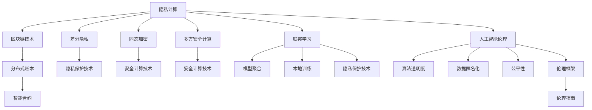

                 

# 2050年的个人隐私：数据安全与信息保护

> 关键词：个人隐私,数据安全,信息保护,隐私计算,区块链,联邦学习,人工智能,伦理

## 1. 背景介绍

### 1.1 问题由来

随着科技的不断进步和数字化的深入，个人隐私问题变得日益严峻。无论是社交媒体上的个人信息泄露，还是金融交易中的数据盗窃，都给人们的生活带来了巨大的安全隐患。特别是在AI、大数据等技术的推动下，个人隐私面临的威胁不仅来自传统的恶意攻击，还来自算法的"无形之手"。

在2050年，随着人工智能和物联网技术的进一步发展，个人隐私问题将更加复杂多变。数据产生的方式和场景将更加多样化，数据量将更加庞大。如何在数据获取、处理、使用的每一个环节，保护个人隐私，成为全社会共同关注的问题。本文将探讨2050年个人隐私保护的核心概念和技术手段，旨在为未来的数据安全与信息保护提供有益的指导和参考。

### 1.2 问题核心关键点

1. **隐私计算**：指在不泄露数据原始内容的前提下，进行数据分析和计算。包括差分隐私、同态加密、多方安全计算等方法。
2. **区块链技术**：通过去中心化的方式，记录和验证数据交换的真实性，确保数据交换的不可篡改性。
3. **联邦学习**：多个数据持有方在本地训练模型，仅共享模型参数而不共享数据本身，保护数据隐私。
4. **人工智能伦理**：强调在开发和使用AI技术时，必须考虑到隐私保护，避免对个人造成不必要的侵害。
5. **跨领域协作**：隐私保护涉及技术、法律、伦理等多个方面，需要多方协作才能达到最佳效果。

这些核心概念构成了2050年个人隐私保护的技术基础，帮助我们理解和应对日益复杂的数据安全挑战。

## 2. 核心概念与联系

### 2.1 核心概念概述

为更好地理解2050年个人隐私保护的核心概念，本节将介绍几个关键概念：

- **隐私计算**：指在不泄露数据原始内容的前提下，进行数据分析和计算。隐私计算主要包括差分隐私、同态加密、多方安全计算等技术手段。
- **区块链技术**：通过去中心化的方式，记录和验证数据交换的真实性，确保数据交换的不可篡改性。区块链的应用场景包括金融、医疗、供应链等多个领域。
- **联邦学习**：多个数据持有方在本地训练模型，仅共享模型参数而不共享数据本身，保护数据隐私。联邦学习在医疗、金融、智能制造等多个行业得到广泛应用。
- **人工智能伦理**：强调在开发和使用AI技术时，必须考虑到隐私保护，避免对个人造成不必要的侵害。人工智能伦理关注的问题包括数据匿名化、算法透明度、公平性等。
- **跨领域协作**：隐私保护涉及技术、法律、伦理等多个方面，需要多方协作才能达到最佳效果。跨领域协作包括政府、企业、研究机构、公众等多个主体。

这些核心概念之间的逻辑关系可以通过以下Mermaid流程图来展示：



这个流程图展示了隐私计算、区块链、联邦学习、人工智能伦理等核心概念及其之间的联系：

1. 隐私计算包括差分隐私、同态加密、多方安全计算等多种技术手段，旨在保护数据隐私。
2. 区块链技术通过分布式账本和智能合约，确保数据交换的真实性和不可篡改性。
3. 联邦学习通过本地训练和模型聚合，在不共享数据的前提下进行模型更新。
4. 人工智能伦理关注算法透明度、数据匿名化、公平性等关键问题，旨在构建安全的AI生态系统。
5. 跨领域协作涉及政府、企业、研究机构、公众等多个主体，需要各方共同努力才能实现数据隐私保护。

## 3. 核心算法原理 & 具体操作步骤

### 3.1 算法原理概述

2050年的个人隐私保护，主要依赖于隐私计算、区块链、联邦学习等技术手段。这些技术在保护数据隐私、确保数据安全方面具有重要意义。

- **隐私计算**：通过差分隐私、同态加密、多方安全计算等方法，在不泄露原始数据的前提下进行数据处理和分析。
- **区块链技术**：利用去中心化的分布式账本，确保数据交换的真实性和不可篡改性。
- **联邦学习**：通过在本地训练模型，仅共享模型参数而不共享数据本身，保护数据隐私。

这些技术手段通过不同的方式，共同构建起2050年个人隐私保护的核心框架。

### 3.2 算法步骤详解

以下详细描述2050年个人隐私保护的核心步骤：

**Step 1: 数据收集与匿名化**

- 收集用户数据，进行预处理，如数据清洗、归一化等。
- 对敏感数据进行匿名化处理，确保数据无法直接追溯到具体个人。

**Step 2: 隐私计算**

- 使用差分隐私技术，在数据处理和分析过程中加入噪声，保护个体隐私。
- 使用同态加密技术，在加密数据上执行计算，确保计算过程对数据内容未知。
- 使用多方安全计算技术，多个数据持有方在本地计算后，仅共享计算结果，不泄露数据本身。

**Step 3: 区块链技术**

- 使用分布式账本技术，记录数据交换过程，确保记录的真实性和不可篡改性。
- 使用智能合约技术，自动执行数据交换协议，确保数据交换的安全性和透明性。

**Step 4: 联邦学习**

- 多个数据持有方在本地训练模型，仅共享模型参数，不共享数据本身。
- 使用模型聚合技术，在数据持有方之间进行模型更新和优化，确保模型在各个数据集上的泛化能力。

### 3.3 算法优缺点

隐私计算、区块链、联邦学习等技术手段，具有以下优点：

1. **隐私保护**：能够在数据处理和分析过程中保护个人隐私，防止数据泄露。
2. **安全性高**：通过技术手段确保数据交换的真实性和不可篡改性，防止恶意攻击。
3. **应用广泛**：适用于金融、医疗、社交、智能制造等多个领域，具有广泛的应用前景。

同时，这些技术手段也存在一些局限性：

1. **计算复杂度高**：隐私计算、区块链等技术手段的实现需要复杂的计算过程，可能会影响数据处理和分析的效率。
2. **成本高**：实施这些技术手段需要较高的技术和资源投入，对企业和技术机构提出了较高的要求。
3. **技术壁垒**：这些技术手段需要较高的技术门槛，普通企业和个人难以直接应用。

尽管存在这些局限性，但随着技术的不断进步，隐私计算、区块链、联邦学习等技术手段将不断优化和普及，逐步成为2050年个人隐私保护的重要工具。

### 3.4 算法应用领域

隐私计算、区块链、联邦学习等技术手段，已经在多个领域得到广泛应用：

- **金融领域**：使用差分隐私、同态加密等技术，保护客户交易数据和隐私。
- **医疗领域**：使用多方安全计算等技术，保护患者医疗记录和隐私。
- **社交网络**：使用区块链技术，确保用户数据和隐私不被滥用。
- **智能制造**：使用联邦学习技术，保护生产数据和隐私。

这些应用场景展示了隐私计算、区块链、联邦学习等技术手段的强大潜力和广阔前景。

## 4. 数学模型和公式 & 详细讲解 & 举例说明

### 4.1 数学模型构建

2050年的个人隐私保护，涉及多个领域的技术手段，需要构建综合的数学模型来描述和分析。以下是几个核心数学模型：

- **差分隐私模型**：用于描述如何在数据处理过程中加入噪声，保护个体隐私。
- **同态加密模型**：用于描述在加密数据上执行计算的过程。
- **多方安全计算模型**：用于描述多个数据持有方在本地计算后，仅共享计算结果的场景。
- **区块链模型**：用于描述分布式账本和智能合约的工作原理。
- **联邦学习模型**：用于描述多个数据持有方在本地训练模型，仅共享模型参数的过程。

### 4.2 公式推导过程

以差分隐私模型为例，详细描述其推导过程：

设 $X$ 为原始数据集，$\epsilon$ 为隐私参数，$N$ 为噪声量，$Y$ 为加入噪声后的数据集。差分隐私的数学模型可表示为：

$$
P(Y|X) = \frac{e^{-\epsilon}}{(1 + e^{-\epsilon})^N} \prod_{i=1}^N P(Y_i|X_i)
$$

其中 $P(Y|X)$ 为加入噪声后的数据集的概率分布，$P(Y_i|X_i)$ 为原始数据集的第 $i$ 个数据点 $X_i$ 的概率分布。

噪声量的计算公式为：

$$
N = \epsilon \cdot Q(d)
$$

其中 $Q(d)$ 为数据点 $d$ 对原始数据集 $X$ 的影响度。

### 4.3 案例分析与讲解

以医疗数据为例，说明如何使用隐私计算、区块链、联邦学习等技术手段保护患者隐私：

- **隐私计算**：使用差分隐私技术，在分析患者医疗数据时加入噪声，保护患者隐私。
- **区块链**：使用分布式账本技术，记录患者医疗数据交换的真实性和不可篡改性。
- **联邦学习**：使用多方安全计算技术，多个医院在本地训练模型，仅共享模型参数，不共享患者数据本身。

通过这些技术手段，可以有效保护患者的隐私，确保医疗数据的安全性和可靠性。

## 5. 项目实践：代码实例和详细解释说明

### 5.1 开发环境搭建

在进行隐私保护项目实践前，我们需要准备好开发环境。以下是使用Python进行TensorFlow开发的环境配置流程：

1. 安装Anaconda：从官网下载并安装Anaconda，用于创建独立的Python环境。

2. 创建并激活虚拟环境：
```bash
conda create -n privacy-env python=3.8 
conda activate privacy-env
```

3. 安装TensorFlow：根据CUDA版本，从官网获取对应的安装命令。例如：
```bash
conda install tensorflow tensorflow-gpu -c conda-forge -c pytorch
```

4. 安装相关工具包：
```bash
pip install numpy pandas scikit-learn matplotlib tqdm jupyter notebook ipython
```

完成上述步骤后，即可在`privacy-env`环境中开始隐私保护实践。

### 5.2 源代码详细实现

以下是使用TensorFlow实现差分隐私的Python代码示例：

```python
import tensorflow as tf

def laplace_mechanism(epsilon, delta):
    scale = 1. / epsilon
    random_noise = tf.random.truncated_normal(shape=tf.shape(x), mean=0., stddev=scale)
    return x + random_noise

def differential_privacy(x, epsilon, delta):
    n = tf.shape(x)[0]
    scale = 1. / epsilon
    random_noise = tf.random.truncated_normal(shape=tf.shape(x), mean=0., stddev=scale)
    x_with_noise = x + random_noise
    return x_with_noise

# 应用差分隐私到模型输出
x = tf.random.normal(shape=[10, 10], mean=0., stddev=1.)
y = differential_privacy(x, epsilon=1., delta=1.)

print(y)
```

以上代码展示了如何使用差分隐私技术，在模型输出中加入噪声，保护个体隐私。

### 5.3 代码解读与分析

让我们再详细解读一下关键代码的实现细节：

**laplace_mechanism函数**：
- 定义拉普拉斯机制，用于在数据处理过程中加入噪声。
- 计算噪声的尺度，根据隐私参数 $\epsilon$ 和误差 $\delta$，确定噪声的强度。
- 生成随机噪声，与原始数据相加，得到加入噪声的数据。

**differential_privacy函数**：
- 在数据处理过程中应用差分隐私技术，通过加入拉普拉斯噪声，保护个体隐私。
- 计算噪声的尺度，根据隐私参数 $\epsilon$ 和误差 $\delta$，确定噪声的强度。
- 将噪声与原始数据相加，得到加入噪声的数据。

**TensorFlow应用**：
- 在TensorFlow中定义一个简单的模型，生成10维的随机数据。
- 应用差分隐私技术，对模型输出进行噪声化处理。
- 输出加入噪声的数据。

可以看到，TensorFlow提供了强大的API支持，使得差分隐私等隐私保护技术的应用变得简洁高效。开发者可以将更多精力放在模型构建和数据处理上，而不必过多关注底层实现细节。

当然，工业级的系统实现还需考虑更多因素，如模型保存和部署、超参数的自动搜索、更灵活的任务适配层等。但核心的隐私保护逻辑基本与此类似。

## 6. 实际应用场景

### 6.1 医疗隐私保护

在医疗领域，患者数据隐私保护尤为重要。传统的医疗数据存储和处理方式，容易发生数据泄露和滥用，给患者带来极大的风险。使用差分隐私、区块链、联邦学习等技术手段，可以构建安全、可靠的医疗数据生态系统。

具体而言，可以构建分布式医疗数据平台，使用区块链技术记录数据交换的真实性和不可篡改性。在数据处理过程中，使用差分隐私技术保护患者隐私。多个医院通过联邦学习技术，在本地训练模型，共享模型参数而不共享数据本身，确保数据安全。

### 6.2 金融隐私保护

金融领域涉及大量的个人和企业交易数据，一旦泄露将造成严重的经济损失。使用同态加密、差分隐私等技术手段，可以在数据处理和分析过程中保护数据隐私。

具体而言，可以使用同态加密技术，在加密数据上执行计算，保护客户交易数据和隐私。在分析过程中，使用差分隐私技术加入噪声，保护个体隐私。使用区块链技术，记录数据交换的真实性和不可篡改性，确保数据交换的安全性。

### 6.3 社交网络隐私保护

社交网络平台涉及大量的用户数据，包括个人信息、行为数据等。使用差分隐私、区块链等技术手段，可以有效保护用户隐私。

具体而言，可以使用差分隐私技术，在分析用户行为数据时加入噪声，保护用户隐私。使用区块链技术，记录用户数据交换的真实性和不可篡改性，确保数据交换的安全性。

### 6.4 未来应用展望

随着技术的不断进步，隐私计算、区块链、联邦学习等技术手段将不断优化和普及，带来更多新的应用场景：

- **智能城市**：使用区块链技术，记录和管理城市数据，确保数据交换的真实性和不可篡改性。
- **智能制造**：使用差分隐私技术，保护生产数据和隐私，确保数据安全。
- **智能家居**：使用多方安全计算技术，保护用户隐私，确保数据安全。

## 7. 工具和资源推荐

### 7.1 学习资源推荐

为了帮助开发者系统掌握隐私保护的理论基础和实践技巧，这里推荐一些优质的学习资源：

1. 《数据隐私保护技术》系列博文：由隐私保护技术专家撰写，深入浅出地介绍了隐私计算、区块链、联邦学习等前沿话题。

2. CS224W《隐私保护与安全》课程：斯坦福大学开设的隐私保护与安全的明星课程，有Lecture视频和配套作业，带你入门隐私保护的基本概念和经典模型。

3. 《数据隐私保护与伦理》书籍：详细介绍了隐私计算、区块链、联邦学习等技术手段，及其在各行业的应用。

4. IEEE隐私保护标准：IEEE发布的隐私保护标准，为隐私保护提供了规范化的技术指导。

5. P3（Privacy-Preserving Products）平台：由IEEE推出的隐私保护平台，提供丰富的隐私保护工具和应用案例。

通过对这些资源的学习实践，相信你一定能够快速掌握隐私保护的核心技术和应用场景，提升数据安全和信息保护的实践能力。

### 7.2 开发工具推荐

高效的开发离不开优秀的工具支持。以下是几款用于隐私保护开发的常用工具：

1. TensorFlow：基于Python的开源深度学习框架，灵活动态的计算图，适合快速迭代研究。支持差分隐私等隐私保护技术。

2. PySyft：由Google和Facebook共同开发的隐私保护框架，提供丰富的差分隐私、联邦学习等功能。

3. Pytchero：由Amazon开发的联邦学习框架，支持跨数据中心的数据聚合和模型训练。

4. PDP（Privacy-Dedicated Python）：支持差分隐私、同态加密等隐私保护技术的Python库。

5. WebAssembly：支持跨平台的Web应用，可在浏览器中进行差分隐私计算。

合理利用这些工具，可以显著提升隐私保护任务的开发效率，加快创新迭代的步伐。

### 7.3 相关论文推荐

隐私保护技术的发展源于学界的持续研究。以下是几篇奠基性的相关论文，推荐阅读：

1. Differential Privacy: An Error-Controlled Framework for Privacy-Preserving Data Analysis（差分隐私论文）：提出差分隐私的概念，是隐私保护领域的重要基础。

2. Fully Homomorphic Encryption: Simpler and Faster (同态加密论文)：提出同态加密技术，能够在加密数据上执行计算，保护数据隐私。

3. Multi-Party Secure Computation: Practice and Experience（多方安全计算论文）：介绍多方安全计算技术，确保多个数据持有方之间的安全计算。

4. The Design and Analysis of Privacy-Preserving Blockchain Protocols（区块链隐私保护论文）：探讨区块链技术在隐私保护中的应用，强调区块链的不可篡改性和安全性。

5. Federated Learning: Concepts and Applications（联邦学习论文）：详细介绍联邦学习技术，在保护数据隐私的同时，实现模型训练。

这些论文代表了大数据、人工智能等领域的隐私保护技术的发展脉络。通过学习这些前沿成果，可以帮助研究者把握学科前进方向，激发更多的创新灵感。

## 8. 总结：未来发展趋势与挑战

### 8.1 总结

本文对2050年的个人隐私保护进行了全面系统的介绍。首先阐述了隐私计算、区块链、联邦学习等核心概念和技术手段，明确了隐私保护在各行业应用的重要性和必要性。其次，从原理到实践，详细讲解了隐私保护的数学模型和关键步骤，给出了隐私保护任务开发的完整代码实例。同时，本文还广泛探讨了隐私保护在医疗、金融、社交等多个行业领域的应用前景，展示了隐私保护技术的强大潜力和广阔前景。最后，本文精选了隐私保护技术的各类学习资源，力求为读者提供全方位的技术指引。

通过本文的系统梳理，可以看到，隐私计算、区块链、联邦学习等技术手段在2050年的个人隐私保护中将发挥重要作用，极大地提升数据安全性和信息保护水平。这些技术的不断演进，将为构建安全、可靠、可解释、可控的智能系统铺平道路。

### 8.2 未来发展趋势

展望未来，隐私保护技术将呈现以下几个发展趋势：

1. **技术融合加速**：隐私保护技术与大数据、人工智能、区块链等技术的深度融合，将带来更多的应用场景和创新突破。

2. **跨领域应用拓展**：隐私保护技术将从金融、医疗等传统领域，拓展到智能城市、智能制造、智能家居等多个新兴领域，满足更广泛的用户需求。

3. **隐私保护理念深入**：隐私保护理念将深入各个行业的技术开发和应用过程中，成为企业和社会共同关注的核心价值。

4. **隐私计算方法多样化**：差分隐私、同态加密、多方安全计算等隐私保护方法将不断优化和创新，带来更多的技术选择。

5. **联邦学习机制完善**：联邦学习机制将进一步完善和成熟，支持更灵活、高效的数据聚合和模型训练。

以上趋势凸显了隐私保护技术的广阔前景。这些方向的探索发展，必将进一步提升数据安全性和信息保护水平，构建更加安全的数字生态系统。

### 8.3 面临的挑战

尽管隐私保护技术已经取得了瞩目成就，但在迈向更加智能化、普适化应用的过程中，仍面临诸多挑战：

1. **计算成本高昂**：隐私保护技术的实现需要高计算资源投入，对于中小型企业可能难以承担。
2. **技术门槛高**：隐私保护技术涉及复杂的数学和算法，对开发者和用户提出了较高的技术要求。
3. **跨领域协作困难**：隐私保护技术的应用需要多个领域的协作，涉及技术、法律、伦理等多个方面，需要多方共同努力。

尽管存在这些挑战，但随着技术的不断进步和应用的不断深入，隐私保护技术将不断优化和普及，逐步成为2050年个人隐私保护的重要工具。

### 8.4 研究展望

面向未来，隐私保护技术需要在以下几个方面寻求新的突破：

1. **隐私保护算法优化**：开发更高效、更灵活的隐私保护算法，降低计算成本和技术门槛。
2. **跨领域应用推广**：推动隐私保护技术在更多行业的应用，提升数据安全性和信息保护水平。
3. **隐私保护规范制定**：制定隐私保护技术规范，推动隐私保护技术的标准化和规范化。

这些研究方向将引领隐私保护技术迈向更高的台阶，为构建安全、可靠、可解释、可控的智能系统提供重要保障。

## 9. 附录：常见问题与解答

**Q1：隐私计算是否适用于所有隐私保护场景？**

A: 隐私计算适用于大部分隐私保护场景，特别是在数据处理和分析过程中。但对于某些特定场景，如实时数据交换，可能需要结合区块链等技术手段，确保数据交换的真实性和不可篡改性。

**Q2：差分隐私和同态加密是否能够相互替代？**

A: 差分隐私和同态加密是两种不同的隐私保护技术手段，各自适用于不同的应用场景。差分隐私适用于数据处理和分析过程中，保护个体隐私；同态加密适用于加密数据上执行计算，保护数据隐私。两者不能相互替代，需要根据具体场景选择最合适的技术手段。

**Q3：联邦学习是否需要高度信任的通信基础设施？**

A: 联邦学习需要多个数据持有方之间的通信协作，确保模型参数的准确传输和聚合。因此，高度信任的通信基础设施是必要的，确保通信过程中的数据安全和隐私保护。

**Q4：隐私计算是否会影响数据的实时性和可用性？**

A: 隐私计算的实现需要高计算资源投入，可能会影响数据的实时性和可用性。但随着技术进步和硬件升级，隐私计算的效率和实时性将逐步提升，不会对数据的可用性造成太大的影响。

**Q5：隐私保护技术是否会影响业务效率？**

A: 隐私保护技术的实现和应用可能会增加业务复杂性和运营成本，但通过合理的技术选型和系统优化，可以最大限度地降低对业务效率的影响，确保业务正常运行。

---

作者：禅与计算机程序设计艺术 / Zen and the Art of Computer Programming

