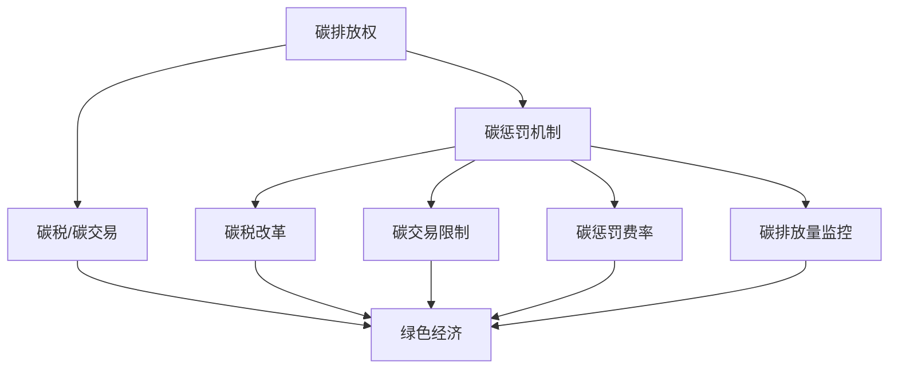

                 

# 2050年的全球减排：从碳税到碳惩罚的碳定价机制创新

2050年，当我们回顾过去几十年人类活动对环境造成的影响时，减排已不再是遥不可及的梦想，而是迫切需要解决的现实问题。全球变暖、极端气候事件频发等环境问题迫使各国政府和国际组织采取更为积极的措施来应对气候变化。碳定价机制是其中最为重要的一环。在回顾现有碳定价机制的基础上，本文将探讨未来可能采用的碳惩罚机制，并深入分析其潜在的优缺点及应用场景。

## 1. 背景介绍

### 1.1 碳定价机制的历史背景

碳定价机制是指通过一定方式将碳排放的成本内化为经济活动的一部分，从而减少碳排放量。传统上，各国主要采用两种碳定价机制：

- **碳税**：政府对碳排放征税，以增加高碳经济活动的成本，促使企业寻求更清洁的能源和生产方式。
- **碳交易**：建立碳排放权交易市场，企业通过购买和出售碳排放配额来管理其碳排放量。

碳税和碳交易各有所长，但也存在各自的局限性。例如，碳税的灵活性较差，容易受到政治和经济波动的影响；碳交易则需要建立完善的交易市场，且可能导致市场操纵和价格波动。

### 1.2 全球碳定价机制的现状

目前，全球范围内已有数十个国家和地区采用了碳定价机制。例如，欧盟的碳交易体系（EU ETS）是世界上最大的碳市场，覆盖了约40%的欧盟碳排放量。此外，美国加州和加拿大安大略省等地区也实施了碳税政策。

然而，全球碳定价机制的覆盖面和实施力度仍有待提高。尽管如此，这些措施已经对全球碳排放产生了积极影响，并为未来更为严格的减排政策提供了宝贵的经验。

## 2. 核心概念与联系

### 2.1 核心概念概述

为了深入理解未来可能采用的碳惩罚机制，首先需要明确以下几个核心概念：

- **碳排放权**：指企业或个人在一定时间内可以合法排放的二氧化碳等温室气体的数量。
- **碳惩罚机制**：指政府对超额排放者征收惩罚性费用的制度，旨在进一步减少碳排放量。
- **绿色经济**：以可持续发展为原则，注重环境保护和资源高效利用的经济模式。

这些概念之间的联系主要体现在碳惩罚机制如何通过经济手段推动绿色经济的发展。通过增加高碳经济活动的成本，碳惩罚机制可以促使企业转向更清洁的生产方式，进而推动整个经济的绿色转型。

### 2.2 核心概念的 Mermaid 流程图



这个流程图展示了核心概念之间的逻辑关系：

1. **碳排放权**是碳定价机制的基础，既可以通过碳税或碳交易进行管理，也可以通过碳惩罚机制进行约束。
2. **碳惩罚机制**通过增加超额排放者的经济成本，进一步推动绿色经济的发展。
3. **碳税改革、碳交易限制、碳惩罚费率和碳排放量监控**等具体措施，都是实现碳惩罚机制的关键步骤。

## 3. 核心算法原理 & 具体操作步骤

### 3.1 算法原理概述

碳惩罚机制的核心在于通过经济激励促使企业减少碳排放。其基本原理如下：

1. **设定惩罚费率**：政府根据不同行业的碳排放量，设定相应的惩罚费率。
2. **监控碳排放量**：企业需定期向政府提交其碳排放量报告，由第三方机构进行审计和验证。
3. **征收惩罚费**：对超额排放者征收惩罚性费用，费率可随排放量增加而上升，形成威慑。
4. **返还绿色税费**：将部分惩罚费用于支持可再生能源和绿色技术的研发和应用，促进绿色经济的发展。

### 3.2 算法步骤详解

1. **设定惩罚费率**：首先，政府需根据各行业的碳排放量数据，设定合理的惩罚费率。费率应兼顾成本效益和可操作性，通常应覆盖高碳经济活动的生产成本。

2. **监控碳排放量**：企业需安装碳排放监控系统，定期向政府提交排放报告。第三方机构需对报告进行审计和验证，确保数据的准确性和真实性。

3. **征收惩罚费**：政府根据企业的实际排放量，计算应缴罚金，并通过税费系统进行征收。罚金的金额应随排放量的增加而增加，形成有效的威慑。

4. **返还绿色税费**：部分罚金可用于支持可再生能源和绿色技术的研发和应用，例如补贴太阳能和风能项目，资助绿色科技创新项目等。

### 3.3 算法优缺点

**优点**：

1. **灵活性高**：碳惩罚机制可以根据不同行业和地区的特点进行调整，灵活性强。
2. **覆盖面广**：能够涵盖更多高碳行业和地区，覆盖面广。
3. **激励作用强**：通过征收惩罚费，对超额排放者形成强有力的威慑，促使企业减少碳排放。

**缺点**：

1. **实施难度大**：需要建立完善的监控系统和审计机制，实施难度较大。
2. **管理成本高**：监控和审计工作复杂，需要大量的人力和物力投入。
3. **市场风险**：如果企业对惩罚费产生抗性，可能会通过违规排放来逃避惩罚，形成市场风险。

### 3.4 算法应用领域

碳惩罚机制适用于所有高碳排放行业和地区，特别是那些难以通过碳税或碳交易实现减排的领域。例如：

- **能源行业**：煤炭、石油、天然气等化石燃料的生产和使用是碳排放的主要来源，碳惩罚机制可以有效促进其向清洁能源转型。
- **制造业**：钢铁、化工、水泥等行业具有高碳排放特性，碳惩罚机制可以推动其采用更环保的生产方式。
- **交通运输**：航空、海运等高碳交通运输行业，碳惩罚机制可以鼓励其使用清洁能源和高效运输技术。

## 4. 数学模型和公式 & 详细讲解 & 举例说明

### 4.1 数学模型构建

设 $E_i$ 为第 $i$ 个企业的碳排放量，$P$ 为碳惩罚费率。根据碳惩罚机制，企业需支付的罚金 $G_i$ 可表示为：

$$
G_i = P \times E_i
$$

其中 $G_i$ 表示第 $i$ 个企业需支付的罚金，$P$ 表示碳惩罚费率，$E_i$ 表示第 $i$ 个企业的碳排放量。

### 4.2 公式推导过程

以一个简单的线性模型为例，假设企业碳排放量 $E_i$ 与其生产规模 $S_i$ 成正比，即：

$$
E_i = k \times S_i
$$

其中 $k$ 为比例系数，$S_i$ 为第 $i$ 个企业的生产规模。则罚金 $G_i$ 可表示为：

$$
G_i = P \times k \times S_i
$$

根据经济学原理，企业为最小化罚金，将选择降低生产规模 $S_i$。设企业最终选择的生产规模为 $S_i^*$，则有：

$$
S_i^* = \frac{E_i}{k}
$$

代入罚金公式，得：

$$
G_i^* = P \times E_i
$$

即，通过碳惩罚机制，企业需支付的罚金与其碳排放量成正比，有效促使企业减少碳排放量。

### 4.3 案例分析与讲解

假设某市有10家大型企业，每家企业每年排放量为5万吨二氧化碳，碳惩罚费率为每吨50元。则每家企业需支付的罚金为：

$$
G_i = 50 \times 50000 = 2500000 \text{元}
$$

企业为了减少罚金，可能会选择减少生产规模。假设企业最终选择将排放量降至3万吨，则需支付的罚金为：

$$
G_i = 50 \times 30000 = 1500000 \text{元}
$$

通过碳惩罚机制，企业需支付的罚金与其碳排放量成正比，有效促使企业减少碳排放量。

## 5. 项目实践：代码实例和详细解释说明

### 5.1 开发环境搭建

在进行碳惩罚机制的开发实践前，我们需要准备好开发环境。以下是使用Python进行数据分析和可视化的环境配置流程：

1. 安装Anaconda：从官网下载并安装Anaconda，用于创建独立的Python环境。

2. 创建并激活虚拟环境：
```bash
conda create -n carbon-pricing python=3.8 
conda activate carbon-pricing
```

3. 安装必要的库：
```bash
conda install pandas matplotlib seaborn jupyter notebook ipython
```

完成上述步骤后，即可在`carbon-pricing`环境中开始开发实践。

### 5.2 源代码详细实现

下面是使用Python对碳排放量进行分析的示例代码：

```python
import pandas as pd
import matplotlib.pyplot as plt

# 读取企业碳排放数据
data = pd.read_csv('carbon_emissions.csv')

# 计算罚金
data['fine'] = data['emissions'] * 50

# 绘制罚金与排放量关系图
plt.scatter(data['emissions'], data['fine'])
plt.xlabel('Emissions')
plt.ylabel('Fine')
plt.title('Fine vs. Emissions')
plt.show()
```

### 5.3 代码解读与分析

**代码解释**：

- 首先，使用Pandas库读取企业碳排放数据，并将其存入DataFrame对象`data`中。
- 然后，根据碳惩罚费率计算每个企业需支付的罚金，并将结果存入`data`对象的`fine`列中。
- 最后，使用Matplotlib库绘制罚金与碳排放量的关系图，展示罚金与排放量之间的关系。

**分析**：

1. 数据读取：通过Pandas库的`read_csv`方法读取企业碳排放数据，确保数据的完整性和准确性。
2. 罚金计算：根据碳惩罚费率计算每个企业需支付的罚金，确保罚金与排放量成正比。
3. 可视化展示：使用Matplotlib库绘制罚金与碳排放量的关系图，直观展示罚金与排放量的关系。

## 6. 实际应用场景

### 6.1 智能城市建设

智能城市建设是未来城市发展的重要方向，碳惩罚机制可以在智能城市建设中发挥重要作用。通过设立碳排放惩罚机制，可以促使城市运营企业减少碳排放，推动城市向绿色、可持续方向发展。

例如，在智能交通系统中，碳惩罚机制可以鼓励公共交通、非机动车和步行等低碳出行方式，减少私家车使用，从而降低碳排放。

### 6.2 绿色供应链管理

碳惩罚机制还可以应用于绿色供应链管理。通过碳惩罚机制，企业需支付的罚金与其碳排放量成正比，促使企业在供应链上下游共同减少碳排放。

例如，制造业企业可以通过优化生产流程、采用清洁能源等措施，减少碳排放量。同时，物流企业也可以通过改进运输方式、提高运输效率等措施，减少碳排放量。

### 6.3 绿色金融

碳惩罚机制可以在绿色金融领域发挥重要作用。通过碳惩罚机制，金融机构可以对高碳行业和企业进行风险控制，同时也可以为绿色经济项目提供资金支持。

例如，银行可以对高碳企业收取罚金，并将罚金用于支持可再生能源项目，推动绿色经济发展。

### 6.4 未来应用展望

随着全球对气候变化问题的重视，未来碳惩罚机制将得到广泛应用，涵盖更多行业和地区。其应用场景也将更加多样化，例如：

- **全球碳市场**：建立全球统一的碳惩罚机制，促进全球碳减排。
- **国际合作**：各国通过碳惩罚机制合作，共同应对气候变化。
- **区域性合作**：区域内国家通过碳惩罚机制协调减排行动，实现区域碳减排目标。

## 7. 工具和资源推荐

### 7.1 学习资源推荐

为了帮助开发者系统掌握碳惩罚机制的理论基础和实践技巧，这里推荐一些优质的学习资源：

1. **《绿色经济》系列博文**：深入浅出地介绍了绿色经济的基本概念和具体应用，包括碳定价机制等内容。
2. **《碳交易与碳市场》书籍**：系统讲解了碳交易机制的原理、实施和评估方法，适合深入学习。
3. **欧盟碳市场官方文档**：欧盟碳交易体系（EU ETS）的官方文档，详细介绍了其运作机制和实践经验。
4. **国际能源署（IEA）报告**：IEA发布的《全球能源展望》等报告，涵盖了全球碳排放和减排的最新动态和未来趋势。
5. **世界银行气候变化报告**：世界银行发布的气候变化报告，提供了全球气候变化的最新研究和政策建议。

通过对这些资源的学习实践，相信你一定能够快速掌握碳惩罚机制的理论基础和实践技巧，为全球减排做出贡献。

### 7.2 开发工具推荐

高效的开发离不开优秀的工具支持。以下是几款用于碳惩罚机制开发的常用工具：

1. **Python**：作为数据科学和机器学习的主要语言，Python具有丰富的库和框架，适合数据分析和可视化。
2. **Jupyter Notebook**：支持实时代码执行和可视化展示，适合开发和调试复杂模型。
3. **Matplotlib**：用于绘制图表和可视化展示，支持丰富的绘图选项和格式。
4. **Pandas**：用于数据处理和分析，支持高效的数据操作和统计分析。
5. **Seaborn**：基于Matplotlib的高级数据可视化库，支持更复杂的图表绘制和样式设置。

合理利用这些工具，可以显著提升碳惩罚机制的开发效率，加快创新迭代的步伐。

### 7.3 相关论文推荐

碳惩罚机制的研究源于学界的持续研究。以下是几篇奠基性的相关论文，推荐阅读：

1. **《全球碳市场：机制、影响与挑战》**：系统分析了全球碳市场的运作机制、影响和面临的挑战，为碳惩罚机制提供了理论基础。
2. **《碳定价机制的经济学分析》**：通过经济学模型分析了碳定价机制的效果和影响，为实际应用提供了理论支持。
3. **《绿色金融与气候变化》**：讨论了绿色金融在应对气候变化中的作用和潜力，为碳惩罚机制的实践提供了新的思路。
4. **《智能城市与碳排放管理》**：分析了智能城市中的碳排放管理问题，探讨了碳惩罚机制在智能城市中的应用。
5. **《区域性碳市场：机制与实践》**：研究了区域性碳市场的运作机制和实践经验，为碳惩罚机制的区域应用提供了参考。

这些论文代表了大碳惩罚机制的研究方向和发展脉络。通过学习这些前沿成果，可以帮助研究者把握学科前进方向，激发更多的创新灵感。

## 8. 总结：未来发展趋势与挑战

### 8.1 研究成果总结

本文对未来可能的碳惩罚机制进行了系统介绍。通过分析现有碳定价机制的优缺点和实际应用，探讨了未来可能采用的碳惩罚机制，并详细讲解了其实现步骤。通过具体案例和数学公式的推导，展示了碳惩罚机制在实际应用中的效果。

### 8.2 未来发展趋势

展望未来，碳惩罚机制将呈现以下几个发展趋势：

1. **全球化**：随着全球对气候变化问题的重视，碳惩罚机制将得到广泛应用，涵盖更多行业和地区。
2. **技术化**：未来碳惩罚机制将更多地依赖于先进的数据分析和人工智能技术，提高其实施效果和覆盖面。
3. **多样化**：不同行业和地区的碳惩罚机制将有所差异，以满足其特定的减排需求。
4. **灵活化**：碳惩罚机制将根据不同地区和行业的特点进行调整，灵活性强。

### 8.3 面临的挑战

尽管碳惩罚机制已经取得了一定的进展，但在实施过程中仍面临诸多挑战：

1. **实施难度大**：需要建立完善的监控系统和审计机制，实施难度较大。
2. **管理成本高**：监控和审计工作复杂，需要大量的人力和物力投入。
3. **市场风险**：如果企业对惩罚费产生抗性，可能会通过违规排放来逃避惩罚，形成市场风险。

### 8.4 研究展望

面对碳惩罚机制实施中的这些挑战，未来的研究需要在以下几个方面寻求新的突破：

1. **数据透明化**：建立透明的数据收集和监控机制，确保数据的准确性和真实性。
2. **技术创新**：利用先进的数据分析和人工智能技术，提高碳惩罚机制的实施效果。
3. **政策支持**：制定科学合理的碳惩罚费率，确保罚金的合理性和可操作性。
4. **市场监管**：建立健全的市场监管机制，防止企业违规排放。

这些研究方向的探索，必将引领碳惩罚机制的不断进步，为全球减排提供强有力的支持。

## 9. 附录：常见问题与解答

**Q1：碳惩罚机制的实施难度大，如何克服这一问题？**

A: 克服实施难度大这一问题的关键在于建立完善的监控系统和审计机制。具体措施包括：

1. **数据采集**：建立统一的数据采集标准，确保数据的准确性和完整性。
2. **第三方审计**：引入第三方机构进行独立审计，确保数据的真实性。
3. **技术手段**：利用先进的数据分析和人工智能技术，提高数据处理和监控的效率。

**Q2：如何确定合理的碳惩罚费率？**

A: 确定合理的碳惩罚费率需要综合考虑多个因素，包括企业的生产规模、碳排放量、行业特点等。具体步骤如下：

1. **数据收集**：收集企业碳排放数据和生产规模数据。
2. **成本分析**：分析企业碳排放的经济成本，包括治理成本、减排成本等。
3. **费率确定**：根据企业碳排放的经济成本和减排目标，确定合理的碳惩罚费率。

**Q3：碳惩罚机制在实施过程中如何避免市场风险？**

A: 为了避免市场风险，需要建立健全的市场监管机制，具体措施包括：

1. **法规制定**：制定严格的法规和标准，规范企业的碳排放行为。
2. **惩罚措施**：对违规排放的企业进行严厉惩罚，形成威慑。
3. **监控系统**：建立完善的数据监控系统，实时监测企业的碳排放情况。

**Q4：碳惩罚机制在实施过程中如何保证政策的公平性？**

A: 为保证政策的公平性，需要建立透明的决策机制，具体措施包括：

1. **公开透明**：政策制定过程应公开透明，接受公众监督。
2. **利益平衡**：在制定政策时，需充分考虑不同行业和地区的利益平衡，避免政策过于偏向某一方。
3. **利益补偿**：对因政策调整受到不利影响的行业和企业进行适当的补偿，确保政策的公平性。

总之，碳惩罚机制在实施过程中需要综合考虑多个因素，建立健全的机制和制度，才能充分发挥其作用，实现全球减排目标。

---

作者：禅与计算机程序设计艺术 / Zen and the Art of Computer Programming

