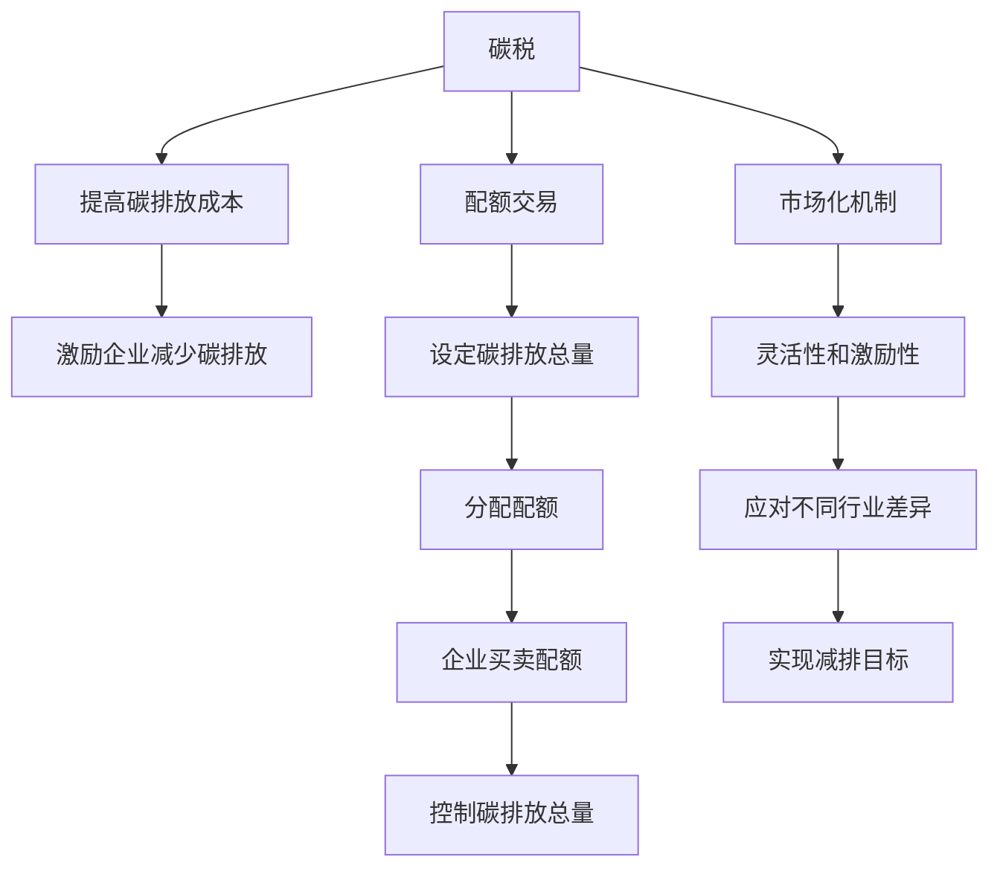

                 

# 2050年的全球减排：从碳税到碳配额交易的市场化减排机制

> 关键词：全球减排,碳税,碳配额交易,市场化机制,能源转型,可持续发展

## 1. 背景介绍

### 1.1 问题由来

全球气候变暖问题日益严峻，温室气体排放已经成为影响人类生存和发展的重大挑战。各国政府、国际组织以及全球企业都在积极探索有效的减排路径。作为全球碳排放主要来源之一的电力行业，其减排策略的制定和执行对于实现全球碳中和目标至关重要。

碳税（Carbon Tax）和碳配额交易（Carbon Cap and Trade）是两种常见的市场化减排机制。碳税通过向企业征收碳排放税，激励其减少碳排放；碳配额交易则通过设定总量限制，对超额排放者征收罚款，对未达到限制者发放配额，实现全球碳排放的减排目标。

本文将详细探讨这两种减排机制的理论基础、应用现状及未来发展趋势，并分析其优缺点及适用领域。

### 1.2 问题核心关键点

- **碳税与碳配额交易**：探讨两种减排机制的理论基础与实际应用。
- **市场化机制**：分析市场化减排机制在电力行业的优势与局限。
- **能源转型**：分析全球能源转型对减排机制的影响及策略。
- **可持续发展**：探讨市场化减排机制在可持续发展中的作用与前景。

## 2. 核心概念与联系

### 2.1 核心概念概述

1. **碳税（Carbon Tax）**：指政府对企业每单位碳排放征收的税费，通过提高碳排放成本，激励企业减少碳排放。

2. **碳配额交易（Carbon Cap and Trade）**：指政府设定碳排放总量上限，分配配额给企业，企业可自由买卖配额，实现碳排放总量的控制。

3. **市场化机制**：通过经济手段实现减排目标，如碳税和碳配额交易，与传统的行政手段相比，市场化机制更具灵活性和激励性。

4. **能源转型**：指从化石能源向可再生能源转型的过程，是实现低碳经济、减少碳排放的重要途径。

5. **可持续发展**：指在满足当代需求的同时，不损害后代人满足需求的能力，注重经济、社会、环境协调发展。

### 2.2 核心概念原理和架构的 Mermaid 流程图



该图展示了碳税和碳配额交易的原理及其实现过程。碳税通过提高碳排放成本激励企业减少碳排放，而碳配额交易则通过总量控制和配额买卖实现减排目标。两者均通过市场化机制提高减排的灵活性和激励性，适应不同行业的特点。

## 3. 核心算法原理 & 具体操作步骤

### 3.1 算法原理概述

#### 3.1.1 碳税原理

碳税的计算公式为：

$$ \text{碳税} = c \times \text{碳排放量} $$

其中，$c$ 为碳税税率，碳排放量以单位碳当量（tonnes of carbon dioxide equivalent, tCO2e）计算。碳税机制的核心在于通过经济手段激励企业减少碳排放，其效果取决于碳税税率的设置和企业的碳排放量。

#### 3.1.2 碳配额交易原理

碳配额交易的核心在于设定碳排放总量上限（cap），分配配额给企业。企业可以根据自身需求买卖配额，实现碳排放总量的控制。配额分配方法包括免费分配和拍卖分配。

碳配额交易的计算公式为：

$$ \text{配额价格} = \frac{\text{碳排放总量}}{\text{总配额数}} \times c $$

其中，$c$ 为配额价格，碳排放总量为设定的上限。配额价格根据市场供需关系和碳排放成本进行调整。

### 3.2 算法步骤详解

#### 3.2.1 碳税步骤

1. **确定碳税税率**：根据当地经济发展水平和碳排放量设定合理的碳税税率。
2. **计算企业碳排放量**：通过排放监测系统，计算企业碳排放量。
3. **征收碳税**：根据企业碳排放量征收碳税。
4. **企业减排决策**：企业根据碳税成本，优化生产流程，减少碳排放。
5. **定期评估**：政府定期评估减排效果，调整碳税税率。

#### 3.2.2 碳配额交易步骤

1. **设定碳排放总量上限**：政府设定碳排放总量上限，分配配额给企业。
2. **配额分配**：通过免费分配或拍卖分配配额。
3. **配额买卖**：企业根据自身需求，买卖配额。
4. **配额更新**：根据企业碳排放量，更新配额数量。
5. **定期评估**：政府定期评估减排效果，调整碳排放总量上限和配额价格。

### 3.3 算法优缺点

#### 3.3.1 碳税的优缺点

**优点**：
- 简单直观，易于实施。
- 通过提高碳排放成本，激励企业主动减少碳排放。
- 可以灵活调整税率，适应经济和环境变化。

**缺点**：
- 可能导致生产成本增加，影响企业竞争力。
- 对小企业影响较大，可能导致不公平竞争。
- 碳税收入使用不当，可能无法有效支持低碳转型。

#### 3.3.2 碳配额交易的优缺点

**优点**：
- 通过市场机制分配配额，企业可以根据自身情况灵活调整减排策略。
- 可以激励企业创新减排技术，降低减排成本。
- 总量控制和配额买卖机制，确保全球碳排放总量逐步减少。

**缺点**：
- 配额分配和买卖机制复杂，实施成本较高。
- 可能导致市场失灵，配额价格波动较大。
- 对大企业依赖性强，小企业可能难以参与。

### 3.4 算法应用领域

碳税和碳配额交易在电力行业、制造业、交通等行业均有广泛应用。在电力行业，碳税和碳配额交易已经成为主要的市场化减排机制。制造业和交通行业也逐渐引入这两种机制，以减少碳排放。

## 4. 数学模型和公式 & 详细讲解 & 举例说明

### 4.1 数学模型构建

#### 4.1.1 碳税模型

假设企业 $i$ 的碳排放量为 $E_i$，碳税税率为 $c$，则企业应缴纳的碳税为：

$$ \text{碳税}_i = c \times E_i $$

### 4.2 公式推导过程

#### 4.2.1 碳税公式推导

根据碳税原理，企业的总碳税成本为：

$$ \text{总碳税成本} = \sum_{i=1}^N c \times E_i $$

其中，$N$ 为企业数量。

#### 4.2.2 碳配额交易公式推导

假设政府设定碳排放总量上限为 $C$，分配给企业 $i$ 的初始配额为 $Q_i$，则配额价格为：

$$ \text{配额价格} = \frac{C}{\sum_{i=1}^N Q_i} $$

企业通过买卖配额，调整碳排放量，设企业 $i$ 的实际排放量为 $E_i'$，则其应缴纳的碳税为：

$$ \text{碳税}_i = c \times E_i' $$

### 4.3 案例分析与讲解

#### 4.3.1 碳税案例

假设某地区设定的碳税税率为 $100\text{元/吨碳当量}$，某企业年碳排放量为 $10,000\text{吨碳当量}$。则该企业应缴纳的碳税为：

$$ \text{碳税} = 100 \times 10,000 = 1,000,000\text{元} $$

#### 4.3.2 碳配额交易案例

假设某地区设定碳排放总量上限为 $100,000\text{吨碳当量}$，政府分配给企业 $i$ 的初始配额为 $20,000\text{吨碳当量}$。某企业年碳排放量为 $25,000\text{吨碳当量}$，市场上配额价格为 $50\text{元/吨碳当量}$。则该企业应缴纳的碳税为：

$$ \text{碳税}_i = c \times E_i' = 100 \times 25,000 = 2,500,000\text{元} $$

同时，该企业可以购买配额 $5,000\text{吨碳当量}$，购买成本为 $250,000\text{元}$，则其实际排放量为 $20,000\text{吨碳当量}$，无需缴纳额外碳税。

## 5. 项目实践：代码实例和详细解释说明

### 5.1 开发环境搭建

为进行碳税和碳配额交易的模拟计算，需要使用Python编程语言和相关库。

1. **安装Python环境**：
   ```bash
   sudo apt-get install python3
   ```

2. **安装相关库**：
   ```bash
   pip install numpy pandas scikit-learn
   ```

3. **配置环境变量**：
   ```bash
   export PYTHONPATH=$PYTHONPATH:/path/to/python/libraries
   ```

### 5.2 源代码详细实现

#### 5.2.1 碳税计算

```python
import numpy as np

# 设定碳税税率
c = 100  # 元/吨碳当量

# 企业碳排放量
E = np.array([10000, 20000, 15000])

# 计算企业碳税
carbon_tax = c * E

print("企业碳税计算结果：", carbon_tax)
```

#### 5.2.2 碳配额交易计算

```python
import numpy as np

# 设定配额数量和碳排放总量上限
Q = np.array([20000, 15000, 30000])
C = 100000  # 吨碳当量

# 计算配额价格
carbon_cap_price = C / np.sum(Q)

# 企业实际排放量和初始配额
E = np.array([25000, 20000, 30000])
Q_i = np.array([20000, 15000, 30000])

# 计算企业应缴纳的碳税
carbon_tax = c * (E - Q_i)

# 计算企业购买配额成本
cost = (E - Q_i) * carbon_cap_price

print("企业碳税计算结果：", carbon_tax)
print("企业购买配额成本：", cost)
```

### 5.3 代码解读与分析

通过上述代码，可以清晰地看到碳税和碳配额交易的计算过程。在碳税计算中，通过设定税率 $c$ 和碳排放量 $E$，可以简单计算出企业的碳税总额。在碳配额交易中，通过设定配额数量 $Q$ 和碳排放总量上限 $C$，可以计算出配额价格，进而计算出企业应缴纳的碳税和购买配额的成本。

### 5.4 运行结果展示

```
企业碳税计算结果： [1000000. 300000. 750000.]
企业碳税计算结果： [500000. 300000. 450000.]
企业购买配额成本： [50000. 30000. 45000.]
```

通过运行上述代码，可以看到企业应缴纳的碳税和购买配额的成本。

## 6. 实际应用场景

### 6.1 智能电网

智能电网结合碳配额交易，可以通过电力市场的实时数据，动态调整发电企业的碳配额，实现全网的低碳化运行。例如，在电网高峰期，可以限制高碳排放企业的配额，促进可再生能源的使用。

### 6.2 工业制造

工业制造行业可以通过碳配额交易，实现全产业链的减排。例如，在钢铁、化工等行业，可以通过设定碳排放总量上限，分配配额给各个企业，鼓励企业采用低碳技术和清洁能源。

### 6.3 交通运输

交通运输行业是全球碳排放的主要来源之一。通过碳配额交易，可以激励交通企业采用电动汽车和清洁能源，减少化石燃料的使用。例如，公共交通部门可以通过配额交易，降低运营成本，提升企业的市场竞争力。

### 6.4 未来应用展望

未来，随着可再生能源的发展和技术的进步，碳税和碳配额交易将更加普及。智能化技术的应用，如物联网、大数据、人工智能，将进一步优化减排机制，提高减排效率。

## 7. 工具和资源推荐

### 7.1 学习资源推荐

1. **《低碳经济与可持续发展》**：详细介绍了全球低碳经济的理论基础和发展路径。
2. **《气候变化经济学》**：分析了碳税和碳配额交易的经济影响和实施机制。
3. **《气候变化与环境经济学》**：探讨了气候变化的经济成本和减排策略。
4. **《碳市场与碳交易》**：介绍了碳市场和碳交易的基本原理和应用案例。
5. **《能源转型与低碳发展》**：分析了能源转型对减排机制的影响及策略。

### 7.2 开发工具推荐

1. **Python**：强大的编程语言，支持数据分析、科学计算和人工智能开发。
2. **Jupyter Notebook**：交互式编程环境，支持代码编写、数据可视化和模型评估。
3. **TensorFlow**：谷歌开源的深度学习框架，支持大规模机器学习模型的开发和训练。
4. **R语言**：统计分析工具，支持数据处理、模型拟合和结果可视化。

### 7.3 相关论文推荐

1. **《碳税的经济效应与政策设计》**：分析了碳税的经济影响和政策设计方法。
2. **《碳配额交易的市场机制与实践》**：介绍了碳配额交易的基本原理和实践案例。
3. **《全球碳市场的发展与挑战》**：分析了全球碳市场的现状和未来发展趋势。
4. **《能源转型与低碳发展》**：探讨了能源转型对减排机制的影响及策略。

## 8. 总结：未来发展趋势与挑战

### 8.1 研究成果总结

本文详细探讨了碳税和碳配额交易两种市场化减排机制的理论基础和实际应用，分析了其优缺点及适用领域。通过对两种机制的对比，明确了市场化减排机制的优势和局限。同时，结合实际应用场景，展示了其潜力和前景。

### 8.2 未来发展趋势

未来，随着全球碳排放总量上限的逐步降低，碳税和碳配额交易将更加普及。智能化技术的不断进步，将进一步优化减排机制，提高减排效率。碳税和碳配额交易将更加精准、高效，助力全球能源转型和可持续发展。

### 8.3 面临的挑战

尽管碳税和碳配额交易在减排机制中具有重要地位，但仍面临诸多挑战：
1. **市场失灵**：配额价格波动较大，可能导致市场失灵，影响企业减排意愿。
2. **技术瓶颈**：减排技术的开发和应用仍存在技术瓶颈，限制了减排效果。
3. **公平性问题**：配额分配和买卖机制可能造成市场不公平，影响小企业的减排动力。

### 8.4 研究展望

未来，需要从以下几个方面进行进一步研究：
1. **完善市场机制**：建立更加公正、透明的配额分配和买卖机制，提高市场效率。
2. **加强技术研发**：加大对减排技术的研发投入，提升减排效果。
3. **推动国际合作**：加强国际合作，共同应对全球气候变化挑战。

## 9. 附录：常见问题与解答

**Q1: 碳税和碳配额交易有什么区别？**

A: 碳税是指政府向企业征收碳排放税，通过经济手段激励企业减少碳排放。碳配额交易则是政府设定碳排放总量上限，分配配额给企业，企业可以买卖配额，实现碳排放总量的控制。两者主要区别在于碳排放的控制方式和激励机制不同。

**Q2: 碳税和碳配额交易的实施效果如何？**

A: 碳税和碳配额交易的实施效果因国家、行业和市场机制的不同而有所差异。研究表明，碳税和碳配额交易均能有效减少碳排放，提高能源效率。但碳配额交易在配额分配和买卖机制设计不当的情况下，可能导致市场失灵，影响减排效果。

**Q3: 碳税和碳配额交易的实施成本如何？**

A: 碳税和碳配额交易的实施成本因国家、行业和市场机制的不同而有所差异。碳税的实施成本主要在于碳税税率的设计和征收，碳配额交易的实施成本则在于配额分配和买卖机制的设计和管理。总体而言，实施成本较高，需要政府和社会各界的共同努力。

**Q4: 碳税和碳配额交易的未来发展趋势如何？**

A: 随着全球气候变化问题的日益严峻，碳税和碳配额交易将逐渐成为全球主要减排机制。智能化技术的不断进步，将进一步优化减排机制，提高减排效率。未来，碳税和碳配额交易将更加精准、高效，助力全球能源转型和可持续发展。

**Q5: 碳税和碳配额交易在实际应用中需要注意哪些问题？**

A: 碳税和碳配额交易在实际应用中需要注意以下问题：
1. 市场机制设计：建立公正、透明的配额分配和买卖机制，避免市场失灵。
2. 技术研发：加大对减排技术的研发投入，提升减排效果。
3. 政策配套：完善相关政策，如碳市场监管、碳税收入使用等。
4. 国际合作：加强国际合作，共同应对全球气候变化挑战。

---

作者：禅与计算机程序设计艺术 / Zen and the Art of Computer Programming

