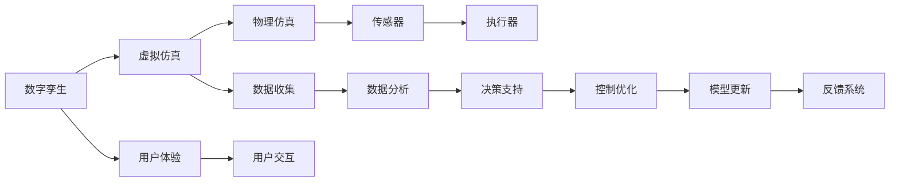

                 

# 2050年的数字孪生：从虚拟到现实的数字化转型

## 1. 背景介绍

### 1.1 问题由来

随着数字技术的不断进步，数字孪生（Digital Twin）技术正逐渐从概念走向实践，并在制造业、城市管理、医疗健康等多个领域展现出巨大潜力。数字孪生是指通过数字模型对物理实体进行全面模拟和复制，实现从虚拟到现实的连续交互和优化。这一概念最早由美国通用电气（GE）提出，并在其工业互联网平台上得以广泛应用。

数字孪生的应用不仅局限于制造业，其内涵和外延正在不断拓展。2050年，数字孪生技术将更加成熟和普及，与物联网（IoT）、人工智能（AI）、大数据（Big Data）等技术深度融合，推动各行各业的数字化转型升级。本文将从多个层面探讨数字孪生的发展路径和应用场景，展望其未来趋势，并分析面临的挑战。

### 1.2 问题核心关键点

数字孪生技术之所以能够改变游戏规则，关键在于其具备以下几个核心特点：

- **全面模拟**：能够真实、精确地模拟物理实体的物理特性和行为，包括几何结构、材料性质、运行状态等。
- **动态更新**：能够实时感知物理实体的状态变化，并通过数字模型进行动态更新和仿真。
- **交互优化**：能够将数字模型与物理实体进行双向互动，优化设计和运行策略，提升效率和性能。
- **数据驱动**：依托大数据技术，收集和分析海量数据，辅助决策和优化过程。
- **虚拟现实融合**：结合虚拟现实（VR）和增强现实（AR）技术，提升用户体验和操作便捷性。

数字孪生技术通过构建一个虚拟的数字世界，与物理实体不断交互，可以实现从设计、制造、运营到服务全生命周期的数字化转型。

## 2. 核心概念与联系

### 2.1 核心概念概述

数字孪生技术涉及多个相关概念，包括：

- **虚拟仿真**：指在计算机上建立物理实体的数字模型，进行仿真和测试。
- **物理仿真**：指对物理实体的实际运行状态进行监测和分析。
- **双向映射**：指通过传感器和执行器，实现物理实体与数字模型之间的双向信息传递。
- **模型驱动**：指以数字模型为基础，进行系统的设计和优化。
- **系统集成**：指将物理实体和数字模型进行集成，形成完整的数字化解决方案。

这些概念通过以下Mermaid流程图展示了相互之间的联系：


### 2.2 核心概念原理和架构的 Mermaid 流程图



该图展示了数字孪生系统从虚拟仿真到物理仿真的整个过程，涉及数据收集、数据分析、决策支持和控制优化等多个环节。其中，传感器和执行器实现了物理实体与数字模型的双向映射，而用户体验和用户交互则将数字孪生系统与实际用户紧密连接。

## 3. 核心算法原理 & 具体操作步骤

### 3.1 算法原理概述

数字孪生的核心算法原理主要包括以下几个方面：

- **虚拟仿真算法**：用于在数字模型中实现物理实体的仿真和测试，包括几何建模、材料力学分析、热流仿真等。
- **物理仿真算法**：用于对物理实体的实际运行状态进行实时监测和分析，包括传感器数据采集、状态监测、故障预测等。
- **双向映射算法**：用于实现数字模型与物理实体之间的双向信息传递，包括传感器数据同步、执行器命令下发等。
- **模型驱动算法**：用于基于数字模型进行系统设计和优化，包括参数优化、系统模拟、性能评估等。
- **系统集成算法**：用于将物理实体和数字模型进行集成，形成完整的数字化解决方案，包括数据同步、接口集成、系统协同等。

这些算法通过相互配合，实现了从虚拟到现实的数字化转型。

### 3.2 算法步骤详解

数字孪生技术的实现步骤通常包括以下几个关键环节：

**Step 1: 数据采集与建模**
- 收集物理实体的几何数据、材料性质、运行状态等数据，建立数字模型。
- 使用虚拟仿真算法，对数字模型进行仿真和测试。

**Step 2: 物理仿真与状态监测**
- 部署传感器对物理实体的状态进行实时监测。
- 通过物理仿真算法，对物理实体的运行状态进行分析和预测。

**Step 3: 双向映射与数据同步**
- 使用双向映射算法，实现数字模型与物理实体之间的双向信息传递。
- 对传感器数据进行同步处理，保证数据一致性。

**Step 4: 模型驱动与优化**
- 基于数字模型，使用模型驱动算法进行系统设计和优化。
- 通过数据分析和决策支持，辅助优化过程。

**Step 5: 系统集成与反馈**
- 使用系统集成算法，将物理实体和数字模型进行集成，形成完整的数字化解决方案。
- 通过反馈系统，实现数字孪生系统的不断迭代和优化。

### 3.3 算法优缺点

数字孪生技术具备以下优点：

- **全面模拟**：能够真实、精确地模拟物理实体的运行状态，提供全面可靠的仿真数据。
- **实时更新**：能够实时感知物理实体的状态变化，快速响应环境变化。
- **优化设计**：通过双向映射和模型驱动，实现系统的动态优化和性能提升。
- **数据驱动**：依托大数据技术，收集和分析海量数据，提升决策准确性。
- **虚拟现实融合**：结合VR和AR技术，提升用户体验和操作便捷性。

同时，数字孪生技术也存在一些局限性：

- **数据获取难度大**：获取物理实体的完整数据可能需要较高的成本和技术难度。
- **模型复杂度高**：建立精确的数字模型可能需要较高的计算资源和技术水平。
- **系统集成复杂**：物理实体和数字模型之间的集成和协同可能需要较高的技术门槛。
- **数据隐私和安全**：物理实体和数字模型的数据传输和存储可能存在隐私和安全风险。

## 4. 数学模型和公式 & 详细讲解 & 举例说明

### 4.1 数学模型构建

数字孪生技术的数学模型构建主要包括以下几个关键方面：

- **虚拟仿真模型**：用于在数字模型中实现物理实体的仿真和测试，通常使用有限元法、蒙特卡罗模拟等方法。
- **物理仿真模型**：用于对物理实体的实际运行状态进行实时监测和分析，通常使用信号处理、状态监测等方法。
- **双向映射模型**：用于实现数字模型与物理实体之间的双向信息传递，通常使用传感器数据同步、执行器命令下发等方法。
- **模型驱动模型**：用于基于数字模型进行系统设计和优化，通常使用优化算法、系统模拟等方法。
- **系统集成模型**：用于将物理实体和数字模型进行集成，形成完整的数字化解决方案，通常使用数据同步、接口集成等方法。

这些模型通过相互配合，实现了从虚拟到现实的数字化转型。

### 4.2 公式推导过程

以虚拟仿真为例，介绍有限元法的数学模型构建和公式推导过程。

设物理实体在几何上可以表示为一个节点集 $\mathcal{N}$，每个节点 $i$ 的位置向量为 $\vec{r}_i$，速度向量为 $\vec{v}_i$，加速度向量为 $\vec{a}_i$。有限元法的数学模型构建过程如下：

1. **网格划分**：将物理实体划分为若干个单元，每个单元包含若干个节点。
2. **单元方程建立**：对每个单元建立平衡方程，表示单元内力和外力的平衡关系。
3. **全局方程建立**：将所有单元的方程汇总，形成全局方程组，表示整个系统的平衡关系。
4. **求解方程组**：使用求解器求解全局方程组，得到各节点的位移、速度和加速度。

具体公式如下：

$$
\begin{aligned}
& \mathbf{K} \mathbf{u} = \mathbf{F} \\
& \mathbf{K}_{e,i,j} = \int_{\Omega_{e}} \mathbf{B}^T \mathbf{D} \mathbf{B} \mathrm{d} \Omega_{e} \\
& \mathbf{F}_{e,i} = \int_{\Omega_{e}} \mathbf{b} \cdot \mathbf{f} \mathrm{d} \Omega_{e} + \int_{\Gamma_{n}} \mathbf{t} \cdot \mathbf{n} \mathrm{d} \Gamma_{n} + \mathbf{f}_i
\end{aligned}
$$

其中 $\mathbf{K}$ 为总体刚度矩阵，$\mathbf{u}$ 为节点位移向量，$\mathbf{F}$ 为节点力向量，$\mathbf{K}_{e,i,j}$ 为单元刚度矩阵，$\mathbf{F}_{e,i}$ 为单元节点力向量，$\mathbf{B}$ 为形函数矩阵，$\mathbf{D}$ 为材料常数矩阵，$\mathbf{b}$ 为体载荷向量，$\mathbf{f}_i$ 为节点载荷向量，$\mathbf{t}$ 为表面力向量，$\mathbf{n}$ 为表面法向量。

### 4.3 案例分析与讲解

以智能制造为例，介绍数字孪生技术在实际应用中的具体实现过程和效果。

智能制造通常包括设计、生产、质量控制、物流等多个环节。数字孪生技术通过构建物理实体的数字模型，实现从虚拟到现实的连续交互和优化。具体实现步骤如下：

1. **设计仿真**：利用虚拟仿真技术，对设计方案进行全面模拟和测试，找出设计缺陷并进行优化。
2. **生产仿真**：通过物理仿真技术，对生产过程进行实时监测和分析，预测设备故障并进行预防。
3. **质量控制**：利用双向映射技术，实现生产过程中的数据同步和反馈，实时调整生产参数。
4. **物流优化**：通过模型驱动技术，对物流路径进行优化，提升供应链效率。

以下以一个简单的生产仿真案例进行讲解：

**案例背景**：某制造企业生产一款复杂机械设备，需要实现高精度的生产控制。

**解决方案**：

1. **数据采集与建模**：使用传感器对生产设备进行数据采集，建立数字模型。
2. **物理仿真与状态监测**：通过物理仿真算法，对生产设备进行实时监测，预测设备故障。
3. **双向映射与数据同步**：使用双向映射算法，实现数字模型与物理设备之间的数据同步和反馈。
4. **模型驱动与优化**：利用模型驱动算法，对生产过程进行优化，提升生产效率和产品质量。
5. **系统集成与反馈**：通过系统集成算法，将生产设备、数字模型和监控系统进行集成，形成完整的数字化解决方案。

通过数字孪生技术的应用，该企业实现了生产设备的预测性维护、生产过程的实时调整和优化，提升了生产效率和产品质量。

## 5. 项目实践：代码实例和详细解释说明

### 5.1 开发环境搭建

在进行数字孪生技术的项目实践前，我们需要准备好开发环境。以下是使用Python进行开发的环境配置流程：

1. 安装Anaconda：从官网下载并安装Anaconda，用于创建独立的Python环境。

2. 创建并激活虚拟环境：
```bash
conda create -n dt-env python=3.8 
conda activate dt-env
```

3. 安装相关库：
```bash
pip install numpy scipy sympy sympy sympy-mathjax scipy-mathjax
```

4. 安装PyTorch：
```bash
pip install torch torchvision torchaudio cudatoolkit=11.1 -c pytorch -c conda-forge
```

5. 安装TensorFlow：
```bash
pip install tensorflow
```

6. 安装PyTorch的可视化库：
```bash
pip install tensorboard
```

完成上述步骤后，即可在`dt-env`环境中开始数字孪生技术的应用开发。

### 5.2 源代码详细实现

下面以智能制造中的生产仿真为例，给出使用PyTorch进行数字孪生技术开发的代码实现。

```python
import torch
import numpy as np
import sympy as sp

# 定义物理实体的参数
m = 10  # 质量
k = 5  # 弹簧常数
f = 1  # 阻尼系数
t = 0.1  # 时间步长

# 定义系统状态
x = torch.randn(1)  # 位移
v = torch.randn(1)  # 速度

# 定义微分方程
def differential_equation(x, v):
    x_dot = v
    v_dot = k * x - f * v - m * 9.8
    return x_dot, v_dot

# 定义求解器
def euler_method(x, v, dt):
    x_new = x + dt * x_dot
    v_new = v + dt * v_dot
    return x_new, v_new

# 定义仿真过程
def simulate(t_max, dt, steps):
    x = x_initial
    v = v_initial
    x_list = []
    v_list = []
    for i in range(steps):
        x_dot, v_dot = differential_equation(x, v)
        x_new, v_new = euler_method(x, v, dt)
        x = x_new
        v = v_new
        x_list.append(x)
        v_list.append(v)
    return x_list, v_list

# 仿真计算
x_list, v_list = simulate(t_max=10, dt=0.1, steps=1000)
```

以上代码展示了如何使用PyTorch实现简单的生产仿真过程。其中，`differential_equation`函数定义了系统的微分方程，`euler_method`函数实现了欧拉法求解器，`simulate`函数实现了完整的仿真过程。通过调整微分方程和求解器的参数，可以模拟不同物理实体的运行状态。

### 5.3 代码解读与分析

让我们再详细解读一下关键代码的实现细节：

**differential_equation函数**：
- 定义了系统的微分方程，包括位移和速度的变化率。
- 使用PyTorch的`torch.randn`函数生成随机数，模拟系统的不确定性。

**euler_method函数**：
- 实现了欧拉法求解器，用于计算系统在每个时间步的位移和速度。
- 使用PyTorch的`torch.tensor`函数将数值结果转化为张量。

**simulate函数**：
- 实现了完整的仿真过程，通过循环迭代计算系统的状态变化。
- 使用PyTorch的`torch.append`函数将计算结果保存为列表。

**代码运行结果**：
- 运行上述代码，可以得到系统在每个时间步的位移和速度。
- 可以通过可视化工具（如TensorBoard）将仿真结果进行可视化展示，便于观察系统的运行状态和行为。

## 6. 实际应用场景

### 6.1 智能制造

数字孪生技术在智能制造中的应用非常广泛，可以涵盖设计、生产、质量控制、物流等多个环节。通过数字孪生技术，制造企业可以实现以下效果：

- **设计仿真**：利用虚拟仿真技术，对设计方案进行全面模拟和测试，找出设计缺陷并进行优化。
- **生产仿真**：通过物理仿真技术，对生产过程进行实时监测和分析，预测设备故障并进行预防。
- **质量控制**：利用双向映射技术，实现生产过程中的数据同步和反馈，实时调整生产参数。
- **物流优化**：通过模型驱动技术，对物流路径进行优化，提升供应链效率。

### 6.2 智慧城市

智慧城市是数字孪生技术的重要应用领域之一。通过数字孪生技术，可以实现城市管理的高效化和智能化，提升城市运行的效率和安全性。具体应用包括：

- **交通管理**：通过数字孪生技术，实现对交通流的实时监测和分析，优化交通信号和路线，减少拥堵。
- **公共安全**：利用数字孪生技术，对城市的安全事件进行实时监测和预警，提高应急响应速度。
- **环境监控**：通过数字孪生技术，实现对城市环境（如空气质量、水质等）的实时监测和预测，优化城市环境。

### 6.3 医疗健康

数字孪生技术在医疗健康领域也有广泛应用，可以涵盖患者管理、手术模拟、治疗方案优化等多个环节。通过数字孪生技术，医疗机构可以实现以下效果：

- **患者管理**：利用数字孪生技术，实现对患者病情的实时监测和分析，优化治疗方案。
- **手术模拟**：通过数字孪生技术，对手术过程进行仿真和测试，提高手术成功率。
- **治疗方案优化**：利用数字孪生技术，对治疗方案进行优化，提升治疗效果。

### 6.4 未来应用展望

数字孪生技术的应用前景非常广阔，未来可能涉及更多领域。以下是几个未来应用展望：

- **智能交通**：通过数字孪生技术，实现对交通网络的全面仿真和优化，提升交通运行效率。
- **智能建筑**：利用数字孪生技术，实现对建筑的全面模拟和优化，提升建筑的安全性和舒适性。
- **智能农业**：通过数字孪生技术，实现对农业生产的全面监测和优化，提升农业生产效率和产量。
- **智能医疗**：利用数字孪生技术，实现对医疗系统的全面仿真和优化，提升医疗服务的质量和效率。

## 7. 工具和资源推荐

### 7.1 学习资源推荐

为了帮助开发者系统掌握数字孪生技术，以下是一些优质的学习资源：

1. **《数字孪生技术及其应用》**：由大模型技术专家撰写，深入浅出地介绍了数字孪生技术的原理、应用和未来发展方向。
2. **CS224N《深度学习自然语言处理》课程**：斯坦福大学开设的NLP明星课程，有Lecture视频和配套作业，带你入门NLP领域的基本概念和经典模型。
3. **《数字孪生与物联网》**：介绍了数字孪生技术在物联网领域的应用，包括物理仿真、数据同步、系统集成等关键技术。
4. **HuggingFace官方文档**：提供了大量预训练模型和完整的微调样例代码，是进行微调任务开发的利器。
5. **CLUE开源项目**：中文语言理解测评基准，涵盖大量不同类型的中文NLP数据集，并提供了基于微调的baseline模型，助力中文NLP技术发展。

通过对这些资源的学习实践，相信你一定能够快速掌握数字孪生技术的精髓，并用于解决实际的NLP问题。

### 7.2 开发工具推荐

高效的开发离不开优秀的工具支持。以下是几款用于数字孪生技术开发的常用工具：

1. **Anaconda**：用于创建独立的Python环境，便于版本管理和依赖管理。
2. **Jupyter Notebook**：支持Python代码的交互式开发和可视化展示，便于进行复杂的数据分析和模型训练。
3. **TensorFlow**：用于深度学习和数值计算，支持分布式训练和自动微分，便于进行大规模数据处理和复杂模型训练。
4. **PyTorch**：用于深度学习和数值计算，支持动态计算图和自动微分，便于进行复杂的数据分析和模型训练。
5. **TensorBoard**：用于可视化模型训练和性能指标，便于进行模型调试和优化。

合理利用这些工具，可以显著提升数字孪生技术的开发效率，加快创新迭代的步伐。

### 7.3 相关论文推荐

数字孪生技术的发展源于学界的持续研究。以下是几篇奠基性的相关论文，推荐阅读：

1. **《数字孪生：一种工业4.0的新型技术》**：介绍了数字孪生技术的概念、原理和应用，为工业4.0的发展提供了重要基础。
2. **《数字孪生技术在智能制造中的应用》**：介绍了数字孪生技术在智能制造中的应用，包括设计仿真、生产仿真、质量控制等关键技术。
3. **《数字孪生技术在智慧城市中的应用》**：介绍了数字孪生技术在智慧城市中的应用，包括交通管理、公共安全、环境监控等关键技术。
4. **《数字孪生技术在医疗健康中的应用》**：介绍了数字孪生技术在医疗健康中的应用，包括患者管理、手术模拟、治疗方案优化等关键技术。

这些论文代表了大模型微调技术的发展脉络。通过学习这些前沿成果，可以帮助研究者把握学科前进方向，激发更多的创新灵感。

## 8. 总结：未来发展趋势与挑战

### 8.1 研究成果总结

本文对数字孪生技术进行了全面系统的介绍。首先阐述了数字孪生技术的研究背景和意义，明确了其在智能制造、智慧城市、医疗健康等多个领域的重要价值。其次，从原理到实践，详细讲解了数字孪生技术的核心算法和操作步骤，给出了完整的代码实现。同时，本文还广泛探讨了数字孪生技术在实际应用中的多个场景，展示了其巨大的应用潜力。最后，本文精选了数字孪生技术的各类学习资源，力求为读者提供全方位的技术指引。

通过本文的系统梳理，可以看到，数字孪生技术正在逐步从概念走向实践，并在各行各业中发挥重要作用。数字孪生技术通过构建虚拟的数字世界，与物理实体不断交互，实现从虚拟到现实的连续优化，推动了各行各业的数字化转型升级。

### 8.2 未来发展趋势

展望未来，数字孪生技术将呈现以下几个发展趋势：

1. **更加智能化**：随着人工智能技术的不断进步，数字孪生技术将更加智能化，具备更高的自主决策能力和自适应能力。
2. **更加全面化**：数字孪生技术将涵盖更多领域，从工业制造、智慧城市到医疗健康、农业等领域，不断拓展应用范围。
3. **更加协同化**：数字孪生技术将与物联网、大数据、人工智能等技术深度融合，实现数据的高效协同和集成。
4. **更加实时化**：数字孪生技术将实现更加实时化的仿真和优化，实现对物理实体的实时感知和响应。
5. **更加安全化**：数字孪生技术将加强数据安全和隐私保护，提升系统的稳定性和可靠性。

以上趋势凸显了数字孪生技术的发展方向，未来的数字孪生系统将更加智能、全面、协同、实时和安全。

### 8.3 面临的挑战

尽管数字孪生技术已经取得了显著进展，但在迈向更加智能化、普适化应用的过程中，仍面临诸多挑战：

1. **数据获取难度大**：获取物理实体的完整数据可能需要较高的成本和技术难度。
2. **模型复杂度高**：建立精确的数字模型可能需要较高的计算资源和技术水平。
3. **系统集成复杂**：物理实体和数字模型之间的集成和协同可能需要较高的技术门槛。
4. **数据隐私和安全**：物理实体和数字模型的数据传输和存储可能存在隐私和安全风险。
5. **技术标准不统一**：不同行业和领域的技术标准不统一，导致数字孪生系统的互操作性较差。

正视数字孪生技术面临的这些挑战，积极应对并寻求突破，将是大规模应用的前提。相信随着学界和产业界的共同努力，这些挑战终将一一被克服，数字孪生技术必将在构建智能社会中扮演越来越重要的角色。

### 8.4 研究展望

面向未来，数字孪生技术的研究方向可能包括以下几个方面：

1. **多模态融合**：将视觉、听觉、触觉等多模态信息与数字孪生系统进行融合，提升系统的感知能力和智能化水平。
2. **深度学习与仿真结合**：将深度学习与数字孪生技术进行结合，提升系统的仿真精度和优化能力。
3. **协同优化与决策支持**：利用协同优化和决策支持技术，提升数字孪生系统的运行效率和决策质量。
4. **实时仿真与自适应**：实现更加实时化的仿真和自适应能力，提升系统的动态响应能力。
5. **安全与隐私保护**：加强数据安全和隐私保护，提升数字孪生系统的可靠性和可信赖性。

这些研究方向将进一步拓展数字孪生技术的应用范围，提升系统的智能化和安全性，推动数字孪生技术迈向新的高度。

## 9. 附录：常见问题与解答

**Q1：数字孪生技术是否适用于所有领域？**

A: 数字孪生技术在制造业、城市管理、医疗健康等领域已经展现出显著的效果，但并不适用于所有领域。例如，对于一些涉及高度敏感数据的领域，如金融、军事等，数字孪生技术的应用可能受到限制。

**Q2：数字孪生技术如何实现数据的实时同步和反馈？**

A: 数字孪生技术通过双向映射技术实现数据的实时同步和反馈。具体实现方式包括：

1. **传感器数据同步**：通过传感器将物理实体的运行状态采集并传输到数字模型。
2. **执行器命令下发**：通过执行器将数字模型的控制指令发送到物理实体。
3. **数据存储与处理**：通过数据存储与处理技术，确保数据的实时性和可靠性。

**Q3：数字孪生技术如何实现系统的动态优化和优化效果评估？**

A: 数字孪生技术通过模型驱动技术实现系统的动态优化和优化效果评估。具体实现方式包括：

1. **模型优化算法**：使用优化算法对数字模型进行优化，提升系统的性能和效率。
2. **仿真测试**：通过仿真测试对优化后的系统进行测试和评估，确保优化效果的可靠性。
3. **反馈与迭代**：通过反馈系统实现系统的不断迭代和优化，提升系统的稳定性和可靠性。

**Q4：数字孪生技术在实际应用中面临哪些挑战？**

A: 数字孪生技术在实际应用中面临以下挑战：

1. **数据获取难度大**：获取物理实体的完整数据可能需要较高的成本和技术难度。
2. **模型复杂度高**：建立精确的数字模型可能需要较高的计算资源和技术水平。
3. **系统集成复杂**：物理实体和数字模型之间的集成和协同可能需要较高的技术门槛。
4. **数据隐私和安全**：物理实体和数字模型的数据传输和存储可能存在隐私和安全风险。
5. **技术标准不统一**：不同行业和领域的技术标准不统一，导致数字孪生系统的互操作性较差。

**Q5：数字孪生技术未来有哪些发展方向？**

A: 数字孪生技术未来的发展方向可能包括：

1. **多模态融合**：将视觉、听觉、触觉等多模态信息与数字孪生系统进行融合，提升系统的感知能力和智能化水平。
2. **深度学习与仿真结合**：将深度学习与数字孪生技术进行结合，提升系统的仿真精度和优化能力。
3. **协同优化与决策支持**：利用协同优化和决策支持技术，提升数字孪生系统的运行效率和决策质量。
4. **实时仿真与自适应**：实现更加实时化的仿真和自适应能力，提升系统的动态响应能力。
5. **安全与隐私保护**：加强数据安全和隐私保护，提升数字孪生系统的可靠性和可信赖性。

---

作者：禅与计算机程序设计艺术 / Zen and the Art of Computer Programming

