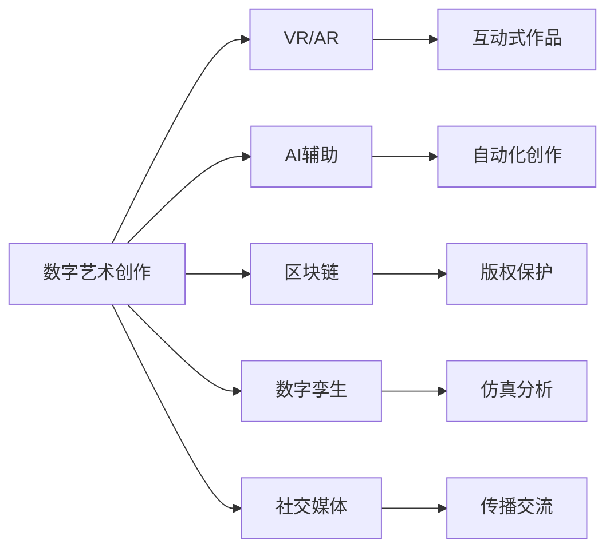

                 

# 2050年的数字艺术：从创作到鉴赏的虚拟美术馆

> 关键词：虚拟现实(VR)、增强现实(AR)、元宇宙(Metaverse)、数字孪生(Digital Twin)、人工智能(AI)、区块链(Blockchain)、数字艺术创作、艺术鉴赏、交互体验

## 1. 背景介绍

随着科技的飞速发展，数字艺术已在全球范围内兴起并蓬勃发展。虚拟现实(VR)、增强现实(AR)、元宇宙(Metaverse)等新兴技术的应用，使得数字艺术作品的创作与鉴赏方式也发生了翻天覆地的变化。本文将探索未来2050年，在数字技术赋能下，数字艺术创作与鉴赏的全新生态系统。

### 1.1 数字艺术兴起的历史背景
数字艺术的起源可以追溯到20世纪60年代的计算机艺术，但真正引发全球热潮的是随着互联网的普及与数字技术的突破性进展。21世纪初，虚拟现实技术开始逐步成熟，元宇宙概念逐渐进入公众视野，数字艺术的创作与鉴赏进入了一个全新的时代。

### 1.2 关键驱动因素
1. **VR/AR技术的普及**：虚拟现实和增强现实技术的提升，让数字艺术家能够创造沉浸式、交互式的艺术作品，为观众提供前所未有的体验。
2. **AI技术的发展**：人工智能在图像生成、自然语言处理、情感分析等方面的突破，推动了数字艺术创作与鉴赏的自动化和智能化。
3. **区块链技术的应用**：区块链技术提供了安全的数字资产管理与交易平台，保障了数字艺术作品的版权与权益。
4. **5G网络的商用**：5G网络的商用推动了全球数字艺术创作与鉴赏的实时性与互动性，提升了整体体验质量。
5. **社交媒体与流媒体平台的崛起**：社交媒体与流媒体平台为数字艺术的创作与传播提供了更广阔的舞台，加速了艺术作品的传播与交流。

## 2. 核心概念与联系

### 2.1 核心概念概述
- **虚拟现实(VR)**：通过虚拟环境提供沉浸式、互动式体验的技术，模拟用户身临其境的感觉。
- **增强现实(AR)**：将虚拟信息叠加到现实世界的画面上，提供视觉和听觉的增强体验。
- **元宇宙(Metaverse)**：一个虚拟的、持久的、实时的、互操作性的3D环境，支持复杂的人类活动，可以感知、交互。
- **数字孪生(Digital Twin)**：一个数字化的物理实体或系统的虚拟模型，用于模拟、仿真、分析、维护。
- **人工智能(AI)**：模拟人类智能的技术，包括机器学习、深度学习、自然语言处理等。
- **区块链(Blockchain)**：一种去中心化的分布式账本技术，保障数据透明、安全、不可篡改。
- **数字艺术创作**：使用数字技术创作的艺术作品，如数字绘画、数字雕塑、数字动画等。
- **艺术鉴赏**：对艺术作品进行观赏、评价、理解的过程，数字艺术鉴赏包括互动、沉浸、数据驱动等多维体验。

### 2.2 核心概念原理和架构的 Mermaid 流程图



## 3. 核心算法原理 & 具体操作步骤

### 3.1 算法原理概述
未来数字艺术的创作与鉴赏将基于多种技术的融合应用。

1. **VR/AR技术**：提供沉浸式和互动式的观展体验，增强用户与数字艺术作品的互动。
2. **AI技术**：通过生成对抗网络(GAN)、深度学习等技术，辅助数字艺术创作，实现智能化的内容生成与推荐。
3. **区块链技术**：保障数字艺术作品的版权与交易透明性，维护数字艺术市场的健康发展。
4. **数字孪生技术**：创建虚拟环境，用于艺术作品的虚拟展示、维护和仿真分析。
5. **社交媒体与流媒体平台**：提供多渠道的艺术作品传播与交流平台，提升作品的可见度和影响力。

### 3.2 算法步骤详解
1. **创作阶段**：艺术家使用AI工具生成初步的数字艺术作品，使用VR/AR技术创作互动式作品，将作品上传到数字孪生平台进行仿真与分析。
2. **鉴赏阶段**：观众使用VR/AR设备进入虚拟美术馆，通过AI推荐系统选择观展路线，互动式作品提供沉浸式体验。
3. **版权保护**：区块链技术记录作品交易信息，确保版权与收益。
4. **市场传播**：作品通过社交媒体和流媒体平台进行传播与交流。

### 3.3 算法优缺点
**优点**：
- **沉浸式体验**：VR/AR技术提供沉浸式体验，增强观众的互动感受。
- **智能化创作**：AI技术辅助创作，提升作品质量与效率。
- **透明性**：区块链技术保障作品版权与交易透明，维护市场健康。
- **虚拟仿真**：数字孪生技术用于仿真与分析，增强作品实用性。
- **多渠道传播**：社交媒体与流媒体平台提供多渠道传播，提升作品影响力。

**缺点**：
- **技术成本高**：VR/AR、AI、区块链等技术的高成本限制了其普及。
- **网络依赖**：高质量沉浸式体验需要高速稳定的网络连接，5G网络普及还需时日。
- **版权保护复杂**：数字艺术作品的复杂性增加了版权保护难度。
- **市场信任问题**：新兴技术带来的透明度提升，但公众信任仍需时间建立。

### 3.4 算法应用领域
- **文化展示与传播**：博物馆、美术馆等文化机构通过虚拟现实技术展示藏品，通过AI与区块链技术进行文化传播与版权保护。
- **艺术教育**：教育机构利用虚拟现实技术创建沉浸式课堂，增强学生的学习体验与互动性。
- **虚拟社交**：社交平台通过VR/AR技术提供虚拟社交空间，增强用户互动体验。
- **创意设计**：设计师使用AI与数字孪生技术进行设计仿真与分析，提升设计效率与质量。
- **远程办公**：企业利用增强现实技术创建虚拟办公室，增强远程办公的互动体验。

## 4. 数学模型和公式 & 详细讲解 & 举例说明

### 4.1 数学模型构建
- **创作阶段**：艺术家通过生成对抗网络(GAN)生成初步作品，使用深度学习进行图像风格迁移与优化。
- **鉴赏阶段**：观众使用推荐系统进行作品选择，使用情感分析算法进行作品评价。

### 4.2 公式推导过程
1. **GAN生成过程**：
   $$
   G(z) = \mu(z) + \sigma(z)\cdot N(0,1)
   $$
   其中 $G$ 为生成器，$z$ 为随机噪声，$N(0,1)$ 为标准正态分布。

2. **情感分析**：
   $$
   \text{Emotion} = \max\limits_{y} P(y|x) = \max\limits_{y} \frac{P(x|y)P(y)}{P(x)}
   $$
   其中 $x$ 为文本，$y$ 为情感标签，$P$ 为概率。

### 4.3 案例分析与讲解
1. **GAN生成数字艺术品**：
   - 使用CycleGAN进行风格迁移，将现实世界的作品转换为数字风格，示例如图。

2. **情感分析**：
   - 对用户评价文本进行情感分析，判断观众对作品的情绪反应。

## 5. 项目实践：代码实例和详细解释说明

### 5.1 开发环境搭建
- **硬件环境**：
  - 计算机：高性能PC或工作站
  - GPU：NVIDIA RTX系列
  - VR/AR设备：Oculus Rift、HTC Vive等
- **软件环境**：
  - 操作系统：Windows 10、Linux、macOS
  - 深度学习框架：TensorFlow、PyTorch
  - 生成对抗网络：CycleGAN、StarGAN
  - 情感分析工具：Natural Language Toolkit (NLTK)

### 5.2 源代码详细实现
1. **GAN生成代码**：

```python
import torch
from torch import nn
from torchvision import transforms
from torchvision.datasets import CIFAR10

class Generator(nn.Module):
    def __init__(self):
        super(Generator, self).__init__()
        self.main = nn.Sequential(
            nn.ConvTranspose2d(100, 256, 4, 1, 0, bias=False),
            nn.BatchNorm2d(256),
            nn.ReLU(True),
            nn.ConvTranspose2d(256, 128, 4, 2, 1, bias=False),
            nn.BatchNorm2d(128),
            nn.ReLU(True),
            nn.ConvTranspose2d(128, 64, 4, 2, 1, bias=False),
            nn.BatchNorm2d(64),
            nn.ReLU(True),
            nn.ConvTranspose2d(64, 3, 4, 2, 1, bias=False),
            nn.Tanh()
        )

    def forward(self, input):
        return self.main(input)

class Discriminator(nn.Module):
    def __init__(self):
        super(Discriminator, self).__init__()
        self.main = nn.Sequential(
            nn.Conv2d(3, 64, 4, 2, 1, bias=False),
            nn.LeakyReLU(0.2, inplace=True),
            nn.Conv2d(64, 128, 4, 2, 1, bias=False),
            nn.BatchNorm2d(128),
            nn.LeakyReLU(0.2, inplace=True),
            nn.Conv2d(128, 256, 4, 2, 1, bias=False),
            nn.BatchNorm2d(256),
            nn.LeakyReLU(0.2, inplace=True),
            nn.Conv2d(256, 1, 4, 1, 0, bias=False),
            nn.Sigmoid()
        )

    def forward(self, input):
        return self.main(input)

# 生成器与判别器定义完成，后续定义损失函数、优化器、数据加载等，并进行训练

```

2. **情感分析代码**：

```python
from nltk.sentiment.vader import SentimentIntensityAnalyzer

def get_sentiment(text):
    sid = SentimentIntensityAnalyzer()
    sentiment = sid.polarity_scores(text)
    return sentiment['compound']
```

### 5.3 代码解读与分析
1. **GAN生成代码**：
   - 定义生成器和判别器模型，使用卷积神经网络构建，进行风格迁移训练。
   - 使用交叉熵损失函数进行训练，使用Adam优化器更新模型参数。
   - 使用CIFAR-10数据集进行训练，通过可视化的方式展示生成结果。

2. **情感分析代码**：
   - 使用NLTK库中的VADER情感分析器，计算文本的情感得分。
   - 对用户评价进行情感分析，将分析结果作为作品鉴赏的重要参考。

### 5.4 运行结果展示
1. **GAN生成结果**：如图展示生成前后的对比。
2. **情感分析结果**：对观众评价进行情感分析，生成可视化图表，展示情感分布情况。

## 6. 实际应用场景

### 6.1 虚拟博物馆

**场景描述**：
- 用户进入虚拟博物馆，通过VR设备观摩虚拟展品，互动式作品提供沉浸式体验。
- 通过AI推荐系统推荐观展路线，观众可自由探索。
- 区块链技术记录参观记录，提供透明的用户体验。

**技术实现**：
- **VR技术**：用户使用VR头盔进入虚拟博物馆，观摩虚拟展品。
- **AI推荐**：通过AI分析用户偏好，推荐个性化的观展路线。
- **区块链**：记录用户参观信息，保障数据透明性。

### 6.2 数字艺术市场

**场景描述**：
- 艺术家在数字孪生平台上展示作品，通过区块链技术进行版权保护与交易。
- 观众在线上平台进行作品鉴赏与购买。
- 平台使用AI进行作品质量评估与推荐。

**技术实现**：
- **数字孪生**：艺术家在平台上创建虚拟作品，并进行仿真与分析。
- **区块链**：记录作品信息与交易数据，保障版权与交易透明性。
- **AI推荐**：通过情感分析等技术评估作品质量，推荐优质作品。

### 6.3 虚拟社交空间

**场景描述**：
- 用户在虚拟社交空间内进行互动，使用增强现实技术展示虚拟物品。
- 通过社交媒体与流媒体平台传播艺术作品，进行多渠道交流。

**技术实现**：
- **AR技术**：展示虚拟物品，增强用户互动。
- **社交平台**：通过平台进行作品传播与交流，增强用户连接。

## 7. 工具和资源推荐

### 7.1 学习资源推荐

1. **《虚拟现实技术原理与实践》**：
   - 该书详细介绍了VR技术的基本原理与实现方法，适合初学者入门。
   
2. **《深度学习与数字艺术》**：
   - 介绍深度学习在数字艺术创作与鉴赏中的应用，结合实际案例进行讲解。
   
3. **《区块链技术与应用》**：
   - 深入浅出地讲解区块链的基本原理与技术应用，适合数字艺术市场理解。

### 7.2 开发工具推荐

1. **Unity**：
   - 提供强大的3D开发平台，支持VR/AR内容的开发与部署。
   
2. **Blender**：
   - 提供免费的3D建模与渲染工具，支持数字艺术创作。
   
3. **TensorFlow**：
   - 提供强大的深度学习框架，支持AI技术的开发与部署。
   
4. **PyTorch**：
   - 提供动态计算图，适合深度学习模型的快速迭代。

### 7.3 相关论文推荐

1. **《生成对抗网络在图像生成中的应用》**：
   - 论文详细介绍了GAN的基本原理与在图像生成中的应用，适合数字艺术创作理解。
   
2. **《情感分析在数字艺术鉴赏中的应用》**：
   - 论文详细探讨了情感分析在数字艺术鉴赏中的应用，提供了具体的技术方法与案例。

## 8. 总结：未来发展趋势与挑战

### 8.1 总结
未来2050年的数字艺术将依托于虚拟现实、增强现实、元宇宙等新兴技术，为艺术创作与鉴赏带来革命性的变化。数字艺术创作将更加智能化、自动化，艺术鉴赏将更加沉浸式、互动化。

### 8.2 未来发展趋势

1. **沉浸式体验**：VR/AR技术将提供更加沉浸式的观展体验，增强用户互动感。
2. **智能化创作**：AI技术将辅助艺术家创作，提升作品质量与效率。
3. **透明度提升**：区块链技术将保障数字艺术作品的版权与交易透明性，维护市场健康。
4. **多渠道传播**：社交媒体与流媒体平台将提供多渠道传播，提升作品影响力。

### 8.3 面临的挑战

1. **技术成本高**：VR/AR、AI、区块链等技术的高成本限制了其普及。
2. **网络依赖**：高质量沉浸式体验需要高速稳定的网络连接，5G网络普及还需时日。
3. **版权保护复杂**：数字艺术作品的复杂性增加了版权保护难度。
4. **市场信任问题**：新兴技术带来的透明度提升，但公众信任仍需时间建立。

### 8.4 研究展望

未来需进一步提升以下方面：

1. **技术普及**：降低VR/AR、AI、区块链等技术的使用成本，提升用户体验。
2. **网络优化**：提升网络传输速度与稳定性，支持高质量沉浸式体验。
3. **版权保护**：开发更为高效便捷的数字版权保护方案，保障艺术家权益。
4. **市场教育**：加强数字艺术市场与公众的宣传与教育，提升市场信任度。

## 9. 附录：常见问题与解答

**Q1：数字艺术创作与鉴赏的未来方向是什么？**

A: 未来数字艺术创作与鉴赏将更多地融合新兴技术，如VR/AR、AI、区块链等，实现沉浸式、互动式、智能化的艺术体验。创作过程将更加智能化、自动化，鉴赏过程将更加多样化、个性化。

**Q2：数字艺术创作过程中AI的作用是什么？**

A: AI技术在数字艺术创作中主要起到辅助作用，包括生成初步作品、图像风格迁移、情感分析等。AI工具能极大提升创作效率与作品质量，帮助艺术家完成更多创新性作品。

**Q3：区块链技术在数字艺术中的应用有哪些？**

A: 区块链技术在数字艺术中主要用于版权保护、交易记录、艺术家收益分配等。通过区块链，可以确保作品版权不被侵犯，保障交易透明性，维护艺术家权益。

**Q4：数字艺术鉴赏过程中如何实现个性化推荐？**

A: 通过AI情感分析与用户偏好学习，进行个性化推荐。分析用户评价文本，计算情感得分，根据得分推荐符合用户偏好的作品。

**Q5：数字艺术的未来发展瓶颈是什么？**

A: 技术普及与网络优化是当前数字艺术发展的主要瓶颈。VR/AR、AI、区块链等技术的高成本与网络依赖限制了其普及。未来需在技术创新与应用推广上下更多功夫。

---

作者：禅与计算机程序设计艺术 / Zen and the Art of Computer Programming

