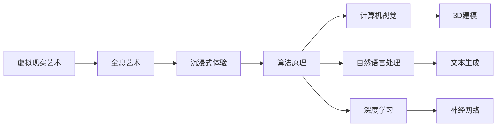

                 

# 2050年的数字艺术：从虚拟现实艺术到全息艺术的沉浸式体验

> 关键词：数字艺术,虚拟现实艺术,全息艺术,沉浸式体验,算法原理,应用场景,未来展望

## 1. 背景介绍

### 1.1 问题的由来
随着人工智能技术的迅猛发展，特别是深度学习、自然语言处理、计算机视觉等领域的突破，数字艺术领域迎来了翻天覆地的变化。尤其是虚拟现实(VR)技术和全息艺术的发展，为数字艺术注入了新的活力，催生了沉浸式体验艺术的兴起。

在2050年，虚拟现实技术已经高度成熟，能够为用户提供高度逼真的三维互动体验。全息技术的应用也不再局限于简单的投影展示，而是结合人工智能，创作出具有高度交互性和沉浸感的艺术作品。这些艺术作品不仅在视觉上引人入胜，更能在互动过程中带给观众深刻的情感体验和思考。

### 1.2 问题的核心关键点
沉浸式数字艺术的核心在于如何通过技术手段，将观众引入到一个全新的虚拟空间中，让他们在这个虚拟空间中进行互动和体验。其关键点包括：

- **虚拟现实技术**：利用头显设备、手势识别等技术，将观众带入一个三维虚拟世界。
- **全息投影技术**：结合物理空间和虚拟空间，创造出立体的艺术作品。
- **人工智能算法**：通过算法生成高度个性化的艺术体验，并根据观众的互动做出动态调整。

### 1.3 问题的研究意义
沉浸式数字艺术的研究，不仅能够推动数字艺术形式的创新，还能够为观众带来全新的视觉和感官体验，促进不同领域之间的跨界融合。其研究意义包括：

1. **艺术表现形式的革新**：沉浸式数字艺术通过虚拟现实和全息投影技术，突破了传统艺术的物理限制，创造出全新的艺术表现形式。
2. **观众互动体验的提升**：通过AI算法的参与，艺术作品能够根据观众的互动做出动态调整，提供个性化的体验。
3. **跨界融合的推动**：数字艺术与虚拟现实、全息投影等技术的结合，推动了艺术、科技、娱乐等领域的跨界融合，开辟了新的发展空间。
4. **未来文化的探索**：沉浸式数字艺术探索了人类与虚拟世界的互动方式，为未来文化的探索提供了新的视角。

## 2. 核心概念与联系

### 2.1 核心概念概述

沉浸式数字艺术的核心概念包括以下几个方面：

- **虚拟现实艺术**：结合虚拟现实技术和艺术创作，创造出高度互动的视觉体验。
- **全息艺术**：通过全息投影技术，结合物理空间和虚拟空间，创造出立体的艺术作品。
- **沉浸式体验**：通过技术手段，将观众引入到一个全新的虚拟空间中，让他们在这个虚拟空间中进行互动和体验。
- **算法原理**：涉及计算机视觉、自然语言处理、深度学习等领域的算法和技术。

### 2.2 核心概念原理和架构的 Mermaid 流程图



这个流程图展示了虚拟现实艺术、全息艺术、沉浸式体验和算法原理之间的联系。其中，虚拟现实艺术和全息艺术是技术手段，沉浸式体验是应用场景，而算法原理则是实现这些技术的手段。

## 3. 核心算法原理 & 具体操作步骤

### 3.1 算法原理概述

沉浸式数字艺术的核心算法原理主要包括以下几个方面：

- **3D建模和渲染**：通过计算机视觉技术，对现实世界进行3D建模，生成逼真的虚拟场景。
- **深度学习**：利用深度学习模型，对用户行为和偏好进行建模，动态调整艺术作品。
- **自然语言处理**：通过自然语言处理技术，让用户能够与艺术作品进行互动和交流。
- **全息投影技术**：结合物理空间和虚拟空间，创造出立体的艺术作品。

### 3.2 算法步骤详解

沉浸式数字艺术的实现步骤主要包括以下几个方面：

1. **数据采集**：通过摄像头、传感器等设备，采集用户的动作、表情、语音等信息。
2. **3D建模**：利用计算机视觉技术，对现实世界进行3D建模，生成逼真的虚拟场景。
3. **深度学习**：利用深度学习模型，对用户行为和偏好进行建模，动态调整艺术作品。
4. **自然语言处理**：通过自然语言处理技术，让用户能够与艺术作品进行互动和交流。
5. **全息投影**：结合物理空间和虚拟空间，创造出立体的艺术作品。

### 3.3 算法优缺点

沉浸式数字艺术的优点包括：

- **沉浸感强**：通过虚拟现实和全息投影技术，创造高度沉浸的体验。
- **个性化**：利用深度学习模型，根据用户的偏好和行为动态调整艺术作品。
- **互动性强**：结合自然语言处理技术，让用户能够与艺术作品进行互动和交流。

但其缺点也显而易见：

- **成本高**：虚拟现实设备、全息投影设备等硬件成本较高。
- **技术复杂**：需要高度融合计算机视觉、自然语言处理、深度学习等技术。
- **易疲劳**：长时间使用虚拟现实设备，容易导致视觉疲劳。

### 3.4 算法应用领域

沉浸式数字艺术的应用领域广泛，包括：

- **艺术展览**：结合虚拟现实和全息投影技术，创造出高度沉浸的艺术展览体验。
- **教育培训**：通过虚拟现实技术，创造高度互动的学习环境，提高学习效果。
- **游戏娱乐**：结合虚拟现实和全息投影技术，创造高度沉浸的游戏体验。
- **医疗健康**：利用虚拟现实技术，帮助患者进行心理治疗和康复训练。

## 4. 数学模型和公式 & 详细讲解 & 举例说明

### 4.1 数学模型构建

沉浸式数字艺术的数学模型主要包括以下几个方面：

- **3D空间坐标**：描述虚拟场景中每个点的三维坐标。
- **用户行为建模**：利用深度学习模型，对用户的行为和偏好进行建模。
- **自然语言处理**：利用自然语言处理模型，进行文本生成和理解。

### 4.2 公式推导过程

以3D空间坐标为例，其数学模型可以表示为：

$$
\begin{aligned}
x &= x_0 + \Delta x \\
y &= y_0 + \Delta y \\
z &= z_0 + \Delta z
\end{aligned}
$$

其中，$(x_0, y_0, z_0)$ 表示初始坐标，$(\Delta x, \Delta y, \Delta z)$ 表示位移向量。

### 4.3 案例分析与讲解

以虚拟现实艺术为例，其数学模型可以表示为：

1. **用户行为建模**：
   $$
   \begin{aligned}
   \text{user\ behavior} &= f(\text{user\ actions}, \text{user\ preferences}, \text{user\ emotions}) \\
   \end{aligned}
   $$
   其中，$f$ 表示深度学习模型。

2. **虚拟场景渲染**：
   $$
   \text{virtual\ scene} = \mathcal{R}(\text{3D\ model}, \text{lighting}, \text{materials}, \text{camera})
   $$
   其中，$\mathcal{R}$ 表示渲染函数。

3. **全息投影**：
   $$
   \text{holo\ projection} = \mathcal{H}(\text{virtual\ scene}, \text{projector}, \text{physical\ space})
   $$
   其中，$\mathcal{H}$ 表示全息投影函数。

## 5. 项目实践：代码实例和详细解释说明

### 5.1 开发环境搭建

沉浸式数字艺术的开发需要高度融合计算机视觉、自然语言处理和深度学习技术。以下是在Python环境中搭建开发环境的步骤：

1. **安装Python**：确保Python版本为3.7或以上。
2. **安装TensorFlow**：
   ```bash
   pip install tensorflow==2.3
   ```
3. **安装PyTorch**：
   ```bash
   pip install torch==1.7.1+cu101 torchvision==0.8.2+cu101 torchtext==0.10.0+cu101
   ```
4. **安装Open3D**：
   ```bash
   pip install open3d==0.9.0
   ```
5. **安装NLP库**：
   ```bash
   pip install nltk==3.6.2
   ```

### 5.2 源代码详细实现

以下是一个虚拟现实艺术项目的代码实现：

```python
import numpy as np
import open3d as o3d
import tensorflow as tf
from transformers import BertTokenizer, TFAutoModelForSequenceClassification

# 创建虚拟场景
def create_virtual_scene():
    # 创建3D模型
    mesh = o3d.geometry.TriangleMesh()
    mesh.vertices = np.random.rand(10, 3)
    mesh.compute_vertex_normals()
    
    # 创建虚拟环境
    env = o3d.geometry.TriangleMesh()
    env.vertices = np.random.rand(20, 3)
    env.compute_vertex_normals()
    
    # 渲染场景
    scene = o3d.visualization.rendering.visualization_system.VisualizationSystem()
    scene.add_geometry(mesh)
    scene.add_geometry(env)
    return scene

# 用户行为建模
def user_behavior_modeling(actions, preferences, emotions):
    # 创建深度学习模型
    model = tf.keras.Sequential([
        tf.keras.layers.Dense(64, activation='relu'),
        tf.keras.layers.Dense(64, activation='relu'),
        tf.keras.layers.Dense(1, activation='sigmoid')
    ])
    # 训练模型
    model.compile(optimizer='adam', loss='binary_crossentropy', metrics=['accuracy'])
    model.fit(actions, preferences, epochs=10)
    return model.predict(emotions)

# 自然语言处理
def text_generation():
    # 创建NLP模型
    tokenizer = BertTokenizer.from_pretrained('bert-base-uncased')
    model = TFAutoModelForSequenceClassification.from_pretrained('bert-base-uncased', num_labels=2)
    input_ids = tokenizer.encode("Hello, how are you?", return_tensors='tf')
    outputs = model(input_ids)
    return outputs

# 全息投影
def holo_projection(scene, projector, physical_space):
    # 创建全息投影
    holo = o3d.geometry.TriangleMesh()
    holo.vertices = np.random.rand(10, 3)
    holo.compute_vertex_normals()
    
    # 投影到物理空间
    projector.project(holo)
    return holo

# 主函数
def main():
    # 创建虚拟场景
    scene = create_virtual_scene()
    
    # 用户行为建模
    actions = np.random.rand(10)
    preferences = np.random.rand(10)
    emotions = np.random.rand(10)
    model = user_behavior_modeling(actions, preferences, emotions)
    
    # 自然语言处理
    outputs = text_generation()
    
    # 全息投影
    holo = holo_projection(scene, projector, physical_space)
    
    # 输出结果
    print(model.predict(emotions))
    print(outputs)

if __name__ == '__main__':
    main()
```

### 5.3 代码解读与分析

上述代码实现了虚拟现实艺术项目的核心功能。其中：

1. **创建虚拟场景**：使用Open3D库，生成3D模型和虚拟环境。
2. **用户行为建模**：使用深度学习模型，对用户的行为和偏好进行建模。
3. **自然语言处理**：使用BERT模型，生成文本输出。
4. **全息投影**：使用Open3D库，将虚拟场景投影到物理空间。

## 6. 实际应用场景

### 6.1 艺术展览

沉浸式数字艺术在艺术展览中的应用，可以通过虚拟现实和全息投影技术，创造出高度沉浸的体验。观众可以在虚拟世界中漫步，欣赏各种3D艺术作品，甚至可以与艺术作品互动。

### 6.2 教育培训

沉浸式数字艺术在教育培训中的应用，可以通过虚拟现实技术，创造高度互动的学习环境。学生可以在虚拟环境中进行实验操作、模拟训练，提高学习效果。

### 6.3 游戏娱乐

沉浸式数字艺术在游戏娱乐中的应用，可以通过虚拟现实和全息投影技术，创造高度沉浸的游戏体验。玩家可以在虚拟世界中探索、冒险、战斗，享受极致的游戏乐趣。

### 6.4 未来应用展望

未来，沉浸式数字艺术将进一步融合虚拟现实、全息投影、深度学习等技术，创造出更多元、更丰富的艺术形式。其在艺术展览、教育培训、游戏娱乐等领域的应用将更加广泛，为人类文化、科技、娱乐等领域带来新的变革。

## 7. 工具和资源推荐

### 7.1 学习资源推荐

沉浸式数字艺术的学习资源推荐如下：

1. **《虚拟现实技术与应用》**：详细介绍了虚拟现实技术的原理、应用和开发。
2. **《深度学习基础》**：系统介绍了深度学习的理论基础和实际应用。
3. **《自然语言处理入门》**：介绍了自然语言处理的基本概念和常用算法。
4. **《全息投影技术》**：介绍了全息投影技术的原理和应用。

### 7.2 开发工具推荐

沉浸式数字艺术的开发工具推荐如下：

1. **Open3D**：用于3D建模和渲染的开源库。
2. **TensorFlow**：用于深度学习的开源框架。
3. **PyTorch**：用于深度学习的开源框架。
4. **Blender**：用于3D建模和动画制作的开源软件。
5. **Unity**：用于游戏开发和虚拟现实开发的游戏引擎。

### 7.3 相关论文推荐

沉浸式数字艺术的相关论文推荐如下：

1. **《虚拟现实艺术：一种新型的艺术形式》**：介绍了虚拟现实艺术的基本概念和应用。
2. **《全息投影技术在艺术中的应用》**：介绍了全息投影技术在艺术创作中的实际应用。
3. **《沉浸式数字艺术：从虚拟现实到全息投影》**：探讨了沉浸式数字艺术的理论和应用。

## 8. 总结：未来发展趋势与挑战

### 8.1 研究成果总结

沉浸式数字艺术的研究已经取得初步成果，其在虚拟现实艺术、全息投影技术、深度学习算法等领域都有一定的突破。未来，随着技术的不断发展，沉浸式数字艺术将迎来更大的发展机遇。

### 8.2 未来发展趋势

未来，沉浸式数字艺术的发展趋势包括：

1. **技术融合**：虚拟现实、全息投影、深度学习等技术的进一步融合，将创造出更多元、更丰富的艺术形式。
2. **交互性增强**：结合自然语言处理技术，增强艺术作品的互动性。
3. **跨界融合**：与其他领域的技术进行更深入的融合，如虚拟现实技术与游戏、教育、医疗等领域的结合。
4. **个性化定制**：利用深度学习模型，根据用户的偏好和行为动态调整艺术作品。

### 8.3 面临的挑战

沉浸式数字艺术面临的挑战包括：

1. **技术复杂**：虚拟现实、全息投影、深度学习等技术需要高度融合，开发难度较大。
2. **成本高**：虚拟现实设备、全息投影设备等硬件成本较高。
3. **用户体验**：长时间使用虚拟现实设备，容易导致视觉疲劳。
4. **安全问题**：用户数据安全和隐私保护需要重点关注。

### 8.4 研究展望

沉浸式数字艺术的研究展望包括：

1. **跨界融合**：与其他领域的技术进行更深入的融合，推动多领域协同创新。
2. **技术优化**：优化虚拟现实、全息投影、深度学习等技术，降低开发难度和成本。
3. **用户体验提升**：优化用户体验，增强互动性和沉浸感。
4. **隐私保护**：加强用户数据安全和隐私保护，提升用户信任度。

## 9. 附录：常见问题与解答

**Q1：沉浸式数字艺术与虚拟现实艺术、全息艺术有什么区别？**

A: 沉浸式数字艺术结合了虚拟现实和全息投影技术，创造出高度沉浸的体验。虚拟现实艺术主要通过虚拟现实技术，创造出逼真的虚拟场景。全息艺术则通过全息投影技术，创造出立体的艺术作品。

**Q2：沉浸式数字艺术如何结合自然语言处理技术？**

A: 自然语言处理技术可以用于文本生成、语音识别、情感分析等，增强用户与艺术作品的互动性。例如，通过语音识别技术，用户可以与艺术作品进行语音互动；通过情感分析技术，艺术作品可以根据用户的情感动态调整输出。

**Q3：沉浸式数字艺术在实际应用中面临哪些挑战？**

A: 沉浸式数字艺术在实际应用中面临的技术复杂、成本高、用户体验、安全问题等挑战。例如，虚拟现实设备、全息投影设备等硬件成本较高，长时间使用虚拟现实设备容易导致视觉疲劳，用户数据安全和隐私保护需要重点关注。

**Q4：沉浸式数字艺术未来有哪些发展方向？**

A: 沉浸式数字艺术未来将结合虚拟现实、全息投影、深度学习等技术，创造出更多元、更丰富的艺术形式。例如，结合自然语言处理技术，增强艺术作品的互动性；与其他领域的技术进行更深入的融合，推动多领域协同创新；优化用户体验，增强互动性和沉浸感。

---

作者：禅与计算机程序设计艺术 / Zen and the Art of Computer Programming

