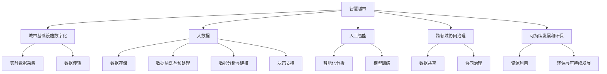

                 

# 2050年的智慧城市：从智慧交通到智慧能源的城市智能化升级

## 1. 背景介绍

### 1.1 问题由来
随着全球人口的急剧增长，城市化进程显著加快，智慧城市建设成为各国政府和企业的重点工作。城市化的快速发展带来了诸多挑战，如交通拥堵、能源短缺、环境污染等。为了解决这些挑战，提升城市治理的智能化水平，全球各地纷纷启动智慧城市建设，推动城市基础设施的数字化、智能化转型。

智慧城市建设离不开技术的支撑。过去二十年，物联网(IoT)、人工智能(AI)、大数据、区块链等新技术的快速发展，为城市智能化提供了坚实的技术基础。智慧交通、智慧能源、智慧环保等领域的技术创新，让城市治理变得更加高效、环保和智能化。

### 1.2 问题核心关键点
智慧城市建设的核心关键点包括：

- 城市基础设施的数字化。通过物联网技术实现对城市基础设施的全面监控，包括交通、能源、环保等领域。
- 数据的智能化分析。利用大数据和人工智能技术，对城市运行数据进行深度分析，提供城市治理的决策支持。
- 跨领域协同治理。打破不同领域和部门之间的信息孤岛，实现数据共享和协同治理。
- 可持续发展和环保。通过智能化技术提升城市资源的利用效率，推动绿色低碳发展。

## 2. 核心概念与联系

### 2.1 核心概念概述

为更好地理解智慧城市智能化升级的框架，本节将介绍几个关键概念：

- 智慧城市(Smart City)：利用物联网、大数据、人工智能等技术手段，对城市基础设施进行全面数字化、智能化改造，提升城市治理的智能化水平，实现高效、环保、宜居的城市目标。

- 城市基础设施的数字化：通过传感器、智能终端等设备对城市交通、能源、环保等领域进行全面监控，实现数据的实时采集和传输。

- 大数据：智慧城市中的核心数据来源，城市运行数据的实时采集、存储、分析为城市治理提供决策支持。

- 人工智能(AI)：对城市运行数据进行智能化分析和建模，实现对城市运行的深度理解，提供城市治理的决策支持。

- 跨领域协同治理：打破不同领域和部门之间的信息孤岛，实现数据的共享和协同治理，提升城市治理的整体效能。

- 可持续发展和环保：通过智能化技术提升城市资源的利用效率，推动绿色低碳发展，实现城市的可持续发展。

这些核心概念之间的逻辑关系可以通过以下Mermaid流程图来展示：



这个流程图展示了这个核心概念之间的逻辑关系：

1. 智慧城市通过城市基础设施数字化获得数据输入。
2. 大数据对这些数据进行存储、清洗与预处理。
3. 人工智能对数据进行智能化分析和建模，提供决策支持。
4. 跨领域协同治理实现数据共享和协同治理，提升治理效能。
5. 可持续发展和环保通过智能化技术提升资源利用效率，推动绿色发展。

## 3. 核心算法原理 & 具体操作步骤
### 3.1 算法原理概述

智慧城市智能化升级的核心算法原理基于数据驱动的智能决策模型。通过收集城市基础设施的实时数据，结合大数据和人工智能技术，构建城市运行模型，实现对城市运行的深度理解和预测。

智慧城市的核心算法包括以下几个关键步骤：

1. 数据采集：通过传感器、智能终端等设备，对城市基础设施进行全面监控，获取实时数据。
2. 数据清洗与预处理：对采集到的数据进行清洗和预处理，消除噪音，统一格式。
3. 数据分析与建模：利用大数据和人工智能技术，对处理后的数据进行智能化分析和建模，构建城市运行模型。
4. 模型评估与优化：对构建的模型进行评估和优化，提升模型的准确性和泛化能力。
5. 决策支持：利用构建的模型，为城市治理提供决策支持，实现智能化管理。

### 3.2 算法步骤详解

智慧城市智能化升级的核心算法步骤详解如下：

**Step 1: 数据采集与预处理**
- 通过传感器、智能终端等设备，对城市基础设施进行全面监控，获取实时数据。
- 对采集到的数据进行清洗和预处理，消除噪音，统一格式，保证数据的质量。

**Step 2: 数据存储与分析**
- 将清洗后的数据存储到分布式数据库中，利用大数据技术进行海量数据分析。
- 利用人工智能技术，对城市运行数据进行智能化分析和建模，构建城市运行模型。

**Step 3: 模型训练与评估**
- 构建城市运行模型后，利用历史数据进行模型训练，不断优化模型的参数和结构。
- 对训练好的模型进行评估，验证模型的准确性和泛化能力。

**Step 4: 决策支持与优化**
- 利用构建的模型，对城市运行的各个环节进行预测和模拟，提供决策支持。
- 根据模型预测结果，对城市治理进行优化调整，提升治理效能。

### 3.3 算法优缺点

智慧城市智能化升级的算法具有以下优点：
1. 数据驱动：通过实时数据驱动，城市治理更加精准、高效。
2. 智能决策：结合大数据和人工智能技术，实现对城市运行的深度理解和预测。
3. 协同治理：打破信息孤岛，实现数据共享和协同治理，提升治理整体效能。
4. 绿色发展：通过智能化技术提升资源利用效率，推动绿色低碳发展。

同时，该算法也存在一些局限性：
1. 数据质量依赖：城市治理效果很大程度上依赖于数据的质量和完整性。
2. 计算资源消耗：大数据和人工智能技术需要大量的计算资源，对硬件设施要求较高。
3. 隐私安全问题：城市数据涉及隐私和敏感信息，数据管理和安全保障面临挑战。
4. 算法复杂性：构建和优化智能化模型需要高超的技术水平和丰富的经验。

尽管存在这些局限性，但就目前而言，数据驱动的智能决策算法仍是大智慧城市建设的主流方法。未来相关研究的重点在于如何进一步提高数据质量，降低计算资源消耗，加强数据隐私保护，简化算法实现，以确保算法的可靠性和实用性。

### 3.4 算法应用领域

智慧城市智能化升级的算法广泛应用在以下几个领域：

- **智慧交通**：通过实时数据采集和智能化分析，实现对交通流的深度理解，优化交通信号控制，提升交通运行效率。
- **智慧能源**：结合人工智能和大数据分析技术，对能源消耗进行优化调度，提升能源利用效率，实现节能减排。
- **智慧环保**：利用传感器和大数据分析技术，对环境污染进行实时监测和预警，实现污染防治和环保监管。
- **智慧公共安全**：通过视频监控和人工智能技术，实现对公共安全的深度分析，提升社会治理水平。
- **智慧医疗**：结合大数据和人工智能技术，实现对医疗资源的智能化管理，提升医疗服务水平。

除了这些核心领域外，智慧城市智能化升级的算法还在智慧教育、智慧旅游、智慧农业等更多场景中得到应用，推动城市治理的全面升级。

## 4. 数学模型和公式 & 详细讲解  
### 4.1 数学模型构建

智慧城市智能化升级的核心算法原理基于数据驱动的智能决策模型。以下将以智慧交通领域的流量预测为例，进行数学模型的构建和推导。

设城市某条道路上某时间段的车辆流量为 $y$，影响流量的因素包括当前车辆数 $x_1$、道路宽度 $x_2$、车速 $x_3$、天气状况 $x_4$ 等。则流量预测的数学模型可以表示为：

$$
y = f(x_1, x_2, x_3, x_4) = \sum_{i=1}^{n} w_i x_i + b
$$

其中 $f(x_1, x_2, x_3, x_4)$ 为非线性函数，$w_i$ 为模型系数，$b$ 为截距。

利用历史数据，通过最小二乘法或梯度下降法对模型进行训练，得到最优的模型参数 $w_i$ 和 $b$。在得到模型参数后，可以用于实时流量预测，即：

$$
\hat{y} = f(x_1, x_2, x_3, x_4; w_i, b)
$$

其中 $\hat{y}$ 为预测的流量值。

### 4.2 公式推导过程

以下是流量预测模型的公式推导过程：

设训练数据集为 $D=\{(x_i, y_i)\}_{i=1}^N$，其中 $x_i$ 为输入特征，$y_i$ 为输出流量。则最小二乘法下的损失函数为：

$$
\mathcal{L}(w, b) = \frac{1}{2N} \sum_{i=1}^N (y_i - f(x_i; w, b))^2
$$

利用梯度下降法最小化损失函数，求得模型参数 $w_i$ 和 $b$ 的更新公式为：

$$
w_i \leftarrow w_i - \frac{\eta}{N} \sum_{i=1}^N (y_i - f(x_i; w_i, b))x_i
$$
$$
b \leftarrow b - \frac{\eta}{N} \sum_{i=1}^N (y_i - f(x_i; w_i, b))
$$

其中 $\eta$ 为学习率，$N$ 为样本数。

在得到模型参数后，利用历史数据进行模型验证，选择最优的模型参数，用于实时流量预测。

### 4.3 案例分析与讲解

假设某城市主城区某条交通干道，在不同天气条件下，车辆流量随时间变化的预测模型如下：

设天气状况 $x_4$ 为晴天、阴天和雨天。则模型参数 $w_i$ 和 $b$ 的更新公式为：

$$
w_{1,i} \leftarrow w_{1,i} - \frac{\eta}{N} \sum_{i=1}^N (y_i - f(x_i; w_i, b))x_{1,i}
$$
$$
w_{2,i} \leftarrow w_{2,i} - \frac{\eta}{N} \sum_{i=1}^N (y_i - f(x_i; w_i, b))x_{2,i}
$$
$$
w_{3,i} \leftarrow w_{3,i} - \frac{\eta}{N} \sum_{i=1}^N (y_i - f(x_i; w_i, b))x_{3,i}
$$
$$
w_{4,i} \leftarrow w_{4,i} - \frac{\eta}{N} \sum_{i=1}^N (y_i - f(x_i; w_i, b))x_{4,i}
$$
$$
b \leftarrow b - \frac{\eta}{N} \sum_{i=1}^N (y_i - f(x_i; w_i, b))
$$

其中 $x_{1,i}$、$x_{2,i}$、$x_{3,i}$、$x_{4,i}$ 为输入特征，$y_i$ 为输出流量，$w_{1,i}$、$w_{2,i}$、$w_{3,i}$、$w_{4,i}$、$b$ 为模型参数。

通过不断迭代更新模型参数，逐步优化模型，最终得到准确、可靠的流量预测模型。

## 5. 项目实践：代码实例和详细解释说明
### 5.1 开发环境搭建

在进行智慧城市智能化升级的实践前，我们需要准备好开发环境。以下是使用Python进行PyTorch开发的环境配置流程：

1. 安装Anaconda：从官网下载并安装Anaconda，用于创建独立的Python环境。

2. 创建并激活虚拟环境：
```bash
conda create -n smart-city-env python=3.8 
conda activate smart-city-env
```

3. 安装PyTorch：根据CUDA版本，从官网获取对应的安装命令。例如：
```bash
conda install pytorch torchvision torchaudio cudatoolkit=11.1 -c pytorch -c conda-forge
```

4. 安装TensorFlow：
```bash
conda install tensorflow -c conda-forge
```

5. 安装TensorBoard：
```bash
conda install tensorboard
```

6. 安装Keras：
```bash
conda install keras
```

完成上述步骤后，即可在`smart-city-env`环境中开始智慧城市智能化升级的实践。

### 5.2 源代码详细实现

这里我们以智慧交通领域为例，给出使用TensorFlow进行流量预测的PyTorch代码实现。

首先，定义流量预测模型：

```python
import tensorflow as tf
from tensorflow.keras import layers, models
import numpy as np

# 定义模型
def create_model():
    model = models.Sequential([
        layers.Dense(64, activation='relu', input_shape=(4,)),
        layers.Dense(64, activation='relu'),
        layers.Dense(1)
    ])
    return model

# 加载模型
model = create_model()
model.compile(optimizer=tf.keras.optimizers.Adam(learning_rate=0.01), loss='mse')

# 训练模型
model.fit(X_train, y_train, epochs=10, batch_size=32, validation_data=(X_val, y_val))
```

其中，$X$ 为输入特征，$y$ 为输出流量，$X_{train}$ 和 $y_{train}$ 为训练集，$X_{val}$ 和 $y_{val}$ 为验证集。

### 5.3 代码解读与分析

让我们再详细解读一下关键代码的实现细节：

**模型定义**：
- 定义了三个全连接层，每个层都有64个神经元，激活函数为ReLU。
- 最后一层为输出层，只有一个神经元，用于预测流量值。

**模型编译与训练**：
- 使用Adam优化器，学习率为0.01，均方误差作为损失函数。
- 训练模型，共进行10轮训练，每次训练32个样本。

**模型验证**：
- 在验证集上验证模型，评估模型的预测准确性。

在实际应用中，需要根据具体任务特点，对模型进行进一步的调整和优化。例如，根据历史数据和实际场景，选择合适的输入特征，调整模型的层数和神经元数量，以提高模型的准确性和泛化能力。

## 6. 实际应用场景
### 6.1 智慧交通

智慧交通是智慧城市建设的重要领域之一。通过大数据和人工智能技术，可以实现对交通流的深度理解和预测，优化交通信号控制，提升交通运行效率，减少交通拥堵和事故。

具体而言，可以构建交通流量预测模型，对实时交通数据进行分析，预测未来某个时间段的流量值。利用预测结果，动态调整交通信号灯的控制策略，实现交通流量的智能化调度。例如，在交通拥堵区域，增加绿灯时间，减少车辆等待时间；在非拥堵区域，减少绿灯时间，优化通行效率。

此外，还可以通过实时数据监控和分析，发现道路故障、交通事故等异常情况，及时采取应急措施，保障道路安全。

### 6.2 智慧能源

智慧能源是智慧城市建设的重要组成部分，通过智能化技术，可以实现对能源消耗的优化调度，提升能源利用效率，实现节能减排。

具体而言，可以构建能源消耗预测模型，对实时能源数据进行分析，预测未来某个时间段的能源消耗量。利用预测结果，动态调整能源的供应和消耗策略，实现能源的智能化调度。例如，在能源需求高涨时期，增加能源供应；在能源需求低迷时期，减少能源消耗。

此外，还可以通过实时数据监控和分析，发现能源故障、能源浪费等异常情况，及时采取措施，保障能源安全。

### 6.3 智慧环保

智慧环保是智慧城市建设的重要领域之一，通过智能化技术，可以实现对环境污染的实时监测和预警，推动环保监管和治理。

具体而言，可以构建环境污染预测模型，对实时环境数据进行分析，预测未来某个时间段的污染水平。利用预测结果，及时采取措施，减少污染物的排放。例如，在污染高发时段，增加污染物处理设备；在污染低发时段，减少污染物处理设备。

此外，还可以通过实时数据监控和分析，发现环境污染事件，及时采取措施，保障环境安全。

### 6.4 未来应用展望

未来，随着智慧城市智能化升级的不断推进，智慧交通、智慧能源、智慧环保等领域的应用场景将更加丰富，技术水平也将不断提升。

在智慧交通领域，未来的发展趋势包括：
1. 智能交通系统的全面覆盖，实现城市道路的全面数字化、智能化监控。
2. 交通流量预测模型的深度优化，提升预测准确性和实时性。
3. 交通信号控制的智能化，实现动态调度和路径优化。
4. 智能交通管理平台的建设，提供全面的交通管理服务。

在智慧能源领域，未来的发展趋势包括：
1. 能源消耗预测模型的优化，提升能源利用效率和节能减排效果。
2. 能源智能调度的普及，实现能源的动态优化和智能化管理。
3. 能源监测和管理的智能化，保障能源的安全和稳定供应。

在智慧环保领域，未来的发展趋势包括：
1. 环境污染预测模型的深度优化，提升预测准确性和实时性。
2. 环境监测和管理的智能化，保障环境的可持续发展。
3. 环保政策的智能化，实现环境治理的精准化、智能化。

## 7. 工具和资源推荐
### 7.1 学习资源推荐

为了帮助开发者系统掌握智慧城市智能化升级的理论基础和实践技巧，这里推荐一些优质的学习资源：

1. 《智慧城市智能化升级》系列博文：由智慧城市专家撰写，深入浅出地介绍了智慧城市智能化升级的理论基础和实践技巧，涵盖智慧交通、智慧能源、智慧环保等多个领域的创新应用。

2. 《智慧城市建设与管理》课程：由知名大学开设的智慧城市建设与管理课程，系统介绍智慧城市建设的理论、实践和政策。

3. 《智能交通系统》书籍：介绍智能交通系统的设计、实现和应用，涵盖交通流预测、交通信号控制、智能车辆等核心技术。

4. 《智能电网技术》书籍：介绍智能电网的设计、实现和应用，涵盖能源消耗预测、能源智能调度、能源监测等核心技术。

5. 《智慧环保技术》书籍：介绍智慧环保的设计、实现和应用，涵盖环境污染预测、环境监测、环保政策等核心技术。

通过对这些资源的学习实践，相信你一定能够快速掌握智慧城市智能化升级的精髓，并用于解决实际的智慧城市问题。

### 7.2 开发工具推荐

高效的开发离不开优秀的工具支持。以下是几款用于智慧城市智能化升级开发的常用工具：

1. PyTorch：基于Python的开源深度学习框架，灵活动态的计算图，适合快速迭代研究。大部分预训练模型都有PyTorch版本的实现。

2. TensorFlow：由Google主导开发的开源深度学习框架，生产部署方便，适合大规模工程应用。同样有丰富的预训练语言模型资源。

3. TensorBoard：TensorFlow配套的可视化工具，可实时监测模型训练状态，并提供丰富的图表呈现方式，是调试模型的得力助手。

4. Weights & Biases：模型训练的实验跟踪工具，可以记录和可视化模型训练过程中的各项指标，方便对比和调优。与主流深度学习框架无缝集成。

5. Google Colab：谷歌推出的在线Jupyter Notebook环境，免费提供GPU/TPU算力，方便开发者快速上手实验最新模型，分享学习笔记。

合理利用这些工具，可以显著提升智慧城市智能化升级的开发效率，加快创新迭代的步伐。

### 7.3 相关论文推荐

智慧城市智能化升级的研究源于学界的持续研究。以下是几篇奠基性的相关论文，推荐阅读：

1. 《智慧城市智能化升级的理论基础与实践》：介绍智慧城市智能化升级的理论基础和实践技巧，涵盖智慧交通、智慧能源、智慧环保等多个领域的创新应用。

2. 《智能交通系统设计与实现》：介绍智能交通系统的设计、实现和应用，涵盖交通流预测、交通信号控制、智能车辆等核心技术。

3. 《智能电网技术设计与实现》：介绍智能电网的设计、实现和应用，涵盖能源消耗预测、能源智能调度、能源监测等核心技术。

4. 《智慧环保技术设计与实现》：介绍智慧环保的设计、实现和应用，涵盖环境污染预测、环境监测、环保政策等核心技术。

这些论文代表了大智慧城市建设的发展脉络。通过学习这些前沿成果，可以帮助研究者把握学科前进方向，激发更多的创新灵感。

## 8. 总结：未来发展趋势与挑战
### 8.1 研究成果总结

本文对智慧城市智能化升级的方法进行了全面系统的介绍。首先阐述了智慧城市智能化升级的理论基础和实践意义，明确了智慧城市智能化升级在智慧交通、智慧能源、智慧环保等领域的重要作用。其次，从原理到实践，详细讲解了智慧城市智能化升级的核心算法和操作步骤，给出了智慧交通领域流量预测的完整代码实现。同时，本文还广泛探讨了智慧城市智能化升级的应用前景，展示了智慧城市智能化升级的广阔前景。此外，本文精选了智慧城市智能化升级的学习资源、开发工具和相关论文，力求为读者提供全方位的技术指引。

通过本文的系统梳理，可以看到，智慧城市智能化升级的算法原理和实现过程相对复杂，涉及众多领域的跨学科知识。但只要掌握核心算法原理，合理利用开发工具和资源，智慧城市智能化升级便可以实现有效的落地应用，为城市治理带来显著的提升。

### 8.2 未来发展趋势

展望未来，智慧城市智能化升级将呈现以下几个发展趋势：

1. 数据驱动的深度智能化：随着物联网、大数据、人工智能等技术的不断进步，智慧城市智能化升级将更加依赖于数据驱动的深度智能化，提升城市治理的精准性和实时性。

2. 跨领域协同治理的普及：打破不同领域和部门之间的信息孤岛，实现数据的共享和协同治理，提升城市治理的整体效能。

3. 绿色低碳发展的推进：通过智能化技术提升城市资源的利用效率，推动绿色低碳发展，实现城市的可持续发展。

4. 智能化应用的全面覆盖：智慧城市智能化升级将涵盖智慧交通、智慧能源、智慧环保、智慧公共安全、智慧医疗等多个领域，实现全面覆盖。

5. 智能决策模型的优化：不断优化智能决策模型，提升模型的准确性和实时性，保障城市治理的效果。

6. 新技术的引入：引入前沿技术，如区块链、5G、边缘计算等，进一步提升智慧城市智能化升级的智能化水平。

以上趋势凸显了智慧城市智能化升级的广阔前景。这些方向的探索发展，必将进一步提升智慧城市智能化升级的智能化水平，推动城市治理的全面升级。

### 8.3 面临的挑战

尽管智慧城市智能化升级已经取得了显著成果，但在迈向更加智能化、普适化应用的过程中，仍面临诸多挑战：

1. 数据质量与完整性：城市治理效果很大程度上依赖于数据的质量和完整性，如何采集到全面、准确的数据，是一个重要的挑战。

2. 计算资源消耗：大数据和人工智能技术需要大量的计算资源，对硬件设施要求较高，如何降低计算资源消耗，是一个重要的挑战。

3. 数据隐私与安全：城市数据涉及隐私和敏感信息，数据管理和安全保障面临挑战，如何保障数据隐私与安全，是一个重要的挑战。

4. 模型泛化能力：智能决策模型需要具备良好的泛化能力，才能适应不同的城市场景，如何提升模型的泛化能力，是一个重要的挑战。

5. 跨领域协同治理：打破不同领域和部门之间的信息孤岛，实现数据的共享和协同治理，需要解决众多技术和政策难题，如何实现跨领域协同治理，是一个重要的挑战。

6. 智能化应用成本：智能化应用的推广需要投入大量资金，如何降低智能化应用成本，是一个重要的挑战。

正视智慧城市智能化升级所面临的这些挑战，积极应对并寻求突破，将是大智慧城市建设迈向成熟的必由之路。相信随着学界和产业界的共同努力，这些挑战终将一一被克服，智慧城市智能化升级必将在构建智能、高效、环保的城市治理体系中发挥重要作用。

### 8.4 研究展望

面对智慧城市智能化升级所面临的种种挑战，未来的研究需要在以下几个方面寻求新的突破：

1. 数据采集与处理技术的提升：提升数据采集与处理技术的水平，确保数据的质量和完整性，为智慧城市智能化升级提供坚实的数据基础。

2. 计算资源优化与分布式计算：优化计算资源的使用，引入分布式计算技术，降低计算资源消耗，提升智慧城市智能化升级的效率。

3. 数据隐私与安全保障：加强数据隐私与安全保障，采用加密、匿名化等技术手段，确保数据的安全性和隐私性。

4. 智能决策模型的优化：提升智能决策模型的泛化能力和实时性，确保模型在复杂多变的城市场景中表现出色。

5. 跨领域协同治理机制的构建：构建跨领域协同治理机制，打破信息孤岛，实现数据的共享和协同治理，提升城市治理的整体效能。

6. 智能化应用成本的降低：探索智能化应用成本降低的路径，如开源社区的建设、智能化应用的规模化推广等，提升智慧城市智能化升级的普及率。

这些研究方向的探索，必将引领智慧城市智能化升级技术迈向更高的台阶，为构建智能、高效、环保的城市治理体系提供新的技术路径。面向未来，智慧城市智能化升级需要与其他人工智能技术进行更深入的融合，如知识表示、因果推理、强化学习等，多路径协同发力，共同推动城市治理的进步。只有勇于创新、敢于突破，才能不断拓展智慧城市智能化升级的边界，让智慧城市建设成为构建人机协同的智能社会的重要驱动力。

## 9. 附录：常见问题与解答

**Q1：智慧城市智能化升级的算法原理是什么？**

A: 智慧城市智能化升级的算法原理基于数据驱动的智能决策模型。通过实时数据驱动，城市治理更加精准、高效。

**Q2：智慧城市智能化升级的核心步骤有哪些？**

A: 智慧城市智能化升级的核心步骤包括数据采集、数据清洗与预处理、数据分析与建模、模型训练与评估、决策支持与优化。

**Q3：智慧城市智能化升级的关键工具有哪些？**

A: 智慧城市智能化升级的关键工具包括PyTorch、TensorFlow、TensorBoard、Weights & Biases、Google Colab等。

**Q4：智慧城市智能化升级的未来发展趋势是什么？**

A: 智慧城市智能化升级的未来发展趋势包括数据驱动的深度智能化、跨领域协同治理的普及、绿色低碳发展的推进、智能化应用的全面覆盖、智能决策模型的优化、新技术的引入等。

**Q5：智慧城市智能化升级面临的主要挑战有哪些？**

A: 智慧城市智能化升级面临的主要挑战包括数据质量与完整性、计算资源消耗、数据隐私与安全、模型泛化能力、跨领域协同治理、智能化应用成本等。

通过本文的系统梳理，可以看到，智慧城市智能化升级的算法原理和实现过程相对复杂，涉及众多领域的跨学科知识。但只要掌握核心算法原理，合理利用开发工具和资源，智慧城市智能化升级便可以实现有效的落地应用，为城市治理带来显著的提升。

