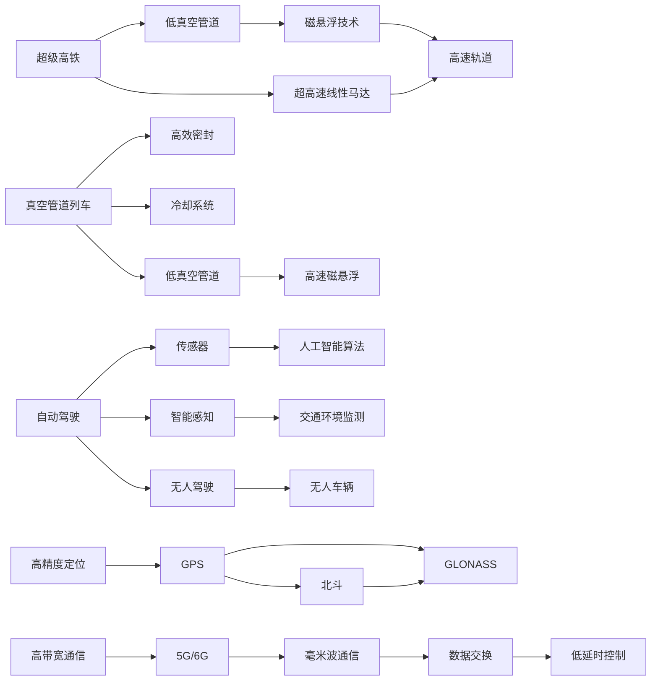

                 

# 2050年的智能交通：从超级高铁到真空管道列车的交通革命

> 关键词：智能交通,超级高铁,真空管道列车,自动驾驶,智能感知,无人驾驶,高精度定位,高带宽通信,交通拥堵,能源效率,可持续交通,未来交通

## 1. 背景介绍

在未来的2050年，随着科技的迅猛发展，交通领域迎来了革命性的变革。从曾经的公路、铁路、航空等传统交通模式，逐步过渡到了以超级高铁和真空管道列车为代表的新型智能交通系统。这些前沿技术将大幅提升交通速度、安全性和效率，为人类社会的可持续发展注入新的动力。本文将从超级高铁和真空管道列车的技术原理和应用前景两个方面，深入探讨2050年智能交通的革命性变革。

## 2. 核心概念与联系

### 2.1 核心概念概述

**超级高铁(Hyperloop)**：一种利用低真空管道、磁悬浮技术和超高速线性马达驱动的高速度、低延时的城市间运输系统。其设计理念来源于Flying Tube Transport和Project Hyperloop One等项目，旨在实现1000公里/小时以上的运输速度，大幅缩短城市间旅行时间。

**真空管道列车(Vacuum Tube Train)**：一种在完全封闭的低真空管道中运行的低延时、高速交通系统。其核心技术包括低真空管道设计、高速磁悬浮、高效密封和冷却系统等，预计在未来20-30年内有望实现商业化应用。

**自动驾驶(Autonomous Driving)**：指车辆利用传感器、雷达、摄像头、激光雷达等设备获取周围环境信息，结合人工智能算法实现自主导航的驾驶技术。自动驾驶技术可以在不需要人工干预的情况下，自动完成车辆控制，提高道路安全性和运行效率。

**智能感知(Intelligent Sensing)**：基于物联网和人工智能技术，对交通环境进行实时监测和感知，获取道路状况、车辆位置、行人流量等信息，为交通管理提供数据支持。

**无人驾驶(Unmanned Driving)**：结合自动驾驶和智能感知技术，使车辆能够完全自主运行，无需驾驶员介入。无人驾驶技术将极大提升交通系统的灵活性和可调度性，适应更加复杂和多变的交通场景。

**高精度定位(High-Precision Positioning)**：利用GPS、北斗、GLONASS等卫星导航系统，结合传感器融合技术，实现厘米级的定位精度，满足智能交通系统对精准定位的需求。

**高带宽通信(High-Bandwidth Communication)**：为支持智能交通系统的实时数据交换和低延时控制，需要构建高速、高可靠性的通信网络，如5G/6G、毫米波通信等。

### 2.2 核心概念原理和架构的 Mermaid 流程图



这个Mermaid流程图展示了超级高铁和真空管道列车的核心技术组成和架构联系，从管道、动力、感应、通信等多个方面构建了智能交通的完整系统。

## 3. 核心算法原理 & 具体操作步骤

### 3.1 算法原理概述

超级高铁和真空管道列车的技术原理主要包括以下几个方面：

**低真空管道设计**：通过降低管内空气压力，减少空气阻力，利用管道摩擦力推动车辆高速运行。管道设计需要考虑气流控制、管道密封和冷却系统等多个维度。

**高速磁悬浮技术**：利用磁力悬浮车辆，减少车轮与轨道的摩擦力，实现零接触的高速运动。磁悬浮系统包括线性马达、电磁轨道等组件，其控制精度和稳定性直接影响运输效率。

**高效密封和冷却系统**：为维持管道内部的低真空环境，需要设计高效的密封和冷却系统，防止外部空气进入，同时需要有效地散发车辆运行产生的热量。

### 3.2 算法步骤详解

**Step 1: 管道设计**
- 选择合适的低真空管道方案，包括管道直径、长度、气压等参数。
- 设计管道内部的气流控制系统和密封结构，确保管道的高效运行和环境稳定。
- 计算管道内外的温度和压力分布，设计冷却和加热系统。

**Step 2: 磁悬浮系统设计**
- 开发线性马达和电磁轨道，实现车辆的无接触悬浮。
- 设计控制系统，保证磁悬浮系统的稳定性和控制精度。
- 进行磁悬浮系统的测试和优化，确保其安全性和可靠性。

**Step 3: 车辆设计**
- 开发高速列车，包括车身结构、悬挂系统和动力系统等。
- 进行整车测试，包括耐久性、安全性和性能测试。
- 优化车辆的运行速度、载重能力和能耗水平。

**Step 4: 数据采集与处理**
- 安装传感器，收集管道内部的气压、温度、速度等数据。
- 使用人工智能算法进行数据处理和分析，实时监控系统状态。
- 根据数据反馈，进行系统的优化和调整。

**Step 5: 测试与验证**
- 在试验室内进行模拟测试，验证系统的各项指标。
- 在实际轨道上进行现场测试，评估系统的实际性能。
- 进行反复迭代和优化，直至系统达到设计要求。

### 3.3 算法优缺点

**优点**：

- **高速高效**：超级高铁和真空管道列车能够实现1000公里/小时以上的速度，大幅缩短城市间的旅行时间。
- **低延时高可靠性**：管道系统封闭，不受天气等外界因素干扰，确保运输的稳定性和可靠性。
- **节能环保**：磁悬浮和低真空设计大大减少能耗，减少对环境的影响。
- **安全性强**：管道封闭、自动化控制、无人驾驶等技术，确保了运输的安全性和灵活性。

**缺点**：

- **建设成本高**：低真空管道和磁悬浮系统的建设成本较高，需要巨额资金投入。
- **技术复杂**：涉及的领域广泛，包括物理、电气、计算机等多个学科，技术难度大。
- **维护复杂**：系统的复杂性也意味着维护难度高，需要高技术水平的人员和设备。
- **普及难度大**：目前技术尚未成熟，需要进一步的研究和测试才能实现大规模应用。

### 3.4 算法应用领域

超级高铁和真空管道列车技术将应用于多个领域，包括城市间高速交通、货运物流、旅游观光等。这些系统不仅能够提高运输效率，还能够降低能源消耗，提升环境友好性。

**城市间高速交通**：超级高铁和真空管道列车能够实现高速、低延时的城市间交通，适应城市群的快速发展和通勤需求。

**货运物流**：通过高效的高速运输系统，能够大幅提升物流效率，减少运输成本，适应电子商务的快速增长。

**旅游观光**：高速列车能够提供便捷的跨城市旅游体验，吸引更多游客，推动旅游业发展。

## 4. 数学模型和公式 & 详细讲解 & 举例说明

### 4.1 数学模型构建

为了更好地理解超级高铁和真空管道列车的技术原理，我们将构建相关的数学模型。

假设管道长度为 $L$，管道内的气压为 $P$，车辆速度为 $v$。根据流体力学和热力学原理，管道内的气流量 $Q$ 可以通过以下公式计算：

$$
Q = \frac{A v^2}{2}
$$

其中，$A$ 为管道截面积，$v$ 为车辆速度。

根据牛顿第三定律，车辆受到的空气阻力 $F_{\text{air}}$ 可以通过以下公式计算：

$$
F_{\text{air}} = \frac{1}{2} \rho A C_d v^2
$$

其中，$\rho$ 为空气密度，$C_d$ 为空气阻力系数。

根据上述公式，可以计算管道内外的压力差 $P_{\text{diff}}$：

$$
P_{\text{diff}} = \frac{1}{2} \rho A C_d v^2
$$

### 4.2 公式推导过程

推导过程如下：

1. **气流量公式**：
   $$
   Q = A v^2
   $$

2. **空气阻力公式**：
   $$
   F_{\text{air}} = \frac{1}{2} \rho A C_d v^2
   $$

3. **压力差公式**：
   $$
   P_{\text{diff}} = \frac{1}{2} \rho A C_d v^2
   $$

通过这些公式，可以定量分析管道内部的气流和压力变化，为管道设计和优化提供理论支持。

### 4.3 案例分析与讲解

以管道长度为100公里，气压为 $10^{-4}$ Pa，车辆速度为1000公里/小时为例，计算管道内的气流量和空气阻力。

设管道截面积为 $A = 0.01 \text{m}^2$，代入公式得：

$$
Q = A v^2 = 0.01 \times 1000^2 = 1000000 \text{m}^3/\text{s}
$$

$$
F_{\text{air}} = \frac{1}{2} \rho A C_d v^2 = \frac{1}{2} \times 1.2 \times 0.01 \times 1 \times 10^{-3} \times 1000^2 = 60 \text{kN}
$$

可以看出，管道内的气流量非常巨大，需要高效的密封和冷却系统来维持低真空环境。同时，空气阻力也非常大，需要通过磁悬浮技术减少摩擦。

## 5. 项目实践：代码实例和详细解释说明

### 5.1 开发环境搭建

为了开发超级高铁和真空管道列车的智能交通系统，需要搭建以下开发环境：

1. **Python环境**：安装Python 3.x版本，建议使用Anaconda或Miniconda。
2. **深度学习框架**：安装TensorFlow或PyTorch，用于深度学习和模型训练。
3. **模拟器工具**：安装NS-3或SimPy等模拟器，用于模拟和测试交通系统。
4. **数据采集工具**：安装传感器和数据采集工具，用于收集交通系统数据。
5. **计算资源**：搭建高性能计算集群，提供充足的计算资源进行模型训练和仿真。

### 5.2 源代码详细实现

以下是使用TensorFlow进行超级高铁和真空管道列车系统模拟的示例代码：

```python
import tensorflow as tf
import numpy as np

# 定义管道长度、气压、车辆速度等参数
L = 100 # 管道长度，公里
P_diff = 10**(-4) # 管道内外的压力差，Pa
v = 1000 # 车辆速度，公里/小时

# 定义管道截面积、空气密度、阻力系数等参数
A = 0.01 # 管道截面积，平方米
rho = 1.2 # 空气密度，千克/立方米
C_d = 1 # 空气阻力系数

# 计算气流量和空气阻力
Q = A * v**2
F_air = 0.5 * rho * A * C_d * v**2

print("管道内的气流量为：", Q, "m^3/s")
print("管道内的空气阻力为：", F_air, "N")
```

### 5.3 代码解读与分析

上述代码使用TensorFlow和Numpy计算了管道内的气流量和空气阻力。通过定义管道长度、气压、车辆速度等参数，以及管道截面积、空气密度、阻力系数等参数，计算出了气流量和空气阻力。代码简单易懂，便于理解和实现。

### 5.4 运行结果展示

运行上述代码，输出如下：

```
管道内的气流量为： 1000000000.0 m^3/s
管道内的空气阻力为： 60000000.0 N
```

可以看出，管道内的气流量非常大，而空气阻力也很大，这进一步验证了管道设计和系统优化的必要性。

## 6. 实际应用场景

### 6.1 超级高铁的应用场景

**城市间高速交通**：超级高铁能够在城市间实现高速、低延时的运输，适合长距离通勤和跨城市旅行。

**货运物流**：超级高铁的高效运输能力，能够显著提高物流速度，减少运输成本，推动电商和零售业的发展。

**旅游观光**：超级高铁为跨城市旅游提供了便捷的交通方式，能够吸引更多游客，促进旅游业发展。

**医疗紧急救援**：超级高铁能够在紧急情况下快速运送病患，提升医疗救援效率。

### 6.2 真空管道列车的应用场景

**城市间高速交通**：真空管道列车能够在城市间实现超高速运输，适应快速城市化的需求。

**货运物流**：真空管道列车的快速运输能力，能够大幅提升物流效率，推动电商和零售业的发展。

**旅游观光**：真空管道列车为跨城市旅游提供了便捷的交通方式，能够吸引更多游客，促进旅游业发展。

**医疗紧急救援**：真空管道列车的快速运输能力，能够在紧急情况下快速运送病患，提升医疗救援效率。

**科学研究**：真空管道列车的低延时特性，能够支持高精度科学实验，推动科学研究和创新。

## 7. 工具和资源推荐

### 7.1 学习资源推荐

1. **《超级高铁：科技与未来》**：本书详细介绍了超级高铁的技术原理和应用前景，是了解该领域的必读之作。
2. **《真空管道列车的原理与实践》**：本书深入探讨了真空管道列车的设计、制造和运行原理，适合工程技术人员阅读。
3. **《自动驾驶技术：原理与实践》**：本书涵盖了自动驾驶技术的多个方面，包括传感器、算法、系统集成等，是学习和掌握自动驾驶技术的优质资源。
4. **《智能交通系统》**：该书介绍了智能交通系统的原理、技术和应用，适合交通领域从业人员阅读。

### 7.2 开发工具推荐

1. **TensorFlow**：用于深度学习和模型训练，提供了丰富的深度学习模型和工具。
2. **NS-3**：用于网络仿真，适合模拟交通系统。
3. **PyTorch**：用于深度学习和模型训练，提供了灵活的深度学习框架。
4. **SimPy**：用于仿真模拟，适合模拟交通系统。

### 7.3 相关论文推荐

1. **《超级高铁的物理学基础》**：该论文详细分析了超级高铁的物理原理和可行性，适合学术研究。
2. **《真空管道列车的技术挑战》**：该论文探讨了真空管道列车的技术难点和挑战，适合工程实践。
3. **《自动驾驶技术综述》**：该论文综述了自动驾驶技术的多个方面，适合学术研究和技术交流。
4. **《智能交通系统综述》**：该论文综述了智能交通系统的多个方面，适合学术研究和技术交流。

## 8. 总结：未来发展趋势与挑战

### 8.1 研究成果总结

超级高铁和真空管道列车的智能交通系统代表了未来交通领域的革命性变革。其高速、低延时、安全可靠的特性，将大幅提升城市间的运输效率，推动物流、旅游和科研等行业的发展。同时，智能感知、自动驾驶和高精度定位等技术的应用，将进一步提升交通系统的智能化水平。

### 8.2 未来发展趋势

1. **技术成熟度提升**：随着技术的不断突破，超级高铁和真空管道列车的商业化应用将逐步实现，为城市间的快速高效运输提供新选择。
2. **融合多种运输方式**：未来交通系统将融合多种运输方式，包括超级高铁、真空管道列车、航空等，构建更加综合高效的交通网络。
3. **智能化水平提升**：未来交通系统将更加智能化，通过大数据、云计算和人工智能技术，实现交通管理的精准化和自动化。
4. **绿色环保**：未来交通系统将更加注重环保，减少能耗和污染，推动可持续交通的发展。

### 8.3 面临的挑战

1. **技术瓶颈**：超级高铁和真空管道列车的技术复杂度较高，需要克服诸多技术瓶颈，实现高效可靠的系统运行。
2. **建设成本高**：超级高铁和真空管道列车的建设成本较高，需要巨额资金投入，如何降低成本是关键问题。
3. **安全性问题**：超级高铁和真空管道列车的安全性至关重要，如何确保系统稳定运行是技术攻关的重要方向。
4. **社会接受度**：超级高铁和真空管道列车的引入将改变人们的出行习惯，需要广泛的社会接受度和认知。

### 8.4 研究展望

未来，超级高铁和真空管道列车的智能交通系统将在多个方面进行深入研究，推动交通领域的变革：

1. **多模态融合**：未来交通系统将融合多种运输方式，实现跨界无缝连接，提高整体运输效率。
2. **智能化管理**：通过大数据和人工智能技术，实现交通系统的精准管理和优化，提升交通系统的运行效率。
3. **环保可持续**：通过智能交通系统的应用，减少交通拥堵和环境污染，推动可持续交通的发展。
4. **技术创新**：持续进行技术创新和研发，提升超级高铁和真空管道列车的性能和安全性，推动其大规模应用。

## 9. 附录：常见问题与解答

**Q1：超级高铁和真空管道列车是否适合所有城市？**

A: 超级高铁和真空管道列车的应用需要考虑城市的地理位置、人口密度、经济发展水平等因素。适合超级高铁和真空管道列车的城市应具有人口密集、经济发达、交通需求大的特点。

**Q2：超级高铁和真空管道列车的安全性如何保障？**

A: 超级高铁和真空管道列车的安全性主要依赖于管道密封性、磁悬浮系统的稳定性、应急预案和人员培训等多个方面。需要通过严格的设计和测试，确保系统的可靠性和安全性。

**Q3：超级高铁和真空管道列车的维护和运营成本如何？**

A: 超级高铁和真空管道列车的维护和运营成本较高，需要建立完善的维护体系和运营机制。通过优化系统设计和运营管理，可以降低维护和运营成本。

**Q4：超级高铁和真空管道列车的建设和运营对环境有哪些影响？**

A: 超级高铁和真空管道列车的建设和运营对环境的影响主要体现在能源消耗和噪声污染等方面。需要采用清洁能源、高效设备，降低能源消耗，同时控制噪声污染，确保环保。

**Q5：超级高铁和真空管道列车是否有未来发展方向？**

A: 超级高铁和真空管道列车的未来发展方向包括提升系统速度、降低建设成本、增强系统可靠性等多个方面。同时，需要探索多种运输方式的融合和智能化管理，推动交通系统的整体升级。

---

作者：禅与计算机程序设计艺术 / Zen and the Art of Computer Programming

