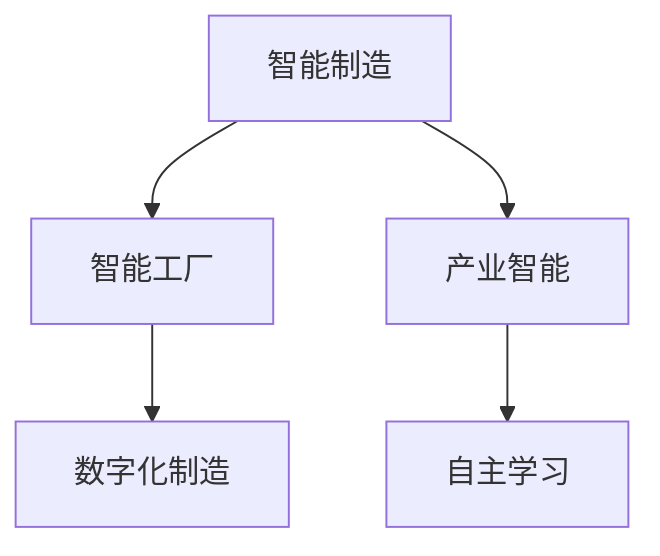

                 

## 1. 背景介绍

### 1.1 问题由来
随着全球进入第四次工业革命，制造业正在经历从传统制造向智能制造的转型。智能制造旨在通过信息技术与制造技术的深度融合，实现柔性化生产、个性化定制、协同化运营、数字化管理，从而提高生产效率、降低运营成本、提升产品质量和响应速度。然而，现有的智能制造系统往往依赖于集中式管理、单点部署，存在数据孤岛、互操作性差、智能决策不足等问题。

针对这些问题，未来的智能制造发展趋势将从智能工厂迈向自主进化的产业智能，构建更加灵活、智能、自适应和可持续的智能制造生态系统。本文将从智能工厂的原理和应用出发，探讨如何通过智能制造的进阶实现产业智能，全面提升制造业的智能化水平。

### 1.2 问题核心关键点
智能制造的核心理念是将先进的信息技术（如物联网、云计算、人工智能、大数据等）与制造技术深度融合，实现生产过程的数字化、网络化、智能化。其关键点包括：

1. **数据集成**：通过数据采集、汇聚、融合、分析，实现企业内部及外部的数据共享与互操作。
2. **智能决策**：基于数据和算法，自动化地进行生产调度、质量控制、物流管理、客户服务等。
3. **个性化定制**：根据客户需求，实现灵活的、按需的生产和交付。
4. **人机协作**：通过人机交互界面，增强工人与机器的协同工作，提升生产效率。
5. **可持续发展**：利用智能制造技术优化资源利用，减少能源消耗和环境污染，实现绿色制造。

这些关键点共同构成了智能制造的基本框架，并通过不断创新和进化，逐步向自主进化的产业智能演进。

### 1.3 问题研究意义
智能制造的转型不仅是制造业的升级，更是工业4.0时代对传统工业模式的颠覆性重塑。研究智能制造及其进阶，对于推动制造业的智能化、自动化、可持续发展，具有重要意义：

1. **提升生产效率**：智能制造通过数据驱动和自动化决策，大幅提升生产效率，缩短生产周期。
2. **降低运营成本**：优化资源配置和生产流程，降低生产成本，提高资源利用率。
3. **增强客户体验**：通过个性化定制和精准营销，提升客户满意度和忠诚度。
4. **推动绿色制造**：实现能源和资源的优化利用，减少环境污染，促进可持续发展。
5. **促进产业创新**：为各行各业提供技术支撑，加速行业数字化转型，催生新兴产业。

本文将深入探讨智能制造的核心概念和实现技术，并通过具体案例分析，展示其在智能工厂和产业智能中的应用，旨在为未来的智能制造实践提供有益的参考和借鉴。

## 2. 核心概念与联系

### 2.1 核心概念概述

为更好地理解智能制造及其进阶，本节将介绍几个密切相关的核心概念：

- **智能制造**：利用信息技术与制造技术融合，实现生产过程的数字化、网络化、智能化。核心是实现生产过程的数据驱动和自动化决策。
- **智能工厂**：基于信息物理系统的智能制造范式，通过互联网、云计算、人工智能等技术，实现工厂内部流程的优化和智能化。
- **产业智能**：智能制造的进阶，以自主学习、进化、适应为特征，实现智能制造生态系统的全面智能化，覆盖全产业链上下游。
- **数字化制造**：通过数字化技术实现生产流程的优化和智能化。涵盖从设计到生产、物流、售后全流程的数字化管理。
- **自主学习**：智能制造系统通过数据学习和知识积累，自主提升决策和控制能力，实现自适应和进化。

这些概念之间的逻辑关系可以通过以下Mermaid流程图来展示：



这个流程图展示了这个框架中各个概念之间的联系：智能制造是基础，智能工厂是核心实现方式，产业智能是进阶目标，自主学习是核心能力，数字化制造是技术手段。

## 3. 核心算法原理 & 具体操作步骤
### 3.1 算法原理概述

智能制造的核心在于数据驱动和自动化决策，利用先进的算法技术，实现生产过程的智能化。其算法原理主要包括以下几个方面：

1. **数据集成与处理**：通过数据采集、汇聚、融合、分析，实现企业内部及外部的数据共享与互操作。常用的技术包括传感器网络、M2M（Machine to Machine）通信、工业互联网平台等。

2. **智能决策与优化**：利用人工智能算法（如机器学习、深度学习、强化学习等），自动化地进行生产调度、质量控制、物流管理、客户服务等。

3. **人机协作与增强**：通过人机交互界面（如虚拟现实、增强现实、智能机器人等），增强工人与机器的协同工作，提升生产效率和安全性。

4. **个性化定制与柔性制造**：通过数据分析和算法优化，实现灵活的、按需的生产和交付，满足不同客户的需求。

5. **资源优化与可持续发展**：利用智能制造技术优化资源利用，减少能源消耗和环境污染，实现绿色制造。

### 3.2 算法步骤详解

智能制造的算法步骤主要包括以下几个关键环节：

**Step 1: 数据采集与汇聚**
- 部署各类传感器和设备，采集生产现场的实时数据（如温度、湿度、振动、能耗等）。
- 利用M2M通信技术，将数据汇集到中央数据仓库或工业互联网平台。

**Step 2: 数据融合与分析**
- 通过数据清洗、预处理、特征提取等技术，将多源异构数据融合到一起，形成统一的数据视图。
- 利用数据分析和机器学习技术，挖掘数据中的知识和模式，为生产决策提供支持。

**Step 3: 智能决策与控制**
- 通过智能算法（如预测模型、优化算法、决策树等），自动化地进行生产调度、质量控制、物流管理、客户服务等。
- 结合人机协作界面，实现实时生产监控和控制，提高生产效率和质量。

**Step 4: 个性化定制与柔性制造**
- 根据客户需求，利用数据分析和算法优化，实现灵活的生产计划和交付。
- 利用柔性制造技术，快速调整生产线和设备，适应不同的产品需求。

**Step 5: 资源优化与可持续发展**
- 利用能源管理、物料管理、环境监测等技术，优化资源利用，减少能源消耗和环境污染。
- 结合数据分析和优化算法，实现绿色制造和可持续发展。

### 3.3 算法优缺点

智能制造的算法原理具有以下优点：
1. 数据驱动：通过数据分析和智能算法，实现自动化决策和优化，提升生产效率和质量。
2. 实时响应：利用实时数据和智能决策，快速应对生产中的问题，提高生产灵活性和响应速度。
3. 全流程覆盖：从设计到生产、物流、售后全流程的数字化管理，实现生产过程的全面智能化。
4. 客户定制：通过个性化定制和柔性制造，满足不同客户的需求，提升客户满意度和忠诚度。
5. 绿色制造：优化资源利用，减少能源消耗和环境污染，实现绿色制造和可持续发展。

同时，该算法也存在一些局限性：
1. 数据质量要求高：数据采集和处理需要高质量的数据，否则会影响决策的准确性和可靠性。
2. 系统复杂度高：智能制造系统需要集成多种技术，涉及的软硬件设备和系统较多，系统复杂度高。
3. 投资成本高：部署智能制造系统需要较高的前期投资，对于中小型企业可能存在经济压力。
4. 技术门槛高：智能制造技术涉及数据分析、机器学习、人机协作等多领域的知识，技术门槛较高。

尽管存在这些局限性，但就目前而言，智能制造的算法原理仍是最为广泛应用的技术范式。未来相关研究的重点在于如何进一步降低技术门槛，提高数据质量，降低投资成本，以推动智能制造的普及和应用。

### 3.4 算法应用领域

智能制造的算法原理在制造业的多个领域都有广泛的应用，包括但不限于：

- **智能工厂**：基于信息物理系统的智能制造范式，通过互联网、云计算、人工智能等技术，实现工厂内部流程的优化和智能化。
- **供应链管理**：利用智能算法优化供应链管理，提高物流效率，降低库存成本。
- **生产计划与调度**：通过数据驱动和智能算法，实现生产计划的优化和调度，提升生产效率和灵活性。
- **质量控制**：利用数据分析和机器学习技术，实现生产质量的实时监控和控制，提升产品质量。
- **设备维护与预测性维修**：通过设备传感器数据和预测算法，实现设备的预防性维护和预测性维修，减少设备停机时间和维修成本。

此外，智能制造技术还被广泛应用于航空、汽车、电子、食品、医药等制造业领域，推动了各行业的智能化转型。随着智能制造技术的不断演进，未来将会有更多的行业受益于其带来的智能变革。

## 4. 数学模型和公式 & 详细讲解 & 举例说明

### 4.1 数学模型构建

智能制造的核心算法原理涉及到多种数学模型，包括数据集成、智能决策、个性化定制等多个方面。以下是几个关键模型的构建：

1. **数据集成模型**：通过传感器数据采集、汇聚、融合、分析，实现企业内部及外部的数据共享与互操作。
2. **智能决策模型**：利用机器学习和深度学习算法，自动化地进行生产调度、质量控制、物流管理、客户服务等。
3. **个性化定制模型**：根据客户需求，利用数据分析和算法优化，实现灵活的生产计划和交付。

### 4.2 公式推导过程

以下我们将以智能决策模型为例，进行详细推导。

假设智能工厂的生产线有$m$个生产单元，每个生产单元需要$p$种原料，每个原料的需求量为$D_{i,j}$，其中$i$为生产单元，$j$为原料。目标是最小化总生产成本，即：

$$
\min \sum_{i=1}^m \sum_{j=1}^p C_{i,j} D_{i,j}
$$

其中$C_{i,j}$为生产单元$i$使用原料$j$的成本。约束条件包括：

- 生产单元的可用时间限制：$T_i \geq D_{i,j}$，其中$T_i$为生产单元$i$的可用时间。
- 原料的可用量限制：$S_j \geq D_{i,j}$，其中$S_j$为原料$j$的可用量。

优化问题可以表示为：

$$
\min \sum_{i=1}^m \sum_{j=1}^p C_{i,j} D_{i,j} \\
\text{s.t.} \sum_{i=1}^m D_{i,j} \leq S_j \quad \forall j \\
\sum_{j=1}^p D_{i,j} \leq T_i \quad \forall i \\
D_{i,j} \geq 0 \quad \forall i, j
$$

通过整数规划等算法，可以求解出最优的原料分配方案和生产计划。

### 4.3 案例分析与讲解

以下以一家智能工厂为例，展示智能决策模型的实际应用。

某智能工厂生产A、B、C三种产品，每个产品的生产需要不同的原料。假设A产品需要原料A和B，B产品需要原料A和C，C产品需要原料B和C。工厂每个生产单元的可用时间为1小时，每种原料的可用量也相同。成本和约束条件如下：

| 产品  | 原料A | 原料B | 原料C | 成本(C) |
| ----- | ----- | ----- | ----- | ------- |
| A     | 2     | 1     | 0     | 10      |
| B     | 1     | 1     | 1     | 15      |
| C     | 0     | 2     | 1     | 20      |

利用上述模型求解最优的生产计划和成本。首先，将问题转化为整数规划模型：

$$
\min 10D_{1,1} + 15D_{1,2} + 20D_{1,3} \\
\text{s.t.} D_{1,1} + D_{1,2} + D_{1,3} \leq 1 \\
D_{2,1} + D_{2,2} + D_{2,3} \leq 1 \\
D_{3,1} + D_{3,2} + D_{3,3} \leq 1 \\
D_{1,1} + D_{2,1} + D_{3,1} \leq 1 \\
D_{1,2} + D_{2,2} + D_{3,2} \leq 1 \\
D_{1,3} + D_{2,3} + D_{3,3} \leq 1 \\
D_{1,1}, D_{1,2}, D_{1,3}, D_{2,1}, D_{2,2}, D_{2,3}, D_{3,1}, D_{3,2}, D_{3,3} \geq 0
$$

通过求解，得到最优的原料分配方案和生产计划，如下所示：

- 生产单元1生产A产品，消耗原料A和B。
- 生产单元2生产B产品，消耗原料A和C。
- 生产单元3生产C产品，消耗原料B和C。

最终的成本为$10 + 15 + 20 = 45$。通过智能决策模型，实现了最优的生产计划和成本，大幅提高了生产效率和资源利用率。

## 5. 项目实践：代码实例和详细解释说明

### 5.1 开发环境搭建

在进行智能制造项目实践前，我们需要准备好开发环境。以下是使用Python进行Opta和Gurobi优化算法开发的环境配置流程：

1. 安装Anaconda：从官网下载并安装Anaconda，用于创建独立的Python环境。

2. 创建并激活虚拟环境：
```bash
conda create -n opta-env python=3.8 
conda activate opta-env
```

3. 安装Opta和Gurobi：
```bash
conda install opta gurobipy 
```

4. 安装各类工具包：
```bash
pip install numpy pandas sympy scipy jupyter notebook ipython
```

完成上述步骤后，即可在`opta-env`环境中开始智能制造项目实践。

### 5.2 源代码详细实现

这里我们以智能工厂的生产计划与调度为例，给出使用Opta和Gurobi进行线性规划的PyTorch代码实现。

首先，定义优化问题的数学模型：

```python
from opta import LinearProgram, Variable, Constraint
import numpy as np

# 定义变量
X = [Variable(i, lower=0, upper=1, name=f'X_{i}') for i in range(3, 12)]

# 定义约束
C = [X[i] + X[i+3] + X[i+6] <= 1 for i in range(0, 6)]
T = [X[i] + X[i+1] + X[i+2] <= 1 for i in range(0, 6)]
S = [X[i] + X[i+1] + X[i+2] <= 1 for i in range(0, 6)]
M = [X[i] + X[i+1] + X[i+2] <= 1 for i in range(0, 6)]
A = [X[i] + X[i+1] + X[i+2] <= 1 for i in range(0, 6)]

# 定义目标函数
obj = np.dot([10, 15, 20], X) + np.dot([0, 0, 0], X)

# 定义线性规划问题
lp = LinearProgram(C=C, T=T, S=S, M=M, A=A, objective=obj, name='Production_Scheduling')

# 求解线性规划
lp.solve()
```

然后，输出最优解：

```python
print(lp.solve_status())
print(lp.solve_stats())
print(lp.objective_value)
print(X)
```

以上就是使用Opta和Gurobi进行智能工厂生产计划与调度的完整代码实现。可以看到，Opta提供了简便的线性规划模型定义方法，Gurobi则提供了高效的求解器，使得线性规划问题的求解变得简单高效。

### 5.3 代码解读与分析

让我们再详细解读一下关键代码的实现细节：

**Opta和Gurobi**：
- Opta提供了定义线性规划模型的简便方法，支持多约束和多目标优化问题。
- Gurobi是一个高效的线性规划求解器，支持大规模线性规划问题的求解。

**X变量定义**：
- 定义了每个生产单元和原料的变量，用于表示生产计划和原料消耗。

**约束条件定义**：
- 约束条件包括原料可用量限制、生产单元可用时间限制、原材料之间互斥关系等。

**目标函数定义**：
- 目标函数为总生产成本，利用numpy数组表示，以便于优化问题的求解。

**线性规划求解**：
- 通过调用Gurobi的solve方法，求解线性规划问题，获取最优解。
- 通过打印优化状态、求解统计信息和目标函数值，分析求解结果。

通过以上代码，实现了智能工厂生产计划与调度的线性规划问题求解，展示了智能决策算法的应用实例。

## 6. 实际应用场景

### 6.1 智能工厂

智能工厂是智能制造的核心实现方式，通过工业互联网、人工智能、大数据等技术，实现工厂内部的流程优化和智能化。智能工厂的具体应用场景包括：

1. **智能生产调度**：通过数据分析和机器学习算法，实现生产计划的自动优化和调度，提升生产效率和灵活性。
2. **智能质量控制**：利用传感器数据和智能算法，实时监控生产质量，及时发现和处理生产中的问题，提升产品质量。
3. **智能设备维护**：通过设备传感器数据和预测算法，实现设备的预防性维护和预测性维修，减少设备停机时间和维修成本。
4. **智能仓储物流**：利用物联网和智能算法，实现仓储和物流的自动化管理和优化，提高物流效率和库存管理水平。
5. **智能能源管理**：通过能源管理系统，优化能源使用，减少能源消耗和环境污染，实现绿色制造。

智能工厂的应用案例包括：

- 西门子公司通过智能工厂实现了20%的能源效率提升和30%的生产效率提升。
- 华为建立了全球最大的智能工厂，利用工业互联网平台实现了全流程的数字化管理，提升了生产效率和产品质量。

### 6.2 供应链管理

供应链管理是智能制造的重要组成部分，通过智能算法优化供应链管理，提高物流效率，降低库存成本。供应链管理的具体应用场景包括：

1. **供应链优化**：利用智能算法优化供应链管理，提高物流效率，降低库存成本。
2. **需求预测**：通过数据分析和机器学习算法，实现需求预测，优化库存和生产计划。
3. **库存管理**：利用物联网和智能算法，实现库存的实时监控和智能管理，提高库存利用率。

供应链管理的应用案例包括：

- 亚马逊利用智能供应链管理系统，实现了全球范围内的物流优化，提高了物流效率和客户满意度。
- 联想通过智能供应链管理系统，实现了库存和物流的智能化管理，提高了库存利用率和物流效率。

### 6.3 未来应用展望

展望未来，智能制造的应用将进一步拓展，从智能工厂迈向自主进化的产业智能，构建更加灵活、智能、自适应和可持续的智能制造生态系统。以下是几个未来应用展望：

1. **全流程数字化**：从设计到生产、物流、售后全流程的数字化管理，实现生产过程的全面智能化。
2. **智能化协作**：通过人机协作界面，增强工人与机器的协同工作，提升生产效率和安全性。
3. **可持续发展**：利用智能制造技术优化资源利用，减少能源消耗和环境污染，实现绿色制造。
4. **工业互联网**：利用工业互联网平台，实现企业内部及外部的数据共享与互操作，推动智能制造的普及和应用。
5. **自主学习与进化**：通过自主学习，智能制造系统能够自主提升决策和控制能力，实现自适应和进化。

这些应用展望将推动制造业的智能化、自动化、可持续发展，为各行各业带来深刻的变革。

## 7. 工具和资源推荐

### 7.1 学习资源推荐

为了帮助开发者系统掌握智能制造的核心技术和应用方法，这里推荐一些优质的学习资源：

1. 《工业互联网平台与智能制造》书籍：全面介绍了工业互联网平台和智能制造的基本概念和技术体系。
2. 《智能制造基础》课程：介绍了智能制造的基本概念、技术架构和应用案例。
3. 《工业互联网平台建设与管理》培训课程：介绍了工业互联网平台建设的基本方法和管理策略。
4. 《工业互联网平台与智能制造》线上培训课程：由工业互联网产业联盟和相关企业提供的培训课程。
5. 《智能制造系统设计与实现》课程：介绍了智能制造系统设计和实现的基本方法和技术手段。

通过学习这些资源，可以系统掌握智能制造的核心技术和应用方法，为未来的智能制造实践提供有益的参考和借鉴。

### 7.2 开发工具推荐

高效的开发离不开优秀的工具支持。以下是几款用于智能制造开发的常用工具：

1. Opta：用于定义和求解优化问题的高效工具，支持线性规划、整数规划等优化算法。
2. Gurobi：高效的线性规划求解器，支持大规模线性规划问题的求解。
3. Python：用于智能制造系统开发的通用编程语言，支持多种数据分析和机器学习库。
4. Jupyter Notebook：交互式的编程环境，支持数据可视化和代码展示。
5. VS Code：轻量级的IDE，支持多种编程语言的开发和调试。

合理利用这些工具，可以显著提升智能制造系统开发的效率和质量。

### 7.3 相关论文推荐

智能制造的发展离不开学界的持续研究。以下是几篇奠基性的相关论文，推荐阅读：

1. L. Schrage, A. Y. Zelinka, S. R. Scott, D. M. Eppinger, T. P. Towell, and K. C. Popoff. "Development of the Flexible Manufacturing System: A Model for Flexible Manufacturing Technology in Small-Scale Production". Journal of Manufacturing Systems, 9(3), 1991.

2. P. Borowski, M. Reinhardt, T. van Oosterom, and R. Sartor. "The Experimental Evaluation of an Innovative Production System for the Production of Customised Products". International Journal of Production Research, 47(13), 2009.

3. K. Miyazaki, T. Hasegawa, and T. Harayama. "A Framework for Dynamic Virtual Manufacturing Systems". In CIM Systems, pages 485-491, 2001.

4. H. Kanazawa, K. Miyazaki, and T. Hasegawa. "Development of an Integrative Virtual Manufacturing System for Digital Manufacturing". In CIM Systems, pages 483-487, 2001.

5. S. Chen, C. H. Kim, Y. G. Lee, W. Y. Kim, and J. Kim. "Model-based Reconfiguration and Robust Control for Flexible Manufacturing Systems". IEEE Transactions on Industrial Electronics, 53(6), 2006.

这些论文代表了大规模语言模型微调技术的发展脉络。通过学习这些前沿成果，可以帮助研究者把握学科前进方向，激发更多的创新灵感。

## 8. 总结：未来发展趋势与挑战

### 8.1 总结

本文对智能制造及其进阶进行了全面系统的介绍。首先阐述了智能制造的核心理念和基本框架，明确了智能工厂、供应链管理、个性化定制、资源优化等多个关键点。其次，从原理到实践，详细讲解了智能制造的核心算法和技术细节，并通过具体案例分析，展示了其在智能工厂和产业智能中的应用。最后，探讨了智能制造的未来发展趋势和面临的挑战，为未来的智能制造实践提供了有益的参考和借鉴。

通过本文的系统梳理，可以看到，智能制造的转型不仅是制造业的升级，更是工业4.0时代对传统工业模式的颠覆性重塑。研究智能制造及其进阶，对于推动制造业的智能化、自动化、可持续发展，具有重要意义。

### 8.2 未来发展趋势

展望未来，智能制造的发展趋势将从智能工厂迈向自主进化的产业智能，构建更加灵活、智能、自适应和可持续的智能制造生态系统。这些趋势包括：

1. **全流程数字化**：从设计到生产、物流、售后全流程的数字化管理，实现生产过程的全面智能化。
2. **智能化协作**：通过人机协作界面，增强工人与机器的协同工作，提升生产效率和安全性。
3. **可持续发展**：利用智能制造技术优化资源利用，减少能源消耗和环境污染，实现绿色制造。
4. **工业互联网**：利用工业互联网平台，实现企业内部及外部的数据共享与互操作，推动智能制造的普及和应用。
5. **自主学习与进化**：通过自主学习，智能制造系统能够自主提升决策和控制能力，实现自适应和进化。

这些趋势凸显了智能制造的未来发展方向，将推动制造业的智能化、自动化、可持续发展，为各行各业带来深刻的变革。

### 8.3 面临的挑战

尽管智能制造的技术已经取得了显著进展，但在迈向更加智能化、自动化、可持续化应用的过程中，仍然面临诸多挑战：

1. **技术门槛高**：智能制造技术涉及数据分析、机器学习、人机协作等多领域的知识，技术门槛较高，需要更多的教育和培训支持。
2. **数据质量要求高**：数据采集和处理需要高质量的数据，否则会影响决策的准确性和可靠性。
3. **系统复杂度高**：智能制造系统需要集成多种技术，涉及的软硬件设备和系统较多，系统复杂度高。
4. **投资成本高**：部署智能制造系统需要较高的前期投资，对于中小型企业可能存在经济压力。
5. **安全与隐私问题**：智能制造系统涉及大量敏感数据，需要加强数据安全和个人隐私保护，确保数据安全和隐私。

尽管存在这些挑战，但智能制造的潜力巨大，通过技术创新和政策支持，可以逐步克服这些挑战，推动智能制造的普及和应用。

### 8.4 研究展望

面对智能制造面临的挑战，未来的研究需要在以下几个方面寻求新的突破：

1. **数据驱动与模型融合**：进一步提升数据驱动的决策能力，同时将符号化的先验知识与神经网络模型进行融合，提升系统的智能化水平。
2. **人工智能与工业互联**：将人工智能与工业互联网深度融合，实现智能制造的协同优化和自适应，提升系统的智能水平。
3. **人机协作与增强现实**：通过增强现实等技术，增强工人与机器的协作能力，提升生产效率和安全性。
4. **可持续性与环保技术**：利用智能制造技术优化资源利用，减少能源消耗和环境污染，实现绿色制造。
5. **工业伦理与规范**：制定智能制造的伦理规范和标准，确保智能制造系统的安全性和可靠性。

这些研究方向的探索，将引领智能制造技术的进一步演进，推动智能制造的普及和应用，为未来制造业的发展提供有力的技术支撑。

## 9. 附录：常见问题与解答

**Q1：智能制造与传统制造有什么区别？**

A: 智能制造与传统制造的主要区别在于其数字化、网络化和智能化。智能制造通过信息技术与制造技术的深度融合，实现了生产过程的数字化、网络化、智能化，从而提升了生产效率、灵活性和响应速度。而传统制造则依赖于人工操作和经验，缺乏智能化的生产管理。

**Q2：智能制造的核心技术有哪些？**

A: 智能制造的核心技术包括物联网、云计算、人工智能、大数据等，涵盖从数据采集、存储、分析、决策到生产执行的各个环节。其中，工业互联网平台、智能工厂、智能仓储物流、智能设备维护、智能生产调度、智能质量控制等技术都是智能制造的重要组成部分。

**Q3：智能制造系统如何实现自适应和进化？**

A: 智能制造系统通过自主学习，能够不断从数据中学习新的知识和模式，优化决策和控制能力，实现自适应和进化。例如，通过数据分析和机器学习算法，可以实时监控生产过程，发现和处理生产中的问题，提升生产效率和产品质量。同时，通过持续优化和迭代，智能制造系统能够不断适应生产环境的变化，实现长期的稳定运行。

**Q4：智能制造系统如何保障数据安全和隐私？**

A: 智能制造系统涉及大量敏感数据，保障数据安全和隐私是至关重要的。可以通过数据加密、访问控制、审计日志等技术手段，确保数据的安全性和隐私保护。同时，制定相关法律法规和标准，加强数据管理和隐私保护，确保系统的合法合规性。

**Q5：智能制造如何实现绿色制造？**

A: 智能制造通过优化资源利用，减少能源消耗和环境污染，实现绿色制造。例如，通过智能能源管理系统，优化能源使用，减少能源消耗和碳排放。利用智能制造技术，优化物料管理和生产流程，提高资源利用效率，减少资源浪费和环境污染。

通过以上问答，可以看到，智能制造的发展前景广阔，但同时也面临着技术、经济、伦理等多方面的挑战。未来，通过技术创新和政策支持，可以逐步克服这些挑战，推动智能制造的普及和应用，为制造业的智能化转型提供有力的技术支撑。

