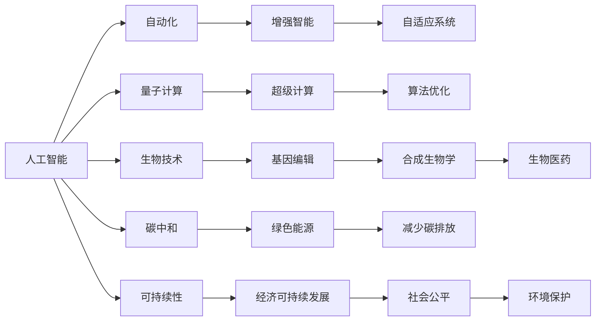

                 

# 2050年的未来学：从预测未来到设计未来的前瞻性思维

## 1. 背景介绍

在科技创新日新月异的今天，未来学（Futurology）正成为我们理解与塑造未来的重要工具。正如尼葛洛庞帝（Nicholas Negroponte）所言，预测未来的最佳方式是创造未来。本文将深入探讨从预测未来到设计未来的前瞻性思维，着眼于2050年，探索未来学如何帮助我们构建一个可持续、公正、智能的未来。

### 1.1 为什么需要未来学？

随着全球科技的迅猛发展，未来学的必要性愈发凸显。科技的进步在带来便利的同时，也引发了一系列社会、经济、伦理等方面的挑战。未来学通过预测和设计，帮助我们理解科技趋势、社会变迁、环境变化等复杂因素，从而制定更为科学、可行的战略与政策。

### 1.2 未来学的应用范围

未来学不仅限于科技预测，还涉及文化、政治、经济等多个领域。在2050年，我们期望见证人工智能、量子计算、生物技术等前沿技术的突破，同时也关注社会公平、环境保护等价值导向问题。未来学将帮助我们理解这些领域的发展趋势，为政策制定、社会变革提供理论基础。

## 2. 核心概念与联系

### 2.1 核心概念概述

为了更好地理解2050年的未来，我们需要掌握一些关键概念：

- **人工智能**：AI技术正在深刻改变社会、经济、文化等各个方面，包括自动化、增强智能、自适应系统等。
- **量子计算**：量子计算有望提供超乎想象的计算能力，用于解决复杂问题，如药物设计、密码学等。
- **生物技术**：基因编辑、合成生物学等技术正在快速发展，有望彻底改变医学、农业、环境保护等领域。
- **碳中和**：为应对气候变化，全球正在推动碳中和目标，寻找绿色能源、减少碳排放等途径。
- **可持续性**：包括经济、社会、环境三个维度的可持续发展，旨在为子孙后代创造一个宜居的世界。

### 2.2 核心概念原理和架构的 Mermaid 流程图



## 3. 核心算法原理 & 具体操作步骤

### 3.1 算法原理概述

未来学中的预测与设计涉及复杂的算法和模型。本文将介绍几个核心算法：

- **时间序列预测算法**：通过历史数据，预测未来某一时期内的变化趋势。
- **机器学习算法**：用于发现数据中的模式，为决策提供支持。
- **情景分析**：构建多个可能的情景，评估不同情景下的影响。
- **系统动力学模型**：模拟系统变化，分析政策对系统状态的影响。

### 3.2 算法步骤详解

未来学中的预测与设计步骤包括：

1. **数据收集**：收集历史数据、社会经济指标、环境数据等。
2. **数据处理**：清洗、预处理、特征工程等。
3. **模型训练**：选择或开发适当的算法，进行训练。
4. **情景模拟**：构建多个情景，评估其可行性。
5. **政策设计**：基于情景模拟结果，设计政策或战略。
6. **评估与迭代**：评估政策效果，进行必要的调整。

### 3.3 算法优缺点

未来学中的预测与设计算法具有以下优点：

- 能提供基于数据支持的科学预测。
- 多情景模拟可评估不同决策的影响。
- 系统动力学模型能模拟复杂系统的行为。

但同时也存在缺点：

- 数据质量影响预测准确性。
- 模型复杂度高，难以解释。
- 情景模拟的假设可能与现实不符。

### 3.4 算法应用领域

未来学算法广泛应用在多个领域：

- **科技预测**：如人工智能、量子计算、生物技术等。
- **环境预测**：气候变化、生态系统变化等。
- **社会预测**：人口增长、经济发展、社会公正等。
- **政策设计**：如碳中和政策、教育改革等。

## 4. 数学模型和公式 & 详细讲解 & 举例说明

### 4.1 数学模型构建

未来学中的模型构建通常包括以下步骤：

1. **目标设定**：明确预测目标，如预测温度变化、碳排放量等。
2. **数据准备**：收集和准备相关数据，进行清洗和预处理。
3. **模型选择**：选择合适的模型，如ARIMA、SVM、神经网络等。
4. **模型训练**：使用历史数据训练模型。
5. **模型评估**：使用测试数据评估模型性能。
6. **情景模拟**：构建情景，进行模拟预测。
7. **政策评估**：评估不同政策的效果。

### 4.2 公式推导过程

以时间序列预测为例，我们假设历史数据为 $y_t$，预测模型为 $\hat{y}_t = f(y_{t-1}, y_{t-2}, ..., y_{t-m})$。预测公式为：

$$
\hat{y}_t = a_0 + a_1y_{t-1} + a_2y_{t-2} + ... + a_my_{t-m} + \epsilon_t
$$

其中，$a_i$ 为系数，$\epsilon_t$ 为随机误差。

### 4.3 案例分析与讲解

以气候变化为例，我们可以通过收集历史气温数据，使用时间序列预测模型进行气温变化预测。模型参数 $a_i$ 可以通过历史数据进行估计。预测结果可以用于评估不同减排政策的效果，为政策制定提供科学依据。

## 5. 项目实践：代码实例和详细解释说明

### 5.1 开发环境搭建

在进行未来学预测与设计实践前，需要准备好开发环境。以下是使用Python进行Python脚本开发的流程：

1. 安装Anaconda：从官网下载并安装Anaconda，用于创建独立的Python环境。
2. 创建并激活虚拟环境：
```bash
conda create -n pyfuturology python=3.8 
conda activate pyfuturology
```
3. 安装必要的工具包：
```bash
pip install pandas numpy scikit-learn statsmodels matplotlib
```

### 5.2 源代码详细实现

以下是一个使用Python脚本进行时间序列预测的示例代码。

```python
import pandas as pd
import numpy as np
from statsmodels.tsa.arima_model import ARIMA
from statsmodels.tsa.stattools import adfuller

# 读取数据
data = pd.read_csv('temperature.csv')

# 进行单位根检验
result = adfuller(data['temperature'])
print('ADF Statistic: %f' % result[0])
print('p-value: %f' % result[1])

# 构建ARIMA模型
model = ARIMA(data['temperature'], order=(1, 1, 1))
results = model.fit()

# 预测未来气温
forecast = results.forecast(steps=12)
print(forecast)

# 可视化预测结果
import matplotlib.pyplot as plt
plt.plot(data['temperature'], label='Actual')
plt.plot(forecast, label='Forecast')
plt.legend()
plt.show()
```

### 5.3 代码解读与分析

代码中使用了Python的pandas、numpy、scikit-learn、statsmodels等库，进行了数据读取、单位根检验、ARIMA模型构建、模型拟合、预测和可视化。其中，时间序列预测模型ARIMA通过历史数据预测未来气温变化，并通过可视化展示预测结果。

## 6. 实际应用场景

### 6.1 智能城市

未来学在智能城市建设中的应用前景广阔。通过对城市交通、能源、环境等数据的预测与分析，可以优化城市规划，提升居民生活质量。例如，预测交通流量、优化交通信号灯控制，减少拥堵；预测能耗，优化能源使用，实现碳中和目标。

### 6.2 健康管理

未来学可以用于健康管理和疾病预防。通过对疾病传播数据的预测与分析，可以及时采取预防措施。例如，预测流感爆发，提醒公众注意防护；预测传染病风险，指导疫苗接种。

### 6.3 教育与培训

未来学在教育与培训中同样具有重要应用。通过对学生学习数据的预测与分析，可以优化教学资源分配，提升教学效果。例如，预测学生成绩变化，调整教学策略；预测学生兴趣点，推荐个性化学习内容。

### 6.4 未来应用展望

未来学将深刻影响2050年的科技、社会、环境等领域。在技术方面，人工智能、量子计算、生物技术等将带来翻天覆地的变化。在社会方面，人口老龄化、全球化、数字化等趋势将塑造新的社会结构。在环境方面，气候变化、资源枯竭等问题将带来新的挑战。未来学将帮助我们理解这些变化，制定应对策略，设计可持续的未来。

## 7. 工具和资源推荐

### 7.1 学习资源推荐

为了帮助开发者掌握未来学的预测与设计方法，这里推荐一些优质的学习资源：

1. 《未来学基础》（Futurology Basics）：由未来学专家撰写的入门书籍，涵盖未来学基础概念和基本方法。
2. Coursera《预测未来的未来》（Predicting the Future of the Future）：由斯坦福大学开设的未来学课程，介绍未来学的基本原理和应用案例。
3. 《未来简史》（Homo Deus）：尤瓦尔·赫拉利（Yuval Noah Harari）的畅销书，探讨科技、社会、人性等未来学话题。
4. 《全球通史》（A Global History）：詹姆斯·G. 珍尼弗斯（James G. Jennings）的著作，提供全球历史视角下的未来预测。
5. 《未来报告》（Future Reports）：未来学研究机构发布的各种预测报告，涵盖科技、经济、环境等多个领域。

### 7.2 开发工具推荐

未来学的预测与设计需要借助一些工具进行实现。以下是几款常用的开发工具：

1. Python：广泛使用的编程语言，有丰富的库支持数据处理、模型构建、可视化等。
2. R：统计分析工具，支持时间序列分析、机器学习等。
3. Excel：数据分析工具，简单易用，适合进行初步数据处理和可视化。
4. Tableau：数据可视化工具，支持复杂数据集的处理和可视化。
5. Power BI：商业智能工具，支持数据整合、报表生成和可视化。

### 7.3 相关论文推荐

未来学涉及多个学科，以下几篇奠基性的相关论文，推荐阅读：

1. 《未来学方法论》（Methodology of Futurology）：探讨未来学的基本方法论，包括预测模型、情景分析等。
2. 《技术预测的未来》（Future of Technological Forecasting）：讨论技术预测的挑战与方法，以及如何设计技术政策。
3. 《未来社会的挑战》（Challenges of the Future Society）：探讨未来社会面临的挑战与应对策略。
4. 《可持续发展的未来》（Sustainable Development of the Future）：研究可持续发展目标及其影响。
5. 《量子计算的未来》（Future of Quantum Computing）：探讨量子计算技术的发展及其对社会的影响。

## 8. 总结：未来发展趋势与挑战

### 8.1 研究成果总结

未来学通过预测与设计，帮助我们理解未来的科技、社会、环境等复杂因素。在2050年，未来学将成为构建可持续、公正、智能未来的重要工具。未来学预测与设计方法不断发展，从简单的时间序列预测到复杂的系统动力学模型，技术日新月异。

### 8.2 未来发展趋势

未来学的未来发展趋势包括：

1. **技术融合**：未来学将与人工智能、量子计算、生物技术等前沿技术深度融合，推动未来技术的发展。
2. **多学科交叉**：未来学将涵盖更多的学科领域，包括经济学、社会学、环境科学等，形成综合性预测与设计方法。
3. **数据驱动**：未来学将更加依赖大数据、人工智能等技术，提高预测的准确性和可靠性。
4. **全球视角**：未来学将更加注重全球视角，研究全球化、国际合作等全球性问题。
5. **伦理考量**：未来学将考虑伦理、社会公正等价值导向问题，推动技术伦理的发展。

### 8.3 面临的挑战

未来学在不断发展的同时，也面临诸多挑战：

1. **数据质量**：高质量的数据是未来学预测与设计的基石，但数据的获取和处理复杂且昂贵。
2. **模型复杂度**：复杂的模型需要大量的计算资源，且难以解释。
3. **不确定性**：未来学模型难以完全预测未来的变化，存在不确定性。
4. **伦理问题**：未来学预测与设计可能涉及伦理、社会公正等问题，需要慎重考虑。
5. **政策执行**：预测与设计结果需要转化为政策，但政策执行的复杂性和不确定性仍需解决。

### 8.4 研究展望

未来学的研究展望包括：

1. **大数据与人工智能**：通过大数据和人工智能技术，提高未来学预测的准确性和可靠性。
2. **跨学科合作**：推动不同学科的合作，形成综合性未来学研究方法。
3. **全球合作**：加强国际合作，推动全球性问题的解决。
4. **伦理与政策**：重视伦理和社会公正问题，推动技术伦理的发展。
5. **公众参与**：提高公众对未来学的认识和参与度，推动未来学应用普及。

## 9. 附录：常见问题与解答

**Q1：未来学如何帮助我们预测未来？**

A: 未来学通过数据驱动的方法，结合历史数据、统计模型、情景分析等技术，预测未来的趋势和变化。通过建立多情景模拟，评估不同决策的影响，为政策制定提供科学依据。

**Q2：未来学在2050年将面临哪些挑战？**

A: 未来学在2050年将面临数据质量、模型复杂度、不确定性、伦理问题等挑战。需要通过跨学科合作、大数据技术、全球合作等方式，应对这些挑战，推动未来学的发展。

**Q3：未来学如何应用于实际问题？**

A: 未来学通过预测与设计，应用于实际问题的解决。例如，在智能城市建设中，通过对交通、能源、环境等数据的预测与分析，优化城市规划，提升居民生活质量。

**Q4：未来学在教育与培训中的应用前景如何？**

A: 未来学在教育与培训中的应用前景广阔。通过对学生学习数据的预测与分析，可以优化教学资源分配，提升教学效果。例如，预测学生成绩变化，调整教学策略；预测学生兴趣点，推荐个性化学习内容。

**Q5：未来学的未来发展方向是什么？**

A: 未来学的未来发展方向包括技术融合、多学科交叉、数据驱动、全球视角、伦理考量等。未来学将更加依赖大数据、人工智能等技术，提高预测的准确性和可靠性，同时考虑伦理、社会公正等问题。

---

作者：禅与计算机程序设计艺术 / Zen and the Art of Computer Programming

