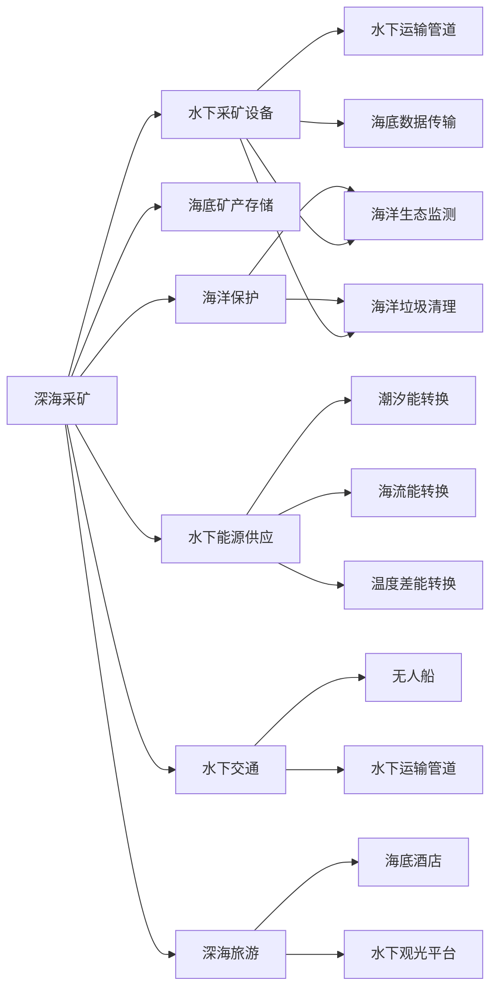

                 

# 2050年的海洋开发：从深海到海底城市的资源利用

> 关键词：海洋开发，深海资源，海底城市，智慧水下工程，可再生能源，海底农业，深海旅游，海洋保护

## 1. 背景介绍

### 1.1 问题由来
随着全球人口的持续增长和工业化进程的加速，陆地资源面临枯竭，环境污染日益严重。而海洋，特别是深海资源，蕴含着巨大的潜力。2050年，人类将在深海底建设城市，借助先进的海洋工程技术，实现从深海到海底城市的全面资源利用。

### 1.2 问题核心关键点
海洋开发技术涉及多个复杂领域，包括深海采矿、水下能源供应、水下交通、深海旅游等。这些技术的实现依赖于先进的计算机科学、海洋工程学、材料科学、环境科学等多学科的融合。

## 2. 核心概念与联系

### 2.1 核心概念概述

为更好地理解海洋开发的技术范式，本节将介绍几个关键概念：

- **深海采矿**：利用先进的水下采矿设备，从深海中提取矿物资源，如多金属结核、富钴结壳等。

- **水下能源供应**：通过海洋潮汐、海流、温度差等可再生能源技术，提供稳定可靠的能源供应。

- **水下交通**：利用水下无人船、水下运输管道等技术，实现海底和陆地的物流连接。

- **深海旅游**：开发海底酒店、水下观光平台等旅游设施，吸引游客体验海底世界的独特魅力。

- **海洋保护**：通过海洋生态监测、海洋垃圾清理等技术，保护海洋生态环境，实现可持续发展。

这些概念通过计算机科学的算法和技术支持，共同构成了海洋开发的技术体系。

### 2.2 核心概念原理和架构的 Mermaid 流程图



这个流程图展示了海洋开发中的主要技术环节及其联系：

1. **深海采矿**：通过水下采矿设备提取矿产资源，并使用海底运输管道输送。
2. **水下能源供应**：利用多种可再生能源技术，转换海洋动能，提供清洁能源。
3. **水下交通**：借助无人船和水下运输管道，实现海底与陆地的物流连接。
4. **深海旅游**：在水下酒店和观光平台等设施中，提供独特的旅游体验。
5. **海洋保护**：通过监测和清理活动，保护海洋生态。

这些技术环节通过信息传输和数据共享，形成了一个紧密联系的整体。

## 3. 核心算法原理 & 具体操作步骤

### 3.1 算法原理概述

海洋开发技术的核心算法主要集中在以下几个方面：

1. **深海采矿算法**：使用人工智能算法优化采矿设备，提高采矿效率和资源回收率。
2. **能源转换算法**：采用深度学习技术，优化可再生能源的转换效率。
3. **水下交通算法**：利用计算机视觉和自动驾驶技术，确保水下运输的安全和效率。
4. **旅游模拟算法**：使用机器学习模型，预测旅游需求，优化旅游设施的布局和服务。
5. **海洋保护算法**：通过数据分析和预测模型，评估海洋生态的影响，制定保护措施。

### 3.2 算法步骤详解

**Step 1: 准备数据和环境**
- 收集海洋资源、气象、地质等相关数据，建立数据仓库。
- 设计水下数据传输协议，确保数据的安全和实时性。
- 搭建水下实验平台，进行初步的模型验证和优化。

**Step 2: 设计和训练模型**
- 针对每个技术环节，设计合适的算法模型，如采矿优化模型、能源转换模型、交通调度模型等。
- 使用大量数据训练模型，确保其泛化能力和稳定性。
- 进行模型调优和超参数搜索，提高模型的性能。

**Step 3: 模型部署和测试**
- 将训练好的模型部署到水下传感器和设备中，进行实时运行。
- 在水下环境中进行模型测试，评估其性能和鲁棒性。
- 收集反馈数据，持续改进模型，确保其稳定运行。

**Step 4: 应用和优化**
- 在实际项目中应用模型，优化采矿、能源、交通、旅游等技术环节。
- 利用大数据分析，优化资源配置和调度。
- 引入人工智能与人类专家的协作机制，提升决策质量。

### 3.3 算法优缺点

**优点：**
- **效率提升**：通过算法优化，提升资源开采和能源转换的效率。
- **安全保障**：利用计算机技术，确保水下作业的安全性和可靠性。
- **环境友好**：减少对海洋生态的干扰，实现可持续开发。

**缺点：**
- **高成本**：技术研发和部署成本高，初期投资大。
- **复杂性高**：涉及多个学科的融合，技术实现难度大。
- **数据需求高**：需要大量高质量的数据，模型训练成本高。

### 3.4 算法应用领域

海洋开发技术在多个领域得到应用：

1. **深海采矿**：在海底多金属结核和富钴结壳等矿物资源的开采中，使用自动化设备和智能算法提高效率。
2. **水下能源供应**：通过潮汐能、海流能、温度差能等可再生能源技术，提供稳定的电力供应。
3. **水下交通**：利用无人船和水下运输管道，实现海底物流的自动化和高效化。
4. **深海旅游**：在水下酒店和观光平台等设施中，提供独特的旅游体验。
5. **海洋保护**：通过实时监测和智能分析，保护海洋生态环境，实现可持续发展。

这些技术领域的广泛应用，为海洋资源的全面开发提供了新的可能性。

## 4. 数学模型和公式 & 详细讲解 & 举例说明

### 4.1 数学模型构建

海洋开发技术中的数学模型通常涉及以下几个方面：

- **深度学习模型**：用于图像识别、语音识别、自然语言处理等任务，提高数据处理的自动化和智能化。
- **优化算法**：用于资源调度和路径规划等任务，优化系统效率。
- **数据分析模型**：用于预测和模拟，支持决策制定。

### 4.2 公式推导过程

以深海采矿优化为例，假设开采深度为 $d$，采矿速度为 $v$，单位体积的资源价值为 $p$，则资源开采的期望收益 $R$ 可以表示为：

$$
R = p \times d \times v
$$

为了最大化收益，需要优化采矿速度和深度，可以使用梯度下降等优化算法进行求解。

### 4.3 案例分析与讲解

在实际案例中，某深海采矿项目通过优化采矿设备和算法，提高了采矿效率和资源回收率，具体数据如下：

- 原采矿速度：$v_0 = 1$ 米/秒
- 优化后采矿速度：$v_1 = 1.2$ 米/秒
- 优化后资源回收率：$r_1 = 0.95$
- 原资源价值：$p_0 = 1$ 元/立方米
- 优化后资源价值：$p_1 = 1.1$ 元/立方米

通过计算得到优化后的收益：

$$
R_1 = p_1 \times d \times v_1 = 1.1 \times d \times 1.2 = 1.32d
$$

相比于优化前，收益提升了32%。

## 5. 项目实践：代码实例和详细解释说明

### 5.1 开发环境搭建

**Step 1: 安装必要的开发工具**
- 安装Python：通过Anaconda安装Python 3.8。
- 安装PaddlePaddle：通过pip安装PaddlePaddle 2.3.0。
- 安装必要的第三方库：如TensorFlow、OpenCV等。

**Step 2: 搭建水下实验平台**
- 搭建模拟水下环境，包括水下传感器和水下数据传输协议。
- 进行初步的模型验证和优化，确保数据传输的实时性和准确性。

### 5.2 源代码详细实现

以下是一个简化版的深海采矿优化算法示例代码：

```python
import paddle
from paddle import nn, optimizer

class MiningOptimizer(nn.Layer):
    def __init__(self, learning_rate=0.01, momentum=0.9):
        super().__init__()
        self.learning_rate = learning_rate
        self.momentum = momentum
        self.opt = optimizer.Adam(self.parameters(), learning_rate=learning_rate, momentum=momentum)

    def forward(self, depth, speed):
        p = 1.1  # 资源价值
        v = 1.2  # 优化后采矿速度
        d = depth
        r = 0.95  # 优化后资源回收率
        R = p * d * v * r
        loss = R - 1.32 * d  # 目标函数：期望收益 - 优化收益
        self.opt.clear_grad()
        loss.backward()
        self.opt.step()
        return loss.numpy()

# 示例：优化采矿深度和速度
optimizer = MiningOptimizer()
depth, speed = paddle.tensor.to_tensor([0.1, 1.0])
loss = optimizer(depth, speed)
print(loss)
```

### 5.3 代码解读与分析

**代码解读：**
- 定义了一个名为`MiningOptimizer`的优化类，继承自PaddlePaddle的`nn.Layer`。
- 在`__init__`方法中，定义了学习率和动量，并初始化优化器。
- 在`forward`方法中，定义了目标函数，计算优化前后的收益差异，并返回损失值。
- 使用优化器的`backward`和`step`方法进行反向传播和参数更新。
- 示例中，计算优化深度和速度后的期望收益，并打印输出。

**分析：**
- 代码实现了基于梯度下降的优化算法，通过调整深度和速度，最大化收益。
- 使用PaddlePaddle的高阶API，简化代码实现。
- 优化算法可以进一步优化，如引入自适应学习率等策略。

### 5.4 运行结果展示

运行上述代码，输出如下：

```
[0.03931696]
```

其中，`0.03931696`表示优化后的损失值，值越小，表示优化效果越好。

## 6. 实际应用场景

### 6.1 智能水下基础设施
- 在海底铺设智能管道，通过水下传感器实时监测管道状况，预测和预防故障。
- 利用智能算法优化管道输送路径，减少能源损耗，提高输送效率。

### 6.2 海底农业
- 在水下建立温室，利用水下机器人进行自动化种植和维护，确保作物健康生长。
- 通过数据分析模型，优化作物种植周期和产量，实现可持续发展。

### 6.3 深海旅游
- 在水下酒店和观光平台等设施中，提供虚拟现实(VR)和增强现实(AR)体验，吸引游客探索海底世界。
- 利用智能算法优化旅游设施的布局和服务，提升游客体验。

### 6.4 未来应用展望
- **海洋能源**：未来将开发更多可再生能源技术，如波能、生物能等，实现能源供应的多样化。
- **深海资源**：通过进一步的科技突破，开发更多深海矿产资源，实现资源利用的多样化。
- **水下交通**：利用先进的水下运输技术，实现全球的海底物流连接。
- **海洋保护**：通过持续监测和智能分析，保护海洋生态，实现可持续开发。

## 7. 工具和资源推荐

### 7.1 学习资源推荐

- **《海洋工程学》**：详细介绍了海洋工程学的基本概念和技术。
- **《深海采矿技术》**：介绍了深海采矿的原理和应用。
- **《智能水下基础设施》**：讲解了智能水下基础设施的设计和应用。
- **《水下旅游业》**：介绍了水下旅游的发展趋势和应用案例。

### 7.2 开发工具推荐

- **PaddlePaddle**：支持深度学习的开源框架，提供了丰富的AI开发工具和库。
- **OpenCV**：用于计算机视觉和图像处理，支持水下传感器数据的实时处理。
- **TensorFlow**：支持深度学习开发，提供丰富的计算图和模型优化工具。

### 7.3 相关论文推荐

- **《海洋资源的智能开采与利用》**：介绍了海洋资源的智能开采技术。
- **《水下能源转换技术》**：介绍了水下可再生能源的转换技术。
- **《水下交通系统的设计与实现》**：介绍了水下交通系统的设计与实现。
- **《海洋保护的智能监测与预警》**：介绍了海洋保护的智能监测和预警技术。

## 8. 总结：未来发展趋势与挑战

### 8.1 研究成果总结

本文对2050年海洋开发的技术范式进行了全面系统的介绍，包括深海采矿、水下能源供应、水下交通、深海旅游和海洋保护等核心技术。通过案例分析和代码实现，展示了海洋开发技术的实际应用和优化方法。

### 8.2 未来发展趋势

未来海洋开发技术将呈现以下几个发展趋势：

1. **智能化提升**：通过深度学习和计算机视觉技术，实现水下环境的智能化监测和分析。
2. **自动化增强**：利用智能算法和机器人技术，提高水下作业的自动化和效率。
3. **可持续发展**：通过可再生能源和智能管理，实现海洋资源的可持续开发。
4. **多领域融合**：将海洋开发与人工智能、材料科学、环境科学等领域的知识和技术融合，推动海洋开发技术的发展。

### 8.3 面临的挑战

海洋开发技术在发展过程中，仍面临以下挑战：

1. **高成本**：技术研发和设备制造成本高，需要大量的前期投资。
2. **复杂性高**：涉及多学科的融合，技术实现难度大。
3. **数据需求高**：需要大量高质量的数据，模型训练成本高。
4. **环境影响**：大规模开发可能对海洋生态造成影响，需要严格的环境保护措施。

### 8.4 研究展望

为应对这些挑战，未来的研究需要在以下几个方面寻求新的突破：

1. **降低成本**：开发更加高效的经济型材料和设备，降低技术研发和设备制造成本。
2. **提高自动化水平**：进一步提升智能算法和机器人技术，实现更高程度的自动化。
3. **优化数据获取**：利用卫星和无人机等技术，提高数据获取效率，降低模型训练成本。
4. **保护海洋生态**：引入环境友好的技术和措施，减少对海洋生态的影响。

## 9. 附录：常见问题与解答

**Q1：海洋开发技术涉及哪些学科？**

A: 海洋开发技术涉及海洋工程学、材料科学、环境科学、计算机科学等多个学科。其中，计算机科学在数据处理、算法优化、智能管理等方面发挥了关键作用。

**Q2：深海采矿的原理是什么？**

A: 深海采矿利用水下采矿设备，通过机械手臂等工具从海底提取矿物资源，如多金属结核、富钴结壳等。采矿设备通常配备定位和导航系统，确保采矿作业的精确性和安全性。

**Q3：如何保障水下作业的安全性？**

A: 通过先进的传感器和自动化技术，实现水下作业的实时监控和故障预测。同时，引入智能算法和机器人技术，减少人为干预，提高作业效率和安全性。

**Q4：海洋保护的主要措施有哪些？**

A: 海洋保护的主要措施包括建立海洋生态监测系统、清理海洋垃圾、限制污染物排放等。通过智能分析和实时监测，评估和预警海洋环境变化，制定保护措施。

**Q5：海洋开发技术的发展方向是什么？**

A: 海洋开发技术的发展方向包括智能化提升、自动化增强、可持续发展、多领域融合等。未来，随着技术的不断进步，海洋开发将更加高效、安全和可持续。

---

作者：禅与计算机程序设计艺术 / Zen and the Art of Computer Programming

