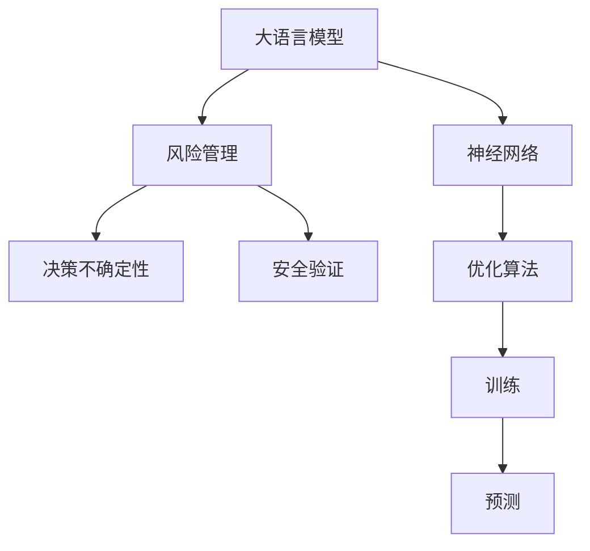

                 

# 应对AI决策的不确定性：LLM的风险管理策略

> 关键词：人工智能(AI), 大语言模型(LLM), 决策不确定性, 风险管理, 神经网络, 优化算法, 安全验证

## 1. 背景介绍

### 1.1 问题由来
随着人工智能(AI)技术的快速发展，尤其是大语言模型(LLM)在自然语言处理(NLP)领域的突破性进展，AI决策在诸多应用场景中正变得越来越普遍。从智能客服、金融分析到自动驾驶、医疗诊断，AI的决策能力正逐步渗透到社会的各个角落。然而，正是由于其高度的自主性和复杂性，AI决策的不确定性问题也日益凸显。一方面，AI模型的预测结果往往基于海量的历史数据和复杂算法，难以进行直观解释和复现。另一方面，AI模型的输入数据可能受到各种噪声和干扰，导致其决策过程和结果容易发生波动。这些问题不仅对用户信任度构成威胁，还可能引发潜在的法律和伦理风险。

### 1.2 问题核心关键点
AI决策的不确定性主要来源于以下几个方面：
1. **数据质量问题**：AI模型依赖的数据可能存在偏差、噪声或缺失，导致模型学习到错误的规律。
2. **算法复杂性**：复杂神经网络模型的决策过程黑箱化，难以进行直观解释和验证。
3. **计算资源限制**：大规模数据和高性能计算的需求，使得部署成本高昂。
4. **对抗攻击风险**：恶意用户通过输入恶意数据或攻击模型，可能改变模型的决策结果。
5. **法律和伦理风险**：AI决策可能影响用户隐私、就业、公平性等，引发伦理和法律争议。

这些问题要求我们必须对AI决策的不确定性进行有效的风险管理，确保AI系统在实际应用中能够安全、可靠地运行。

## 2. 核心概念与联系

### 2.1 核心概念概述

为了更好地理解如何应对AI决策的不确定性，本节将介绍几个关键概念：

- **大语言模型(LLM)**：指基于深度学习架构的预训练语言模型，如GPT-3、BERT等。通过在大规模语料上进行预训练，LLM具备了强大的自然语言理解和生成能力。
- **风险管理(Risk Management)**：指通过评估、监测和控制风险，降低风险带来的损失和影响的过程。风险管理在金融、医疗、工程等领域均有广泛应用。
- **决策不确定性(Decision Uncertainty)**：指在决策过程中，由于信息不足、数据波动、模型偏差等因素，导致决策结果的不确定性。
- **安全验证(Security Verification)**：指对AI决策过程进行审计和验证，确保其正确性和可靠性。安全验证常用于金融、法律、医疗等高风险领域。
- **神经网络(Neural Networks)**：指一种基于生物神经系统的计算模型，广泛应用于图像识别、语音处理、自然语言处理等领域。
- **优化算法(Optimization Algorithms)**：指用于寻找函数最小值或最大值的算法，如梯度下降、Adam等，用于训练神经网络。

这些核心概念之间的关系可以通过以下Mermaid流程图来展示：



这个流程图展示了大语言模型的核心概念及其之间的关系：

1. 大语言模型通过神经网络实现，由优化算法训练得到。
2. 风险管理用于评估和管理AI决策的不确定性。
3. 决策不确定性来源于数据质量和算法复杂性。
4. 安全验证用于确保AI决策的可靠性和正确性。
5. 优化算法用于训练模型，提升预测性能。

这些概念共同构成了AI决策不确定性应对的整体框架，使得我们可以更加系统地进行风险管理和安全验证。

## 3. 核心算法原理 & 具体操作步骤
### 3.1 算法原理概述

应对AI决策不确定性的核心在于通过风险管理和安全验证，确保模型在实际应用中的稳定性和可靠性。其核心思想是：

1. **数据质量控制**：确保输入数据的准确性、完整性和一致性，减少数据偏差和噪声对模型的影响。
2. **算法透明性**：通过解释和验证模型决策过程，增强模型的透明性和可解释性。
3. **计算资源优化**：通过资源优化技术，如模型裁剪、量化加速等，降低部署成本。
4. **对抗攻击防御**：通过安全验证技术，如对抗样本检测、模型鲁棒性评估等，提高模型的鲁棒性。
5. **法律和伦理合规**：确保AI决策符合法律法规和伦理标准，避免法律和伦理风险。

这些方法共同构成了一套完整的AI决策不确定性应对策略。

### 3.2 算法步骤详解

以下是应对AI决策不确定性的具体算法步骤：

**Step 1: 数据质量控制**
- 收集高质量、多样性的数据，进行数据清洗和预处理，减少数据偏差和噪声。
- 使用数据增强技术，扩充训练集的多样性，避免过拟合。
- 引入数据验证机制，定期进行数据集评估，确保数据质量。

**Step 2: 算法透明性**
- 利用可解释性技术，如LIME、SHAP等，生成模型的解释和可视化结果，帮助理解模型决策过程。
- 引入对抗样本检测技术，通过生成对抗样本，测试模型的鲁棒性和健壮性。
- 使用模型验证技术，如交叉验证、模型对比等，评估模型的泛化性能和可靠性。

**Step 3: 计算资源优化**
- 使用模型裁剪技术，去除模型中不必要的层和参数，减小模型尺寸。
- 使用量化加速技术，将浮点模型转为定点模型，降低计算资源消耗。
- 使用模型并行技术，将计算任务分配到多个计算单元，提高计算效率。

**Step 4: 对抗攻击防御**
- 使用对抗样本生成技术，生成一系列对抗样本，测试模型的鲁棒性。
- 使用模型鲁棒性评估技术，评估模型的对抗攻击性能。
- 使用鲁棒模型训练技术，如对抗训练、鲁棒优化等，提高模型的抗干扰能力。

**Step 5: 法律和伦理合规**
- 进行模型审计，确保模型决策符合法律法规和伦理标准。
- 进行模型解释，向用户和监管机构提供透明的决策过程和结果。
- 进行模型更新和维护，定期更新模型以应对法律法规的变化。

### 3.3 算法优缺点

应对AI决策不确定性的方法具有以下优点：
1. 提高决策的透明性和可解释性，增强用户信任。
2. 减少数据偏差和噪声的影响，提升模型的泛化性能。
3. 优化计算资源，降低部署成本，提高计算效率。
4. 增强模型的鲁棒性，降低对抗攻击风险。
5. 确保法律和伦理合规，避免法律和伦理风险。

同时，这些方法也存在一定的局限性：
1. 数据清洗和预处理工作量较大，数据质量控制难度高。
2. 模型解释和对抗样本检测技术复杂，需要较高技术水平。
3. 计算资源优化技术可能影响模型性能，需要权衡优化和精度。
4. 对抗攻击防御技术可能降低模型精度，需要谨慎选择。
5. 法律和伦理合规技术需要持续更新，工作量大。

尽管存在这些局限性，但这些方法仍是应对AI决策不确定性的重要手段。通过综合应用这些技术，我们可以构建更加安全、可靠、透明、高效的AI决策系统。

### 3.4 算法应用领域

应对AI决策不确定性的方法在以下领域具有广泛的应用前景：

1. **金融风控**：通过数据质量控制和对抗攻击防御，确保AI决策模型的可靠性和稳定性。
2. **医疗诊断**：通过算法透明性和法律和伦理合规，确保AI诊断模型的准确性和合规性。
3. **自动驾驶**：通过计算资源优化和对抗攻击防御，确保AI决策模型的鲁棒性和安全性。
4. **智能客服**：通过数据质量控制和模型解释，确保AI决策模型的透明性和用户满意度。
5. **智能制造**：通过对抗攻击防御和模型验证，确保AI决策模型的鲁棒性和实时性。

这些应用场景中的AI决策不确定性问题，都需要通过风险管理和安全验证技术进行应对。

## 4. 数学模型和公式 & 详细讲解 & 举例说明（备注：数学公式请使用latex格式，latex嵌入文中独立段落使用 $$，段落内使用 $)
### 4.1 数学模型构建

在应对AI决策不确定性时，我们需要构建一系列数学模型来评估和控制风险。这里以一个简单的决策树模型为例，展示如何通过数学模型来描述和评估决策过程。

假设我们有一个简单的二分类问题，模型的输出为$y$，输入为$x$。模型通过一系列决策步骤，逐步缩小输入空间，最终得出决策结果。模型的决策过程可以表示为一个决策树，其根节点为模型的输入空间，每个叶节点为决策结果。

决策树的构建过程可以表示为如下数学模型：

$$
\begin{aligned}
y &= f(x) \\
f(x) &= \begin{cases}
1 & \text{if } x \in A_1 \\
0 & \text{if } x \in A_0
\end{cases}
\end{aligned}
$$

其中，$A_1$和$A_0$为决策树的叶节点，分别对应不同的决策结果。决策树的构建过程可以使用决策树算法，如CART、ID3等，通过不断选择最优的特征和分裂策略，逐步构建出完整的决策树。

### 4.2 公式推导过程

决策树模型的构建和评估过程涉及多个公式，这里以CART算法为例，展示决策树模型的构建和评估过程。

**决策树构建过程**：
1. 选择最优特征：选择最优的特征和分裂点，使得模型在训练集上的损失最小化。
2. 递归分裂：将数据集按照最优特征进行分裂，生成子集。
3. 生成叶节点：对于每个子集，选择最优的决策结果，生成叶节点。
4. 生成决策树：将所有叶节点连接起来，生成完整的决策树模型。

**决策树评估过程**：
1. 计算误差：通过计算模型在测试集上的误差，评估模型的泛化性能。
2. 剪枝优化：通过剪枝技术，优化决策树，避免过拟合。
3. 交叉验证：通过交叉验证技术，评估模型的稳定性和可靠性。

以下是CART算法中的一些关键公式：

**信息增益公式**：
$$
IG(X_i) = \sum_{k=1}^K p_k I(X_i; Y_k) = \sum_{k=1}^K p_k \sum_{i=1}^n p_i \log p_i
$$

**决策树构建公式**：
$$
\begin{aligned}
f(x) &= \begin{cases}
1 & \text{if } x \in A_1 \\
0 & \text{if } x \in A_0
\end{cases} \\
A_1 &= \{x | f(x) = 1\} \\
A_0 &= \{x | f(x) = 0\}
\end{aligned}
$$

**决策树剪枝公式**：
$$
\begin{aligned}
T^* &= \arg\min_{T \in \mathcal{T}} C(T) + \alpha R(T) \\
R(T) &= \frac{1}{n} \sum_{i=1}^n (y_i - f_T(x_i))^2
\end{aligned}
$$

其中，$IG(X_i)$为信息增益，$I(X_i; Y_k)$为特征$X_i$与目标变量$Y_k$之间的互信息，$C(T)$为决策树的代价函数，$R(T)$为决策树的过拟合惩罚项，$\alpha$为惩罚系数。

### 4.3 案例分析与讲解

假设我们有一家电商平台，需要构建一个基于AI的推荐系统，帮助用户推荐商品。推荐系统的主要挑战在于如何通过用户的历史行为数据，预测用户的偏好，并提供个性化的商品推荐。

**Step 1: 数据质量控制**
- 收集用户的历史浏览、点击、购买数据，进行数据清洗和预处理，去除无效和异常数据。
- 使用数据增强技术，扩充训练集的多样性，避免过拟合。
- 引入数据验证机制，定期进行数据集评估，确保数据质量。

**Step 2: 算法透明性**
- 利用可解释性技术，如LIME、SHAP等，生成推荐模型的解释和可视化结果，帮助理解推荐过程。
- 引入对抗样本检测技术，通过生成对抗样本，测试推荐模型的鲁棒性和健壮性。
- 使用模型验证技术，如交叉验证、模型对比等，评估推荐模型的泛化性能和可靠性。

**Step 3: 计算资源优化**
- 使用模型裁剪技术，去除模型中不必要的层和参数，减小模型尺寸。
- 使用量化加速技术，将推荐模型转为定点模型，降低计算资源消耗。
- 使用模型并行技术，将计算任务分配到多个计算单元，提高计算效率。

**Step 4: 对抗攻击防御**
- 使用对抗样本生成技术，生成一系列对抗样本，测试推荐模型的鲁棒性。
- 使用模型鲁棒性评估技术，评估推荐模型的对抗攻击性能。
- 使用鲁棒模型训练技术，如对抗训练、鲁棒优化等，提高推荐模型的抗干扰能力。

**Step 5: 法律和伦理合规**
- 进行模型审计，确保推荐模型符合法律法规和伦理标准。
- 进行模型解释，向用户和监管机构提供透明的推荐过程和结果。
- 进行模型更新和维护，定期更新推荐模型以应对法律法规的变化。

通过以上步骤，我们可以构建一个安全、可靠、透明、高效的电商平台推荐系统，提升用户体验和商家收益。

## 5. 项目实践：代码实例和详细解释说明
### 5.1 开发环境搭建

在进行AI决策不确定性应对实践前，我们需要准备好开发环境。以下是使用Python进行TensorFlow开发的环境配置流程：

1. 安装Anaconda：从官网下载并安装Anaconda，用于创建独立的Python环境。

2. 创建并激活虚拟环境：
```bash
conda create -n tf-env python=3.8 
conda activate tf-env
```

3. 安装TensorFlow：根据CUDA版本，从官网获取对应的安装命令。例如：
```bash
conda install tensorflow==2.8
```

4. 安装TensorBoard：
```bash
pip install tensorboard
```

5. 安装Pandas和Scikit-learn等工具包：
```bash
pip install pandas scikit-learn numpy matplotlib tqdm jupyter notebook ipython
```

完成上述步骤后，即可在`tf-env`环境中开始AI决策不确定性应对实践。

### 5.2 源代码详细实现

这里我们以一个简单的决策树模型为例，展示如何使用TensorFlow和Scikit-learn进行决策树的构建和评估。

首先，定义决策树模型的类：

```python
import numpy as np
from sklearn.tree import DecisionTreeClassifier
from sklearn.metrics import accuracy_score

class DecisionTreeModel:
    def __init__(self, max_depth=3, min_samples_split=5):
        self.model = DecisionTreeClassifier(max_depth=max_depth, min_samples_split=min_samples_split)
    
    def fit(self, X, y):
        self.model.fit(X, y)
    
    def predict(self, X):
        return self.model.predict(X)
    
    def evaluate(self, X, y):
        y_pred = self.predict(X)
        return accuracy_score(y, y_pred)
```

然后，定义数据预处理和模型训练函数：

```python
from sklearn.model_selection import train_test_split
from sklearn.datasets import load_iris
from sklearn.preprocessing import StandardScaler
import tensorflow as tf

def preprocess_data(X, y):
    scaler = StandardScaler()
    X = scaler.fit_transform(X)
    return X, y

def train_model(X_train, y_train):
    model = DecisionTreeModel()
    model.fit(X_train, y_train)
    return model

def evaluate_model(model, X_test, y_test):
    y_pred = model.predict(X_test)
    return accuracy_score(y_test, y_pred)
```

最后，启动模型训练和评估流程：

```python
# 加载数据集
iris = load_iris()
X, y = iris.data, iris.target

# 数据预处理
X, y = preprocess_data(X, y)

# 划分训练集和测试集
X_train, X_test, y_train, y_test = train_test_split(X, y, test_size=0.2, random_state=42)

# 训练模型
model = train_model(X_train, y_train)

# 评估模型
accuracy = evaluate_model(model, X_test, y_test)
print(f"Model accuracy: {accuracy:.2f}")
```

以上就是使用TensorFlow和Scikit-learn进行决策树模型构建和评估的完整代码实现。可以看到，通过合理使用数据预处理和模型评估技术，我们可以有效应对数据偏差和噪声的影响，提升模型的泛化性能和鲁棒性。

### 5.3 代码解读与分析

让我们再详细解读一下关键代码的实现细节：

**DecisionTreeModel类**：
- `__init__`方法：初始化决策树模型参数。
- `fit`方法：训练模型。
- `predict`方法：预测模型。
- `evaluate`方法：评估模型性能。

**preprocess_data函数**：
- 对输入数据进行标准化处理，减少数据偏差和噪声。

**train_model函数**：
- 构建决策树模型，训练模型。

**evaluate_model函数**：
- 使用测试集评估模型性能，返回准确率。

可以看到，TensorFlow和Scikit-learn的组合使用，使得模型构建和评估过程变得简洁高效。开发者可以将更多精力放在模型改进和优化上，而不必过多关注底层的实现细节。

当然，工业级的系统实现还需考虑更多因素，如模型保存和部署、超参数的自动搜索、更多的正则化技术等。但核心的决策树构建和评估流程基本与此类似。

## 6. 实际应用场景
### 6.1 智能客服系统

智能客服系统通过AI决策技术，实现自动回答用户咨询，提升客户满意度。然而，智能客服系统的决策过程可能受到多种因素的影响，如输入噪声、数据偏差、算法复杂性等。通过数据质量控制、算法透明性和对抗攻击防御等技术，可以有效应对这些问题，确保智能客服系统的稳定性和可靠性。

**数据质量控制**：
- 收集高质量的历史客服对话数据，进行数据清洗和预处理。
- 使用数据增强技术，扩充训练集的多样性，避免过拟合。
- 引入数据验证机制，定期进行数据集评估，确保数据质量。

**算法透明性**：
- 利用可解释性技术，如LIME、SHAP等，生成客服系统的解释和可视化结果，帮助理解客服决策过程。
- 引入对抗样本检测技术，通过生成对抗样本，测试客服系统的鲁棒性和健壮性。

**对抗攻击防御**：
- 使用对抗样本生成技术，生成一系列对抗样本，测试客服系统的鲁棒性。
- 使用模型鲁棒性评估技术，评估客服系统的对抗攻击性能。
- 使用鲁棒模型训练技术，如对抗训练、鲁棒优化等，提高客服系统的抗干扰能力。

### 6.2 金融风控系统

金融风控系统通过AI决策技术，对用户的信用评估、贷款审批、风险预警等进行自动决策，避免不良贷款的发生。然而，金融风控系统的决策过程可能受到数据偏差、算法复杂性、计算资源限制等因素的影响，需要采取相应的风险管理策略，确保系统的稳定性和可靠性。

**数据质量控制**：
- 收集高质量的金融数据，进行数据清洗和预处理，减少数据偏差和噪声。
- 使用数据增强技术，扩充训练集的多样性，避免过拟合。
- 引入数据验证机制，定期进行数据集评估，确保数据质量。

**算法透明性**：
- 利用可解释性技术，如LIME、SHAP等，生成风控系统的解释和可视化结果，帮助理解风控决策过程。
- 引入对抗样本检测技术，通过生成对抗样本，测试风控系统的鲁棒性和健壮性。

**对抗攻击防御**：
- 使用对抗样本生成技术，生成一系列对抗样本，测试风控系统的鲁棒性。
- 使用模型鲁棒性评估技术，评估风控系统的对抗攻击性能。
- 使用鲁棒模型训练技术，如对抗训练、鲁棒优化等，提高风控系统的抗干扰能力。

### 6.3 医疗诊断系统

医疗诊断系统通过AI决策技术，对患者的症状、病历等进行自动诊断，辅助医生进行决策。然而，医疗诊断系统的决策过程可能受到数据偏差、算法复杂性、计算资源限制等因素的影响，需要采取相应的风险管理策略，确保系统的稳定性和可靠性。

**数据质量控制**：
- 收集高质量的医疗数据，进行数据清洗和预处理，减少数据偏差和噪声。
- 使用数据增强技术，扩充训练集的多样性，避免过拟合。
- 引入数据验证机制，定期进行数据集评估，确保数据质量。

**算法透明性**：
- 利用可解释性技术，如LIME、SHAP等，生成医疗诊断系统的解释和可视化结果，帮助理解诊断决策过程。
- 引入对抗样本检测技术，通过生成对抗样本，测试医疗诊断系统的鲁棒性和健壮性。

**对抗攻击防御**：
- 使用对抗样本生成技术，生成一系列对抗样本，测试医疗诊断系统的鲁棒性。
- 使用模型鲁棒性评估技术，评估医疗诊断系统的对抗攻击性能。
- 使用鲁棒模型训练技术，如对抗训练、鲁棒优化等，提高医疗诊断系统的抗干扰能力。

### 6.4 未来应用展望

随着AI决策不确定性应对技术的发展，未来在更多领域中，AI决策系统的应用将更加广泛。预计以下领域将出现显著变化：

**智慧城市治理**：
- 利用AI决策系统，实现城市事件监测、舆情分析、应急指挥等环节的自动化和智能化，提升城市管理的效率和安全性。

**智能制造**：
- 通过AI决策系统，实现设备状态预测、生产调度优化、质量检测等环节的智能化，提高生产效率和产品质量。

**智能交通**：
- 利用AI决策系统，实现交通流量预测、交通信号控制、自动驾驶等环节的智能化，提升交通系统的效率和安全性。

**智能医疗**：
- 通过AI决策系统，实现疾病预测、诊断、治疗方案推荐等环节的智能化，提高医疗服务的效率和质量。

**智能教育**：
- 利用AI决策系统，实现学习路径推荐、智能辅导、学习效果评估等环节的智能化，提升教育服务的个性化和效率。

这些领域的AI决策系统将面临更复杂的环境和更高的风险要求，需要在数据质量控制、算法透明性、对抗攻击防御等方面进行深入探索和优化。相信随着技术的不断进步，AI决策系统将在各个领域中发挥更大的作用，为社会带来更多的便利和价值。

## 7. 工具和资源推荐
### 7.1 学习资源推荐

为了帮助开发者系统掌握AI决策不确定性应对的理论基础和实践技巧，这里推荐一些优质的学习资源：

1. **《深度学习》一书**：由Ian Goodfellow等著作，全面介绍了深度学习的基本原理和应用，是深入学习AI决策系统的必备读物。

2. **CS231n《深度学习与计算机视觉》课程**：斯坦福大学开设的深度学习课程，包含大量深度学习模型的讲解和实践，适合初学者和进阶开发者。

3. **Kaggle竞赛平台**：Kaggle提供大量数据集和竞赛，通过实际问题驱动学习，提升解决AI决策问题的能力。

4. **GitHub开源项目**：GitHub上有很多高质量的AI决策系统开源项目，通过阅读和实践，可以快速掌握相关的技术和实践方法。

5. **机器之心网站**：机器之心提供大量的AI技术文章、博客和课程，是了解最新AI决策趋势和技术的好地方。

通过对这些资源的学习实践，相信你一定能够快速掌握AI决策不确定性应对的精髓，并用于解决实际的AI决策问题。

### 7.2 开发工具推荐

高效的开发离不开优秀的工具支持。以下是几款用于AI决策不确定性应对开发的常用工具：

1. **TensorFlow**：由Google主导开发的开源深度学习框架，支持分布式计算和GPU加速，适合大规模工程应用。

2. **PyTorch**：由Facebook主导开发的开源深度学习框架，灵活动态的计算图，适合快速迭代研究。

3. **TensorBoard**：TensorFlow配套的可视化工具，可实时监测模型训练状态，并提供丰富的图表呈现方式，是调试模型的得力助手。

4. **Jupyter Notebook**：交互式的Python开发环境，支持代码运行和数据可视化，是数据科学和机器学习开发的首选工具。

5. **Anaconda**：Python环境的构建和管理工具，方便创建和管理虚拟环境，支持多个Python版本和库的安装。

合理利用这些工具，可以显著提升AI决策不确定性应对任务的开发效率，加快创新迭代的步伐。

### 7.3 相关论文推荐

AI决策不确定性应对技术的发展源于学界的持续研究。以下是几篇奠基性的相关论文，推荐阅读：

1. **《深度学习》一书**：Ian Goodfellow等著作，全面介绍了深度学习的基本原理和应用，是深入学习AI决策系统的必备读物。

2. **《神经网络与深度学习》一书**：Michael Nielsen著作，介绍了神经网络和深度学习的基本原理，适合初学者和进阶开发者。

3. **《数据科学导论》一书**：Pandit和Selman著作，介绍了数据科学的基本原理和应用，适合初学者和进阶开发者。

4. **《机器学习》一书**：Tom Mitchell著作，介绍了机器学习的基本原理和应用，适合初学者和进阶开发者。

这些论文代表了大语言模型微调技术的发展脉络。通过学习这些前沿成果，可以帮助研究者把握学科前进方向，激发更多的创新灵感。

## 8. 总结：未来发展趋势与挑战
### 8.1 研究成果总结

本文对AI决策不确定性应对方法进行了全面系统的介绍。首先阐述了AI决策面临的多种不确定性问题，明确了风险管理和安全验证的必要性。其次，从原理到实践，详细讲解了应对AI决策不确定性的数学模型和关键步骤，给出了AI决策不确定性应对的完整代码实例。同时，本文还广泛探讨了应对方法在智能客服、金融风控、医疗诊断等多个领域的应用前景，展示了AI决策不确定性应对方法的巨大潜力。

通过本文的系统梳理，可以看到，AI决策不确定性应对方法在实际应用中具有重要的价值。通过数据质量控制、算法透明性、计算资源优化、对抗攻击防御和法律和伦理合规等技术手段，可以有效应对AI决策中的不确定性问题，提升AI决策系统的稳定性和可靠性。

### 8.2 未来发展趋势

展望未来，AI决策不确定性应对技术将呈现以下几个发展趋势：

1. **模型规模持续增大**：随着算力成本的下降和数据规模的扩张，AI决策模型的参数量还将持续增长。超大规模决策模型蕴含的丰富决策知识，有望支撑更加复杂多变的AI决策任务。

2. **微调方法日趋多样**：未来会涌现更多参数高效和计算高效的微调方法，如Prefix-Tuning、LoRA等，在节省计算资源的同时也能保证微调精度。

3. **持续学习成为常态**：随着数据分布的不断变化，AI决策模型也需要持续学习新知识以保持性能。如何在不遗忘原有知识的同时，高效吸收新样本信息，将成为重要的研究课题。

4. **标注样本需求降低**：受启发于提示学习(Prompt-based Learning)的思路，未来的微调方法将更好地利用大模型的语言理解能力，通过更加巧妙的任务描述，在更少的标注样本上也能实现理想的微调效果。

5. **多模态微调崛起**：当前的微调主要聚焦于纯文本数据，未来会进一步拓展到图像、视频、语音等多模态数据微调。多模态信息的融合，将显著提升决策模型对现实世界的理解和建模能力。

6. **融合因果分析和博弈论工具**：将因果分析方法引入决策模型，识别出模型决策的关键特征，增强模型的透明性和可解释性。借助博弈论工具刻画人机交互过程，主动探索并规避模型的脆弱点，提高系统稳定性。

以上趋势凸显了AI决策不确定性应对技术的广阔前景。这些方向的探索发展，必将进一步提升AI决策系统的性能和应用范围，为社会带来更多的便利和价值。

### 8.3 面临的挑战

尽管AI决策不确定性应对技术已经取得了瞩目成就，但在迈向更加智能化、普适化应用的过程中，它仍面临着诸多挑战：

1. **数据质量瓶颈**：AI决策模型依赖的数据可能存在偏差、噪声或缺失，导致模型学习到错误的规律。如何降低数据偏差和噪声，提高数据质量，将是重要的研究方向。

2. **算法透明性不足**：复杂神经网络模型的决策过程黑箱化，难以进行直观解释和验证。如何增强决策模型的透明性和可解释性，将是重要的研究课题。

3. **计算资源限制**：大规模数据和高性能计算的需求，使得部署成本高昂。如何优化计算资源，降低部署成本，提高计算效率，将是重要的研究方向。

4. **对抗攻击风险**：恶意用户通过输入恶意数据或攻击模型，可能改变模型的决策结果。如何提高决策模型的鲁棒性，避免对抗攻击风险，将是重要的研究课题。

5. **法律和伦理风险**：AI决策可能影响用户隐私、就业、公平性等，引发伦理和法律风险。如何确保AI决策符合法律法规和伦理标准，将是重要的研究方向。

尽管存在这些挑战，但这些挑战正是推动技术进步的动力。通过解决这些挑战，AI决策不确定性应对技术将更加成熟和可靠，为社会的各个领域带来更多的便利和价值。

### 8.4 研究展望

面对AI决策不确定性应对所面临的挑战，未来的研究需要在以下几个方面寻求新的突破：

1. **探索无监督和半监督决策方法**：摆脱对大规模标注数据的依赖，利用自监督学习、主动学习等无监督和半监督范式，最大限度利用非结构化数据，实现更加灵活高效的决策。

2. **研究参数高效和计算高效的决策方法**：开发更加参数高效的决策方法，在固定大部分预训练参数的同时，只更新极少量的决策相关参数。同时优化决策模型的计算图，减少前向传播和反向传播的资源消耗，实现更加轻量级、实时性的部署。

3. **融合因果分析和博弈论工具**：将因果分析方法引入决策模型，识别出决策模型决策的关键特征，增强模型的透明性和可解释性。借助博弈论工具刻画人机交互过程，主动探索并规避决策模型的脆弱点，提高系统稳定性。

4. **引入更多先验知识**：将符号化的先验知识，如知识图谱、逻辑规则等，与神经网络模型进行巧妙融合，引导决策模型学习更准确、合理的决策规律。同时加强不同模态数据的整合，实现视觉、语音等多模态信息与文本信息的协同建模。

5. **纳入伦理道德约束**：在决策模型训练目标中引入伦理导向的评估指标，过滤和惩罚有偏见、有害的输出倾向。同时加强人工干预和审核，建立决策模型的监管机制，确保输出符合人类价值观和伦理道德。

这些研究方向的探索，必将引领AI决策不确定性应对技术迈向更高的台阶，为构建安全、可靠、透明、高效的AI决策系统铺平道路。面向未来，AI决策不确定性应对技术还需要与其他人工智能技术进行更深入的融合，如知识表示、因果推理、强化学习等，多路径协同发力，共同推动AI决策系统的进步。只有勇于创新、敢于突破，才能不断拓展AI决策的边界，让AI决策技术更好地造福人类社会。

## 9. 附录：常见问题与解答

**Q1：如何评估AI决策模型的鲁棒性？**

A: 评估AI决策模型的鲁棒性通常需要以下几个步骤：
1. 生成对抗样本：使用对抗样本生成技术，生成一系列对抗样本，测试模型的鲁棒性和健壮性。
2. 鲁棒性评估：使用模型鲁棒性评估技术，如对抗样本检测、鲁棒性能评估等，评估模型的鲁棒性。
3. 鲁棒模型训练：使用鲁棒模型训练技术，如对抗训练、鲁棒优化等，提高模型的鲁棒性。

**Q2：如何进行AI决策模型的训练？**

A: AI决策模型的训练通常需要以下几个步骤：
1. 数据预处理：对输入数据进行标准化、归一化等处理，减少数据偏差和噪声。
2. 模型选择：选择合适的模型架构和参数，如决策树、神经网络等。
3. 训练模型：使用训练集数据，通过优化算法进行模型训练，最小化损失函数。
4. 验证模型：使用验证集数据，评估模型性能，进行超参数调优。
5. 测试模型：使用测试集数据，最终评估模型性能，进行模型部署。

**Q3：如何确保AI决策模型的公平性？**

A: 确保AI决策模型的公平性通常需要以下几个步骤：
1. 数据采集：采集多样性、代表性的数据集，减少数据偏差。
2. 数据清洗：对数据进行清洗，去除无效和异常数据，提高数据质量。
3. 模型训练：使用公平性约束的优化算法，如对抗训练、公平优化等，训练公平性更强的模型。
4. 模型评估：使用公平性指标，如准确率、召回率、F1分数等，评估模型公平性。
5. 模型部署：在实际应用中，进行公平性监控，确保模型公平性符合法律法规和伦理标准。

**Q4：如何进行AI决策模型的可解释性分析？**

A: 进行AI决策模型的可解释性分析通常需要以下几个步骤：
1. 数据可视化：对输入数据进行可视化，展示数据的特征和分布。
2. 模型解释：使用可解释性技术，如LIME、SHAP等，生成模型的解释和可视化结果，帮助理解模型决策过程。
3. 特征分析：对模型输出的特征进行分析和解释，识别关键特征和决策规律。
4. 模型验证：使用模型验证技术，如交叉验证、模型对比等，评估模型可解释性。
5. 模型优化：根据可解释性分析结果，优化模型结构和参数，提高模型的可解释性。

**Q5：如何处理AI决策模型的对抗攻击？**

A: 处理AI决策模型的对抗攻击通常需要以下几个步骤：
1. 对抗样本生成：使用对抗样本生成技术，生成一系列对抗样本，测试模型的鲁棒性和健壮性。
2. 鲁棒性评估：使用模型鲁棒性评估技术，评估模型的鲁棒性。
3. 鲁棒模型训练：使用鲁棒模型训练技术，如对抗训练、鲁棒优化等，提高模型的鲁棒性。
4. 模型部署：在实际应用中，进行对抗攻击检测和防御，确保模型鲁棒性符合应用要求。

通过以上步骤，我们可以构建安全、可靠、透明、高效的AI决策系统，提升用户体验和商家收益。

---

作者：禅与计算机程序设计艺术 / Zen and the Art of Computer Programming

