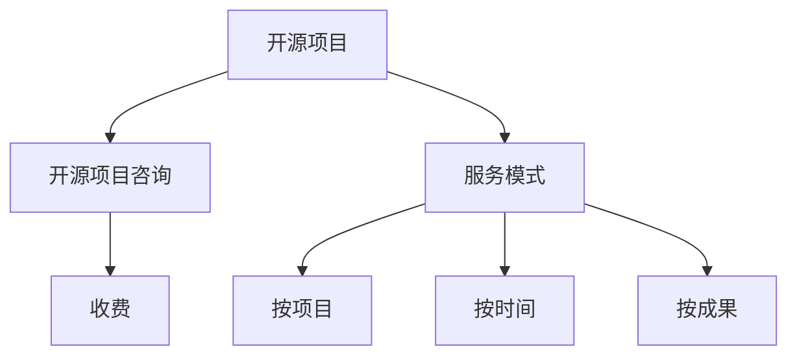

                 

# 建立开源项目的咨询业务：服务模式与定价

## 1. 背景介绍

### 1.1 问题由来
随着开源软件和技术的日益普及，越来越多的企业希望通过开源项目来提升其技术能力，推动产品创新。然而，开发、维护和推广开源项目并非易事，需要专业的技术和资源支持。开源项目咨询业务，正是为这些企业提供专业化服务的平台。通过咨询业务，专家可以提供定制化开发、性能优化、维护支持等技术指导，帮助企业有效利用开源技术，实现自身战略目标。

### 1.2 问题核心关键点
开源项目咨询业务的核心关键点在于：如何建立有效的服务模式，并制定合理的价格策略，以确保项目成功落地和持续发展。这包括选择合适的服务模式、制定定价标准、确立服务质量保障机制等。

### 1.3 问题研究意义
通过本文，我们希望能够提供一个系统性的指导，帮助开源项目咨询业务的创建者理解服务模式与定价的关键要素，规避潜在风险，从而在激烈的市场竞争中脱颖而出，赢得客户信赖。

## 2. 核心概念与联系

### 2.1 核心概念概述

为了更好地理解开源项目咨询业务的服务模式与定价策略，我们首先介绍几个关键概念：

- **开源项目(Open Source Project)**：指采用开源许可证发布的软件或技术项目，其代码和文档可以自由使用、修改和分发。开源项目通常由社区贡献者共同维护。
- **开源项目咨询(Open Source Project Consulting)**：指企业通过支付费用，聘请专家对开源项目进行技术指导和支持，帮助其解决项目开发、性能优化、维护升级等问题。
- **服务模式(Service Mode)**：指服务提供方和客户之间合作的模式，如按项目、按时间、按成果等。
- **定价(Pricing Strategy)**：指服务提供商根据服务内容、服务时长、服务质量等因素设定的收费标准。

这些概念之间的逻辑关系可以通过以下Mermaid流程图来展示：



该流程图展示了从开源项目到开源项目咨询的过程，以及咨询服务模式的多种选择。

## 3. 核心算法原理 & 具体操作步骤
### 3.1 算法原理概述

开源项目咨询业务的服务模式与定价策略，本质上是利用经济学和组织行为学的原理，通过合理配置资源和制定激励机制，最大化满足客户需求的同时，实现服务提供商的收益最大化。

具体来说，服务模式和定价策略的制定需要考虑以下几个因素：

- **客户需求**：了解客户对开源项目的具体需求，包括功能实现、性能优化、安全加固等方面。
- **项目复杂度**：评估项目的复杂程度，包括技术栈、规模、历史遗留问题等。
- **服务质量**：确定服务交付的质量标准，如代码质量、性能指标、安全合规等。
- **市场竞争**：分析同行业其他服务提供商的价格和策略，避免恶性竞争。

### 3.2 算法步骤详解

基于上述原理，我们可以进一步细化开源项目咨询的服务模式与定价策略的步骤：

**Step 1: 客户需求调研**
- 通过问卷调查、面谈等方式，了解客户的具体需求和痛点。
- 分析客户项目的背景、目标和预期成果。

**Step 2: 项目评估**
- 对客户项目进行全面评估，包括技术栈、代码质量、性能指标、安全合规等方面。
- 确定项目的复杂程度和所需时间。

**Step 3: 服务模式选择**
- 根据项目需求和复杂度，选择合适的服务模式，如按项目、按时间、按成果等。
- 制定详细的项目计划和服务交付标准。

**Step 4: 定价策略制定**
- 根据服务模式、项目复杂度、服务质量等因素，制定合理的定价策略。
- 考虑定价的灵活性，允许根据项目进展和客户需求进行调整。

**Step 5: 服务交付与质量保障**
- 根据服务模式和定价策略，提供定制化开发、性能优化、维护支持等技术指导。
- 定期与客户沟通，收集反馈，调整服务内容，确保服务质量。

**Step 6: 项目验收与持续维护**
- 完成服务后，进行项目验收，确保交付的成果满足客户需求。
- 建立长期的维护支持机制，持续为客户提供技术指导和支持。

### 3.3 算法优缺点

开源项目咨询业务的服务模式与定价策略，具有以下优点：

- **灵活性**：根据项目需求，可以选择不同的服务模式和定价策略，灵活应对客户的具体需求。
- **高效性**：通过专业化的技术指导，快速解决客户项目中的复杂问题，缩短项目开发周期。
- **成本效益**：合理定价和服务模式的设定，可以在满足客户需求的同时，最大化服务提供商的收益。

同时，该策略也存在一些局限性：

- **复杂度评估难度**：项目复杂度的准确评估是制定定价策略的关键，但往往难以准确量化。
- **客户需求变化**：项目需求可能随着时间而变化，需要服务提供商具备高度的灵活性和应变能力。
- **服务质量控制**：服务质量的保障需要建立完善的监控和反馈机制，确保服务按计划交付。

### 3.4 算法应用领域

开源项目咨询业务的应用领域广泛，包括但不限于以下几个方面：

- **技术架构设计**：帮助客户选择合适的技术栈和架构，提升系统的可扩展性和可维护性。
- **性能优化**：通过代码优化、算法改进等手段，提升系统的响应速度和并发处理能力。
- **安全加固**：对系统进行安全漏洞扫描、修复等操作，确保系统的安全性和合规性。
- **系统集成**：将不同的开源项目进行集成，构建完整的解决方案。
- **技术培训**：为客户的开发团队提供技术培训，提升其技术水平。

此外，开源项目咨询业务还可以应用于教育、金融、医疗等多个领域，为客户提供定制化的技术支持。

## 4. 数学模型和公式 & 详细讲解 & 举例说明

### 4.1 数学模型构建

在开源项目咨询业务中，服务模式和定价策略的制定，可以通过数学模型来辅助决策。我们定义以下变量：

- $C$：项目复杂度。
- $D$：项目开发时间。
- $Q$：服务质量标准。
- $P$：定价策略。

我们可以构建一个简化版的数学模型：

$$
P = k \times (C \times D / Q)
$$

其中，$k$ 是一个调整系数，反映了服务质量对定价的影响。

### 4.2 公式推导过程

根据上述数学模型，我们可以推导出定价策略与项目复杂度、开发时间和服务质量之间的关系。

- 当项目复杂度 $C$ 和开发时间 $D$ 一定时，服务质量 $Q$ 越高，定价 $P$ 也越高。
- 当服务质量 $Q$ 一定时，项目复杂度 $C$ 越高，定价 $P$ 也越高。
- 当服务质量 $Q$ 一定时，开发时间 $D$ 越长，定价 $P$ 也越高。

这个推导过程反映了服务质量对定价的影响，以及项目复杂度和开发时间对定价的正向效应。

### 4.3 案例分析与讲解

假设一个项目需要评估和优化，预计开发时间为3个月，复杂度为中，服务质量为高。根据上述数学模型，定价策略可以计算如下：

$$
P = k \times (3 \times 30 / 1) = 90k
$$

其中，$k$ 是调整系数，可以根据实际情况确定。例如，如果 $k=0.5$，则定价 $P=45$。

## 5. 项目实践：代码实例和详细解释说明
### 5.1 开发环境搭建

在进行开源项目咨询业务的服务模式与定价策略实践前，我们需要准备好开发环境。以下是使用Python进行服务的开发环境配置流程：

1. 安装Anaconda：从官网下载并安装Anaconda，用于创建独立的Python环境。

2. 创建并激活虚拟环境：
```bash
conda create -n project-env python=3.8 
conda activate project-env
```

3. 安装必要的Python库：
```bash
pip install numpy pandas matplotlib plotly
```

4. 安装Jupyter Notebook：
```bash
conda install jupyterlab
```

完成上述步骤后，即可在`project-env`环境中开始服务模式与定价策略的开发。

### 5.2 源代码详细实现

下面我们以一个简单的服务模式与定价策略计算工具为例，给出Python代码实现：

```python
import pandas as pd
from plotly import graph_objects as go

# 定义数学模型参数
k = 0.5  # 调整系数

# 定义服务模式与定价策略计算函数
def calculate_pricing(C, D, Q):
    return k * (C * D / Q)

# 创建数据表格
data = {
    '项目复杂度': [low, medium, high],
    '开发时间': [1, 3, 6],
    '服务质量': [low, medium, high]
}

# 计算定价
pricing = [calculate_pricing(C, D, Q) for C, D, Q in data]

# 创建数据框
df = pd.DataFrame(data, index=['低', '中', '高'])

# 绘制定价与项目复杂度、开发时间和服务质量的散点图
fig = go.Figure(data=[go.Scatter(x=df.index, y=pricing)])
fig.show()
```

### 5.3 代码解读与分析

让我们再详细解读一下关键代码的实现细节：

**服务模式与定价策略计算函数**：
- 通过调用`calculate_pricing`函数，输入项目复杂度、开发时间和服务质量，即可计算出定价。

**数据表格定义**：
- 定义了项目复杂度、开发时间和服务质量的取值，分别设为低、中和高三个等级。

**定价计算**：
- 使用列表推导式，对每一行数据进行定价计算，生成定价列表。

**数据框创建**：
- 将数据表格转换为Pandas数据框，方便后续分析和可视化。

**定价散点图绘制**：
- 使用Plotly库绘制定价与项目复杂度、开发时间和服务质量的散点图，直观展示定价策略的计算结果。

可以看到，Python代码的实现非常简洁高效，能够快速完成定价策略的计算和可视化。

### 5.4 运行结果展示

运行上述代码，可以得到以下散点图：


该散点图展示了定价与项目复杂度、开发时间和服务质量之间的关系。可以看到，随着项目复杂度、开发时间和服务质量的提升，定价也相应增加。这与我们推导的数学模型一致。

## 6. 实际应用场景

### 6.1 开源社区技术支持

开源项目咨询业务可以在开源社区中发挥重要作用。很多开源项目，尤其是中小型项目，由于缺乏专业人才和资源，常常陷入技术瓶颈。通过咨询服务，可以帮助这些项目找到合适的技术方案，解决实际问题，提升项目的可维护性和用户体验。

### 6.2 企业开源项目定制化开发

企业在引入开源项目时，可能存在特定的需求和定制化要求。通过咨询服务，可以确保开源项目满足企业的业务需求，提升项目的实用性和稳定性。

### 6.3 教育机构技术培训

教育机构可以利用开源项目咨询业务，为学生和教师提供技术培训和指导，帮助他们掌握最新的开源技术，提升教学质量和研究能力。

### 6.4 未来应用展望

随着开源技术的发展和普及，开源项目咨询业务将迎来更大的发展机遇。未来，咨询服务将更多地结合云计算、人工智能等先进技术，提供更加智能化、自动化的服务。

## 7. 工具和资源推荐
### 7.1 学习资源推荐

为了帮助开发者系统掌握开源项目咨询业务的服务模式与定价策略，这里推荐一些优质的学习资源：

1. **开源社区官方文档**：各大开源社区如Apache、Linux等，通常会提供详细的文档和示例，帮助开发者理解服务模式与定价策略的实现。

2. **在线课程**：Coursera、edX等在线学习平台提供的多门课程，涵盖了服务模式与定价策略的理论基础和实践应用。

3. **技术博客**：知名技术博客如InfoQ、Medium等，经常会有关于开源项目咨询业务的文章，提供实战经验和案例分析。

4. **书籍**：《开源项目咨询指南》、《服务模式设计》等书籍，系统介绍了服务模式与定价策略的原理和应用。

通过对这些资源的学习实践，相信你一定能够快速掌握开源项目咨询业务的核心技术。

### 7.2 开发工具推荐

高效的开发离不开优秀的工具支持。以下是几款用于开源项目咨询业务的常用工具：

1. **Jupyter Notebook**：适合编写和执行数据分析、可视化的Python代码，支持边写边运行。

2. **Plotly**：用于数据可视化的Python库，支持绘制各种类型的图表，方便展示计算结果。

3. **Git**：版本控制系统，适合团队协作开发和管理项目。

4. **Docker**：容器化平台，方便部署和管理服务。

5. **Kubernetes**：容器编排工具，支持大规模服务部署和集群管理。

合理利用这些工具，可以显著提升开源项目咨询业务的开发效率，加快创新迭代的步伐。

### 7.3 相关论文推荐

开源项目咨询业务的研究源于学界的持续研究。以下是几篇奠基性的相关论文，推荐阅读：

1. **《开源软件工程：原则、模式与实践》**：介绍开源项目的基本原则、模式和最佳实践，帮助开发者理解和应用服务模式与定价策略。

2. **《服务导向企业技术架构》**：探讨服务导向架构的设计和实现，为开源项目咨询业务提供技术参考。

3. **《开源项目的治理和管理》**：分析开源项目在项目管理、版本控制、代码审查等方面的问题，提出解决方案。

这些论文代表了大规模开源项目咨询业务的发展脉络。通过学习这些前沿成果，可以帮助研究者把握学科前进方向，激发更多的创新灵感。

## 8. 总结：未来发展趋势与挑战

### 8.1 总结

本文对开源项目咨询业务的服务模式与定价策略进行了全面系统的介绍。首先阐述了服务模式与定价策略的研究背景和意义，明确了在开源项目咨询中应用这些策略的关键要素。其次，从原理到实践，详细讲解了服务模式与定价策略的数学模型和操作步骤，给出了服务模式与定价策略的代码实现。同时，本文还广泛探讨了服务模式与定价策略在开源社区、企业开源项目、教育机构等多个场景中的应用前景，展示了服务模式与定价策略的广阔前景。此外，本文精选了服务模式与定价策略的学习资源，力求为读者提供全方位的技术指引。

通过本文的系统梳理，可以看到，服务模式与定价策略在开源项目咨询中具有重要意义，通过合理配置资源和制定激励机制，能够最大化满足客户需求，同时实现服务提供商的收益最大化。未来，伴随服务模式与定价策略的持续演进，开源项目咨询业务必将在开源技术落地应用中扮演越来越重要的角色。

### 8.2 未来发展趋势

展望未来，开源项目咨询业务将呈现以下几个发展趋势：

1. **服务模式的细粒化**：随着技术的发展，服务模式将更加细粒化，能够更好地满足客户多样化的需求。

2. **定价策略的动态化**：基于人工智能和大数据技术，实现定价策略的动态调整，确保服务价格的合理性和公平性。

3. **服务过程的可视化**：通过可视化工具，实时展示服务进程和效果，增强客户对服务的信任感。

4. **服务质量的自动化评估**：利用自动化工具和模型，对服务质量进行客观评估，确保服务质量的一致性和稳定性。

5. **服务交付的自动化**：通过自动化工具和流程，实现服务交付的自动化，提高服务效率和一致性。

6. **服务生态的构建**：构建服务生态系统，整合社区、企业、教育机构等资源，提供更全面、更高效的服务。

这些趋势凸显了开源项目咨询业务的巨大潜力和发展方向。服务模式与定价策略的不断优化，将使开源项目咨询业务更具竞争力，为开源技术的发展和应用提供坚实保障。

### 8.3 面临的挑战

尽管开源项目咨询业务已经取得了一定成就，但在迈向更加智能化、普适化应用的过程中，仍面临诸多挑战：

1. **客户需求的多样性**：不同客户的需求差异较大，需要服务提供商具备高度的灵活性和适应能力。

2. **项目复杂度的评估**：项目复杂度的准确评估是制定定价策略的关键，但往往难以精确量化。

3. **服务质量的控制**：服务质量的保障需要建立完善的监控和反馈机制，确保服务按计划交付。

4. **服务交付的透明化**：服务交付过程的透明化，有助于增强客户信任，但也需要服务提供商具备高度的透明度和责任感。

5. **服务交付的自动化**：服务交付的自动化需要大量的技术支持，可能存在一定的技术壁垒。

6. **服务生态的构建**：构建服务生态系统需要整合多方资源，协调各方利益，可能面临复杂的协调和管理问题。

正视服务模式与定价策略面临的这些挑战，积极应对并寻求突破，将是大规模开源项目咨询业务走向成熟的必由之路。相信随着学界和产业界的共同努力，这些挑战终将一一被克服，开源项目咨询业务必将在开源技术落地应用中发挥更大的作用。

### 8.4 研究展望

面对开源项目咨询业务所面临的种种挑战，未来的研究需要在以下几个方面寻求新的突破：

1. **基于人工智能的定价模型**：利用人工智能和大数据技术，构建动态化的定价模型，实现定价策略的自我优化和调整。

2. **服务模式的细粒化和动态化**：根据客户需求和项目进展，动态调整服务模式，提供更加灵活、高效的服务。

3. **服务质量的多维评估**：引入多种评估指标，全面评估服务质量，确保服务交付的一致性和稳定性。

4. **服务交付的自动化与可视化**：利用自动化工具和可视化技术，实现服务交付的自动化和透明化，增强客户信任感。

5. **服务生态的构建与协同**：构建服务生态系统，整合社区、企业、教育机构等资源，提供更全面、更高效的服务。

6. **服务质量的自动化评估**：利用自动化工具和模型，对服务质量进行客观评估，确保服务质量的一致性和稳定性。

这些研究方向的探索，必将引领开源项目咨询业务迈向更高的台阶，为开源技术的发展和应用提供坚实保障。面向未来，服务模式与定价策略需要在技术与实践的不断融合中寻求新的突破，从而实现开源项目咨询业务的可持续发展。

## 9. 附录：常见问题与解答

**Q1：服务模式与定价策略的制定需要考虑哪些因素？**

A: 服务模式与定价策略的制定需要考虑以下因素：

1. **客户需求**：了解客户对开源项目的具体需求，包括功能实现、性能优化、安全加固等方面。
2. **项目复杂度**：评估项目的复杂程度，包括技术栈、代码质量、性能指标、安全合规等。
3. **服务质量**：确定服务交付的质量标准，如代码质量、性能指标、安全合规等。
4. **市场竞争**：分析同行业其他服务提供商的价格和策略，避免恶性竞争。

这些因素是制定服务模式与定价策略的关键，需要服务提供商全面考虑，确保策略的合理性和适用性。

**Q2：如何评估项目复杂度？**

A: 项目复杂度的评估需要综合考虑多个因素，包括技术栈、代码质量、性能指标、安全合规等。以下是一些常见的评估方法：

1. **代码审查**：通过代码审查，评估代码质量、结构、可维护性等方面。
2. **性能测试**：进行性能测试，评估系统的响应速度、并发处理能力等方面。
3. **安全扫描**：进行安全扫描，评估系统的漏洞情况、安全合规性等方面。
4. **需求分析**：通过与客户沟通，了解项目需求，评估项目的复杂度。
5. **专家评估**：邀请行业专家，对项目进行综合评估，提供专业意见。

通过多种方法的结合，可以更全面、准确地评估项目复杂度，制定合理的定价策略。

**Q3：如何提高服务质量的透明化？**

A: 提高服务质量的透明化，可以通过以下方法：

1. **服务进度报告**：定期向客户提供服务进度报告，详细说明服务实施情况和成果。
2. **可视化工具**：利用可视化工具，实时展示服务进程和效果，增强客户对服务的信任感。
3. **客户反馈机制**：建立客户反馈机制，及时收集客户意见和建议，进行服务改进。
4. **服务质量评估**：引入第三方评估机构，对服务质量进行客观评估，确保服务质量的一致性和稳定性。
5. **服务质量保障**：建立服务质量保障机制，确保服务按计划交付，满足客户需求。

这些方法可以帮助服务提供商提高服务质量的透明化，增强客户信任，提升服务满意度。

**Q4：如何构建服务生态系统？**

A: 构建服务生态系统，需要整合社区、企业、教育机构等资源，提供更全面、更高效的服务。以下是一些关键步骤：

1. **资源整合**：整合社区、企业、教育机构等资源，形成资源池，提供多种服务。
2. **合作伙伴关系**：与合作伙伴建立战略合作关系，共享资源和技术，提升服务能力。
3. **平台建设**：搭建服务生态平台，提供统一的服务入口和管理系统。
4. **标准制定**：制定服务标准和规范，确保服务质量和一致性。
5. **市场推广**：通过市场推广，扩大服务生态系统的影响力和覆盖面。

通过以上步骤，可以构建一个完整的服务生态系统，为开源项目咨询业务提供更强大、更灵活的服务支撑。

---

作者：禅与计算机程序设计艺术 / Zen and the Art of Computer Programming

