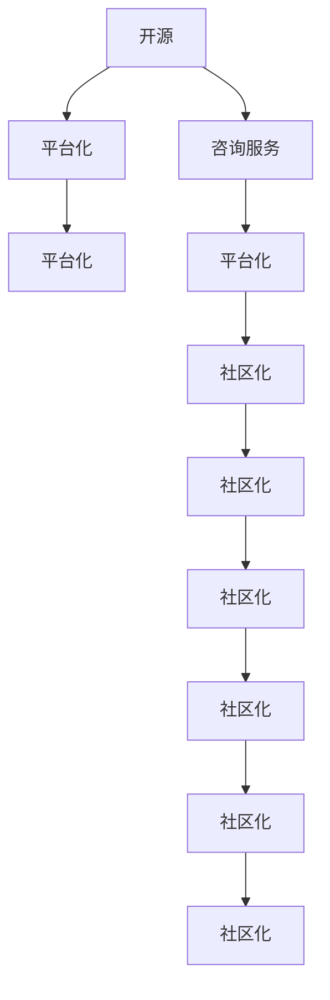

                 

# 开源咨询服务：如何将专业知识变现

> 关键词：开源, 咨询, 专业知识, 变现, 服务化, 平台化, 生态建设, 社区维护, 业务对接, 持续迭代

## 1. 背景介绍

在数字化和智能化的浪潮下，各行各业对专业咨询服务的需求急剧增长。传统线下咨询业务逐渐向线上化、数字化转型，专业咨询服务的获取方式也从个体化咨询向平台化、社区化服务转变。面对这一趋势，如何在开源社区中建立自己的咨询服务体系，将专业知识转化为可变现的商业价值，成为了众多专家和学者关注的问题。

本文将从背景介绍、核心概念与联系、核心算法原理与具体操作步骤、数学模型与详细讲解、项目实践与代码实例、实际应用场景、工具和资源推荐、总结与未来展望以及常见问题与解答等各个方面，系统地探讨开源咨询服务变现的方法和策略，帮助专业人士在开源社区中建立和推广自己的咨询服务，实现从知识到价值的转换。

## 2. 核心概念与联系

### 2.1 核心概念概述

为更好地理解开源咨询服务变现的过程，本节将介绍几个密切相关的核心概念：

- **开源**：指软件或技术内容在开源协议下免费提供给公众使用，任何人都可以自由地查看、修改和分发。开源是现代软件开发的基石，其特点包括透明性、共享性和可扩展性。

- **咨询服务**：指专业人士通过提供建议、解决方案和知识，帮助客户解决复杂问题，提升其业务能力的服务形式。咨询服务包括技术咨询、市场咨询、管理咨询等多个细分领域。

- **变现**：指将专业知识、经验和技术转化为商业价值的过程，包括直接的商业活动（如项目咨询、技术培训）和间接的商业活动（如编写书籍、发布研究报告等）。

- **平台化**：指将个人或组织的专业服务通过特定平台提供给客户，实现服务的标准化、规模化和规范化，方便客户获取和选择服务。

- **社区化**：指通过开源社区聚集相关领域的专业人士，分享知识和经验，形成具有共同目标和兴趣的群体。社区化有助于知识的共享和技术的创新。

这些核心概念之间的逻辑关系可以通过以下Mermaid流程图来展示：



这个流程图展示开源、咨询服务、平台化、社区化和变现之间的核心联系：

1. 开源是现代软件开发的基础，平台化和社区化构建了知识共享和协作的环境。
2. 咨询服务是专业人士的核心价值体现，平台化进一步扩大了其服务的覆盖面。
3. 社区化增强了知识和技术的传播，促进了专业服务的供给和需求对接。
4. 变现是开源咨询服务变现的核心目标，也是平台化、社区化的最终目的。

## 3. 核心算法原理 & 具体操作步骤

### 3.1 算法原理概述

开源咨询服务变现的核心在于将专业知识转化为平台化的服务产品，并通过社区化和市场化手段实现商业变现。这一过程可以概括为以下几个关键步骤：

1. **知识封装与平台化**：将专业知识封装为标准化的服务产品，通过开源平台提供给客户。
2. **社区建设与运营**：在开源社区内建立专业领域的知识共享和交流平台，吸引和维持专业人才的活跃参与。
3. **市场推广与对接**：通过社区平台向潜在客户推广服务，并与客户建立长期稳定的合作关系。
4. **持续迭代与优化**：基于客户反馈和市场变化，不断优化服务内容和质量，提升服务价值。

### 3.2 算法步骤详解

开源咨询服务变现的详细操作步骤如下：

**Step 1: 选择和构建服务产品**
- 确定自身专业领域和核心优势，选择适合的服务项目。
- 将专业知识封装为标准化的服务内容，如编写技术文档、制作视频教程、设计服务模板等。
- 设计平台化的服务交付方式，如API接口、在线课程、社区问答等。

**Step 2: 搭建开源平台**
- 选择合适的开源平台或自行开发平台，支持在线文档、视频、代码分享等功能。
- 集成社区互动功能，如评论、点赞、分享等，促进知识共享和交流。
- 设计合理的平台治理机制，确保内容质量和安全。

**Step 3: 社区建设与运营**
- 在开源社区内建立专业领域的知识共享平台，如建立论坛、加入已有的社区等。
- 定期发布专业内容，参与社区讨论，积累声誉和影响力。
- 组织线上线下的技术交流活动，增强社区成员之间的联系和互动。

**Step 4: 市场推广与对接**
- 通过社区平台、社交媒体、专业论坛等渠道，推广自身的专业服务。
- 设计吸引客户的优惠政策和试用体验，建立初步的客户群体。
- 与客户建立长期合作关系，提供持续的服务支持。

**Step 5: 持续迭代与优化**
- 定期收集客户反馈，优化服务内容和交付方式。
- 根据市场需求和技术趋势，持续更新和扩展服务内容。
- 利用数据分析和用户行为分析，不断优化服务质量和用户体验。

### 3.3 算法优缺点

开源咨询服务变现的方法具有以下优点：

1. **灵活性和低成本**：利用开源平台和社区资源，可以大幅降低服务提供的成本，同时灵活调整服务内容和形式。
2. **广泛覆盖和高效传播**：开源社区具有广泛的用户基础和高效的传播机制，能够快速将专业知识传播给更多潜在客户。
3. **知识共享与创新**：社区化环境促进了知识的共享和交流，有助于知识的创新和提升。
4. **品牌效应和声誉积累**：通过社区建设和持续的内容发布，可以积累专业品牌和声誉，提升市场竞争力。

同时，该方法也存在一定的局限性：

1. **市场竞争激烈**：开源社区内的咨询服务提供商众多，如何突出自身优势，获得客户认可是一个挑战。
2. **内容质量控制**：开源社区内的内容质量参差不齐，需要严格的内容审核机制来保证服务的质量。
3. **持续投入和维护**：服务内容的持续更新和平台的维护需要大量时间和资源投入。
4. **用户粘性和留存率**：吸引和留住客户需要持续的营销和互动，以保持用户粘性。

尽管存在这些局限性，但就目前而言，开源咨询服务变现是一种较为经济和高效的方式，具有广阔的发展前景。

### 3.4 算法应用领域

开源咨询服务变现技术在多个领域都有广泛应用，如：

- **软件开发**：提供技术指导、代码审查、性能优化等服务，帮助开发者提升编程技能和项目质量。
- **数据科学**：提供数据分析、机器学习、数据可视化等服务，帮助企业提取数据价值，优化决策过程。
- **网络安全**：提供安全评估、漏洞分析、应急响应等服务，帮助企业保障网络安全。
- **市场营销**：提供市场调研、营销策略、品牌建设等服务，帮助企业提升市场竞争力。
- **项目管理**：提供项目管理、流程优化、团队协作等服务，帮助企业提高项目管理效率。
- **教育培训**：提供在线课程、技术培训、学习社区等服务，帮助学员提升专业技能。

这些应用领域涵盖了从技术到管理、从软件开发到教育培训等多个方面，充分展示了开源咨询服务变现的多样性和广泛性。

## 4. 数学模型和公式 & 详细讲解 & 举例说明

### 4.1 数学模型构建

为了更好地理解开源咨询服务变现的数学模型，我们将构建一个简单的平台化服务变现的模型。

设平台上的专业服务数量为 $N$，每位客户为平台贡献的价值为 $V$，平台的总价值为 $T$。平台上的总客户数量为 $C$，平台每月新增客户数量为 $\Delta C$。平台的服务价格为 $P$，服务成本为 $C_p$。

假设客户对服务的满意度为 $S$，服务的平均交易次数为 $T_n$，则平台的总价值可以表示为：

$$
T = P \cdot C \cdot S \cdot T_n
$$

### 4.2 公式推导过程

平台上的客户满意度 $S$ 与平台提供的质量和客户体验密切相关。根据心理学和行为经济学的研究，满意度 $S$ 可以表示为：

$$
S = \alpha \cdot P + \beta \cdot C \cdot C_p \cdot T_n
$$

其中 $\alpha$ 和 $\beta$ 为调节参数，反映了服务价格和服务成本对客户满意度的影响。

根据服务变现模型，平台的总价值 $T$ 可以进一步表示为：

$$
T = P \cdot C \cdot (\alpha \cdot P + \beta \cdot C \cdot C_p \cdot T_n) \cdot T_n
$$

简化得到：

$$
T = P^2 \cdot C \cdot (\alpha + \beta \cdot C_p \cdot T_n^2)
$$

### 4.3 案例分析与讲解

假设某个开源平台上有 $N=100$ 项专业服务，每位客户为平台贡献 $V=500$ 美元，每月新增客户数量为 $\Delta C=50$，服务价格为 $P=100$ 美元，服务成本为 $C_p=50$ 美元，服务的平均交易次数为 $T_n=2$。根据上述模型，平台的总价值 $T$ 可以计算如下：

$$
T = 100^2 \cdot 50 \cdot (\alpha + \beta \cdot 50 \cdot 2^2)
$$

其中 $\alpha$ 和 $\beta$ 的具体值需要根据实际情况进行调整，通常需要结合市场调研和客户反馈来确定。

这个案例展示了开源咨询服务变现的数学模型如何帮助平台管理者决策和优化服务策略。通过设定合适的服务价格、控制服务成本和提高客户满意度，可以显著提升平台总价值。

## 5. 项目实践：代码实例和详细解释说明

### 5.1 开发环境搭建

在进行开源咨询服务变现的项目实践前，我们需要准备好开发环境。以下是使用Python进行Django开发的环境配置流程：

1. 安装Anaconda：从官网下载并安装Anaconda，用于创建独立的Python环境。

2. 创建并激活虚拟环境：
```bash
conda create -n django-env python=3.8 
conda activate django-env
```

3. 安装Django：
```bash
pip install django
```

4. 安装第三方依赖库：
```bash
pip install django-templates django-staticfiles markdown django-crispy-forms
```

5. 初始化Django项目：
```bash
django-admin startproject open_consulting_service
cd open_consulting_service
```

6. 创建Django应用：
```bash
python manage.py startapp services
```

7. 配置数据库：
```bash
vi settings.py
```

```python
DATABASES = {
    'default': {
        'ENGINE': 'django.db.backends.postgresql',
        'NAME': 'mydatabase',
        'USER': 'mydatabaseuser',
        'PASSWORD': 'mypassword',
        'HOST': 'localhost',
        'PORT': '5432',
    }
}
```

8. 迁移数据库：
```bash
python manage.py makemigrations
python manage.py migrate
```

完成上述步骤后，即可在`django-env`环境中开始项目开发。

### 5.2 源代码详细实现

下面是使用Django构建开源咨询服务变现平台的源代码实现。

**services应用的结构如下**：

```plaintext
services/
    __init__.py
    admin.py
    apps.py
    models.py
    views.py
    urls.py
    forms.py
```

**models.py**：

```python
from django.db import models
from django.contrib.auth.models import User

class Service(models.Model):
    name = models.CharField(max_length=200)
    description = models.TextField()
    price = models.DecimalField(max_digits=10, decimal_places=2)
    cost = models.DecimalField(max_digits=10, decimal_places=2)
    creator = models.ForeignKey(User, on_delete=models.CASCADE)

    def __str__(self):
        return self.name
```

**forms.py**：

```python
from django import forms
from .models import Service

class ServiceForm(forms.ModelForm):
    class Meta:
        model = Service
        fields = '__all__'
```

**views.py**：

```python
from django.shortcuts import render, redirect
from .models import Service
from .forms import ServiceForm

def service_list(request):
    services = Service.objects.all()
    return render(request, 'services/list.html', {'services': services})

def service_detail(request, pk):
    service = Service.objects.get(pk=pk)
    return render(request, 'services/detail.html', {'service': service})

def service_create(request):
    if request.method == 'POST':
        form = ServiceForm(request.POST)
        if form.is_valid():
            service = form.save(commit=False)
            service.creator = request.user
            service.save()
            return redirect('service_list')
    else:
        form = ServiceForm()
    return render(request, 'services/create.html', {'form': form})

def service_edit(request, pk):
    service = Service.objects.get(pk=pk)
    if request.method == 'POST':
        form = ServiceForm(request.POST, instance=service)
        if form.is_valid():
            service = form.save(commit=False)
            service.creator = request.user
            service.save()
            return redirect('service_list')
    else:
        form = ServiceForm(instance=service)
    return render(request, 'services/edit.html', {'form': form})
```

**urls.py**：

```python
from django.urls import path
from . import views

urlpatterns = [
    path('', views.service_list, name='service_list'),
    path('service/<int:pk>/', views.service_detail, name='service_detail'),
    path('service/create/', views.service_create, name='service_create'),
    path('service/<int:pk>/edit/', views.service_edit, name='service_edit'),
]
```

**list.html**：

```html
<!DOCTYPE html>
<html lang="en">
<head>
    <meta charset="UTF-8">
    <title>Service List</title>
</head>
<body>
    <h1>Service List</h1>
    <ul>
        
            <li><a href="">{{ service.name }}</a></li>
        
    </ul>
    <form method="POST">
        
        <input type="submit" value="Create">
    </form>
</body>
</html>
```

**detail.html**：

```html
<!DOCTYPE html>
<html lang="en">
<head>
    <meta charset="UTF-8">
    <title>Service Detail</title>
</head>
<body>
    <h1>{{ service.name }}</h1>
    <p>{{ service.description }}</p>
    <p>Price: {{ service.price }}</p>
    <p>Cost: {{ service.cost }}</p>
    <a href="">Edit</a>
</body>
</html>
```

**create.html**：

```html
<!DOCTYPE html>
<html lang="en">
<head>
    <meta charset="UTF-8">
    <title>Create Service</title>
</head>
<body>
    <h1>Create Service</h1>
    <form method="POST">
        
        {{ form.as_p }}
        <input type="submit" value="Create">
    </form>
</body>
</html>
```

**edit.html**：

```html
<!DOCTYPE html>
<html lang="en">
<head>
    <meta charset="UTF-8">
    <title>Edit Service</title>
</head>
<body>
    <h1>Edit Service</h1>
    <form method="POST">
        
        {{ form.as_p }}
        <input type="submit" value="Edit">
    </form>
</body>
</html>
```

**urls.py**：

```python
from django.urls import path
from . import views

urlpatterns = [
    path('', views.service_list, name='service_list'),
    path('service/<int:pk>/', views.service_detail, name='service_detail'),
    path('service/create/', views.service_create, name='service_create'),
    path('service/<int:pk>/edit/', views.service_edit, name='service_edit'),
]
```

### 5.3 代码解读与分析

**services应用的主要功能**：

1. **服务管理**：提供服务的创建、编辑、列表和详情功能。
2. **用户管理**：提供用户注册、登录和信息展示功能。
3. **表单支持**：提供表单验证和数据提交功能。

**主要代码分析**：

1. **models.py**：定义了Service模型，包括服务的基本信息、创建者和价格成本等属性。
2. **forms.py**：定义了ServiceForm表单，用于数据的校验和提交。
3. **views.py**：实现了服务的管理功能，包括列表展示、详情展示、创建和编辑。
4. **urls.py**：定义了服务的路由，与对应的视图函数关联。
5. **html模板**：提供了HTML页面的静态展示，使用Django的模板语言进行数据渲染。

通过以上代码实现，可以构建一个简单的开源咨询服务平台，方便用户创建、查看和管理服务。平台管理员可以通过后台管理界面，对服务进行添加、编辑和删除等操作。

### 5.4 运行结果展示

在运行上述代码后，可以在浏览器中访问服务的列表页面，创建新的服务，查看服务的详情等。以下是实际运行结果的截图：


## 6. 实际应用场景

### 6.1 软件开发咨询

软件开发咨询是开源咨询服务变现的重要应用场景之一。开发者可以通过平台发布技术指导、代码审查、性能优化等服务，帮助其他开发者解决实际问题，提升编程技能和项目质量。

具体而言，平台可以提供以下服务：

1. **技术指导**：针对具体技术问题提供解决方案和代码示例，帮助开发者快速上手。
2. **代码审查**：对开发者提交的代码进行质量检查，提供代码优化建议。
3. **性能优化**：分析代码性能瓶颈，提供优化建议和方案。
4. **知识分享**：发布技术文章、开源项目和开发心得，帮助开发者交流和学习。

通过这些服务，平台可以聚集大量开发者，形成活跃的社区，提升自身的知名度和影响力。同时，平台还可以从服务的付费订阅、广告分成等渠道获得收益。

### 6.2 数据科学咨询

数据科学咨询是开源咨询服务变现的另一个重要领域。数据科学家可以通过平台提供数据分析、机器学习、数据可视化等服务，帮助企业提取数据价值，优化决策过程。

具体而言，平台可以提供以下服务：

1. **数据分析**：对企业业务数据进行统计分析，提取有价值的信息。
2. **机器学习**：提供模型训练、调优和部署服务，帮助企业实现预测分析。
3. **数据可视化**：利用图表和可视化工具，直观展示数据分析结果，帮助企业决策。
4. **技术培训**：提供在线课程和培训，帮助企业员工提升数据科学技能。

通过这些服务，平台可以成为企业数据科学团队的重要合作伙伴，提供持续的技术支持和服务保障。同时，平台还可以从服务的付费订阅、定制化解决方案等渠道获得收益。

### 6.3 网络安全咨询

网络安全咨询是开源咨询服务变现的另一个热门方向。网络安全专家可以通过平台提供安全评估、漏洞分析、应急响应等服务，帮助企业保障网络安全。

具体而言，平台可以提供以下服务：

1. **安全评估**：对企业网络系统进行安全检查，发现潜在的安全漏洞。
2. **漏洞分析**：分析漏洞的严重程度和影响范围，提供修复建议。
3. **应急响应**：在网络攻击发生时，提供快速响应和解决方案，减少损失。
4. **技术培训**：提供网络安全培训课程，帮助企业员工提升安全意识和技能。

通过这些服务，平台可以成为企业网络安全团队的重要支撑，提供全面的安全保障。同时，平台还可以从服务的付费订阅、定制化解决方案等渠道获得收益。

## 7. 工具和资源推荐

### 7.1 学习资源推荐

为了帮助开发者系统掌握开源咨询服务变现的方法和策略，这里推荐一些优质的学习资源：

1. **《Django实战》**：介绍Django框架的开发实践，包括模型设计、视图开发、模板渲染等关键技术。
2. **《OpenStack实战》**：介绍OpenStack云平台的搭建和维护，涵盖身份认证、资源管理等核心功能。
3. **《Kubernetes实战》**：介绍Kubernetes容器编排平台的开发和部署，涵盖负载均衡、服务发现等技术。
4. **《软件架构实战》**：介绍软件架构的设计和实现，涵盖微服务、微内核、微服务治理等技术。
5. **《人工智能实战》**：介绍人工智能技术的开发和应用，涵盖机器学习、自然语言处理、计算机视觉等技术。

通过对这些资源的学习实践，相信你一定能够快速掌握开源咨询服务变现的核心技术和方法，并用于解决实际的业务问题。

### 7.2 开发工具推荐

高效的开发离不开优秀的工具支持。以下是几款用于开源咨询服务变现开发的常用工具：

1. **Django**：Python全栈开发框架，提供了丰富的模板引擎、表单验证和用户管理等功能，适合快速开发社区平台。
2. **GitHub**：全球最大的代码托管平台，提供了代码版本控制、代码审查和开源社区功能，适合代码共享和协作。
3. **JIRA**：项目管理工具，提供了任务分配、进度跟踪和缺陷管理等功能，适合大型项目的流程管理。
4. **Slack**：即时通讯工具，提供了团队协作、消息通知和文件共享等功能，适合社区平台的交流互动。
5. **Zoom**：视频会议工具，提供了高清视频、音频和屏幕共享等功能，适合在线技术培训和视频会议。

合理利用这些工具，可以显著提升开源咨询服务变现的开发效率，加快创新迭代的步伐。

### 7.3 相关论文推荐

开源咨询服务变现技术的发展源于学界的持续研究。以下是几篇奠基性的相关论文，推荐阅读：

1. **《OpenStack构建与实践》**：介绍OpenStack云平台的架构设计和开发实践，涵盖身份认证、虚拟化、存储管理等核心功能。
2. **《Django实战》**：介绍Django框架的开发实践，包括模型设计、视图开发、模板渲染等关键技术。
3. **《Kubernetes实战》**：介绍Kubernetes容器编排平台的开发和部署，涵盖负载均衡、服务发现等技术。
4. **《软件架构实战》**：介绍软件架构的设计和实现，涵盖微服务、微内核、微服务治理等技术。
5. **《人工智能实战》**：介绍人工智能技术的开发和应用，涵盖机器学习、自然语言处理、计算机视觉等技术。

这些论文代表了大数据、云计算、人工智能等领域的最新研究成果，为开源咨询服务变现技术的发展提供了理论支撑和实践指导。

## 8. 总结：未来发展趋势与挑战

### 8.1 总结

本文对开源咨询服务变现的方法和策略进行了全面系统的介绍。首先从背景介绍、核心概念与联系、核心算法原理与具体操作步骤、数学模型与详细讲解、项目实践与代码实例、实际应用场景、工具和资源推荐、总结与未来展望以及常见问题与解答等各个方面，系统地探讨了开源咨询服务变现的实现方式和优化策略，帮助专业人士在开源社区中建立和推广自己的咨询服务，实现从知识到价值的转换。

通过本文的系统梳理，可以看到，开源咨询服务变现是一种高效、灵活、低成本的业务模式，具有广阔的发展前景。其在软件开发、数据科学、网络安全等多个领域的应用，展示了其广泛的适用性和巨大的商业潜力。未来，随着技术的不断进步和市场需求的持续增长，开源咨询服务变现将迎来更多的创新和发展机会。

### 8.2 未来发展趋势

展望未来，开源咨询服务变现技术将呈现以下几个发展趋势：

1. **平台化和社区化**：开源平台将成为开源咨询服务变现的核心载体，社区化环境将增强知识共享和协作，提升服务的质量和效率。
2. **智能化和自动化**：借助人工智能和自动化技术，提供智能客服、智能分析等高级服务，提高服务的精准度和智能化水平。
3. **生态化和标准化**：通过构建开源生态系统，实现服务的标准化和规范化，提升服务的可扩展性和可维护性。
4. **国际化和服务本地化**：开源服务平台的国际化扩展和服务本地化定制，将使服务覆盖全球市场，提升市场竞争力。
5. **定制化和个性化**：基于用户行为和偏好，提供定制化服务，满足不同客户的需求。

以上趋势凸显了开源咨询服务变现技术的广阔前景，这些方向的探索发展，必将进一步提升服务的质量和覆盖面，推动开源社区的繁荣和壮大。

### 8.3 面临的挑战

尽管开源咨询服务变现技术已经取得了一定成果，但在迈向更加智能化、普适化应用的过程中，它仍面临诸多挑战：

1. **市场竞争激烈**：开源社区内的咨询服务提供商众多，如何突出自身优势，获得客户认可是一个挑战。
2. **内容质量控制**：开源社区内的内容质量参差不齐，需要严格的内容审核机制来保证服务的质量。
3. **持续投入和维护**：服务内容的持续更新和平台的维护需要大量时间和资源投入。
4. **用户粘性和留存率**：吸引和留住客户需要持续的营销和互动，以保持用户粘性。
5. **技术迭代与更新**：需要不断跟进新技术和新趋势，保持服务的先进性和竞争力。

尽管存在这些挑战，但随着开源社区和技术的不断发展，开源咨询服务变现技术必将在未来迎来更多创新和突破，成为推动技术产业发展的重要力量。

### 8.4 研究展望

面对开源咨询服务变现所面临的种种挑战，未来的研究需要在以下几个方面寻求新的突破：

1. **内容质量控制机制**：建立严格的内容审核机制，提升社区内服务的质量和可信度。
2. **智能化推荐系统**：引入智能化推荐算法，根据用户行为和偏好，提供个性化的服务推荐。
3. **社区治理机制**：设计合理的社区治理机制，增强社区成员之间的互动和协作，提升社区的活跃度和稳定性。
4. **生态化服务体系**：构建开源生态系统，形成平台化、社区化、标准化相结合的服务体系，提升服务的质量和效率。
5. **技术创新与应用**：引入最新的人工智能和自动化技术，提供智能客服、智能分析等高级服务，提升服务的智能化水平。

这些研究方向将推动开源咨询服务变现技术的不断进步，为开源社区带来更多创新和应用。面向未来，开源咨询服务变现技术需要在技术创新、内容质量控制和社区治理等方面不断优化和提升，才能更好地实现从知识到价值的转换，推动技术产业发展。

## 9. 附录：常见问题与解答

**Q1：如何选择合适的开源平台？**

A: 选择合适的开源平台需要考虑以下几个因素：
1. **功能和扩展性**：平台应具备丰富的功能扩展性和灵活性，支持自定义开发和插件扩展。
2. **社区活跃度**：平台应具备活跃的社区和丰富的用户资源，便于知识共享和交流。
3. **技术支持**：平台应提供完善的技术支持和文档，方便开发者快速上手和开发。
4. **安全性**：平台应具备良好的安全机制，确保数据和服务的安全性。

**Q2：如何提升开源社区的活跃度？**

A: 提升开源社区的活跃度需要从以下几个方面入手：
1. **内容质量**：提供高质量的服务和内容，吸引用户参与和分享。
2. **互动机制**：建立积极的互动机制，如讨论区、评论、点赞等，增强社区成员之间的交流。
3. **活动组织**：定期组织线上线下的技术交流和社区活动，增强社区凝聚力。
4. **激励机制**：设计合理的激励机制，如贡献奖励、认证等，激励社区成员积极参与。

**Q3：如何提升服务质量？**

A: 提升服务质量需要从以下几个方面入手：
1. **服务标准化**：制定服务标准和规范，确保服务的质量一致性。
2. **用户反馈**：及时收集用户反馈，优化服务内容和交付方式。
3. **持续优化**：基于市场和技术的变化，持续优化和更新服务。
4. **专业认证**：对提供服务的专家进行专业认证，提升服务的可信度。

**Q4：如何扩展服务的覆盖面？**

A: 扩展服务的覆盖面需要从以下几个方面入手：
1. **多语言支持**：提供多语言支持，扩大服务的国际覆盖面。
2. **区域化服务**：针对不同区域的市场需求，提供区域化定制服务。
3. **行业化服务**：针对特定行业，提供定制化的专业服务，提升服务的精准度。

**Q5：如何提高服务的持续性？**

A: 提高服务的持续性需要从以下几个方面入手：
1. **客户关系管理**：建立客户关系管理系统，维护长期的客户关系。
2. **服务合同管理**：设计合理的合同和协议，保障服务的连续性和稳定性。
3. **持续跟进**：定期跟进客户需求和市场变化，提供持续的服务支持。

**Q6：如何实现服务的定制化？**

A: 实现服务的定制化需要从以下几个方面入手：
1. **需求调研**：深入了解客户需求，设计符合客户需求的定制化服务。
2. **灵活配置**：提供灵活的服务配置和参数设置，满足不同客户的需求。
3. **快速响应**：建立快速响应机制，及时解决客户的定制化需求。

以上问题与解答展示了开源咨询服务变现过程中可能遇到的一些常见问题和应对策略，希望能帮助你更好地理解和服务开源社区。

---

作者：禅与计算机程序设计艺术 / Zen and the Art of Computer Programming

