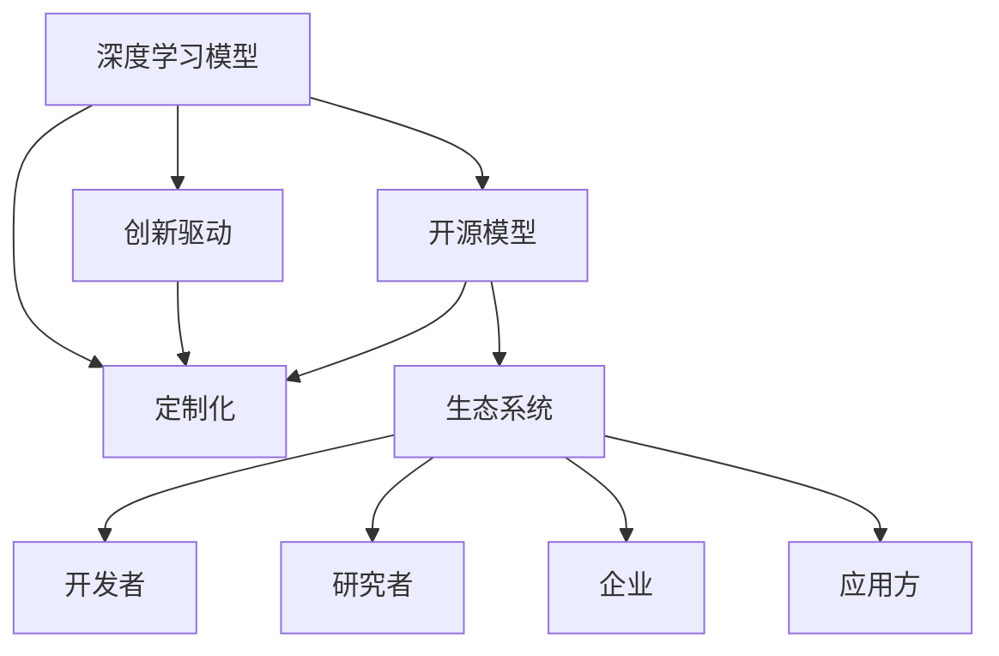

                 

# 开源模型的发展：贾扬清的观点，创新与定制化优势助力发展

> 关键词：开源模型，深度学习，人工智能，定制化，创新，生态系统

## 1. 背景介绍

在深度学习领域，开源模型已经成为推动技术进步和产业应用的重要力量。自2012年AlexNet在ImageNet比赛中惊艳登场以来，深度学习模型不断刷新记录，推动了计算机视觉、自然语言处理、语音识别等多个领域的突破。开源模型凭借其开源特性，使得更多研究者和开发者能够低门槛地参与到模型的开发和应用中，加速了深度学习技术的普及和产业化进程。

在这一背景下，深度学习大牛、OpenAI联合创始人贾扬清博士，近年来通过一系列演讲、博客和论文，系统地阐述了他对开源模型的看法和未来发展方向。他的观点不仅聚焦于深度学习技术本身的演进，还深入讨论了开源模型在生态建设、创新驱动和定制化发展等方面的重要意义。本文将梳理贾扬清博士的主要观点，并结合当前深度学习领域的发展趋势，分析开源模型在推动人工智能发展中的优势和潜力。

## 2. 核心概念与联系

为了更好地理解贾扬清博士对开源模型的观点，本节将介绍几个核心概念及其相互联系：

- **深度学习模型**：基于神经网络的模型，通过多层次的非线性变换，从原始数据中提取高层次的特征表示。
- **开源模型**：模型及其训练代码、文档等完全公开，允许任何人自由使用、修改和传播，具有强大的社区驱动力和广泛的应用场景。
- **创新驱动**：通过开源模型的公开共享，加速新想法和技术的迭代与验证，促进深度学习技术的快速演进。
- **定制化**：针对特定应用场景，对开源模型进行个性化优化和扩展，提高其在实际应用中的效能和可扩展性。
- **生态系统**：由开发者、研究者、企业、应用方等组成的社区，通过开源模型建立起深度学习的完整生态链。

这些核心概念之间存在着紧密的联系，共同构成了深度学习开源模型发展的整体框架。以下Mermaid流程图展示了这些概念的相互关系：



该流程图展示了深度学习模型的开源特性如何通过社区驱动、创新驱动和定制化定制化的方式，促进了整个生态系统的繁荣和发展。

## 3. 核心算法原理 & 具体操作步骤

### 3.1 算法原理概述

贾扬清博士认为，开源模型的成功不仅在于其技术本身，还在于其生态系统的多样性和包容性。在开源模型的基础上，通过社区协作和创新驱动，实现了算法和应用的快速迭代与升级。同时，定制化扩展使得模型能够更好地适应特定应用场景，充分发挥其效能。

以下是对这一原理的详细解释：

- **开源特性**：开源模型允许任何人使用、修改和传播模型及其训练代码，形成了强大的社区驱动和创新生态。社区成员通过贡献代码、提出问题、分享经验等方式，共同推动模型的不断完善和优化。
- **创新驱动**：开源模型促进了深度学习技术的快速迭代与验证，加速了新想法和新技术的转化。在开源平台上，研究者可以快速尝试和验证新算法，开发者可以灵活应用到实际应用中。
- **定制化**：针对特定应用场景，通过对开源模型进行个性化优化和扩展，提高其在实际应用中的效能和可扩展性。定制化不仅包括模型参数的微调，还包括模型的应用集成、性能优化等。

### 3.2 算法步骤详解

以下是贾扬清博士对开源模型发展过程中，创新与定制化技术的具体操作步骤的详细阐述：

**Step 1: 开源模型选择与初始化**

- 选择适合当前应用的深度学习开源模型，如TensorFlow、PyTorch、MXNet等。
- 下载模型及其训练代码，并进行初始化设置。

**Step 2: 社区贡献与模型改进**

- 参与到开源社区，提交代码、解决Bug、提出新问题等。
- 根据实际需求，对开源模型进行定制化修改和优化，如增加新模块、改进训练过程等。

**Step 3: 模型应用与优化**

- 将定制化后的模型应用到实际场景中，进行测试和验证。
- 收集反馈，优化模型性能，如调整超参数、改进模型结构等。

**Step 4: 创新探索与迭代**

- 在实际应用中探索新算法和新模型结构，不断尝试和验证。
- 通过开源社区的交流与合作，实现技术与应用的快速迭代和升级。

### 3.3 算法优缺点

贾扬清博士认为，开源模型在推动深度学习技术发展方面具有以下优点和局限：

#### 优点

1. **社区驱动**：社区成员的广泛参与使得开源模型能够快速迭代和优化，保持技术前沿。
2. **创新高效**：通过开放平台加速新算法和新技术的转化，促进深度学习技术的发展。
3. **定制化灵活**：模型能够根据实际需求进行个性化定制，提高在特定场景中的效能。
4. **普及度高**：开源特性使得更多人能够低门槛地使用和开发深度学习模型。

#### 局限

1. **标准化不足**：开源模型的多样性和复杂性可能导致标准不统一，难以统一管理和应用。
2. **兼容性问题**：不同模型间的兼容性问题，可能导致实际应用中的集成难度增加。
3. **安全风险**：开源模型及其训练数据的隐私和安全问题，可能带来潜在风险。

### 3.4 算法应用领域

贾扬清博士认为，开源模型在多个领域具有广泛的应用潜力，具体包括：

1. **计算机视觉**：如目标检测、图像分类、图像生成等任务。
2. **自然语言处理**：如机器翻译、文本分类、对话系统等任务。
3. **语音识别**：如语音识别、语音合成等任务。
4. **推荐系统**：如商品推荐、新闻推荐、音乐推荐等任务。
5. **游戏AI**：如游戏对弈、角色生成等任务。
6. **医疗健康**：如医学影像分析、疾病预测等任务。
7. **自动驾驶**：如环境感知、路径规划等任务。

这些领域都是深度学习开源模型可以大展身手的场景，通过不断迭代和优化，这些模型有望在实际应用中发挥更大的价值。

## 4. 数学模型和公式 & 详细讲解  
### 4.1 数学模型构建

贾扬清博士认为，深度学习模型的数学模型构建是实现模型创新的基础。以下是对数学模型构建的详细阐述：

- **神经网络结构**：如卷积神经网络(CNN)、循环神经网络(RNN)、变压器(Transformer)等。
- **损失函数**：如交叉熵损失、均方误差损失、自定义损失等。
- **优化算法**：如梯度下降、Adam、Adagrad等。
- **正则化技术**：如L2正则化、Dropout、数据增强等。

### 4.2 公式推导过程

以神经网络中的前向传播和反向传播为例，推导其数学模型和公式：

- **前向传播**：输入数据 $x$ 经过多个层次的权重矩阵和激活函数变换，得到最终输出 $y$。
- **反向传播**：计算输出 $y$ 与真实标签 $y^*$ 的误差，通过链式法则计算每个权重的梯度，并更新模型参数。

### 4.3 案例分析与讲解

以卷积神经网络(CNN)为例，分析其在图像分类任务中的应用：

- **模型结构**：由卷积层、池化层、全连接层等组成。
- **数据预处理**：图像归一化、数据增强等。
- **训练过程**：随机梯度下降、学习率调整等。
- **验证与测试**：验证集和测试集上的准确率对比。

## 5. 项目实践：代码实例和详细解释说明

### 5.1 开发环境搭建

贾扬清博士强调，开发环境的搭建是实现模型创新的基础。以下是使用Python进行PyTorch开发的环境配置流程：

1. 安装Anaconda：从官网下载并安装Anaconda，用于创建独立的Python环境。
2. 创建并激活虚拟环境：
```bash
conda create -n pytorch-env python=3.8 
conda activate pytorch-env
```

3. 安装PyTorch：根据CUDA版本，从官网获取对应的安装命令。例如：
```bash
conda install pytorch torchvision torchaudio cudatoolkit=11.1 -c pytorch -c conda-forge
```

4. 安装Transformers库：
```bash
pip install transformers
```

5. 安装各类工具包：
```bash
pip install numpy pandas scikit-learn matplotlib tqdm jupyter notebook ipython
```

完成上述步骤后，即可在`pytorch-env`环境中开始模型开发。

### 5.2 源代码详细实现

以下是一个使用PyTorch进行图像分类任务的代码实现，详细解释了模型的构建和训练过程：

```python
import torch
from torch import nn, optim
from torchvision import datasets, transforms

# 定义模型
class Net(nn.Module):
    def __init__(self):
        super(Net, self).__init__()
        self.conv1 = nn.Conv2d(3, 6, 5)
        self.pool = nn.MaxPool2d(2, 2)
        self.conv2 = nn.Conv2d(6, 16, 5)
        self.fc1 = nn.Linear(16 * 5 * 5, 120)
        self.fc2 = nn.Linear(120, 84)
        self.fc3 = nn.Linear(84, 10)

    def forward(self, x):
        x = self.pool(F.relu(self.conv1(x)))
        x = self.pool(F.relu(self.conv2(x)))
        x = x.view(-1, 16 * 5 * 5)
        x = F.relu(self.fc1(x))
        x = F.relu(self.fc2(x))
        x = self.fc3(x)
        return x

# 加载数据集
train_dataset = datasets.CIFAR10(root='./data', train=True, transform=transforms.ToTensor(), download=True)
test_dataset = datasets.CIFAR10(root='./data', train=False, transform=transforms.ToTensor(), download=True)

# 定义数据加载器
train_loader = torch.utils.data.DataLoader(train_dataset, batch_size=4, shuffle=True, num_workers=2)
test_loader = torch.utils.data.DataLoader(test_dataset, batch_size=4, shuffle=False, num_workers=2)

# 定义模型、损失函数和优化器
net = Net()
criterion = nn.CrossEntropyLoss()
optimizer = optim.SGD(net.parameters(), lr=0.001, momentum=0.9)

# 训练模型
for epoch in range(2):  # 多次训练
    running_loss = 0.0
    for i, data in enumerate(train_loader, 0):
        inputs, labels = data
        optimizer.zero_grad()
        outputs = net(inputs)
        loss = criterion(outputs, labels)
        loss.backward()
        optimizer.step()

        running_loss += loss.item()
        if i % 2000 == 1999:    # 每2000次输出一次损失信息
            print('[%d, %5d] loss: %.3f' %
                  (epoch + 1, i + 1, running_loss / 2000))
            running_loss = 0.0

print('Finished Training')
```

### 5.3 代码解读与分析

让我们再详细解读一下关键代码的实现细节：

**Net类**：
- `__init__`方法：定义模型的层次结构，包括卷积层、池化层、全连接层等。
- `forward`方法：实现模型的前向传播过程，包括激活函数和池化操作。

**数据加载器**：
- 使用`torch.utils.data.DataLoader`对数据集进行批次化加载，便于模型训练和推理。

**训练过程**：
- 定义损失函数和优化器，并进行多次迭代训练。
- 在每个批次上前向传播计算损失函数，反向传播更新模型参数。

## 6. 实际应用场景

贾扬清博士认为，深度学习模型的实际应用场景非常广泛，以下是一些典型的应用案例：

### 6.4 未来应用展望

贾扬清博士对深度学习模型的未来应用展望，主要集中在以下几个方面：

1. **多模态融合**：深度学习模型有望融合视觉、语音、文本等多模态数据，实现更全面的智能感知。
2. **自动驾驶**：深度学习模型在自动驾驶领域的应用，将推动智能交通和智慧城市的发展。
3. **医疗健康**：深度学习模型在医疗影像分析、疾病预测等方面的应用，将极大提升医疗服务的智能化水平。
4. **金融科技**：深度学习模型在金融风险控制、智能投顾等方面的应用，将提升金融服务的效率和精准度。
5. **智能客服**：深度学习模型在智能客服领域的应用，将大幅提升客户服务体验和效率。
6. **游戏AI**：深度学习模型在游戏对弈、角色生成等方面的应用，将推动游戏AI的发展。

## 7. 工具和资源推荐

### 7.1 学习资源推荐

为了帮助开发者系统掌握深度学习模型的开发和应用，贾扬清博士推荐了一些优质的学习资源：

1. **Deep Learning Specialization**：由Andrew Ng教授主讲的深度学习课程，涵盖深度学习模型的理论基础和实际应用。
2. **TensorFlow官方文档**：详细介绍了TensorFlow框架的使用方法和最佳实践。
3. **PyTorch官方文档**：详细介绍了PyTorch框架的使用方法和最佳实践。
4. **MXNet官方文档**：详细介绍了MXNet框架的使用方法和最佳实践。
5. **Hugging Face博客**：介绍最新的深度学习模型和应用案例，帮助开发者快速上手。

### 7.2 开发工具推荐

高效的开发离不开优秀的工具支持。以下是几款用于深度学习模型开发的常用工具：

1. **PyTorch**：基于Python的开源深度学习框架，灵活的计算图设计，适合快速迭代研究。
2. **TensorFlow**：由Google主导开发的开源深度学习框架，生产部署方便，适合大规模工程应用。
3. **MXNet**：由Amazon主导开发的开源深度学习框架，高效跨平台运行，适合大规模分布式训练。
4. **Jupyter Notebook**：交互式开发环境，支持代码、公式和图表的混合展示，方便研究和分享。
5. **Weights & Biases**：模型训练的实验跟踪工具，可以记录和可视化模型训练过程中的各项指标，方便对比和调优。
6. **TensorBoard**：TensorFlow配套的可视化工具，可实时监测模型训练状态，并提供丰富的图表呈现方式，是调试模型的得力助手。

### 7.3 相关论文推荐

深度学习模型的发展离不开学界的持续研究。以下是几篇奠基性的相关论文，推荐阅读：

1. **AlexNet**：ImageNet比赛冠军，奠定了深度学习在计算机视觉领域的基础。
2. **Inception**：提出Inception模块，提升了深度神经网络的效率和效果。
3. **ResNet**：提出残差连接，解决了深度神经网络的梯度消失问题。
4. **Transformer**：提出自注意力机制，提升了序列建模的效果。
5. **BERT**：提出预训练语言模型，提升了自然语言处理的精度和泛化能力。
6. **GPT-3**：提出大规模语言模型，展示了深度学习在自然语言处理领域的巨大潜力。

这些论文代表了大深度学习模型的发展脉络。通过学习这些前沿成果，可以帮助研究者把握学科前进方向，激发更多的创新灵感。

## 8. 总结：未来发展趋势与挑战

### 8.1 研究成果总结

贾扬清博士认为，深度学习模型的发展离不开社区驱动和创新驱动。通过开源模型，实现了算法和应用的快速迭代与升级，推动了深度学习技术的普及和产业化进程。

### 8.2 未来发展趋势

贾扬清博士认为，深度学习模型的未来发展趋势主要集中在以下几个方面：

1. **模型规模增大**：随着算力成本的下降和数据规模的扩张，深度学习模型的参数量还将持续增长。超大规模模型蕴含的丰富知识，有望支撑更加复杂多变的应用场景。
2. **模型泛化性提升**：深度学习模型将更好地适应不同领域和任务，具有更强的泛化能力和迁移学习能力。
3. **模型推理效率优化**：通过模型裁剪、量化加速等技术，实现深度学习模型的快速推理和部署。
4. **模型安全性保障**：通过引入安全机制和伦理约束，确保模型的输出符合人类价值观和伦理道德。
5. **模型可解释性增强**：通过可解释性算法和可视化工具，增强模型的透明度和可解释性。
6. **模型跨领域应用**：深度学习模型将在更多领域得到应用，为传统行业带来变革性影响。

### 8.3 面临的挑战

尽管深度学习模型的发展取得了瞩目成就，但在迈向更加智能化、普适化应用的过程中，仍面临诸多挑战：

1. **计算资源瓶颈**：超大规模模型对算力、内存、存储等资源提出了很高的要求，如何有效利用和优化这些资源，仍是重要的技术挑战。
2. **数据隐私问题**：深度学习模型训练和使用过程中涉及大量数据，如何保护用户隐私，防止数据泄露，需要进一步加强技术和管理措施。
3. **模型鲁棒性不足**：模型在面对未知数据或异常情况时，容易出现过拟合或泛化能力不足的问题，需要进一步提升模型的鲁棒性和泛化能力。
4. **模型可解释性不足**：深度学习模型通常被视为"黑盒"系统，难以解释其内部工作机制和决策逻辑，需要进一步提升模型的可解释性。
5. **模型安全性问题**：深度学习模型可能学习到有偏见、有害的信息，如何避免模型输出误导性、歧视性的内容，保障模型安全，仍需进一步加强技术和管理措施。

### 8.4 研究展望

深度学习模型的未来研究需要在以下几个方面寻求新的突破：

1. **模型压缩与优化**：开发更高效的模型压缩和优化技术，减少计算资源消耗，提高模型推理速度。
2. **跨模态融合**：实现视觉、语音、文本等多模态数据的融合，提升模型的感知能力和泛化能力。
3. **知识表示与推理**：引入知识图谱、逻辑规则等先验知识，增强模型的推理能力和可解释性。
4. **伦理与安全约束**：在模型训练目标中引入伦理导向的评估指标，确保模型输出的安全性、公平性和公正性。
5. **模型可解释性增强**：引入可解释性算法和可视化工具，增强模型的透明度和可解释性。
6. **多领域应用探索**：进一步拓展深度学习模型在医疗、金融、教育等领域的创新应用，推动相关行业智能化升级。

## 9. 附录：常见问题与解答

**Q1: 深度学习模型和开源模型有什么区别？**

A: 深度学习模型是利用神经网络进行模式识别的模型，而开源模型是指模型及其训练代码、文档等完全公开，允许任何人自由使用、修改和传播的模型。深度学习模型可以是开源的，也可以是非开源的，开源模型则强调社区驱动和创新驱动。

**Q2: 深度学习模型的创新驱动和定制化有何优势？**

A: 创新驱动使得深度学习模型能够快速迭代和优化，保持技术前沿。定制化使得模型能够根据实际需求进行个性化优化和扩展，提高在特定场景中的效能和可扩展性。

**Q3: 如何优化深度学习模型的计算资源使用？**

A: 通过模型裁剪、量化加速、混合精度训练、模型并行等技术，可以有效减少计算资源消耗，提高模型推理速度和效率。

**Q4: 深度学习模型的安全性问题如何解决？**

A: 引入安全机制和伦理约束，如数据脱敏、访问鉴权、异常检测等技术，确保模型的输出符合人类价值观和伦理道德。

**Q5: 深度学习模型如何提高可解释性？**

A: 引入可解释性算法和可视化工具，如SHAP、LIME等，增强模型的透明度和可解释性。

---

作者：禅与计算机程序设计艺术 / Zen and the Art of Computer Programming

