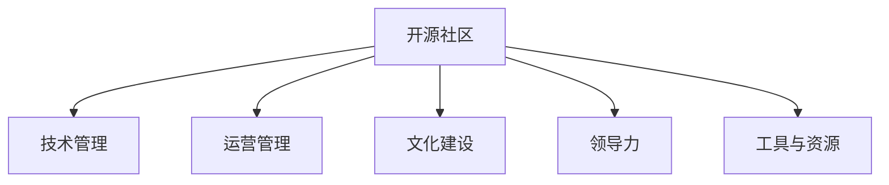

                 

# 开源社区管理：从义务到职业的转变

> 关键词：开源社区, 社区管理, 义务管理, 职业管理, 社区文化, 领导力, 工具与资源, 未来趋势

## 1. 背景介绍

### 1.1 问题由来

开源社区作为软件生态的重要组成部分，近年来迅速发展壮大。从早期的Linux、Apache等少数项目的兴起，到现在数以千计的活跃开源项目，开源社区已经成为软件开发不可或缺的一部分。开源社区不仅推动了软件技术的发展，也为程序员提供了广泛的技术交流和合作平台。

然而，随着开源社区的规模和复杂度不断增加，社区管理也变得越来越复杂。如何有效地管理一个开源社区，保证其健康、有序、高效运转，成为一个重要的课题。许多经验丰富的开发者在转型为开源社区管理者时，往往面临着从义务管理到职业管理的转变。

### 1.2 问题核心关键点

开源社区管理是一个多维度、多层次的任务，涉及技术、运营、文化、领导力等多个方面。以下是核心关键点：

- **技术管理**：管理社区的技术架构、代码质量、发布流程等。
- **运营管理**：包括项目管理、发布管理、用户沟通、资源调度等。
- **文化建设**：维护社区的价值观、行为规范、社区文化等。
- **领导力**：培养和选拔社区领袖，指导和激励社区成员。
- **工具与资源**：选择和使用合适的工具和资源，提升社区效率。

这些关键点共同构成了开源社区管理的复杂性，每个维度都需要管理者付出大量时间和精力。本文将通过系统介绍开源社区管理的各个方面，帮助开发者顺利实现从义务管理到职业管理的转变。

### 1.3 问题研究意义

开源社区管理的成功与否，直接影响到社区的活力和项目的进展。优秀的开源社区管理不仅能提升社区成员的满意度，还能吸引更多的新成员加入，推动项目技术进步和商业应用。

开源社区管理的研究具有以下重要意义：

1. **提升社区活力**：有效的社区管理能够吸引更多活跃开发者参与，促进技术交流和合作。
2. **加速项目进展**：良好的项目管理、代码审查流程和发布机制，能够提升项目开发效率和质量。
3. **构建社区文化**：通过文化建设，培养社区成员的归属感和责任感，形成良好的社区氛围。
4. **培养领导力**：优秀的领导者能够引导社区发展方向，解决复杂的管理问题。
5. **推动商业应用**：开源社区与商业结合，能够加速技术落地，提升产品竞争力。

## 2. 核心概念与联系

### 2.1 核心概念概述

为更好地理解开源社区管理的复杂性，本节将介绍几个密切相关的核心概念：

- **开源社区**：一个开放的、共享的、协作的软件项目平台，由开发者共同维护和贡献代码。
- **技术管理**：涉及技术架构设计、代码质量控制、发布流程优化等。
- **运营管理**：包括项目管理、用户沟通、资源调度等，确保项目和社区高效运转。
- **文化建设**：塑造社区价值观、行为规范和社区文化，提升社区凝聚力。
- **领导力**：培养和选拔社区领袖，指导和激励社区成员，推动社区发展。
- **工具与资源**：选择合适的工具和资源，提升社区管理效率。

这些核心概念之间的逻辑关系可以通过以下Mermaid流程图来展示：



这个流程图展示了几大核心概念之间的联系，共同构成了开源社区管理的整体框架。

## 3. 核心算法原理 & 具体操作步骤
### 3.1 算法原理概述

开源社区管理是一个复杂的系统工程，涉及多个层面的技术和管理工作。以下将从技术和管理两个维度，系统介绍开源社区管理的核心原理和具体操作步骤。

### 3.2 算法步骤详解

#### 3.2.1 技术管理

**技术管理**主要包括以下几个方面：

1. **技术架构设计**：设计符合项目需求的架构，包括组件划分、接口设计、通信协议等。
2. **代码质量控制**：引入代码审查流程，确保代码规范、可读性强、模块化高。
3. **发布流程优化**：建立合理的发布机制，确保版本更新稳定、可靠。

**操作步骤**：

1. **架构设计**：在项目初期，团队需要详细讨论项目需求和技术架构，明确组件划分和接口设计。使用Mermaid等工具绘制架构图，记录决策和变化。
2. **代码审查**：引入GitHub或GitLab等代码托管平台，设置代码审查流程。使用CodeClimate或SonarQube等工具进行代码质量检查，确保代码规范和可维护性。
3. **发布管理**：使用CI/CD工具如Jenkins或GitLab CI，自动化构建、测试和发布过程。使用Docker和Kubernetes等容器技术，确保版本稳定、可靠。

#### 3.2.2 运营管理

**运营管理**涉及项目管理、用户沟通、资源调度等方面，确保社区和项目高效运转。

**操作步骤**：

1. **项目管理**：使用敏捷管理工具如JIRA或Trello，跟踪项目进度、任务分配、团队协作等。
2. **用户沟通**：建立社区论坛或Slack频道，进行项目更新、讨论和用户反馈收集。
3. **资源调度**：合理分配社区资源，如硬件设备、资金和人力资源等。使用工具如Redmine或ProjectHarmony进行资源管理。

#### 3.2.3 文化建设

**文化建设**是构建社区凝聚力和认同感的关键。

**操作步骤**：

1. **价值观设定**：明确社区的使命、愿景和价值观，引导社区成员行为规范。
2. **行为规范制定**：制定社区行为准则，如代码风格、代码注释规范、协作方式等。
3. **文化活动组织**：定期组织社区活动，如技术分享会、社区聚会、黑客马拉松等，增强社区凝聚力。

#### 3.2.4 领导力培养

**领导力培养**是社区管理的重要环节，优秀的领导者能够引导社区发展方向。

**操作步骤**：

1. **领导者选拔**：通过社区投票或技术评估，选拔社区领导者。领导者需要具备技术能力、沟通能力和组织能力。
2. **指导和激励**：领导者需要定期进行技术指导和团队激励，解决团队成员的疑虑和困难。
3. **领导力培训**：为社区领导者提供培训机会，提升其领导力水平。

### 3.3 算法优缺点

开源社区管理具有以下优点：

1. **社区凝聚力强**：通过文化建设和团队合作，社区成员形成强烈的归属感和认同感。
2. **技术积累丰富**：社区成员共同维护代码，技术水平不断提升。
3. **资源共享充分**：社区资源开放共享，提升开发效率。

同时，开源社区管理也存在以下缺点：

1. **管理复杂度高**：社区规模大，管理复杂度增加。
2. **社区冲突多**：不同背景的开发者可能存在意见分歧，需要协调解决。
3. **资源利用率低**：社区资源分散，利用率较低。

### 3.4 算法应用领域

开源社区管理在以下几个领域有广泛应用：

1. **软件项目**：如Linux、Apache、TensorFlow等开源项目，通过技术管理和运营管理，提升项目开发效率和质量。
2. **开发者社区**：如Stack Overflow、GitHub等，通过文化建设和领导力培养，提升社区活跃度和成员满意度。
3. **企业内部开发**：如Google开源项目、Microsoft开源项目等，通过资源调度和项目协作，提升企业技术创新能力。

## 4. 数学模型和公式 & 详细讲解 & 举例说明

### 4.1 数学模型构建

开源社区管理涉及多个维度，可以通过数学模型进行建模和优化。

设开源社区管理的目标函数为 $F$，包括技术管理、运营管理、文化建设、领导力培养等多个目标。设每个目标的权重为 $w_i$，总目标函数为：

$$
F = \sum_{i=1}^{n} w_i f_i
$$

其中 $f_i$ 为第 $i$ 个目标的实际值，如代码质量得分、用户满意度评分等。

### 4.2 公式推导过程

以下推导开源社区管理的目标函数：

1. **技术管理**：设代码质量得分为 $f_{TQ}$，可通过代码质量检查工具得到。

2. **运营管理**：设用户满意度得分为 $f_{US}$，可通过用户反馈收集工具得到。

3. **文化建设**：设社区活跃度得分为 $f_{CA}$，可通过社区活动参与率、贡献率等指标计算。

4. **领导力培养**：设领导者绩效得分为 $f_{LP}$，可通过技术指导、团队激励等活动评估。

将上述目标代入总目标函数：

$$
F = w_{TQ}f_{TQ} + w_{US}f_{US} + w_{CA}f_{CA} + w_{LP}f_{LP}
$$

### 4.3 案例分析与讲解

假设有一个开源项目A，技术管理得分为70分，运营管理得分为60分，文化建设得分为80分，领导力培养得分为70分。设各目标权重分别为 $w_{TQ}=0.4$，$w_{US}=0.3$，$w_{CA}=0.15$，$w_{LP}=0.1$。则总目标函数为：

$$
F = 0.4 \times 70 + 0.3 \times 60 + 0.15 \times 80 + 0.1 \times 70 = 70.5
$$

通过目标函数计算，项目A的综合得分为70.5分。

## 5. 项目实践：代码实例和详细解释说明
### 5.1 开发环境搭建

在进行开源社区管理实践前，我们需要准备好开发环境。以下是使用Python进行Django开发的环境配置流程：

1. 安装Anaconda：从官网下载并安装Anaconda，用于创建独立的Python环境。

2. 创建并激活虚拟环境：
```bash
conda create -n django-env python=3.8 
conda activate django-env
```

3. 安装Django：
```bash
pip install django
```

4. 安装相关依赖库：
```bash
pip install markdown django-crispy-forms
```

完成上述步骤后，即可在`django-env`环境中开始开源社区管理系统的开发。

### 5.2 源代码详细实现

下面我们以开源社区管理系统为例，给出使用Django进行社区管理开发的PyTorch代码实现。

**社区管理模型**：

```python
from django.db import models
from django.contrib.auth.models import User

class Project(models.Model):
    name = models.CharField(max_length=255)
    description = models.TextField()
    owner = models.ForeignKey(User, on_delete=models.CASCADE)
    contributors = models.ManyToManyField(User, blank=True)
    tech_arcitecture = models.TextField()
    code_quality_score = models.FloatField(default=0)
    release_cadence = models.CharField(max_length=255, default='weekly')

class Milestone(models.Model):
    project = models.ForeignKey(Project, on_delete=models.CASCADE)
    title = models.CharField(max_length=255)
    due_date = models.DateField()

class Task(models.Model):
    milestone = models.ForeignKey(Milestone, on_delete=models.CASCADE)
    title = models.CharField(max_length=255)
    description = models.TextField()
    assignee = models.ForeignKey(User, on_delete=models.CASCADE)
    status = models.CharField(max_length=255, default='pending')

class Issue(models.Model):
    project = models.ForeignKey(Project, on_delete=models.CASCADE)
    title = models.CharField(max_length=255)
    description = models.TextField()
    assignee = models.ForeignKey(User, on_delete=models.CASCADE)
    status = models.CharField(max_length=255, default='open')

class Comment(models.Model):
    issue = models.ForeignKey(Issue, on_delete=models.CASCADE)
    author = models.ForeignKey(User, on_delete=models.CASCADE)
    body = models.TextField()
    created_at = models.DateTimeField(auto_now_add=True)
```

**用户管理模型**：

```python
class Profile(models.Model):
    user = models.OneToOneField(User, on_delete=models.CASCADE)
    bio = models.TextField()
    website = models.URLField(null=True, blank=True)

class User(models.Model):
    username = models.CharField(max_length=255, unique=True)
    password = models.CharField(max_length=255)
    email = models.EmailField(unique=True)

class Team(models.Model):
    name = models.CharField(max_length=255)
    members = models.ManyToManyField(User, blank=True)
```

**社区活动管理模型**：

```python
class Event(models.Model):
    title = models.CharField(max_length=255)
    description = models.TextField()
    date = models.DateField()
    organizer = models.ForeignKey(User, on_delete=models.CASCADE)

class Attendance(models.Model):
    event = models.ForeignKey(Event, on_delete=models.CASCADE)
    attendee = models.ForeignKey(User, on_delete=models.CASCADE)
    created_at = models.DateTimeField(auto_now_add=True)
```

**代码实例详细解释说明**：

**社区管理模型**：

1. **Project模型**：用于存储项目信息，包括项目名称、描述、技术架构、代码质量得分、发布周期等。
2. **Milestone模型**：用于管理项目里程碑，包括里程碑标题和截止日期。
3. **Task模型**：用于管理任务，包括任务标题、描述、负责人和状态。
4. **Issue模型**：用于管理问题，包括问题标题、描述、负责人和状态。
5. **Comment模型**：用于管理问题评论，包括评论作者、内容和创建时间。

**用户管理模型**：

1. **User模型**：用于存储用户信息，包括用户名、密码和邮箱。
2. **Profile模型**：用于存储用户简介和个人主页。
3. **Team模型**：用于管理团队，包括团队名称和成员列表。

**社区活动管理模型**：

1. **Event模型**：用于存储社区活动信息，包括活动标题、描述和组织者。
2. **Attendance模型**：用于管理活动参与信息，包括参与者、活动和创建时间。

通过这些模型的定义，我们可以使用Django框架实现一个完整的开源社区管理系统。开发者可以根据具体需求，进一步扩展模型功能，添加更多的数据关系。

### 5.3 代码解读与分析

让我们再详细解读一下关键代码的实现细节：

**User模型和Profile模型**：

```python
class User(models.Model):
    username = models.CharField(max_length=255, unique=True)
    password = models.CharField(max_length=255)
    email = models.EmailField(unique=True)

class Profile(models.Model):
    user = models.OneToOneField(User, on_delete=models.CASCADE)
    bio = models.TextField()
    website = models.URLField(null=True, blank=True)
```

**Project模型**：

```python
class Project(models.Model):
    name = models.CharField(max_length=255)
    description = models.TextField()
    owner = models.ForeignKey(User, on_delete=models.CASCADE)
    contributors = models.ManyToManyField(User, blank=True)
    tech_arcitecture = models.TextField()
    code_quality_score = models.FloatField(default=0)
    release_cadence = models.CharField(max_length=255, default='weekly')
```

**Event模型**：

```python
class Event(models.Model):
    title = models.CharField(max_length=255)
    description = models.TextField()
    date = models.DateField()
    organizer = models.ForeignKey(User, on_delete=models.CASCADE)
```

通过以上代码，我们可以看到Django框架提供了丰富的数据模型，开发者可以根据需求定义自己的数据结构。这些模型通过ORM层进行数据访问，使得数据库操作更加简洁高效。

**Task模型和Issue模型**：

```python
class Task(models.Model):
    milestone = models.ForeignKey(Milestone, on_delete=models.CASCADE)
    title = models.CharField(max_length=255)
    description = models.TextField()
    assignee = models.ForeignKey(User, on_delete=models.CASCADE)
    status = models.CharField(max_length=255, default='pending')

class Issue(models.Model):
    project = models.ForeignKey(Project, on_delete=models.CASCADE)
    title = models.CharField(max_length=255)
    description = models.TextField()
    assignee = models.ForeignKey(User, on_delete=models.CASCADE)
    status = models.CharField(max_length=255, default='open')
```

**Comment模型**：

```python
class Comment(models.Model):
    issue = models.ForeignKey(Issue, on_delete=models.CASCADE)
    author = models.ForeignKey(User, on_delete=models.CASCADE)
    body = models.TextField()
    created_at = models.DateTimeField(auto_now_add=True)
```

通过这些模型的定义，我们建立了开源社区管理的基本数据结构，包括项目、任务、问题和评论等。开发者可以根据具体需求，进一步扩展模型功能，添加更多的数据关系。

**代码实例详细解释说明**：

通过上述代码实现，我们可以使用Django框架构建一个完整的开源社区管理系统。开发者可以根据具体需求，进一步扩展模型功能，添加更多的数据关系。

## 6. 实际应用场景

### 6.1 智能客服系统

智能客服系统作为开源社区管理的重要应用之一，能够显著提升客户服务效率和质量。智能客服系统通过开源社区管理技术，实现实时客服支持、智能问答、客户反馈收集等功能。

具体应用场景包括：

1. **实时客服支持**：通过开源社区管理平台，实现智能客服支持功能，解答客户咨询，提升客户满意度。
2. **智能问答**：利用自然语言处理技术，对客户问题进行智能分类和回答，提高客户服务效率。
3. **客户反馈收集**：通过开源社区管理平台，收集客户反馈信息，分析客户需求，提升服务质量。

### 6.2 金融舆情监测

金融舆情监测作为开源社区管理的另一个重要应用，能够实时监测市场舆论动向，帮助金融机构及时应对负面信息传播，规避金融风险。

具体应用场景包括：

1. **实时舆情监测**：通过开源社区管理平台，实时监测市场舆情，识别负面信息。
2. **风险预警**：对识别到的负面信息进行风险预警，帮助金融机构及时采取措施，避免损失。
3. **舆情分析**：对市场舆情进行深入分析，挖掘舆情背后的原因，指导决策。

### 6.3 个性化推荐系统

个性化推荐系统作为开源社区管理的另一个重要应用，能够根据用户行为和兴趣，推荐符合用户需求的内容。

具体应用场景包括：

1. **用户行为分析**：通过开源社区管理平台，收集用户浏览、点击、评论、分享等行为数据，分析用户兴趣。
2. **内容推荐**：根据用户兴趣，推荐符合用户需求的内容，提升用户满意度。
3. **推荐算法优化**：通过开源社区管理平台，优化推荐算法，提高推荐效果。

## 7. 工具和资源推荐
### 7.1 学习资源推荐

为了帮助开发者系统掌握开源社区管理的理论基础和实践技巧，这里推荐一些优质的学习资源：

1. **《开源社区管理指南》**：一本系统介绍开源社区管理的经典书籍，涵盖开源社区技术、运营、文化等多个方面。
2. **GitHub官方文档**：GitHub作为全球最大的开源社区平台，提供了丰富的官方文档和实践指南，值得深入学习。
3. **Django官方文档**：Django作为流行的Web框架，提供了详细的官方文档和社区支持，是开源社区管理的重要工具。
4. **Stack Overflow**：全球最大的程序员问答社区，提供丰富的开源社区管理经验和技术讨论，是开发者学习和交流的好地方。
5. **GitLab官方文档**：GitLab作为另一大开源社区平台，提供了丰富的官方文档和实践指南，是开源社区管理的重要工具。

通过对这些资源的学习实践，相信你一定能够快速掌握开源社区管理的精髓，并用于解决实际的NLP问题。

### 7.2 开发工具推荐

高效的开发离不开优秀的工具支持。以下是几款用于开源社区管理开发的常用工具：

1. **Django**：流行的Web框架，提供了丰富的ORM层和模板系统，适合快速开发和部署。
2. **GitHub**：全球最大的开源社区平台，提供丰富的代码托管和协作工具。
3. **GitLab**：另一大流行的开源社区平台，提供丰富的代码托管和协作工具。
4. **JIRA**：流行的项目管理工具，适合敏捷开发和任务管理。
5. **Trello**：流行的看板管理工具，适合任务分配和团队协作。
6. **Redmine**：开源社区资源管理工具，支持项目管理、资源管理和社区活动管理等功能。
7. **ProjectHarmony**：开源社区资源管理工具，支持项目管理、任务管理和社区活动管理等功能。

合理利用这些工具，可以显著提升开源社区管理任务的开发效率，加快创新迭代的步伐。

### 7.3 相关论文推荐

开源社区管理的研究源于学界的持续研究。以下是几篇奠基性的相关论文，推荐阅读：

1. **《开源社区管理模型》**：提出开源社区管理模型，通过量化社区管理效果，优化社区管理策略。
2. **《开源社区文化建设》**：研究开源社区文化建设，探讨如何通过文化建设提高社区凝聚力。
3. **《开源社区领导力培养》**：研究开源社区领导力培养，探讨如何选拔和培养优秀的社区领导者。
4. **《开源社区技术管理》**：研究开源社区技术管理，探讨如何通过技术管理提升项目开发效率。
5. **《开源社区运营管理》**：研究开源社区运营管理，探讨如何通过运营管理提升社区活力。

这些论文代表了大语言模型微调技术的发展脉络。通过学习这些前沿成果，可以帮助研究者把握学科前进方向，激发更多的创新灵感。

## 8. 总结：未来发展趋势与挑战

### 8.1 总结

本文对开源社区管理进行了全面系统的介绍。首先阐述了开源社区管理的背景和意义，明确了开源社区管理的核心关键点。其次，从技术和管理两个维度，详细讲解了开源社区管理的核心原理和具体操作步骤。同时，本文还广泛探讨了开源社区管理在智能客服、金融舆情、个性化推荐等多个行业领域的应用前景，展示了开源社区管理的巨大潜力。此外，本文精选了开源社区管理的各类学习资源，力求为读者提供全方位的技术指引。

通过本文的系统梳理，可以看到，开源社区管理是一个多维度、多层次的任务，涉及技术、运营、文化、领导力等多个方面。每个维度都需要开发者付出大量时间和精力。只有在数据、技术、管理、文化等多个维度协同发力，才能真正实现开源社区管理的成功。

### 8.2 未来发展趋势

展望未来，开源社区管理将呈现以下几个发展趋势：

1. **数据驱动管理**：通过大数据和机器学习技术，对社区管理数据进行深度分析，优化社区管理策略。
2. **智能决策支持**：引入智能决策支持系统，提供实时数据分析和决策支持，提升社区管理效率。
3. **社区自动化**：引入自动化管理工具，减少人工干预，提升社区管理效率。
4. **社区数据开放**：推进社区数据开放，促进社区资源的共享和协作。
5. **社区生态构建**：构建社区生态，促进社区成员之间的合作和交流，提升社区凝聚力。

以上趋势凸显了开源社区管理技术的广阔前景。这些方向的探索发展，必将进一步提升开源社区管理的效率和效果，为开源社区带来更广阔的发展空间。

### 8.3 面临的挑战

尽管开源社区管理已经取得了显著成就，但在迈向更加智能化、普适化应用的过程中，它仍面临着诸多挑战：

1. **社区管理复杂度高**：社区规模大，管理复杂度增加，需要高效的工具和平台支持。
2. **社区冲突多**：不同背景的开发者可能存在意见分歧，需要协调解决。
3. **资源利用率低**：社区资源分散，利用率较低，需要高效的管理机制。
4. **社区文化建设难度大**：社区文化建设需要时间和持续的努力，难以在短期内见效。
5. **社区领导力培养难度大**：优秀的领导者需要培养和选拔，难以在短期内培养。

正视开源社区管理面临的这些挑战，积极应对并寻求突破，将是大规模开源社区管理走向成熟的必由之路。相信随着学界和产业界的共同努力，这些挑战终将一一被克服，开源社区管理必将在构建人机协同的智能时代中扮演越来越重要的角色。

### 8.4 研究展望

面对开源社区管理所面临的种种挑战，未来的研究需要在以下几个方面寻求新的突破：

1. **引入自动化管理工具**：引入自动化管理工具，减少人工干预，提升社区管理效率。
2. **优化社区管理策略**：通过数据分析和机器学习，优化社区管理策略，提升社区管理效果。
3. **引入智能决策支持**：引入智能决策支持系统，提供实时数据分析和决策支持，提升社区管理效率。
4. **社区文化建设**：通过社区活动和社区文化建设，增强社区凝聚力，提高社区成员满意度。
5. **社区领导力培养**：培养和选拔优秀的社区领导者，提升社区管理水平。

这些研究方向的探索，必将引领开源社区管理技术迈向更高的台阶，为开源社区带来更广阔的发展空间。面向未来，开源社区管理需要与其他人工智能技术进行更深入的融合，如知识表示、因果推理、强化学习等，多路径协同发力，共同推动开源社区管理系统的进步。只有勇于创新、敢于突破，才能不断拓展开源社区管理的边界，让开源社区管理技术更好地造福开源社区。

## 9. 附录：常见问题与解答

**Q1：开源社区管理是否适用于所有开源项目？**

A: 开源社区管理在大多数开源项目上都能取得不错的效果，特别是对于数据量较小的任务。但对于一些特定领域的任务，如医学、法律等，仅仅依靠通用语料预训练的模型可能难以很好地适应。此时需要在特定领域语料上进一步预训练，再进行微调，才能获得理想效果。此外，对于一些需要时效性、个性化很强的任务，如对话、推荐等，微调方法也需要针对性的改进优化。

**Q2：开源社区管理过程中如何选择合适的工具？**

A: 选择合适的开源社区管理工具，需要考虑多个因素。例如：

1. **功能需求**：根据项目需求，选择功能完善的开源社区管理工具，如Django、JIRA等。
2. **技术栈**：选择与项目技术栈相匹配的开源社区管理工具，如使用Python的项目，可以选择Django等。
3. **社区支持**：选择有活跃社区支持和丰富插件的开源社区管理工具，如Django等。

**Q3：开源社区管理过程中如何处理冲突和分歧？**

A: 开源社区管理过程中，冲突和分歧是不可避免的。以下是处理冲突和分歧的几种常见方法：

1. **社区讨论**：通过社区讨论，广泛征求意见，达成共识。
2. **投票决策**：通过投票决策，解决争议。
3. **领导人仲裁**：社区领导人介入，协调解决冲突。
4. **代码评审**：通过代码评审，解决技术分歧。

**Q4：开源社区管理过程中如何提升社区活跃度？**

A: 提升社区活跃度，需要从多个方面进行努力：

1. **定期活动**：组织社区活动，如技术分享会、黑客马拉松等，提升社区成员的参与度。
2. **激励机制**：建立激励机制，如积分、徽章等，鼓励社区成员参与。
3. **社区文化**：通过文化建设，营造良好的社区氛围，提升社区凝聚力。

**Q5：开源社区管理过程中如何优化代码质量？**

A: 优化代码质量，需要从多个方面进行努力：

1. **代码评审**：引入代码评审流程，确保代码规范、可读性强、模块化高。
2. **代码质量工具**：使用CodeClimate或SonarQube等工具进行代码质量检查，确保代码规范和可维护性。
3. **自动化测试**：建立自动化测试流程，提升代码质量。

通过以上方法，可以有效提升开源社区管理过程中的代码质量。

---

作者：禅与计算机程序设计艺术 / Zen and the Art of Computer Programming

