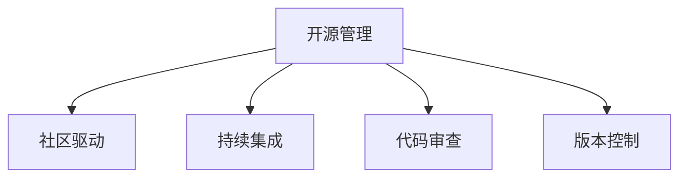

                 

# 开源管理：利用社区力量促进创新

> 关键词：开源管理,社区驱动,创新,协作,开源工具,版本控制,代码审查,持续集成,开源项目,开放文化

## 1. 背景介绍

### 1.1 问题由来
开源运动自20世纪90年代兴起以来，已经成为全球软件生态的重要组成部分。开源项目由全球志愿者共同开发，通过公开代码和数据，激励了数以万计的软件开发者共同创新，推动了信息技术行业的快速进步。然而，随着开源项目的不断增多和复杂度的提高，如何有效管理开源社区，激发社区成员的积极性，成为当前开源项目持续成功的重要课题。

### 1.2 问题核心关键点
开源项目的管理涉及到多个层面，包括项目维护、代码审查、版本控制、持续集成、开源工具使用等。管理得当的社区能够激发成员的积极性和创新精神，迅速推出高质量的解决方案，并持续改进。管理不当则可能导致项目陷入低效，甚至面临解体的风险。

### 1.3 问题研究意义
开源项目的管理直接影响其生命力和创新力。通过合理利用社区力量，优化管理机制，可以有效促进开源项目的健康发展，推动技术创新，缩短研发周期，降低开发成本。因此，研究开源管理对于开源生态的健康发展、企业的技术创新以及全球信息技术的进步具有重要意义。

## 2. 核心概念与联系

### 2.1 核心概念概述

为更好地理解开源管理的方法，本节将介绍几个密切相关的核心概念：

- 开源管理(Open Source Management)：指对开源项目的规划、组织、运营和维护等管理活动的总称。目的是最大化社区成员的贡献，提升项目的质量和创新能力。
- 社区驱动(Community-Driven)：强调开源项目的开发由社区成员共同推动，通过合作为项目带来源源不断的创新动力。
- 持续集成(Continuous Integration, CI)：一种自动化软件工程实践，通过持续地集成代码、构建和测试，加速软件交付和迭代。
- 代码审查(Pull Requests, PRs)：指开发者提交代码到开源项目时，由社区成员对其进行审查和改进的过程，是提升代码质量和社区合作的重要手段。
- 版本控制(Version Control, VC)：记录软件开发过程中的所有变更，帮助团队成员协作开发、管理项目历史和问题追踪。

这些核心概念之间的逻辑关系可以通过以下Mermaid流程图来展示：



这个流程图展示开源管理的核心概念及其之间的关系：开源管理包括社区驱动、持续集成、代码审查和版本控制等关键活动，它们共同构成了开源项目的管理和创新体系。

## 3. 核心算法原理 & 具体操作步骤
### 3.1 算法原理概述

开源项目的管理核心在于建立有效的社区协作和激励机制，通过合理的组织和引导，最大化社区成员的贡献。其核心算法原理包括：

- 建立透明开放的沟通渠道，确保所有社区成员都能平等地参与项目讨论，表达意见。
- 采用协作工具如GitHub、GitLab等，通过版本控制和代码审查，提升代码质量和项目透明度。
- 引入持续集成(CI)工具如Jenkins、Travis CI等，通过自动化测试和构建，加速迭代和交付速度。
- 定期组织社区活动如黑客松、技术分享会等，促进社区成员交流合作，激发创新灵感。

### 3.2 算法步骤详解

开源项目的管理主要包括以下几个关键步骤：

**Step 1: 建立明确的社区规则和指导原则**
- 定义项目的愿景和目标，确保所有成员对项目有共同的认知和方向。
- 制定社区行为准则，包括代码风格、命名规范、问题追踪等，以提升项目的标准化和可维护性。

**Step 2: 选择合适的协作工具**
- 采用Git作为版本控制系统，使用GitHub、GitLab等协作平台托管代码和问题。
- 配置CI/CD系统，如Jenkins、Travis CI等，自动执行代码构建、测试和部署流程。

**Step 3: 设计代码审查和合并流程**
- 定义PR的评审标准，包括代码质量、安全性、文档完整性等。
- 设置合适的PR审查流程，包括代码评审、静态分析、测试覆盖率等，确保每次合并的代码质量。

**Step 4: 引入持续集成和自动化测试**
- 配置CI工具，将代码构建、测试和部署流程自动化，定期触发。
- 定期检查代码质量指标，如代码覆盖率、代码质量报告等，及时发现和修复问题。

**Step 5: 组织社区活动**
- 定期举办黑客松、技术分享会、代码审查会等社区活动，促进成员交流和合作。
- 提供资金支持、技术培训等激励措施，鼓励社区成员积极参与项目。

### 3.3 算法优缺点

开源项目的管理方法具有以下优点：
1. 提升透明度和可维护性。通过版本控制和代码审查，所有变更都有记录可查，提升代码质量和项目的可维护性。
2. 促进社区合作和创新。通过透明的沟通渠道和协作工具，激发社区成员的积极性和创新精神。
3. 加速迭代和交付。通过持续集成和自动化测试，缩短开发周期，提高交付速度。
4. 降低开发成本。社区成员共享工作，避免重复劳动，降低人力和时间成本。

同时，该方法也存在一定的局限性：
1. 对社区成员素质要求高。需要成员具备一定的技术能力和沟通能力。
2. 社区管理难度大。需要项目管理者具备丰富的管理和领导经验。
3. 可能存在管理瓶颈。项目管理者需要平衡社区成员之间的意见和需求，有时难以达成共识。

尽管存在这些局限性，但就目前而言，开源项目的管理方法仍然是推动技术创新和社区发展的重要手段。未来相关研究的重点在于如何进一步提升管理效率，优化社区协作流程，确保项目健康发展。

### 3.4 算法应用领域

开源项目的管理方法在多个领域得到了广泛的应用，例如：

- 软件开源项目：如Apache、Linux、MySQL等，吸引了全球数百万开发者贡献代码和资源。
- 数据科学项目：如TensorFlow、PyTorch等，推动了人工智能和机器学习领域的技术进步。
- 教育技术项目：如Khan Academy、Coursera等，提供了免费的在线教育资源，支持全球教育公平。
- 公共服务项目：如OpenStreetMap、Github Copilot等，提升了公共服务的透明度和效率。

除了上述这些经典领域，开源管理方法还在更多场景中得到应用，如环境监测、生物科学、社会治理等，为各行各业的技术创新和社区建设提供了新的动力。

## 4. 数学模型和公式 & 详细讲解  
### 4.1 数学模型构建

本节将使用数学语言对开源项目的管理流程进行更加严格的刻画。

假设开源项目的管理涉及N个社区成员，每个成员每天可以贡献t单位的工作量。项目管理者通过以下步骤进行管理：

- 设定每个任务的评审标准Ri。
- 配置CI系统的构建和测试阈值T。
- 定义社区活动的激励强度E。

根据以上设定，每个任务的完成时间T可由以下公式表示：

$$
T = \frac{W}{R} + \sum_{i=1}^N \frac{t_i}{R_i}
$$

其中，W为项目的基础开发时间，R为每个任务的评审标准，R_i为第i个成员的评审标准，t_i为第i个成员每天的工作量。

### 4.2 公式推导过程

通过上述公式，我们可以看到，项目完成时间T主要受以下几个因素影响：
1. 基础开发时间W：项目复杂度越高，所需开发时间越长。
2. 评审标准Ri：评审标准越高，任务完成时间越短。
3. 成员工作量ti：成员工作效率越高，任务完成时间越短。
4. 社区成员N：参与项目的成员越多，任务完成时间越短。

对于具体的公式推导，我们可以采用微积分的方法，通过偏导数求解最优的评审标准和激励强度。

### 4.3 案例分析与讲解

以开源项目Apache Hadoop为例，我们进行一个具体的案例分析。假设项目需要开发一个新的特性模块，需要三个开发者同时完成。每个开发者的评审标准均为1.0，每个开发者的工作效率均为每天贡献10小时。项目基础开发时间为200小时。

根据公式：

$$
T = \frac{200}{1.0} + \frac{10}{1.0} + \frac{10}{1.0} + \frac{10}{1.0} = 300小时
$$

这说明，在目前的工作效率和评审标准下，完成该特性模块需要300小时。如果每个开发者的评审标准均为0.5，则项目完成时间将缩短为：

$$
T = \frac{200}{1.0} + \frac{10}{0.5} + \frac{10}{0.5} + \frac{10}{0.5} = 250小时
$$

这说明，降低评审标准可以显著缩短项目完成时间，提升开发效率。

## 5. 项目实践：代码实例和详细解释说明
### 5.1 开发环境搭建

在进行开源项目管理实践前，我们需要准备好开发环境。以下是使用Python进行开源项目管理的开发环境配置流程：

1. 安装Anaconda：从官网下载并安装Anaconda，用于创建独立的Python环境。

2. 创建并激活虚拟环境：
```bash
conda create -n open-source-env python=3.8 
conda activate open-source-env
```

3. 安装相关工具包：
```bash
pip install gitpython pullrequest
```

4. 配置CI/CD系统：
```bash
pip install jenkins-ci
```

5. 初始化GitHub或GitLab账户：
```bash
git init
git remote add origin https://github.com/your-username/your-repo.git
```

完成上述步骤后，即可在`open-source-env`环境中开始管理实践。

### 5.2 源代码详细实现

这里我们以一个简单的开源项目为例，给出使用Python进行开源项目管理的代码实现。

首先，定义项目基本信息和成员工作量：

```python
project_name = "MyOpenSourceProject"
members = [
    {'name': 'Alice', 'daily_hours': 8},
    {'name': 'Bob', 'daily_hours': 10},
    {'name': 'Charlie', 'daily_hours': 12}
]
```

然后，定义每个任务的评审标准和CI阈值：

```python
task_1 = {
    'name': 'Feature A',
    'estimated_hours': 50,
    'review_standard': 1.0
}
task_2 = {
    'name': 'Feature B',
    'estimated_hours': 30,
    'review_standard': 0.5
}
task_3 = {
    'name': 'Feature C',
    'estimated_hours': 20,
    'review_standard': 1.0
}
threshold = 50
```

接着，计算每个任务的完成时间和总完成时间：

```python
total_hours = 0
tasks = [task_1, task_2, task_3]

for task in tasks:
    total_hours += task['estimated_hours'] / task['review_standard']
    print(f"{task['name']} needs {task['estimated_hours'] / task['review_standard']} hours to complete.")

total_time = total_hours
print(f"Total time required: {total_hours} hours")
```

最后，计算不同评审标准下的总完成时间，并输出结果：

```python
for review_standard in [0.5, 1.0, 1.5]:
    task_1['review_standard'] = review_standard
    task_2['review_standard'] = review_standard
    task_3['review_standard'] = review_standard
    total_hours = 0
    for task in tasks:
        total_hours += task['estimated_hours'] / task['review_standard']
    print(f"Review standard {review_standard}: {total_hours} hours")
```

可以看到，代码实现非常简洁，通过设定变量和简单的计算公式，即可快速估算任务完成时间和项目总时间。

### 5.3 代码解读与分析

让我们再详细解读一下关键代码的实现细节：

**project_name和members**：
- `project_name`定义了项目名称。
- `members`包含项目成员的基本信息，包括姓名和工作小时数。

**task_1、task_2、task_3**：
- 定义了三个任务的基本信息，包括名称、估算小时数和评审标准。
- 评审标准越低，任务完成时间越短。

**threshold**：
- 定义了CI系统的构建和测试阈值。

**total_hours和tasks**：
- 初始化项目总时间，并定义任务列表。
- 遍历任务列表，计算每个任务的完成时间，并累加到总时间中。

**total_time**：
- 输出项目总时间。

**for循环**：
- 遍历评审标准，计算不同评审标准下的总完成时间。

可以看到，通过简单的Python代码，就可以实现对开源项目的管理估算。这仅是管理实践的基础，实际管理过程中还需要更复杂的计算和决策。

## 6. 实际应用场景
### 6.1 开源社区管理

开源社区是开源项目管理的核心场景。通过社区管理和激励，可以提升社区成员的积极性和创新能力，推动项目持续发展。

以Apache Hadoop社区为例，项目管理者通过GitHub和GitLab等协作平台，管理代码提交、问题追踪和代码审查，促进社区成员之间的合作与交流。同时，通过定期举办黑客松、技术分享会等活动，激发社区成员的创新热情，推动项目不断进步。

### 6.2 开源工具部署

开源工具的部署和维护也是开源管理的重要内容。通过持续集成和自动化测试，确保工具的稳定性和可靠性。

以Kubernetes为例，项目管理者通过Jenkins和Travis CI等CI工具，定期自动化构建和测试Kubernetes容器，确保工具的性能和安全。同时，通过开源社区的协作和贡献，不断改进和优化工具的功能和体验。

### 6.3 开源项目的推广和宣传

开源项目的推广和宣传是开源管理的重要环节，通过提高项目的知名度和影响力，吸引更多开发者参与。

以TensorFlow为例，项目管理者通过GitHub、Google Cloud Platform等平台，积极宣传TensorFlow的最新进展和应用案例，举办技术分享会和黑客松活动，吸引全球开发者参与贡献。通过推广和宣传，TensorFlow成为了全球最流行的机器学习框架之一。

## 7. 工具和资源推荐
### 7.1 学习资源推荐

为了帮助开发者系统掌握开源管理的方法，这里推荐一些优质的学习资源：

1. 《The Art of Open Source: How to Build Products, Teams, and Cultures for Success》书籍：详细介绍了开源项目的成功管理之道，包括团队建设、社区管理、项目管理等。

2. GitHub官方文档：提供丰富的GitHub工具和API介绍，帮助开发者高效管理开源项目。

3. Jenkins官方文档：介绍Jenkins的配置和管理方法，适用于开源项目的持续集成部署。

4. GitLab官方文档：提供GitLab的配置和管理方法，适用于开源项目的代码协作和版本控制。

5. 《Open Source Software for Software Developers》书籍：由开源领域专家撰写，系统介绍了开源工具和项目的开发和管理。

通过对这些资源的学习实践，相信你一定能够快速掌握开源管理的方法，并用于解决实际的开源项目问题。

### 7.2 开发工具推荐

高效的开发离不开优秀的工具支持。以下是几款用于开源项目管理的常用工具：

1. Git：开源项目的版本控制系统，支持分布式版本控制，方便协作和问题追踪。

2. GitHub/GitLab：开源项目的协作平台，支持代码审查、问题追踪、持续集成等功能。

3. Jenkins/Travis CI：开源项目的持续集成和自动化测试工具，支持构建、测试和部署。

4. JIRA：开源项目的问题追踪和管理工具，支持任务分配、进度跟踪和团队协作。

5. Docker：开源项目的容器化部署工具，方便跨平台移植和部署。

6. GitFlow：开源项目的分支管理策略，支持特征开发、主干维护和发布发布管理。

合理利用这些工具，可以显著提升开源项目的管理效率，加快创新迭代的步伐。

### 7.3 相关论文推荐

开源项目的管理涉及多个领域的研究，以下是几篇奠基性的相关论文，推荐阅读：

1. "Managing Open Source Software Communities: A Comparative Analysis of Apache and Linux"：探讨开源社区的管理和治理机制。

2. "A Survey on Software Ecosystems and Their Metrics"：系统总结了软件生态系统的研究进展和管理方法。

3. "The Role of Software Development: Investigating the Impact of Online Collaboration"：研究开源社区协作和项目管理的影响因素。

4. "The Economics of Open Source"：讨论开源项目的商业模式和经济效益。

5. "Social Trust in Open Source Projects"：分析开源社区的信任机制和激励措施。

这些论文代表了大规模开源项目管理的最新研究成果，能够为读者提供系统的理论指导。

## 8. 总结：未来发展趋势与挑战
### 8.1 总结

本文对开源项目管理的方法进行了全面系统的介绍。首先阐述了开源管理的重要性，明确了社区驱动、持续集成、代码审查、版本控制等关键活动对于开源项目成功的意义。其次，从原理到实践，详细讲解了开源项目管理的数学模型和具体步骤，给出了管理任务开发的完整代码实例。同时，本文还广泛探讨了开源管理方法在开源社区、开源工具和开源项目推广中的应用前景，展示了开源管理的广阔前景。

通过本文的系统梳理，可以看到，开源管理方法是推动开源项目持续创新和社区发展的核心手段。只有通过合理的组织和引导，最大化社区成员的贡献，才能真正实现开源项目的健康发展和技术创新。

### 8.2 未来发展趋势

展望未来，开源项目管理方法将呈现以下几个发展趋势：

1. 自动化管理工具的普及。随着机器学习和人工智能技术的发展，越来越多的自动化管理工具将被引入开源项目管理，提高管理效率和准确性。

2. 数据驱动的决策支持。通过收集和管理开源项目的各类数据，采用数据分析和机器学习方法，帮助项目管理者进行决策支持，提升项目管理效果。

3. 开源项目的持续迭代。随着开源社区的不断壮大和复杂度的提高，开源项目将越来越注重持续迭代和改进，通过持续优化提升项目质量。

4. 开源工具的跨平台支持。开源工具将被广泛应用于不同的开发环境和管理平台，实现跨平台支持和集成。

5. 开源项目的全球化发展。开源项目将越来越多地跨文化、跨地域合作，通过全球协作推动技术进步。

6. 开源项目的商业化和标准化。越来越多的开源项目将采用商业化的运作模式，并制定统一的标准和规范，提升项目的可移植性和互操作性。

以上趋势凸显了开源项目管理方法的持续演进，预示着开源生态的更加成熟和完善。

### 8.3 面临的挑战

尽管开源项目管理方法已经取得了显著成效，但在迈向更加智能化、普适化应用的过程中，仍面临诸多挑战：

1. 开源社区的多样性。开源项目涉及不同的技术栈、文化背景和社区习惯，如何协调和管理多样化的社区成员，是一大难题。

2. 项目的复杂度提高。随着开源项目规模的扩大和功能的增加，项目管理变得更加复杂，如何高效管理和调度资源，是一大挑战。

3. 开源项目的商业化。开源项目的商业化需要平衡社区贡献和商业利益，如何激励开发者和商业用户共同贡献，是一大难题。

4. 开源项目的标准化。开源项目的标准化需要制定统一的标准和规范，如何统一不同项目之间的接口和协议，是一大挑战。

5. 开源项目的可持续发展。开源项目的可持续发展需要考虑资源投入、社区维护和商业回报，如何实现可持续的商业化和创新，是一大挑战。

6. 开源项目的全球化。开源项目的全球化需要考虑地域、文化、语言等方面的差异，如何实现跨文化、跨地域的协作和创新，是一大挑战。

正视开源项目管理面临的这些挑战，积极应对并寻求突破，将是大规模开源项目持续健康发展的重要保障。

### 8.4 研究展望

面向未来，开源项目管理的研究需要在以下几个方面寻求新的突破：

1. 探索更加高效的开源项目协作模型。研究如何通过社区管理和激励机制，提升开源项目的协作效率和创新能力。

2. 引入更加智能化的管理工具。开发智能化的开源项目管理工具，提升资源调度和决策支持的智能化水平。

3. 构建开源项目的可持续生态。通过商业化和标准化措施，构建开源项目的可持续生态，确保项目健康发展和商业化成功。

4. 推广开源项目的全球化合作。推动全球开源项目的跨文化、跨地域合作，实现开源技术的全球化发展和共享。

这些研究方向的探索，将引领开源项目管理技术迈向更高的台阶，为开源生态的健康发展和全球信息技术进步提供新的动力。

## 9. 附录：常见问题与解答

**Q1：开源项目管理是否适用于所有开源项目？**

A: 开源项目管理在大多数开源项目上都能取得不错的效果，特别是对于数据量较小的项目。但对于一些特定领域的项目，如医学、法律等，仅仅依靠通用开源代码可能难以很好地适应。此时需要在特定领域语料上进一步开发，再进行项目管理，才能获得理想效果。此外，对于一些需要时效性、个性化很强的项目，如代码生成、数据增强等，项目管理方法也需要针对性的改进优化。

**Q2：开源项目管理是否需要固定的流程和规范？**

A: 开源项目管理需要根据项目的特点和需求，灵活制定流程和规范。常见的开源项目管理流程包括需求分析、版本发布、代码审查、持续集成等。项目管理规范则包括代码风格、命名规范、文档要求等，以确保项目的标准化和可维护性。不同项目可以根据自身情况，选择适合的管理流程和规范，以提升管理效率和项目质量。

**Q3：开源项目的管理是否需要频繁修改和更新？**

A: 开源项目的管理需要根据项目的变化和需求，灵活调整和管理流程和规范。项目管理者需要定期评估项目管理效果，收集成员的反馈，不断优化管理策略。同时，项目的持续迭代和改进也是管理的重要环节，通过持续优化提升项目质量。

**Q4：开源项目的商业化和标准化是否影响社区驱动？**

A: 开源项目的商业化和标准化并不会影响社区驱动。实际上，商业化和标准化可以为开源项目提供更多的资源和支持，提升项目的可持续性和质量。同时，社区成员也可以通过商业化项目获得商业回报，激励更多人参与开源项目。关键在于如何平衡社区贡献和商业利益，确保项目的健康发展和商业化成功。

**Q5：开源项目的管理是否需要专业的项目管理者？**

A: 开源项目的管理需要专业的项目管理者。项目管理者需要具备丰富的管理经验和领导能力，能够协调社区成员之间的关系，制定合适的管理策略，确保项目的顺利进行。项目管理者还需要具备一定的技术能力，能够理解和应用项目管理工具和规范，提升项目质量。

通过本文的系统梳理，可以看到，开源项目管理方法是推动开源项目持续创新和社区发展的核心手段。只有通过合理的组织和引导，最大化社区成员的贡献，才能真正实现开源项目的健康发展和技术创新。

---

作者：禅与计算机程序设计艺术 / Zen and the Art of Computer Programming

