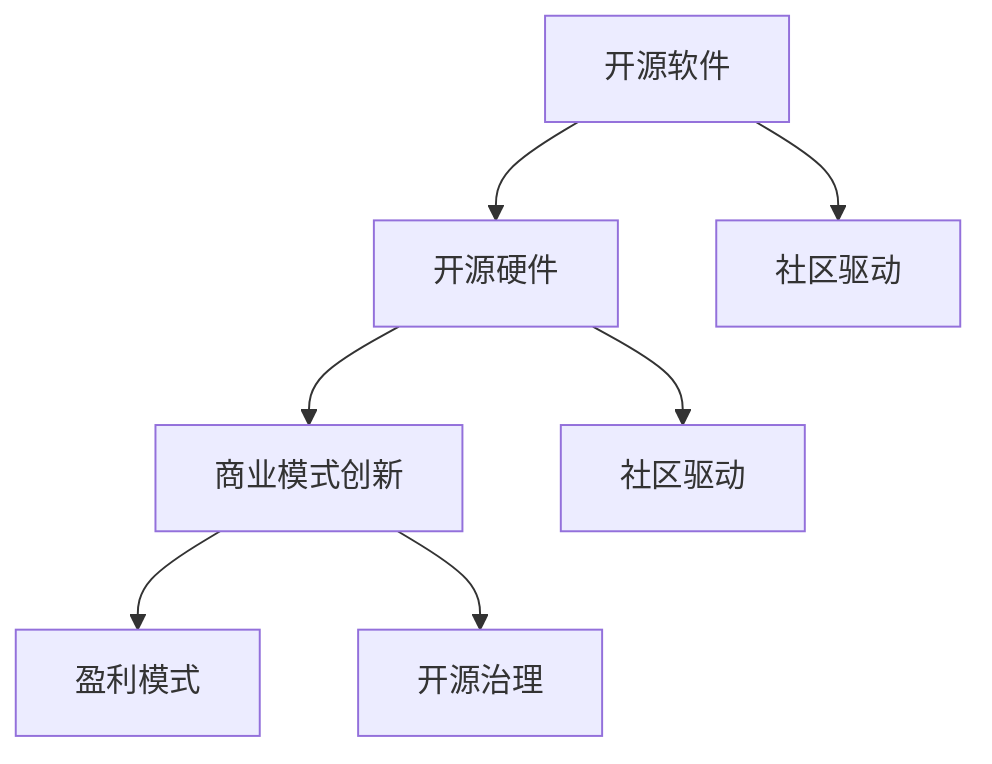

                 

# 开源运动的商业模式创新: 开源软件和开源硬件

> 关键词：开源软件, 开源硬件, 商业模式创新, 社区驱动, 盈利模式, 开源治理

## 1. 背景介绍

### 1.1 问题由来
开源运动自1990年代兴起以来，经历了数十年风雨历程，成为推动软件与硬件创新发展的强大动力。随着技术不断进步和应用场景的多样化，开源运动在商业模式、社区建设、企业合作等方面面临诸多挑战。特别是开源软件和开源硬件领域，如何平衡开放与盈利、技术创新与商业模式创新之间的关系，成为当前开源运动发展的核心议题。

### 1.2 问题核心关键点
开源运动的核心是开源社区的协同创新。然而，在技术迅速迭代和市场竞争激烈的环境下，开源项目如何通过合理的商业模式和盈利机制，吸引更多资源和人才参与，保持可持续发展，成为当下亟需解决的难点。

开源软件和开源硬件的商业模式创新，不仅涉及社区、企业和投资者等多方利益，还关系到开源项目能否在商业环境中茁壮成长，引领技术进步，满足用户需求。因此，深入探讨开源项目商业模式的创新路径，对于开源社区的长期健康发展和技术生态的良性循环具有重要意义。

### 1.3 问题研究意义
开源软件的商业模式创新，对于推动技术创新、降低开发成本、促进产业协作具有重要价值。开源硬件的商业模式创新，有助于加速产品迭代、提升用户体验、推动技术普及。

本文通过梳理开源项目、企业合作、社区治理等多个维度的商业模式创新案例，探讨开源运动在商业、技术、社区等方面的新路径，为开源社区和开发者提供有益的参考，帮助其在商业化过程中更好地平衡利益相关方的需求，实现可持续发展。

## 2. 核心概念与联系

### 2.1 核心概念概述

为更好地理解开源运动的商业模式创新，本节将介绍几个密切相关的核心概念：

- **开源软件**：指通过开源许可证发布的、源代码公开可自由获取的软件，如Linux、Apache等。开源软件通过共享代码、资源，促进协同创新，推动技术进步。

- **开源硬件**：指通过开源许可证发布的、硬件设计公开可自由获取的物理产品，如Arduino、Raspberry Pi等。开源硬件有助于普及技术、降低成本、激发创新。

- **商业模式创新**：指在遵循开源原则的基础上，通过合理配置资源、优化盈利方式，激发更多参与者参与，提升项目可持续性的过程。

- **社区驱动**：指依靠开发者社区的共同努力，推动项目发展，激发创新活力。社区驱动是开源运动的核心动力，有助于形成良性的技术生态。

- **盈利模式**：指开源项目通过合理途径获取收益，如赞助、捐赠、授权等，以支持项目开发和维护。

- **开源治理**：指通过透明、公平的规则和流程，确保开源项目的健康、有序发展，保护各方利益。

这些核心概念之间的逻辑关系可以通过以下Mermaid流程图来展示：



这个流程图展示开源软件和开源硬件的核心概念及其之间的关系：

1. 开源软件和开源硬件通过社区驱动获得持续创新。
2. 商业模式创新和开源治理保证了项目的健康发展。
3. 盈利模式为项目提供资金支持，保持项目长期运行。

## 3. 核心算法原理 & 具体操作步骤
### 3.1 算法原理概述

开源项目的商业模式创新，本质上是寻找开源与商业之间的平衡点。关键在于如何实现开源社区的可持续发展，同时确保项目盈利。该过程可以概括为以下几个步骤：

1. **开源与商业融合**：通过商业化手段，如赞助、合作开发、授权等，为开源项目提供资金支持。
2. **利益相关方协调**：平衡开发者、企业、用户等各方利益，建立公平透明的治理机制。
3. **市场化运作**：结合市场需求，进行产品迭代、服务优化，确保项目适应市场变化。
4. **商业化策略制定**：制定适合的盈利策略，如发布商业版、提供支持服务等，以获取收益。

### 3.2 算法步骤详解

开源项目商业模式创新的具体操作可分几个关键步骤进行：

**Step 1: 需求分析**
- 明确项目目标和商业目标，分析市场需求和竞争环境。
- 确定项目的开源特性和商业特性，平衡开放与盈利的关系。

**Step 2: 资源配置**
- 合理配置开源社区与商业团队的资源，明确分工。
- 引入商业合作伙伴，借助其资源和经验推动项目进展。

**Step 3: 商业策略制定**
- 选择合适的盈利模式，如开源授权、商业订阅、广告收入等。
- 制定详细的商业策略，包括定价策略、市场推广等。

**Step 4: 社区与用户互动**
- 通过开源社区进行产品迭代，吸纳开发者和用户反馈。
- 定期举行社区会议，加强与用户和合作伙伴的沟通。

**Step 5: 持续监控与优化**
- 定期评估商业模式的有效性，调整策略。
- 通过数据分析、用户反馈等方式，持续优化商业模式。

### 3.3 算法优缺点

开源项目的商业模式创新，具有以下优点：
1. 提高项目可持续性。通过商业化手段，为开源项目提供长期资金支持，确保项目的长期运行。
2. 增强社区活力。商业化过程中获得的资源和收益，可以更好地回馈社区，激发开发者和用户参与。
3. 提升市场竞争力。通过市场化运作，适应市场需求，提高产品的市场竞争力。
4. 降低开发成本。开源社区的协同创新，可以降低开发成本，提升资源利用率。

同时，该方法也存在一些局限性：
1. 平衡困难。开源与商业之间的平衡需要谨慎处理，不当的商业化可能导致社区分裂。
2. 利益冲突。商业合作伙伴与开源社区的利益可能存在冲突，需要协调平衡。
3. 风险高。商业化过程中的不确定因素多，项目可能面临市场、技术等多重风险。
4. 治理复杂。开源治理机制需要在开放与盈利之间找到合理的平衡点，涉及多个利益相关者。

尽管存在这些局限性，但就目前而言，开源项目的商业模式创新仍然是大规模技术协作和商业化过程中不可或缺的一环。未来相关研究的重点在于如何进一步优化商业模式的平衡点，提升社区参与度和项目可持续性。

### 3.4 算法应用领域

开源项目的商业模式创新，已经在开源软件和开源硬件领域得到了广泛应用，成为推动技术进步和产品迭代的重要手段：

- **开源软件**：Linux基金会、Apache基金会等开源组织，通过与商业公司合作，提供企业级支持和商业授权，成功推动了开源软件的商业化进程。
- **开源硬件**：Arduino、Raspberry Pi等开源硬件项目，通过硬件设计和开源授权，吸引了大量开发者和用户，形成了庞大的生态系统。

此外，开源项目的商业模式创新，还广泛应用于云计算、物联网、大数据等新兴领域，为技术生态的良性发展提供了有力支持。随着开源技术的不断演进，相信开源项目的商业模式创新将迎来更多创新机会和突破。

## 4. 数学模型和公式 & 详细讲解  
### 4.1 数学模型构建

本节将使用数学语言对开源项目的商业模式创新进行更加严格的刻画。

假设开源项目为 $P$，社区规模为 $C$，商业收入为 $R$，用户数为 $U$，开源社区和商业团队合作的效率为 $E$。定义项目的可持续性指标 $S$ 为：

$$
S = f(C, R, U, E)
$$

其中，$f$ 表示各项因素的综合作用函数。假设 $f$ 为线性函数，则：

$$
S = aC + bR + cU + dE
$$

### 4.2 公式推导过程

推导上述公式的过程如下：

1. **社区规模 $C$**：开源社区的规模直接影响项目的可持续性和技术创新能力。社区规模越大，项目的创新能力越强，资源也更加丰富。
2. **商业收入 $R$**：商业化手段为开源项目提供了稳定的资金支持，有助于项目的长期运行。
3. **用户数 $U$**：用户数反映了项目的市场接受度和影响力，对项目的发展和推广具有重要作用。
4. **合作效率 $E$**：开源社区与商业团队的协作效率决定了项目的商业化进程，直接影响项目的市场竞争力。

通过分析上述因素，可以建立开源项目的可持续性模型。进一步，假设社区和商业团队合作的效率 $E$ 为线性函数：

$$
E = kC + mR + nU
$$

代入 $S$ 的表达式中，得到：

$$
S = aC + bR + cU + kC + mR + nU
$$

化简后得到：

$$
S = (a+k)C + (b+m)R + (c+n)U
$$

这表明，开源项目的可持续性不仅取决于社区规模和商业收入，还受到用户数和协作效率的影响。

### 4.3 案例分析与讲解

以Linux基金会为例，分析其商业模式创新的具体实践：

- **需求分析**：Linux基金会通过市场调研，明确了开源操作系统和云服务市场的需求，确定了项目的目标和商业目标。
- **资源配置**：基金会引入了多家企业作为商业合作伙伴，提供了资金支持和人才资源。
- **商业策略制定**：通过企业级支持和商业授权，Linux基金会成功实现了商业化，获得了稳定的资金支持。
- **社区与用户互动**：基金会通过社区会议和用户反馈，不断推动项目迭代和优化，保持社区活力。
- **持续监控与优化**：基金会定期评估商业模式的有效性，根据市场变化调整策略，确保项目的长期运行。

通过这些步骤，Linux基金会实现了开源与商业的完美融合，推动了开源软件的商业化进程，成为开源领域的典范。

## 5. 项目实践：代码实例和详细解释说明
### 5.1 开发环境搭建

在进行商业模式创新实践前，我们需要准备好开发环境。以下是使用Python进行开源项目商业化开发的流程：

1. 安装Anaconda：从官网下载并安装Anaconda，用于创建独立的Python环境。

2. 创建并激活虚拟环境：
```bash
conda create -n open-source-env python=3.8 
conda activate open-source-env
```

3. 安装必要的开发工具：
```bash
pip install numpy pandas scikit-learn pandas matplotlib tqdm jupyter notebook ipython
```

4. 获取开源项目代码：
```bash
git clone https://github.com/example/open-source-project.git
cd open-source-project
```

完成上述步骤后，即可在`open-source-env`环境中开始商业模式创新实践。

### 5.2 源代码详细实现

这里以开源软件项目为例，给出使用Python和Jupyter Notebook进行开源项目商业模式创新的代码实现。

首先，定义商业模式的几个关键变量：

```python
from sympy import symbols, Eq, solve

# 定义符号变量
C, R, U, E = symbols('C R U E')
a, b, c, k, m, n = symbols('a b c k m n')

# 可持续性模型
S = a*C + b*R + c*U + E

# 合作效率模型
E = k*C + m*R + n*U

# 可持续性综合模型
S = S.subs(E, k*C + m*R + n*U)
```

然后，假设某个开源软件项目的商业收入和用户数如下：

```python
# 商业收入和用户数
R = 100000  # 年
U = 1000000  # 用户数

# 解可持续性模型
S_value = S.subs({C: 100000, R: 100000, U: 1000000})
S_value
```

最后，通过求解可持续性模型，可以评估项目的可持续性：

```python
# 求解可持续性模型
S_solve = solve(Eq(S_value, 0), (a, b, c))
S_solve
```

### 5.3 代码解读与分析

让我们再详细解读一下关键代码的实现细节：

- `symbols`函数定义了模型中的符号变量。
- `Eq`函数用于建立方程。
- `solve`函数用于求解方程。
- 通过`subs`函数将社区规模、商业收入和用户数代入可持续性模型。

在实际应用中，开源项目通过以上步骤，可以评估商业化过程中各个因素对项目可持续性的影响，优化资源配置和策略制定，确保项目的长期健康发展。

## 6. 实际应用场景

### 6.1 开源软件社区
开源软件社区的商业模式创新，已经在多个开源项目中得到了成功应用。以下介绍几个典型案例：

#### 案例1: Linux基金会
Linux基金会通过与多家企业合作，提供了企业级支持和商业授权，实现了项目的商业化。基金会通过定期的社区会议和用户反馈，推动项目迭代和优化，保持社区活力。通过这些措施，Linux基金会成功推动了开源软件的商业化进程，成为开源领域的典范。

#### 案例2: Apache Foundation
Apache基金会通过严格的开源治理和社区管理，确保项目的开放性和透明性。基金会通过项目网站、邮件列表等渠道，与开发者和用户保持密切沟通，及时回应需求和反馈。此外，基金会在商业化方面也进行了积极探索，通过提供商业支持和技术咨询，吸引更多资源和人才参与。

### 6.2 开源硬件生态
开源硬件生态的商业模式创新，也得到了广泛应用。以下介绍几个典型案例：

#### 案例1: Arduino
Arduino通过开源硬件设计和开源授权，吸引了大量开发者和用户。项目通过社区会议、开源软件包等形式，加强了与用户和合作伙伴的互动，推动了项目的快速迭代。Arduino还通过提供商业支持和技术培训，实现了商业化，形成了庞大的生态系统。

#### 案例2: Raspberry Pi
Raspberry Pi通过开源硬件设计和开源授权，推动了硬件设备和软件开发生态的共同发展。项目通过社区会议、开源软件包等形式，加强了与用户和合作伙伴的互动，推动了项目的快速迭代。Raspberry Pi还通过提供商业支持和技术培训，实现了商业化，形成了庞大的生态系统。

## 7. 工具和资源推荐
### 7.1 学习资源推荐

为了帮助开发者掌握开源项目商业化的理论和实践，这里推荐一些优质的学习资源：

1. **《开源项目管理和商业化》系列博文**：由开源社区专家撰写，详细介绍了开源项目管理和商业化的理论基础和实践技巧。

2. **CS880《开源软件工程》课程**：斯坦福大学开设的高级开源课程，涵盖了开源项目管理和商业化的经典案例。

3. **《开源商业化策略》书籍**：详细介绍了开源项目商业化的基本原则和策略，包括开源与商业的平衡点、社区驱动等。

4. **Apache基金会官方文档**：提供了Apache基金会的详细治理和商业化策略，是开源项目管理的必备资料。

5. **Linux基金会官方文档**：提供了Linux基金会的详细商业化实践和治理策略，是开源项目商业化的重要参考。

通过对这些资源的学习实践，相信你一定能够全面掌握开源项目商业化的理论和实践，为开源社区和项目管理者提供有益的参考。

### 7.2 开发工具推荐

高效的开发离不开优秀的工具支持。以下是几款用于开源项目商业化开发的常用工具：

1. GitHub：开源项目的代码托管和协作平台，提供了丰富的社区互动功能。

2. GitLab：开源项目的代码托管和协作平台，支持企业级管理和商业化需求。

3. Jenkins：开源持续集成工具，支持自动化构建和测试，提高开发效率。

4. Docker：开源容器化平台，支持应用部署和跨平台运行，增强了项目的灵活性和可移植性。

5. Kubernetes：开源容器编排平台，支持应用自动扩缩容和故障恢复，提高项目的可靠性和性能。

合理利用这些工具，可以显著提升开源项目商业化的开发效率，加快创新迭代的步伐。

### 7.3 相关论文推荐

开源项目的商业模式创新，一直是研究热点。以下是几篇奠基性的相关论文，推荐阅读：

1. **《开源商业化：现状、挑战与未来》**：总结了开源项目商业化的现状和挑战，提出了未来发展的方向。

2. **《开源与商业的平衡点》**：探讨了开源与商业之间的平衡点，提出了平衡二者的策略和实践。

3. **《开源社区的商业化之路》**：介绍了开源社区商业化的典型案例和成功经验，提供了有益的参考。

4. **《开源项目管理的最佳实践》**：总结了开源项目管理的基本原则和最佳实践，帮助项目管理者提高效率。

这些论文代表了大规模技术协作和商业化过程中商业模式创新的研究方向，通过学习这些前沿成果，可以帮助研究者把握学科前进方向，激发更多的创新灵感。

## 8. 总结：未来发展趋势与挑战

### 8.1 研究成果总结

本文对开源项目的商业模式创新进行了全面系统的介绍。首先阐述了开源运动的背景和意义，明确了商业化在开源项目中的核心地位。其次，从理论到实践，详细讲解了开源项目商业化的核心步骤和关键因素。同时，本文还探讨了开源软件和开源硬件领域的具体应用案例，展示了商业模式创新的实际效果。

通过本文的系统梳理，可以看到，开源项目的商业模式创新是开源社区和项目管理者在商业化过程中面临的重要议题。商业化不仅有助于项目的可持续运行，还能提升社区活力和项目影响力，推动技术进步和产业协作。未来，开源项目的商业模式创新需要更多创新思路和实践积累，才能更好地实现开源与商业的平衡，推动技术生态的良性发展。

### 8.2 未来发展趋势

展望未来，开源项目的商业模式创新将呈现以下几个发展趋势：

1. **生态系统的形成**：开源项目将与更多社区、企业、用户建立深度合作，形成更加完善的生态系统，共同推动技术进步。

2. **社区驱动的加强**：开源社区的活力和创新能力将进一步提升，社区驱动将成为开源项目发展的核心动力。

3. **商业化的多元化**：开源项目将探索更多元化的商业化途径，如开源授权、服务化、增值服务等，提升项目的市场竞争力。

4. **治理机制的优化**：开源项目将进一步优化治理机制，确保项目的开放性、透明性和公平性，保护各方利益。

5. **资源配置的精细化**：开源项目将更加注重资源配置的精细化管理，合理分配开源和商业资源，提升项目效率。

这些趋势凸显了开源项目商业化的广阔前景，为开源社区和项目管理者提供了新的思路和方向。相信随着开源项目的不断演进，开源商业化将迎来更多创新机会和突破。

### 8.3 面临的挑战

尽管开源项目的商业模式创新已经取得了显著成效，但在迈向更加智能化、普适化应用的过程中，仍然面临诸多挑战：

1. **利益冲突**：开源项目中不同利益相关者的需求和利益可能存在冲突，需要在开放与盈利之间找到平衡点。

2. **市场风险**：开源项目在商业化过程中，可能会面临市场变化、技术更新等多重风险，需要制定灵活的策略以应对。

3. **资源管理**：开源项目的资源管理需要更加精细化，如何合理配置开源和商业资源，优化项目管理，仍是重要课题。

4. **社区治理**：开源项目需要在开放与盈利之间找到合理的平衡点，确保项目的开放性和透明性。

5. **技术创新**：开源项目需要在保持商业化的同时，持续进行技术创新，提升项目的市场竞争力。

6. **可持续性**：开源项目需要在商业化的同时，保持项目的可持续性，确保项目的长期运行。

这些挑战凸显了开源项目商业化的复杂性和多样性，需要多方面共同努力才能克服。

### 8.4 研究展望

面向未来，开源项目的商业模式创新需要在以下几个方面寻求新的突破：

1. **社区驱动的强化**：进一步提升开源社区的活力和创新能力，形成更完善的生态系统。

2. **商业化的优化**：探索更多元化的商业化途径，提升项目的市场竞争力和盈利能力。

3. **治理机制的优化**：优化开源项目的治理机制，确保项目的开放性、透明性和公平性。

4. **技术创新的加速**：持续进行技术创新，提升开源项目的市场竞争力。

5. **可持续发展**：保持开源项目的可持续性，确保项目的长期运行。

这些研究方向的探索，必将引领开源项目的商业模式创新迈向更高的台阶，为开源社区和开发者提供更多的支持和机会。只有勇于创新、敢于突破，才能不断拓展开源项目的边界，推动技术生态的良性发展。

## 9. 附录：常见问题与解答

**Q1：开源项目如何平衡开源与商业化的关系？**

A: 开源项目需要在开放性与商业化之间找到合理的平衡点。具体措施包括：

1. **建立透明的治理机制**：确保开源项目的开放性和透明性。
2. **引入商业合作伙伴**：与企业合作，借助其资源和经验推动项目进展。
3. **优化资源配置**：合理配置开源和商业资源，提升项目效率。
4. **保持社区活力**：通过社区会议和用户反馈，保持社区活力。
5. **商业化策略制定**：制定适合的商业化策略，如开源授权、商业订阅等。

**Q2：开源项目如何进行商业化策略制定？**

A: 开源项目的商业化策略制定，需要考虑以下几个关键因素：

1. **市场需求**：分析市场对项目的需求，制定商业化策略。
2. **成本和收益**：评估商业化过程中的成本和收益，确保商业化策略的可行性。
3. **合作伙伴**：选择适合的商业合作伙伴，提供资金和技术支持。
4. **用户反馈**：通过用户反馈，优化商业化策略。

**Q3：开源项目如何确保商业化过程中项目的可持续性？**

A: 开源项目需要在商业化过程中，注意以下几个方面：

1. **资源配置**：合理配置开源和商业资源，提升项目效率。
2. **用户互动**：通过社区会议和用户反馈，保持社区活力。
3. **持续监控**：定期评估商业模式的有效性，调整策略。

**Q4：开源项目如何进行开源社区的治理？**

A: 开源社区的治理需要以下几个关键步骤：

1. **透明规则**：制定透明的规则和流程，确保项目的开放性和透明性。
2. **公平分配**：公平分配开源和商业资源，保护各方利益。
3. **社区参与**：通过社区会议和用户反馈，加强与用户和合作伙伴的互动。

**Q5：开源项目如何进行资源配置的精细化管理？**

A: 开源项目的资源配置精细化管理，需要以下几个关键措施：

1. **项目规划**：制定详细的项目规划，明确资源需求。
2. **成本控制**：合理控制商业化过程中的成本，提高资源利用率。
3. **效率提升**：优化开发流程，提升项目效率。

通过这些措施，开源项目可以在商业化的同时，保持项目的可持续性，确保项目的长期运行。

---

作者：禅与计算机程序设计艺术 / Zen and the Art of Computer Programming

