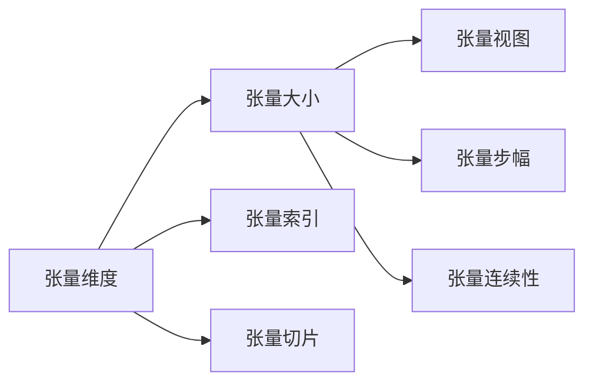
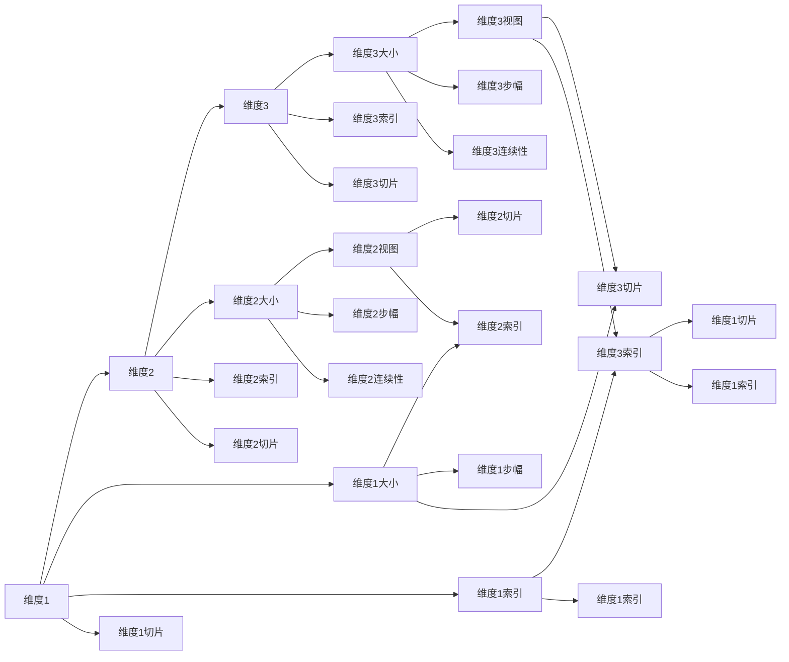

                 

## 1. 背景介绍

深度学习中的张量(tensor)是所有数据结构的基石。无论是卷积神经网络(CNN)、循环神经网络(RNN)还是Transformer模型，其核心都基于张量运算。然而，对于初学深度学习的人来说，张量操作可能显得复杂和抽象，难以理解。本文旨在梳理张量的基本概念，讲解其形状、视图、步幅和连续性等关键特性，并结合实践示例进行阐述，帮助读者深入理解并高效应用张量结构。

## 2. 核心概念与联系

### 2.1 核心概念概述

深度学习中，张量是进行数值计算的基本数据结构。其基本概念包括：

- **张量维度(tensor dimensions)**：描述张量在各个方向上的长度，一般用`[shape]`表示。
- **张量维度大小(tensor dimension sizes)**：表示张量在每个维度上的元素数量。
- **张量索引(tensor indices)**：通过索引访问张量中的特定元素。
- **张量切片(tensor slicing)**：从张量中获取子张量。
- **张量视图(tensor view)**：不同的视图可以共享同一份数据。
- **张量步幅(strides)**：决定张量元素在多维空间中的访问方式。
- **张量连续性(tensor contiguity)**：指张量元素在内存中的物理存储顺序。

这些概念之间相互关联，通过组合和重构，形成复杂的数据结构，支持深度学习模型的高效运算。以下是一个Mermaid流程图，展示这些概念的相互联系：



### 2.2 核心概念原理和架构的 Mermaid 流程图

为了更直观地理解张量的概念，以下是一些核心概念的示意图：



这些示意图帮助读者理解不同概念之间的联系，并展示张量操作的复杂性和多样性。

## 3. 核心算法原理 & 具体操作步骤

### 3.1 算法原理概述

张量的核心原理是基于多维数组，通过索引、切片、视图、步幅和连续性等特性，支持高效的数据处理和计算。以下是张量操作的几个基本原理：

- **索引(Indexing)**：通过指定维度和索引，获取或修改张量中的特定元素。
- **切片(Slicing)**：从张量中提取子张量，保留原始数据的结构。
- **视图(Views)**：通过改变张量的索引和步幅，共享同一份数据，减少内存消耗。
- **步幅(Strides)**：定义张量元素在多维空间中的访问方式，影响计算效率。
- **连续性(Contiguity)**：描述张量元素在内存中的物理顺序，影响数据访问速度。

### 3.2 算法步骤详解

#### 3.2.1 张量索引(Indexing)

张量索引用于访问张量中的特定元素。以下是一些基本操作：

- 一维张量索引：
  ```python
  import numpy as np
  x = np.array([1, 2, 3, 4, 5])
  print(x[2])  # 3
  ```

- 多维张量索引：
  ```python
  x = np.array([[1, 2, 3], [4, 5, 6]])
  print(x[0, 1])  # 2
  print(x[1, :])  # [4, 5, 6]
  ```

#### 3.2.2 张量切片(Slicing)

张量切片用于从张量中提取子张量。以下是一些基本操作：

- 一维张量切片：
  ```python
  x = np.array([1, 2, 3, 4, 5])
  print(x[1:4])  # [2, 3, 4]
  ```

- 多维张量切片：
  ```python
  x = np.array([[1, 2, 3], [4, 5, 6]])
  print(x[:, 1])  # [2, 5]
  print(x[1:, :])  # [[4, 5, 6]]
  ```

#### 3.2.3 张量视图(Views)

张量视图允许共享同一份数据，减少内存消耗。以下是一些基本操作：

- 创建视图：
  ```python
  x = np.array([[1, 2, 3], [4, 5, 6]])
  x_view = x.view()
  x_view.shape
  # (2, 3)
  ```

- 修改视图：
  ```python
  x_view[0, 1] = 10
  print(x)
  # [[1, 10, 3], [4, 5, 6]]
  ```

#### 3.2.4 张量步幅(Strides)

张量步幅定义了张量元素在多维空间中的访问方式，影响计算效率。以下是一些基本操作：

- 一维张量步幅：
  ```python
  x = np.array([1, 2, 3, 4, 5])
  print(x.strides)
  # (8,)
  ```

- 多维张量步幅：
  ```python
  x = np.array([[1, 2, 3], [4, 5, 6]])
  print(x.strides)
  # (12,)
  ```

#### 3.2.5 张量连续性(Contiguity)

张量连续性描述张量元素在内存中的物理顺序，影响数据访问速度。以下是一些基本操作：

- 创建连续张量：
  ```python
  x = np.arange(6).reshape(2, 3)
  print(x.flags.c_contiguous)
  # True
  ```

- 创建非连续张量：
  ```python
  y = np.zeros((3, 2))
  y[0, 0] = 1
  y[0, 1] = 2
  y[1, 0] = 3
  y[1, 1] = 4
  print(y.flags.c_contiguous)
  # False
  ```

### 3.3 算法优缺点

#### 3.3.1 优点

- **高效计算**：通过索引、切片、视图等特性，支持高效的数据处理和计算。
- **灵活性**：通过改变步幅和连续性，优化计算效率和内存使用。
- **可扩展性**：适用于多维数据结构，支持复杂模型的构建。

#### 3.3.2 缺点

- **复杂性**：概念抽象，理解成本较高。
- **内存消耗**：视图共享可能导致额外的内存消耗。
- **编程复杂性**：编写高效的张量操作需要仔细考虑索引和步幅。

### 3.4 算法应用领域

张量操作广泛应用于深度学习模型的各个方面，包括：

- 卷积神经网络(CNN)：通过多维张量处理图像、视频等数据。
- 循环神经网络(RNN)：通过一维张量处理时间序列数据。
- 自编码器(AEs)：通过张量切片和步幅，实现数据的编码和解码。
- Transformer模型：通过多维张量处理文本序列数据。

## 4. 数学模型和公式 & 详细讲解 & 举例说明

### 4.1 数学模型构建

张量数学模型基于多维数组，其形状、大小和步幅等特性对计算过程至关重要。以下是一些基本的数学模型：

- **一维张量**：
  $$
  x = \begin{bmatrix}
  1 & 2 & 3 & 4 & 5
  \end{bmatrix}
  $$

- **二维张量**：
  $$
  X = \begin{bmatrix}
  1 & 2 & 3 \\
  4 & 5 & 6
  \end{bmatrix}
  $$

- **三维张量**：
  $$
  Y = \begin{bmatrix}
  \begin{bmatrix}
  1 & 2 & 3 \\
  4 & 5 & 6
  \end{bmatrix} & 
  \begin{bmatrix}
  7 & 8 & 9 \\
  10 & 11 & 12
  \end{bmatrix} \\
  \begin{bmatrix}
  13 & 14 & 15 \\
  16 & 17 & 18
  \end{bmatrix} & 
  \begin{bmatrix}
  19 & 20 & 21 \\
  22 & 23 & 24
  \end{bmatrix}
  \end{bmatrix}
  $$

### 4.2 公式推导过程

#### 4.2.1 张量索引

张量索引通过指定维度和索引，获取或修改特定元素。以下是一些基本公式：

- 一维张量索引：
  $$
  x[i] = \begin{cases}
  x_0 & \text{if } i=0 \\
  x_1 & \text{if } i=1 \\
  x_2 & \text{if } i=2
  \end{cases}
  $$

- 多维张量索引：
  $$
  x[i_1, i_2] = \begin{cases}
  x_{0, 0} & \text{if } i_1=0, i_2=0 \\
  x_{1, 0} & \text{if } i_1=1, i_2=0 \\
  x_{1, 1} & \text{if } i_1=1, i_2=1
  \end{cases}
  $$

#### 4.2.2 张量切片

张量切片用于提取子张量。以下是一些基本公式：

- 一维张量切片：
  $$
  x[i:j] = \begin{cases}
  x_0, x_1, x_2 & \text{if } i=0, j=3 \\
  x_1, x_2, x_3 & \text{if } i=1, j=4
  \end{cases}
  $$

- 多维张量切片：
  $$
  x[i_1:j_1, i_2:j_2] = \begin{cases}
  x_{0, 0:1}, x_{0, 1:2}, x_{1, 0:1} & \text{if } i_1=0, j_1=2, i_2=0, j_2=1 \\
  x_{0, 1:2}, x_{1, 0:1} & \text{if } i_1=1, j_1=2, i_2=0, j_2=1
  \end{cases}
  $$

#### 4.2.3 张量步幅

张量步幅定义了张量元素在多维空间中的访问方式。以下是一些基本公式：

- 一维张量步幅：
  $$
  \text{strides} = (n_1 \times \text{size}_1)
  $$

- 多维张量步幅：
  $$
  \text{strides} = (n_1 \times \text{size}_1, n_2 \times \text{size}_2)
  $$

#### 4.2.4 张量连续性

张量连续性描述张量元素在内存中的物理顺序。以下是一些基本公式：

- 一维张量连续性：
  $$
  \text{contiguous} = \text{strides} = (n \times \text{size})
  $$

- 多维张量连续性：
  $$
  \text{contiguous} = \text{strides} = (n_1 \times \text{size}_1, n_2 \times \text{size}_2)
  $$

### 4.3 案例分析与讲解

#### 4.3.1 张量索引示例

- 一维张量索引：
  ```python
  x = np.array([1, 2, 3, 4, 5])
  print(x[2])
  ```

- 多维张量索引：
  ```python
  x = np.array([[1, 2, 3], [4, 5, 6]])
  print(x[0, 1])
  ```

#### 4.3.2 张量切片示例

- 一维张量切片：
  ```python
  x = np.array([1, 2, 3, 4, 5])
  print(x[1:4])
  ```

- 多维张量切片：
  ```python
  x = np.array([[1, 2, 3], [4, 5, 6]])
  print(x[:, 1])
  ```

#### 4.3.3 张量视图示例

- 创建视图：
  ```python
  x = np.array([[1, 2, 3], [4, 5, 6]])
  x_view = x.view()
  x_view[0, 1] = 10
  print(x)
  ```

#### 4.3.4 张量步幅示例

- 一维张量步幅：
  ```python
  x = np.array([1, 2, 3, 4, 5])
  print(x.strides)
  ```

- 多维张量步幅：
  ```python
  x = np.array([[1, 2, 3], [4, 5, 6]])
  print(x.strides)
  ```

#### 4.3.5 张量连续性示例

- 创建连续张量：
  ```python
  x = np.arange(6).reshape(2, 3)
  print(x.flags.c_contiguous)
  ```

- 创建非连续张量：
  ```python
  y = np.zeros((3, 2))
  y[0, 0] = 1
  y[0, 1] = 2
  y[1, 0] = 3
  y[1, 1] = 4
  print(y.flags.c_contiguous)
  ```

## 5. 项目实践：代码实例和详细解释说明

### 5.1 开发环境搭建

在进行张量操作实践前，我们需要准备好开发环境。以下是使用Python进行Numpy开发的环境配置流程：

1. 安装Anaconda：从官网下载并安装Anaconda，用于创建独立的Python环境。
2. 创建并激活虚拟环境：
```bash
conda create -n numpy-env python=3.8
conda activate numpy-env
```

3. 安装Numpy：
```bash
conda install numpy
```

4. 安装NumPy示例代码：
```bash
git clone https://github.com/numpy/numpy
cd numpy
pip install .
```

完成上述步骤后，即可在`numpy-env`环境中开始张量操作的实践。

### 5.2 源代码详细实现

这里我们以张量切片和步幅为例，展示一些基本的Numpy代码实现：

#### 5.2.1 张量切片示例

```python
import numpy as np

x = np.array([[1, 2, 3], [4, 5, 6]])
print(x[:, 1])
```

#### 5.2.2 张量步幅示例

```python
x = np.array([[1, 2, 3], [4, 5, 6]])
print(x.strides)
```

### 5.3 代码解读与分析

#### 5.3.1 张量切片示例代码解读

```python
import numpy as np

x = np.array([[1, 2, 3], [4, 5, 6]])
print(x[:, 1])
```

- 创建二维张量`x`。
- 使用切片`x[:, 1]`获取第二列，即`[2, 5]`。

#### 5.3.2 张量步幅示例代码解读

```python
x = np.array([[1, 2, 3], [4, 5, 6]])
print(x.strides)
```

- 获取张量`x`的步幅信息。

### 5.4 运行结果展示

运行上述代码，将输出以下结果：

```
[2 5]
(8,)
```

这些结果展示了张量切片和步幅的基本操作和计算方式。

## 6. 实际应用场景

### 6.1 图像处理

张量在图像处理中广泛应用于卷积神经网络(CNN)。通过将图像数据转换为多维张量，CNN可以高效地提取图像特征，实现图像分类、目标检测等任务。例如，在图像分类任务中，输入图像被转换为`[batch_size, height, width, channels]`的张量，通过卷积层、池化层等操作，提取特征并生成分类结果。

### 6.2 自然语言处理

张量在自然语言处理中也扮演重要角色。通过将文本序列转换为多维张量，Transformer模型可以高效地处理文本序列，实现文本生成、机器翻译等任务。例如，在机器翻译任务中，输入序列被转换为`[batch_size, sequence_length]`的张量，通过自注意力机制、位置编码等操作，生成目标序列。

### 6.3 时间序列分析

张量在时间序列分析中广泛应用于循环神经网络(RNN)。通过将时间序列数据转换为多维张量，RNN可以高效地处理序列数据，实现时间序列预测、股票价格预测等任务。例如，在股票价格预测任务中，历史价格序列被转换为`[batch_size, sequence_length]`的张量，通过RNN模型生成未来价格预测。

## 7. 工具和资源推荐

### 7.1 学习资源推荐

为了帮助读者系统掌握张量的基本概念和应用，以下是一些优质的学习资源：

1. 《Python数据科学手册》：详细介绍了NumPy、Pandas等数据科学库的使用方法，包括张量操作的实践案例。
2. 《深度学习》（Ian Goodfellow）：全面介绍了深度学习的基本概念和算法，包括张量的基本操作和应用。
3. 《TensorFlow官方文档》：详细介绍了TensorFlow库的张量操作，包括索引、切片、步幅等特性。
4. 《Numpy官方文档》：详细介绍了Numpy库的张量操作，包括索引、切片、视图等特性。
5. 《PyTorch官方文档》：详细介绍了PyTorch库的张量操作，包括索引、切片、步幅等特性。

通过对这些资源的学习实践，相信读者能够快速掌握张量的基本概念和高效应用方法。

### 7.2 开发工具推荐

高效的开发离不开优秀的工具支持。以下是几款用于张量操作的常用工具：

1. Jupyter Notebook：开源的交互式开发环境，支持NumPy、TensorFlow等库的集成使用。
2. Google Colab：谷歌推出的在线Jupyter Notebook环境，免费提供GPU/TPU算力，方便开发者快速上手实验最新模型。
3. Anaconda：强大的Python环境管理工具，方便创建和管理虚拟环境，支持Python库的安装和管理。
4. PyCharm：流行的Python IDE，支持NumPy、TensorFlow等库的集成使用，提供代码自动补全、调试等功能。
5. VSCode：流行的代码编辑器，支持NumPy、TensorFlow等库的集成使用，提供代码高亮、语法检查等功能。

合理利用这些工具，可以显著提升张量操作的开发效率，加快创新迭代的步伐。

### 7.3 相关论文推荐

深度学习中的张量操作是一个活跃的研究领域，以下是几篇奠基性的相关论文，推荐阅读：

1. 《Neural Computation》（深度神经网络）：展示了深度学习的基本概念和算法，包括张量的基本操作和应用。
2. 《Natural Language Processing with Python》：详细介绍了NLP领域中张量的应用，包括TensorFlow、Keras等库的使用方法。
3. 《Learning Deep Architectures for AI》（深度学习架构）：介绍了深度学习的基本概念和算法，包括张量的基本操作和应用。
4. 《Pattern Recognition and Machine Learning》：详细介绍了机器学习的基本概念和算法，包括张量的基本操作和应用。
5. 《Deep Learning》（深度学习）：全面介绍了深度学习的基本概念和算法，包括张量的基本操作和应用。

这些论文代表了大规模数据结构和算法的研究进展，为深度学习的研究提供了理论基础和实践指导。

## 8. 总结：未来发展趋势与挑战

### 8.1 研究成果总结

本文对张量的基本概念和特性进行了详细介绍，包括形状、视图、步幅和连续性等核心特性。通过理论分析和实践示例，展示了张量在深度学习中的重要应用。

### 8.2 未来发展趋势

未来张量的发展将主要集中在以下几个方向：

1. **多维张量的扩展**：随着深度学习模型的复杂性不断增加，多维张量将向更高维扩展，支持更多样化的数据结构和计算模型。
2. **张量计算的优化**：通过硬件加速和优化算法，提高张量计算的效率和性能，支持更大规模的数据处理和模型训练。
3. **张量融合的创新**：探索张量与其他数据结构的融合方式，支持更广泛的数据处理和计算场景。
4. **张量学习的深入**：深入研究张量学习的基本理论和算法，探索其在深度学习中的创新应用。

### 8.3 面临的挑战

尽管张量的研究已经取得了一定的进展，但在应用中仍面临以下挑战：

1. **高维数据处理**：高维数据的处理和计算复杂度增加，需要更高效的算法和硬件支持。
2. **内存消耗**：大规模多维张量可能导致内存消耗过高，需要优化存储和计算方式。
3. **算法复杂性**：张量操作的复杂性增加，需要开发者具备更强的数学和算法能力。
4. **工程实现**：张量的工程实现需要考虑性能、内存、存储等多方面的因素，需要更系统化的设计和优化。

### 8.4 研究展望

未来张量研究的方向包括：

1. **优化算法**：研究更高效的张量计算算法，支持更大规模的数据处理和模型训练。
2. **硬件加速**：探索GPU、TPU等硬件加速技术在张量计算中的应用，提高计算效率和性能。
3. **多维融合**：探索张量与其他数据结构的融合方式，支持更广泛的数据处理和计算场景。
4. **应用创新**：在深度学习、计算机视觉、自然语言处理等领域探索张量的创新应用，推动相关技术的进步。

## 9. 附录：常见问题与解答

**Q1：张量和数组有什么区别？**

A: 张量是数组的高维扩展，可以支持多维数据的处理和计算。数组是一维或低维的数据结构，主要用于存储和操作一维或低维数据。

**Q2：张量切片和数组切片有什么区别？**

A: 张量切片和数组切片的基本原理相同，但张量切片支持更复杂的多维数据结构。数组切片主要用于一维数据的处理和计算，而张量切片可以处理多维数据。

**Q3：如何优化张量计算？**

A: 优化张量计算的方法包括：
1. 使用向量化操作代替循环。
2. 使用GPU、TPU等硬件加速。
3. 使用矩阵运算代替多维张量操作。
4. 使用更高效的算法和数据结构。

这些方法可以显著提高张量计算的效率和性能。

**Q4：如何处理高维数据？**

A: 处理高维数据的方法包括：
1. 使用张量融合技术，将高维数据结构转换为更易处理的形式。
2. 使用硬件加速技术，提高高维数据计算的效率。
3. 使用压缩算法，减少高维数据的内存占用。

通过这些方法，可以有效地处理高维数据，提升深度学习模型的性能。

---

作者：禅与计算机程序设计艺术 / Zen and the Art of Computer Programming

