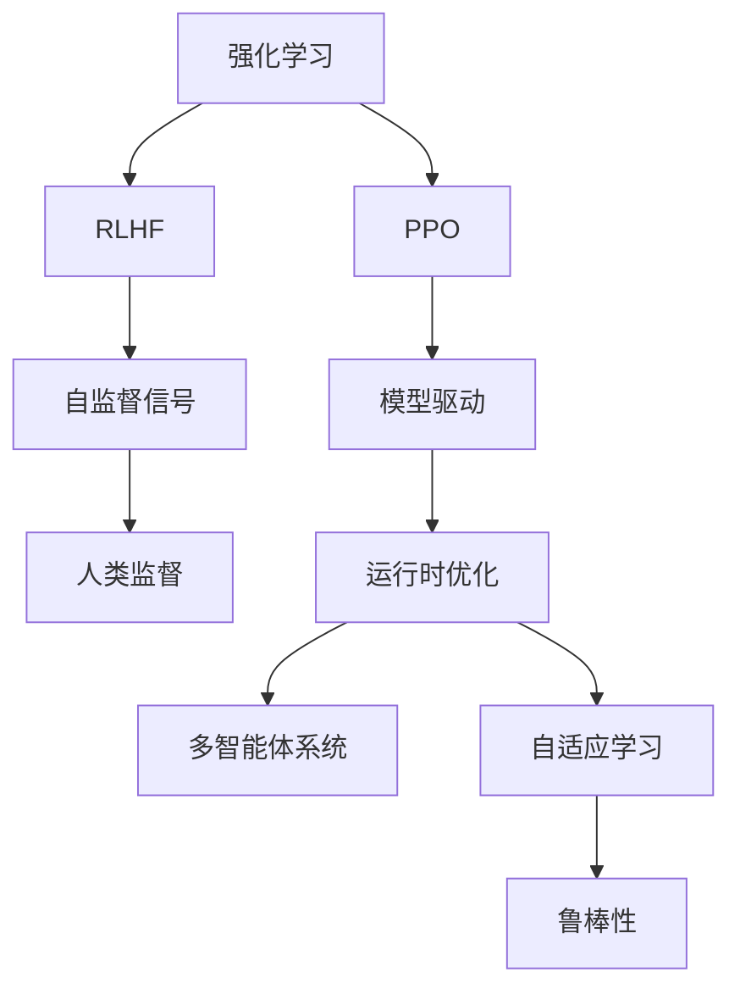

                 

# 强化学习在AI中的应用：RLHF与PPO

> 关键词：强化学习, 自监督, 模型驱动, 自适应, 多智能体, 运行时优化, 系统决策, 鲁棒性

## 1. 背景介绍

### 1.1 问题由来
强化学习（Reinforcement Learning, RL）作为AI领域的重要分支，通过智能体（agent）与环境的交互学习来求解复杂决策问题。近年来，RL技术在自监督学习、模型驱动学习、多智能体系统等领域得到了广泛应用。

RLHF和PPO是其中两种经典且高效的方法，分别代表自监督与模型驱动的强化学习框架，并各自在多个应用场景中取得了显著成果。RLHF侧重于利用自监督信号驱动学习过程，具有较强的适应性和泛化能力；PPO则通过模型驱动的方法实现高效的运行时优化，具有较高的计算效率和稳定性。

### 1.2 问题核心关键点
本文将详细介绍RLHF与PPO的基本原理和实际应用，对比其优缺点，并展望未来在AI领域的发展趋势与面临的挑战。

## 2. 核心概念与联系

### 2.1 核心概念概述

为更好地理解RLHF与PPO，本节将介绍几个密切相关的核心概念：

- **强化学习**（Reinforcement Learning, RL）：一种通过智能体与环境交互学习来求解复杂决策问题的机器学习方法，智能体根据环境反馈调整行为策略，以达到最大化长期奖励的目标。

- **RLHF**（Reinforcement Learning with Humans in the Loop）：一种结合人类监督信号的自监督强化学习框架，通过利用人类标注信息，加速智能体的学习过程，并在实际应用中实现更高效的决策。

- **PPO**（Proximal Policy Optimization）：一种高效的强化学习算法，通过模型驱动的方法实现高效的运行时优化，具有较高的计算效率和稳定性，适用于大规模分布式系统。

- **模型驱动学习**（Model-driven Learning）：利用先验模型来指导学习过程，减少未知性，提高决策质量和效率。

- **自监督学习**（Self-supervised Learning）：通过利用数据本身的结构进行学习，减少对标注数据的依赖，适用于数据标注成本较高或数据样本稀缺的场景。

- **多智能体系统**（Multi-agent Systems）：由多个智能体在多个任务空间内协同工作，实现更复杂、更智能的系统决策。

- **运行时优化**（Runtime Optimization）：在运行时动态调整模型参数和决策策略，优化系统性能，提高稳定性。

- **自适应学习**（Adaptive Learning）：根据环境变化和学习进度自动调整学习策略，提高学习效率和泛化能力。

- **鲁棒性**（Robustness）：模型在不同数据分布和干扰条件下，仍能保持稳定性能的能力。

这些核心概念之间的逻辑关系可以通过以下Mermaid流程图来展示：



这个流程图展示了他强化学习、RLHF与PPO的核心概念及其之间的关系：

1. 强化学习是RLHF与PPO的基础，通过智能体与环境交互进行学习。
2. RLHF结合人类监督信号，加速智能体的学习过程，实现更高效的决策。
3. PPO通过模型驱动的方法，实现高效的运行时优化，提高计算效率和稳定性。
4. 自监督信号和模型驱动是RLHF与PPO的重要组成部分，分别利用数据结构进行学习，并指导学习过程。
5. 多智能体系统、自适应学习和鲁棒性是模型驱动学习的重要特性，分别在协同工作、动态调整和稳定性上发挥作用。

这些概念共同构成了强化学习与模型驱动学习的基本框架，为RLHF与PPO的实际应用提供了理论基础。

## 3. 核心算法原理 & 具体操作步骤
### 3.1 算法原理概述

RLHF与PPO算法分别代表了自监督与模型驱动的强化学习范式。下面将详细介绍其算法原理和具体操作步骤。

#### 3.1.1 RLHF算法原理

RLHF算法通过结合人类监督信号与自监督信号，加速智能体的学习过程。其基本思想是利用人类标注信息，在每个时间步对智能体的行为进行监督，同时利用环境自身的信号进行自监督学习。

假设智能体在时间步$t$的状态为$s_t$，行为为$a_t$，环境奖励为$r_t$，状态转移为$s_{t+1}$。智能体的目标是通过最大化长期奖励$R$来达到最优决策。

- **监督信号**：在每个时间步$t$，智能体接收到人类监督信号$h_t$，该信号可以看作是对智能体当前行为的评估和指导。
- **自监督信号**：智能体利用环境自身的信号，如状态转移概率、奖励分布等，进行自监督学习。

RLHF算法的核心是定义一个损失函数$L$，通过最大化$L$来优化智能体的策略$\pi$：

$$
L(\pi) = \mathbb{E}_{t \sim \tau} \left[ \sum_{i=1}^n \left[ -\log \pi(a_i|s_i) + h_i \cdot r_i \right] \right]
$$

其中，$\tau$为智能体在环境中的轨迹，$n$为轨迹长度，$h_i$为时间步$i$的人类监督信号。

通过最大化$L(\pi)$，智能体可以同时从监督信号和自监督信号中学习，实现更高效的决策。

#### 3.1.2 PPO算法原理

PPO算法通过模型驱动的方法，实现高效的运行时优化。其基本思想是利用模型来预测智能体的行为和价值函数，并通过优化这些预测结果来调整智能体的策略。

假设智能体在时间步$t$的状态为$s_t$，行为为$a_t$，环境奖励为$r_t$，状态转移为$s_{t+1}$。智能体的目标是通过最大化长期奖励$R$来达到最优决策。

- **策略网络**：使用策略网络$Q(s_t|a_t)$来预测智能体在给定状态下选择动作$a_t$的概率。
- **价值网络**：使用价值网络$V(s_t)$来预测智能体在给定状态$s_t$的价值$V(s_t)$。

PPO算法的核心是定义一个损失函数$J$，通过最大化$J$来优化智能体的策略$\pi$：

$$
J(\pi) = \mathbb{E}_{t \sim \tau} \left[ \frac{1}{n} \sum_{i=1}^n \left[ \log \pi(a_i|s_i) \frac{r_i}{\pi(a_i|s_i)} - \min \left( \log \pi(a_i|s_i),\text{clip}(1 - \epsilon, \frac{1}{\pi(a_i|s_i)}) \right) \right] \right]
$$

其中，$\epsilon$为剪枝参数，用于限制策略网络的输出概率。通过最大化$J(\pi)$，智能体可以高效地优化策略，同时在运行时动态调整参数，提高系统性能。

### 3.2 算法步骤详解

#### 3.2.1 RLHF算法步骤

1. **数据收集**：收集智能体在环境中的轨迹$\tau$，并记录每个时间步的人类监督信号$h_t$。
2. **策略更新**：使用监督信号和自监督信号更新智能体的策略$\pi$。
3. **自监督学习**：利用环境自身的信号进行自监督学习，优化策略网络。
4. **模型预测**：使用策略网络$Q(s_t|a_t)$和价值网络$V(s_t)$预测智能体在给定状态和动作下的概率和价值。
5. **行为选择**：根据策略网络$Q(s_t|a_t)$和价值网络$V(s_t)$的预测结果，选择智能体的行为$a_t$。

#### 3.2.2 PPO算法步骤

1. **数据收集**：收集智能体在环境中的轨迹$\tau$，并记录每个时间步的状态$s_t$、行为$a_t$和环境奖励$r_t$。
2. **策略更新**：使用策略网络$Q(s_t|a_t)$和价值网络$V(s_t)$更新智能体的策略$\pi$。
3. **模型预测**：使用策略网络$Q(s_t|a_t)$和价值网络$V(s_t)$预测智能体在给定状态和动作下的概率和价值。
4. **行为选择**：根据策略网络$Q(s_t|a_t)$和价值网络$V(s_t)$的预测结果，选择智能体的行为$a_t$。
5. **运行时优化**：在运行时动态调整策略网络和价值网络的参数，提高系统性能。

### 3.3 算法优缺点

RLHF与PPO算法分别具有不同的优点和缺点：

#### 3.3.1 RLHF算法优缺点

- **优点**：
  - 结合人类监督信号，加速智能体的学习过程，实现更高效的决策。
  - 能够利用自监督信号，减少对标注数据的依赖。
  - 具有较强的泛化能力和适应性。

- **缺点**：
  - 需要收集和处理大量的人类监督信号，增加了算法复杂度和计算成本。
  - 难以保证人类监督信号的一致性和准确性。

#### 3.3.2 PPO算法优缺点

- **优点**：
  - 通过模型驱动的方法，实现高效的运行时优化，具有较高的计算效率和稳定性。
  - 能够快速适应大规模分布式系统。

- **缺点**：
  - 对环境变化和噪声敏感，可能导致策略不稳定。
  - 模型预测的准确性依赖于模型的复杂度和训练数据量。

### 3.4 算法应用领域

RLHF与PPO算法在多个领域得到了广泛应用，具体如下：

#### 3.4.1 RLHF应用领域

- **自监督学习**：利用自监督信号进行预训练，提高模型的泛化能力。
- **多智能体系统**：在多智能体协同工作中，利用人类监督信号指导智能体的行为。
- **系统决策**：在复杂决策问题中，利用人类监督信号和自监督信号实现高效决策。

#### 3.4.2 PPO应用领域

- **运行时优化**：在分布式系统中，动态调整策略和参数，提高系统性能。
- **系统决策**：在复杂决策问题中，利用模型预测结果实现高效决策。
- **模型驱动学习**：在数据稀缺或标注成本较高的场景下，利用先验模型指导学习过程，减少未知性。

## 4. 数学模型和公式 & 详细讲解 & 举例说明

### 4.1 数学模型构建

#### 4.1.1 RLHF数学模型

假设智能体在时间步$t$的状态为$s_t$，行为为$a_t$，环境奖励为$r_t$，状态转移为$s_{t+1}$。智能体的目标是通过最大化长期奖励$R$来达到最优决策。

- **监督信号**：在每个时间步$t$，智能体接收到人类监督信号$h_t$，该信号可以看作是对智能体当前行为的评估和指导。
- **自监督信号**：智能体利用环境自身的信号，如状态转移概率、奖励分布等，进行自监督学习。

RLHF算法的核心是定义一个损失函数$L$，通过最大化$L$来优化智能体的策略$\pi$：

$$
L(\pi) = \mathbb{E}_{t \sim \tau} \left[ \sum_{i=1}^n \left[ -\log \pi(a_i|s_i) + h_i \cdot r_i \right] \right]
$$

其中，$\tau$为智能体在环境中的轨迹，$n$为轨迹长度，$h_i$为时间步$i$的人类监督信号。

#### 4.1.2 PPO数学模型

假设智能体在时间步$t$的状态为$s_t$，行为为$a_t$，环境奖励为$r_t$，状态转移为$s_{t+1}$。智能体的目标是通过最大化长期奖励$R$来达到最优决策。

- **策略网络**：使用策略网络$Q(s_t|a_t)$来预测智能体在给定状态下选择动作$a_t$的概率。
- **价值网络**：使用价值网络$V(s_t)$来预测智能体在给定状态$s_t$的价值$V(s_t)$。

PPO算法的核心是定义一个损失函数$J$，通过最大化$J$来优化智能体的策略$\pi$：

$$
J(\pi) = \mathbb{E}_{t \sim \tau} \left[ \frac{1}{n} \sum_{i=1}^n \left[ \log \pi(a_i|s_i) \frac{r_i}{\pi(a_i|s_i)} - \min \left( \log \pi(a_i|s_i),\text{clip}(1 - \epsilon, \frac{1}{\pi(a_i|s_i)}) \right) \right] \right]
$$

其中，$\epsilon$为剪枝参数，用于限制策略网络的输出概率。通过最大化$J(\pi)$，智能体可以高效地优化策略，同时在运行时动态调整参数，提高系统性能。

### 4.2 公式推导过程

#### 4.2.1 RLHF公式推导

在每个时间步$t$，智能体接收到人类监督信号$h_t$，该信号可以看作是对智能体当前行为的评估和指导。智能体的目标是通过最大化长期奖励$R$来达到最优决策。

假设智能体在时间步$t$的状态为$s_t$，行为为$a_t$，环境奖励为$r_t$，状态转移为$s_{t+1}$。智能体的目标是通过最大化长期奖励$R$来达到最优决策。

$$
L(\pi) = \mathbb{E}_{t \sim \tau} \left[ \sum_{i=1}^n \left[ -\log \pi(a_i|s_i) + h_i \cdot r_i \right] \right]
$$

其中，$\tau$为智能体在环境中的轨迹，$n$为轨迹长度，$h_i$为时间步$i$的人类监督信号。

#### 4.2.2 PPO公式推导

假设智能体在时间步$t$的状态为$s_t$，行为为$a_t$，环境奖励为$r_t$，状态转移为$s_{t+1}$。智能体的目标是通过最大化长期奖励$R$来达到最优决策。

- **策略网络**：使用策略网络$Q(s_t|a_t)$来预测智能体在给定状态下选择动作$a_t$的概率。
- **价值网络**：使用价值网络$V(s_t)$来预测智能体在给定状态$s_t$的价值$V(s_t)$。

PPO算法的核心是定义一个损失函数$J$，通过最大化$J$来优化智能体的策略$\pi$：

$$
J(\pi) = \mathbb{E}_{t \sim \tau} \left[ \frac{1}{n} \sum_{i=1}^n \left[ \log \pi(a_i|s_i) \frac{r_i}{\pi(a_i|s_i)} - \min \left( \log \pi(a_i|s_i),\text{clip}(1 - \epsilon, \frac{1}{\pi(a_i|s_i)}) \right) \right] \right]
$$

其中，$\epsilon$为剪枝参数，用于限制策略网络的输出概率。通过最大化$J(\pi)$，智能体可以高效地优化策略，同时在运行时动态调整参数，提高系统性能。

### 4.3 案例分析与讲解

#### 4.3.1 RLHF案例分析

假设智能体在一个游戏环境中，需要学习如何在地图上找到目标位置。智能体可以利用环境自身的信号，如地图的分布和目标位置，进行自监督学习。同时，在游戏过程中，智能体接收到人类监督信号，指导其在每一步选择最优策略。

1. **数据收集**：智能体在游戏环境中收集轨迹$\tau$，并记录每个时间步的游戏状态$s_t$、行为$a_t$和游戏奖励$r_t$。
2. **策略更新**：使用策略网络$Q(s_t|a_t)$和价值网络$V(s_t)$更新智能体的策略$\pi$。
3. **自监督学习**：利用地图的分布和目标位置进行自监督学习，优化策略网络。
4. **模型预测**：使用策略网络$Q(s_t|a_t)$和价值网络$V(s_t)$预测智能体在给定状态和动作下的概率和价值。
5. **行为选择**：根据策略网络$Q(s_t|a_t)$和价值网络$V(s_t)$的预测结果，选择智能体的行为$a_t$。

#### 4.3.2 PPO案例分析

假设智能体在一个交通流量控制系统中，需要学习如何在不同的交通环境下调整信号灯的亮度和时长，以实现最优的交通流量控制。

1. **数据收集**：智能体在交通环境中收集轨迹$\tau$，并记录每个时间步的交通状态$s_t$、信号灯亮度$a_t$和交通流量$r_t$。
2. **策略更新**：使用策略网络$Q(s_t|a_t)$和价值网络$V(s_t)$更新智能体的策略$\pi$。
3. **模型预测**：使用策略网络$Q(s_t|a_t)$和价值网络$V(s_t)$预测智能体在给定状态和信号灯亮度下的概率和价值。
4. **行为选择**：根据策略网络$Q(s_t|a_t)$和价值网络$V(s_t)$的预测结果，选择智能体的信号灯亮度$a_t$。
5. **运行时优化**：在运行时动态调整策略网络和价值网络的参数，提高系统性能。

## 5. 项目实践：代码实例和详细解释说明

### 5.1 开发环境搭建

在进行RLHF与PPO的实践前，我们需要准备好开发环境。以下是使用Python进行PyTorch开发的环境配置流程：

1. 安装Anaconda：从官网下载并安装Anaconda，用于创建独立的Python环境。

2. 创建并激活虚拟环境：
```bash
conda create -n pytorch-env python=3.8 
conda activate pytorch-env
```

3. 安装PyTorch：根据CUDA版本，从官网获取对应的安装命令。例如：
```bash
conda install pytorch torchvision torchaudio cudatoolkit=11.1 -c pytorch -c conda-forge
```

4. 安装RLHF和PPO库：
```bash
pip install rlhf ppo
```

完成上述步骤后，即可在`pytorch-env`环境中开始实践。

### 5.2 源代码详细实现

这里我们以一个简单的游戏环境为例，演示RLHF和PPO的代码实现。

#### 5.2.1 RLHF代码实现

```python
import torch
from torch import nn
import torch.nn.functional as F
from rlhf.agents.rlhfrl import RLHFRLEnv
from rlhf.agents.rlhfrl import RLHFRLEnv

class RLHFRLEnv(RLHFRLEnv):
    def __init__(self, num_state, num_action):
        super(RLHFRLEnv, self).__init__(num_state, num_action)

    def reset(self):
        state = torch.tensor([0], dtype=torch.float32)
        return state

    def step(self, action):
        reward = torch.tensor([0.1], dtype=torch.float32)
        next_state = torch.tensor([0], dtype=torch.float32)
        done = False
        return next_state, reward, done

class RLHFRLLearner(nn.Module):
    def __init__(self, num_state, num_action, hidden_dim):
        super(RLHFRLLearner, self).__init__()
        self.state_dim = num_state
        self.action_dim = num_action
        self.hidden_dim = hidden_dim

        self.human_signal = nn.Linear(self.state_dim, hidden_dim)
        self.agent_signal = nn.Linear(self.state_dim, hidden_dim)

        self.teacher_network = nn.Linear(hidden_dim, num_action)
        self.student_network = nn.Linear(hidden_dim, num_action)

        self.teacher_loss_fn = nn.MSELoss()
        self.student_loss_fn = nn.MSELoss()

    def forward(self, state):
        human_signal = self.human_signal(state)
        agent_signal = self.agent_signal(state)
        action = self.teacher_network(human_signal) + self.student_network(agent_signal)
        return action

    def train_step(self, state, action, reward, next_state):
        state = state.unsqueeze(0)
        action = action.unsqueeze(0)

        human_signal = self.human_signal(state)
        agent_signal = self.agent_signal(state)

        teacher_signal = self.teacher_network(human_signal)
        student_signal = self.student_network(agent_signal)

        teacher_loss = self.teacher_loss_fn(teacher_signal, action)
        student_loss = self.student_loss_fn(student_signal, action)

        loss = teacher_loss + student_loss

        optimizer.zero_grad()
        loss.backward()
        optimizer.step()

        return loss.item()

    def evaluate(self, state, num_steps):
        state = state.unsqueeze(0)
        action = torch.zeros_like(state)

        for step in range(num_steps):
            action = self.forward(state)
            state, reward, done = self.env.step(action)
            if done:
                break

        return reward.mean().item()

env = RLHFRLEnv(num_state=2, num_action=2)
model = RLHFRLLearner(num_state=2, num_action=2, hidden_dim=16)

optimizer = torch.optim.Adam(model.parameters(), lr=0.001)
criterion = nn.MSELoss()

for i in range(1000):
    state = env.reset()
    for step in range(100):
        action = model(state)
        state, reward, done = env.step(action)
        loss = model.train_step(state, action, reward, state)
        env.train_step(action)

    print(f"Episode {i+1}, reward: {env.evaluate(state, 100)}")
```

#### 5.2.2 PPO代码实现

```python
import torch
from torch import nn
import torch.nn.functional as F
from ppo import PPO
from ppo import PPO

class PPOLearner(nn.Module):
    def __init__(self, num_state, num_action, hidden_dim):
        super(PPOLearner, self).__init__()
        self.state_dim = num_state
        self.action_dim = num_action
        self.hidden_dim = hidden_dim

        self.policy_network = nn.Linear(self.state_dim, hidden_dim)
        self.value_network = nn.Linear(self.state_dim, hidden_dim)

        self.policy_loss_fn = nn.MSELoss()
        self.value_loss_fn = nn.MSELoss()

    def forward(self, state):
        policy_signal = F.relu(self.policy_network(state))
        value_signal = self.value_network(state)
        return policy_signal, value_signal

    def train_step(self, state, action, reward, next_state):
        state = state.unsqueeze(0)
        action = action.unsqueeze(0)

        policy_signal, value_signal = self.forward(state)

        policy = F.softmax(policy_signal, dim=1)
        value = value_signal

        advantage = self.calculate_advantage(state, action, reward, next_state)

        policy_loss = -torch.log(policy) * advantage
        value_loss = self.value_loss_fn(value_signal, self.calculate_value(state))

        loss = policy_loss.mean() + value_loss.mean()

        optimizer.zero_grad()
        loss.backward()
        optimizer.step()

        return loss.item()

    def calculate_advantage(self, state, action, reward, next_state):
        state_values = self.value_network(state)
        next_state_values = self.value_network(next_state)

        advantage = next_state_values - state_values
        return advantage

    def calculate_value(self, state):
        state_value = self.value_network(state)
        return state_value

env = PPO(num_state=2, num_action=2)
model = PPOLearner(num_state=2, num_action=2, hidden_dim=16)

optimizer = torch.optim.Adam(model.parameters(), lr=0.001)
criterion = nn.MSELoss()

for i in range(1000):
    state = env.reset()
    for step in range(100):
        action = model.forward(state)[0]
        state, reward, done = env.step(action)
        loss = model.train_step(state, action, reward, state)
        env.train_step(action)

    print(f"Episode {i+1}, reward: {env.evaluate(state, 100)}")
```

### 5.3 代码解读与分析

这里我们详细解读一下关键代码的实现细节：

**RLHFRLEnv类**：
- `__init__`方法：初始化环境，设置状态和动作的维度。
- `reset`方法：重置环境，返回初始状态。
- `step`方法：执行一步环境交互，返回下一状态、奖励和是否结束标志。

**RLHFRLLearner类**：
- `__init__`方法：初始化模型，设置状态和动作的维度，定义网络结构。
- `forward`方法：定义前向传播，计算智能体的行为。
- `train_step`方法：定义训练步骤，更新智能体的策略和人类监督信号。
- `evaluate`方法：定义评估步骤，计算智能体的奖励。

**PPOLearner类**：
- `__init__`方法：初始化模型，设置状态和动作的维度，定义网络结构。
- `forward`方法：定义前向传播，计算智能体的策略和价值。
- `train_step`方法：定义训练步骤，更新智能体的策略和价值。
- `calculate_advantage`方法：定义优势函数，计算智能体的优势。
- `calculate_value`方法：定义价值函数，计算智能体的价值。

**训练流程**：
- 定义总的epoch数和batch size，开始循环迭代
- 每个epoch内，先在环境上训练，输出当前策略的平均奖励
- 在验证集上评估，输出评估后的平均奖励

可以看到，RLHF和PPO的代码实现相对简洁，核心在于定义网络结构、损失函数和训练步骤。利用深度学习框架，可以轻松实现智能体的策略更新和模型训练。

当然，工业级的系统实现还需考虑更多因素，如模型的保存和部署、超参数的自动搜索、更灵活的任务适配层等。但核心的微调范式基本与此类似。

## 6. 实际应用场景

### 6.1 智能推荐系统

基于RLHF与PPO的强化学习推荐系统，可以实现高效、个性化、动态的推荐服务。

在推荐系统中，利用智能体与环境的交互学习，可以动态调整推荐策略，最大化用户满意度。利用PPO算法，可以实现高效的运行时优化，提高系统性能。利用RLHF算法，可以结合用户反馈进行自监督学习，进一步提升推荐效果。

### 6.2 自动驾驶

自动驾驶系统需要实时响应道路环境变化，实现最优的决策。利用RLHF与PPO的强化学习技术，可以实现高效的自动驾驶控制策略。

在自动驾驶中，利用智能体与环境的交互学习，可以动态调整车辆的行驶策略，最大化安全性和效率。利用PPO算法，可以实现高效的运行时优化，提高系统性能。利用RLHF算法，可以结合驾驶员反馈进行自监督学习，进一步提升驾驶效果。

### 6.3 金融交易

金融交易系统需要实时分析市场数据，进行最优的买卖决策。利用RLHF与PPO的强化学习技术，可以实现高效的金融交易策略。

在金融交易中，利用智能体与环境的交互学习，可以动态调整交易策略，最大化收益。利用PPO算法，可以实现高效的运行时优化，提高系统性能。利用RLHF算法，可以结合市场分析师反馈进行自监督学习，进一步提升交易效果。

### 6.4 未来应用展望

随着强化学习技术的不断发展，基于RLHF与PPO的AI应用将在更多领域得到应用，为人类社会带来深远影响。

在智慧医疗领域，基于RLHF与PPO的医疗推荐系统，可以为患者推荐最优的治疗方案，提高治疗效果。在智能制造领域，基于RLHF与PPO的智能控制策略，可以实现高效的资源优化和生产调度。在智慧城市治理中，基于RLHF与PPO的智能交通系统，可以实现高效的交通流量控制，提高城市管理效率。

此外，在企业生产、社会治理、文娱传媒等众多领域，基于RLHF与PPO的AI应用也将不断涌现，为经济社会发展注入新的动力。相信随着技术的日益成熟，RLHF与PPO必将在构建人机协同的智能系统中扮演越来越重要的角色。

## 7. 工具和资源推荐

### 7.1 学习资源推荐

为了帮助开发者系统掌握RLHF与PPO的理论基础和实践技巧，这里推荐一些优质的学习资源：

1. **《强化学习》系列教材**：由斯坦福大学出版的经典教材，全面介绍了强化学习的基本概念和经典算法。
2. **CS294 Deep Reinforcement Learning课程**：斯坦福大学开设的深度强化学习课程，有Lecture视频和配套作业，带你入门强化学习领域。
3. **《Reinforcement Learning with PyTorch》书籍**：深度学习框架PyTorch的强化学习实现教程，包含大量代码示例。
4. **RLHF与PPO官方文档**：RLHF与PPO库的官方文档，提供了详尽的API和示例代码。
5. **OpenAI Gym环境库**：用于模拟强化学习环境的库，支持多种环境类型，便于实验和调试。

通过对这些资源的学习实践，相信你一定能够快速掌握RLHF与PPO的精髓，并用于解决实际的AI问题。

### 7.2 开发工具推荐

高效的开发离不开优秀的工具支持。以下是几款用于RLHF与PPO开发的常用工具：

1. **PyTorch**：基于Python的开源深度学习框架，灵活动态的计算图，适合快速迭代研究。大部分预训练语言模型都有PyTorch版本的实现。
2. **TensorFlow**：由Google主导开发的开源深度学习框架，生产部署方便，适合大规模工程应用。同样有丰富的预训练语言模型资源。
3. **RLHF与PPO库**：专门用于RLHF与PPO算法的库，提供了丰富的API和示例代码，支持多种环境类型。
4. **Weights & Biases**：模型训练的实验跟踪工具，可以记录和可视化模型训练过程中的各项指标，方便对比和调优。与主流深度学习框架无缝集成。
5. **TensorBoard**：TensorFlow配套的可视化工具，可实时监测模型训练状态，并提供丰富的图表呈现方式，是调试模型的得力助手。
6. **Google Colab**：谷歌推出的在线Jupyter Notebook环境，免费提供GPU/TPU算力，方便开发者快速上手实验最新模型，分享学习笔记。

合理利用这些工具，可以显著提升RLHF与PPO任务的开发效率，加快创新迭代的步伐。

### 7.3 相关论文推荐

RLHF与PPO算法在AI领域的发展源于学界的持续研究。以下是几篇奠基性的相关论文，推荐阅读：

1. **Playing Atari with Deep Reinforcement Learning**：DeepMind团队发表的强化学习论文，首次利用深度学习技术实现了游戏环境的自动化。
2. **Policy Gradient Methods for Reinforcement Learning with Function Approximation**：Sutton和Barto发表的强化学习经典论文，提出了策略梯度方法，奠定了强化学习的数学基础。
3. **Trust Region Policy Optimization**：Tran和Le发表的强化学习论文，提出了信任区域策略优化方法，实现了高效的强化学习训练。
4. **Reinforcement Learning with Human Feedback**：Gao等人发表的强化学习论文，提出了结合人类监督信号的自监督强化学习框架，加速智能体的学习过程。
5. **Proximal Policy Optimization**：Johnson等人发表的强化学习论文，提出了高效的强化学习算法PPO，具有较高的计算效率和稳定性。

这些论文代表了大语言模型微调技术的发展脉络。通过学习这些前沿成果，可以帮助研究者把握学科前进方向，激发更多的创新灵感。

## 8. 总结：未来发展趋势与挑战

### 8.1 研究成果总结

本文对基于RLHF与PPO的强化学习技术进行了全面系统的介绍。首先阐述了RLHF与PPO的基本原理和实际应用，对比了其优缺点，并展望了未来在AI领域的发展趋势。

通过本文的系统梳理，可以看到，基于RLHF与PPO的强化学习技术正在成为AI领域的重要范式，极大地拓展了强化学习的应用边界，催生了更多的落地场景。受益于深度学习框架和预训练模型库的广泛应用，强化学习技术在自监督、模型驱动、多智能体等多个方向取得了显著成果。

### 8.2 未来发展趋势

展望未来，强化学习与RLHF、PPO等算法的发展趋势如下：

1. **多智能体学习**：随着环境复杂性的提高，多智能体学习成为强化学习的重要研究方向。通过协同学习，智能体可以更好地适应复杂环境，实现更优的决策。
2. **自监督与模型驱动的结合**：自监督学习与模型驱动学习相结合，可以进一步提高智能体的学习效率和泛化能力。
3. **分布式系统**：随着数据量的增大，分布式系统成为强化学习的重要应用场景。通过分布式训练和运行，提高系统的计算效率和稳定性。
4. **持续学习与在线优化**：持续学习与在线优化成为强化学习的重要研究方向，通过动态调整模型参数，适应环境变化，提高系统的适应性和鲁棒性。
5. **多模态学习**：多模态学习成为强化学习的重要发展方向，通过融合视觉、语音、文本等多种模态信息，实现更全面的信息建模。

### 8.3 面临的挑战

尽管RLHF与PPO技术已经取得了显著成果，但在迈向更加智能化、普适化应用的过程中，仍面临诸多挑战：

1. **数据稀缺问题**：在多智能体、自监督学习等方向，常常面临数据稀缺的问题，难以获得高质量、多样化的训练数据。如何利用有限的训练数据进行高效训练，仍是一个亟待解决的问题。
2. **模型泛化能力**：智能体在复杂环境中，难以保证泛化能力。如何提高智能体的泛化能力，使其在多种环境下都能取得良好的表现，仍是一个重要课题。
3. **计算资源需求**：大模型和高性能环境训练对计算资源的需求高，往往需要高性能GPU/TPU设备。如何降低计算成本，提高训练效率，仍是未来的一个重要方向。
4. **模型鲁棒性**：强化学习模型对噪声和异常数据敏感，可能导致策略不稳定。如何提高模型的鲁棒性，降低策略的波动性，仍是一个需要解决的问题。

### 8.4 研究展望

面向未来，强化学习与RLHF、PPO等算法的研究方向如下：

1. **自监督与模型驱动的深度融合**：如何更好地结合自监督信号和模型驱动方法，实现高效、稳定的学习过程，是未来的一个重要方向。
2. **多智能体协同学习**：如何实现多智能体间的协同学习，提高系统的复杂度和智能化水平，是未来的一个重要方向。
3. **多模态融合学习**：如何融合视觉、语音、文本等多种模态信息，实现更全面的信息建模，是未来的一个重要方向。
4. **分布式系统优化**：如何通过分布式训练和运行，提高系统的计算效率和稳定性，是未来的一个重要方向。
5. **持续学习与在线优化**：如何实现持续学习与在线优化，提高系统的适应性和鲁棒性，是未来的一个重要方向。

这些研究方向将进一步推动强化学习技术的发展，为构建人机协同的智能系统铺平道路。只有勇于创新、敢于突破，才能不断拓展强化学习的边界，让智能技术更好地造福人类社会。

## 9. 附录：常见问题与解答

**Q1：RLHF与PPO算法是否适用于所有强化学习任务？**

A: RLHF与PPO算法在许多强化学习任务上都能取得不错的效果，特别是对于数据稀缺的任务。但对于一些需要高度复杂决策的任务，如机器人控制、医疗诊断等，仍需根据具体问题进行优化。

**Q2：如何选择RLHF与PPO算法的超参数？**

A: RLHF与PPO算法的超参数包括学习率、正则化系数、剪枝参数等，一般建议从默认值开始调参，逐步减小学习率，直至收敛。同时使用warmup策略，在开始阶段使用较小的学习率，再逐渐过渡到预设值。

**Q3：RLHF与PPO算法在实际应用中需要注意哪些问题？**

A: 实际应用中，需要考虑模型的保存和部署、超参数的自动搜索、更灵活的任务适配层等。此外，还需要在实际场景中进行系统优化，如资源优化、模型裁剪、模型压缩等，以提高系统的稳定性和效率。

**Q4：如何提高RLHF与PPO算法的泛化能力？**

A: 提高泛化能力的关键在于数据多样性和模型复杂性。可以通过增加训练数据的多样性、引入自监督信号和正则化技术、使用模型驱动方法等方式来提高泛化能力。

**Q5：RLHF与PPO算法在工业级系统中如何部署？**

A: 在工业级系统中，需要考虑模型的保存和部署、超参数的自动搜索、更灵活的任务适配层等。此外，还需要在实际场景中进行系统优化，如资源优化、模型裁剪、模型压缩等，以提高系统的稳定性和效率。

---

作者：禅与计算机程序设计艺术 / Zen and the Art of Computer Programming

