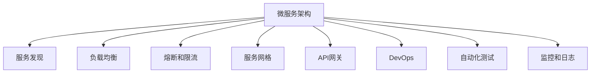

                 

# 微服务架构：独立部署和扩展

> 关键词：微服务架构,独立部署,系统扩展,容器化,服务网格,API网关,DevOps,自动化测试,监控和日志

## 1. 背景介绍

### 1.1 问题由来
随着互联网应用的复杂度不断提升，传统单体架构逐渐难以应对快速迭代和灵活扩展的需求。微服务架构作为一种将复杂系统拆分为多个小服务的范式，近年来受到广泛关注和应用。特别是对于大规模分布式系统，微服务架构提供了极高的灵活性、可扩展性和可维护性。

微服务架构的核心思想是将应用拆分成多个独立的小服务，每个服务负责单一职责，通过轻量级的通信机制相互协作。服务的粒度通常为数据库、用户接口、业务逻辑等层面的功能模块。这种架构能够适应不同的技术栈，提高系统的稳定性和可靠性，同时便于独立部署和迭代开发。

### 1.2 问题核心关键点
微服务架构设计的一个关键挑战是如何实现独立部署和扩展。独立部署要求各服务能够并行开发、测试和部署，不受彼此影响。系统扩展则要求服务的容量和性能能够随需求动态调整，避免单个服务的瓶颈。

要解决这些挑战，微服务架构需要具备以下几个核心特性：

- **松耦合**：各个微服务之间应该尽可能相互独立，减少服务之间的依赖和通信开销。
- **自动化**：自动化测试、部署、监控和日志等流程，提高开发和运维效率。
- **服务治理**：服务发现、负载均衡、熔断和限流等机制，保障服务的稳定性和高可用性。
- **日志和监控**：实时监控系统的健康状况，快速定位和解决故障。

## 2. 核心概念与联系

### 2.1 核心概念概述

为更好地理解微服务架构的独立部署和扩展，本节将介绍几个密切相关的核心概念：

- **微服务架构(Microservices Architecture)**：将应用拆分成多个小服务的架构，每个服务负责单一职责，通过轻量级的通信机制相互协作。
- **服务发现(Service Discovery)**：服务注册和发现机制，使得各个服务能够动态感知和相互通信。
- **负载均衡(Load Balancing)**：根据请求量动态分配服务请求，避免单个服务过载。
- **熔断和限流(Circuit Breaker and Rate Limiting)**：保护系统避免因局部故障影响全局，控制请求速率，避免过度占用资源。
- **服务网格(Service Mesh)**：在微服务架构中，分布式服务之间的通信管理，提供负载均衡、流量控制、服务熔断、安全认证等核心功能。
- **API网关(API Gateway)**：作为微服务架构的入口，集中管理和路由请求，提供统一的安全、认证和路由策略。
- **DevOps**：持续集成、持续交付和持续运维的自动化流水线，提升开发效率和运维水平。
- **自动化测试(Automatic Testing)**：通过单元测试、集成测试、端到端测试等，保障代码质量和系统稳定性。
- **监控和日志(Monitoring and Logging)**：实时监控系统的健康状况，快速定位和解决故障，记录系统运行轨迹，优化性能和调试问题。

这些核心概念之间的逻辑关系可以通过以下Mermaid流程图来展示：



这个流程图展示出微服务架构的核心组件及其之间的关系：

1. 微服务架构是整个系统的基础架构，通过拆分和组合服务实现不同的业务功能。
2. 服务发现、负载均衡、熔断和限流等机制，保障服务的稳定性和高可用性。
3. 服务网格提供分布式服务之间的通信管理，支持服务间的协调和互操作。
4. API网关作为微服务架构的入口，提供统一的安全、认证和路由策略。
5. DevOps和自动化测试提升开发效率和系统稳定性，持续交付和运维自动化确保系统高效运行。
6. 监控和日志实时监控系统的健康状况，记录系统运行轨迹，优化性能和调试问题。

## 3. 核心算法原理 & 具体操作步骤
### 3.1 算法原理概述

微服务架构的独立部署和扩展，本质上是通过服务分解、协同管理和自动化流程实现的。其核心算法原理包括：

1. **服务拆分和组合**：将应用拆分为多个独立的服务，每个服务负责单一的业务功能，通过API或消息队列进行通信和协作。

2. **服务治理**：通过服务注册和发现机制，使得各个服务能够动态感知和相互通信。

3. **负载均衡和容错**：通过负载均衡机制，将请求动态分配到不同的服务实例上，避免单点故障和瓶颈。

4. **服务网格和API网关**：使用服务网格和API网关，统一管理和路由请求，提供统一的安全、认证和路由策略。

5. **自动化测试和部署**：通过自动化测试和DevOps流程，提升开发效率和系统稳定性。

6. **监控和日志**：实时监控系统的健康状况，记录系统运行轨迹，优化性能和调试问题。

### 3.2 算法步骤详解

微服务架构的独立部署和扩展过程包括：

**Step 1: 服务拆分**
- 根据业务功能拆分应用，每个服务负责单一职责。
- 确定服务的边界和依赖关系，设计API接口和服务间通信协议。

**Step 2: 服务注册与发现**
- 在每个服务上部署服务注册组件，如Consul、Etcd等。
- 服务启动时向注册中心注册，并定期更新服务状态。

**Step 3: 负载均衡和容错**
- 使用负载均衡器将请求动态分配到不同的服务实例上。
- 配置熔断和限流机制，避免单点故障和资源过度占用。

**Step 4: 服务网格和API网关**
- 部署服务网格，如Istio，提供分布式服务之间的通信管理。
- 配置API网关，集中管理和路由请求，提供统一的安全、认证和路由策略。

**Step 5: 自动化测试和部署**
- 实现自动化测试流程，包括单元测试、集成测试、端到端测试等。
- 使用CI/CD工具，如Jenkins、GitLab CI等，实现持续集成和持续交付。

**Step 6: 监控和日志**
- 部署监控系统，实时监控系统的健康状况，记录系统运行轨迹。
- 使用日志系统，记录系统运行日志，帮助定位和解决问题。

### 3.3 算法优缺点

微服务架构的独立部署和扩展方法具有以下优点：

1. **独立部署**：各服务可以并行开发、测试和部署，互不影响，提高开发效率。
2. **灵活扩展**：各服务可以独立扩展，避免因单个服务的瓶颈影响整体系统性能。
3. **高可用性**：通过服务治理机制，确保服务的稳定性和高可用性。
4. **易维护性**：服务拆分和组合使得系统更加模块化和易于维护。

同时，该方法也存在一些局限性：

1. **复杂度增加**：微服务架构增加了系统的复杂度和运维难度。
2. **通信开销**：服务间的通信开销增加，需要优化通信协议和网络设计。
3. **版本管理**：各服务的版本管理复杂，需要严格控制更新流程。
4. **数据一致性**：服务间的数据一致性需要特殊处理，避免数据冲突。

尽管存在这些局限性，微服务架构仍然是大规模分布式系统的主要选择，其优势能够满足现代互联网应用的灵活性、可扩展性和可维护性需求。

### 3.4 算法应用领域

微服务架构的独立部署和扩展方法，在以下几个领域得到了广泛应用：

- **互联网应用**：电商、社交、娱乐等领域的互联网应用，需要支持高并发、高扩展性、高可用性。
- **金融服务**：银行、保险、证券等金融领域的系统，需要高效处理海量交易和数据。
- **物联网**：智能设备、传感器等物联网应用，需要支持多种设备间的协同通信和数据交互。
- **大数据处理**：数据湖、数据仓库等大数据应用，需要高效处理和分析海量数据。

除了上述这些领域，微服务架构还被创新性地应用到更多场景中，如企业内部系统、城市管理系统、智能制造系统等，为不同领域带来新的解决方案。

## 4. 数学模型和公式 & 详细讲解 & 举例说明

### 4.1 数学模型构建

为了更好地理解微服务架构的独立部署和扩展，本节将使用数学语言对相关概念进行严格的刻画。

假设系统中有 $n$ 个服务 $S_1, S_2, \ldots, S_n$，每个服务由一组服务实例组成，记为 $S_i = \{s_{i,1}, s_{i,2}, \ldots, s_{i,m_i}\}$，其中 $m_i$ 为服务实例数量。

定义服务 $S_i$ 的负载 $L_i$ 为单位时间内处理请求的数量，服务实例 $s_{i,j}$ 的负载 $L_{i,j}$ 为单位时间内处理请求的数量。

定义服务 $S_i$ 的可用容量 $C_i$ 为服务实例的总数 $m_i$。

微服务架构的负载均衡过程可以表示为：

$$
L_{i,j} = \frac{L_i}{C_i}
$$

其中 $L_{i,j}$ 为服务实例 $s_{i,j}$ 的负载，$L_i$ 为服务 $S_i$ 的负载，$C_i$ 为服务 $S_i$ 的可用容量。

定义服务 $S_i$ 的熔断阈值 $T_i$，当 $L_{i,j} > T_i$ 时，表示服务 $S_i$ 的负载过高，需要进行熔断和限流处理。

定义服务 $S_i$ 的限流阈值 $R_i$，当 $L_{i,j} > R_i$ 时，表示服务 $S_i$ 的负载过高，需要进行限流处理。

微服务架构的熔断和限流过程可以表示为：

$$
\begin{aligned}
L_{i,j} &= \min(L_{i,j}, T_i) \quad \text{if } L_{i,j} > T_i \\
L_{i,j} &= \min(L_{i,j}, R_i) \quad \text{if } L_{i,j} > R_i
\end{aligned}
$$

其中 $L_{i,j}$ 为服务实例 $s_{i,j}$ 的负载，$T_i$ 为服务 $S_i$ 的熔断阈值，$R_i$ 为服务 $S_i$ 的限流阈值。

### 4.2 公式推导过程

以下我们以两个服务的服务网格配置为例，推导服务网格的负载均衡和流量控制过程。

假设系统中有两个服务 $S_1$ 和 $S_2$，分别由一组服务实例组成：$S_1 = \{s_{1,1}, s_{1,2}, \ldots, s_{1,m_1}\}$，$S_2 = \{s_{2,1}, s_{2,2}, \ldots, s_{2,m_2}\}$。

服务网格负载均衡过程可以表示为：

$$
\begin{aligned}
L_{1,j} &= \frac{L_1}{C_1} \\
L_{2,j} &= \frac{L_2}{C_2}
\end{aligned}
$$

其中 $L_{1,j}$ 和 $L_{2,j}$ 分别为服务实例 $s_{1,j}$ 和 $s_{2,j}$ 的负载，$L_1$ 和 $L_2$ 分别为服务 $S_1$ 和 $S_2$ 的负载，$C_1$ 和 $C_2$ 分别为服务 $S_1$ 和 $S_2$ 的可用容量。

服务网格的熔断和限流过程可以表示为：

$$
\begin{aligned}
L_{1,j} &= \min(L_{1,j}, T_1) \\
L_{2,j} &= \min(L_{2,j}, T_2)
\end{aligned}
$$

其中 $L_{1,j}$ 和 $L_{2,j}$ 分别为服务实例 $s_{1,j}$ 和 $s_{2,j}$ 的负载，$T_1$ 和 $T_2$ 分别为服务 $S_1$ 和 $S_2$ 的熔断阈值。

在得到负载均衡和熔断限流的数学表达式后，即可在实践中应用到微服务架构的部署和扩展过程中。

### 4.3 案例分析与讲解

假设有一个电商系统，包含用户服务 $S_{user}$、商品服务 $S_{product}$、订单服务 $S_{order}$ 等，分别由多个服务实例组成。系统采用微服务架构，通过服务网格实现负载均衡和流量控制。

服务 $S_{user}$ 的负载均衡和熔断限流过程可以表示为：

$$
\begin{aligned}
L_{user,1} &= \frac{L_{user}}{C_{user}} \\
L_{user,2} &= \frac{L_{user}}{C_{user}}
\end{aligned}
$$

其中 $L_{user,1}$ 和 $L_{user,2}$ 分别为服务实例 $s_{user,1}$ 和 $s_{user,2}$ 的负载，$L_{user}$ 为服务 $S_{user}$ 的负载，$C_{user}$ 为服务 $S_{user}$ 的可用容量。

服务 $S_{user}$ 的熔断阈值 $T_{user}$ 和限流阈值 $R_{user}$ 可以设置为系统平均负载的 $1.2$ 倍和 $1.5$ 倍。

通过上述计算过程，即可实现微服务架构的负载均衡和流量控制，保障系统的高可用性和稳定性。

## 5. 项目实践：代码实例和详细解释说明
### 5.1 开发环境搭建

在进行微服务架构的独立部署和扩展实践前，我们需要准备好开发环境。以下是使用Spring Boot和Docker进行微服务架构开发的环境配置流程：

1. 安装JDK：从官网下载并安装JDK。

2. 安装Spring Boot：从官网下载安装包，解压后运行Spring Boot的快速启动命令。

3. 安装Docker：从官网下载并安装Docker，并配置环境变量。

4. 创建微服务项目：使用Spring Boot的maven插件创建多个微服务模块，如user-service、product-service、order-service等。

5. 编写微服务代码：在每个微服务模块中编写业务逻辑和API接口。

6. 构建Docker镜像：在每个微服务模块的根目录下编写Dockerfile，构建Docker镜像。

7. 部署微服务：使用Docker Compose文件配置微服务的部署环境，使用Docker Compose命令部署微服务。

完成上述步骤后，即可在Docker环境中进行微服务架构的独立部署和扩展实践。

### 5.2 源代码详细实现

下面以user-service微服务为例，给出Spring Boot和Docker环境下微服务架构的实现代码。

**Dockerfile**：

```Dockerfile
FROM openjdk:11-jre
ADD target/user-service.jar /app/user-service.jar
EXPOSE 8080
CMD ["java", "-jar", "/app/user-service.jar"]
```

**Docker Compose配置文件**：

```yaml
version: '3'
services:
  user-service:
    image: user-service:latest
    ports:
      - "8080:8080"
  product-service:
    image: product-service:latest
    ports:
      - "8000:8080"
  order-service:
    image: order-service:latest
    ports:
      - "9000:8080"
```

**Spring Boot用户服务代码**：

```java
package com.example.user.service;

import org.springframework.boot.SpringApplication;
import org.springframework.boot.autoconfigure.SpringBootApplication;

@SpringBootApplication
public class UserServiceApplication {
    public static void main(String[] args) {
        SpringApplication.run(UserServiceApplication.class, args);
    }
}
```

**Spring Boot用户服务API接口**：

```java
package com.example.user.service;

import org.springframework.web.bind.annotation.GetMapping;
import org.springframework.web.bind.annotation.RestController;

@RestController
public class UserServiceController {
    @GetMapping("/users")
    public String getAllUsers() {
        // 处理用户查询请求
        return "Get all users";
    }
}
```

**Spring Boot用户服务数据模型**：

```java
package com.example.user.service;

import java.util.List;

public class User {
    private String name;
    private String email;
    private List<String> roles;

    public User(String name, String email, List<String> roles) {
        this.name = name;
        this.email = email;
        this.roles = roles;
    }

    public String getName() {
        return name;
    }

    public String getEmail() {
        return email;
    }

    public List<String> getRoles() {
        return roles;
    }
}
```

通过上述代码，我们实现了Spring Boot用户服务，通过HTTP请求获取所有用户信息。

### 5.3 代码解读与分析

让我们再详细解读一下关键代码的实现细节：

**Dockerfile**：
- 指定了基础镜像为openjdk:11-jre，并在其中安装用户服务jar包。
- 暴露了8080端口，允许外部访问。
- 启动命令为java -jar /app/user-service.jar，指定了服务启动的命令。

**Docker Compose配置文件**：
- 定义了多个微服务实例，包括user-service、product-service和order-service。
- 每个服务指定了对应的Docker镜像和端口映射。

**Spring Boot用户服务代码**：
- 使用@SpringBootApplication注解创建Spring Boot应用。

**Spring Boot用户服务API接口**：
- 使用@RestController注解创建RESTful API接口。
- @GetMapping注解定义了获取所有用户信息的接口路径。

**Spring Boot用户服务数据模型**：
- 定义了用户数据模型，包括姓名、邮箱和角色列表。

通过上述代码，我们实现了Spring Boot用户服务，通过HTTP请求获取所有用户信息。

### 5.4 运行结果展示

在部署微服务后，我们可以通过HTTP请求访问各个微服务，验证其功能是否正常。例如，使用curl命令访问user-service：

```bash
curl http://localhost:8080/users
```

输出结果应为：

```
Get all users
```

这样，我们就通过Spring Boot和Docker实现了微服务架构的独立部署和扩展，验证了各个微服务的功能。

## 6. 实际应用场景
### 6.1 智能推荐系统

微服务架构的独立部署和扩展方法，在智能推荐系统中得到了广泛应用。推荐系统需要处理海量用户数据，进行实时计算和推荐，因此需要高可扩展性和高可用性。

具体而言，推荐系统可以拆分为用户服务、商品服务、评分服务等多个微服务模块。用户服务负责用户管理，商品服务负责商品管理，评分服务负责用户对商品的评分计算。各个微服务模块通过RESTful API进行通信和协作，实现高效的推荐计算和推荐结果展示。

通过微服务架构，推荐系统能够支持高并发、高扩展性、高可用性，满足大规模推荐的需求。同时，各个微服务模块可以独立部署和扩展，避免单点故障和瓶颈，提高系统的稳定性和可靠性。

### 6.2 金融交易系统

微服务架构的独立部署和扩展方法，在金融交易系统中得到了广泛应用。金融交易系统需要实时处理大量的交易数据，进行高频交易、风险控制等复杂操作，因此需要高可扩展性和高可用性。

具体而言，金融交易系统可以拆分为交易服务、风控服务、结算服务等多个微服务模块。交易服务负责交易订单的接收和处理，风控服务负责交易的实时监控和风险控制，结算服务负责交易的清算和结算。各个微服务模块通过RESTful API进行通信和协作，实现高效的交易处理和风险控制。

通过微服务架构，金融交易系统能够支持高并发、高扩展性、高可用性，满足大规模交易的需求。同时，各个微服务模块可以独立部署和扩展，避免单点故障和瓶颈，提高系统的稳定性和可靠性。

### 6.3 物联网数据采集系统

微服务架构的独立部署和扩展方法，在物联网数据采集系统中得到了广泛应用。物联网系统需要采集和管理大量设备数据，进行数据存储和分析，因此需要高可扩展性和高可用性。

具体而言，物联网系统可以拆分为设备服务、数据存储服务、数据处理服务等多个微服务模块。设备服务负责设备数据的采集和传输，数据存储服务负责设备数据的存储和管理，数据处理服务负责设备数据的分析和处理。各个微服务模块通过RESTful API进行通信和协作，实现高效的数据采集和分析。

通过微服务架构，物联网数据采集系统能够支持高并发、高扩展性、高可用性，满足大规模数据采集的需求。同时，各个微服务模块可以独立部署和扩展，避免单点故障和瓶颈，提高系统的稳定性和可靠性。

### 6.4 未来应用展望

随着微服务架构的不断演进，其应用场景将进一步扩展，带来新的技术突破和发展方向。

1. **服务网格和API网关**：随着Istio等工具的成熟，服务网格和API网关将进一步简化微服务架构的管理和治理，提高系统的可扩展性和稳定性。

2. **容器化**：随着Docker和Kubernetes等技术的普及，微服务架构将进一步实现容器化，提高系统的部署和扩展效率。

3. **无服务器架构**：随着AWS Lambda等无服务器架构的推广，微服务架构将进一步简化开发和运维流程，提高系统的灵活性和资源利用率。

4. **DevOps和自动化**：随着CI/CD等DevOps工具的普及，微服务架构将进一步实现自动化流水线，提高开发效率和系统稳定性。

5. **微服务治理**：随着服务治理技术的成熟，微服务架构将进一步实现细粒度的服务治理，提高系统的可扩展性和可用性。

6. **分布式事务**：随着分布式事务技术的成熟，微服务架构将进一步实现跨服务的事务一致性，提高系统的可靠性和稳定性。

总之，微服务架构的独立部署和扩展方法将在大规模分布式系统中发挥更大的作用，带来新的技术突破和发展方向。

## 7. 工具和资源推荐
### 7.1 学习资源推荐

为了帮助开发者系统掌握微服务架构的独立部署和扩展，这里推荐一些优质的学习资源：

1. **《Spring Boot实战》**：讲解Spring Boot框架的各项特性和应用，适合Spring Boot开发入门。

2. **《微服务架构设计》**：讲解微服务架构的原理和设计，适合微服务架构设计入门。

3. **《Docker实战》**：讲解Docker和Kubernetes的各项特性和应用，适合Docker和Kubernetes开发入门。

4. **《Istio实战》**：讲解Istio服务网格的各项特性和应用，适合Istio开发入门。

5. **《微服务架构最佳实践》**：讲解微服务架构的最佳实践和注意事项，适合微服务架构应用实践。

通过这些资源的学习实践，相信你一定能够快速掌握微服务架构的独立部署和扩展精髓，并用于解决实际的微服务系统问题。

### 7.2 开发工具推荐

高效的开发离不开优秀的工具支持。以下是几款用于微服务架构独立部署和扩展开发的常用工具：

1. **Spring Boot**：基于Spring框架的开发框架，提供丰富的开发工具和组件，适合Spring Boot开发。

2. **Docker**：轻量级的容器化技术，支持容器编排和部署，适合微服务架构部署。

3. **Kubernetes**：开源的容器编排平台，支持自动扩展、负载均衡、故障恢复等功能，适合微服务架构扩展。

4. **Istio**：开源的服务网格平台，支持流量控制、熔断、限流等功能，适合微服务架构治理。

5. **Prometheus**：开源的监控系统，支持实时监控和告警，适合微服务架构监控。

6. **ELK Stack**：开源的日志系统，支持集中管理和分析，适合微服务架构日志记录和分析。

合理利用这些工具，可以显著提升微服务架构的独立部署和扩展任务的开发效率，加快创新迭代的步伐。

### 7.3 相关论文推荐

微服务架构的独立部署和扩展技术源于学界的持续研究。以下是几篇奠基性的相关论文，推荐阅读：

1. **《微服务架构：一个新兴的计算范式》**：提出微服务架构的概念和设计原则，奠定了微服务架构的理论基础。

2. **《容器化架构的设计和部署》**：讲解Docker和Kubernetes的架构设计和部署方法，详细介绍了微服务架构的容器化实现。

3. **《Istio：服务网格的分布式网络管理》**：详细介绍了Istio服务网格的架构设计和应用，适合Istio开发和应用实践。

4. **《微服务架构的挑战与解决策略》**：详细介绍了微服务架构的挑战和解决策略，适合微服务架构设计优化和应用实践。

5. **《分布式系统的弹性设计》**：讲解分布式系统的弹性设计原则和方法，适合微服务架构设计和优化。

这些论文代表了大规模分布式系统微服务架构的研究脉络。通过学习这些前沿成果，可以帮助研究者把握学科前进方向，激发更多的创新灵感。

## 8. 总结：未来发展趋势与挑战
### 8.1 总结

本文对微服务架构的独立部署和扩展方法进行了全面系统的介绍。首先阐述了微服务架构的原理和优势，明确了微服务架构在提高系统可扩展性和可维护性方面的独特价值。其次，从原理到实践，详细讲解了微服务架构的数学模型和关键步骤，给出了微服务架构的完整代码实例。同时，本文还广泛探讨了微服务架构在智能推荐、金融交易、物联网等多个领域的应用前景，展示了微服务架构的巨大潜力。此外，本文精选了微服务架构的学习资源，力求为开发者提供全方位的技术指引。

通过本文的系统梳理，可以看到，微服务架构的独立部署和扩展方法在互联网应用中已经得到广泛应用，为复杂的系统拆分和协作提供了全新的解决方案。微服务架构不仅提高了系统的可扩展性和可维护性，还推动了云计算、容器化、自动化等技术的进步。未来，伴随微服务架构的持续演进，其应用场景将进一步扩展，带来新的技术突破和发展方向。

### 8.2 未来发展趋势

展望未来，微服务架构的独立部署和扩展技术将呈现以下几个发展趋势：

1. **容器化**：微服务架构将进一步实现容器化，通过Docker和Kubernetes等技术，提高系统的部署和扩展效率。

2. **服务网格**：微服务架构将进一步引入服务网格和API网关，简化服务之间的通信和管理，提高系统的可扩展性和稳定性。

3. **DevOps和自动化**：微服务架构将进一步实现CI/CD自动化流水线，提高开发效率和系统稳定性。

4. **分布式事务**：微服务架构将进一步实现跨服务的事务一致性，提高系统的可靠性和稳定性。

5. **无服务器架构**：微服务架构将进一步引入无服务器架构，简化开发和运维流程，提高系统的灵活性和资源利用率。

6. **分布式数据管理**：微服务架构将进一步实现分布式数据管理，支持海量数据的存储和分析。

以上趋势凸显了微服务架构的持续演进和发展方向。这些方向的探索发展，必将进一步提升微服务架构的性能和应用范围，为分布式系统的智能化、高效化和可维护性提供新的解决方案。

### 8.3 面临的挑战

尽管微服务架构的独立部署和扩展技术已经取得了瞩目成就，但在迈向更加智能化、普适化应用的过程中，它仍面临诸多挑战：

1. **复杂度增加**：微服务架构增加了系统的复杂度和运维难度，需要更高的技术水平和运维能力。

2. **通信开销**：微服务架构中的服务间通信开销增加，需要优化通信协议和网络设计。

3. **版本管理**：微服务架构中的各个服务版本管理复杂，需要严格控制更新流程。

4. **数据一致性**：微服务架构中的数据一致性需要特殊处理，避免数据冲突。

5. **安全性**：微服务架构中的服务安全需要特别关注，避免数据泄露和攻击。

尽管存在这些挑战，微服务架构仍然是大规模分布式系统的主要选择，其优势能够满足现代互联网应用的灵活性、可扩展性和可维护性需求。

### 8.4 研究展望

面对微服务架构的挑战，未来的研究需要在以下几个方面寻求新的突破：

1. **容器化技术优化**：优化Docker和Kubernetes的容器化技术，提高系统的部署和扩展效率。

2. **服务网格优化**：优化Istio等服务网格的性能和功能，提高系统的可扩展性和稳定性。

3. **DevOps和自动化优化**：优化CI/CD自动化流水线，提高开发效率和系统稳定性。

4. **分布式数据管理优化**：优化分布式数据管理技术，支持海量数据的存储和分析。

5. **微服务治理优化**：优化微服务架构的治理技术，提高系统的可扩展性和可用性。

6. **安全性优化**：优化微服务架构的安全机制，提高系统的安全性。

这些研究方向的探索，必将引领微服务架构向更加智能化、普适化和高效化方向发展，为分布式系统的智能化和高效化提供新的解决方案。

## 9. 附录：常见问题与解答

**Q1：微服务架构和单体架构有什么区别？**

A: 微服务架构和单体架构的区别在于系统设计粒度和组织方式。

单体架构是将整个应用作为一个整体进行设计和开发，所有的模块和功能都集成在一个程序中，缺乏独立性。而微服务架构是将应用拆分为多个独立的服务，每个服务负责单一的业务功能，通过API接口进行通信和协作。

微服务架构具备更好的独立部署、扩展、维护和故障隔离能力，适应复杂系统的需求。单体架构相对简单，但缺乏灵活性和可扩展性。

**Q2：微服务架构中的服务拆分和组合策略是什么？**

A: 微服务架构中的服务拆分和组合策略主要包括以下几个方面：

1. **按功能拆分**：根据业务功能拆分应用，每个服务负责单一的业务功能，通过API接口进行通信和协作。

2. **按数据拆分**：根据数据访问方式拆分应用，数据访问频繁的服务拆分为独立的服务，避免跨服务的数据访问。

3. **按技术栈拆分**：根据技术栈的不同拆分应用，例如将前端服务、后端服务、数据库服务分别拆分为独立的服务。

4. **按环境拆分**：根据运行环境的不同拆分应用，例如将开发环境、测试环境、生产环境分别拆分为独立的服务。

服务拆分和组合策略需要根据具体业务需求和技术架构进行灵活调整，以达到最佳的微服务架构设计。

**Q3：微服务架构中的负载均衡和容错机制有哪些？**

A: 微服务架构中的负载均衡和容错机制主要包括以下几种：

1. **负载均衡**：使用负载均衡器将请求动态分配到不同的服务实例上，避免单个服务过载。

2. **熔断和限流**：通过熔断和限流机制，保护系统避免因局部故障影响全局，控制请求速率，避免过度占用资源。

3. **服务注册和发现**：通过服务注册和发现机制，使得各个服务能够动态感知和相互通信。

4. **API网关**：使用API网关集中管理和路由请求，提供统一的安全、认证和路由策略。

5. **服务网格**：使用服务网格提供分布式服务之间的通信管理，支持负载均衡、流量控制、服务熔断、安全认证等核心功能。

这些机制共同保障了微服务架构的高可用性和稳定性，避免因单个服务的故障导致系统崩溃。

**Q4：微服务架构中的自动化测试和部署流程是怎样的？**

A: 微服务架构中的自动化测试和部署流程主要包括以下几个步骤：

1. **单元测试**：对每个微服务模块进行单元测试，验证代码的正确性。

2. **集成测试**：对多个微服务模块进行集成测试，验证各个模块之间的协同工作。

3. **端到端测试**：对整个系统进行端到端测试，验证系统功能的完整性和稳定性。

4. **持续集成(CI)**：通过CI工具自动构建和测试微服务模块，验证代码的稳定性。

5. **持续部署(CD)**：通过CD工具自动部署微服务模块，快速上线新功能。

6. **自动化运维**：通过自动化运维工具监控和维护微服务架构，及时发现和解决问题。

通过自动化测试和部署流程，微服务架构能够提高开发效率和系统稳定性，确保微服务模块的持续交付和快速迭代。

**Q5：微服务架构中的监控和日志系统是如何实现的？**

A: 微服务架构中的监控和日志系统主要包括以下几个方面：

1. **监控系统**：使用Prometheus、Grafana等监控工具，实时监控系统的健康状况，记录系统运行轨迹。

2. **日志系统**：使用ELK Stack、Sentry等日志系统，记录系统运行日志，帮助定位和解决问题。

3. **服务治理**：通过服务治理工具，监控和分析服务间的通信和协作，优化服务性能和稳定性和容错性。

4. **告警系统**：通过告警系统，及时发现和处理系统异常，避免系统故障。

通过监控和日志系统，微服务架构能够实时监控和记录系统运行状态，快速定位和解决问题，保障系统的稳定性和可靠性。

---

作者：禅与计算机程序设计艺术 / Zen and the Art of Computer Programming

