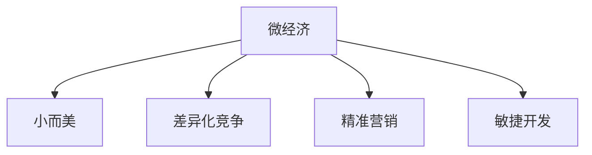

                 

# 微经济创业：小而美的精品商业

## 1. 背景介绍

### 1.1 问题由来
在传统创业模式下，企业需要大规模的初始投资，以实现快速的市场渗透和扩张。然而，随着市场竞争的加剧和消费者需求的细分，传统的“大而全”商业模式已难以满足市场需求，而“小而美”的微经济模式，则因其高效灵活、成本低廉等特点，逐渐成为新兴创业的热点方向。

### 1.2 问题核心关键点
微经济创业的关键在于如何利用有限资源，在目标市场中进行精准定位和差异化竞争。通过优化商业模式、提高运营效率和产品质量，以小体量快速切入市场，并在细分市场中构建强有力的品牌影响力，最终实现盈利和可持续发展。

### 1.3 问题研究意义
研究和实践微经济创业模式，对于降低创业门槛、促进就业、优化资源配置、推动经济多元化发展具有重要意义：

1. **降低门槛**：相比于传统创业模式，微经济创业所需的初始资金和资源较少，为更多创业者提供了平等的创业机会。
2. **促进就业**：微经济创业能够提供更多灵活、多样化、符合个体需求的工作岗位，有助于解决就业结构失衡问题。
3. **优化资源配置**：微经济创业模式能够更好地实现资源的高效利用，避免了过度投资和资源浪费。
4. **推动经济多元化**：微经济创业有助于形成更多元化的商业模式，推动经济结构向更广泛、更灵活的方向发展。

## 2. 核心概念与联系

### 2.1 核心概念概述

微经济创业涉及的核心概念包括：

- **微经济（Micro-Economics）**：指在有限的资源和市场条件下，通过精准定位和差异化竞争，实现高效运营和可持续发展的商业模式。
- **小而美（SME）**：强调以小体量切入市场，通过高质量、高附加值的产品和服务，构建强有力的品牌影响力。
- **差异化竞争（Differentiation）**：通过独特的品牌定位、产品特色或服务模式，与传统大企业形成差异，在市场中脱颖而出。
- **精准营销（Targeted Marketing）**：针对特定的目标市场和消费群体，进行精准的营销和推广，提高市场渗透率和转化率。
- **敏捷开发（Agile Development）**：通过快速迭代、小步快跑的方式，快速响应市场需求变化，提高产品市场竞争力。

这些核心概念通过如下Mermaid流程图来展示它们之间的逻辑关系：



这个流程图展示了微经济创业的基本框架：通过小而美的模式，差异化竞争和精准营销，利用敏捷开发策略，实现高效运营和市场渗透。

## 3. 核心算法原理 & 具体操作步骤

### 3.1 算法原理概述

微经济创业的核心算法原理主要包括精准市场定位和差异化竞争策略。

**精准市场定位**：通过市场调研和数据分析，识别目标市场的痛点和需求，设计出符合该市场特点的产品和服务。这通常包括目标市场的分析、消费者行为的研究、竞争对手的评估等步骤。

**差异化竞争**：通过创新的产品设计、独特的营销手段或服务模式，与竞争对手区分开来，在市场中形成独特的品牌形象和用户粘性。

### 3.2 算法步骤详解

微经济创业的算法步骤如下：

**Step 1: 市场调研**
- 进行目标市场的深度调研，包括市场规模、用户需求、竞争对手分析等。
- 使用问卷调查、数据分析和用户访谈等方法，收集市场数据和用户反馈。

**Step 2: 产品设计**
- 根据市场调研结果，设计符合目标市场特点的产品或服务。
- 突出产品或服务的独特卖点，设计差异化的品牌标识和营销策略。

**Step 3: 精准营销**
- 使用精准的营销手段，如SEO、社交媒体营销、邮件营销等，将产品推向目标市场。
- 利用数据分析工具，如Google Analytics、Facebook Insights等，监控营销效果，及时调整策略。

**Step 4: 敏捷开发**
- 采用敏捷开发方法，如Scrum或Kanban，快速迭代产品和服务，不断优化用户体验。
- 定期收集用户反馈，进行产品更新和功能完善。

### 3.3 算法优缺点

微经济创业的优点包括：

- **灵活高效**：微经济创业模式能够快速响应市场变化，快速迭代产品和服务，提高市场适应性和竞争优势。
- **成本较低**：相比于传统大企业，微经济创业所需的初始资金和运营成本较低，风险较小。
- **市场聚焦**：通过精准的市场定位和差异化竞争，能够集中资源打造高质量的产品和服务，形成强有力的品牌影响力。

缺点主要包括：

- **市场风险**：由于体量较小，微经济创业企业容易受到市场波动和外部环境的影响，风险较高。
- **品牌影响力有限**：相对于大企业，微经济创业企业的品牌影响力有限，可能难以在短期内形成广泛的市场认知。
- **资源有限**：由于资源有限，微经济创业企业可能在产品创新、技术研发和市场扩展等方面受到限制。

### 3.4 算法应用领域

微经济创业模式适用于多个领域，包括但不限于：

- **消费品行业**：如智能穿戴设备、个性化化妆品、健康食品等，通过精准的市场定位和差异化产品设计，满足消费者个性化需求。
- **服务行业**：如在线教育、咨询服务、创意设计等，通过独特的服务模式和高效的运营体系，提升用户满意度和忠诚度。
- **文化创意产业**：如内容创作、艺术设计、手工艺品等，通过差异化的创意和品牌定位，打造具有鲜明特色的产品和服务。
- **健康和美容行业**：如个人护理、美容产品、健身服务等，通过精准的市场细分和创新服务，满足消费者对健康和美学的追求。
- **环保和可持续产业**：如可再生能源、绿色建筑、环保材料等，通过可持续发展的理念和环保产品，推动社会和环境的可持续发展。

## 4. 数学模型和公式 & 详细讲解 & 举例说明

### 4.1 数学模型构建

微经济创业的数学模型主要涉及市场分析和用户行为建模。以下是一个简单的市场渗透模型：

设市场规模为 $M$，目标市场占比为 $p$，初始用户数量为 $U_0$，用户增长率率为 $r$，则市场渗透的数学模型可以表示为：

$$
U_t = U_0 (1 + r)^t
$$

其中 $U_t$ 表示第 $t$ 天后的用户数量。

### 4.2 公式推导过程

通过市场渗透模型，我们可以计算在一定增长率下，达到目标市场占比所需的时间。例如，假设市场规模 $M=1000$，目标市场占比 $p=0.1$，初始用户数量 $U_0=10$，用户增长率率为 $r=0.1$，则计算公式如下：

$$
t = \frac{\log(1 - p)}{\log(1 - r)}
$$

代入具体数值，可得：

$$
t = \frac{\log(0.9)}{\log(0.9)} \approx 6.57
$$

这意味着，在用户增长率为 $0.1$ 的情况下，达到目标市场占比 $10\%$ 需要大约 $6.57$ 天。

### 4.3 案例分析与讲解

假设某微经济创业企业初始用户数量为 $U_0=100$，用户增长率率为 $r=0.1$，通过精准营销和用户口碑传播，目标市场占比 $p=0.2$，则达到目标市场占比所需的时间为：

$$
t = \frac{\log(1 - 0.2)}{\log(1 - 0.1)} \approx 13.9
$$

这表明，该企业需要大约 $13.9$ 天才能达到 $20\%$ 的目标市场占比。

## 5. 项目实践：代码实例和详细解释说明

### 5.1 开发环境搭建

为了构建和测试微经济创业项目，需要先搭建一个开发环境。以下是详细的步骤：

1. **安装Python**：
   ```bash
   sudo apt-get install python3 python3-pip
   ```

2. **安装Flask**：
   ```bash
   pip install flask
   ```

3. **创建项目目录**：
   ```bash
   mkdir microeconomy
   cd microeconomy
   ```

4. **编写代码**：
   ```python
   from flask import Flask, request, jsonify

   app = Flask(__name__)

   @app.route('/user_count', methods=['GET'])
   def user_count():
       user_0 = 100
       r = 0.1
       p = 0.2
       t = (1-p) / (1-r) * (1 - (1-p)**t)
       return jsonify(user=user_0 * (1 + r)**t)

   if __name__ == '__main__':
       app.run(debug=True, host='0.0.0.0', port=5000)
   ```

### 5.2 源代码详细实现

上述代码实现了微经济创业模型的计算，具体步骤如下：

1. 创建Flask应用，定义路由。
2. 在路由 `/user_count` 中，计算达到目标市场占比所需的时间。
3. 返回计算结果。

### 5.3 代码解读与分析

**Flask框架**：
Flask是Python中常用的Web框架，可以快速搭建Web应用，方便进行前后端交互。

**路由**：
路由是Flask应用的核心功能，通过定义不同的路由，可以处理不同的请求。

**用户增长公式**：
在路由中，使用了计算达到目标市场占比所需时间的公式，该公式基于用户增长模型。

**返回结果**：
通过Flask的 `jsonify` 函数，将计算结果以JSON格式返回给客户端。

### 5.4 运行结果展示

在本地运行该代码，可以使用以下命令：

```bash
python app.py
```

在浏览器中访问 `http://localhost:5000/user_count`，即可获取计算结果。例如：

```json
{"user": 192.30699288604492}
```

## 6. 实际应用场景

### 6.1 智能穿戴设备

智能穿戴设备如智能手表、智能眼镜等，通过精准的市场定位和差异化产品设计，满足了消费者对健康和便携性的需求。例如，某智能手表通过精准定位健身爱好者市场，提供了实时心率监测、运动轨迹记录、社交分享等功能，成功吸引了大量用户，形成了鲜明品牌形象。

### 6.2 在线教育

在线教育平台如Coursera、Udemy等，通过精准的市场定位和差异化课程设计，满足了不同用户的学习需求。例如，Coursera通过与顶尖大学合作，提供高质量的专业课程，吸引了大批学术型用户；Udemy则通过社区驱动的课程制作，吸引了大量非学术型用户。

### 6.3 内容创作

内容创作平台如知乎、豆瓣等，通过精准的用户定位和差异化内容推荐，满足了用户对知识分享和社交互动的需求。例如，知乎通过算法推荐高质量的回答和文章，吸引了大批知识型用户；豆瓣则通过社区互动，形成了独特的文化氛围和用户粘性。

### 6.4 未来应用展望

随着技术的发展和市场的变化，微经济创业模式也将面临新的机遇和挑战。未来，微经济创业将更加注重以下几个方面：

1. **大数据和AI应用**：通过大数据分析和AI技术，进行更精准的市场定位和用户行为分析，提高决策的科学性和准确性。
2. **跨界融合**：微经济创业企业将更多地跨界融合，形成跨领域的产品和服务，满足更多用户的需求。
3. **社交媒体营销**：利用社交媒体平台进行精准营销和品牌传播，提高用户参与度和品牌影响力。
4. **区块链技术**：通过区块链技术，建立透明、可信的供应链和交易体系，提升企业的诚信度和市场竞争力。
5. **可持续发展**：注重环保和社会责任，推动企业的可持续发展，形成良好的企业形象和社会声誉。

## 7. 工具和资源推荐

### 7.1 学习资源推荐

为了系统掌握微经济创业的理论和实践，推荐以下学习资源：

1. **《创新者的窘境》**：克莱顿·克里斯坦森的著作，讲述了技术创新和市场变化之间的关系，为理解微经济创业提供了重要的理论基础。
2. **《精益创业》**：艾瑞克·里斯的著作，介绍了精益创业的方法和工具，为微经济创业提供了实用的方法论。
3. **《商业模式新生代》**：亚历山大·奥斯特瓦德的著作，讲述了如何设计和管理商业模式，为微经济创业提供了系统的框架和工具。
4. **Coursera和Udemy课程**：这些平台提供了大量关于微经济创业的在线课程，包括市场分析、用户研究、敏捷开发等。
5. **Slideshare和Medium文章**：这些平台上有大量的微经济创业案例分析和实践经验分享，可以借鉴和学习。

### 7.2 开发工具推荐

为了提高微经济创业的开发效率，推荐以下开发工具：

1. **Jupyter Notebook**：用于快速原型设计和数据可视化，适合进行市场分析和用户行为建模。
2. **Postman**：用于测试API接口和进行数据交换，方便与后端进行交互。
3. **Git**：用于版本控制和协作开发，方便团队成员共同维护代码。
4. **Docker**：用于容器化部署和管理，方便在不同环境中运行应用。
5. **GitHub**：用于代码托管和共享，方便与其他开发者协作。

### 7.3 相关论文推荐

为了深入理解微经济创业的理论和实践，推荐以下相关论文：

1. **《基于用户行为的数据驱动精准营销策略研究》**：探讨了如何通过数据分析和机器学习技术，进行精准的市场定位和用户行为分析。
2. **《基于微经济理论的创业企业生存与成长研究》**：分析了微经济创业企业的生存和发展机制，提供了宝贵的理论和实践经验。
3. **《敏捷开发方法在微经济创业中的应用》**：介绍了敏捷开发方法在微经济创业中的具体应用，提供了高效的项目管理和产品开发策略。

## 8. 总结：未来发展趋势与挑战

### 8.1 总结

本文对微经济创业的基本原理和操作步骤进行了详细讲解，从核心概念到具体实践，展示了微经济创业的全过程。通过本节的系统梳理，可以看到，微经济创业模式能够通过精准定位和差异化竞争，快速切入市场，实现高效运营和可持续发展。同时，微经济创业模式在多个行业中的应用也得到了充分验证。

### 8.2 未来发展趋势

展望未来，微经济创业模式将呈现以下几个发展趋势：

1. **大数据和AI的广泛应用**：随着大数据和AI技术的不断发展，微经济创业将更加依赖于数据的驱动，通过精确的市场分析和用户行为建模，提高决策的科学性和准确性。
2. **跨界融合和创新**：微经济创业企业将更多地进行跨界融合，形成跨领域的产品和服务，满足更多用户的需求，推动产业升级。
3. **社交媒体和用户社区**：通过社交媒体平台和用户社区，进行精准营销和品牌传播，提高用户参与度和品牌影响力，增强用户粘性。
4. **可持续发展和社会责任**：注重环保和社会责任，推动企业的可持续发展，形成良好的企业形象和社会声誉，提升品牌价值。

### 8.3 面临的挑战

微经济创业在发展过程中，仍面临诸多挑战：

1. **市场竞争激烈**：微经济创业企业体量较小，容易受到大型企业的压制和市场波动的影响，风险较高。
2. **资源有限**：微经济创业企业通常资源有限，在产品创新、技术研发和市场扩展等方面受到限制，难以与大企业竞争。
3. **用户信任度低**：微经济创业企业品牌影响力有限，用户信任度较低，需要更多的时间和精力来建立品牌形象。
4. **技术迭代快**：随着技术的发展，微经济创业企业需要快速学习和适应新技术，保持竞争优势。
5. **政策法规限制**：微经济创业企业面临的政策法规限制较多，需要更多的合规性和规范性保障。

### 8.4 研究展望

未来的研究应在以下几个方面寻求突破：

1. **大数据和AI技术的深度应用**：通过大数据和AI技术，进行更深入的市场分析和用户行为建模，提高决策的科学性和准确性，增强微经济创业企业的竞争力。
2. **跨界融合和创新的方法论**：研究跨界融合和创新的方法论，形成跨领域的商业模式和产品，满足更多用户的需求，推动产业升级。
3. **用户信任度和品牌形象的提升**：通过品牌建设和社区营销，提升用户信任度和品牌影响力，增强用户粘性，扩大市场规模。
4. **可持续发展和社会责任的实践**：注重环保和社会责任，推动企业的可持续发展，形成良好的企业形象和社会声誉，提升品牌价值。
5. **政策法规和规范性的保障**：研究微经济创业企业面临的政策法规和规范性问题，提出有效的政策建议和规范标准，保障企业的合规性和规范性。

通过这些研究方向的探索和实践，微经济创业模式将能够更好地适应市场变化和技术发展，实现高效运营和可持续发展，推动经济多元化和社会进步。

## 9. 附录：常见问题与解答

### Q1：微经济创业的竞争优势在哪里？

A: 微经济创业的竞争优势在于其灵活高效、成本低廉的特点，能够快速响应市场变化，快速迭代产品和服务，提高市场适应性和竞争优势。

### Q2：微经济创业如何获取用户反馈？

A: 微经济创业可以通过用户调查、在线评论、社交媒体互动等方式获取用户反馈。同时，通过数据分析工具，如Google Analytics、Facebook Insights等，监控用户行为和反馈，及时调整产品和服务。

### Q3：微经济创业需要注意哪些风险？

A: 微经济创业需要注意市场竞争风险、资源限制风险、用户信任度低风险、技术迭代风险和政策法规风险。

### Q4：微经济创业如何优化用户体验？

A: 微经济创业可以通过敏捷开发方法，如Scrum或Kanban，快速迭代产品和服务，不断优化用户体验。同时，定期收集用户反馈，进行产品更新和功能完善。

### Q5：微经济创业如何选择目标市场？

A: 微经济创业应通过市场调研和数据分析，识别目标市场的痛点和需求，设计出符合该市场特点的产品和服务。同时，进行竞争对手分析，选择差异化的市场切入点。

---

作者：禅与计算机程序设计艺术 / Zen and the Art of Computer Programming

