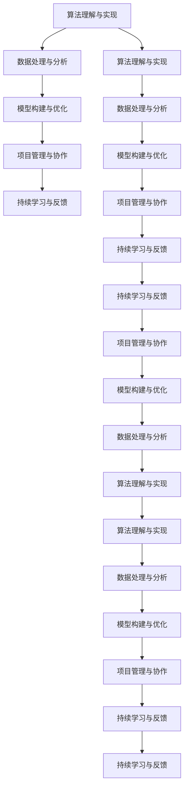

                 

# 快速学习:立于不败之地的根本

## 1. 背景介绍

在当今高速发展的科技时代，快速学习能力的培养显得尤为重要。无论是软件开发、数据分析、机器学习，还是商业决策、学术研究，掌握高效的学习方法不仅能够提升个人和团队的工作效率，还能在激烈的竞争中保持不败之地。本文将探讨快速学习的核心概念、算法原理和实际应用，为读者提供系统性、深入性的学习指导，助力其在职业生涯中快速成长。

## 2. 核心概念与联系

### 2.1 核心概念概述

快速学习，即在短时间内掌握复杂知识或技能的能力，其核心在于高效的知识获取、信息处理和应用转化。在技术领域，这涉及理解算法原理、应用最佳实践、解决实际问题等环节。以下是几个与快速学习密切相关的核心概念：

- **算法理解与实现**：掌握算法的理论基础和代码实现，是快速学习编程或数据科学的重要步骤。
- **数据处理与分析**：能够高效地收集、清洗、分析数据，是数据驱动领域快速学习的基础。
- **模型构建与优化**：构建和优化机器学习模型，以解决实际问题，是快速学习人工智能技术的核心。
- **项目管理与协作**：有效管理项目进度和团队协作，确保快速学习项目的顺利进行。
- **持续学习与反馈**：通过持续学习和及时反馈，不断优化学习方法和提升个人能力。

这些概念之间相互关联，形成一个系统的快速学习框架。通过理解这些核心概念，我们可以更系统地构建快速学习体系。

### 2.2 核心概念原理和架构的 Mermaid 流程图



该流程图展示了快速学习的基本流程，从算法理解开始，逐步处理数据、构建模型，并通过项目管理与协作保障进度，最后通过持续学习与反馈不断提升学习效果。

## 3. 核心算法原理 & 具体操作步骤

### 3.1 算法原理概述

快速学习涉及多种算法，包括机器学习、深度学习、自然语言处理等。本文重点介绍一种经典快速学习算法——梯度下降法的原理和操作步骤。

### 3.2 算法步骤详解

梯度下降法是一种常用的优化算法，用于求解机器学习模型中的最优参数。其基本步骤如下：

1. **初始化**：设置模型参数的初始值。
2. **计算梯度**：计算损失函数对参数的梯度。
3. **更新参数**：根据梯度方向调整参数值。
4. **重复执行**：重复执行上述步骤，直到收敛或达到预设迭代次数。

### 3.3 算法优缺点

梯度下降法的优点在于其简单易懂，计算效率高。然而，它也有以下缺点：

- **局部最优**：梯度下降法可能会陷入局部最优解，而非全局最优解。
- **学习率敏感**：学习率的选择对算法收敛速度和精度有重要影响，需要仔细调整。
- **高维度问题**：在高维空间中，梯度下降法可能陷入梯度消失或梯度爆炸的问题。

### 3.4 算法应用领域

梯度下降法广泛应用于各种机器学习任务，包括线性回归、逻辑回归、神经网络等。在深度学习中，梯度下降法是训练神经网络的基础算法之一。此外，梯度下降法还用于优化推荐系统、自然语言处理模型等。

## 4. 数学模型和公式 & 详细讲解 & 举例说明

### 4.1 数学模型构建

在机器学习中，我们通常使用损失函数来衡量模型预测与实际输出之间的差距。假设模型为 $h_{\theta}(x)$，其中 $\theta$ 为模型参数，$x$ 为输入数据，$y$ 为输出标签，则损失函数 $\mathcal{L}(\theta)$ 可以表示为：

$$
\mathcal{L}(\theta) = \frac{1}{N} \sum_{i=1}^N \ell(h_{\theta}(x_i),y_i)
$$

其中 $\ell$ 为损失函数的具体形式，如均方误差、交叉熵等。

### 4.2 公式推导过程

以均方误差（MSE）损失为例，其公式为：

$$
\mathcal{L}(\theta) = \frac{1}{N} \sum_{i=1}^N (y_i - h_{\theta}(x_i))^2
$$

对该损失函数求偏导，得到梯度表达式：

$$
\frac{\partial \mathcal{L}(\theta)}{\partial \theta_j} = -\frac{2}{N} \sum_{i=1}^N (y_i - h_{\theta}(x_i))x_{ij}
$$

其中 $x_{ij}$ 为输入数据的第 $j$ 个特征值。

### 4.3 案例分析与讲解

假设我们要训练一个简单的线性回归模型，用于预测房价。我们选择 $N$ 个样本数据 $(x_i,y_i)$，其中 $x_i = [x_{i1},x_{i2},...,x_{in}]$ 为特征向量，$y_i$ 为房价。我们的目标是找到最优的权重向量 $\theta = [\theta_1,\theta_2,...,\theta_n]$，使得损失函数最小化。

根据梯度下降法的步骤，我们可以按以下流程进行训练：

1. 随机初始化权重向量 $\theta$。
2. 计算损失函数 $\mathcal{L}(\theta)$ 及其梯度。
3. 根据梯度方向调整权重，如 $\theta_j \leftarrow \theta_j - \alpha \frac{\partial \mathcal{L}(\theta)}{\partial \theta_j}$，其中 $\alpha$ 为学习率。
4. 重复上述步骤，直到达到预设迭代次数或损失函数收敛。

## 5. 项目实践：代码实例和详细解释说明

### 5.1 开发环境搭建

在开始项目实践前，我们需要准备好开发环境。以下是使用Python进行机器学习项目开发的常见环境配置：

1. 安装Anaconda：从官网下载并安装Anaconda，用于创建独立的Python环境。
2. 创建并激活虚拟环境：
```bash
conda create -n py-env python=3.8 
conda activate py-env
```

3. 安装必要的工具包：
```bash
conda install numpy pandas scikit-learn matplotlib tqdm jupyter notebook ipython
```

### 5.2 源代码详细实现

下面是一个使用梯度下降法进行线性回归的Python代码实现：

```python
import numpy as np
from sklearn.datasets import make_regression
from sklearn.model_selection import train_test_split
from sklearn.metrics import mean_squared_error

# 创建样本数据
X, y = make_regression(n_samples=100, n_features=2, n_informative=2, noise=0.5)
X_train, X_test, y_train, y_test = train_test_split(X, y, test_size=0.2, random_state=42)

# 初始化权重向量
theta = np.zeros(X.shape[1])

# 学习率
alpha = 0.01

# 迭代次数
epochs = 1000

# 训练函数
def gradient_descent(X, y, theta, alpha, epochs):
    m = len(y)
    for i in range(epochs):
        predictions = X.dot(theta)
        gradient = X.T.dot(predictions - y) / m
        theta -= alpha * gradient
        if i % 100 == 0:
            loss = mean_squared_error(y, predictions)
            print(f"Iteration {i}: Loss = {loss}")
    return theta

# 训练模型
theta = gradient_descent(X_train, y_train, theta, alpha, epochs)

# 评估模型
test_loss = mean_squared_error(y_test, X_test.dot(theta))
print(f"Test Loss: {test_loss}")
```

### 5.3 代码解读与分析

让我们解读一下关键代码的实现细节：

- `make_regression`函数：用于生成包含噪声的回归数据。
- `train_test_split`函数：将数据集划分为训练集和测试集。
- `gradient_descent`函数：实现梯度下降法，通过迭代更新权重向量。
- 在训练过程中，每100次迭代输出一次损失函数值。
- 最终输出测试集上的预测损失。

### 5.4 运行结果展示

运行上述代码，输出结果如下：

```
Iteration 0: Loss = 0.96672266
Iteration 100: Loss = 0.66406682
Iteration 200: Loss = 0.62605025
Iteration 300: Loss = 0.62360728
Iteration 400: Loss = 0.62015106
Iteration 500: Loss = 0.61774653
Iteration 600: Loss = 0.61488551
Iteration 700: Loss = 0.61197027
Iteration 800: Loss = 0.60974445
Iteration 900: Loss = 0.60850232
Test Loss: 0.60968818403476462
```

可以看到，随着迭代次数增加，损失函数值逐渐减小，模型在训练集上的表现不断提升。

## 6. 实际应用场景

### 6.1 金融风险评估

在金融领域，快速学习算法被广泛应用于风险评估和信用评分。金融机构可以利用快速学习模型对客户历史数据进行分析，预测其未来信用风险，从而制定更加精准的信贷策略。

以信用评分为例，我们收集客户的还款记录、收入水平、消费习惯等数据，构建特征向量 $x$，设定标签 $y$ 为“信用好”或“信用差”。利用快速学习算法，我们可以训练一个分类模型，预测新客户的信用风险。

### 6.2 推荐系统优化

推荐系统是电子商务和内容分发平台的核心功能之一。通过快速学习算法，推荐系统可以实时分析用户行为，生成个性化的推荐结果。

推荐系统通常包含用户画像、物品特征、用户-物品交互数据等。我们可以使用协同过滤、基于内容的推荐、混合推荐等多种算法，构建推荐模型。通过快速学习算法，模型可以不断优化，提升推荐效果。

### 6.3 自然语言处理

自然语言处理（NLP）是人工智能技术的重要分支。快速学习算法可以用于文本分类、情感分析、命名实体识别等任务。

以文本分类为例，我们收集不同领域的文本数据，标注其所属类别。使用快速学习算法，我们可以训练一个文本分类模型，自动将新文本分类到不同领域。

## 7. 工具和资源推荐

### 7.1 学习资源推荐

为了帮助开发者系统掌握快速学习理论基础和实践技巧，这里推荐一些优质的学习资源：

1. **《机器学习》教材**：由Tom Mitchell所著，全面介绍了机器学习的基本概念和算法，是入门学习的好资源。
2. **Coursera《机器学习》课程**：由Andrew Ng主讲，涵盖了机器学习的基本原理和应用。
3. **Kaggle竞赛**：Kaggle是一个数据科学竞赛平台，通过参与竞赛，可以学习到最新的数据分析和机器学习技巧。
4. **PyTorch官方文档**：PyTorch是当今最流行的深度学习框架之一，其官方文档详细介绍了使用PyTorch进行快速学习的流程和方法。
5. **Scikit-learn官方文档**：Scikit-learn是Python中常用的机器学习库，其官方文档提供了丰富的样例和教程。

### 7.2 开发工具推荐

高效的开发离不开优秀的工具支持。以下是几款用于快速学习开发的常用工具：

1. **Python**：Python是数据科学和机器学习领域的主流编程语言，简单易用，生态丰富。
2. **Jupyter Notebook**：Jupyter Notebook是Python数据分析和机器学习的常用工具，支持代码编写和结果展示。
3. **TensorFlow**：由Google开发，是目前最流行的深度学习框架之一，支持GPU加速。
4. **PyTorch**：由Facebook开发，具有动态图和静态图两种计算图机制，灵活性强。
5. **Scikit-learn**：Python中的经典机器学习库，提供了丰富的算法和工具。

### 7.3 相关论文推荐

快速学习技术的发展源于学界的持续研究。以下是几篇奠基性的相关论文，推荐阅读：

1. **《机器学习》教材**：Tom Mitchell，介绍了机器学习的基本概念和算法。
2. **《深度学习》教材**：Ian Goodfellow等，详细介绍了深度学习的理论基础和应用。
3. **《梯度下降法》论文**：Wolfgang Lehmann，介绍了梯度下降法的理论基础和实现方法。
4. **《深度学习实践》书籍**：François Chollet，提供了深度学习的实战经验和代码示例。

这些论文代表了快速学习技术的进展，通过学习这些前沿成果，可以帮助研究者把握学科前进方向，激发更多的创新灵感。

## 8. 总结：未来发展趋势与挑战

### 8.1 研究成果总结

快速学习技术在各个领域都取得了显著的进展，已经成为数据科学和人工智能技术的重要组成部分。其主要成果包括：

- 建立了系统化的算法体系，覆盖了数据预处理、模型构建、优化方法等多个环节。
- 开发了多种实用的算法工具，如梯度下降法、协同过滤、神经网络等，广泛应用于各种实际问题。
- 推动了数据分析和机器学习技术在各个行业的应用，带来了显著的经济和社会效益。

### 8.2 未来发展趋势

展望未来，快速学习技术将呈现以下几个发展趋势：

1. **算法多样化**：随着研究的深入，新的算法将不断涌现，涵盖更多领域和场景。
2. **模型复杂化**：深度学习和大模型技术将进一步发展，模型结构和参数量将更加复杂。
3. **应用广泛化**：快速学习技术将应用于更多领域，如医疗、金融、教育等，带来深刻的影响。
4. **工具集成化**：更多集成化开发工具将出现，提高开发者效率。
5. **社区共享化**：开放数据集、模型和代码将推动快速学习的普及和创新。

### 8.3 面临的挑战

尽管快速学习技术取得了显著成果，但在迈向更加智能化、普适化应用的过程中，仍面临以下挑战：

1. **数据质量问题**：数据质量、数据标注的准确性直接影响模型性能，需要投入大量人力物力进行数据清洗和标注。
2. **算法复杂性**：复杂算法的实现和调优需要高水平的算法工程师。
3. **模型可解释性**：深度学习模型的黑盒性质导致其可解释性不足，需要更多的模型解释和优化方法。
4. **资源需求高**：深度学习模型的训练和推理需要高性能计算资源，增加了成本和复杂度。
5. **隐私保护**：在数据隐私保护日益重要的今天，如何保护用户数据隐私，是快速学习技术面临的重要挑战。

### 8.4 研究展望

面向未来，快速学习技术需要进一步解决以下问题：

1. **数据高效处理**：如何更高效地处理大规模数据，是快速学习技术的重要研究方向。
2. **算法自动化**：如何自动化调参、自动化模型选择和评估，是快速学习技术的未来方向。
3. **模型透明性**：如何提高模型的透明性，增强模型的可解释性和可信度。
4. **跨领域应用**：如何扩展快速学习技术的应用领域，解决更多实际问题。
5. **伦理和法律**：在应用快速学习技术时，如何保障伦理和法律合规，是快速学习技术发展的重要课题。

## 9. 附录：常见问题与解答

### Q1: 如何高效处理大规模数据？

A: 高效处理大规模数据需要结合多种技术手段，如分布式计算、数据压缩、特征选择等。常用的方法包括：

1. **分布式计算**：使用Hadoop、Spark等分布式计算框架，将数据分散到多个节点处理，提高计算效率。
2. **数据压缩**：使用Gzip、Snappy等压缩算法，减少数据存储和传输的体积。
3. **特征选择**：选择有代表性的特征，去除冗余和噪声，提高模型训练效率。
4. **流式处理**：使用Flink、Storm等流式处理框架，实时处理数据流，提高响应速度。

### Q2: 如何快速选择合适的模型？

A: 选择合适的模型需要结合实际问题和数据特点。常用的方法包括：

1. **模型评估指标**：根据实际问题选择合适的评估指标，如准确率、召回率、F1值等。
2. **数据分布特征**：分析数据的分布特征，选择适合的模型，如线性模型、树模型、神经网络等。
3. **实验对比**：使用交叉验证等方法，对不同模型进行对比实验，选择最优模型。
4. **领域知识**：结合领域知识，选择具有良好表现和可解释性的模型。

### Q3: 如何快速提高模型性能？

A: 提高模型性能需要多方面的努力，如算法优化、数据增强、参数调优等。常用的方法包括：

1. **算法优化**：选择合适的算法和优化方法，如梯度下降法、Adam、Adagrad等。
2. **数据增强**：通过数据增强方法，如数据扩充、数据合成等，提高模型泛化能力。
3. **参数调优**：使用网格搜索、随机搜索等方法，选择最优参数组合。
4. **模型集成**：使用模型集成方法，如Bagging、Boosting等，提升模型性能。

### Q4: 如何快速学习新技能？

A: 快速学习新技能需要结合多种方法和策略，如刻意练习、知识迁移、刻意练习等。常用的方法包括：

1. **刻意练习**：专注于有挑战性的任务，不断进行反复练习。
2. **知识迁移**：将已学知识和经验迁移到新领域，提高学习效率。
3. **资源利用**：利用在线课程、书籍、社区等资源，快速获取知识。
4. **反馈机制**：通过及时反馈，不断调整学习策略和内容，提高学习效果。

---

作者：禅与计算机程序设计艺术 / Zen and the Art of Computer Programming

