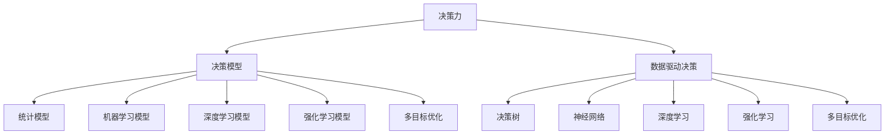

                 

# 思维体系:决策力的基础

## 1. 背景介绍

### 1.1 问题由来
决策是组织和个人在面对复杂环境和不确定性时，所做出选择的过程。决策力即是指在有限资源和信息条件下，做出最优化决策的能力。决策力的提升不仅关乎企业的战略选择，更是影响个人职业发展的关键因素。然而，尽管决策力在各行各业中都极为关键，但如何有效提升决策力、构建科学的决策体系，仍是当今技术和管理领域的一个重大挑战。

### 1.2 问题核心关键点
- **决策力与智能技术**：如何利用智能技术，特别是人工智能和大数据技术，提升决策的科学性和精确性。
- **决策模型**：构建什么样的模型来辅助决策，如统计模型、机器学习模型、深度学习模型等。
- **决策评估**：如何评估决策模型的效果，确保其在复杂多变的环境下依然有效。
- **决策支持系统**：如何构建集成的决策支持系统，整合多源数据，为决策提供全方位的支持。

## 2. 核心概念与联系

### 2.1 核心概念概述

为更好地理解决策力的构建，本节将介绍几个密切相关的核心概念：

- **决策力**：指在面对不确定性和资源限制的情况下，做出最优选择的能力。决策力不仅与个人能力相关，还涉及组织结构、管理制度、文化氛围等多个方面。
- **决策模型**：用于预测和决策的数学或算法模型，如决策树、线性回归、支持向量机、神经网络等。
- **数据驱动决策**：指在决策过程中，充分依赖数据和分析结果，而非个人经验或直觉。
- **决策树**：一种基于树结构的分类模型，通过一系列条件判断，逐步筛选决策路径。
- **神经网络**：一种仿生模型，通过多层神经元组合，实现复杂的非线性映射。
- **深度学习**：一种基于神经网络的机器学习方法，通过多层次特征提取和抽象，提高决策模型的精确性。
- **强化学习**：一种通过试错和奖励反馈机制，训练模型进行最优决策的方法。
- **多目标优化**：指在决策中，考虑多个相互矛盾的目标，通过算法优化权重和优先级，实现整体最优。

这些核心概念之间的逻辑关系可以通过以下Mermaid流程图来展示：



这个流程图展示了大语言模型的核心概念及其之间的关系：

1. 决策力作为目标，需要依靠各类决策模型来实现。
2. 统计模型、机器学习模型、深度学习模型等都是常见的决策模型。
3. 数据驱动决策强调在决策过程中充分考虑数据和分析结果。
4. 决策树、神经网络、深度学习、强化学习等模型都可用于数据驱动决策。
5. 多目标优化为决策模型提供了更灵活的优化目标，更适用于复杂场景。

这些概念共同构成了决策力的理论基础，使其在实际应用中得以实现和优化。

## 3. 核心算法原理 & 具体操作步骤

### 3.1 算法原理概述

决策力的提升，主要依赖于决策模型的科学构建和应用。本节将详细介绍几种常见的决策模型及其原理。

决策模型的构建一般遵循以下步骤：

1. **数据收集**：收集与决策相关的数据，包括历史数据、实时数据、专家意见等。
2. **数据预处理**：对数据进行清洗、归一化、特征提取等预处理，确保数据的质量和可用性。
3. **模型选择**：根据问题的性质和数据的特点，选择合适的模型，如统计模型、机器学习模型、深度学习模型等。
4. **模型训练**：使用历史数据对模型进行训练，优化模型参数，使其能够预测未来结果。
5. **模型评估**：通过验证集对训练好的模型进行评估，确保其泛化能力。
6. **决策支持**：将训练好的模型集成到决策支持系统中，提供全方位的决策支持。

### 3.2 算法步骤详解

以深度学习模型为例，其决策过程大致分为以下几个步骤：

**Step 1: 数据收集与预处理**

- 收集与决策相关的数据，如销售数据、市场数据、用户反馈等。
- 对数据进行清洗、去重、归一化等处理，确保数据质量。
- 使用特征工程技术，提取对决策有用的特征。

**Step 2: 模型选择与训练**

- 根据问题的性质和数据的特点，选择适合的深度学习模型，如全连接神经网络、卷积神经网络、循环神经网络等。
- 使用训练集对模型进行训练，调整模型参数，使其能够学习数据中的模式和规律。
- 使用验证集对模型进行评估，防止过拟合。

**Step 3: 模型评估与优化**

- 使用测试集对模型进行最终评估，确保其在未见过的数据上也有良好的性能。
- 根据评估结果，优化模型结构、参数、训练方法等，提高模型精度和泛化能力。
- 可以使用正则化、Dropout、Early Stopping等技术，防止模型过拟合。

**Step 4: 决策支持与部署**

- 将训练好的模型集成到决策支持系统中，如业务智能(BI)系统、推荐系统等。
- 提供决策建议、预测分析、实时监控等功能，辅助决策者进行决策。
- 定期更新模型和数据，确保系统始终保持最佳状态。

### 3.3 算法优缺点

深度学习模型在决策过程中具有以下优点：

1. 处理复杂数据能力强：深度学习模型能够处理高维、非线性的数据，适用于复杂决策问题。
2. 自动特征提取：通过多层网络，深度学习模型能够自动学习数据中的特征，无需人工设计。
3. 泛化能力强：深度学习模型在大规模数据集上进行训练，泛化能力较强。
4. 实时性好：基于深度学习模型的决策支持系统能够实时处理和分析数据，快速提供决策支持。

然而，深度学习模型也存在一些缺点：

1. 数据需求量大：深度学习模型通常需要大量标注数据进行训练，标注成本高。
2. 模型复杂度高：深度学习模型参数量庞大，训练复杂度较高，需要较长时间和计算资源。
3. 可解释性差：深度学习模型的决策过程复杂，难以解释其内部工作机制和决策逻辑。
4. 依赖先验知识：深度学习模型缺乏对领域知识和经验的利用，可能会忽略一些重要信息。

### 3.4 算法应用领域

深度学习模型在决策过程中已经被广泛应用于多个领域，例如：

- **金融风险管理**：使用深度学习模型预测股票价格、评估信用风险、识别欺诈行为等。
- **市场营销**：通过深度学习模型分析用户行为，进行精准营销、广告投放等。
- **医疗诊断**：利用深度学习模型分析医疗影像、基因数据等，辅助医生进行诊断和治疗。
- **智能客服**：使用深度学习模型分析用户对话，提供个性化服务、情感分析等。
- **供应链管理**：通过深度学习模型预测需求、优化库存、管理物流等。

除了上述这些经典应用外，深度学习模型还被创新性地应用到更多场景中，如风险评估、欺诈检测、自动驾驶等，为决策提供更强大的技术支持。

## 4. 数学模型和公式 & 详细讲解 & 举例说明

### 4.1 数学模型构建

假设决策问题可以表示为一个回归问题，即在给定输入 $X$ 的情况下，预测输出 $Y$。我们可以使用深度学习模型，如全连接神经网络，来构建回归模型。

设神经网络模型包含 $n$ 个隐层，每个隐层包含 $m$ 个神经元。神经网络的输入层包含 $p$ 个特征，输出层包含 $q$ 个预测值。则神经网络模型的结构可以表示为：

$$
Y = g(\theta, f(\theta, X))
$$

其中 $\theta$ 为模型参数，$f(\theta, X)$ 为神经网络的前向传播过程，$g(\theta, \cdot)$ 为输出层的激活函数。

### 4.2 公式推导过程

以一个简单的全连接神经网络为例，其前向传播过程为：

$$
h_1 = W_1X + b_1
$$
$$
h_2 = \sigma(h_1)
$$
$$
h_3 = W_2h_2 + b_2
$$
$$
Y = \sigma(h_3)
$$

其中 $W$ 和 $b$ 为权重和偏置，$\sigma$ 为激活函数，通常使用ReLU、Sigmoid等。

根据上述过程，我们可以构建损失函数：

$$
\mathcal{L}(\theta) = \frac{1}{N}\sum_{i=1}^N (Y_i - \hat{Y}_i)^2
$$

其中 $Y_i$ 为实际输出，$\hat{Y}_i$ 为模型预测输出。

模型参数的优化目标是：

$$
\theta^* = \mathop{\arg\min}_{\theta} \mathcal{L}(\theta)
$$

使用梯度下降等优化算法，最小化损失函数，得到最优模型参数。

### 4.3 案例分析与讲解

假设某电商平台想要预测用户是否会购买某件商品，可以构建一个二分类问题。数据集包含用户的基本信息、历史购买记录、浏览行为等特征，以及是否购买该商品的标签。

使用深度学习模型进行训练和评估，可以构建一个简单的全连接神经网络，结构如下：

$$
h_1 = W_1X + b_1
$$
$$
h_2 = \sigma(h_1)
$$
$$
h_3 = W_2h_2 + b_2
$$
$$
Y = \sigma(h_3)
$$

使用交叉熵损失函数：

$$
\mathcal{L}(\theta) = -\frac{1}{N}\sum_{i=1}^N [y_i\log(Y_i) + (1-y_i)\log(1-Y_i)]
$$

其中 $y_i$ 为真实标签，$Y_i$ 为模型预测概率。

使用梯度下降等优化算法，最小化损失函数，得到最优模型参数。最终使用训练好的模型对新用户进行预测，判断其是否会购买该商品。

## 5. 项目实践：代码实例和详细解释说明

### 5.1 开发环境搭建

在进行深度学习模型开发前，我们需要准备好开发环境。以下是使用Python进行PyTorch开发的环境配置流程：

1. 安装Anaconda：从官网下载并安装Anaconda，用于创建独立的Python环境。

2. 创建并激活虚拟环境：
```bash
conda create -n pytorch-env python=3.8 
conda activate pytorch-env
```

3. 安装PyTorch：根据CUDA版本，从官网获取对应的安装命令。例如：
```bash
conda install pytorch torchvision torchaudio cudatoolkit=11.1 -c pytorch -c conda-forge
```

4. 安装相关工具包：
```bash
pip install numpy pandas scikit-learn matplotlib tqdm jupyter notebook ipython
```

完成上述步骤后，即可在`pytorch-env`环境中开始深度学习模型开发。

### 5.2 源代码详细实现

我们以构建一个简单的全连接神经网络为例，使用PyTorch进行深度学习模型开发。

```python
import torch
import torch.nn as nn
import torch.optim as optim
from torch.utils.data import TensorDataset, DataLoader

# 定义神经网络模型
class Net(nn.Module):
    def __init__(self, n_input, n_output):
        super(Net, self).__init__()
        self.fc1 = nn.Linear(n_input, 64)
        self.fc2 = nn.Linear(64, n_output)

    def forward(self, x):
        x = torch.relu(self.fc1(x))
        x = self.fc2(x)
        return x

# 定义数据处理函数
def load_data():
    # 加载数据集
    x_train = torch.tensor([[0.1, 0.2, 0.3], [0.4, 0.5, 0.6], [0.7, 0.8, 0.9]])
    y_train = torch.tensor([0, 1, 0])
    x_test = torch.tensor([[0.2, 0.3, 0.4], [0.5, 0.6, 0.7], [0.8, 0.9, 1.0]])
    y_test = torch.tensor([1, 0, 1])
    dataset_train = TensorDataset(x_train, y_train)
    dataset_test = TensorDataset(x_test, y_test)
    dataloader_train = DataLoader(dataset_train, batch_size=1, shuffle=True)
    dataloader_test = DataLoader(dataset_test, batch_size=1, shuffle=False)
    return dataloader_train, dataloader_test

# 定义模型、损失函数和优化器
net = Net(3, 2)
criterion = nn.CrossEntropyLoss()
optimizer = optim.SGD(net.parameters(), lr=0.01, momentum=0.9)

# 定义训练函数
def train_epoch(net, dataloader, criterion, optimizer):
    net.train()
    total_loss = 0
    for data, target in dataloader:
        optimizer.zero_grad()
        output = net(data)
        loss = criterion(output, target)
        loss.backward()
        optimizer.step()
        total_loss += loss.item()
    return total_loss / len(dataloader)

# 训练模型
n_epochs = 10
dataloaders = load_data()
for epoch in range(n_epochs):
    loss = train_epoch(net, dataloader, criterion, optimizer)
    print(f"Epoch {epoch+1}, loss: {loss:.4f}")

# 评估模型
dataloaders = load_data()
with torch.no_grad():
    net.eval()
    total_correct = 0
    total_samples = 0
    for data, target in dataloader_test:
        output = net(data)
        _, predicted = torch.max(output, 1)
        total_correct += (predicted == target).sum().item()
        total_samples += target.size(0)
    accuracy = total_correct / total_samples
    print(f"Test Accuracy: {accuracy:.4f}")
```

以上就是使用PyTorch构建并训练一个简单的全连接神经网络的完整代码实现。可以看到，PyTorch提供了强大的自动微分功能和丰富的模型库，使得深度学习模型的开发和训练变得简单易行。

### 5.3 代码解读与分析

让我们再详细解读一下关键代码的实现细节：

**Net类**：
- `__init__`方法：定义神经网络结构，包括输入层、隐层和输出层。
- `forward`方法：定义前向传播过程，即计算模型输出。

**load_data函数**：
- 加载数据集，使用`TensorDataset`将输入和标签封装成DataLoader，用于模型训练和测试。

**train_epoch函数**：
- 在每个epoch中，对数据集进行迭代，计算损失并更新模型参数。

**训练流程**：
- 定义总的epoch数，开始循环迭代
- 每个epoch内，在训练集上训练，输出每个epoch的平均损失
- 在测试集上评估，输出模型准确率

可以看到，PyTorch提供的高效工具和丰富的API，极大地简化了深度学习模型的开发流程，使得模型构建、训练和评估变得快速高效。

当然，工业级的系统实现还需考虑更多因素，如模型的保存和部署、超参数的自动搜索、更灵活的数据接口等。但核心的深度学习模型训练过程基本与此类似。

## 6. 实际应用场景

### 6.1 智能推荐系统

智能推荐系统是深度学习模型在实际应用中最为成功的范例之一。通过分析用户历史行为数据，深度学习模型可以构建用户画像，预测用户兴趣，提供个性化推荐。

在技术实现上，可以使用深度学习模型构建推荐网络，对用户行为数据进行学习，预测用户对不同商品的兴趣程度。在生成推荐列表时，使用模型预测结果作为排序依据，综合考虑商品属性、用户历史行为、时间因素等，生成最优推荐结果。

### 6.2 医疗诊断系统

深度学习模型在医疗领域也有广泛应用。通过分析医学影像、病历记录等数据，深度学习模型可以辅助医生进行疾病诊断、治疗方案推荐等。

在实践中，可以使用深度学习模型构建医学影像分类器，对影像进行疾病类型预测。同时，可以使用自然语言处理技术，对病历记录进行分析，提取关键信息，辅助医生做出更准确的诊断。

### 6.3 金融风险管理

金融风险管理也是深度学习模型的重要应用场景。通过分析历史交易数据、市场数据等，深度学习模型可以预测股票价格、评估信用风险等。

在实践中，可以使用深度学习模型构建时间序列预测模型，对股票价格进行预测。同时，可以使用分类模型对信用风险进行评估，预测客户违约概率。

### 6.4 未来应用展望

随着深度学习模型的不断发展，其在决策过程中的应用将不断拓展。未来，深度学习模型将更加智能、高效，能够处理更加复杂、高维的数据，提供更精准、可靠的分析结果。

以下是几个未来可能的应用方向：

- **自动化决策**：使用深度学习模型构建自动决策系统，自动化执行决策过程，提升决策效率和准确性。
- **跨领域决策**：使用深度学习模型构建跨领域决策系统，整合多个领域的数据，提供更全面的决策支持。
- **实时决策**：使用深度学习模型构建实时决策系统，对实时数据进行分析，提供动态决策支持。
- **多目标优化**：使用深度学习模型构建多目标优化系统，同时考虑多个目标，优化决策结果。
- **智能合约**：使用深度学习模型构建智能合约系统，自动执行合同条款，提供更可靠的决策保障。

## 7. 工具和资源推荐

### 7.1 学习资源推荐

为了帮助开发者系统掌握深度学习模型的理论基础和实践技巧，这里推荐一些优质的学习资源：

1. 《深度学习》书籍：Ian Goodfellow等人的经典教材，系统介绍了深度学习的基本概念和算法。
2. Coursera《深度学习专项课程》：由斯坦福大学Andrew Ng教授主讲，涵盖深度学习的基础、应用、实践等多个方面。
3. Udacity《深度学习纳米学位》：通过实际项目和课程作业，帮助学习者深入理解深度学习模型。
4. PyTorch官方文档：提供详细的API文档和样例代码，帮助学习者快速上手深度学习模型的开发。
5. TensorFlow官方文档：提供丰富的模型库和工具，支持深度学习模型的开发和部署。
6. Kaggle竞赛平台：提供大量的数据集和比赛，帮助学习者提升深度学习模型的实战能力。

通过对这些资源的学习实践，相信你一定能够快速掌握深度学习模型的精髓，并用于解决实际的决策问题。

### 7.2 开发工具推荐

高效的开发离不开优秀的工具支持。以下是几款用于深度学习模型开发的工具：

1. PyTorch：基于Python的开源深度学习框架，灵活动态的计算图，适合快速迭代研究。大部分深度学习模型都有PyTorch版本的实现。
2. TensorFlow：由Google主导开发的开源深度学习框架，生产部署方便，适合大规模工程应用。同样有丰富的深度学习模型资源。
3. TensorFlow Lite：TensorFlow的移动端优化版本，支持移动设备上的深度学习模型部署。
4. Keras：基于TensorFlow的高级深度学习API，提供简单易用的接口，适合快速原型开发。
5. JAX：Google开发的基于Python的自动微分库，支持多种深度学习框架，提供高性能计算能力。
6. MXNet：由亚马逊开发的高性能深度学习框架，支持分布式计算，适合大规模深度学习模型训练。

合理利用这些工具，可以显著提升深度学习模型的开发效率，加快创新迭代的步伐。

### 7.3 相关论文推荐

深度学习模型的研究源于学界的持续研究。以下是几篇奠基性的相关论文，推荐阅读：

1. AlexNet: One Million Training Examples for Deep Architecture（2012）：提出AlexNet模型，开启深度学习在图像识别中的应用。
2. ImageNet Classification with Deep Convolutional Neural Networks（2012）：提出LeNet-5模型，利用深度卷积神经网络进行图像分类。
3. Deep Residual Learning for Image Recognition（2015）：提出ResNet模型，利用残差连接解决深度网络训练中的梯度消失问题。
4. GoogleNet Inception Networks for Computer Vision（2014）：提出Inception模型，利用多尺度卷积解决深度网络计算效率问题。
5. DNN: A Scalable Deep Neural Network Architecture for Video Classification（2012）：提出C3D模型，利用3D卷积网络进行视频分类。
6. RNN: Learning Phrase Representations using RNN Encoder Decoder for Statistical Machine Translation（2014）：提出LSTM模型，利用循环神经网络进行机器翻译。
7. GRU: A Modulation Network for Sequential Data（2014）：提出GRU模型，利用门控循环单元解决RNN中的梯度消失问题。
8. Transformer: Attention Is All You Need（2017）：提出Transformer模型，利用自注意力机制进行序列建模，提升NLP模型的性能。

这些论文代表了大语言模型和深度学习模型的发展脉络。通过学习这些前沿成果，可以帮助研究者把握学科前进方向，激发更多的创新灵感。

## 8. 总结：未来发展趋势与挑战

### 8.1 总结

本文对深度学习模型在决策中的应用进行了全面系统的介绍。首先阐述了深度学习模型的决策过程和基本原理，明确了深度学习模型在提升决策力的独特价值。其次，从原理到实践，详细讲解了深度学习模型的数学模型和关键步骤，给出了深度学习模型开发的完整代码实例。同时，本文还广泛探讨了深度学习模型在智能推荐、医疗诊断、金融风险管理等多个领域的应用前景，展示了深度学习模型的巨大潜力。此外，本文精选了深度学习模型的各类学习资源，力求为读者提供全方位的技术指引。

通过本文的系统梳理，可以看到，深度学习模型在决策过程中具有强大的处理能力和泛化能力，能够处理高维、非线性的数据，提供更精确的决策支持。未来，随着深度学习模型的不断发展，其在决策过程中将发挥越来越重要的作用，为人类决策提供更强大、更可靠的支撑。

### 8.2 未来发展趋势

展望未来，深度学习模型在决策过程中将呈现以下几个发展趋势：

1. **模型规模持续增大**：随着算力成本的下降和数据规模的扩张，深度学习模型的参数量还将持续增长。超大规模深度学习模型蕴含的丰富语言知识，有望支撑更加复杂多变的决策问题。
2. **模型结构不断优化**：未来的深度学习模型将更注重模型结构的设计，利用网络剪枝、量化、蒸馏等技术，提升模型的计算效率和推理速度。
3. **多模态融合加强**：未来的深度学习模型将更注重多模态数据的融合，利用视觉、语音、文本等多模态信息，提升决策模型的全面性和准确性。
4. **跨领域迁移能力提升**：未来的深度学习模型将更注重跨领域迁移能力，通过迁移学习、多任务学习等技术，提升模型在多个领域的应用能力。
5. **模型可解释性增强**：未来的深度学习模型将更注重可解释性，通过可视化技术、因果分析等手段，提高模型的可解释性，增强决策的可信度和可控性。
6. **对抗样本攻击防御**：未来的深度学习模型将更注重对抗样本攻击的防御，利用对抗训练、鲁棒优化等技术，提高模型的鲁棒性和安全性。

以上趋势凸显了深度学习模型在决策过程中的广阔前景。这些方向的探索发展，必将进一步提升深度学习模型的性能和应用范围，为决策提供更强大、更可靠的技术支持。

### 8.3 面临的挑战

尽管深度学习模型在决策过程中已经取得了瞩目成就，但在迈向更加智能化、普适化应用的过程中，它仍面临诸多挑战：

1. **数据依赖性强**：深度学习模型通常需要大量标注数据进行训练，标注成本高，获取难度大。
2. **模型复杂度高**：深度学习模型参数量庞大，训练复杂度较高，需要较长时间和计算资源。
3. **模型鲁棒性不足**：深度学习模型面对未知数据时，泛化性能往往较差，鲁棒性不足。
4. **模型可解释性差**：深度学习模型的决策过程复杂，难以解释其内部工作机制和决策逻辑。
5. **对抗样本攻击风险**：深度学习模型可能受到对抗样本攻击，导致输出结果不可靠。
6. **伦理道德问题**：深度学习模型可能学习到有偏见、有害的信息，导致输出结果不可控。

正视深度学习模型面临的这些挑战，积极应对并寻求突破，将是大语言模型微调走向成熟的必由之路。相信随着学界和产业界的共同努力，这些挑战终将一一被克服，深度学习模型必将在构建安全、可靠、可解释、可控的决策系统铺平道路。

### 8.4 未来突破

面对深度学习模型在决策过程中面临的种种挑战，未来的研究需要在以下几个方面寻求新的突破：

1. **无监督和半监督学习**：摆脱对大规模标注数据的依赖，利用自监督学习、主动学习等无监督和半监督范式，最大限度利用非结构化数据，实现更加灵活高效的决策。
2. **参数高效模型设计**：开发更加参数高效的深度学习模型，在固定大部分预训练参数的情况下，只更新极少量的任务相关参数。同时优化计算图，减少前向传播和反向传播的资源消耗，实现更加轻量级、实时性的决策支持。
3. **因果分析和博弈论**：将因果分析方法引入决策模型，识别出模型决策的关键特征，增强输出解释的因果性和逻辑性。借助博弈论工具刻画人机交互过程，主动探索并规避模型的脆弱点，提高系统稳定性。
4. **融合领域知识**：将符号化的先验知识，如知识图谱、逻辑规则等，与神经网络模型进行巧妙融合，引导决策过程学习更准确、合理的决策逻辑。同时加强不同模态数据的整合，实现视觉、语音、文本等多模态信息与决策逻辑的协同建模。
5. **多目标优化**：通过引入多目标优化技术，使决策模型能够同时考虑多个相互矛盾的目标，优化权重和优先级，实现整体最优。
6. **模型鲁棒性和安全性**：通过鲁棒优化、对抗训练、安全验证等技术，提升决策模型的鲁棒性和安全性，确保模型在面对未知数据和对抗样本攻击时依然可靠。
7. **伦理导向的决策模型**：在决策模型训练目标中引入伦理导向的评估指标，过滤和惩罚有偏见、有害的输出倾向，确保模型符合伦理道德标准。

这些研究方向的探索，必将引领深度学习模型在决策过程中迈向更高的台阶，为构建安全、可靠、可解释、可控的智能系统铺平道路。面向未来，深度学习模型需要在更多维度上与其他人工智能技术进行深度融合，多路径协同发力，共同推动决策力技术的进步。只有勇于创新、敢于突破，才能不断拓展深度学习模型的边界，让智能技术更好地造福人类社会。

## 9. 附录：常见问题与解答

**Q1：深度学习模型是否适用于所有决策问题？**

A: 深度学习模型在处理高维、非线性的数据时具有优势，适用于许多决策问题。但对于一些特定领域的决策问题，如决策树、逻辑回归等传统模型可能更为适用。因此，在实际应用中，需要根据具体问题的特点选择最合适的模型。

**Q2：深度学习模型是否需要大量标注数据？**

A: 深度学习模型通常需要大量标注数据进行训练，但可以通过迁移学习、自监督学习等技术，减少对标注数据的依赖。此外，对于无标注数据的决策问题，可以使用强化学习、对抗训练等技术，提升模型的鲁棒性和泛化能力。

**Q3：深度学习模型在实际应用中如何优化？**

A: 深度学习模型在实际应用中可以通过以下方式优化：
1. 数据增强：通过数据增强技术，扩充训练集，提升模型泛化能力。
2. 正则化：使用L2正则、Dropout、Early Stopping等技术，防止模型过拟合。
3. 模型剪枝：通过模型剪枝技术，去除冗余参数，提升模型计算效率。
4. 量化加速：将浮点模型转为定点模型，压缩存储空间，提高计算效率。
5. 蒸馏学习：利用知识蒸馏技术，将大型模型的小模型进行训练，提升模型泛化能力。

**Q4：如何构建跨领域的决策支持系统？**

A: 构建跨领域的决策支持系统需要综合考虑多个领域的数据和知识，可以通过以下方式实现：
1. 多源数据融合：整合不同领域的数据，如文本、图像、语音等，构建综合决策模型。
2. 领域知识融合：将领域知识和专家规则与深度学习模型结合，提升模型的领域适应能力。
3. 多目标优化：在决策过程中，同时考虑多个领域的目标，优化模型参数，实现整体最优。

**Q5：如何在决策过程中保证模型的可解释性？**

A: 在决策过程中保证模型的可解释性，可以通过以下方式实现：
1. 可视化技术：通过可视化技术，展示模型的决策过程和特征重要性。
2. 因果分析：利用因果分析技术，识别出模型决策的关键特征，提高决策的可解释性。
3. 符号化表示：将模型的决策过程转换为符号化的逻辑表达式，增强决策的可解释性。

这些方法可以在不同场景中灵活应用，确保深度学习模型在决策过程中的可靠性和透明度。

---

作者：禅与计算机程序设计艺术 / Zen and the Art of Computer Programming

