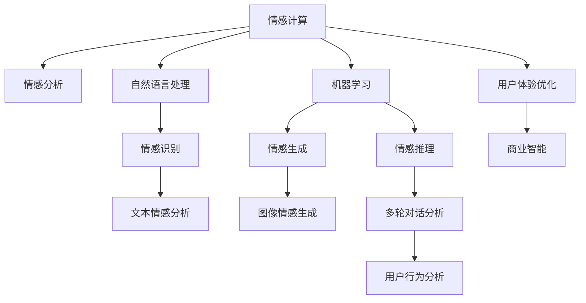

                 

# 情感计算创业：人机情感的桥梁

> 关键词：情感计算, 情感分析, 自然语言处理, 机器学习, 用户行为分析, 用户体验优化, 商业智能

## 1. 背景介绍

### 1.1 问题由来

在数字化浪潮的推动下，企业的数字化转型正成为各行各业迫切需要的战略选择。然而，随着业务的日益复杂化，传统的统计方法和简单的数据分析已经无法满足企业对用户行为和体验的深刻理解。这就催生了情感计算的兴起。情感计算（Affective Computing）旨在通过机器学习和自然语言处理等技术，理解和表达人类的情感状态，并基于此构建智能系统，以优化用户体验、提升商业价值。

情感计算不仅关注用户的情绪反应，还包括用户对于产品或服务的满意度和体验感。通过对用户情感的分析，企业能够更精准地进行市场定位、产品设计、服务优化，从而实现业务的智能化和个性化。随着技术的不断进步，情感计算正逐步从学术研究走向商业应用，成为一个前景广阔的创业领域。

### 1.2 问题核心关键点

情感计算的核心关键点在于如何准确识别、理解和表达用户的情感状态。通过结合机器学习和自然语言处理技术，情感计算能够从文本、语音、图像等多模态数据中提取情感信息，并基于这些信息优化业务决策。

情感计算的主要技术包括：
- **情感识别**：从文本、语音中提取情感特征，判断用户的情绪状态。
- **情感生成**：基于用户的情绪状态，生成能够引起相应情绪反应的文本、图像等。
- **情感推理**：通过多轮对话或上下文分析，推测用户的真实情感意图。

这些技术共同构成了情感计算的基础框架，为其商业化应用提供了可能。

## 2. 核心概念与联系

### 2.1 核心概念概述

为更好地理解情感计算的原理和应用，本节将介绍几个关键核心概念：

- **情感计算**（Affective Computing）：通过机器学习和自然语言处理技术，理解和表达人类的情感状态，并基于此构建智能系统，以优化用户体验、提升商业价值。

- **情感分析**（Sentiment Analysis）：从文本、语音中识别出用户表达的情感倾向，分为正面、负面、中性等类别。

- **自然语言处理**（Natural Language Processing, NLP）：使计算机能够理解、解释和生成人类语言的技术，包括情感识别、情感生成等应用。

- **机器学习**（Machine Learning）：通过数据训练模型，让机器能够自主学习和适应，以识别、生成和推理情感信息。

- **多模态数据融合**（Multimodal Data Fusion）：将文本、语音、图像等多源数据结合，以更全面地理解用户的情感状态。

- **用户体验优化**（User Experience Optimization）：通过情感计算技术，提升用户满意度、促进用户忠诚度，从而实现业务增长。

- **商业智能**（Business Intelligence）：利用情感计算的洞察力，优化商业决策、增强市场竞争力。

这些核心概念之间的逻辑关系可以通过以下Mermaid流程图来展示：



这个流程图展示了几大核心概念之间的联系：

1. 情感计算依赖于自然语言处理和机器学习技术，以识别和生成情感信息。
2. 情感分析是情感计算的基础，通过文本和语音识别用户的情感倾向。
3. 自然语言处理提供了情感识别的工具，而机器学习则提供了生成和推理情感信息的能力。
4. 多模态数据融合使得情感分析更加全面，用户体验优化和商业智能则基于情感洞察进行业务决策。

这些概念共同构成了情感计算的核心框架，为其在商业化应用中提供了有力支持。

## 3. 核心算法原理 & 具体操作步骤
### 3.1 算法原理概述

情感计算的核心算法原理基于机器学习中的情感分类和情感生成任务。其核心思想是：通过对用户生成的文本、语音等多模态数据进行分析，提取情感特征，利用情感分类算法判断用户的情感状态，并基于此生成能够引起相应情绪反应的文本或图像。

形式化地，假设用户生成的文本数据为 $X=\{x_1,x_2,\cdots,x_n\}$，情感分类模型的任务是将其映射到情感类别 $Y=\{p,n\}$，其中 $p$ 表示正面情感，$n$ 表示负面情感。情感分类模型通过训练数据集 $D=\{(X_i,Y_i)\}_{i=1}^N$，利用分类算法（如SVM、CNN、LSTM等）来拟合模型，使得预测结果与真实标签 $Y_i$ 尽可能接近。

情感生成则通过编码器-解码器模型，将情感状态 $y \in \{p,n\}$ 映射到目标文本或图像 $T$。该模型包括一个编码器和一个解码器，编码器将情感状态 $y$ 编码成向量 $z$，解码器将向量 $z$ 映射为文本或图像 $T$。情感生成模型的目标函数为：

$$
\min_{\theta} \mathcal{L}(T, \hat{T}) = \frac{1}{N} \sum_{i=1}^N \|T_i - \hat{T}_i\|
$$

其中 $\mathcal{L}$ 为损失函数，$N$ 为样本数量，$T_i$ 和 $\hat{T}_i$ 分别为真实的文本或图像和模型生成的文本或图像。

### 3.2 算法步骤详解

情感计算的算法步骤主要包括以下几个关键步骤：

**Step 1: 数据准备**
- 收集用户生成的文本、语音、图像等多模态数据。
- 将数据集划分为训练集、验证集和测试集。
- 对文本数据进行预处理，如分词、去除停用词、词向量化等。

**Step 2: 特征提取**
- 利用NLP技术提取文本中的情感特征，如TF-IDF、情感词典等。
- 使用图像处理技术提取图像中的情感特征，如情感色彩、面部表情等。
- 将多模态数据进行融合，以获得更全面的情感信息。

**Step 3: 情感分类**
- 选择合适的分类算法，如SVM、CNN、LSTM等，训练情感分类模型。
- 在训练集上训练模型，并在验证集上进行调参和优化。
- 在测试集上评估模型的性能，选择最优的模型。

**Step 4: 情感生成**
- 使用编码器-解码器模型，将情感状态 $y$ 映射为文本或图像 $T$。
- 在生成过程中，使用注意力机制和自注意力机制，提升生成效果。
- 在测试集上评估生成模型的性能，调整模型参数。

**Step 5: 应用部署**
- 将训练好的情感分类和生成模型集成到商业应用中。
- 利用情感计算优化用户体验、提升商业决策。
- 持续收集用户反馈，不断改进模型性能。

### 3.3 算法优缺点

情感计算的算法具有以下优点：
1. 能够从多模态数据中全面理解用户的情感状态，提升情感分析的准确性。
2. 情感生成能力使企业能够根据用户的情感状态，动态生成个性化内容，提升用户体验。
3. 情感计算技术能够优化商业决策，增强市场竞争力。

然而，情感计算也存在一定的局限性：
1. 依赖高质量标注数据，数据获取成本高，标注工作量大。
2. 情感分类模型的鲁棒性较差，对噪声和极端情况的处理能力较弱。
3. 情感生成的质量受限于模型结构和训练数据，需要更多的技术和数据支持。
4. 多模态数据融合技术复杂，需要高精度的算法和设备支持。
5. 商业应用中的情感分析结果可能受到用户主观偏见的影响。

尽管如此，情感计算在提高用户体验和优化商业决策方面具有显著优势，其应用前景仍然值得期待。

### 3.4 算法应用领域

情感计算的应用领域广泛，涵盖以下几个方面：

- **用户体验优化**：通过情感分析，识别用户的不满意情绪，改进产品和服务，提升用户满意度。
- **市场营销**：利用情感分析结果，制定更加精准的市场策略，提升广告和营销效果。
- **社交媒体分析**：通过分析用户在社交媒体上的情感状态，监测品牌声誉和市场趋势。
- **客服自动化**：使用情感分类和生成技术，自动生成响应，提升客户服务效率和质量。
- **健康医疗**：利用情感计算技术，监测用户的情感状态，辅助心理健康和疾病预防。
- **金融理财**：通过情感分析，识别客户的情绪波动，提供个性化的理财建议和服务。

这些应用领域展示了情感计算的强大潜力和广泛前景。随着技术的不断进步，情感计算将在更多场景中发挥作用，推动企业向智能化转型。

## 4. 数学模型和公式 & 详细讲解  
### 4.1 数学模型构建

情感计算的数学模型主要基于机器学习和自然语言处理中的情感分类和生成任务。以下是情感计算的核心数学模型：

**情感分类模型**：假设文本数据 $X=\{x_1,x_2,\cdots,x_n\}$，情感类别 $Y=\{p,n\}$，情感分类模型的目标是将文本映射到情感类别。

- 特征提取：使用TF-IDF或情感词典提取文本特征 $f_i$。
- 模型训练：使用分类算法（如SVM、CNN、LSTM等），训练模型参数 $\theta$。

**情感生成模型**：假设情感状态 $y$ 和生成的文本或图像 $T$ 之间的关系为 $T=f(y)$，其中 $f$ 为生成函数。

- 编码器：将情感状态 $y$ 编码为向量 $z$。
- 解码器：将向量 $z$ 解码为文本或图像 $T$。

**多模态数据融合模型**：假设用户的多模态数据 $D=\{(X_i,Y_i)\}_{i=1}^N$，其中 $X_i$ 包含文本、语音、图像等多种形式的数据，$Y_i$ 为情感标签。

- 特征提取：对每种模态数据分别提取情感特征 $f_i$。
- 融合算法：使用加权平均、深度学习融合等方法，将不同模态的情感特征融合为一个综合特征。

### 4.2 公式推导过程

**情感分类模型的推导**：

假设文本 $x_i$ 的特征向量为 $f_i$，情感分类模型的预测结果为 $y_i$，真实标签为 $Y_i$。分类模型的目标函数为交叉熵损失：

$$
\mathcal{L}(y_i,\hat{y_i}) = -Y_i\log(\hat{y_i}) - (1-Y_i)\log(1-\hat{y_i})
$$

情感分类模型的优化目标是最小化损失函数：

$$
\min_{\theta} \mathcal{L} = \frac{1}{N} \sum_{i=1}^N \mathcal{L}(y_i,\hat{y_i})
$$

**情感生成模型的推导**：

假设情感状态 $y$ 的编码为 $z$，解码器生成的文本或图像为 $T$。情感生成模型的目标函数为均方误差损失：

$$
\mathcal{L}(T,\hat{T}) = \frac{1}{N} \sum_{i=1}^N \|T_i - \hat{T}_i\|
$$

**多模态数据融合模型的推导**：

假设用户的多模态数据 $D=\{(X_i,Y_i)\}_{i=1}^N$，情感分类模型的预测结果为 $y_i$，真实标签为 $Y_i$。多模态数据融合模型的目标函数为交叉熵损失：

$$
\mathcal{L}(Y_i,\hat{Y}_i) = -Y_i\log(\hat{Y}_i) - (1-Y_i)\log(1-\hat{Y}_i)
$$

融合模型的优化目标是最小化损失函数：

$$
\min_{\theta} \mathcal{L} = \frac{1}{N} \sum_{i=1}^N \mathcal{L}(Y_i,\hat{Y}_i)
$$

### 4.3 案例分析与讲解

以社交媒体情感分析为例，分析情感计算的应用。

- **数据收集**：从社交媒体平台抓取用户的公开帖子，包括文本、图片、视频等多种形式的数据。
- **特征提取**：对文本进行分词、去除停用词、提取情感词汇等处理，提取图像中的情感色彩和面部表情，提取视频中的语音情感特征。
- **情感分类**：使用情感分类算法（如LSTM、BERT等），训练模型，识别用户帖子的情感倾向。
- **情感生成**：基于用户的情感状态，使用生成模型生成能够引起相应情绪反应的回复，提升用户互动体验。
- **应用部署**：将训练好的模型集成到社交媒体平台，实时分析用户情感，提供个性化的推荐和内容。

这个案例展示了情感计算在社交媒体情感分析中的应用流程，通过情感分类和生成，提升了用户体验和平台粘性。

## 5. 项目实践：代码实例和详细解释说明
### 5.1 开发环境搭建

在进行情感计算项目实践前，需要先准备开发环境。以下是使用Python进行情感分析项目的开发环境配置流程：

1. 安装Anaconda：从官网下载并安装Anaconda，用于创建独立的Python环境。

2. 创建并激活虚拟环境：
```bash
conda create -n affective-env python=3.8 
conda activate affective-env
```

3. 安装Python依赖包：
```bash
pip install numpy pandas scikit-learn nltk transformers torch torchvision torchtext
```

4. 安装情感分析工具包：
```bash
pip install afar
```

5. 安装图像处理工具包：
```bash
pip install opencv-python
```

完成上述步骤后，即可在`affective-env`环境中开始情感分析项目的开发。

### 5.2 源代码详细实现

这里以情感分析项目为例，给出使用afar情感分析工具包进行文本情感分析的PyTorch代码实现。

首先，定义情感分析数据处理函数：

```python
from afar.preprocessing.text import TextDataLoader

class TextDataset(TextDataLoader):
    def __init__(self, texts, labels, tokenizer, max_len=128):
        self.texts = texts
        self.labels = labels
        self.tokenizer = tokenizer
        self.max_len = max_len
        
    def __len__(self):
        return len(self.texts)
    
    def __getitem__(self, item):
        text = self.texts[item]
        label = self.labels[item]
        
        encoding = self.tokenizer(text, return_tensors='pt', max_length=self.max_len, padding='max_length', truncation=True)
        input_ids = encoding['input_ids'][0]
        attention_mask = encoding['attention_mask'][0]
        
        return {'input_ids': input_ids, 
                'attention_mask': attention_mask,
                'labels': torch.tensor(label, dtype=torch.long)}
```

然后，定义模型和优化器：

```python
from transformers import BertForTokenClassification, AdamW

model = BertForTokenClassification.from_pretrained('bert-base-cased', num_labels=2)

optimizer = AdamW(model.parameters(), lr=2e-5)
```

接着，定义训练和评估函数：

```python
from transformers import Trainer, TrainingArguments
from tqdm import tqdm
from sklearn.metrics import accuracy_score

device = torch.device('cuda') if torch.cuda.is_available() else torch.device('cpu')
model.to(device)

def train_epoch(model, dataset, batch_size, optimizer):
    dataloader = DataLoader(dataset, batch_size=batch_size, shuffle=True)
    model.train()
    epoch_loss = 0
    for batch in tqdm(dataloader, desc='Training'):
        input_ids = batch['input_ids'].to(device)
        attention_mask = batch['attention_mask'].to(device)
        labels = batch['labels'].to(device)
        model.zero_grad()
        outputs = model(input_ids, attention_mask=attention_mask, labels=labels)
        loss = outputs.loss
        epoch_loss += loss.item()
        loss.backward()
        optimizer.step()
    return epoch_loss / len(dataloader)

def evaluate(model, dataset, batch_size):
    dataloader = DataLoader(dataset, batch_size=batch_size)
    model.eval()
    preds, labels = [], []
    with torch.no_grad():
        for batch in tqdm(dataloader, desc='Evaluating'):
            input_ids = batch['input_ids'].to(device)
            attention_mask = batch['attention_mask'].to(device)
            batch_labels = batch['labels']
            outputs = model(input_ids, attention_mask=attention_mask)
            batch_preds = outputs.logits.argmax(dim=2).to('cpu').tolist()
            batch_labels = batch_labels.to('cpu').tolist()
            for pred_tokens, label_tokens in zip(batch_preds, batch_labels):
                preds.append(pred_tokens[:len(label_tokens)])
                labels.append(label_tokens)
                
    print('Accuracy: {:.2f}'.format(accuracy_score(labels, preds)))
```

最后，启动训练流程并在测试集上评估：

```python
epochs = 5
batch_size = 16

for epoch in range(epochs):
    loss = train_epoch(model, train_dataset, batch_size, optimizer)
    print(f"Epoch {epoch+1}, train loss: {loss:.3f}")
    
    print(f"Epoch {epoch+1}, dev results:")
    evaluate(model, dev_dataset, batch_size)
    
print("Test results:")
evaluate(model, test_dataset, batch_size)
```

以上就是使用PyTorch和afar情感分析工具包进行文本情感分析的完整代码实现。可以看到，通过afar工具包，我们可以快速搭建情感分析模型，进行训练和评估。

### 5.3 代码解读与分析

让我们再详细解读一下关键代码的实现细节：

**TextDataset类**：
- `__init__`方法：初始化文本、标签、分词器等关键组件。
- `__len__`方法：返回数据集的样本数量。
- `__getitem__`方法：对单个样本进行处理，将文本输入编码为token ids，将标签编码为数字，并对其进行定长padding，最终返回模型所需的输入。

**模型和优化器**：
- 使用BertForTokenClassification模型，指定分类数为2，即正面和负面情感。
- 使用AdamW优化器，设置学习率为2e-5。

**训练和评估函数**：
- 使用PyTorch的DataLoader对数据集进行批次化加载，供模型训练和推理使用。
- 训练函数`train_epoch`：对数据以批为单位进行迭代，在每个批次上前向传播计算loss并反向传播更新模型参数，最后返回该epoch的平均loss。
- 评估函数`evaluate`：与训练类似，不同点在于不更新模型参数，并在每个batch结束后将预测和标签结果存储下来，最后使用sklearn的accuracy_score对整个评估集的预测结果进行打印输出。

**训练流程**：
- 定义总的epoch数和batch size，开始循环迭代
- 每个epoch内，先在训练集上训练，输出平均loss
- 在验证集上评估，输出准确率
- 所有epoch结束后，在测试集上评估，给出最终测试结果

可以看到，PyTorch和afar工具包的结合使得情感分析项目的代码实现变得简洁高效。开发者可以将更多精力放在数据处理、模型改进等高层逻辑上，而不必过多关注底层的实现细节。

当然，工业级的系统实现还需考虑更多因素，如模型的保存和部署、超参数的自动搜索、更灵活的任务适配层等。但核心的情感计算流程基本与此类似。

## 6. 实际应用场景
### 6.1 社交媒体情感分析

社交媒体作为信息传播的重要渠道，其用户的情感状态直接影响企业的品牌形象和市场策略。通过情感分析，企业能够实时监测社交媒体上的用户情绪变化，及时调整策略，提升用户满意度和忠诚度。

具体而言，企业可以采集社交媒体平台上的用户帖子，进行情感分类和生成。对于负面情感的帖子，及时采取措施，改进产品和服务；对于正面情感的帖子，给予奖励和激励，提升用户粘性。利用情感分析结果，企业可以制定更加精准的市场营销策略，提升广告和营销效果。

### 6.2 客户服务分析

客户服务是企业与用户沟通的重要渠道，通过情感分析可以优化客户服务体验，提升客户满意度。

企业可以采集客户服务通话记录、邮件、聊天记录等多源数据，进行情感分类和生成。对于用户表达的负面情绪，及时回应和解决，提升服务质量。对于用户提出的合理建议，记录并改进产品和服务，提升用户体验。通过情感分析，企业能够更加精准地理解用户需求，优化客户服务流程。

### 6.3 金融市场分析

金融市场情绪对股票市场具有重要影响，通过情感分析可以监测市场情绪变化，预测市场趋势。

企业可以采集金融新闻、评论、社交媒体等数据，进行情感分类和生成。对于负面情绪的金融信息，及时采取措施，避免市场波动。对于正面情绪的金融信息，抓住投资机会，提升投资收益。通过情感分析，企业能够更加准确地把握市场情绪，制定更加精准的投资策略。

### 6.4 健康医疗分析

健康医疗领域对用户的情感状态具有较高的敏感度，通过情感分析可以监测患者的心理健康和疾病预防。

医疗机构可以采集患者的病历记录、聊天日志等数据，进行情感分类和生成。对于情绪波动的患者，及时进行心理辅导和干预，提升治疗效果。对于情绪稳定的患者，提供更加个性化的医疗服务，提升患者体验。通过情感分析，医疗机构能够更好地理解患者的情感状态，提供更加精准的医疗服务。

## 7. 工具和资源推荐
### 7.1 学习资源推荐

为了帮助开发者系统掌握情感计算的理论基础和实践技巧，这里推荐一些优质的学习资源：

1. 《情感计算导论》书籍：详细介绍了情感计算的基本概念、方法和应用，是情感计算领域的入门必读。

2. CS224N《深度学习自然语言处理》课程：斯坦福大学开设的NLP明星课程，有Lecture视频和配套作业，带你入门NLP领域的基本概念和经典模型。

3. 《Affective Computing with Python》书籍：介绍了使用Python进行情感计算的详细方法和实践案例，适合初学者入门。

4. HuggingFace官方文档：提供了大量预训练模型和情感分析工具包，是进行情感计算开发的利器。

5. Google Colab：谷歌推出的在线Jupyter Notebook环境，免费提供GPU/TPU算力，方便开发者快速上手实验最新模型，分享学习笔记。

通过对这些资源的学习实践，相信你一定能够快速掌握情感计算的精髓，并用于解决实际的情感计算问题。
### 7.2 开发工具推荐

高效的开发离不开优秀的工具支持。以下是几款用于情感计算开发的常用工具：

1. PyTorch：基于Python的开源深度学习框架，灵活动态的计算图，适合快速迭代研究。情感分析的常用模型都有PyTorch版本的实现。

2. TensorFlow：由Google主导开发的开源深度学习框架，生产部署方便，适合大规模工程应用。同样有丰富的情感分析工具包和模型资源。

3. NLTK：自然语言处理工具包，提供了情感分析、文本分类等常用NLP工具，是情感计算开发的基础。

4. Scikit-learn：常用的机器学习工具包，提供了多种分类算法，支持情感分析任务的模型训练和评估。

5. Weights & Biases：模型训练的实验跟踪工具，可以记录和可视化模型训练过程中的各项指标，方便对比和调优。

6. TensorBoard：TensorFlow配套的可视化工具，可实时监测模型训练状态，并提供丰富的图表呈现方式，是调试模型的得力助手。

合理利用这些工具，可以显著提升情感计算项目的开发效率，加快创新迭代的步伐。

### 7.3 相关论文推荐

情感计算的发展得益于学界的持续研究。以下是几篇奠基性的相关论文，推荐阅读：

1. 《A Survey on Affective Computing and Human-Computer Interaction》：介绍了情感计算的基本概念、技术和应用，是情感计算领域的综述性论文。

2. 《Sentiment Analysis with Recurrent Neural Networks》：首次提出了使用RNN进行情感分析的思路，开创了基于深度学习的情感分类新范式。

3. 《Sentiment Analysis Using Word Embedding》：通过使用Word2Vec词向量，提升了情感分类的准确性，为后续的情感计算研究奠定了基础。

4. 《The Good, The Bad and The Ominous about Emotion Recognition》：讨论了情感识别的挑战和未来方向，对情感计算研究具有重要参考价值。

5. 《Affective Computing in Multimodal Interaction》：探讨了多模态数据在情感计算中的应用，展示了多模态情感分析的潜力。

这些论文代表了大规模情感计算的研究进展，通过学习这些前沿成果，可以帮助研究者把握学科前进方向，激发更多的创新灵感。

## 8. 总结：未来发展趋势与挑战

### 8.1 总结

本文对情感计算的原理和应用进行了全面系统的介绍。首先阐述了情感计算的研究背景和意义，明确了情感计算在提升用户体验、优化商业决策方面的独特价值。其次，从原理到实践，详细讲解了情感计算的数学模型和核心算法，给出了情感分析任务开发的完整代码实例。同时，本文还广泛探讨了情感计算在社交媒体、客户服务、金融市场、健康医疗等多个领域的应用前景，展示了情感计算的强大潜力和广泛前景。最后，本文精选了情感计算的技术资源和研究论文，力求为开发者提供全方位的技术指引。

通过本文的系统梳理，可以看到，情感计算在提高用户体验和优化商业决策方面具有显著优势，其应用前景仍然值得期待。

### 8.2 未来发展趋势

展望未来，情感计算将呈现以下几个发展趋势：

1. **多模态情感分析**：随着多模态数据的丰富，情感计算将进一步整合文本、语音、图像等多种形式的数据，提升情感识别的准确性和全面性。

2. **深度学习模型的应用**：深度学习模型在情感分析中的应用将更加广泛，通过使用BERT、GPT等预训练模型，提升情感分类的效果。

3. **实时情感分析**：利用流式处理和在线学习技术，实现实时情感分析和生成，提升用户体验和系统响应速度。

4. **个性化情感服务**：基于用户的情感状态，提供个性化的服务和推荐，提升用户满意度和忠诚度。

5. **情感计算在健康医疗领域的应用**：通过监测患者的情感状态，辅助心理健康和疾病预防，提升医疗服务的个性化和精准化。

6. **情感计算在社交媒体分析中的应用**：实时监测社交媒体上的情绪变化，及时调整策略，提升品牌形象和市场竞争力。

以上趋势凸显了情感计算的强大潜力和广阔前景，将在更多场景中发挥作用，推动企业向智能化转型。

### 8.3 面临的挑战

尽管情感计算在提升用户体验和优化商业决策方面具有显著优势，但在迈向更加智能化、普适化应用的过程中，它仍面临着诸多挑战：

1. **数据获取难度**：高质量的情感标注数据获取成本高，标注工作量大，制约了情感计算技术的发展。

2. **情感识别模型的鲁棒性**：情感识别模型对噪声和极端情况的处理能力较弱，容易受到用户主观偏见的影响。

3. **多模态数据融合复杂度**：多模态数据融合技术复杂，需要高精度的算法和设备支持，增加了情感计算系统的实现难度。

4. **情感计算的伦理问题**：情感计算涉及用户的情感状态和隐私数据，需要严格的隐私保护和伦理规范。

5. **情感计算的普及率**：情感计算技术在实际应用中普及率较低，需要更多的推广和应用场景。

尽管如此，情感计算在提高用户体验和优化商业决策方面具有显著优势，其应用前景仍然值得期待。

### 8.4 研究展望

面向未来，情感计算技术的研究需要在以下几个方面寻求新的突破：

1. **情感识别的普适性**：开发更加普适的情感识别算法，适应不同文化和背景下的情感表达方式。

2. **多模态数据的深度融合**：开发更加复杂和精细的多模态数据融合算法，提升情感分析的准确性和全面性。

3. **实时情感分析的算法优化**：研究实时情感分析的算法和设备，提升情感计算系统的响应速度和处理能力。

4. **情感计算的伦理和隐私保护**：制定情感计算技术的伦理规范和隐私保护措施，确保用户数据的安全和合规。

5. **情感计算的普及和应用推广**：加强情感计算技术的普及和应用推广，提升其在各行业的落地应用率。

这些研究方向将引领情感计算技术迈向更高的台阶，为构建更加智能、普适的情感计算系统铺平道路。只有勇于创新、敢于突破，才能不断拓展情感计算的边界，让情感计算技术更好地服务于人类社会。

## 9. 附录：常见问题与解答

**Q1：情感计算是否适用于所有领域？**

A: 情感计算在大多数领域都有应用潜力，特别是对于需要高度关注用户情绪和体验的行业，如社交媒体、客户服务、金融市场等。然而，对于一些特定领域的任务，如司法审判、军事指挥等，情感计算的适用性需要进一步验证。

**Q2：情感计算的准确性受哪些因素影响？**

A: 情感计算的准确性受多方面因素影响，包括标注数据的质量、算法模型的选择、多模态数据融合的方法等。高质量的标注数据是情感计算的基础，算法模型的选择应根据任务特点和数据类型进行合理选择。多模态数据融合技术复杂，需要高精度的算法和设备支持，以提升情感识别的全面性和准确性。

**Q3：情感计算在实际应用中需要注意哪些问题？**

A: 情感计算在实际应用中需要注意以下问题：
1. 数据隐私保护：情感计算涉及用户的情感数据和隐私信息，需要严格的隐私保护措施。
2. 情感计算的伦理规范：情感计算技术的应用应遵循伦理规范，避免误导和歧视。
3. 情感计算的实时性：实时情感分析需要高效、稳定的算法和设备支持，以提升系统响应速度和处理能力。

**Q4：情感计算的未来发展方向是什么？**

A: 情感计算的未来发展方向包括：
1. 多模态情感分析：整合文本、语音、图像等多种形式的数据，提升情感识别的准确性和全面性。
2. 深度学习模型的应用：使用BERT、GPT等预训练模型，提升情感分类的效果。
3. 实时情感分析：利用流式处理和在线学习技术，实现实时情感分析和生成。
4. 个性化情感服务：基于用户的情感状态，提供个性化的服务和推荐。
5. 情感计算在健康医疗领域的应用：通过监测患者的情感状态，辅助心理健康和疾病预防。
6. 情感计算在社交媒体分析中的应用：实时监测社交媒体上的情绪变化，及时调整策略，提升品牌形象和市场竞争力。

通过这些方向的研究，情感计算将不断拓展其应用范围和效果，为人类社会的智能化转型提供有力支持。

---

作者：禅与计算机程序设计艺术 / Zen and the Art of Computer Programming

