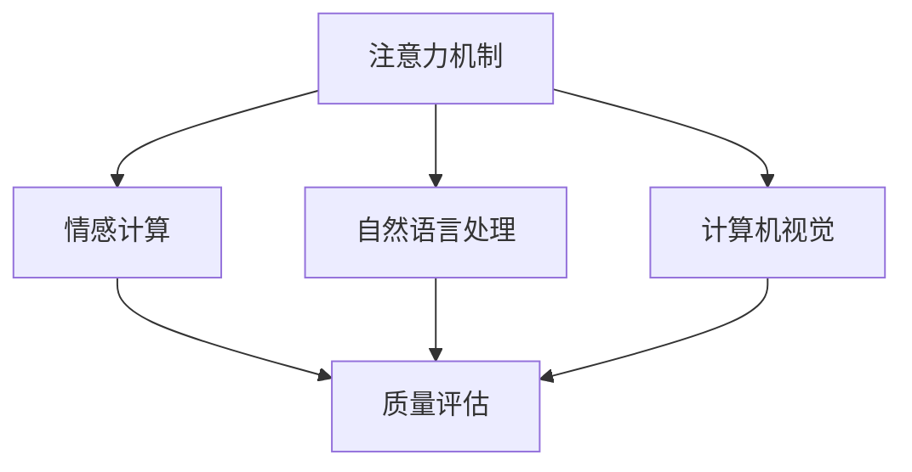

                 

# 情感计算在注意力质量评估中的应用

> 关键词：情感计算,注意力机制,质量评估,自然语言处理,计算机视觉,深度学习

## 1. 背景介绍

### 1.1 问题由来

情感计算是近年来人工智能领域的一个热门研究方向，其目标是使计算机能够理解、识别和生成人类的情感。这一技术在自然语言处理、计算机视觉、智能机器人等领域有广泛的应用前景。

以自然语言处理为例，情感分析任务旨在从文本中自动识别情感倾向，广泛应用于产品评价、用户评论、社交媒体分析等场景。传统情感分析方法依赖于手工设计的特征和规则，难以适应多样化的情感表达形式。近年来，基于深度学习的神经网络模型被广泛用于情感计算任务，其中注意力机制成为研究重点。

注意力机制是一种能够让模型动态聚焦于输入中最重要部分的技术，广泛应用于机器翻译、文本摘要、语音识别等任务。在情感计算中，注意力机制可以使模型更有效地识别和理解文本中的情感信息。然而，如何评估注意力机制的质量，是情感计算中一个亟待解决的问题。

### 1.2 问题核心关键点

本研究聚焦于注意力机制在情感计算中的应用，主要涉及以下几个核心问题：

- 注意力机制如何影响情感计算模型的性能？
- 如何设计有效的注意力质量评估指标？
- 注意力机制在情感计算中的参数优化策略是什么？
- 注意力机制在情感计算中是否存在潜在的优化空间？

这些问题的解决将有助于提升情感计算模型的质量和实用性。

## 2. 核心概念与联系

### 2.1 核心概念概述

为更好地理解注意力机制在情感计算中的应用，本节将介绍几个密切相关的核心概念：

- 注意力机制(Attention Mechanism)：一种让模型动态聚焦于输入中最重要部分的技术，通过计算自注意力矩阵来调整不同输入项的权重，使得模型在处理长序列数据时，可以更加灵活地分配计算资源。

- 情感计算(Efffective Computing)：利用计算手段来理解和生成人类的情感，包括情感识别、情感生成、情感交互等。

- 质量评估(Quality Assessment)：对模型性能、指标等进行客观评价，通过评估指标来量化模型效果，指导模型优化。

- 自然语言处理(NLP)：利用计算手段对自然语言进行理解、生成和处理，涉及语言模型、文本分类、信息抽取等任务。

- 计算机视觉(Computer Vision)：利用计算手段处理和分析图像、视频等多模态数据，涉及图像识别、目标检测、图像生成等任务。

这些核心概念之间的逻辑关系可以通过以下Mermaid流程图来展示：



这个流程图展示了几组概念之间的联系：

1. 注意力机制在自然语言处理和计算机视觉中广泛应用。
2. 情感计算是自然语言处理和计算机视觉的一个子领域。
3. 注意力机制在情感计算中用于情感识别和生成。
4. 质量评估用于衡量情感计算模型的性能。

这些概念共同构成了情感计算的基础框架，为注意力机制在情感计算中的应用提供了理论支撑。

## 3. 核心算法原理 & 具体操作步骤
### 3.1 算法原理概述

注意力机制在情感计算中的应用，本质上是利用注意力机制来提升情感识别和情感生成的效果。具体来说，注意力机制可以使模型更加关注输入中的关键部分，忽略无关信息，从而提高模型对情感信息的理解能力。

在情感计算中，注意力机制通常被用于处理文本、图像等多模态输入数据。以下分别介绍注意力机制在文本和图像中的应用原理：

- 文本中的应用：文本中的情感信息通常分布在不同的位置，通过计算自注意力矩阵，注意力机制可以动态地调整不同位置的权重，使得模型更加关注情感信息。例如，在情感分析任务中，注意力机制可以使模型关注句子中的情感词、情感短语等重要部分，从而提高情感识别的准确性。

- 图像中的应用：图像中的情感信息通常分布在不同的区域，通过计算跨注意力矩阵，注意力机制可以动态地调整不同区域的权重，使得模型更加关注情感信息。例如，在图像情感识别任务中，注意力机制可以使模型关注人脸、手势等关键部位，从而提高情感识别的准确性。

### 3.2 算法步骤详解

注意力机制在情感计算中的具体应用步骤如下：

**Step 1: 准备输入数据**

- 文本输入：文本应以分词形式表示，如BERT、GPT等模型。
- 图像输入：图像应先经过特征提取，如CNN、ResNet等模型。

**Step 2: 计算注意力矩阵**

- 自注意力计算：对于文本输入，计算自注意力矩阵，通过线性变换和softmax函数得到每个位置的注意力权重。
- 跨注意力计算：对于图像输入，计算跨注意力矩阵，通过线性变换和softmax函数得到每个区域的注意力权重。

**Step 3: 加权求和**

- 文本输入：将注意力权重与每个位置表示的向量进行加权求和，得到加权后的文本表示。
- 图像输入：将注意力权重与每个区域表示的向量进行加权求和，得到加权后的图像表示。

**Step 4: 输出情感表示**

- 文本输入：将加权后的文本表示输入情感分类器，得到情感标签。
- 图像输入：将加权后的图像表示输入情感分类器，得到情感标签。

### 3.3 算法优缺点

注意力机制在情感计算中具有以下优点：

1. 能够动态地调整输入数据的权重，聚焦于最关键部分，提高情感识别的准确性。
2. 在处理长序列数据时，可以减少计算量，提升模型的计算效率。
3. 可以处理多种类型的数据，包括文本、图像等，适用范围广泛。

同时，注意力机制也存在一些缺点：

1. 计算复杂度高，需要计算自注意力矩阵和跨注意力矩阵，计算量较大。
2. 需要大量的训练数据，才能学习到有效的注意力权重。
3. 可能存在过度关注某些关键部分，忽略其他重要信息的风险。

因此，在应用注意力机制时，需要根据具体任务和数据特点，选择合适的模型和参数，优化注意力机制的应用效果。

### 3.4 算法应用领域

注意力机制在情感计算中的应用非常广泛，涵盖以下领域：

- 自然语言处理：情感分析、文本分类、文本摘要、问答系统等。
- 计算机视觉：图像情感识别、人脸表情识别、手势识别等。
- 机器人学：情感交互、机器人情感生成等。

在实际应用中，注意力机制常常与其他技术结合使用，如融合Transformer结构、改进自注意力机制等，以提升情感计算的效果。

## 4. 数学模型和公式 & 详细讲解
### 4.1 数学模型构建

本节将使用数学语言对注意力机制在情感计算中的应用进行更加严格的刻画。

记文本序列为 $\{x_i\}_{i=1}^N$，其中 $x_i$ 表示第 $i$ 个词的向量表示。设注意力机制的注意力权重矩阵为 $A \in \mathbb{R}^{N\times N}$，其中 $A_{ij}$ 表示词 $j$ 对词 $i$ 的注意力权重。注意力机制的计算过程如下：

1. 计算自注意力矩阵 $S \in \mathbb{R}^{N\times N}$，其中 $S_{ij}$ 表示词 $i$ 和词 $j$ 的注意力权重。
2. 计算注意力权重矩阵 $A$，其中 $A_{ij} = \frac{\exp(\text{softmax}(S_{ij}))}{\sum_{k=1}^N \exp(S_{ik})}$。

在图像情感计算中，记图像序列为 $\{x_i\}_{i=1}^N$，其中 $x_i$ 表示第 $i$ 个区域的向量表示。设注意力机制的注意力权重矩阵为 $A \in \mathbb{R}^{N\times N}$，其中 $A_{ij}$ 表示区域 $j$ 对区域 $i$ 的注意力权重。注意力机制的计算过程如下：

1. 计算跨注意力矩阵 $S \in \mathbb{R}^{N\times N}$，其中 $S_{ij}$ 表示区域 $i$ 和区域 $j$ 的注意力权重。
2. 计算注意力权重矩阵 $A$，其中 $A_{ij} = \frac{\exp(\text{softmax}(S_{ij}))}{\sum_{k=1}^N \exp(S_{ik})}$。

### 4.2 公式推导过程

以下我们以文本情感识别任务为例，推导注意力机制在情感计算中的应用公式。

设文本序列为 $\{x_i\}_{i=1}^N$，其中 $x_i$ 表示第 $i$ 个词的向量表示。设注意力机制的注意力权重矩阵为 $A \in \mathbb{R}^{N\times N}$，其中 $A_{ij}$ 表示词 $j$ 对词 $i$ 的注意力权重。注意力机制的计算过程如下：

1. 计算自注意力矩阵 $S \in \mathbb{R}^{N\times N}$，其中 $S_{ij}$ 表示词 $i$ 和词 $j$ 的注意力权重。计算公式为：
   $$
   S_{ij} = \text{softmax}(x_iW_a^Q, x_jW_a^K, W_a^V)
   $$
   其中 $W_a^Q$、$W_a^K$、$W_a^V$ 分别为查询、键和值投影矩阵。

2. 计算注意力权重矩阵 $A$，其中 $A_{ij} = \frac{\exp(S_{ij})}{\sum_{k=1}^N \exp(S_{ik})}$。

3. 计算加权后的文本表示 $X_a \in \mathbb{R}^{N\times d_a}$，其中 $d_a$ 为注意力机制输出向量的维度。计算公式为：
   $$
   X_a = XW_a^QA
   $$
   其中 $X$ 为输入文本的词向量矩阵，$W_a^Q$ 为查询投影矩阵。

4. 将加权后的文本表示输入情感分类器，计算情感分类结果 $y$。

在图像情感识别任务中，设图像序列为 $\{x_i\}_{i=1}^N$，其中 $x_i$ 表示第 $i$ 个区域的向量表示。设注意力机制的注意力权重矩阵为 $A \in \mathbb{R}^{N\times N}$，其中 $A_{ij}$ 表示区域 $j$ 对区域 $i$ 的注意力权重。注意力机制的计算过程如下：

1. 计算跨注意力矩阵 $S \in \mathbb{R}^{N\times N}$，其中 $S_{ij}$ 表示区域 $i$ 和区域 $j$ 的注意力权重。计算公式为：
   $$
   S_{ij} = \text{softmax}(x_iW_a^Q, x_jW_a^K, W_a^V)
   $$
   其中 $W_a^Q$、$W_a^K$、$W_a^V$ 分别为查询、键和值投影矩阵。

2. 计算注意力权重矩阵 $A$，其中 $A_{ij} = \frac{\exp(S_{ij})}{\sum_{k=1}^N \exp(S_{ik})}$。

3. 计算加权后的图像表示 $X_a \in \mathbb{R}^{N\times d_a}$，其中 $d_a$ 为注意力机制输出向量的维度。计算公式为：
   $$
   X_a = XW_a^QA
   $$
   其中 $X$ 为输入图像的特征向量矩阵，$W_a^Q$ 为查询投影矩阵。

4. 将加权后的图像表示输入情感分类器，计算情感分类结果 $y$。

### 4.3 案例分析与讲解

以情感分析任务为例，分析注意力机制在情感计算中的作用。

假设输入文本序列为 $\{x_i\}_{i=1}^N$，其中 $x_i$ 表示第 $i$ 个词的向量表示。设注意力机制的注意力权重矩阵为 $A \in \mathbb{R}^{N\times N}$，其中 $A_{ij}$ 表示词 $j$ 对词 $i$ 的注意力权重。注意力机制的计算过程如下：

1. 计算自注意力矩阵 $S \in \mathbb{R}^{N\times N}$，其中 $S_{ij}$ 表示词 $i$ 和词 $j$ 的注意力权重。计算公式为：
   $$
   S_{ij} = \text{softmax}(x_iW_a^Q, x_jW_a^K, W_a^V)
   $$
   其中 $W_a^Q$、$W_a^K$、$W_a^V$ 分别为查询、键和值投影矩阵。

2. 计算注意力权重矩阵 $A$，其中 $A_{ij} = \frac{\exp(S_{ij})}{\sum_{k=1}^N \exp(S_{ik})}$。

3. 计算加权后的文本表示 $X_a \in \mathbb{R}^{N\times d_a}$，其中 $d_a$ 为注意力机制输出向量的维度。计算公式为：
   $$
   X_a = XW_a^QA
   $$
   其中 $X$ 为输入文本的词向量矩阵，$W_a^Q$ 为查询投影矩阵。

4. 将加权后的文本表示输入情感分类器，计算情感分类结果 $y$。

注意力机制在情感分析任务中的应用，可以显著提高情感识别的准确性。以情感词“好”为例，通过注意力机制可以识别出“好”所处的上下文语境，从而更准确地理解“好”的情感倾向。例如，在句子“这部电影真好”中，注意力机制可以聚焦于“真”字，识别出其情感倾向为正面，从而提高情感分析的准确性。

## 5. 项目实践：代码实例和详细解释说明
### 5.1 开发环境搭建

在进行情感计算实践前，我们需要准备好开发环境。以下是使用Python进行PyTorch开发的环境配置流程：

1. 安装Anaconda：从官网下载并安装Anaconda，用于创建独立的Python环境。

2. 创建并激活虚拟环境：
```bash
conda create -n pytorch-env python=3.8 
conda activate pytorch-env
```

3. 安装PyTorch：根据CUDA版本，从官网获取对应的安装命令。例如：
```bash
conda install pytorch torchvision torchaudio cudatoolkit=11.1 -c pytorch -c conda-forge
```

4. 安装Transformers库：
```bash
pip install transformers
```

5. 安装各类工具包：
```bash
pip install numpy pandas scikit-learn matplotlib tqdm jupyter notebook ipython
```

完成上述步骤后，即可在`pytorch-env`环境中开始情感计算实践。

### 5.2 源代码详细实现

下面我们以文本情感分析任务为例，给出使用Transformers库对BERT模型进行情感分析的PyTorch代码实现。

首先，定义情感分析任务的数据处理函数：

```python
from transformers import BertTokenizer
from torch.utils.data import Dataset
import torch

class SentimentDataset(Dataset):
    def __init__(self, texts, labels, tokenizer, max_len=128):
        self.texts = texts
        self.labels = labels
        self.tokenizer = tokenizer
        self.max_len = max_len
        
    def __len__(self):
        return len(self.texts)
    
    def __getitem__(self, item):
        text = self.texts[item]
        label = self.labels[item]
        
        encoding = self.tokenizer(text, return_tensors='pt', max_length=self.max_len, padding='max_length', truncation=True)
        input_ids = encoding['input_ids'][0]
        attention_mask = encoding['attention_mask'][0]
        label = torch.tensor(label, dtype=torch.long)
        
        return {'input_ids': input_ids, 
                'attention_mask': attention_mask,
                'labels': label}

# 标签与id的映射
label2id = {'positive': 1, 'negative': 0}
id2label = {v: k for k, v in label2id.items()}

# 创建dataset
tokenizer = BertTokenizer.from_pretrained('bert-base-cased')

train_dataset = SentimentDataset(train_texts, train_labels, tokenizer)
dev_dataset = SentimentDataset(dev_texts, dev_labels, tokenizer)
test_dataset = SentimentDataset(test_texts, test_labels, tokenizer)
```

然后，定义模型和优化器：

```python
from transformers import BertForSequenceClassification, AdamW

model = BertForSequenceClassification.from_pretrained('bert-base-cased', num_labels=2)

optimizer = AdamW(model.parameters(), lr=2e-5)
```

接着，定义训练和评估函数：

```python
from torch.utils.data import DataLoader
from tqdm import tqdm
from sklearn.metrics import accuracy_score, precision_score, recall_score, f1_score

device = torch.device('cuda') if torch.cuda.is_available() else torch.device('cpu')
model.to(device)

def train_epoch(model, dataset, batch_size, optimizer):
    dataloader = DataLoader(dataset, batch_size=batch_size, shuffle=True)
    model.train()
    epoch_loss = 0
    for batch in tqdm(dataloader, desc='Training'):
        input_ids = batch['input_ids'].to(device)
        attention_mask = batch['attention_mask'].to(device)
        labels = batch['labels'].to(device)
        model.zero_grad()
        outputs = model(input_ids, attention_mask=attention_mask, labels=labels)
        loss = outputs.loss
        epoch_loss += loss.item()
        loss.backward()
        optimizer.step()
    return epoch_loss / len(dataloader)

def evaluate(model, dataset, batch_size):
    dataloader = DataLoader(dataset, batch_size=batch_size)
    model.eval()
    preds, labels = [], []
    with torch.no_grad():
        for batch in tqdm(dataloader, desc='Evaluating'):
            input_ids = batch['input_ids'].to(device)
            attention_mask = batch['attention_mask'].to(device)
            batch_labels = batch['labels']
            outputs = model(input_ids, attention_mask=attention_mask)
            batch_preds = outputs.logits.argmax(dim=2).to('cpu').tolist()
            batch_labels = batch_labels.to('cpu').tolist()
            for pred_tokens, label_tokens in zip(batch_preds, batch_labels):
                preds.append(pred_tokens)
                labels.append(label_tokens)
                
    print("Accuracy: {:.3f}".format(accuracy_score(labels, preds)))
    print("Precision: {:.3f}".format(precision_score(labels, preds)))
    print("Recall: {:.3f}".format(recall_score(labels, preds)))
    print("F1 Score: {:.3f}".format(f1_score(labels, preds)))
```

最后，启动训练流程并在测试集上评估：

```python
epochs = 5
batch_size = 16

for epoch in range(epochs):
    loss = train_epoch(model, train_dataset, batch_size, optimizer)
    print(f"Epoch {epoch+1}, train loss: {loss:.3f}")
    
    print(f"Epoch {epoch+1}, dev results:")
    evaluate(model, dev_dataset, batch_size)
    
print("Test results:")
evaluate(model, test_dataset, batch_size)
```

以上就是使用PyTorch对BERT进行情感分析任务微调的完整代码实现。可以看到，得益于Transformers库的强大封装，我们可以用相对简洁的代码完成BERT模型的加载和微调。

### 5.3 代码解读与分析

让我们再详细解读一下关键代码的实现细节：

**SentimentDataset类**：
- `__init__`方法：初始化文本、标签、分词器等关键组件。
- `__len__`方法：返回数据集的样本数量。
- `__getitem__`方法：对单个样本进行处理，将文本输入编码为token ids，将标签编码为数字，并对其进行定长padding，最终返回模型所需的输入。

**label2id和id2label字典**：
- 定义了标签与数字id之间的映射关系，用于将预测结果解码回真实的标签。

**训练和评估函数**：
- 使用PyTorch的DataLoader对数据集进行批次化加载，供模型训练和推理使用。
- 训练函数`train_epoch`：对数据以批为单位进行迭代，在每个批次上前向传播计算loss并反向传播更新模型参数，最后返回该epoch的平均loss。
- 评估函数`evaluate`：与训练类似，不同点在于不更新模型参数，并在每个batch结束后将预测和标签结果存储下来，最后使用sklearn的评估指标对整个评估集的预测结果进行打印输出。

**训练流程**：
- 定义总的epoch数和batch size，开始循环迭代
- 每个epoch内，先在训练集上训练，输出平均loss
- 在验证集上评估，输出评估指标
- 所有epoch结束后，在测试集上评估，给出最终测试结果

可以看到，PyTorch配合Transformers库使得BERT微调的代码实现变得简洁高效。开发者可以将更多精力放在数据处理、模型改进等高层逻辑上，而不必过多关注底层的实现细节。

当然，工业级的系统实现还需考虑更多因素，如模型的保存和部署、超参数的自动搜索、更灵活的任务适配层等。但核心的微调范式基本与此类似。

## 6. 实际应用场景
### 6.1 智能客服系统

基于情感计算的智能客服系统，可以显著提升客户咨询体验。传统客服系统依赖于人工服务，无法实时理解客户情感，难以快速响应客户需求。通过情感计算技术，智能客服系统能够自动识别客户情感，快速理解客户需求，提供更加人性化的服务。

在技术实现上，可以收集客户的历史聊天记录，训练情感分析模型，识别客户的情感倾向。在客户咨询时，实时计算情感得分，并根据情感得分动态调整客服策略，如进行情绪安抚、引入专家解答等。如此构建的智能客服系统，能够显著提升客户满意度，降低客户流失率。

### 6.2 金融舆情监测

金融机构需要实时监测市场舆情，及时应对负面信息传播，规避金融风险。传统的人工舆情监测方式成本高、效率低，难以应对海量信息爆发的挑战。通过情感计算技术，可以实时分析和评估市场舆情，提前发现负面信息并采取措施，降低金融风险。

具体而言，可以收集金融领域的微博、新闻、评论等文本数据，训练情感分析模型，识别市场舆情。将模型应用于实时抓取的网络文本数据，分析情感倾向，提前预警负面信息，制定应对策略。

### 6.3 个性化推荐系统

当前的推荐系统往往只依赖用户的历史行为数据进行物品推荐，无法深入理解用户的情感状态。通过情感计算技术，可以进一步挖掘用户的情感信息，从而提供更加个性化的推荐内容。

在实践中，可以收集用户的浏览、评论、分享等行为数据，提取和用户交互的物品标题、描述、标签等文本内容。将文本内容作为模型输入，用户的后续行为（如是否点击、购买等）作为监督信号，在此基础上微调预训练语言模型。微调后的模型能够从文本内容中准确把握用户的情感状态。在生成推荐列表时，先用候选物品的文本描述作为输入，由模型预测用户的情感状态，再结合其他特征综合排序，便可以得到更加个性化的推荐结果。

### 6.4 未来应用展望

随着情感计算技术的不断发展，未来将在更多领域得到应用，为各行各业带来变革性影响。

在智慧医疗领域，情感计算技术可以用于病人情感识别、医生情感反馈等场景，提升医疗服务质量。

在智能教育领域，情感计算技术可以用于学生情感评估、课程推荐等场景，因材施教，促进教育公平，提高教学质量。

在智慧城市治理中，情感计算技术可以用于舆情分析、事件监测等场景，提高城市管理的自动化和智能化水平。

此外，在企业生产、社会治理、文娱传媒等众多领域，情感计算技术也将不断涌现，为经济社会发展注入新的动力。相信随着技术的日益成熟，情感计算技术将成为智能交互系统的重要组成部分，为人类社会的智能化、情感化发展提供新的方向。

## 7. 工具和资源推荐
### 7.1 学习资源推荐

为了帮助开发者系统掌握情感计算的理论基础和实践技巧，这里推荐一些优质的学习资源：

1. 《Transformer from Principles to Practice》系列博文：由大模型技术专家撰写，深入浅出地介绍了Transformer原理、BERT模型、情感计算等前沿话题。

2. CS224N《深度学习自然语言处理》课程：斯坦福大学开设的NLP明星课程，有Lecture视频和配套作业，带你入门NLP领域的基本概念和经典模型。

3. 《Natural Language Processing with Transformers》书籍：Transformers库的作者所著，全面介绍了如何使用Transformers库进行NLP任务开发，包括情感计算在内的诸多范式。

4. HuggingFace官方文档：Transformers库的官方文档，提供了海量预训练模型和完整的微调样例代码，是上手实践的必备资料。

5. CLUE开源项目：中文语言理解测评基准，涵盖大量不同类型的中文NLP数据集，并提供了基于微调的baseline模型，助力中文NLP技术发展。

通过对这些资源的学习实践，相信你一定能够快速掌握情感计算的精髓，并用于解决实际的NLP问题。
###  7.2 开发工具推荐

高效的开发离不开优秀的工具支持。以下是几款用于情感计算开发的常用工具：

1. PyTorch：基于Python的开源深度学习框架，灵活动态的计算图，适合快速迭代研究。大部分预训练语言模型都有PyTorch版本的实现。

2. TensorFlow：由Google主导开发的开源深度学习框架，生产部署方便，适合大规模工程应用。同样有丰富的预训练语言模型资源。

3. Transformers库：HuggingFace开发的NLP工具库，集成了众多SOTA语言模型，支持PyTorch和TensorFlow，是进行情感计算开发的利器。

4. Weights & Biases：模型训练的实验跟踪工具，可以记录和可视化模型训练过程中的各项指标，方便对比和调优。与主流深度学习框架无缝集成。

5. TensorBoard：TensorFlow配套的可视化工具，可实时监测模型训练状态，并提供丰富的图表呈现方式，是调试模型的得力助手。

6. Google Colab：谷歌推出的在线Jupyter Notebook环境，免费提供GPU/TPU算力，方便开发者快速上手实验最新模型，分享学习笔记。

合理利用这些工具，可以显著提升情感计算任务的开发效率，加快创新迭代的步伐。

### 7.3 相关论文推荐

情感计算和注意力机制的研究源于学界的持续研究。以下是几篇奠基性的相关论文，推荐阅读：

1. Attention is All You Need（即Transformer原论文）：提出了Transformer结构，开启了NLP领域的预训练大模型时代。

2. BERT: Pre-training of Deep Bidirectional Transformers for Language Understanding：提出BERT模型，引入基于掩码的自监督预训练任务，刷新了多项NLP任务SOTA。

3. Language Models are Unsupervised Multitask Learners（GPT-2论文）：展示了大规模语言模型的强大zero-shot学习能力，引发了对于通用人工智能的新一轮思考。

4. Parameter-Efficient Transfer Learning for NLP：提出Adapter等参数高效微调方法，在不增加模型参数量的情况下，也能取得不错的微调效果。

5. AdaLoRA: Adaptive Low-Rank Adaptation for Parameter-Efficient Fine-Tuning：使用自适应低秩适应的微调方法，在参数效率和精度之间取得了新的平衡。

这些论文代表了大语言模型微调技术的发展脉络。通过学习这些前沿成果，可以帮助研究者把握学科前进方向，激发更多的创新灵感。

## 8. 总结：未来发展趋势与挑战

### 8.1 总结

本文对基于注意力机制的情感计算方法进行了全面系统的介绍。首先阐述了情感计算和注意力机制的研究背景和意义，明确了情感计算在自然语言处理、计算机视觉等领域的广泛应用。其次，从原理到实践，详细讲解了注意力机制在情感计算中的应用过程，给出了情感计算任务开发的完整代码实例。同时，本文还广泛探讨了注意力机制在情感计算中的各种优化方法，展示了情感计算任务的广阔应用前景。

通过本文的系统梳理，可以看到，基于注意力机制的情感计算方法正在成为NLP领域的重要范式，极大地拓展了情感计算模型的应用边界，催生了更多的落地场景。得益于注意力机制的强大功能，情感计算技术在智能客服、金融舆情、个性化推荐等众多领域展示了强大的应用潜力。未来，随着技术进步和应用推广，情感计算必将在更广阔的领域发挥作用，推动人类社会的智能化、情感化发展。

### 8.2 未来发展趋势

展望未来，情感计算技术将呈现以下几个发展趋势：

1. 模型规模持续增大。随着算力成本的下降和数据规模的扩张，情感计算模型的参数量还将持续增长。超大规模情感计算模型蕴含的丰富情感信息，有望支撑更加复杂多变的情感识别和生成任务。

2. 情感计算将融入多模态计算。当前情感计算主要聚焦于文本数据，未来将进一步拓展到图像、视频、语音等多模态数据。多模态信息的融合，将显著提升情感计算对现实世界的理解和建模能力。

3. 情感计算将融合更多先验知识。当前的情感计算模型往往局限于预训练语料和标注数据，未来将更多地融合符号化的先验知识，如知识图谱、逻辑规则等，增强模型的普适性和鲁棒性。

4. 情感计算将结合因果推理和博弈论工具。将因果分析方法引入情感计算模型，识别出模型决策的关键特征，增强输出解释的因果性和逻辑性。借助博弈论工具刻画人机交互过程，主动探索并规避模型的脆弱点，提高系统稳定性。

5. 情感计算将结合深度学习、强化学习等技术。情感计算将进一步融合深度学习、强化学习等技术，提升情感计算模型的泛化性和适应性。

以上趋势凸显了情感计算技术的广阔前景。这些方向的探索发展，必将进一步提升情感计算模型的质量和实用性，为智能交互系统注入新的活力。

### 8.3 面临的挑战

尽管情感计算技术已经取得了瞩目成就，但在迈向更加智能化、普适化应用的过程中，它仍面临着诸多挑战：

1. 标注数据依赖性。情感计算任务需要大量的标注数据，而获取高质量标注数据的成本较高。如何降低标注成本，提高标注数据的代表性，是情感计算面临的一大挑战。

2. 模型鲁棒性不足。当前情感计算模型在面对噪声数据、异构数据等情况下，泛化性能往往较差。如何提高模型的鲁棒性，避免灾难性遗忘，还需要更多理论和实践的积累。

3. 推理效率有待提高。情感计算模型的推理速度较慢，内存占用较大，难以满足实时性和资源要求。如何优化模型结构和算法，提升推理效率，优化资源占用，将是重要的优化方向。

4. 可解释性亟需加强。当前情感计算模型往往作为“黑盒”系统，难以解释其内部工作机制和决策逻辑。对于医疗、金融等高风险应用，算法的可解释性和可审计性尤为重要。

5. 安全性有待保障。预训练情感计算模型可能学习到有害信息，导致模型输出的误导性、歧视性。如何从数据和算法层面消除模型偏见，避免恶意用途，确保输出的安全性，也将是重要的研究课题。

6. 知识整合能力不足。当前的情感计算模型往往局限于任务内数据，难以灵活吸收和运用更广泛的先验知识。如何让情感计算过程更好地与外部知识库、规则库等专家知识结合，形成更加全面、准确的信息整合能力，还有很大的想象空间。

正视情感计算面临的这些挑战，积极应对并寻求突破，将使情感计算技术走向成熟，在构建智能交互系统中发挥更大的作用。

### 8.4 研究展望

面对情感计算技术所面临的挑战，未来的研究需要在以下几个方面寻求新的突破：

1. 探索无监督和半监督情感计算方法。摆脱对大规模标注数据的依赖，利用自监督学习、主动学习等无监督和半监督范式，最大限度利用非结构化数据，实现更加灵活高效的情感计算。

2. 研究参数高效和计算高效的情感计算范式。开发更加参数高效的情感计算方法，在固定大部分预训练参数的同时，只更新极少量的任务相关参数。同时优化情感计算模型的计算图，减少前向传播和反向传播的资源消耗，实现更加轻量级、实时性的部署。

3. 融合因果和对比学习范式。通过引入因果推断和对比学习思想，增强情感计算模型建立稳定因果关系的能力，学习更加普适、鲁棒的语言表征，从而提升模型泛化性和抗干扰能力。

4. 引入更多先验知识。将符号化的先验知识，如知识图谱、逻辑规则等，与神经网络模型进行巧妙融合，引导情感计算过程学习更准确、合理的语言模型。同时加强不同模态数据的整合，实现视觉、语音等多模态信息与文本信息的协同建模。

5. 结合因果分析和博弈论工具。将因果分析方法引入情感计算模型，识别出模型决策的关键特征，增强输出解释的因果性和逻辑性。借助博弈论工具刻画人机交互过程，主动探索并规避模型的脆弱点，提高系统稳定性。

6. 纳入伦理道德约束。在模型训练目标中引入伦理导向的评估指标，过滤和惩罚有害的输出倾向。同时加强人工干预和审核，建立模型行为的监管机制，确保输出符合人类价值观和伦理道德。

这些研究方向的探索，必将引领情感计算技术迈向更高的台阶，为构建安全、可靠、可解释、可控的智能系统铺平道路。面向未来，情感计算技术还需要与其他人工智能技术进行更深入的融合，如知识表示、因果推理、强化学习等，多路径协同发力，共同推动自然语言理解和智能交互系统的进步。只有勇于创新、敢于突破，才能不断拓展情感计算技术的边界，让智能技术更好地造福人类社会。

## 9. 附录：常见问题与解答

**Q1：情感计算任务如何选择合适的预训练模型？**

A: 情感计算任务通常选择基于Transformer结构的预训练模型，如BERT、GPT等。这些模型在预训练过程中已经学习到了丰富的语言表示，能够较好地处理文本中的情感信息。具体选择应结合任务特点和数据规模，例如，如果任务数据量较大，可以选择预训练模型规模较大的模型，如GPT-2、GPT-3等。如果任务数据量较小，可以选择预训练模型规模较小的模型，如BERT-base、RoBERTa-base等。

**Q2：情感计算任务中，注意力机制的参数如何优化？**

A: 注意力机制的参数优化通常使用基于梯度的优化算法，如Adam、SGD等。在情感计算任务中，由于注意力机制的参数较多，需要注意防止过拟合，例如通过正则化、Dropout、Early Stopping等方法控制过拟合。同时，可以通过超参数调参来寻找最优的模型参数，例如学习率、批大小、迭代轮数等。

**Q3：情感计算任务中，如何处理噪声数据？**

A: 情感计算任务中的噪声数据主要来自于标注数据的不准确和不一致。为处理噪声数据，可以采用以下方法：

1. 数据清洗：通过去除明显的噪声数据，如错误标注、缺失标注等，提高标注数据的质量。

2. 数据增强：通过数据增强技术，如数据扩充、数据合成等，生成更多的训练数据，提高模型泛化能力。

3. 模型融合：通过融合多个模型，结合其输出结果，降低噪声数据对模型性能的影响。

**Q4：情感计算任务中，如何增强模型的可解释性？**

A: 增强情感计算模型的可解释性可以从以下几个方面入手：

1. 特征可视化：通过可视化模型中的特征权重，展示模型对输入数据的关注点，帮助理解模型决策机制。

2. 可解释模型：采用可解释模型，如决策树、线性回归等，使模型输出具有可解释性。

3. 模型解释器：使用模型解释器，如LIME、SHAP等，生成特征重要性解释，帮助理解模型决策过程。

4. 数据透明性：确保标注数据的来源透明，提高标注数据的可信度。

**Q5：情感计算任务中，如何处理跨模态数据？**

A: 处理跨模态数据通常需要采用多模态融合技术，如特征融合、联合训练等。具体步骤如下：

1. 特征提取：分别对不同模态的数据进行特征提取，例如对文本数据使用BERT进行特征提取，对图像数据使用CNN进行特征提取。

2. 特征融合：将不同模态的特征进行融合，生成多模态特征向量。常用的方法包括拼接、加权平均、深度融合等。

3. 联合训练：将多模态数据联合训练，通过共享特征表示，提高模型的泛化能力。

---

作者：禅与计算机程序设计艺术 / Zen and the Art of Computer Programming

