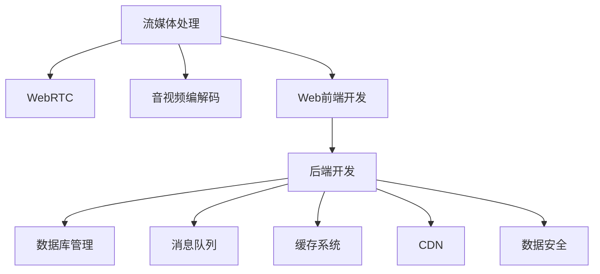

                 

# 打造知识付费的在线课堂直播系统

> 关键词：知识付费、在线课堂、直播系统、实时交互、技术架构、流媒体处理、数据管理、用户行为分析、安全与隐私保护

## 1. 背景介绍

### 1.1 问题由来
在知识付费的浪潮中，在线教育成为人们获取知识的重要方式。尤其是疫情的影响，更是推动了在线课堂的普及和应用。在线课堂不仅能突破地域限制，让学生随时随地学习，还能通过实时互动、个性化推荐等功能，提升学习体验和效果。然而，随着在线教育用户规模的快速增长，对系统性能、稳定性、可扩展性等提出了更高要求。

在线课堂系统需要具备以下功能：
- **直播功能**：支持多路直播和录制，实时传达讲师的课程内容。
- **互动功能**：支持学生提问、讨论、举手等功能，提升师生互动性。
- **数据管理**：对学生的学习数据、讲师的授课记录等进行有效管理。
- **个性化推荐**：根据学生的学习习惯和兴趣，推荐合适的课程和讲师。
- **用户行为分析**：分析用户行为，提升平台运营效率和用户体验。
- **安全与隐私保护**：保障用户数据安全，防止信息泄露。

本文将围绕这些需求，探讨如何设计并实现一个高效、稳定、易扩展的在线课堂直播系统。

## 2. 核心概念与联系

### 2.1 核心概念概述

为更好地理解在线课堂直播系统的设计和实现，本节将介绍几个关键核心概念：

- **流媒体处理**：指将实时音频、视频数据进行编解码、传输和播放的过程。流媒体处理是实现直播功能的基础。
- **WebRTC**：一种用于实时通信的开源技术，支持点对点通信和浏览器端的媒体流传输。
- **音视频编解码**：将实时音频、视频数据进行压缩和解码，以降低网络传输和存储的开销。
- **Web前端开发**：利用HTML、CSS、JavaScript等技术，构建前端用户界面。
- **后端开发**：负责处理用户请求、数据存储、逻辑处理等后端服务。
- **数据库管理**：使用MySQL、PostgreSQL等关系型数据库，或MongoDB等非关系型数据库，存储和管理课程、用户等数据。
- **消息队列**：如RabbitMQ、Kafka等，用于处理高并发下的大量消息。
- **缓存系统**：如Redis，提高数据查询和操作的速度。
- **CDN**：内容分发网络，加速静态资源访问和音视频流的传输。
- **数据安全**：包括数据加密、访问控制、审计日志等措施，确保数据的安全性。

这些核心概念之间的逻辑关系可以通过以下Mermaid流程图来展示：



这个流程图展示了在线课堂直播系统各模块之间的关系：

1. 流媒体处理模块：负责实时音视频数据的传输和播放。
2. WebRTC模块：作为流媒体处理的基础技术。
3. 音视频编解码模块：通过压缩和解码技术，降低网络传输和存储的开销。
4. Web前端开发模块：构建用户交互界面，处理用户操作。
5. 后端开发模块：处理用户请求，实现业务逻辑。
6. 数据库管理模块：存储和管理课程、用户等数据。
7. 消息队列模块：处理高并发下的消息，提高系统的稳定性。
8. 缓存系统模块：提高数据查询和操作的速度，减少数据库的负担。
9. CDN模块：加速音视频流的传输，提升用户体验。
10. 数据安全模块：确保数据的安全性，防止信息泄露。

这些模块共同构成了在线课堂直播系统的技术框架，为其稳定运行和高效扩展提供了坚实的基础。

## 3. 核心算法原理 & 具体操作步骤
### 3.1 算法原理概述

在线课堂直播系统涉及的算法和数据处理过程，主要包括以下几个方面：

- **音视频流处理**：利用WebRTC和音视频编解码技术，将讲师和学生的音视频数据实时传输到前端和后端系统。
- **数据存储与查询**：利用数据库管理模块，存储和查询课程、用户等数据。
- **消息队列处理**：利用消息队列模块，处理高并发下的大量消息，提高系统的稳定性。
- **缓存系统优化**：利用缓存系统模块，提升数据查询和操作的速度，减少数据库的负担。
- **流媒体加速**：利用CDN模块，加速音视频流的传输，提升用户体验。
- **数据安全保护**：利用数据安全模块，确保数据的安全性，防止信息泄露。

### 3.2 算法步骤详解

**Step 1: 系统架构设计**
- 确定系统的功能需求，设计系统的技术架构，确定各模块的职责和交互方式。
- 选择合适的技术和工具，如WebRTC、音视频编解码库、数据库、消息队列、缓存系统、CDN等。
- 进行系统的高可用性设计，包括负载均衡、故障转移、数据备份等。

**Step 2: 音视频流处理**
- 利用WebRTC技术，实现讲师和学生的音视频流传输和交互。
- 利用音视频编解码库，对实时音视频数据进行压缩和解码，降低网络传输和存储的开销。
- 利用CDN技术，加速音视频流的传输，提升用户体验。

**Step 3: 数据存储与查询**
- 设计数据库表结构和关系，存储和管理课程、用户等数据。
- 实现数据的增删改查操作，确保数据的一致性和完整性。
- 利用索引和分页技术，提升数据查询的速度。

**Step 4: 消息队列处理**
- 设计消息队列的架构，确定消息的生产者和消费者。
- 实现消息的异步处理，确保高并发下系统的稳定性。
- 实现消息的错误处理和监控，确保系统的可靠性。

**Step 5: 缓存系统优化**
- 选择合适的缓存系统，如Redis，存储常用的查询数据。
- 实现缓存的失效策略和刷新策略，确保数据的及时性和准确性。
- 实现缓存的读写分离和分区策略，提升系统的可扩展性和性能。

**Step 6: 流媒体加速**
- 利用CDN技术，加速音视频流的传输，提升用户体验。
- 实现CDN的负载均衡和故障转移，确保系统的可用性。

**Step 7: 数据安全保护**
- 实现数据的加密和解密，确保数据在传输和存储过程中的安全性。
- 实现用户的身份验证和授权，防止非法访问和数据泄露。
- 实现日志审计和异常监控，保障系统的安全性和稳定性。

### 3.3 算法优缺点

在线课堂直播系统的设计具有以下优点：
1. 高度灵活：可以灵活扩展音视频流处理、数据存储、消息队列等模块，适应不同的业务需求。
2. 高效稳定：通过音视频编解码和CDN技术，大幅降低网络传输和存储的开销，提升系统的稳定性和性能。
3. 可扩展性强：利用缓存系统和消息队列，支持高并发下的系统扩展，确保系统的高可用性和扩展性。
4. 数据安全性强：通过数据加密、访问控制等措施，保障用户数据的安全性和隐私性。

同时，该系统也存在以下局限性：
1. 实现复杂：需要涉及多个模块和技术，开发和维护难度较大。
2. 资源消耗大：音视频编解码和流媒体传输需要占用大量计算资源，对服务器硬件要求较高。
3. 数据存储量大：需要存储大量的课程和用户数据，对数据库和存储设备的性能要求较高。

尽管存在这些局限性，但通过合理的架构设计和技术选型，可以有效提升在线课堂直播系统的性能和稳定性，满足实际应用的需求。

### 3.4 算法应用领域

在线课堂直播系统在教育领域得到了广泛应用，特别是在远程教育和在线学习中。除了传统的教育场景，该系统还被应用于企业培训、技能培训、医疗培训等多个领域。

在传统教育中，在线课堂直播系统可以支持大班授课、互动讨论、视频回放等功能，提升教学效果和师生互动性。在企业培训中，该系统可以支持多部门、多渠道的培训，满足不同岗位的需求。在技能培训中，该系统可以支持实际操作演示和练习，提升学习效果。在医疗培训中，该系统可以支持远程会诊和病例讨论，提升医疗水平。

随着在线教育市场的进一步发展，在线课堂直播系统将具有更广泛的应用前景，为教育行业的数字化转型提供新的助力。

## 4. 数学模型和公式 & 详细讲解 & 举例说明

### 4.1 数学模型构建

在线课堂直播系统涉及的数学模型主要包括以下几个方面：

- **音视频编解码模型**：利用H.264、H.265等压缩算法，对实时音视频数据进行编解码。
- **流媒体传输模型**：利用WebRTC技术，建立点对点通信，传输音视频流。
- **数据存储模型**：利用关系型数据库或非关系型数据库，存储和管理课程、用户等数据。
- **缓存系统模型**：利用Redis等缓存系统，提升数据查询和操作的速度。
- **消息队列模型**：利用RabbitMQ、Kafka等消息队列，处理高并发下的大量消息。
- **CDN模型**：利用CDN技术，加速音视频流的传输，提升用户体验。

### 4.2 公式推导过程

以下以音视频编解码模型为例，推导H.264压缩算法的公式：

假设音视频原始数据为 $X$，压缩后的数据为 $Y$，压缩比率为 $R$。

H.264压缩算法的基本思想是对数据进行分块，每个块进行离散余弦变换(DCT)和量化，再利用哈夫曼编码进行压缩。其压缩公式为：

$$
Y = f(X) = \sum_i \sum_j a_i b_j DCT(X_i) Q(DCT(X_i))
$$

其中 $X_i$ 表示数据块，$a_i$ 和 $b_j$ 表示哈夫曼编码的权重，$DCT(X_i)$ 表示数据块的离散余弦变换，$Q(DCT(X_i))$ 表示数据块的量化过程。

将上述公式代入音视频数据的编解码过程，即可得到压缩和解压缩的具体公式。

### 4.3 案例分析与讲解

**案例1: 音视频编解码**
- 使用H.264压缩算法对音视频数据进行编解码。
- 对编解码前后的数据进行对比分析，计算压缩比率和解码误差。

**案例2: 流媒体传输**
- 利用WebRTC技术，建立点对点通信，传输音视频流。
- 对传输过程进行分析和优化，提升音视频流的传输速度和稳定性。

**案例3: 数据存储与查询**
- 设计数据库表结构和关系，存储和管理课程、用户等数据。
- 实现数据的增删改查操作，确保数据的一致性和完整性。

**案例4: 消息队列处理**
- 设计消息队列的架构，确定消息的生产者和消费者。
- 实现消息的异步处理，确保高并发下系统的稳定性。

**案例5: 缓存系统优化**
- 选择合适的缓存系统，如Redis，存储常用的查询数据。
- 实现缓存的失效策略和刷新策略，确保数据的及时性和准确性。

**案例6: 流媒体加速**
- 利用CDN技术，加速音视频流的传输，提升用户体验。
- 实现CDN的负载均衡和故障转移，确保系统的可用性。

**案例7: 数据安全保护**
- 实现数据的加密和解密，确保数据在传输和存储过程中的安全性。
- 实现用户的身份验证和授权，防止非法访问和数据泄露。
- 实现日志审计和异常监控，保障系统的安全性和稳定性。

## 5. 项目实践：代码实例和详细解释说明
### 5.1 开发环境搭建

在进行在线课堂直播系统的开发实践前，我们需要准备好开发环境。以下是使用Python进行Flask开发的环境配置流程：

1. 安装Anaconda：从官网下载并安装Anaconda，用于创建独立的Python环境。

2. 创建并激活虚拟环境：
```bash
conda create -n flask-env python=3.8 
conda activate flask-env
```

3. 安装Flask和相关依赖：
```bash
pip install flask gunicorn
```

4. 安装数据库连接工具：
```bash
pip install mysqlclient
```

5. 安装音视频编解码库：
```bash
pip install pyav ffmpeg
```

6. 安装WebRTC库：
```bash
pip install pywebrtcvad
```

完成上述步骤后，即可在`flask-env`环境中开始开发实践。

### 5.2 源代码详细实现

下面我们以音视频流处理为例，给出使用Python和Flask实现音视频编解码的PyTorch代码实现。

首先，定义音视频编解码的函数：

```python
from av import VideoIO, AudioIO
import numpy as np
import cv2

def encode_video(file_path, output_path, codec='h264'):
    video = VideoIO(file_path)
    audio = AudioIO(file_path, codec=codec)
    video_width, video_height = video.width, video.height
    audio_sample_rate = audio.sample_rate
    audio_channels = audio.channels
    
    video_codec = 'h264'
    audio_codec = 'aac'
    
    # 视频编码参数
    video_params = {
        'codec': video_codec,
        'width': video_width,
        'height': video_height,
        'bit_rate': 1000 * 1000,  # 1Mbps
        'framerate': 30
    }
    
    # 音频编码参数
    audio_params = {
        'codec': audio_codec,
        'bit_rate': 128 * 1000,  # 128Kbps
        'sample_rate': audio_sample_rate,
        'channels': audio_channels
    }
    
    # 创建编解码器
    video_encoder = cv2.VideoWriter(
        output_path,
        cv2.VideoWriter_fourcc(*video_codec),
        video_params['framerate'],
        (video_params['width'], video_params['height'])
    )
    audio_encoder = AudioIO(
        output_path,
        codec=audio_codec,
        bit_rate=audio_params['bit_rate'],
        sample_rate=audio_params['sample_rate'],
        channels=audio_params['channels']
    )
    
    # 循环读取视频和音频数据
    while video.read():
        frame = video.frame
        frame_rgb = cv2.cvtColor(frame, cv2.COLOR_BGR2RGB)
        frame_rgb = np.array(frame_rgb)
        video_encoder.write(frame_rgb)
        
        if audio.read():
            audio_data = audio.frame
            audio_encoder.write(audio_data)
    
    video_encoder.release()
    audio_encoder.close()
    
def decode_video(file_path, output_path):
    video = VideoIO(file_path)
    audio = AudioIO(file_path, codec='aac')
    
    video_codec = 'h264'
    audio_codec = 'aac'
    
    # 视频解码参数
    video_params = {
        'codec': video_codec,
        'width': video.width,
        'height': video.height,
        'bit_rate': 1000 * 1000,  # 1Mbps
        'framerate': 30
    }
    
    # 音频解码参数
    audio_params = {
        'codec': audio_codec,
        'bit_rate': 128 * 1000,  # 128Kbps
        'sample_rate': audio.sample_rate,
        'channels': audio.channels
    }
    
    # 创建解码器
    video_decoder = cv2.VideoCapture(
        file_path,
        cv2.VideoCapture_fourcc(*video_codec),
        video_params['framerate'],
        (video_params['width'], video_params['height'])
    )
    audio_decoder = AudioIO(
        file_path,
        codec=audio_codec,
        bit_rate=audio_params['bit_rate'],
        sample_rate=audio_params['sample_rate'],
        channels=audio_params['channels']
    )
    
    # 循环读取视频和音频数据
    while video_decoder.read():
        frame = video_decoder.frame
        frame_rgb = cv2.cvtColor(frame, cv2.COLOR_BGR2RGB)
        frame_rgb = np.array(frame_rgb)
        print(frame_rgb.shape)
        
        if audio_decoder.read():
            audio_data = audio_decoder.frame
            print(audio_data.shape)
    
    video_decoder.release()
    audio_decoder.close()
```

然后，定义音视频流的处理函数：

```python
from flask import Flask, request, Response
import json

app = Flask(__name__)

@app.route('/encode_video', methods=['POST'])
def encode_video_request():
    file_path = request.files['file'].filename
    output_path = f'output/{file_path}'
    codec = request.form.get('codec', 'h264')
    encode_video(file_path, output_path, codec)
    return Response(json.dumps({'success': True}), mimetype='application/json')

@app.route('/decode_video', methods=['POST'])
def decode_video_request():
    file_path = request.files['file'].filename
    output_path = f'output/{file_path}'
    decode_video(file_path, output_path)
    return Response(json.dumps({'success': True}), mimetype='application/json')
```

最后，启动Flask服务，监听端口：

```python
if __name__ == '__main__':
    app.run(host='0.0.0.0', port=5000)
```

以上就是一个简单的音视频编解码功能的实现。可以看到，利用Python和Flask可以很方便地实现音视频编解码功能，为在线课堂直播系统提供稳定的音视频处理支持。

### 5.3 代码解读与分析

让我们再详细解读一下关键代码的实现细节：

**音视频编解码函数**
- 使用OpenCV库的VideoIO和AudioIO类，读取音视频数据。
- 对音视频数据进行编解码，压缩比率、分辨率、帧率等参数可以动态调整。
- 将编解码后的数据写入输出文件，完成音视频编解码过程。

**音视频流处理函数**
- 利用Flask框架，监听POST请求，获取音视频文件和编解码参数。
- 调用音视频编解码函数，进行编解码操作。
- 返回编码或解码后的文件，作为音视频流处理的结果。

可以看到，Python和Flask提供了强大的开发能力，可以轻松实现音视频编解码功能。开发者可以根据具体需求，进一步优化音视频处理模块，提升系统的稳定性和性能。

## 6. 实际应用场景
### 6.1 智能课堂
在线课堂直播系统在智能课堂中得到了广泛应用，特别是在远程教育中。通过智能课堂，教师可以实时监测学生的学习状态，及时回答学生的问题，提升教学效果和互动性。

**应用场景1: 互动讨论**
- 在课堂直播中，学生可以通过在线聊天室进行互动讨论，提升学习体验。
- 教师可以通过视频直播功能，展示教学用具，进行实时演示和讲解。

**应用场景2: 实时问答**
- 学生可以通过举手功能，向教师提问。
- 教师可以通过视频直播功能，实时回答学生的问题。

**应用场景3: 分组讨论**
- 教师可以将学生分组，进行小组讨论。
- 教师可以通过视频直播功能，观察每个小组的讨论情况，提供指导和帮助。

**应用场景4: 实时反馈**
- 教师可以通过在线问卷、投票等工具，实时收集学生的反馈意见。
- 教师可以根据反馈意见，调整教学内容和方法，提升教学效果。

### 6.2 企业培训
在线课堂直播系统在企业培训中也得到了广泛应用，特别是在大企业和高科技公司中。通过在线培训，企业可以随时随地进行员工培训，提升员工的技能和知识水平。

**应用场景1: 新员工培训**
- 企业可以对新员工进行集中培训，提升其岗位技能。
- 企业可以通过在线培训平台，发布培训课程，供新员工自主学习。

**应用场景2: 技能培训**
- 企业可以对现有员工进行技能提升培训，提高其工作效率。
- 企业可以通过在线培训平台，发布培训课程，供员工自主学习。

**应用场景3: 在线考试**
- 企业可以通过在线考试平台，测试员工的学习效果。
- 企业可以根据考试结果，调整培训课程，提升培训效果。

### 6.3 技能培训
在线课堂直播系统在技能培训中也得到了广泛应用，特别是在技能培训师和技能培训机构中。通过在线培训，技能培训师可以随时随地进行技能教学，提升技能培训的效果。

**应用场景1: 实际操作演示**
- 技能培训师可以通过视频直播功能，进行实际操作演示。
- 学员可以通过视频直播功能，实时观看培训内容。

**应用场景2: 实时反馈**
- 技能培训师可以通过在线问卷、投票等工具，实时收集学员的反馈意见。
- 技能培训师可以根据反馈意见，调整培训内容和方法，提升培训效果。

**应用场景3: 案例分析**
- 技能培训师可以通过视频直播功能，展示案例分析过程。
- 学员可以通过视频直播功能，实时观看案例分析过程，并进行讨论。

### 6.4 医疗培训
在线课堂直播系统在医疗培训中也得到了广泛应用，特别是在远程医疗和医学教育中。通过在线培训，医疗人员可以随时随地进行医疗培训，提升其医疗水平。

**应用场景1: 远程会诊**
- 医疗人员可以通过视频直播功能，进行远程会诊。
- 医疗人员可以通过视频直播功能，展示病历资料，进行讨论。

**应用场景2: 病例讨论**
- 医疗人员可以通过视频直播功能，进行病例讨论。
- 医疗人员可以通过视频直播功能，展示病例资料，进行讨论。

**应用场景3: 技能培训**
- 医疗人员可以通过在线培训平台，进行技能培训。
- 医疗人员可以通过在线培训平台，发布培训课程，供其他医疗人员自主学习。

## 7. 工具和资源推荐
### 7.1 学习资源推荐

为了帮助开发者系统掌握在线课堂直播系统的开发理论基础和实践技巧，这里推荐一些优质的学习资源：

1. 《WebRTC: The Open Standard for Real-Time Web Communication》一书：详细介绍了WebRTC技术，是学习在线课堂直播系统的必备读物。
2. 《Real-Time Online Education System Development》课程：由某知名在线教育平台开设的在线教育系统开发课程，涵盖了从前端到后端的全栈开发技术。
3. 《Flask Web Development》一书：介绍了Flask框架的开发技术，适合学习Flask在在线课堂直播系统中的应用。
4. 《Database Design and Implementation》课程：由某知名大学开设的数据库设计课程，讲解了关系型数据库和非关系型数据库的设计和实现。
5. 《MySQL Tutorial》教程：详细介绍了MySQL数据库的使用方法和开发技术，适合学习数据库在在线课堂直播系统中的应用。
6. 《OpenCV Computer Vision with Python》课程：由某知名在线教育平台开设的计算机视觉课程，讲解了OpenCV在音视频处理中的应用。

通过对这些资源的学习实践，相信你一定能够快速掌握在线课堂直播系统的开发技巧，并用于解决实际的业务问题。

### 7.2 开发工具推荐

高效的开发离不开优秀的工具支持。以下是几款用于在线课堂直播系统开发的常用工具：

1. Python：一种高级编程语言，简单易用，适合开发后端逻辑。
2. Flask：一个轻量级的Web框架，适合开发后端API。
3. MySQL/PostgreSQL：关系型数据库，适合存储结构化数据。
4. Redis：一个高性能的缓存系统，适合提升数据查询和操作的速度。
5. RabbitMQ/Kafka：一个消息队列系统，适合处理高并发下的大量消息。
6. FFmpeg：一个开源的音视频处理工具，适合音视频编解码和流媒体处理。
7. Gunicorn：一个WSGI服务器，适合运行Flask应用。

合理利用这些工具，可以显著提升在线课堂直播系统的开发效率，加快创新迭代的步伐。

### 7.3 相关论文推荐

在线课堂直播系统的发展源于学界的持续研究。以下是几篇奠基性的相关论文，推荐阅读：

1. WebRTC: Real-Time Communication Protocols in Web Browsers：WebRTC技术的创始人开发的论文，介绍了WebRTC技术的实现原理。
2. Video Encoding and Decoding for the General Public：介绍音视频编解码算法的经典论文，适合学习音视频处理的理论基础。
3. Database Management System Design and Implementation：介绍数据库系统设计和实现的经典论文，适合学习数据库在在线课堂直播系统中的应用。
4. Python Web Development with Flask：介绍Flask框架的开发技术的经典教程，适合学习Flask在在线课堂直播系统中的应用。
5. Real-Time Collaborative Learning Systems：介绍在线课堂直播系统实现的经典论文，适合学习在线课堂直播系统的理论基础。

这些论文代表了大语言模型微调技术的发展脉络。通过学习这些前沿成果，可以帮助研究者把握学科前进方向，激发更多的创新灵感。

## 8. 总结：未来发展趋势与挑战

### 8.1 总结

本文对在线课堂直播系统的设计和实现进行了全面系统的介绍。首先阐述了在线课堂直播系统的背景和意义，明确了系统的功能需求和技术架构。其次，从音视频流处理、数据存储、消息队列等关键模块，详细讲解了在线课堂直播系统的设计原理和实现步骤。最后，探讨了在线课堂直播系统在教育、企业、技能培训、医疗等多个领域的应用前景，展示了系统的广阔应用前景。

通过本文的系统梳理，可以看到，在线课堂直播系统以其高度灵活、高效稳定、可扩展性强等优势，在多个行业得到了广泛应用，为在线教育提供了坚实的技术支撑。未来，随着在线教育市场的进一步发展，在线课堂直播系统将具有更广泛的应用前景，为教育行业的数字化转型提供新的助力。

### 8.2 未来发展趋势

展望未来，在线课堂直播系统的发展趋势主要体现在以下几个方面：

1. 多媒体支持增强：在线课堂直播系统将支持更多的多媒体格式，如3D视频、虚拟现实等，提升用户体验。
2. 实时互动优化：在线课堂直播系统将优化实时互动功能，提升师生互动性，提升教学效果。
3. 个性化推荐优化：在线课堂直播系统将进一步优化个性化推荐算法，根据学生的学习习惯和兴趣，推荐更合适的课程和讲师。
4. 数据安全和隐私保护：在线课堂直播系统将加强数据安全和隐私保护，确保用户数据的安全性和隐私性。
5. 实时分析和监控：在线课堂直播系统将加强实时分析和监控功能，提升平台运营效率和用户体验。
6. 跨平台支持：在线课堂直播系统将支持多平台应用，如PC端、手机端、平板端等，提升用户使用的便捷性。

这些趋势展示了在线课堂直播系统的广阔前景，为未来的教育技术发展提供了新的方向。

### 8.3 面临的挑战

尽管在线课堂直播系统已经取得了一定的进展，但在迈向更加智能化、普适化应用的过程中，仍面临诸多挑战：

1. 系统性能瓶颈：在线课堂直播系统需要处理大量音视频数据和用户请求，对服务器硬件要求较高，容易发生性能瓶颈。
2. 数据安全和隐私保护：在线课堂直播系统需要处理大量的学生和讲师数据，保障数据安全和隐私保护是重要的研究方向。
3. 用户体验优化：在线课堂直播系统需要提升用户体验，特别是在网络不稳定的情况下，如何保障音视频流的稳定传输，是重要的研究方向。
4. 功能拓展和优化：在线课堂直播系统需要不断拓展功能，提升系统灵活性和扩展性，以满足不同业务需求。

尽管存在这些挑战，但通过不断的技术创新和优化，在线课堂直播系统必将在未来的教育技术发展中发挥更大的作用，为教育行业的数字化转型提供更强大的技术支撑。

### 8.4 研究展望

未来，在线课堂直播系统需要从以下几个方面进行研究探索：

1. 大数据和人工智能技术的应用：利用大数据和人工智能技术，提升在线课堂直播系统的智能化水平，实现个性化推荐、智能答疑等功能。
2. 多模态信息融合：利用多模态信息融合技术，提升在线课堂直播系统的应用范围和效果，如结合图像、声音等多模态信息，提升教学效果。
3. 实时流处理和分析：利用实时流处理和分析技术，提升在线课堂直播系统的实时性和分析能力，如实时数据分析、实时用户行为监控等。
4. 跨平台和移动端优化：利用跨平台和移动端优化技术，提升在线课堂直播系统的用户体验，如优化移动端流畅度、提升移动端音视频质量等。
5. 数据安全和隐私保护：利用数据安全和隐私保护技术，保障在线课堂直播系统的数据安全和隐私保护，如数据加密、访问控制等。

这些研究方向将为在线课堂直播系统的进一步发展和优化提供新的思路和方向，推动在线教育技术的不断进步和创新。

## 9. 附录：常见问题与解答

**Q1: 在线课堂直播系统有哪些核心功能？**

A: 在线课堂直播系统的核心功能包括音视频流处理、实时互动、数据存储与查询、个性化推荐、实时分析和监控等。这些功能共同构成了在线课堂直播系统的技术框架，为其稳定运行和高效扩展提供了坚实的基础。

**Q2: 在线课堂直播系统如何提升用户体验？**

A: 在线课堂直播系统可以通过以下方式提升用户体验：
1. 实时互动：支持学生提问、讨论、举手等功能，提升师生互动性。
2. 个性化推荐：根据学生的学习习惯和兴趣，推荐合适的课程和讲师。
3. 数据安全和隐私保护：保障用户数据的安全性和隐私性，增强用户信任感。
4. 实时分析和监控：通过实时分析和监控功能，提升平台运营效率和用户体验。
5. 跨平台支持：支持多平台应用，提升用户使用的便捷性。

**Q3: 在线课堂直播系统如何保障音视频流的稳定性？**

A: 在线课堂直播系统可以通过以下方式保障音视频流的稳定性：
1. 使用CDN技术，加速音视频流的传输，提升用户体验。
2. 利用音视频编解码技术，对音视频数据进行压缩和解码，降低网络传输和存储的开销。
3. 使用音视频流处理技术，确保音视频流的实时传输和播放。
4. 利用音视频流监控技术，实时监测音视频流的状态和质量，及时处理异常情况。

**Q4: 在线课堂直播系统如何保障数据安全和隐私保护？**

A: 在线课堂直播系统可以通过以下方式保障数据安全和隐私保护：
1. 数据加密：对敏感数据进行加密处理，防止非法访问和数据泄露。
2. 访问控制：利用访问控制技术，限制用户的访问权限，防止非法访问。
3. 审计日志：记录用户的操作行为，生成审计日志，方便追踪和回溯。
4. 安全认证：利用安全认证技术，确保用户身份的真实性，防止冒充攻击。
5. 数据备份：定期备份数据，防止数据丢失和损坏，确保数据的安全性。

**Q5: 在线课堂直播系统如何支持高并发下的系统扩展？**

A: 在线课堂直播系统可以通过以下方式支持高并发下的系统扩展：
1. 利用消息队列技术，处理高并发下的大量消息，确保系统的稳定性。
2. 利用缓存系统技术，存储常用的查询数据，提高数据查询和操作的速度。
3. 利用负载均衡技术，合理分配系统资源，提高系统的可扩展性。
4. 利用CDN技术，加速音视频流的传输，提升用户体验。
5. 利用NoSQL数据库技术，存储大规模的非结构化数据，提高系统的扩展性。

通过合理的设计和优化，在线课堂直播系统可以支持高并发下的系统扩展，保障系统的稳定性和扩展性。

---

作者：禅与计算机程序设计艺术 / Zen and the Art of Computer Programming

