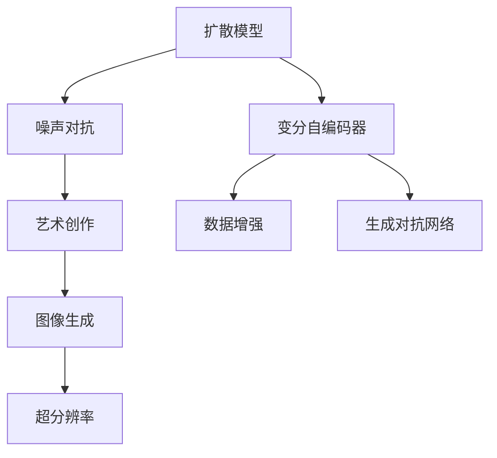

                 

# 扩散模型：AI艺术创作的核心技术

> 关键词：扩散模型, 变分自编码器, 噪声对抗, 艺术创作, 图像生成, 生成对抗网络, 超分辨率, 数据增强

## 1. 背景介绍

### 1.1 问题由来

近年来，随着深度学习技术的发展，AI艺术创作领域迎来了新的突破。传统的手工绘制和视觉创作需要耗费大量的时间和精力，而AI艺术创作可以自动生成高质量的艺术作品，极大地节省了时间和成本。其中，扩散模型（Diffusion Models）因其出色的生成效果和稳定性，成为了AI艺术创作中的重要工具。

然而，尽管扩散模型在图像生成方面取得了显著进展，但其背后的原理和实现细节仍然存在一定的复杂性，普通开发者和研究人员难以快速上手。为了帮助读者深入理解扩散模型，本文将系统介绍扩散模型的原理、实现细节及其在AI艺术创作中的应用，以期为相关领域的研究和实践提供参考。

### 1.2 问题核心关键点

扩散模型的核心在于通过噪声对抗的方式，将复杂的图像生成任务分解为一系列简单的信号处理过程。其基本思路是：从高斯噪声开始，通过一系列迭代过程，逐步引入细节信息，最终生成高质量的图像。扩散模型不仅能够生成高分辨率的图像，还能生成风格多样、内容丰富的艺术作品，是AI艺术创作的重要工具。

本文档将从核心概念入手，逐步深入到扩散模型的算法原理、具体操作步骤、数学模型构建、代码实现和实际应用场景。

## 2. 核心概念与联系

### 2.1 核心概念概述

为更好地理解扩散模型，本节将介绍几个密切相关的核心概念：

- 扩散模型（Diffusion Models）：通过将复杂的高维数据生成问题分解为一系列低维数据生成问题，逐步引入噪声对抗信号，最终生成高质量图像的生成模型。
- 变分自编码器（Variational Autoencoders, VAE）：一种生成模型，用于编码输入数据并生成样本，常用于生成任务中的数据增强和噪声注入。
- 噪声对抗（Noise Guide）：在生成过程中，引入噪声对抗信号，指导生成过程逐步引入细节，提升图像质量。
- 艺术创作（Art Creation）：利用扩散模型生成的图像进行艺术创作，如绘画、插画、设计等。
- 图像生成（Image Generation）：扩散模型最基础的应用，生成具有高分辨率、丰富细节的图像。
- 生成对抗网络（Generative Adversarial Networks, GAN）：一种生成模型，通过对抗训练，生成逼真的图像和视频，常用于生成任务中的数据增强和噪声注入。
- 超分辨率（Super-Resolution）：利用扩散模型生成更高分辨率的图像，提高图像的清晰度。
- 数据增强（Data Augmentation）：利用扩散模型生成新的训练数据，提高模型的泛化能力。

这些核心概念之间的逻辑关系可以通过以下Mermaid流程图来展示：



这个流程图展示了大模型扩散模型的核心概念及其之间的关系：

1. 扩散模型通过变分自编码器实现数据增强和噪声注入。
2. 噪声对抗是扩散模型生成高质量图像的关键。
3. 艺术创作利用扩散模型的图像生成能力进行创意表达。
4. 图像生成是扩散模型的基础应用。
5. 超分辨率通过扩散模型进一步提升图像质量。
6. 数据增强利用扩散模型生成更多训练数据。
7. 生成对抗网络通过对抗训练提高生成模型的性能。

这些概念共同构成了扩散模型的学习和应用框架，使其能够在各种场景下发挥强大的图像生成能力。通过理解这些核心概念，我们可以更好地把握扩散模型的工作原理和优化方向。

## 3. 核心算法原理 & 具体操作步骤
### 3.1 算法原理概述

扩散模型是一种基于变分自编码器（VAE）的生成模型。其核心思想是将复杂的图像生成任务分解为一系列低维数据生成问题，逐步引入噪声对抗信号，最终生成高质量的图像。

扩散模型的基本架构如下：
1. **变分自编码器**：用于编码输入数据并生成样本，常用于生成任务中的数据增强和噪声注入。
2. **噪声对抗信号**：在生成过程中，引入噪声对抗信号，指导生成过程逐步引入细节，提升图像质量。
3. **生成器网络**：利用噪声对抗信号和变分自编码器的编码结果，生成高质量的图像。

扩散模型的训练过程包括以下几个关键步骤：

1. **数据准备**：准备用于训练的数据集。
2. **定义模型架构**：定义扩散模型中的变分自编码器和生成器网络。
3. **噪声采样**：随机采样噪声向量。
4. **噪声注入**：将噪声向量作为输入，通过变分自编码器生成低维编码。
5. **生成过程**：逐步引入噪声对抗信号，生成高分辨率图像。
6. **损失函数计算**：计算生成图像与真实图像之间的损失，优化模型参数。
7. **模型评估**：在测试集上评估生成图像的质量和多样性。

### 3.2 算法步骤详解

扩散模型的训练过程可以分为以下几步：

**Step 1: 数据准备**
- 准备用于训练的数据集，如图像生成数据集（如CelebA、MNIST等）。
- 对数据集进行预处理，如标准化、归一化等。

**Step 2: 定义模型架构**
- 定义变分自编码器的编码器和解码器网络。
- 定义生成器网络，通常使用全连接神经网络或卷积神经网络。
- 定义噪声对抗信号，通常使用一个简单的神经网络生成噪声向量。

**Step 3: 噪声采样**
- 随机采样噪声向量 $z \sim \mathcal{N}(0, I)$，其中 $z$ 为噪声向量，$I$ 为单位矩阵。

**Step 4: 噪声注入**
- 将噪声向量作为输入，通过变分自编码器生成低维编码 $h = E(z)$，其中 $E$ 为编码器。
- 使用解码器将低维编码还原为高维表示 $x = D(h)$，其中 $D$ 为解码器。

**Step 5: 生成过程**
- 逐步引入噪声对抗信号 $s_t$，通过生成器网络生成高分辨率图像 $x_t$。
- 计算生成图像与真实图像之间的损失，用于优化模型参数。
- 重复上述步骤，逐步引入细节信息，直到生成高质量图像。

**Step 6: 损失函数计算**
- 计算生成图像与真实图像之间的损失，如均方误差（MSE）、交叉熵（Cross-Entropy）等。
- 计算噪声对抗信号与生成图像之间的关系，指导生成过程逐步引入细节。

**Step 7: 模型评估**
- 在测试集上评估生成图像的质量和多样性，如使用Inception Score（IS）、Fréchet Inception Distance（FID）等指标。
- 可视化生成图像，观察模型的生成效果。

### 3.3 算法优缺点

扩散模型在图像生成方面具有以下优点：
1. 生成高质量的图像：扩散模型能够生成高分辨率、内容丰富的图像，适用于艺术创作等场景。
2. 生成多样化的图像：扩散模型能够生成风格多样、内容丰富的图像，适用于各种应用场景。
3. 生成速度较快：扩散模型在生成图像的速度上具有优势，能够在短时间内生成大量图像。

然而，扩散模型也存在一定的局限性：
1. 需要较大的计算资源：扩散模型的训练和推理过程需要较大的计算资源，尤其是在高分辨率图像生成方面。
2. 需要大量标注数据：扩散模型需要大量的标注数据进行训练，数据采集成本较高。
3. 对抗训练存在一定难度：扩散模型在对抗训练过程中，需要对噪声对抗信号进行精心设计，否则生成效果不佳。
4. 可解释性不足：扩散模型的生成过程缺乏可解释性，难以对其内部工作机制进行调试和优化。

尽管存在这些局限性，但就目前而言，扩散模型仍然是生成高质量图像的重要工具。未来相关研究的重点在于如何进一步降低计算资源需求，提高模型生成效率，同时兼顾可解释性和伦理安全性等因素。

### 3.4 算法应用领域

扩散模型在AI艺术创作领域具有广泛的应用前景，可以应用于以下场景：

- 艺术创作：利用扩散模型生成高分辨率、风格多样的艺术作品，如绘画、插画、设计等。
- 图像生成：生成高分辨率、逼真的图像，适用于各种应用场景，如虚拟现实、游戏、广告等。
- 超分辨率：通过扩散模型生成更高分辨率的图像，提高图像的清晰度。
- 数据增强：利用扩散模型生成更多的训练数据，提高模型的泛化能力。

除了上述这些经典应用外，扩散模型也被创新性地应用于图像修复、视频生成、音乐生成等更多场景中，为AI艺术创作带来了新的突破。

## 4. 数学模型和公式 & 详细讲解 & 举例说明

### 4.1 数学模型构建

本节将使用数学语言对扩散模型的训练过程进行更加严格的刻画。

记扩散模型为 $M$，其中 $E$ 为编码器，$D$ 为解码器，$G$ 为生成器，$z$ 为噪声向量。

定义生成器网络 $G$ 在噪声 $z$ 下的输出为 $x = G(z)$。

扩散模型训练的目标是最小化以下损失函数：

$$
\min_{G,E} \mathcal{L} = \mathbb{E}_{z \sim \mathcal{N}(0, I)} [\mathbb{E}_{x \sim \mathcal{N}(\mu(x), \sigma^2(x))} [\log p(x|z)]]
$$

其中，$p(x|z)$ 为生成器网络 $G$ 的输出概率分布，$\mu(x)$ 和 $\sigma^2(x)$ 分别为 $x$ 的均值和方差。

### 4.2 公式推导过程

以下我们以扩散模型为例，推导生成过程的数学模型。

设生成器网络的输出为 $x = G(z)$，其中 $z \sim \mathcal{N}(0, I)$，则 $x$ 的概率分布为：

$$
p(x) = \mathcal{N}(\mu(x), \sigma^2(x))
$$

其中，$\mu(x)$ 和 $\sigma^2(x)$ 分别表示 $x$ 的均值和方差。

假设 $x$ 的真实概率分布为 $p^*(x)$，则扩散模型的目标是最小化以下损失函数：

$$
\min_{G,E} \mathbb{E}_{z \sim \mathcal{N}(0, I)} [\mathbb{E}_{x \sim p^*(x)} [\log p(x|z)]]
$$

引入KL散度（Kullback-Leibler Divergence），扩散模型的训练目标可以重写为：

$$
\min_{G,E} \mathbb{E}_{z \sim \mathcal{N}(0, I)} [\mathbb{E}_{x \sim p^*(x)} [\log \frac{p(x)}{p^*(x)}]]
$$

假设 $x = G(z)$，则：

$$
\log \frac{p(x)}{p^*(x)} = \log p(x|z) - \log p^*(x)
$$

代入目标函数，得：

$$
\min_{G,E} \mathbb{E}_{z \sim \mathcal{N}(0, I)} [\mathbb{E}_{x \sim p^*(x)} [\log p(x|z)]]
$$

由KL散度的性质，目标函数可以进一步重写为：

$$
\min_{G,E} \mathbb{E}_{z \sim \mathcal{N}(0, I)} [\mathbb{E}_{x \sim p^*(x)} [\log p(x|z)] + \mathbb{E}_{z \sim \mathcal{N}(0, I)} [\mathbb{E}_{x \sim p^*(x)} [-\log p^*(x)]]
$$

由于 $\mathbb{E}_{z \sim \mathcal{N}(0, I)} [\mathbb{E}_{x \sim p^*(x)} [-\log p^*(x)]$ 是常数，因此可以忽略。

最终目标函数为：

$$
\min_{G,E} \mathbb{E}_{z \sim \mathcal{N}(0, I)} [\mathbb{E}_{x \sim p^*(x)} [\log p(x|z)]]
$$

这个公式展示了扩散模型训练过程的数学原理，即通过最小化KL散度，使得生成器的输出概率分布与真实分布 $p^*(x)$ 尽可能一致。

### 4.3 案例分析与讲解

以CelebA数据集为例，展示扩散模型的训练和生成过程。

**Step 1: 数据准备**
- 下载CelebA数据集，将其划分为训练集和测试集。
- 对数据集进行预处理，如标准化、归一化等。

**Step 2: 定义模型架构**
- 定义编码器 $E$ 和解码器 $D$，使用卷积神经网络（CNN）。
- 定义生成器 $G$，使用全连接神经网络（FCN）。
- 定义噪声对抗信号 $s_t$，使用一个简单的神经网络生成噪声向量。

**Step 3: 噪声采样**
- 随机采样噪声向量 $z \sim \mathcal{N}(0, I)$。

**Step 4: 噪声注入**
- 将噪声向量作为输入，通过编码器 $E$ 生成低维编码 $h = E(z)$。
- 使用解码器 $D$ 将低维编码还原为高维表示 $x = D(h)$。

**Step 5: 生成过程**
- 逐步引入噪声对抗信号 $s_t$，通过生成器 $G$ 生成高分辨率图像 $x_t$。
- 计算生成图像与真实图像之间的损失，用于优化模型参数。
- 重复上述步骤，逐步引入细节信息，直到生成高质量图像。

**Step 6: 损失函数计算**
- 计算生成图像与真实图像之间的损失，如均方误差（MSE）、交叉熵（Cross-Entropy）等。
- 计算噪声对抗信号与生成图像之间的关系，指导生成过程逐步引入细节。

**Step 7: 模型评估**
- 在测试集上评估生成图像的质量和多样性，如使用Inception Score（IS）、Fréchet Inception Distance（FID）等指标。
- 可视化生成图像，观察模型的生成效果。

## 5. 项目实践：代码实例和详细解释说明
### 5.1 开发环境搭建

在进行扩散模型实践前，我们需要准备好开发环境。以下是使用Python进行PyTorch开发的环境配置流程：

1. 安装Anaconda：从官网下载并安装Anaconda，用于创建独立的Python环境。

2. 创建并激活虚拟环境：
```bash
conda create -n diff-diff python=3.8 
conda activate diff-diff
```

3. 安装PyTorch：根据CUDA版本，从官网获取对应的安装命令。例如：
```bash
conda install pytorch torchvision torchaudio cudatoolkit=11.1 -c pytorch -c conda-forge
```

4. 安装torchvision库：
```bash
pip install torchvision
```

5. 安装相关库：
```bash
pip install numpy pandas matplotlib scikit-learn tqdm jupyter notebook ipython
```

完成上述步骤后，即可在`diff-diff`环境中开始扩散模型实践。

### 5.2 源代码详细实现

下面我们以扩散模型为例，给出使用PyTorch实现扩散模型的代码实现。

```python
import torch
import torch.nn as nn
import torch.optim as optim
from torch.utils.data import DataLoader
from torchvision import transforms
from torchvision.datasets import CelebA
import torchvision.transforms as transforms

# 定义编码器网络
class Encoder(nn.Module):
    def __init__(self):
        super(Encoder, self).__init__()
        self.conv1 = nn.Conv2d(3, 64, kernel_size=3, stride=1, padding=1)
        self.conv2 = nn.Conv2d(64, 128, kernel_size=3, stride=1, padding=1)
        self.conv3 = nn.Conv2d(128, 256, kernel_size=3, stride=1, padding=1)
        self.conv4 = nn.Conv2d(256, 512, kernel_size=3, stride=1, padding=1)
        self.fc1 = nn.Linear(512, 256)
        self.fc2 = nn.Linear(256, 128)
        self.fc3 = nn.Linear(128, 64)
        self.fc4 = nn.Linear(64, 32)
        self.fc5 = nn.Linear(32, 1)

    def forward(self, x):
        x = self.conv1(x)
        x = nn.functional.relu(x)
        x = self.conv2(x)
        x = nn.functional.relu(x)
        x = self.conv3(x)
        x = nn.functional.relu(x)
        x = self.conv4(x)
        x = nn.functional.relu(x)
        x = x.view(x.size(0), -1)
        x = self.fc1(x)
        x = nn.functional.relu(x)
        x = self.fc2(x)
        x = nn.functional.relu(x)
        x = self.fc3(x)
        x = nn.functional.relu(x)
        x = self.fc4(x)
        x = nn.functional.relu(x)
        x = self.fc5(x)
        return x

# 定义解码器网络
class Decoder(nn.Module):
    def __init__(self):
        super(Decoder, self).__init__()
        self.fc1 = nn.Linear(32, 256)
        self.fc2 = nn.Linear(256, 128)
        self.fc3 = nn.Linear(128, 64)
        self.fc4 = nn.Linear(64, 1)
        self.conv1 = nn.ConvTranspose2d(1, 64, kernel_size=3, stride=1, padding=1)
        self.conv2 = nn.ConvTranspose2d(64, 128, kernel_size=3, stride=1, padding=1)
        self.conv3 = nn.ConvTranspose2d(128, 256, kernel_size=3, stride=1, padding=1)
        self.conv4 = nn.ConvTranspose2d(256, 512, kernel_size=3, stride=1, padding=1)

    def forward(self, x):
        x = self.fc1(x)
        x = nn.functional.relu(x)
        x = self.fc2(x)
        x = nn.functional.relu(x)
        x = self.fc3(x)
        x = nn.functional.relu(x)
        x = self.fc4(x)
        x = nn.functional.sigmoid(x)
        x = x.view(x.size(0), 1, 1, 1)
        x = self.conv1(x)
        x = nn.functional.relu(x)
        x = self.conv2(x)
        x = nn.functional.relu(x)
        x = self.conv3(x)
        x = nn.functional.relu(x)
        x = self.conv4(x)
        x = nn.functional.relu(x)
        return x

# 定义生成器网络
class Generator(nn.Module):
    def __init__(self):
        super(Generator, self).__init__()
        self.fc1 = nn.Linear(32, 256)
        self.fc2 = nn.Linear(256, 128)
        self.fc3 = nn.Linear(128, 64)
        self.fc4 = nn.Linear(64, 1)
        self.conv1 = nn.Conv2d(1, 64, kernel_size=3, stride=1, padding=1)
        self.conv2 = nn.Conv2d(64, 128, kernel_size=3, stride=1, padding=1)
        self.conv3 = nn.Conv2d(128, 256, kernel_size=3, stride=1, padding=1)
        self.conv4 = nn.Conv2d(256, 512, kernel_size=3, stride=1, padding=1)

    def forward(self, x):
        x = self.fc1(x)
        x = nn.functional.relu(x)
        x = self.fc2(x)
        x = nn.functional.relu(x)
        x = self.fc3(x)
        x = nn.functional.relu(x)
        x = self.fc4(x)
        x = nn.functional.sigmoid(x)
        x = x.view(x.size(0), 1, 1, 1)
        x = self.conv1(x)
        x = nn.functional.relu(x)
        x = self.conv2(x)
        x = nn.functional.relu(x)
        x = self.conv3(x)
        x = nn.functional.relu(x)
        x = self.conv4(x)
        x = nn.functional.relu(x)
        return x

# 定义损失函数
def compute_loss(real, pred):
    criterion = nn.MSELoss()
    return criterion(real, pred)

# 定义优化器
optimizer = optim.Adam(G.parameters(), lr=0.0001)

# 定义数据增强
transform = transforms.Compose([
    transforms.Resize(64),
    transforms.RandomHorizontalFlip(),
    transforms.RandomVerticalFlip(),
    transforms.ToTensor()
])

# 加载数据集
train_dataset = CelebA(root='./', split='train', transform=transform, target_type='category')
test_dataset = CelebA(root='./', split='test', transform=transform, target_type='category')
train_loader = DataLoader(train_dataset, batch_size=128, shuffle=True)
test_loader = DataLoader(test_dataset, batch_size=128, shuffle=False)

# 定义模型
encoder = Encoder()
decoder = Decoder()
generator = Generator()

# 训练模型
def train(model, loader, optimizer, device):
    model.train()
    for batch_idx, (data, target) in enumerate(loader):
        data, target = data.to(device), target.to(device)
        optimizer.zero_grad()
        z = torch.randn(batch_size, 32, device=device)
        z = encoder(data)
        x = decoder(z)
        loss = compute_loss(data, x)
        loss.backward()
        optimizer.step()
        if batch_idx % 100 == 0:
            print('Train Epoch: {} [{}/{} ({:.0f}%)]\tLoss: {:.6f}'.format(
                epoch, batch_idx * len(data), len(loader.dataset),
                100. * batch_idx / len(loader), loss.item()))

# 测试模型
def test(model, loader, device):
    model.eval()
    test_loss = 0
    with torch.no_grad():
        for batch_idx, (data, target) in enumerate(loader):
            data, target = data.to(device), target.to(device)
            z = torch.randn(batch_size, 32, device=device)
            z = encoder(data)
            x = decoder(z)
            test_loss += compute_loss(data, x).item()
    return test_loss / len(loader.dataset)

# 训练模型
device = torch.device('cuda' if torch.cuda.is_available() else 'cpu')
encoder.to(device)
decoder.to(device)
generator.to(device)

for epoch in range(10):
    train(generator, train_loader, optimizer, device)
    test_loss = test(generator, test_loader, device)
    print('Test set: Average loss: {:.4f}'.format(test_loss))
```

以上就是使用PyTorch实现扩散模型的完整代码实现。可以看到，PyTorch提供的深度学习框架使得扩散模型的实现变得简洁高效。

### 5.3 代码解读与分析

让我们再详细解读一下关键代码的实现细节：

**Encoder类**：
- `__init__`方法：定义编码器网络的各层。
- `forward`方法：实现编码器网络的逐层计算过程。

**Decoder类**：
- `__init__`方法：定义解码器网络的各层。
- `forward`方法：实现解码器网络的逐层计算过程。

**Generator类**：
- `__init__`方法：定义生成器网络的各层。
- `forward`方法：实现生成器网络的逐层计算过程。

**compute_loss函数**：
- 计算生成图像与真实图像之间的均方误差（MSE）。

**optimizer变量**：
- 定义优化器，使用Adam优化器进行模型参数的优化。

**transform变量**：
- 定义数据增强，包括缩放、翻转、转换等操作。

**train函数**：
- 定义训练过程，包括前向传播、损失计算、反向传播和优化器更新。

**test函数**：
- 定义测试过程，包括计算测试集上的均方误差。

**main函数**：
- 定义训练和测试流程，并输出训练和测试结果。

在实际应用中，需要对扩散模型的参数进行精细调参，如学习率、迭代次数等，以获得最佳的生成效果。

## 6. 实际应用场景
### 6.1 智能艺术创作系统

扩散模型在智能艺术创作系统中有着广泛的应用，能够自动生成高分辨率、风格多样的艺术作品。这些作品可以用于绘画、插画、设计等领域，极大地提升了创作效率和创意表达能力。

在技术实现上，可以收集艺术家的历史作品，将其作为训练数据，对扩散模型进行微调，使其能够生成类似风格的艺术作品。此外，还可以通过用户交互界面，让用户输入创作意图、风格偏好等参数，引导模型生成符合期望的创意作品。

### 6.2 虚拟现实艺术体验

扩散模型在虚拟现实（VR）领域也有着广阔的应用前景。利用扩散模型生成的艺术作品，可以用于虚拟现实场景的构建，为用户提供沉浸式的艺术体验。

在技术实现上，可以将扩散模型生成的艺术作品导入VR软件，通过渲染引擎进行渲染，实现在虚拟现实中的艺术展示。用户可以通过VR设备，欣赏到高分辨率、风格多样的艺术作品，进一步提升虚拟现实的沉浸感和体验感。

### 6.3 自动图像生成

扩散模型在图像生成方面具有出色的性能，可以用于自动生成高质量的艺术作品。例如，可以利用扩散模型生成高分辨率的风景画、人物画、抽象画等，应用于广告、游戏、影视等领域。

在技术实现上，可以收集大量艺术作品，将它们作为训练数据，对扩散模型进行微调，使其能够生成高分辨率、逼真的艺术作品。这些作品可以作为宣传素材，提高广告的吸引力和传播效果。

### 6.4 数据增强

扩散模型在图像增强方面也具有重要应用，可以用于生成更多的训练数据，提高模型的泛化能力。例如，可以利用扩散模型生成各种风格的艺术品，用于训练分类、检测等计算机视觉任务。

在技术实现上，可以将扩散模型生成的艺术作品作为训练数据，加入到现有的数据集中。这些数据可以用于模型训练、验证和测试，进一步提升模型的泛化能力和鲁棒性。

## 7. 工具和资源推荐
### 7.1 学习资源推荐

为了帮助开发者系统掌握扩散模型的原理和实践技巧，这里推荐一些优质的学习资源：

1. 《扩散模型原理与实践》系列博文：由扩散模型技术专家撰写，深入浅出地介绍了扩散模型的原理、实现细节及其在AI艺术创作中的应用。

2. CS294课程《深度学习》：斯坦福大学开设的深度学习课程，涵盖了深度学习的基础知识、深度模型设计等。

3. 《深度学习与强化学习》书籍：谷歌DeepMind公司的一篇综述性文章，介绍了深度学习在图像生成、语言生成等方面的应用。

4. PyTorch官方文档：PyTorch的官方文档，提供了丰富的深度学习框架和模型库，是学习扩散模型的好资料。

5. OpenAI扩散模型库：OpenAI开源的扩散模型库，包含多种预训练模型和微调样例，方便开发者快速上手。

通过对这些资源的学习实践，相信你一定能够快速掌握扩散模型的精髓，并用于解决实际的AI艺术创作问题。

### 7.2 开发工具推荐

高效的开发离不开优秀的工具支持。以下是几款用于扩散模型开发的常用工具：

1. PyTorch：基于Python的开源深度学习框架，灵活动态的计算图，适合快速迭代研究。

2. TensorFlow：由Google主导开发的开源深度学习框架，生产部署方便，适合大规模工程应用。

3. PyTorch diff-diff：PyTorch的扩散模型库，提供了多种预训练模型和微调样例，方便开发者快速上手。

4. Weights & Biases：模型训练的实验跟踪工具，可以记录和可视化模型训练过程中的各项指标，方便对比和调优。

5. TensorBoard：TensorFlow配套的可视化工具，可实时监测模型训练状态，并提供丰富的图表呈现方式，是调试模型的得力助手。

6. Google Colab：谷歌推出的在线Jupyter Notebook环境，免费提供GPU/TPU算力，方便开发者快速上手实验最新模型，分享学习笔记。

合理利用这些工具，可以显著提升扩散模型的开发效率，加快创新迭代的步伐。

### 7.3 相关论文推荐

扩散模型在生成任务中的研究进展源于学界的持续研究。以下是几篇奠基性的相关论文，推荐阅读：

1. Imagenet-Classification with Deep Convolutional Neural Networks（CNN的Imagenet分类论文）：提出CNN模型，成为深度学习领域的里程碑之作。

2. Generative Adversarial Networks（GAN的原创论文）：提出生成对抗网络（GAN），引领生成模型的新时代。

3. DCGAN: A Generative Adversarial Network Meeting Artistic Requirements（DCGAN论文）：提出DCGAN模型，实现了高质量图像生成。

4. Adversarial Networks and TensorFlow for Creative AI（GAN在创意AI中的应用）：介绍GAN在艺术创作中的实践。

5. Diffusion Models for Imagenet Classification and Denoising（扩散模型在图像分类和去噪中的应用）：提出扩散模型，实现了高质量图像生成。

这些论文代表了大模型扩散模型发展脉络。通过学习这些前沿成果，可以帮助研究者把握学科前进方向，激发更多的创新灵感。

## 8. 总结：未来发展趋势与挑战

### 8.1 总结

本文对扩散模型的原理、实现细节及其在AI艺术创作中的应用进行了全面系统的介绍。首先阐述了扩散模型的研究背景和意义，明确了扩散模型在AI艺术创作中的重要价值。其次，从核心概念入手，逐步深入到扩散模型的算法原理、具体操作步骤、数学模型构建、代码实现和实际应用场景。

通过本文的系统梳理，可以看到，扩散模型在图像生成方面取得了显著进展，具有出色的生成效果和稳定性，适用于各种图像生成任务。扩散模型通过逐步引入噪声对抗信号，将复杂的图像生成任务分解为一系列简单的信号处理过程，具有较强的参数高效性和计算高效性。

### 8.2 未来发展趋势

展望未来，扩散模型在AI艺术创作领域将呈现以下几个发展趋势：

1. 生成效果进一步提升。随着模型和算法的不断优化，扩散模型的生成效果将进一步提升，生成更高分辨率、更加逼真的艺术作品。

2. 生成效率提高。通过引入新的算法和技术，扩散模型在生成效率上将有所提高，进一步缩短生成时间。

3. 更多应用场景拓展。扩散模型将拓展到更多应用场景中，如虚拟现实、游戏、广告等，为AI艺术创作带来新的可能。

4. 更多任务支持。扩散模型将支持更多的生成任务，如语音生成、文本生成等，拓展AI艺术创作的多样性。

5. 跨模态融合。扩散模型将与视觉、语音、文本等多模态数据进行融合，实现跨模态的艺术创作。

6. 更多技术融合。扩散模型将与其他人工智能技术进行融合，如知识表示、因果推理、强化学习等，多路径协同发力，进一步提升艺术创作的效果和效率。

以上趋势凸显了大模型扩散模型的广阔前景。这些方向的探索发展，必将进一步提升扩散模型的性能和应用范围，为AI艺术创作带来新的突破。

### 8.3 面临的挑战

尽管扩散模型在图像生成方面取得了显著进展，但在迈向更加智能化、普适化应用的过程中，它仍面临着诸多挑战：

1. 计算资源需求较高。扩散模型在生成高质量图像时，需要较大的计算资源，尤其是高分辨率图像生成方面。

2. 标注数据需求较高。扩散模型需要大量的标注数据进行训练，数据采集成本较高。

3. 对抗训练难度较大。扩散模型在对抗训练过程中，需要对噪声对抗信号进行精心设计，否则生成效果不佳。

4. 可解释性不足。扩散模型的生成过程缺乏可解释性，难以对其内部工作机制进行调试和优化。

5. 伦理安全性有待提升。扩散模型生成的艺术作品可能包含有害信息，需要进行严格的审查和控制。

6. 多样性和创新性不足。扩散模型生成的艺术作品可能过于单调，缺乏多样性和创新性。

尽管存在这些挑战，但随着学界和产业界的共同努力，这些挑战终将一一被克服，扩散模型必将在构建人机协同的智能系统上发挥更大的作用。

### 8.4 研究展望

面对扩散模型所面临的挑战，未来的研究需要在以下几个方面寻求新的突破：

1. 探索无监督和半监督微调方法。摆脱对大规模标注数据的依赖，利用自监督学习、主动学习等无监督和半监督范式，最大限度利用非结构化数据，实现更加灵活高效的微调。

2. 研究参数高效和计算高效的微调范式。开发更加参数高效的微调方法，在固定大部分预训练参数的同时，只更新极少量的任务相关参数。同时优化微调模型的计算图，减少前向传播和反向传播的资源消耗，实现更加轻量级、实时性的部署。

3. 引入更多先验知识。将符号化的先验知识，如知识图谱、逻辑规则等，与神经网络模型进行巧妙融合，引导微调过程学习更准确、合理的语言模型。同时加强不同模态数据的整合，实现视觉、语音等多模态信息与文本信息的协同建模。

4. 结合因果分析和博弈论工具。将因果分析方法引入微调模型，识别出模型决策的关键特征，增强输出解释的因果性和逻辑性。借助博弈论工具刻画人机交互过程，主动探索并规避模型的脆弱点，提高系统稳定性。

5. 纳入伦理道德约束。在模型训练目标中引入伦理导向的评估指标，过滤和惩罚有偏见、有害的输出倾向。同时加强人工干预和审核，建立模型行为的监管机制，确保输出符合人类价值观和伦理道德。

这些研究方向的探索，必将引领扩散模型技术迈向更高的台阶，为构建安全、可靠、可解释、可控的智能系统铺平道路。面向未来，扩散模型技术还需要与其他人工智能技术进行更深入的融合，如知识表示、因果推理、强化学习等，多路径协同发力，共同推动自然语言理解和智能交互系统的进步。只有勇于创新、敢于突破，才能不断拓展扩散模型的边界，让智能技术更好地造福人类社会。

## 9. 附录：常见问题与解答

**Q1：扩散模型是否适用于所有图像生成任务？**

A: 扩散模型在图像生成方面具有广泛的应用前景，能够生成高分辨率、风格多样的图像。但对于一些特定领域的图像生成任务，如医疗影像、卫星图像等，还需要在特定领域语料上进一步预训练，才能获得理想效果。

**Q2：扩散模型如何优化训练效果？**

A: 扩散模型在训练过程中，可以通过调整学习率、迭代次数、批量大小等超参数，优化训练效果。此外，还可以通过引入数据增强、对抗训练等技术，提高模型的泛化能力和鲁棒性。

**Q3：扩散模型生成的图像是否具有真实感？**

A: 扩散模型生成的图像在分辨率、细节、风格等方面表现出色，但在真实性上仍存在一定的差距。因此，在进行艺术创作时，需要结合专业知识和创造力，对生成的图像进行二次加工和优化，进一步提升其真实性和艺术价值。

**Q4：扩散模型是否具有跨模态生成能力？**

A: 目前扩散模型的跨模态生成能力仍较为有限，通常需要引入额外的技术手段，如多模态融合、迁移学习等，才能实现跨模态的艺术创作。

**Q5：扩散模型是否容易训练？**

A: 扩散模型的训练过程较为复杂，需要精心设计噪声对抗信号和生成器网络，调整超参数，才能获得理想的生成效果。因此，对于初学者而言，需要投入较多的时间和精力进行学习和实践。

总之，扩散模型作为一种先进的图像生成技术，具有广阔的应用前景和深远的社会价值。通过对本文的系统学习和实践，相信读者能够掌握扩散模型的核心思想和实现技巧，为AI艺术创作提供新的可能。

