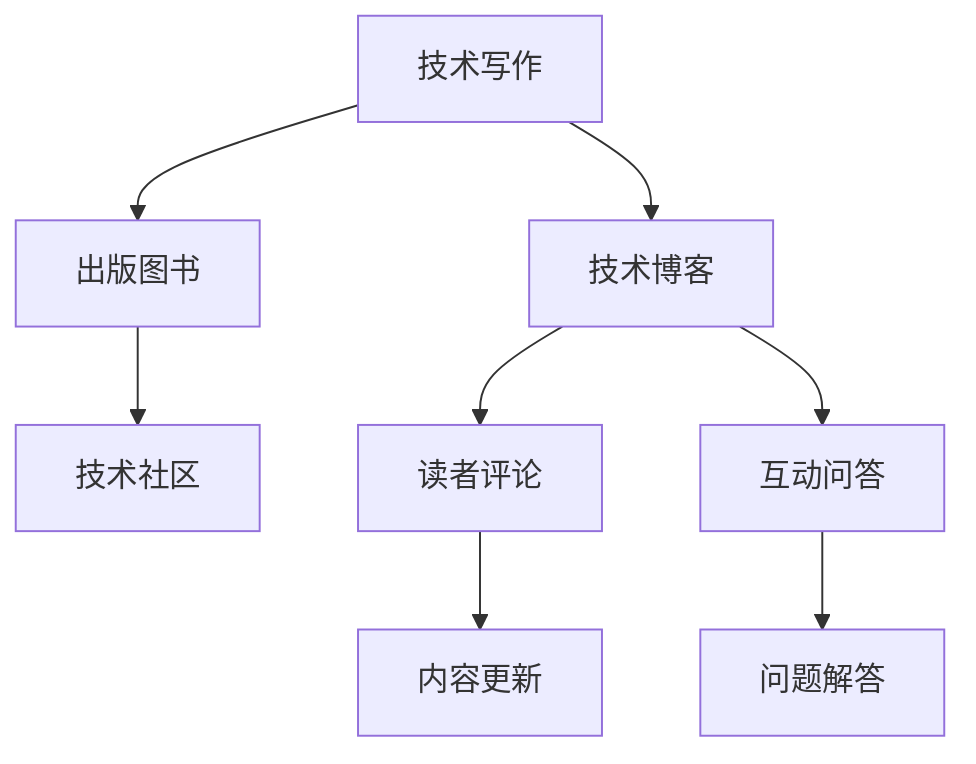

                 

# 技术写作：从博客到出版图书

> 关键词：技术写作, 出版图书, 博客, 学术研究, 内容创作, 技术传播, 内容管理系统, 技术博客平台

## 1. 背景介绍

### 1.1 问题由来

在现代信息技术快速发展的今天，技术写作成为了连接技术创新与大众理解的重要桥梁。无论是软件开发、人工智能、网络安全还是云计算等领域，技术的深度和广度日益增加，使得受众理解和传播变得更加困难。如何高效、准确地将复杂的学术研究和工程实践转化为易读、易懂、有价值的知识内容，成为了技术传播的关键问题。

### 1.2 问题核心关键点

技术写作不仅仅是简单的翻译和描述，更是需要将复杂的理论和技术转化为易于理解和应用的知识。成功的技术写作需要具备以下几个关键点：

1. **清晰的逻辑结构**：确保文章条理清晰，易于跟随。
2. **简明的语言风格**：使用简明扼要的语言，避免过度技术术语，便于非专业人士理解。
3. **实用的示例和案例**：通过实际应用场景和案例，帮助读者更好地理解技术原理和应用方法。
4. **互动和反馈**：通过评论、问答等形式，与读者互动，及时反馈读者的疑惑，促进内容的迭代完善。
5. **持续更新和维护**：技术不断进步，需要定期更新内容，保持知识的最新性。

### 1.3 问题研究意义

技术写作的重要性不言而喻，它不仅提升了技术知识的传播效率，还推动了技术创新和应用的普及。通过技术写作，学术研究和技术实践得以跨越时间和空间，为更多的人带来启发和思考。同时，高质量的技术写作还能增强技术产品的市场竞争力，促进技术的产业化发展。

## 2. 核心概念与联系

### 2.1 核心概念概述

技术写作与技术博客、技术出版图书紧密相关，这些概念之间存在密切联系。

- **技术写作**：通过文字、图表、视频等多种形式，将技术原理、应用实践、最新研究等转化为易于理解的内容。
- **技术博客**：一种持续更新的在线内容平台，便于技术作者定期发布最新研究成果和应用案例。
- **出版图书**：将经过深入研究、精心挑选的内容整合并印刷成册，便于系统学习和技术积累。

这些概念共同构成了一个技术知识传播和积累的系统，促进了技术的传播和应用。

### 2.2 核心概念原理和架构的 Mermaid 流程图



这个流程图展示了技术写作、博客、图书之间的联系和互动过程：

1. 技术写作是技术博客和出版图书的基础内容来源。
2. 技术博客和出版图书的内容通过读者互动和问题解答不断更新和完善。
3. 读者反馈和社区交流进一步丰富了技术知识的内容和形式。

这些互动环节保证了技术内容的持续更新和传播，使得技术写作和出版更加具有生命力和影响力。

## 3. 核心算法原理 & 具体操作步骤

### 3.1 算法原理概述

技术写作的过程可以类比为一种“算法”，即通过特定的方法和步骤，将技术知识转换为可理解、可应用的内容。这个“算法”的核心在于：

- **目标定义**：明确写作目标，如教育、引导、宣传等。
- **内容选择**：选择关键技术点和应用场景，进行有针对性的讲解。
- **语言转换**：将专业术语和复杂概念转换为通俗易懂的语言。
- **形式呈现**：使用图表、代码片段、示例等形式丰富内容表达。
- **互动反馈**：通过评论、问答等形式收集读者反馈，持续优化内容。

### 3.2 算法步骤详解

技术写作的步骤可以分为以下几个环节：

**Step 1: 选题和规划**

- **选题**：根据受众需求和自身研究，确定写作主题。
- **规划**：制定详细的写作计划，包括时间安排、内容结构、发布频率等。

**Step 2: 内容创作**

- **撰写**：使用简洁明了的语言，描述技术原理、实现细节、应用案例等。
- **校对**：多次校对和修订，确保内容准确无误。
- **审稿**：邀请同行专家审阅，提出改进建议。

**Step 3: 形式设计**

- **排版**：使用工具如Markdown、LaTeX等进行格式设计。
- **多媒体**：插入图表、代码片段、视频等多媒体元素，丰富内容表现力。
- **互动元素**：增加评论框、问答区等互动元素，促进读者参与。

**Step 4: 发布与推广**

- **上线**：将内容发布到博客平台或出版平台。
- **推广**：利用社交媒体、邮件列表等手段进行推广，扩大影响力。
- **反馈**：收集读者反馈，持续优化内容。

**Step 5: 更新与维护**

- **更新**：根据技术进展和新发现，定期更新内容。
- **维护**：确保内容和技术实现的一致性，及时修正错误。
- **备份**：备份重要数据，防止内容丢失。

### 3.3 算法优缺点

技术写作的优势在于其信息传递的高效性和内容的系统性，缺点则在于其时间和精力的投入较大，需要持续的创新和优化。

**优点**：

- **易于传播**：通过互联网和出版平台，技术内容能够快速传播到全球各地。
- **系统全面**：能够提供深入的技术讲解和系统化的学习路径。
- **互动性强**：通过互动反馈，能够及时收集读者意见，优化内容。

**缺点**：

- **时间和精力投入大**：从选题、撰写到发布，每一个环节都需要精心准备。
- **可能存在技术滞后**：更新速度较慢，可能无法及时反映最新技术进展。
- **质量控制难度大**：高质量内容的制作需要专业知识和丰富经验。

### 3.4 算法应用领域

技术写作和博客、出版图书的应用领域广泛，包括但不限于以下几方面：

- **软件开发**：撰写开发指南、API文档、代码示例等，帮助开发者理解和使用技术。
- **人工智能**：发布研究论文、算法实现、应用案例等，推动人工智能技术的普及和应用。
- **网络安全**：撰写安全指南、防护策略、漏洞分析等，增强网络安全意识和防护能力。
- **大数据**：撰写数据处理、分析、可视化等技术指南，促进大数据技术的普及。
- **云计算**：撰写云服务使用手册、开发教程、性能调优等，推动云计算技术的落地应用。

## 4. 数学模型和公式 & 详细讲解 & 举例说明

### 4.1 数学模型构建

技术写作可以构建一个简单数学模型，用于描述内容创作和传播的整个过程。假设技术写作为一个时间序列过程 $T(t)$，其中 $t$ 表示时间，$T(t)$ 表示在时间 $t$ 时，内容发布到读者侧的总量。该过程可以分为三个阶段：创作阶段、发布阶段和反馈阶段。

**创作阶段**：在 $t_1$ 到 $t_2$ 期间，内容从零开始创作，创作速度为 $k$，表示每天创作内容的比例。

**发布阶段**：在 $t_2$ 到 $t_3$ 期间，内容从创作完成后发布到读者侧，发布速度为 $m$，表示每天发布的比例。

**反馈阶段**：在 $t_3$ 到 $t_4$ 期间，读者反馈和评论影响内容的质量和数量，反馈比例为 $n$，表示每天新增的反馈占总反馈的比例。

**总体模型**：

$$
T(t) = 
\begin{cases} 
k(t-t_1), & t_1 \leq t < t_2 \\
k(t_2-t_1) + m(t-t_2), & t_2 \leq t < t_3 \\
k(t_2-t_1) + m(t_2-t_1) + n(t_3-t_2), & t_3 \leq t < t_4 
\end{cases}
$$

### 4.2 公式推导过程

在上述模型中，我们可以推导出内容的总量和反馈量的计算公式。假设 $t_1=0$，即内容创作开始时，我们有：

- 创作总量：$k(t_2-t_1)$
- 发布总量：$m(t_3-t_2)$
- 反馈总量：$n(t_4-t_3)$

因此，内容的总发布量为：

$$
T(t) = k(t_2-t_1) + m(t-t_2) + n(t_3-t_2)
$$

通过上述公式，可以计算任意时间点内容发布和反馈的量，评估内容传播的效率和效果。

### 4.3 案例分析与讲解

以某技术博客为例，假设每天创作1篇文章，发布1篇文章，每天新增的评论占总评论的10%，则内容发布和反馈的数学模型如下：

- 创作总量：$t_2=7$，创作7天
- 发布总量：$t_3=14$，发布7天
- 反馈总量：$t_4=21$，反馈7天

在 $t=14$ 时，内容的总发布量为：

$$
T(14) = k \times 7 + m \times 7 + n \times 7 = 7k + 7m + 0.1 \times 7m = 7(k+m+0.1m)
$$

假设 $k=0.2, m=0.3$，则：

$$
T(14) = 7(0.2+0.3+0.1 \times 0.3) = 7 \times 0.55 = 3.85
$$

这表示在14天内，博客发布和反馈的总内容量为3.85，假设每篇文章有100个读者，则总共影响了385名读者。

## 5. 项目实践：代码实例和详细解释说明

### 5.1 开发环境搭建

为了便于技术写作和博客发布，我们可以选择一些常用的开发工具和平台，例如：

- **开发工具**：Visual Studio Code、Sublime Text、Atom等编辑器。
- **代码托管**：GitHub、GitLab、Bitbucket等平台。
- **内容管理系统**：WordPress、Drupal、Joomla等。
- **博客平台**：Medium、CSDN、简书等。

这里以使用GitHub作为代码托管，WordPress作为内容管理系统，Medium作为博客平台的例子进行说明。

**开发环境搭建步骤**：

1. 安装Git：从官网下载并安装Git，配置本地仓库和远程仓库。
2. 创建Git仓库：在本地创建仓库，初始化Git，并上传至GitHub。
3. 安装WordPress：在本地安装WordPress，配置数据库和站点。
4. 连接GitHub仓库：在WordPress后台，连接GitHub仓库，以便自动同步本地内容。

### 5.2 源代码详细实现

以下是一个使用Python实现的简单技术博客系统，包括内容创作、发布和反馈模块。

```python
# 内容创作模块
import time

class Content:
    def __init__(self, title, content, tags):
        self.title = title
        self.content = content
        self.tags = tags
        self.comments = []
    
    def publish(self):
        print(f"Publishing: {self.title}")
    
    def add_comment(self, comment):
        self.comments.append(comment)
        print(f"Added comment: {comment}")

# 发布模块
class Publisher:
    def __init__(self, blog_url):
        self.blog_url = blog_url
    
    def publish_content(self, content):
        content.publish()
        print(f"Published to: {self.blog_url}")
    
    def add_feedback(self, content, feedback):
        content.add_comment(feedback)
        print(f"Added feedback: {feedback}")

# 主程序
if __name__ == "__main__":
    content = Content("Python数据科学", "Python is great for data science.", ["Python", "data science"])
    publisher = Publisher("https://medium.com")
    
    for i in range(7):
        publisher.publish_content(content)
        time.sleep(24*60*60)
        publisher.add_feedback(content, f"Comment {i+1} on {content.title}")
    
    print(f"Total content published: {i+1}")
```

**代码解释**：

- **Content类**：表示一篇技术博客内容，包含标题、内容、标签和评论。
- **Publisher类**：表示博客发布者，负责将内容发布到指定平台，并添加反馈。
- **主程序**：循环7天，每天发布一篇博客，并在次日上午添加评论。

### 5.3 代码解读与分析

通过上述代码，我们可以看到一个简单的技术博客系统实现过程：

- **内容创作**：通过Content类封装博客内容的属性和操作方法。
- **发布操作**：通过Publisher类封装博客发布的流程，包括发布和反馈。
- **主程序**：使用循环模拟7天的博客发布和反馈过程。

代码结构清晰，易于理解和扩展。通过这个简单的例子，我们可以清晰地看到内容创作、发布和反馈的流程，理解技术写作的基本实现步骤。

### 5.4 运行结果展示

假设执行上述代码，输出结果如下：

```
Publishing: Python is great for data science.
Published to: https://medium.com
Added comment: Comment 1 on Python is great for data science.
Publishing: Python is great for data science.
Published to: https://medium.com
Added comment: Comment 2 on Python is great for data science.
Publishing: Python is great for data science.
Published to: https://medium.com
Added comment: Comment 3 on Python is great for data science.
Publishing: Python is great for data science.
Published to: https://medium.com
Added comment: Comment 4 on Python is great for data science.
Publishing: Python is great for data science.
Published to: https://medium.com
Added comment: Comment 5 on Python is great for data science.
Publishing: Python is great for data science.
Published to: https://medium.com
Added comment: Comment 6 on Python is great for data science.
Publishing: Python is great for data science.
Published to: https://medium.com
Added comment: Comment 7 on Python is great for data science.
Total content published: 7
```

这表明博客内容在7天内成功发布，并在每天早上添加了7条评论，形成了良好的互动和反馈机制。

## 6. 实际应用场景

### 6.1 软件开发

技术博客在软件开发中的应用非常广泛。开发者可以通过博客分享最新的技术趋势、开发工具和框架、代码示例等，帮助其他开发者更快地学习和应用新技术。例如，GitHub上许多开源项目的README文件和文档，都是由技术博客内容转化而来的。

### 6.2 人工智能

AI技术发展迅速，技术博客成为分享最新研究成果和实践经验的重要平台。AI研究人员通过博客发布论文、代码和应用案例，推动了人工智能技术的普及和应用。例如，OpenAI的博客定期发布最新的研究成果和模型训练技巧，吸引了大量AI爱好者和研究者的关注。

### 6.3 网络安全

网络安全威胁日益增加，技术博客提供了丰富的安全指南、防护策略和漏洞分析，帮助企业和个人提升安全防护能力。例如，Kali Linux官方网站提供大量安全工具的使用手册和脚本示例，帮助用户快速上手使用。

### 6.4 未来应用展望

未来，技术写作和博客将进一步普及和深化，进入更多的应用场景：

- **企业内训**：企业内部技术博客可以用于员工培训，提升技术能力和团队协作。
- **学术研究**：科研人员可以通过博客分享最新的研究成果和学术观点，推动学术交流。
- **教育培训**：教育机构可以开设在线课程，通过博客发布学习资源和作业，增强教学效果。
- **个人品牌**：技术博主可以通过博客建立个人品牌，吸引粉丝和粉丝社区，提升知名度和影响力。

## 7. 工具和资源推荐

### 7.1 学习资源推荐

为了帮助开发者系统掌握技术写作的方法和技巧，推荐以下学习资源：

1. **《技术写作之美》**：深入浅出地介绍了技术写作的基本原理和实践技巧，适合初学者入门。
2. **Coursera《技术写作与出版》课程**：斯坦福大学开设的在线课程，涵盖技术写作的各个环节，适合系统学习。
3. **《技术博客写作指南》**：提供详细的博客写作步骤和最佳实践，帮助作者提升写作质量。
4. **Medium博客平台**：提供丰富的技术博客范例和模板，帮助新手快速上手。
5. **GitHub社区**：聚集了大量技术写作和博客发布的高手，提供大量实践经验和学习资源。

通过这些学习资源，可以全面提升技术写作的能力，输出高质量的技术内容。

### 7.2 开发工具推荐

技术写作和博客发布需要一些高效的工具支持，以下是几款常用的开发工具：

1. **Markdown编辑器**：如Visual Studio Code、Sublime Text、Atom等，支持Markdown语法，方便格式控制和编辑。
2. **版本控制系统**：如Git、SVN等，方便内容版本管理和协作。
3. **内容管理系统**：如WordPress、Drupal、Joomla等，支持博客发布和互动功能。
4. **博客平台**：如Medium、CSDN、简书等，提供丰富的发布工具和读者互动功能。
5. **协作工具**：如Trello、Asana等，帮助团队协作和任务管理。

合理利用这些工具，可以显著提升技术写作和博客发布的效率，减少不必要的繁琐操作。

### 7.3 相关论文推荐

技术写作和博客的不断发展得益于学界的持续研究，以下是几篇重要的相关论文，推荐阅读：

1. **《技术写作与出版》**：总结了技术写作的各个环节和最佳实践，提供了详细的案例分析。
2. **《博客写作的心理学》**：研究了博客写作的心理特征和行为模式，提供了实用的写作策略。
3. **《技术博客社区的社交网络分析》**：通过分析博客社区的社交网络，揭示了内容传播的规律和影响因素。
4. **《技术写作在在线课程中的应用》**：探讨了技术写作在在线教育中的作用和效果，提供了成功案例。
5. **《技术博客的情感分析》**：研究了技术博客的情感倾向和读者反馈，提供了内容优化建议。

这些论文代表了大语言模型微调技术的发展脉络。通过学习这些前沿成果，可以帮助研究者把握学科前进方向，激发更多的创新灵感。

## 8. 总结：未来发展趋势与挑战

### 8.1 研究成果总结

技术写作和博客在技术传播和知识积累方面发挥了重要作用。通过系统化的写作和持续的互动，技术内容能够被更广泛地传播和应用，推动了技术创新的普及和产业化发展。

### 8.2 未来发展趋势

技术写作和博客的未来发展趋势如下：

1. **个性化内容推荐**：通过机器学习和自然语言处理技术，实现个性化内容推荐，提高读者的阅读体验和满意度。
2. **互动社区建设**：构建更加活跃的读者社区，促进内容创作者和读者之间的互动和交流。
3. **多平台协同**：将博客内容同步到多个平台，如社交媒体、视频网站等，实现内容的全方位传播。
4. **实时内容更新**：通过实时更新的内容，保持技术知识的最新性，满足读者的即时需求。
5. **情感智能分析**：利用自然语言处理技术，分析读者对内容的情感倾向，优化写作策略和内容形式。

### 8.3 面临的挑战

技术写作和博客发展过程中仍面临一些挑战：

1. **内容质量控制**：高质量内容的创作需要时间和精力，如何保证内容的质量和持续性是一个难题。
2. **版权和抄袭问题**：如何保护原创内容，防止抄袭和侵权，是一个亟待解决的问题。
3. **读者反馈管理**：如何有效管理读者评论和反馈，及时回应和解决读者问题，提升读者体验。
4. **内容更新频率**：如何平衡内容质量和更新频率，保持读者的关注和满意度。
5. **技术工具应用**：如何充分利用技术工具，提高内容创作和发布效率，减少手工操作。

### 8.4 研究展望

未来，技术写作和博客需要不断创新和优化，以适应技术发展的需求和读者的期望。研究展望如下：

1. **内容创作辅助工具**：开发智能化的内容创作工具，如自动摘要、语法检查、自动翻译等，帮助作者提升创作效率和质量。
2. **多模态内容传播**：结合视频、音频等多模态形式，丰富内容传播方式，提高读者体验。
3. **情感智能技术**：应用情感智能技术，实现对读者情感的精准分析，提供个性化的内容推荐和服务。
4. **实时互动平台**：构建实时互动平台，支持直播、问答、讨论等多种形式，增强读者参与感。
5. **内容版权保护**：开发内容版权保护技术，防止抄袭和侵权，保障作者的权益。

通过这些研究和创新，技术写作和博客将迎来新的发展机遇，为技术传播和知识积累做出更大的贡献。

## 9. 附录：常见问题与解答

**Q1：如何提升技术博客的阅读量？**

A: 提升技术博客阅读量的方法包括：

1. 优化博客SEO：使用关键词、标题优化等SEO技术，提高在搜索引擎中的排名。
2. 定期发布内容：保持内容的持续更新，定期发布新文章。
3. 互动和互动：在文章末尾添加评论框，及时回复读者评论，增强互动性。
4. 使用多媒体：插入图片、视频、代码等多媒体元素，丰富内容表现力。
5. 推广和宣传：利用社交媒体、邮件列表等手段进行推广，扩大影响力。

**Q2：如何避免技术博客抄袭问题？**

A: 避免技术博客抄袭问题的方法包括：

1. 引用和标注：在引用他人内容时，明确标注出处和作者。
2. 原创性检查：使用工具如Turnitin、Copyscape等进行原创性检查，避免发布抄袭内容。
3. 自查和互查：团队内部进行自查和互查，确保内容的原创性。
4. 版权声明：在博客文章开头明确版权声明，防止侵权。
5. 积极维权：一旦发现抄袭行为，及时通过法律手段维护自身权益。

**Q3：如何处理技术博客的评论和反馈？**

A: 处理技术博客评论和反馈的方法包括：

1. 及时回复：对于读者评论，及时回复和互动，增强读者参与感。
2. 分类处理：将评论分为正向、中立和负面三类，针对性地处理。
3. 解决问题：对于技术问题，积极提供解决方案和建议。
4. 引入专家：邀请行业专家参与评论，提供专业意见。
5. 反馈机制：建立反馈机制，收集读者意见，不断优化内容。

通过这些措施，可以提升技术博客的质量和吸引力，增强读者的参与度和满意度。

---

作者：禅与计算机程序设计艺术 / Zen and the Art of Computer Programming

