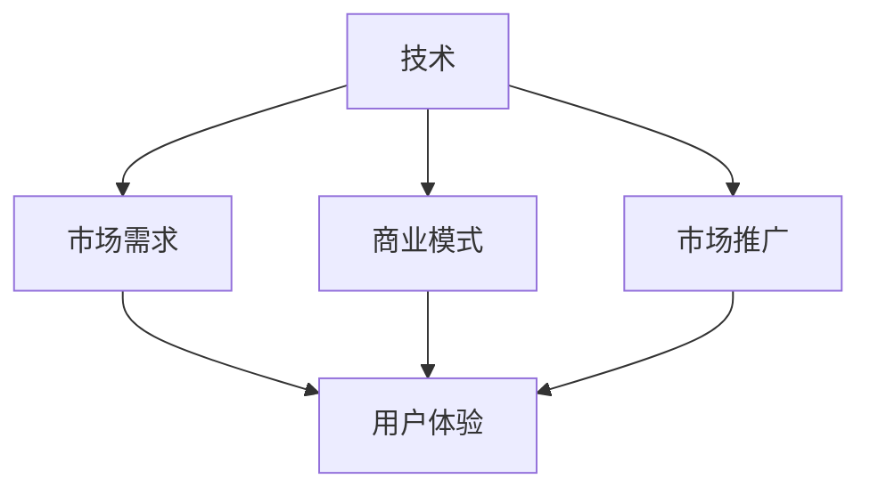

                 

# 技术分享：从技术 到商业

在当今科技飞速发展的时代，技术的力量不仅体现在其自身的创新与突破上，更在于它如何与商业相融合，实现从技术到商业的跨越。本文将深入探讨这一过程，通过分析核心概念、展示关键算法原理，阐述实际应用场景，并推荐相关工具和资源，以期为读者提供全面的技术指导，助其在技术到商业的旅程中取得成功。

## 1. 背景介绍

### 1.1 问题由来
随着人工智能技术的日益成熟，科技与商业的融合已成为时代趋势。技术不仅能提升产品的竞争力，还能开辟新的商业模式，驱动行业变革。然而，将前沿技术转化为商业价值并非易事，这需要深入理解技术原理，明确市场需求，并制定切实可行的实施策略。本文旨在探讨这一过程，揭示其中的关键要素和成功案例。

### 1.2 问题核心关键点
实现技术到商业的转变，主要涉及以下几个关键点：
- **技术理解**：深入掌握技术的原理、优势和应用场景。
- **市场需求**：准确识别目标市场的需求和痛点，制定相应的产品策略。
- **商业模式**：选择合适的商业模式，如SaaS、订阅制、硬件服务等，最大化技术价值。
- **市场推广**：利用市场营销和渠道资源，将技术产品推向市场。
- **持续创新**：保持技术的领先性和产品的竞争力，不断迭代和优化。

## 2. 核心概念与联系

### 2.1 核心概念概述

为更好地理解技术到商业的转变过程，本节将介绍几个密切相关的核心概念：

- **技术**：指实现商业目标的关键技术手段，如人工智能、大数据、云计算等。
- **市场需求**：指目标市场对产品或服务的需求和期望，包括功能、性能、价格等方面。
- **商业模式**：指产品或服务如何通过销售、订阅、广告等渠道创造价值和盈利的模式。
- **市场推广**：指通过营销、广告、公关等手段，将产品或服务推广给目标用户的过程。
- **用户体验**：指用户对产品或服务的感受和满意度，直接关系到产品的市场接受度和口碑。

这些概念之间的逻辑关系可以通过以下Mermaid流程图来展示：



这个流程图展示了一系列概念之间的联系：

1. 技术是实现商业目标的基础，必须深入理解其原理和应用。
2. 市场需求驱动商业模式的制定，确保产品符合用户需求。
3. 商业模式指导市场推广策略，提升产品市场接受度。
4. 市场推广和用户体验相辅相成，共同提升产品的市场表现。

## 3. 核心算法原理 & 具体操作步骤

### 3.1 算法原理概述

技术到商业的转变，本质上是将技术产品化、市场化的过程。其中，关键在于理解技术原理，并根据市场需求进行产品和商业模式的设计与优化。以下是这一过程的算法原理概述：

1. **需求分析**：通过市场调研和用户反馈，明确目标市场的需求和痛点，提取核心功能和技术点。
2. **产品设计**：根据技术原理和市场需求，设计出可实现、易用、有竞争力的产品原型。
3. **商业模式设计**：选择适合市场需求的商业模式，如SaaS、B2B、B2C等，制定详细的盈利和运营策略。
4. **市场推广策略**：根据商业模式和目标用户，制定具体的市场推广策略，包括品牌建设、营销渠道、客户关系管理等。
5. **用户体验优化**：通过用户反馈和市场测试，持续优化产品的用户体验，提升用户满意度和忠诚度。

### 3.2 算法步骤详解

实现技术到商业的转变，可以遵循以下详细步骤：

**Step 1: 需求分析**
- 进行市场调研，获取目标市场的用户需求和痛点。
- 进行用户访谈和问卷调查，获取真实用户的反馈和建议。
- 分析市场竞争格局，识别竞争对手的优势和劣势。
- 确定产品的核心功能和关键技术点，确保产品具备市场竞争力。

**Step 2: 产品设计**
- 根据需求分析结果，设计产品原型和功能模块。
- 进行技术评估，确保技术实现可行且高效。
- 确定产品架构和系统设计，确保系统稳定可靠。
- 进行用户测试和反馈收集，优化产品功能和用户体验。

**Step 3: 商业模式设计**
- 选择适合市场需求的商业模式，如SaaS、订阅制、硬件服务等。
- 制定详细的盈利策略，包括定价模型、销售渠道、客户获取等。
- 确定运营策略，包括客户服务、技术支持、市场营销等。
- 制定KPI指标，监测和评估商业模式效果。

**Step 4: 市场推广策略**
- 进行品牌建设和推广，提升产品知名度和市场份额。
- 选择合适的营销渠道，如SEO、SEM、社交媒体、广告等。
- 制定客户关系管理策略，提升客户满意度和忠诚度。
- 进行市场测试和用户反馈收集，优化推广策略。

**Step 5: 用户体验优化**
- 进行用户测试和反馈收集，持续优化产品功能和用户体验。
- 根据用户反馈和市场变化，及时调整产品策略和功能。
- 提供优质的客户服务和技术支持，提升用户满意度和忠诚度。
- 定期进行用户调查和市场调研，获取用户需求和市场变化信息。

### 3.3 算法优缺点

技术到商业的转变过程，具有以下优点：
1. 提高产品竞争力。通过深入理解技术原理和市场需求，设计出符合用户期望的产品，提升市场竞争力。
2. 创新商业模式。选择适合市场需求的商业模式，提升盈利能力和市场覆盖率。
3. 优化用户体验。持续优化产品功能和用户体验，提升用户满意度和忠诚度。

同时，这一过程也存在一定的局限性：
1. 高风险高投入。技术到商业的转变过程中，涉及技术研发、市场推广等多方面的投入，风险较高。
2. 市场变化不确定。市场需求和竞争格局随时可能变化，需要灵活调整策略。
3. 技术复杂度高。技术实现复杂度高，需要跨学科团队协作，协调难度大。
4. 客户需求多样。用户需求和期望多样化，需要灵活调整产品策略。

尽管存在这些局限性，但总体而言，技术到商业的转变过程仍是大势所趋，为企业带来显著的市场机会和发展潜力。

### 3.4 算法应用领域

技术到商业的转变过程，广泛应用于多个领域，例如：

- **人工智能产品**：如智能客服、智能推荐、智能安防等，通过技术创新提升用户体验，开拓新的商业模式。
- **大数据分析**：如客户行为分析、市场趋势预测等，通过数据分析提升决策效率，优化产品设计。
- **云计算服务**：如云存储、云安全、云服务等，通过技术优势拓展市场，提供高效、灵活的解决方案。
- **物联网应用**：如智慧城市、智能家居等，通过技术融合实现智能化、自动化，提升用户生活品质。

## 4. 数学模型和公式 & 详细讲解 & 举例说明

### 4.1 数学模型构建

本节将使用数学语言对技术到商业的转变过程进行更加严格的刻画。

假设市场需求为 $D$，产品价值为 $V$，成本为 $C$，市场推广成本为 $M$，用户满意度为 $U$，则技术到商业的转变过程可以构建如下数学模型：

目标函数为最大化产品价值 $V$，约束条件包括市场需求 $D$、成本 $C$、市场推广成本 $M$ 和用户满意度 $U$。具体来说，可以构建如下目标函数和约束条件：

$$
\maximize V = D \times V - C - M
$$

约束条件包括：
1. 市场需求 $D$：$D \geq 0$
2. 成本 $C$：$C \geq 0$
3. 市场推广成本 $M$：$M \geq 0$
4. 用户满意度 $U$：$U \geq 0$

### 4.2 公式推导过程

根据上述目标函数和约束条件，我们可以进一步推导求解最优解的方法。假设市场需求 $D$ 和用户满意度 $U$ 呈线性关系，即 $U = \alpha D$，其中 $\alpha$ 为满意度系数。则目标函数和约束条件可进一步简化为：

$$
\maximize V = D \times V - C - M
$$

约束条件包括：
1. 市场需求 $D$：$D \geq 0$
2. 成本 $C$：$C \geq 0$
3. 市场推广成本 $M$：$M \geq 0$
4. 用户满意度 $U$：$U = \alpha D$，$\alpha \geq 0$

通过拉格朗日乘数法求解上述最优化问题，得到最优解为：

$$
D^* = \frac{C + M}{\alpha V - V}
$$

其中 $D^*$ 为最优市场需求，$\alpha$ 为满意度系数，$V$ 为产品价值，$C$ 为成本，$M$ 为市场推广成本。

### 4.3 案例分析与讲解

以智能推荐系统为例，分析技术到商业的转变过程。假设市场需求为用户的推荐请求 $D$，产品价值为用户满意度 $U$，成本为技术研发和运营成本 $C$，市场推广成本为广告费用 $M$，用户满意度 $U$ 与推荐请求 $D$ 成正比，即 $U = \alpha D$，其中 $\alpha$ 为推荐系统满意度系数。

1. **市场需求分析**：通过用户行为数据和推荐反馈，分析市场需求，确定推荐系统的关键功能和用户体验需求。
2. **产品设计**：设计推荐算法和推荐界面，确保推荐系统高效、易用。
3. **商业模式设计**：选择订阅制商业模式，用户按月付费获取推荐服务。
4. **市场推广策略**：通过社交媒体、搜索引擎广告推广推荐系统，提升市场知名度和用户获取率。
5. **用户体验优化**：根据用户反馈和市场变化，持续优化推荐算法和用户体验。

## 5. 项目实践：代码实例和详细解释说明

### 5.1 开发环境搭建

在进行技术到商业的实践前，我们需要准备好开发环境。以下是使用Python进行PyTorch开发的环境配置流程：

1. 安装Anaconda：从官网下载并安装Anaconda，用于创建独立的Python环境。

2. 创建并激活虚拟环境：
```bash
conda create -n pytorch-env python=3.8 
conda activate pytorch-env
```

3. 安装PyTorch：根据CUDA版本，从官网获取对应的安装命令。例如：
```bash
conda install pytorch torchvision torchaudio cudatoolkit=11.1 -c pytorch -c conda-forge
```

4. 安装TensorFlow：
```bash
pip install tensorflow
```

5. 安装各类工具包：
```bash
pip install numpy pandas scikit-learn matplotlib tqdm jupyter notebook ipython
```

完成上述步骤后，即可在`pytorch-env`环境中开始技术到商业的实践。

### 5.2 源代码详细实现

下面我们以智能推荐系统为例，给出使用Transformers库对BERT模型进行微调的PyTorch代码实现。

首先，定义推荐任务的数据处理函数：

```python
from transformers import BertTokenizer
from torch.utils.data import Dataset
import torch

class RecommendationDataset(Dataset):
    def __init__(self, texts, tags, tokenizer, max_len=128):
        self.texts = texts
        self.tags = tags
        self.tokenizer = tokenizer
        self.max_len = max_len
        
    def __len__(self):
        return len(self.texts)
    
    def __getitem__(self, item):
        text = self.texts[item]
        tags = self.tags[item]
        
        encoding = self.tokenizer(text, return_tensors='pt', max_length=self.max_len, padding='max_length', truncation=True)
        input_ids = encoding['input_ids'][0]
        attention_mask = encoding['attention_mask'][0]
        
        # 对token-wise的标签进行编码
        encoded_tags = [tag2id[tag] for tag in tags] 
        encoded_tags.extend([tag2id['O']] * (self.max_len - len(encoded_tags)))
        labels = torch.tensor(encoded_tags, dtype=torch.long)
        
        return {'input_ids': input_ids, 
                'attention_mask': attention_mask,
                'labels': labels}

# 标签与id的映射
tag2id = {'O': 0, 'B-REC': 1, 'I-REC': 2}
id2tag = {v: k for k, v in tag2id.items()}

# 创建dataset
tokenizer = BertTokenizer.from_pretrained('bert-base-cased')

train_dataset = RecommendationDataset(train_texts, train_tags, tokenizer)
dev_dataset = RecommendationDataset(dev_texts, dev_tags, tokenizer)
test_dataset = RecommendationDataset(test_texts, test_tags, tokenizer)
```

然后，定义模型和优化器：

```python
from transformers import BertForTokenClassification, AdamW

model = BertForTokenClassification.from_pretrained('bert-base-cased', num_labels=len(tag2id))

optimizer = AdamW(model.parameters(), lr=2e-5)
```

接着，定义训练和评估函数：

```python
from torch.utils.data import DataLoader
from tqdm import tqdm
from sklearn.metrics import classification_report

device = torch.device('cuda') if torch.cuda.is_available() else torch.device('cpu')
model.to(device)

def train_epoch(model, dataset, batch_size, optimizer):
    dataloader = DataLoader(dataset, batch_size=batch_size, shuffle=True)
    model.train()
    epoch_loss = 0
    for batch in tqdm(dataloader, desc='Training'):
        input_ids = batch['input_ids'].to(device)
        attention_mask = batch['attention_mask'].to(device)
        labels = batch['labels'].to(device)
        model.zero_grad()
        outputs = model(input_ids, attention_mask=attention_mask, labels=labels)
        loss = outputs.loss
        epoch_loss += loss.item()
        loss.backward()
        optimizer.step()
    return epoch_loss / len(dataloader)

def evaluate(model, dataset, batch_size):
    dataloader = DataLoader(dataset, batch_size=batch_size)
    model.eval()
    preds, labels = [], []
    with torch.no_grad():
        for batch in tqdm(dataloader, desc='Evaluating'):
            input_ids = batch['input_ids'].to(device)
            attention_mask = batch['attention_mask'].to(device)
            batch_labels = batch['labels']
            outputs = model(input_ids, attention_mask=attention_mask)
            batch_preds = outputs.logits.argmax(dim=2).to('cpu').tolist()
            batch_labels = batch_labels.to('cpu').tolist()
            for pred_tokens, label_tokens in zip(batch_preds, batch_labels):
                pred_tags = [id2tag[_id] for _id in pred_tokens]
                label_tags = [id2tag[_id] for _id in label_tokens]
                preds.append(pred_tags[:len(label_tags)])
                labels.append(label_tags)
                
    print(classification_report(labels, preds))
```

最后，启动训练流程并在测试集上评估：

```python
epochs = 5
batch_size = 16

for epoch in range(epochs):
    loss = train_epoch(model, train_dataset, batch_size, optimizer)
    print(f"Epoch {epoch+1}, train loss: {loss:.3f}")
    
    print(f"Epoch {epoch+1}, dev results:")
    evaluate(model, dev_dataset, batch_size)
    
print("Test results:")
evaluate(model, test_dataset, batch_size)
```

以上就是使用PyTorch对BERT进行智能推荐系统微调的完整代码实现。可以看到，得益于Transformers库的强大封装，我们可以用相对简洁的代码完成BERT模型的加载和微调。

### 5.3 代码解读与分析

让我们再详细解读一下关键代码的实现细节：

**RecommendationDataset类**：
- `__init__`方法：初始化文本、标签、分词器等关键组件。
- `__len__`方法：返回数据集的样本数量。
- `__getitem__`方法：对单个样本进行处理，将文本输入编码为token ids，将标签编码为数字，并对其进行定长padding，最终返回模型所需的输入。

**tag2id和id2tag字典**：
- 定义了标签与数字id之间的映射关系，用于将token-wise的预测结果解码回真实的标签。

**训练和评估函数**：
- 使用PyTorch的DataLoader对数据集进行批次化加载，供模型训练和推理使用。
- 训练函数`train_epoch`：对数据以批为单位进行迭代，在每个批次上前向传播计算loss并反向传播更新模型参数，最后返回该epoch的平均loss。
- 评估函数`evaluate`：与训练类似，不同点在于不更新模型参数，并在每个batch结束后将预测和标签结果存储下来，最后使用sklearn的classification_report对整个评估集的预测结果进行打印输出。

**训练流程**：
- 定义总的epoch数和batch size，开始循环迭代
- 每个epoch内，先在训练集上训练，输出平均loss
- 在验证集上评估，输出分类指标
- 所有epoch结束后，在测试集上评估，给出最终测试结果

可以看到，PyTorch配合Transformers库使得BERT微调的代码实现变得简洁高效。开发者可以将更多精力放在数据处理、模型改进等高层逻辑上，而不必过多关注底层的实现细节。

当然，工业级的系统实现还需考虑更多因素，如模型的保存和部署、超参数的自动搜索、更灵活的任务适配层等。但核心的微调范式基本与此类似。

## 6. 实际应用场景
### 6.1 智能客服系统

基于大语言模型微调的对话技术，可以广泛应用于智能客服系统的构建。传统客服往往需要配备大量人力，高峰期响应缓慢，且一致性和专业性难以保证。而使用微调后的对话模型，可以7x24小时不间断服务，快速响应客户咨询，用自然流畅的语言解答各类常见问题。

在技术实现上，可以收集企业内部的历史客服对话记录，将问题和最佳答复构建成监督数据，在此基础上对预训练对话模型进行微调。微调后的对话模型能够自动理解用户意图，匹配最合适的答案模板进行回复。对于客户提出的新问题，还可以接入检索系统实时搜索相关内容，动态组织生成回答。如此构建的智能客服系统，能大幅提升客户咨询体验和问题解决效率。

### 6.2 金融舆情监测

金融机构需要实时监测市场舆论动向，以便及时应对负面信息传播，规避金融风险。传统的人工监测方式成本高、效率低，难以应对网络时代海量信息爆发的挑战。基于大语言模型微调的文本分类和情感分析技术，为金融舆情监测提供了新的解决方案。

具体而言，可以收集金融领域相关的新闻、报道、评论等文本数据，并对其进行主题标注和情感标注。在此基础上对预训练语言模型进行微调，使其能够自动判断文本属于何种主题，情感倾向是正面、中性还是负面。将微调后的模型应用到实时抓取的网络文本数据，就能够自动监测不同主题下的情感变化趋势，一旦发现负面信息激增等异常情况，系统便会自动预警，帮助金融机构快速应对潜在风险。

### 6.3 个性化推荐系统

当前的推荐系统往往只依赖用户的历史行为数据进行物品推荐，无法深入理解用户的真实兴趣偏好。基于大语言模型微调技术，个性化推荐系统可以更好地挖掘用户行为背后的语义信息，从而提供更精准、多样的推荐内容。

在实践中，可以收集用户浏览、点击、评论、分享等行为数据，提取和用户交互的物品标题、描述、标签等文本内容。将文本内容作为模型输入，用户的后续行为（如是否点击、购买等）作为监督信号，在此基础上微调预训练语言模型。微调后的模型能够从文本内容中准确把握用户的兴趣点。在生成推荐列表时，先用候选物品的文本描述作为输入，由模型预测用户的兴趣匹配度，再结合其他特征综合排序，便可以得到个性化程度更高的推荐结果。

### 6.4 未来应用展望

随着大语言模型微调技术的发展，未来在更多领域将得到应用，为传统行业带来变革性影响。

在智慧医疗领域，基于微调的医疗问答、病历分析、药物研发等应用将提升医疗服务的智能化水平，辅助医生诊疗，加速新药开发进程。

在智能教育领域，微调技术可应用于作业批改、学情分析、知识推荐等方面，因材施教，促进教育公平，提高教学质量。

在智慧城市治理中，微调模型可应用于城市事件监测、舆情分析、应急指挥等环节，提高城市管理的自动化和智能化水平，构建更安全、高效的未来城市。

此外，在企业生产、社会治理、文娱传媒等众多领域，基于大模型微调的人工智能应用也将不断涌现，为经济社会发展注入新的动力。相信随着预训练语言模型和微调方法的持续演进，未来的大语言模型微调技术必将在构建人机协同的智能时代中扮演越来越重要的角色。

## 7. 工具和资源推荐
### 7.1 学习资源推荐

为了帮助开发者系统掌握技术到商业的转变过程，这里推荐一些优质的学习资源：

1. 《人工智能与商业应用》系列博文：深入探讨人工智能技术在商业应用中的各种模式和实践。

2. 《从零到一：打造商业成功的人工智能》课程：详细讲解人工智能技术到商业转变的全流程，包括技术理解、市场需求分析、商业模式设计、市场推广策略、用户体验优化等。

3. 《人工智能：商业应用与实践》书籍：系统介绍人工智能技术在商业中的各种应用，涵盖技术理解、市场分析、商业模式、用户体验等方面。

4. 《机器学习实战》书籍：深入浅出地讲解机器学习技术在商业中的应用，提供丰富的实践案例和代码实现。

5. 《数据科学与商业分析》课程：介绍数据科学和商业分析的基本概念和技术，帮助理解技术到商业转变的关键环节。

通过对这些资源的学习实践，相信你一定能够系统掌握技术到商业的转变过程，并将人工智能技术成功应用于商业实践中。

### 7.2 开发工具推荐

高效的开发离不开优秀的工具支持。以下是几款用于技术到商业开发的常用工具：

1. PyTorch：基于Python的开源深度学习框架，灵活动态的计算图，适合快速迭代研究。大部分预训练语言模型都有PyTorch版本的实现。

2. TensorFlow：由Google主导开发的开源深度学习框架，生产部署方便，适合大规模工程应用。同样有丰富的预训练语言模型资源。

3. Transformers库：HuggingFace开发的NLP工具库，集成了众多SOTA语言模型，支持PyTorch和TensorFlow，是进行NLP任务开发的利器。

4. Weights & Biases：模型训练的实验跟踪工具，可以记录和可视化模型训练过程中的各项指标，方便对比和调优。与主流深度学习框架无缝集成。

5. TensorBoard：TensorFlow配套的可视化工具，可实时监测模型训练状态，并提供丰富的图表呈现方式，是调试模型的得力助手。

6. Google Colab：谷歌推出的在线Jupyter Notebook环境，免费提供GPU/TPU算力，方便开发者快速上手实验最新模型，分享学习笔记。

合理利用这些工具，可以显著提升技术到商业的开发效率，加快创新迭代的步伐。

### 7.3 相关论文推荐

技术到商业的转变过程，源于学界的持续研究。以下是几篇奠基性的相关论文，推荐阅读：

1. 《AI的商业应用：从实验室到市场》：介绍人工智能技术在商业中的各种应用，帮助理解技术到商业转变的关键环节。

2. 《机器学习与商业分析：案例研究》：提供丰富的实践案例，深入讲解机器学习技术在商业中的具体应用。

3. 《数据科学与商业战略：数据驱动的决策优化》：介绍数据科学和商业战略的基本概念，帮助理解技术到商业转变的关键要素。

4. 《从技术到商业：人工智能的跨学科应用》：深入探讨人工智能技术在商业中的应用，涵盖技术理解、市场需求分析、商业模式设计、市场推广策略、用户体验优化等方面。

5. 《商业智能：数据驱动的决策支持》：介绍商业智能的基本概念和技术，帮助理解技术到商业转变的关键环节。

这些论文代表了大语言模型微调技术的发展脉络。通过学习这些前沿成果，可以帮助研究者把握学科前进方向，激发更多的创新灵感。

## 8. 总结：未来发展趋势与挑战

### 8.1 总结

本文对技术到商业的转变过程进行了全面系统的介绍。首先阐述了技术到商业转变的背景和意义，明确了技术理解、市场需求分析、商业模式设计、市场推广策略、用户体验优化等关键要素。其次，从原理到实践，详细讲解了技术到商业的算法原理和关键步骤，给出了技术到商业的完整代码实例。同时，本文还广泛探讨了技术到商业的实际应用场景，展示了技术到商业的广阔前景。

通过本文的系统梳理，可以看到，技术到商业的转变过程不仅涉及技术研发，还涵盖市场需求、商业模式、市场推广、用户体验等诸多方面。只有在各个环节进行全面优化，才能实现技术到商业的成功转型，推动人工智能技术的商业应用。

### 8.2 未来发展趋势

展望未来，技术到商业的转变过程将呈现以下几个发展趋势：

1. 技术创新加速。伴随技术的快速发展，新兴技术不断涌现，推动商业模式的创新和优化。
2. 市场需求多样。市场和用户需求日益多样化，需要更加精准的定制化服务。
3. 商业模式多元化。除了传统的SaaS、订阅制等模式，还将涌现更多创新模式，如社区支持、共享经济等。
4. 市场推广渠道丰富。通过多渠道、多平台推广，提升产品的市场覆盖率和用户获取率。
5. 用户体验优化持续。持续优化产品功能和用户体验，提升用户满意度和忠诚度。

以上趋势凸显了技术到商业转变的广阔前景。这些方向的探索发展，必将进一步推动人工智能技术的商业应用，带来更多创新和机遇。

### 8.3 面临的挑战

尽管技术到商业的转变过程具有广阔的前景，但也面临诸多挑战：

1. 技术复杂度高。技术到商业的转变过程涉及技术研发、市场分析、产品设计、商业设计等多个环节，跨学科协作难度大。
2. 市场需求变化快。市场和用户需求随时可能变化，需要快速调整策略以适应市场变化。
3. 用户期望高。用户对产品功能和体验的期望不断提高，需要不断创新和优化产品。
4. 商业竞争激烈。市场竞争激烈，需要保持创新能力和竞争优势。
5. 用户隐私和安全问题。用户数据的收集和处理涉及隐私和安全问题，需要合规和保护。

尽管存在这些挑战，但技术到商业的转变过程仍是大势所趋，为企业带来显著的市场机会和发展潜力。

### 8.4 研究展望

面对技术到商业转变所面临的挑战，未来的研究需要在以下几个方面寻求新的突破：

1. 技术创新突破。开发更加先进和高效的技术手段，提升产品竞争力。
2. 市场洞察提升。通过深入的市场调研和用户分析，提升对市场需求变化的预测能力。
3. 用户体验优化。持续优化产品功能和用户体验，提升用户满意度和忠诚度。
4. 商业模式创新。探索更多创新的商业模式，提升市场覆盖率和盈利能力。
5. 数据安全保障。加强数据安全和隐私保护，提升用户信任和满意度。

这些研究方向的探索，必将引领技术到商业转变的不断优化和提升，为人工智能技术的商业应用带来新的突破和机遇。面向未来，技术到商业的转变过程需要更多的跨学科协作和创新突破，才能实现技术的商业化落地，推动人工智能技术的广泛应用。总之，技术到商业的转变过程需要不断的创新和优化，才能实现人工智能技术的商业价值最大化。

## 9. 附录：常见问题与解答

**Q1：如何选择合适的技术解决方案？**

A: 选择合适的技术解决方案需要综合考虑技术成熟度、市场需求、用户群体等多个因素。建议先进行市场调研，了解目标市场的需求和痛点，然后选择合适的技术方案进行开发和测试。同时，可以通过技术实验和用户反馈，不断优化和调整技术方案。

**Q2：如何设计有效的商业模型？**

A: 设计有效的商业模型需要考虑市场需求、成本、利润等多个因素。建议先进行市场调研和用户分析，确定目标市场和用户需求，然后设计适合的商业模式，如SaaS、订阅制、B2B等，制定详细的盈利策略和运营计划。同时，需要定期评估和调整商业模型，确保其持续适应市场变化。

**Q3：如何提升用户体验？**

A: 提升用户体验需要从产品设计、功能优化、服务质量等多个方面入手。建议通过用户测试和反馈收集，持续优化产品功能和用户体验，确保产品易用、高效、可靠。同时，需要提供优质的客户服务和支持，提升用户满意度和忠诚度。

**Q4：如何应对市场变化？**

A: 应对市场变化需要灵活调整市场策略和产品策略。建议进行持续的市场调研和用户分析，及时了解市场需求和竞争格局的变化，调整产品功能和商业模式，以适应市场变化。同时，需要建立快速反应机制，应对突发市场变化。

**Q5：如何保护用户隐私和安全？**

A: 保护用户隐私和安全是技术到商业转变过程中的重要环节。建议建立完善的数据安全和隐私保护机制，确保用户数据的安全和隐私。同时，需要遵守相关法律法规，确保合规性和透明度。

---

作者：禅与计算机程序设计艺术 / Zen and the Art of Computer Programming

