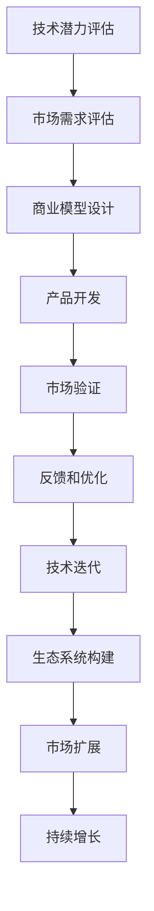

                 

# 技术分享：从技术到商业

## 1. 背景介绍

### 1.1 问题由来
在当前信息技术飞速发展的时代，技术的突破和应用已经成为了商业竞争的重要手段。特别是人工智能（AI）和机器学习（ML）技术，它们不仅能提升产品的竞争力，还能驱动商业模式创新。然而，尽管技术发展迅猛，但如何从技术到商业的转化却是一个难题。这需要深度理解技术原理、应用场景、市场需求以及商业模式等多个维度的知识。本文将围绕这一主题，深入探讨技术转化为商业的路径和方法。

### 1.2 问题核心关键点
技术转化为商业的核心关键点包括：
- 如何评估技术的市场潜力
- 如何设计商业模型以实现技术价值
- 如何在技术创新与市场需求之间找到平衡点
- 如何通过技术创新推动商业模式的变革
- 如何构建技术生态系统，促进技术迭代和应用

## 2. 核心概念与联系

### 2.1 核心概念概述

在探讨从技术到商业的转化时，需要理解以下几个核心概念：

- **技术潜力和市场需求**：技术潜力和市场需求是转化过程中的两个关键因素。技术潜力评估包括技术的创新性、可行性以及应用范围，而市场需求评估则涉及市场规模、增长潜力以及消费者的需求。

- **商业模型设计**：商业模型设计是技术转化为商业的核心步骤。它包括产品定位、价值主张、客户获取策略、收入模型和运营流程等环节，旨在实现技术的商业价值。

- **技术创新与商业模式的关系**：技术创新是商业模式变革的驱动力，而商业模式则是技术创新的载体和实现手段。二者需要紧密结合，才能实现最佳转化效果。

- **市场反馈与技术迭代**：技术转化为商业是一个持续迭代的过程。需要不断收集市场反馈，优化产品和服务，持续改进技术，以适应市场变化。

- **生态系统构建**：构建技术生态系统是推动技术创新的重要手段。通过建立合作伙伴关系、开放平台、社区参与等，可以实现技术的快速传播和应用，加速商业转化。

这些概念之间通过以下Mermaid流程图展现其联系：



这个流程图展示了从技术评估到市场扩展的技术转化为商业的基本流程。

## 3. 核心算法原理 & 具体操作步骤

### 3.1 算法原理概述

从技术到商业的转化过程，可以理解为从技术研发到市场应用的系统性工程。其核心算法原理包括：

- **需求识别**：通过市场调研、用户访谈、数据分析等手段，识别市场中的潜在需求和痛点。
- **技术适配**：根据需求识别结果，适配技术方案，设计能够满足市场需求的技术方案。
- **商业模式设计**：基于技术方案，设计商业模型，实现技术到商业的转化。
- **市场验证**：在目标市场进行产品或服务的验证，收集用户反馈和市场数据。
- **迭代优化**：根据市场验证结果，持续改进产品和服务，推动技术迭代。

### 3.2 算法步骤详解

1. **需求识别**：
   - 进行市场调研，了解行业趋势和用户需求。
   - 通过数据分析工具（如Google Analytics、Tableau），获取用户行为数据。
   - 进行用户访谈，收集第一手用户反馈。

2. **技术适配**：
   - 评估现有技术的可行性，包括技术的成熟度、成本效益和可扩展性。
   - 进行技术选型，选择最适合需求的技术方案。
   - 进行技术开发，包括设计、实现和测试。

3. **商业模式设计**：
   - 确定产品或服务的价值主张，解决用户痛点。
   - 设计客户获取策略，如社交媒体推广、合作伙伴关系等。
   - 设计收入模型，包括订阅、广告、交易佣金等。
   - 设计运营流程，包括供应链管理、客户服务、质量控制等。

4. **市场验证**：
   - 在目标市场进行小规模测试，收集用户反馈。
   - 分析用户反馈和市场数据，优化产品和服务。
   - 确定市场进入策略，包括市场细分、渠道选择等。

5. **迭代优化**：
   - 根据市场验证结果，持续改进产品和服务。
   - 跟踪市场变化，及时调整产品策略。
   - 建立持续改进机制，推动技术迭代和商业增长。

### 3.3 算法优缺点

从技术到商业转化过程的优势包括：

- 充分利用市场调研和用户反馈，确保技术适配市场需求。
- 通过商业模式设计，最大化技术价值。
- 通过市场验证和迭代优化，快速适应市场变化。

然而，这一过程也存在一些挑战：

- 需求识别和市场验证可能需要较长的时间，影响项目进度。
- 技术适配和商业模式设计需要专业知识，可能面临较高的门槛。
- 市场变化多端，需要持续监控和快速响应。

## 4. 数学模型和公式 & 详细讲解 & 举例说明

### 4.1 数学模型构建

从技术到商业的转化过程，可以用以下数学模型进行建模：

- **需求评估模型**：
  $$
  D = \sum_{i=1}^n \left( r_i \times s_i \right)
  $$
  其中 $D$ 表示市场需求，$r_i$ 表示需求重要性，$s_i$ 表示需求满意度。
  
- **技术适配模型**：
  $$
  T = c \times p \times e
  $$
  其中 $T$ 表示技术适配性，$c$ 表示成本，$p$ 表示性能，$e$ 表示扩展性。

- **商业模式设计模型**：
  $$
  M = V \times C \times O
  $$
  其中 $M$ 表示商业模型，$V$ 表示价值主张，$C$ 表示客户获取成本，$O$ 表示运营成本。

### 4.2 公式推导过程

- **需求评估模型**：通过加权求和的方式，综合评估各项需求的重要性与满意度，得到市场需求 $D$。
- **技术适配模型**：将成本、性能和扩展性进行加权，得到技术适配性 $T$。
- **商业模式设计模型**：通过价值主张、客户获取成本和运营成本的乘积，得到商业模型 $M$。

### 4.3 案例分析与讲解

假设有一家初创公司，计划开发一款智能家居管理平台。通过市场调研，公司识别到用户对智能家居的控制、安全和管理有强烈需求，因此将技术适配智能家居控制、安全和管理的解决方案作为优先选项。基于市场需求和技术适配性，公司设计了以下商业模式：

- **价值主张**：提供一站式智能家居管理，提升用户生活质量。
- **客户获取策略**：通过合作伙伴关系和线上推广获取客户。
- **收入模型**：提供基础服务免费，高级功能通过订阅收费。
- **运营流程**：建立用户社区，提供售后服务和技术支持。

通过实际测试和市场验证，公司不断优化产品和服务，最终取得了成功。

## 5. 项目实践：代码实例和详细解释说明

### 5.1 开发环境搭建

为进行从技术到商业转化的项目实践，需要搭建相应的开发环境：

1. **选择开发工具**：
   - 开发语言：Python。
   - 数据处理工具：Pandas、NumPy。
   - 数据分析工具：Scikit-learn、Matplotlib。
   - 机器学习框架：TensorFlow、Keras。
   - 部署平台：AWS、GCP、Azure。

2. **数据收集与处理**：
   - 收集市场需求数据。
   - 清洗和预处理数据。
   - 存储和备份数据。

### 5.2 源代码详细实现

假设公司需要开发一款智能推荐系统，以下是代码实现步骤：

1. **数据收集与预处理**：
   - 收集用户行为数据（如浏览记录、点击次数、购买行为）。
   - 清洗数据，去除噪声和异常值。
   - 进行特征工程，提取有用特征。

2. **模型训练与优化**：
   - 选择适合的推荐算法（如协同过滤、基于内容的推荐）。
   - 在数据集上进行模型训练和验证。
   - 使用交叉验证、网格搜索等方法进行模型调优。

3. **商业模型设计**：
   - 确定推荐系统的价值主张。
   - 设计用户获取策略，如通过搜索引擎优化（SEO）获取流量。
   - 设计收入模型，如按点击收费、按交易提成等。
   - 设计运营流程，如客服支持、数据安全等。

### 5.3 代码解读与分析

以下是推荐系统代码实现的关键部分：

```python
import pandas as pd
from sklearn.model_selection import train_test_split
from sklearn.metrics import mean_absolute_error

# 数据收集与预处理
data = pd.read_csv('user_behavior.csv')
data = data.dropna()  # 去除缺失值
data = data.drop_duplicates()  # 去除重复数据

# 特征工程
X = data[['item_id', 'user_id', 'time', 'category']]  # 特征矩阵
y = data['click']  # 标签

# 模型训练与优化
X_train, X_test, y_train, y_test = train_test_split(X, y, test_size=0.2)
model = SVD(alpha=0.1)  # 选择协同过滤算法
model.fit(X_train, y_train)  # 训练模型
y_pred = model.predict(X_test)  # 预测结果

# 评估模型
mae = mean_absolute_error(y_test, y_pred)  # 计算MAE
print(f'MAE: {mae:.2f}')

# 商业模型设计
value_proposition = '个性化推荐，提升用户购物体验'
customer_acquisition = '通过搜索引擎优化获取流量'
income_model = '按点击收费'
operational_process = '建立客服支持系统'
```

### 5.4 运行结果展示

通过上述代码，公司可以初步验证推荐系统的有效性。根据MAE结果，调整模型参数和特征工程方法，最终实现推荐系统的高效运行。

## 6. 实际应用场景

### 6.1 电子商务平台

电子商务平台是应用从技术到商业转化最为广泛的场景之一。通过智能推荐系统，电商平台可以为用户提供个性化的商品推荐，提升购物体验和转化率。同时，通过数据分析，电商平台还可以优化库存管理、提升物流效率，实现更高的运营效率。

### 6.2 医疗健康

在医疗健康领域，智能推荐系统可以为用户提供个性化的健康建议和诊疗方案。通过分析用户的健康数据和行为，智能推荐系统可以预测疾病风险，提供早期预警。此外，通过智能诊断系统，医疗机构可以提高诊断准确率，缩短诊断时间。

### 6.3 教育培训

在教育培训领域，智能推荐系统可以为用户提供个性化的学习内容和资源推荐。通过分析学生的学习行为和反馈，智能推荐系统可以提供定制化的学习计划，提高学习效果。同时，智能推荐系统还可以为教育机构提供学生管理和教学优化建议。

### 6.4 金融理财

金融理财领域也需要智能推荐系统，为用户提供个性化的投资和理财建议。通过分析用户的财务数据和行为，智能推荐系统可以预测投资风险，提供最优的投资组合。同时，通过智能风控系统，金融机构可以提高风险管理能力，降低损失风险。

## 7. 工具和资源推荐

### 7.1 学习资源推荐

- **《数据科学导论》**：适用于数据科学初学者，详细介绍了数据收集、处理、分析和建模的基本概念和方法。
- **《机器学习实战》**：通过实际项目，介绍了常用的机器学习算法和工具，适合实践学习。
- **《深度学习》**：由深度学习领域的权威专家撰写，深入讲解了深度学习的基本原理和应用。
- **Coursera和Udacity**：提供大量在线课程，涵盖数据科学、机器学习、深度学习等前沿技术。
- **GitHub和Kaggle**：提供丰富的开源项目和数据集，适合进行实践学习和项目开发。

### 7.2 开发工具推荐

- **Jupyter Notebook**：开源的交互式笔记本，适合进行数据处理和代码开发。
- **PyTorch和TensorFlow**：常用的深度学习框架，提供了丰富的API和工具库。
- **AWS和Google Cloud**：提供了强大的云服务平台，支持大数据处理、模型训练和应用部署。
- **Docker和Kubernetes**：容器化和容器编排工具，适合进行应用部署和扩展。
- **Git和GitHub**：版本控制工具和代码托管平台，支持团队协作和代码管理。

### 7.3 相关论文推荐

- **《从数据到算法：深度学习技术的应用》**：介绍了深度学习技术在多个领域的应用，适合了解深度学习的广泛影响。
- **《人工智能商业化：从技术到商业》**：详细探讨了人工智能技术商业化的过程和方法，适合了解技术转化的最佳实践。
- **《数据驱动的商业创新》**：从数据驱动的角度，介绍了商业创新的过程和方法，适合了解数据驱动的商业模式。

## 8. 总结：未来发展趋势与挑战

### 8.1 研究成果总结

本文从技术潜力评估、市场需求识别、商业模型设计、市场验证与迭代优化等多个维度，深入探讨了从技术到商业转化的基本过程。通过对需求、技术、市场和商业模型的全面评估，确保技术转化为商业的可行性。同时，通过市场验证和迭代优化，推动技术的持续改进和商业价值的最大化。

### 8.2 未来发展趋势

未来，随着技术的不断进步和市场需求的不断变化，从技术到商业的转化过程将更加智能化、自动化和集成化。以下趋势值得关注：

- **数据驱动的决策**：数据将发挥越来越重要的作用，基于数据驱动的决策将更加科学和精确。
- **AI与商业的深度融合**：AI技术将深度融入商业模型，实现更高效、更个性化的商业运营。
- **智能生态系统的构建**：通过构建智能生态系统，实现技术快速传播和应用，加速商业转化。

### 8.3 面临的挑战

尽管技术转化过程日益成熟，但仍面临以下挑战：

- **市场需求的多样性**：不同市场的需求千差万别，需要针对性地进行市场调研和分析。
- **技术创新的高门槛**：技术创新需要高水平的研发能力和技术积累。
- **市场验证的复杂性**：市场验证需要投入大量资源和时间，可能面临较高的风险。

### 8.4 研究展望

未来的研究应关注以下方向：

- **智能推荐系统的优化**：通过改进算法和模型，提升推荐系统的精度和效率。
- **商业模型的创新**：通过引入新模式和新机制，提高商业模型的灵活性和适应性。
- **市场验证的自动化**：通过自动化测试和分析工具，提高市场验证的效率和准确性。
- **生态系统的构建**：通过建立开放平台和合作机制，加速技术传播和应用。

总之，从技术到商业的转化过程是技术应用的重要环节，需要在技术、市场和商业等多个维度进行全面考虑和优化。只有通过持续创新和优化，才能实现技术商业化的最大化价值。

## 9. 附录：常见问题与解答

**Q1: 从技术到商业的转化过程中，如何评估技术的市场需求？**

A: 市场需求评估需要从多个维度进行综合考虑，包括市场规模、增长潜力、竞争格局和用户需求等。常用的方法包括市场调研、数据分析、用户访谈等。

**Q2: 如何设计商业模型以实现技术价值？**

A: 商业模型设计需要考虑产品或服务的价值主张、客户获取策略、收入模型和运营流程等环节。通过系统性设计，确保技术价值的最大化实现。

**Q3: 如何通过技术创新推动商业模式的变革？**

A: 技术创新是商业模式变革的驱动力。通过技术创新，可以实现产品和服务的高效化、个性化和智能化。同时，通过商业模型设计，将技术创新转化为商业价值。

**Q4: 如何构建技术生态系统，促进技术迭代和应用？**

A: 构建技术生态系统需要建立合作伙伴关系、开放平台、社区参与等机制。通过生态系统的建设，实现技术的快速传播和应用，推动技术的持续迭代和优化。

作者：禅与计算机程序设计艺术 / Zen and the Art of Computer Programming

