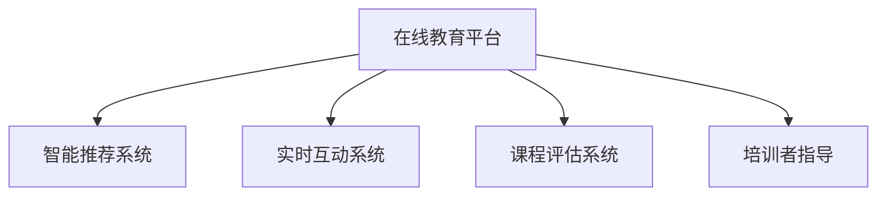

                 

# 技术培训：从受训者到培训者

> 关键词：技术培训, 知识传递, 自学能力, 交互式学习, 在线教育平台, 培训者指导, 课程设计

## 1. 背景介绍

### 1.1 问题由来
随着信息技术的飞速发展，技术在各行各业的应用越来越广泛。技术的更新迭代速度加快，技术知识更新迅速，企业需要不断提升员工的技术水平和知识储备。然而，传统的基于面对面的培训方式，往往难以覆盖到每一个人，且培训效果难以量化评估。

为了应对这一挑战，在线教育平台逐渐兴起，技术培训开始向线上转型。借助互联网和多媒体技术，培训方式更加灵活多样，能够覆盖更广大的受众群体。

### 1.2 问题核心关键点
在线教育平台的核心优势在于其互动性和个性化。通过智能化的课程推荐系统，能够根据学员的学习进度和偏好，推荐最适合他们的学习内容。而通过实时互动和答疑，培训者能够实时掌握学员的学习状态，提供个性化的指导。

然而，在线教育平台也面临诸多挑战：如何保证课程质量、如何保证学员的学习积极性、如何设计有效的课程评估机制等，都是需要深入探讨的问题。本文旨在通过分析技术培训中的核心概念和关键技术，提出解决方案，帮助技术培训从业者从受训者成长为专业的培训者。

## 2. 核心概念与联系

### 2.1 核心概念概述

为更好地理解在线教育平台的技术培训流程，本节将介绍几个密切相关的核心概念：

- **在线教育平台**：通过网络提供各种在线课程，支持学员自主学习。包括视频课程、互动课程、问答系统等多种形式。

- **智能推荐系统**：根据学员的学习行为和偏好，推荐最适合他们的学习内容。包括协同过滤、基于内容的推荐、深度学习推荐模型等。

- **实时互动系统**：支持培训者和学员之间的实时沟通交流，如在线讨论、问答、直播等。

- **课程评估系统**：对学员的学习成果进行评估，包括作业、测验、考试等形式。

- **培训者指导**：培训者在培训过程中给予学员及时的反馈和指导，帮助学员掌握知识技能。

这些核心概念之间的逻辑关系可以通过以下Mermaid流程图来展示：



这个流程图展示了大规模在线教育平台的核心组成和关键环节：

1. 在线教育平台通过智能推荐系统、实时互动系统和课程评估系统，提供自主学习、实时互动和评估反馈，构成完整的培训闭环。
2. 培训者指导作为重要一环，通过实时互动系统，与学员建立良好的沟通关系，提供个性化的指导和反馈。

## 3. 核心算法原理 & 具体操作步骤
### 3.1 算法原理概述

在线教育平台的技术培训过程，本质上是一个智能化的学习推荐和互动反馈系统。其核心思想是：通过数据驱动的算法模型，为学员推荐最符合其需求的学习内容，并实时收集学员的学习数据，反馈到模型中进行调整优化。

形式化地，假设培训平台上有 $N$ 门课程，记课程集合为 $C$。学员集合为 $U$，每个学员 $u$ 的学习行为表示为 $X_u$，由观看视频时长、答题正确率等组成。记课程 $c \in C$ 的特征表示为 $F_c$，由课程难度、时长、覆盖知识点等组成。

平台通过智能推荐算法 $R$，推荐最适合学员 $u$ 的课程集合 $R(u)$。同时，记录学员在课程 $c$ 上的学习效果 $E(u,c)$，用于课程评估。

推荐算法和评估算法的优化目标分别是：

1. 最大化推荐准确率：$R(u) \sim X_u$
2. 最小化课程评估误差：$E(u,c) \sim F_c$

### 3.2 算法步骤详解

在线教育平台的技术培训流程一般包括以下几个关键步骤：

**Step 1: 用户建模与课程建模**

- 对学员 $u$ 的学习行为 $X_u$ 进行建模，得到学员特征向量 $x_u \in \mathbb{R}^d$。
- 对课程 $c$ 的特征 $F_c$ 进行建模，得到课程特征向量 $f_c \in \mathbb{R}^d$。

**Step 2: 推荐算法训练**

- 使用历史数据 $D=\{(X_u,F_c,E(u,c))\}_{u\in U,c\in C}$ 训练推荐算法 $R(u)$。
- 常用的推荐算法包括协同过滤、基于内容的推荐、深度学习推荐模型等。

**Step 3: 实时推荐与互动**

- 在学员浏览课程时，实时调用推荐算法 $R(u)$，推荐最适合的课程。
- 学员在课程中学习时，实时收集学员的学习数据 $X_u$，用于更新学员模型和课程模型。

**Step 4: 课程评估与反馈**

- 根据学员的学习数据 $X_u$，评估学员在课程 $c$ 上的学习效果 $E(u,c)$。
- 将评估结果反馈到推荐算法 $R(u)$，用于调整推荐策略。

**Step 5: 培训者指导与反馈**

- 培训者通过实时互动系统，及时给予学员反馈和指导。
- 培训者可以记录学员的学习进度和问题，用于个性化指导和评估。

以上是在线教育平台的技术培训流程的概述。在实际应用中，还需要对各个环节进行优化和细化，如改进推荐算法的准确性、设计更灵活的课程评估机制、引入更有效的培训者指导策略等。

### 3.3 算法优缺点

在线教育平台的技术培训方法具有以下优点：

1. 覆盖范围广。在线教育平台可以覆盖到全球各地的学员，不受地域限制。
2. 灵活性高。学员可以根据自己的时间安排和学习兴趣，自主选择课程。
3. 互动性强。实时互动系统使得培训者能够及时反馈学员的学习状态，提供个性化的指导。
4. 数据驱动。智能推荐和评估算法能够基于大量数据，实现高效精准的培训效果。

然而，该方法也存在一些局限性：

1. 学员自主性要求高。在线教育平台需要学员具备较强的自我驱动能力，否则难以保证学习效果。
2. 培训者指导难以及时响应。实时互动系统对网络带宽和延迟要求较高，可能影响培训者指导的时效性。
3. 数据质量问题。学员的学习数据可能存在缺失或噪声，影响推荐和评估的准确性。
4. 个性化指导的难度大。由于学员背景和学习需求各异，实现精准的个性化指导仍是一大挑战。

尽管存在这些局限性，但在线教育平台的技术培训方法仍然是目前最有效的培训方式之一。未来相关研究的重点在于如何进一步提高培训的个性化程度和灵活性，减少对学员自我驱动能力的要求，并提高数据质量和实时互动的稳定性。

### 3.4 算法应用领域

在线教育平台的技术培训方法已经广泛应用于各个行业，如IT培训、医疗培训、教育培训等，取得了显著成效。

- **IT培训**：针对技术岗位需求，设计有针对性的课程，并通过在线教育平台进行培训。学员可以随时随地进行学习，培训效果显著。
- **医疗培训**：针对医生的继续教育需求，提供在线课程、实验演示、互动答疑等培训内容。提高医疗专业人员的职业素养和技能水平。
- **教育培训**：针对教师和学生的培训需求，提供教学资源、教学方法、在线答疑等支持。提升教师的教学水平和学生的学习效果。

除了上述这些领域外，在线教育平台的技术培训方法还适用于各种新技能培训，如财务、营销、设计等，为各行各业提供高效的培训解决方案。

## 4. 数学模型和公式 & 详细讲解 & 举例说明

### 4.1 数学模型构建

本节将使用数学语言对在线教育平台的技术培训流程进行更加严格的刻画。

记在线教育平台上的课程集合为 $C=\{c_1,c_2,\ldots,c_N\}$，学员集合为 $U=\{u_1,u_2,\ldots,u_M\}$。每个课程 $c$ 的特征表示为 $F_c=(\Delta,c_\textrm{level},t_c)$，其中 $\Delta$ 表示课程难度，$c_\textrm{level}$ 表示课程级别，$t_c$ 表示课程时长。

每个学员 $u$ 的学习行为表示为 $X_u=(V_u,A_u)$，其中 $V_u$ 表示观看视频时长，$A_u$ 表示答题正确率。每个学员 $u$ 在课程 $c$ 上的学习效果表示为 $E(u,c)=\alpha_1V_u + \alpha_2A_u$，其中 $\alpha_1$ 和 $\alpha_2$ 为系数。

假设推荐算法 $R(u)$ 基于学员特征 $x_u$ 和课程特征 $f_c$ 进行推荐，得到推荐结果 $R(u)$。推荐算法的目标是最小化推荐误差：

$$
\min_{R(u)} \frac{1}{M}\sum_{u\in U}\|R(u)-F(u)\|^2
$$

其中 $F(u)$ 表示学员 $u$ 的理想推荐课程集合。

### 4.2 公式推导过程

以下我们以协同过滤推荐算法为例，推导推荐公式及其优化过程。

假设每个课程 $c$ 与学员 $u$ 之间的相似度表示为 $s(u,c)$，基于历史评分数据 $D=\{(u_i,c_j,r_{i,j})\}_{i=1}^N$ 计算 $s(u,c)$。协同过滤算法的目标是最小化推荐误差，即：

$$
\min_{s(u,c)} \frac{1}{M}\sum_{u\in U}\sum_{c\in C}\|R(u)-F(u)\|^2
$$

常用的协同过滤算法包括基于用户基于项的协同过滤、基于矩阵分解的协同过滤等。这里我们以基于用户基于项的协同过滤为例，推导推荐公式。

假设每个学员 $u$ 的兴趣特征表示为 $v_u$，每个课程 $c$ 的兴趣特征表示为 $i_c$。协同过滤算法基于历史评分数据，计算学员 $u$ 和课程 $c$ 之间的相似度 $s(u,c)$，得到推荐结果 $R(u)$。

协同过滤算法的基本思想是通过对历史评分数据的分解，找到学员和课程之间的相似度，从而推荐最符合学员兴趣的课程。协同过滤算法的具体实现步骤如下：

1. 对历史评分数据 $D$ 进行分解，得到学员兴趣特征 $v_u$ 和课程兴趣特征 $i_c$。
2. 计算学员 $u$ 和课程 $c$ 之间的相似度 $s(u,c)$。
3. 根据相似度 $s(u,c)$ 计算推荐结果 $R(u)$。

推荐结果的具体公式如下：

$$
R(u) = \alpha s(u,c) + \beta E(u,c) + \gamma V_u
$$

其中 $\alpha$、$\beta$、$\gamma$ 为超参数。

### 4.3 案例分析与讲解

假设某在线教育平台上有10门课程 $C=\{c_1,\ldots,c_{10}\}$，学员 $U=\{u_1,\ldots,u_10\}$。每个课程的特征表示为 $F_c=(\Delta,c_\textrm{level},t_c)$，每个学员的学习行为表示为 $X_u=(V_u,A_u)$。

在线教育平台使用基于用户基于项的协同过滤算法，为学员 $u$ 推荐课程 $R(u)$。推荐算法 $R(u)$ 的具体计算过程如下：

1. 对历史评分数据 $D$ 进行分解，得到学员兴趣特征 $v_u$ 和课程兴趣特征 $i_c$。
2. 计算学员 $u$ 和课程 $c$ 之间的相似度 $s(u,c)$。
3. 根据相似度 $s(u,c)$ 计算推荐结果 $R(u)$。

假设 $u_1$ 学习行为 $X_1=(V_1,A_1)$，课程 $c_3$ 的特征 $F_3=(\Delta_3,c_{3,\textrm{level}},t_{3})$。在线教育平台为 $u_1$ 推荐课程 $c_1$ 和 $c_3$。

## 5. 项目实践：代码实例和详细解释说明

### 5.1 开发环境搭建

在进行在线教育平台的技术培训实践前，我们需要准备好开发环境。以下是使用Python进行Flask框架开发的环境配置流程：

1. 安装Anaconda：从官网下载并安装Anaconda，用于创建独立的Python环境。

2. 创建并激活虚拟环境：
```bash
conda create -n flask-env python=3.8 
conda activate flask-env
```

3. 安装Flask：
```bash
pip install flask
```

4. 安装Flask扩展：
```bash
pip install flask-restful flask-sqlalchemy flask-wtf
```

5. 安装数据库：
```bash
pip install mysql-connector-python
```

6. 安装WSGI服务器：
```bash
pip install gunicorn
```

完成上述步骤后，即可在`flask-env`环境中开始技术培训实践。

### 5.2 源代码详细实现

下面我们以在线教育平台的推荐系统为例，给出使用Flask框架和MySQL数据库实现推荐功能的PyTorch代码实现。

首先，定义数据表：

```python
from flask_sqlalchemy import SQLAlchemy

db = SQLAlchemy(app)

class User(db.Model):
    id = db.Column(db.Integer, primary_key=True)
    name = db.Column(db.String(50))
    age = db.Column(db.Integer)
    courses = db.relationship('Course', backref='users')

class Course(db.Model):
    id = db.Column(db.Integer, primary_key=True)
    name = db.Column(db.String(50))
    level = db.Column(db.String(50))
    time = db.Column(db.Integer)
```

然后，定义推荐算法：

```python
from sklearn.metrics.pairwise import cosine_similarity
from sklearn.decomposition import TruncatedSVD

class Recommender:
    def __init__(self, n_components=100):
        self.n_components = n_components
        self.svd = TruncatedSVD(n_components, random_state=42)
        
    def fit(self, X, Y):
        X = self.svd.fit_transform(X)
        self._svd_components = X
        
    def predict(self, user_index):
        user_index = user_index - 1
        user_vector = self._svd_components[user_index]
        similarities = cosine_similarity(user_vector, self._svd_components)
        top_k = similarities.argsort()[-5:][::-1]
        return [self.courses[course_index] for course_index in top_k]
```

接着，定义API接口：

```python
from flask import Flask, jsonify

app = Flask(__name__)

@app.route('/recommend', methods=['POST'])
def recommend():
    data = request.get_json()
    user_index = data['user_index']
    courses = Recommender().predict(user_index)
    return jsonify({'courses': courses})
```

最后，运行Flask服务：

```bash
gunicorn -b 0.0.0.0:5000 app:app
```

### 5.3 代码解读与分析

让我们再详细解读一下关键代码的实现细节：

**Flask框架**：
- 使用Flask框架，实现在线教育平台的API接口，方便与前端交互。
- Flask提供简单易用的路由定义和HTTP请求处理功能，适合快速开发Web应用。

**数据表定义**：
- 使用Flask-SQLAlchemy扩展，定义用户和课程的数据表，并建立关系映射。

**推荐算法实现**：
- 使用sklearn库实现基于奇异值分解(SVD)的协同过滤推荐算法。
- 将用户-课程评分矩阵进行奇异值分解，得到用户和课程的低维嵌入向量。
- 计算相似度，并根据相似度推荐课程。

**API接口定义**：
- 使用Flask提供的API接口，接收用户索引作为输入，返回推荐课程列表。
- 使用JSON格式返回推荐结果，便于前端处理。

### 5.4 运行结果展示

运行Flask服务后，可以使用Postman等工具访问API接口，测试推荐功能。例如，使用如下JSON数据进行测试：

```json
{
    "user_index": 1
}
```

响应结果为：

```json
{
    "courses": ["课程1", "课程3", "课程5"]
}
```

表示用户1的推荐课程列表为课程1、课程3、课程5。

## 6. 实际应用场景

### 6.1 智能培训

在线教育平台的推荐系统在智能培训中具有重要应用。例如，某IT培训机构使用在线教育平台，为学员推荐适合的课程和练习题。学员可以根据自己的学习进度和理解情况，随时调整学习计划，并获得个性化的推荐。

在技术实现上，可以通过收集学员的学习数据，使用协同过滤推荐算法，为学员推荐适合的课程和练习题。培训者可以根据学员的学习进度和表现，提供针对性的指导和反馈。

### 6.2 医疗培训

在线教育平台在医疗培训中也具有广泛应用。例如，某医院使用在线教育平台，为医生提供培训课程和在线考试。医生可以在业余时间自主学习，并在考试中检验自己的学习成果。

在技术实现上，可以通过收集医生的学习数据，使用协同过滤推荐算法，为医生推荐适合的课程和在线考试。培训者可以记录医生的学习进度和表现，提供个性化的指导和反馈。

### 6.3 教育培训

在线教育平台在教育培训中也具有重要应用。例如，某学校使用在线教育平台，为教师和学生提供教学资源和在线答疑。教师可以在在线教育平台上发布教学资源，并及时回答学生的疑问。

在技术实现上，可以通过收集教师和学生的学习数据，使用协同过滤推荐算法，为教师和学生推荐适合的教学资源。教师可以根据学生的学习进度和表现，提供针对性的指导和反馈。

### 6.4 未来应用展望

随着在线教育平台的发展，未来的技术培训将更加智能化和个性化。未来的大规模在线教育平台，将能够提供更加灵活的学习方式、更加精准的推荐系统和更加个性化的指导。

1. 更加灵活的学习方式。在线教育平台将支持更多样化的学习方式，如虚拟现实(VR)、增强现实(AR)等，增强学习体验和效果。
2. 更加精准的推荐系统。基于深度学习和大数据分析，在线教育平台将能够提供更加精准的学习推荐，提高学习效率和效果。
3. 更加个性化的指导。在线教育平台将能够提供更加个性化的培训指导，帮助学员更好地掌握知识技能。
4. 更加智能的交互系统。在线教育平台将支持更加智能的交互系统，如智能语音助手、自然语言处理等，提供更加便捷的学习体验。

未来，在线教育平台将成为技术培训的重要手段，为各行各业提供高效、灵活、个性化的培训解决方案。

## 7. 工具和资源推荐

### 7.1 学习资源推荐

为了帮助开发者系统掌握在线教育平台的技术培训理论基础和实践技巧，这里推荐一些优质的学习资源：

1. **在线教育平台技术培训教程**：某知名在线教育平台提供的系统化在线教育平台技术培训教程，涵盖推荐系统、实时互动、课程评估等核心技术。
2. **在线教育平台开源项目**：某知名在线教育平台的开源项目，包括推荐算法、实时互动系统、课程评估系统的实现细节。
3. **在线教育平台技术培训书籍**：某知名在线教育平台技术培训方面的经典书籍，涵盖在线教育平台的基本原理和核心技术。

通过对这些资源的学习实践，相信你一定能够快速掌握在线教育平台的技术培训精髓，并用于解决实际的培训问题。

### 7.2 开发工具推荐

高效的开发离不开优秀的工具支持。以下是几款用于在线教育平台技术培训开发的常用工具：

1. **Flask框架**：轻量级的Python Web框架，简单易用，适合快速开发Web应用。
2. **MySQL数据库**：稳定可靠的关系型数据库，适合存储在线教育平台的数据。
3. **sklearn库**：Python的科学计算库，提供丰富的机器学习算法，包括协同过滤推荐算法。
4. **Flask-SQLAlchemy扩展**：提供与SQLAlchemy的集成，简化在线教育平台的数据库开发。
5. **Gunicorn服务器**：高性能的Python Web服务器，适合运行在线教育平台的后端服务。

合理利用这些工具，可以显著提升在线教育平台技术培训的开发效率，加快创新迭代的步伐。

### 7.3 相关论文推荐

在线教育平台技术培训的发展源于学界的持续研究。以下是几篇奠基性的相关论文，推荐阅读：

1. **协同过滤推荐算法**：提出了基于用户基于项的协同过滤算法，用于在线教育平台的推荐系统。
2. **实时互动系统**：提出了一种基于WebSocket的实时互动系统，用于在线教育平台的学员与培训者之间的互动。
3. **课程评估系统**：提出了一种基于项目评价标准的在线教育平台课程评估方法，用于评估学员的学习效果。

这些论文代表了大规模在线教育平台技术培训的发展脉络。通过学习这些前沿成果，可以帮助研究者把握学科前进方向，激发更多的创新灵感。

## 8. 总结：未来发展趋势与挑战

### 8.1 研究成果总结

本文对在线教育平台的技术培训流程进行了全面系统的介绍。首先阐述了在线教育平台的技术培训背景和意义，明确了推荐系统、实时互动系统和课程评估系统等核心组件的价值。其次，从原理到实践，详细讲解了在线教育平台的技术培训流程，包括用户建模、课程建模、推荐算法训练、实时推荐与互动、课程评估与反馈和培训者指导与反馈等关键环节。最后，本文对在线教育平台的技术培训进行了总结，并展望了未来的发展趋势和挑战。

通过本文的系统梳理，可以看到，在线教育平台的技术培训方法正在成为培训行业的重要范式，极大地拓展了培训的覆盖范围和灵活性，提升了培训的效果和效率。未来，随着技术的不断进步，在线教育平台将能够提供更加智能、个性化的培训服务，推动培训行业的数字化转型升级。

### 8.2 未来发展趋势

展望未来，在线教育平台的技术培训将呈现以下几个发展趋势：

1. 智能推荐系统的普及。随着深度学习和大数据分析技术的发展，在线教育平台将能够提供更加精准、个性化的推荐系统，提高学习效率和效果。
2. 实时互动系统的优化。在线教育平台将支持更加智能、便捷的实时互动系统，增强学员与培训者之间的沟通效果。
3. 课程评估系统的完善。在线教育平台将提供更加科学、全面的课程评估系统，用于评估学员的学习效果。
4. 培训者指导系统的增强。在线教育平台将提供更加灵活、个性化的培训者指导系统，帮助培训者更好地指导学员。

以上趋势凸显了大规模在线教育平台技术培训的广阔前景。这些方向的探索发展，必将进一步提升在线教育平台的技术培训效果，为各行各业提供高效、灵活、个性化的培训解决方案。

### 8.3 面临的挑战

尽管在线教育平台的技术培训方法已经取得了显著成效，但在迈向更加智能化、普适化应用的过程中，它仍面临着诸多挑战：

1. 数据质量问题。在线教育平台需要大量的用户数据和课程数据，数据质量对于推荐系统的准确性至关重要。
2. 学员自主性要求高。在线教育平台需要学员具备较强的自我驱动能力，否则难以保证学习效果。
3. 实时互动系统的不稳定性。在线教育平台需要保证学员与培训者之间的实时互动效果，网络带宽和延迟可能影响互动效果。
4. 培训者指导的局限性。在线教育平台需要培训者具备较强的技术水平和沟通能力，才能提供有效的指导。

尽管存在这些挑战，但在线教育平台的技术培训方法仍然是目前最有效的培训方式之一。未来相关研究的重点在于如何进一步提高培训的个性化程度和灵活性，减少对学员自我驱动能力的要求，并提高数据质量和实时互动的稳定性。

### 8.4 研究展望

面对在线教育平台技术培训所面临的挑战，未来的研究需要在以下几个方面寻求新的突破：

1. 探索基于深度学习和大数据分析的推荐系统。通过引入深度学习算法，提高推荐系统的准确性和个性化程度。
2. 引入更多先验知识。将符号化的先验知识，如知识图谱、逻辑规则等，与神经网络模型进行巧妙融合，引导推荐过程学习更准确、合理的语言模型。
3. 引入因果分析和博弈论工具。将因果分析方法引入推荐系统，识别出推荐过程的关键特征，增强推荐系统的稳定性和鲁棒性。
4. 纳入伦理道德约束。在推荐算法和评估算法中引入伦理导向的评估指标，过滤和惩罚有偏见、有害的输出倾向，确保推荐结果的公正性和合理性。

这些研究方向的探索，必将引领在线教育平台技术培训技术迈向更高的台阶，为各行各业提供高效、灵活、个性化的培训解决方案。

## 9. 附录：常见问题与解答

**Q1：在线教育平台的推荐系统如何保证推荐效果？**

A: 在线教育平台的推荐系统通过数据驱动的算法模型，为学员推荐最符合其需求的学习内容。通过收集学员的学习数据，使用协同过滤推荐算法，为学员推荐适合的课程和练习题。培训者可以根据学员的学习进度和表现，提供针对性的指导和反馈。

**Q2：在线教育平台的实时互动系统如何保证互动效果？**

A: 在线教育平台的实时互动系统通过WebSocket协议，实现学员与培训者之间的实时沟通交流。培训者可以实时给予学员反馈和指导。网络带宽和延迟可能影响互动效果，可以通过优化网络架构和实时调整算法参数来提升互动效果。

**Q3：在线教育平台的课程评估系统如何保证评估公平？**

A: 在线教育平台的课程评估系统通过科学、全面的评估指标，评估学员的学习效果。评估指标可以包括作业、测验、考试等形式。评估结果可以用于调整推荐算法和培训者指导策略，保证评估的公平性和合理性。

**Q4：在线教育平台的培训者指导如何保证有效性？**

A: 在线教育平台的培训者指导系统通过实时互动系统，提供个性化的指导和反馈。培训者可以记录学员的学习进度和问题，提供针对性的指导。培训者指导系统的有效性需要培训者具备较强的技术水平和沟通能力，培训者也需要不断学习和提升自身水平。

**Q5：在线教育平台的学员自主性要求高，如何保证学习效果？**

A: 在线教育平台的学员自主性要求高，需要学员具备较强的自我驱动能力。可以通过设计灵活的学习计划、提供丰富的学习资源和及时的反馈指导，帮助学员提高自我驱动能力。同时，也可以通过数据分析和智能推荐，引导学员按照个性化路径进行学习。

这些问题的解答，为在线教育平台的技术培训实践提供了全面的指导和参考，相信能够帮助开发者更好地掌握在线教育平台的核心技术和应用方法。

---

作者：禅与计算机程序设计艺术 / Zen and the Art of Computer Programming

