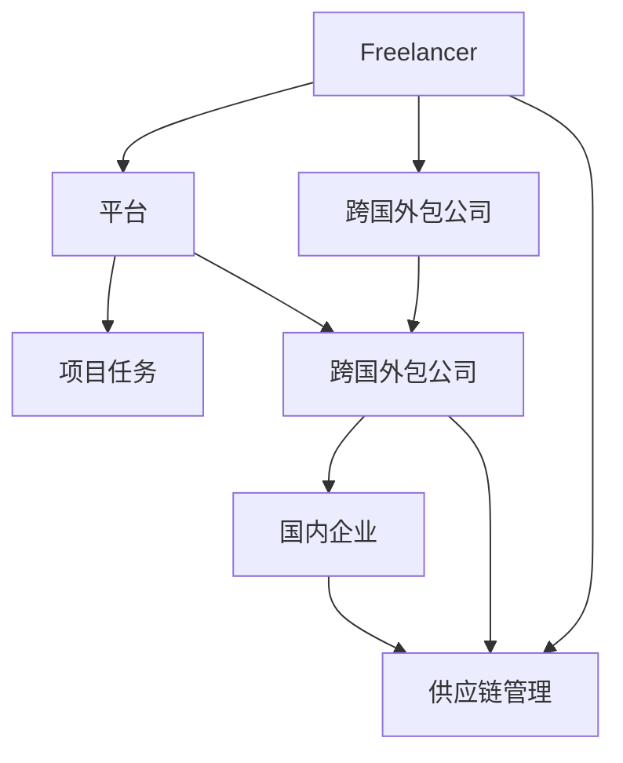
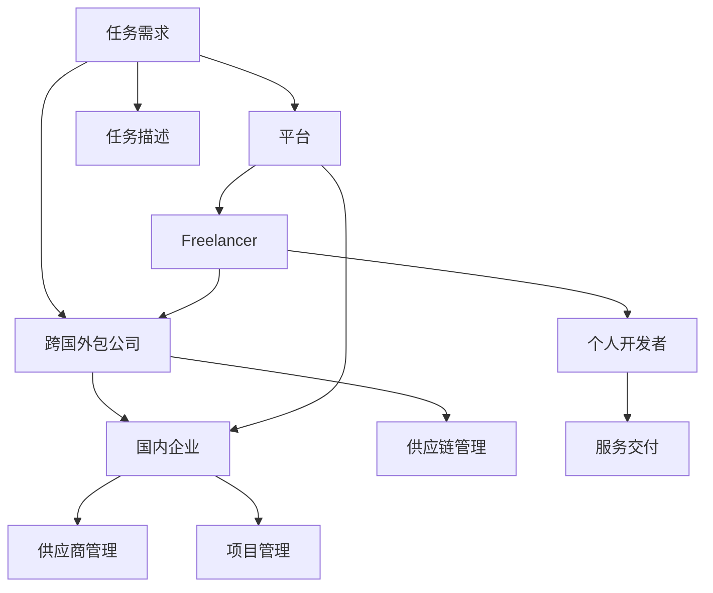

                 

## 1. 背景介绍

随着全球化的推进和企业运营模式的变迁，技术外包市场日益壮大。特别是在自由职业者（Freelancer）和跨国外包公司（Offshore Outsourcing Companies）迅速崛起，为全球提供多样化的IT技术服务。本文将全面探讨技术外包的发展现状，解析从Freelancer到跨国外包公司的演变过程，剖析其中的利弊，并展望未来的发展趋势。

## 2. 核心概念与联系

### 2.1 核心概念概述

为更好地理解技术外包的市场与机制，本节将介绍几个核心概念：

- **Freelancer**：指的是独立从事技术开发、维护等工作的个人，通常通过平台接取项目任务。
- **跨国外包公司**：是指在海外设立的分支机构或子公司，为国内企业提供技术开发、测试、维护等服务的机构。
- **技术外包**：是指将企业的技术需求或任务外包给第三方供应商，由其提供技术解决方案和资源。
- **平台**：如Upwork、Freelancer、Toptal等，为Freelancer提供项目任务并负责交易管理和监管。
- **供应链管理**：包含任务分配、项目管理、成本控制和质量监控等环节，保障项目顺利进行。

这些概念之间的联系通过以下Mermaid流程图得以展现：



### 2.2 核心概念原理和架构的 Mermaid 流程图



## 3. 核心算法原理 & 具体操作步骤

### 3.1 算法原理概述

技术外包的核心在于将非核心业务活动外包出去，企业专注于其核心业务，优化资源配置。其基本原理可概括为：

1. **任务描述与匹配**：企业将具体技术需求描述为任务，发布到平台。平台通过算法匹配合适的Freelancer或跨国外包公司。
2. **资源评估与选择**：平台根据Freelancer或跨国外包公司的历史评价、项目经验和报价等因素，综合评估其资源，推荐给企业。
3. **任务执行与监控**：企业选定供应商后，平台提供项目管理服务，监控任务进展，确保项目按时按质完成。
4. **反馈与改进**：项目完成后，企业根据使用体验，进行评价，供应商将根据评价调整自身服务，持续改进。

### 3.2 算法步骤详解

从Freelancer到跨国外包公司的演变，大致分为以下几个关键步骤：

**Step 1: 任务需求描述与发布**

- 企业详细描述其技术需求，包括功能要求、技术栈、预算和时间限制等。
- 发布到平台，平台将任务分解为可管理的子任务。

**Step 2: 供应商资源评估与选择**

- 平台根据任务需求，对注册供应商进行筛选，进行资源评估。
- 综合考虑历史评价、技术实力、报价等因素，推荐合适的供应商。

**Step 3: 任务执行与监控**

- 企业选择供应商，签订合同。
- 平台提供项目管理工具和资源，监控任务进展。
- 供应商根据任务需求，提供解决方案和资源。

**Step 4: 任务验收与反馈**

- 项目完成后，企业验收成果，通过平台评价。
- 供应商根据评价，改进服务，提升客户满意度。

### 3.3 算法优缺点

技术外包具有以下优点：

- **成本节约**：通过外包技术需求，企业可以降低人力成本和开发周期。
- **灵活性**：可以迅速引入外部技术资源，应对市场变化。
- **专业化**：外包公司通常具备专业化技能和经验，提供高质量的解决方案。
- **快速响应**：能够快速部署资源，满足企业的紧急需求。

其缺点包括：

- **沟通成本**：由于沟通距离较远，信息传递效率可能降低。
- **信任风险**：难以确保供应商的真实能力和信誉。
- **数据安全**：数据传输和存储可能存在安全风险。
- **服务质量不稳定**：不同供应商的服务质量可能参差不齐。

### 3.4 算法应用领域

技术外包广泛应用于企业IT项目的各个阶段，包括但不限于以下领域：

- **软件开发**：为实现新的功能或系统优化，开发新软件或应用。
- **技术维护**：提供长期的技术支持、系统维护和升级服务。
- **系统集成**：将不同系统或技术进行整合，形成一体化的解决方案。
- **云服务**：提供云基础设施、平台和应用服务等云服务解决方案。
- **测试与质量保证**：提供全面的测试和质量保证服务，保障系统稳定性和可靠性。
- **数据科学**：进行数据分析、机器学习和人工智能等数据分析服务。

## 4. 数学模型和公式 & 详细讲解 & 举例说明

### 4.1 数学模型构建

设企业任务需求为 $D$，供应商数量为 $S$，选择概率为 $p_{i,j}$（供应商 $i$ 完成任务 $j$ 的概率）。平台根据 $D$ 和 $S$，构建任务-供应商匹配模型，目标是最小化总成本 $C$：

$$
C = \sum_{i=1}^{S}\sum_{j=1}^{N}p_{i,j}c_{i,j}
$$

其中 $c_{i,j}$ 为供应商 $i$ 完成任务 $j$ 的单价。

### 4.2 公式推导过程

企业任务需求 $D$ 为 $(B, C, T)$，其中 $B$ 为预算，$C$ 为功能需求，$T$ 为时间限制。平台评估供应商 $i$ 的资源为 $R_i = (C_i, T_i, P_i)$，其中 $C_i$ 为历史项目成本，$T_i$ 为历史项目时间，$P_i$ 为评价分数。匹配模型为目标函数：

$$
\min_{p_{i,j}} C = \sum_{i=1}^{S}\sum_{j=1}^{N}p_{i,j}c_{i,j}
$$

约束条件为：

$$
\begin{aligned}
&\sum_{i=1}^{S}p_{i,j} \leq 1 \\
&p_{i,j} \geq 0 \\
&\sum_{j=1}^{N}p_{i,j} \leq 1
\end{aligned}
$$

利用线性规划方法求解，得到最优匹配策略。

### 4.3 案例分析与讲解

以软件开发为例，企业需求为开发一款电商系统。平台评估了多家供应商，选择评分最高的公司 $A$。公司 $A$ 提供了详细报价和项目时间表，并在规定时间内交付了系统。项目完成后，企业根据使用体验进行了满意度评价，反馈至平台，供应商根据评价改进服务，提高客户满意度。

## 5. 项目实践：代码实例和详细解释说明

### 5.1 开发环境搭建

本节将展示使用Python和Flask搭建一个简单的技术外包平台。

**Step 1: 环境准备**

1. 安装Python 3.8+。
2. 安装Flask、SQLAlchemy等依赖库。

**Step 2: 数据库设计**

- 创建数据库连接池。
- 设计任务表、供应商表、评价表等。

```python
from sqlalchemy import create_engine, Column, Integer, String, Float
from sqlalchemy.ext.declarative import declarative_base

engine = create_engine('sqlite://')

Base = declarative_base()

class Task(Base):
    __tablename__ = 'tasks'
    id = Column(Integer, primary_key=True)
    description = Column(String)
    budget = Column(Float)
    time_limit = Column(Integer)

class Supplier(Base):
    __tablename__ = 'suppliers'
    id = Column(Integer, primary_key=True)
    name = Column(String)
    cost_per_hour = Column(Float)
    evaluation = Column(Integer)

class Feedback(Base):
    __tablename__ = 'feedbacks'
    id = Column(Integer, primary_key=True)
    task_id = Column(Integer, ForeignKey('tasks.id'))
    supplier_id = Column(Integer, ForeignKey('suppliers.id'))
    score = Column(Integer)
```

### 5.2 源代码详细实现

以下是使用Flask搭建的技术外包平台的源代码。

**app.py**

```python
from flask import Flask, render_template, request
from flask_sqlalchemy import SQLAlchemy

app = Flask(__name__)
app.config['SQLALCHEMY_DATABASE_URI'] = 'sqlite://'

db = SQLAlchemy(app)

class Task(db.Model):
    __tablename__ = 'tasks'
    id = db.Column(db.Integer, primary_key=True)
    description = db.Column(db.String)
    budget = db.Column(db.Float)
    time_limit = db.Column(db.Integer)
    suppliers = db.relationship('Supplier', backref='supplied_tasks')

class Supplier(db.Model):
    __tablename__ = 'suppliers'
    id = db.Column(db.Integer, primary_key=True)
    name = db.Column(db.String)
    cost_per_hour = db.Column(db.Float)
    evaluation = db.Column(db.Integer)
    tasks = db.relationship('Task', backref='supplied_by')

@app.route('/', methods=['GET', 'POST'])
def index():
    if request.method == 'POST':
        task = Task(description=request.form['description'], budget=request.form['budget'], time_limit=request.form['time_limit'])
        db.session.add(task)
        db.session.commit()
        return 'Task created!'
    return render_template('index.html')

@app.route('/task/<int:id>')
def task_detail(id):
    task = Task.query.get(id)
    return render_template('task_detail.html', task=task)

@app.route('/supplier')
def supplier():
    suppliers = Supplier.query.all()
    return render_template('supplier.html', suppliers=suppliers)

if __name__ == '__main__':
    app.run(debug=True)
```

**templates/index.html**

```html
<form method="POST">
    <label>Task Description:</label><br>
    <input type="text" name="description"><br>
    <label>Budget:</label><br>
    <input type="text" name="budget"><br>
    <label>Time Limit:</label><br>
    <input type="text" name="time_limit"><br>
    <input type="submit" value="Create Task">
</form>
```

**templates/task_detail.html**

```html
<h1>Task Detail</h1>
<p>Description: {{ task.description }}</p>
<p>Budget: {{ task.budget }}</p>
<p>Time Limit: {{ task.time_limit }}</p>
```

**templates/supplier.html**

```html
<h1>Suppliers</h1>
<table>
    <tr>
        <th>Name</th>
        <th>Cost per Hour</th>
        <th>Score</th>
    </tr>
    
    <tr>
        <td>{{ supplier.name }}</td>
        <td>{{ supplier.cost_per_hour }}</td>
        <td>{{ supplier.evaluation }}</td>
    </tr>
    
</table>
```

### 5.3 代码解读与分析

**app.py**

- Flask框架用于搭建Web应用。
- SQLAlchemy用于管理数据库。
- Task和Supplier类映射数据库表，表示任务和供应商。

**templates/index.html**

- 展示表单界面，输入任务描述、预算和时间限制，提交创建任务。

**templates/task_detail.html**

- 展示任务详情，包括任务描述、预算和时间限制。

**templates/supplier.html**

- 展示供应商列表，包括供应商名称、小时费用和评价分数。

### 5.4 运行结果展示

启动应用程序，访问根路径，填写任务表单后提交，创建任务。点击任务ID，查看任务详情。进入供应商页面，浏览供应商信息。

## 6. 实际应用场景

技术外包在多个领域都有广泛应用，以下是几个典型的应用场景：

### 6.1 电商平台技术支持

电商平台需要提供24/7的客户支持和系统维护。通过技术外包，可以快速部署跨国外包公司提供的技术支持团队，处理客户投诉、系统故障和数据恢复等问题。

### 6.2 金融科技系统开发

金融科技公司需要快速开发和部署新功能，如金融产品、风控系统等。技术外包可以提供多样化的开发资源，缩短项目周期，降低开发成本。

### 6.3 企业内部IT系统维护

大中型企业内部IT系统复杂，维护成本高昂。通过外包公司，可以定期进行系统维护和升级，保障系统的稳定运行。

### 6.4 创新项目孵化

初创公司或中小企业面临技术资源不足的问题。通过技术外包，可以快速引入外部技术团队，加速创新项目的孵化和落地。

### 6.5 全球化IT资源优化

跨国公司需要优化其全球IT资源配置，降低海外运营成本。技术外包可以整合全球IT资源，提供高效的IT支持服务。

### 6.6 人才招募和培训

企业需要定期招聘和培训技术人才。技术外包可以提供全球化的人才服务，包括人才招聘、培训和技术支持。

## 7. 工具和资源推荐

### 7.1 学习资源推荐

1. **Coursera - Software Development Lifecycle (SDLC)**：
   - 涵盖软件开发生命周期的各个阶段，包括需求分析、设计、实现、测试和部署等。
   - 提供丰富的课程资源，涵盖敏捷开发、DevOps、CI/CD等。

2. **Udemy - Full Stack Web Developer**：
   - 提供全面的全栈开发课程，涵盖前端、后端、数据库和云服务等技术栈。
   - 实时更新课程内容，确保知识的前沿性。

3. **GitHub**：
   - 提供全球最大的开源社区，聚集了大量优秀的项目和开发者资源。
   - 可用于查找技术外包资源和合作项目。

### 7.2 开发工具推荐

1. **Git**：
   - 版本控制系统，支持团队协作开发，代码管理，版本控制。
   - 提供分支管理、Pull Request等功能，保障项目协作高效。

2. **JIRA**：
   - 项目管理工具，支持任务分配、进度跟踪、缺陷管理等。
   - 与GitHub集成，提供全面的项目管理和协作功能。

3. **Slack**：
   - 即时通讯工具，支持团队沟通协作，文件共享，集成JIRA等项目管理工具。
   - 提供丰富的第三方插件和集成，支持多样化工作流。

### 7.3 相关论文推荐

1. **A Survey on Outsourcing in Software Engineering**：
   - 综述了技术外包在软件工程中的应用现状和发展趋势。
   - 分析了技术外包的优势、挑战和未来方向。

2. **Leveraging Crowdsourcing Platforms for Software Development**：
   - 探讨了众包平台在软件开发中的应用，通过案例研究展示了其效果。
   - 分析了众包平台在资源管理和任务调度方面的优势和不足。

3. **Outsourcing Software Development**：
   - 介绍了技术外包的基本概念、流程和风险管理。
   - 提供了详细的案例分析，展示了技术外包的成功和失败经验。

## 8. 总结：未来发展趋势与挑战

### 8.1 研究成果总结

技术外包作为一种有效的企业IT资源管理方式，已经广泛应用于全球范围内的各行各业。其在降低成本、提高效率和灵活性等方面展示了显著的优势。然而，技术外包也面临着数据安全、通信效率、供应商选择和信任风险等挑战。

### 8.2 未来发展趋势

1. **云计算和SaaS模式的兴起**：
   - 云服务和SaaS（软件即服务）模式的兴起，进一步简化了技术外包的部署和管理。
   - 企业可以更加灵活地选择和配置IT资源，降低运营成本。

2. **智能技术和自动化工具的应用**：
   - 人工智能和自动化工具的应用，提升了技术外包的效率和质量。
   - 通过机器学习和自然语言处理等技术，优化任务分配和供应商选择。

3. **区块链和智能合约**：
   - 区块链和智能合约技术的应用，提高了交易透明度和信任度。
   - 通过智能合约，自动执行合同条款，保障交易安全和效率。

4. **全球化外包网络**：
   - 全球化外包网络的构建，提供了更广泛的技术资源和人才。
   - 企业可以根据项目需求，快速选择和配置跨国外包公司。

### 8.3 面临的挑战

1. **数据安全和隐私保护**：
   - 技术外包涉及到数据传输和存储，需要严格的数据安全保护措施。
   - 防止数据泄露和未经授权的访问，确保客户数据的安全。

2. **通信效率和延迟**：
   - 跨国外包面临通信延迟和数据传输效率问题。
   - 需要优化网络通信和数据传输，保障服务质量和用户体验。

3. **供应商选择和管理**：
   - 选择合适的供应商是技术外包成功的关键。
   - 需要进行详细的供应商评估和管理，确保服务质量。

4. **文化和管理差异**：
   - 跨国外包涉及不同文化和管理方式。
   - 需要建立有效的跨文化沟通和管理机制，确保项目顺利进行。

### 8.4 研究展望

未来，技术外包将在企业IT资源管理中发挥更加重要的作用。为应对挑战和抓住机遇，以下几个方向值得进一步探索：

1. **区块链和智能合约技术的应用**：
   - 通过区块链和智能合约，提升技术外包的交易透明度和信任度。
   - 自动化执行合同条款，降低管理成本，提高效率。

2. **人工智能和自动化工具的融合**：
   - 将人工智能和自动化工具引入技术外包，提升资源管理和任务分配的效率和质量。
   - 通过机器学习和自然语言处理等技术，优化供应商选择和任务匹配。

3. **多层次的外包策略**：
   - 制定多层次的外包策略，根据不同项目需求，灵活选择跨国外包和本地外包。
   - 结合全球和本地资源，最大化企业IT资源配置效率。

4. **客户体验的提升**：
   - 通过优化服务流程和用户体验，提升技术外包的整体满意度。
   - 建立有效的客户反馈和改进机制，不断提升服务质量和客户体验。

## 9. 附录：常见问题与解答

**Q1: 技术外包的成本和效益如何？**

A: 技术外包的效益主要体现在降低人力成本、提高效率和灵活性等方面。通过外包非核心业务，企业可以专注于核心业务，优化资源配置。然而，技术外包也存在一定的成本，包括平台费用、项目管理成本和供应商选择和管理成本。企业应根据自身业务需求和IT资源状况，综合评估成本和效益。

**Q2: 技术外包如何确保数据安全？**

A: 数据安全是技术外包的重要保障。企业需要与供应商签订数据保护协议，明确数据传输和存储的安全责任。采用加密传输和存储技术，保障数据安全。建立严格的数据访问控制和审计机制，防止未经授权的访问。

**Q3: 技术外包如何选择合适的供应商？**

A: 供应商选择是技术外包成功的关键。企业应综合考虑供应商的历史项目经验、技术实力、报价和服务质量等因素。可以通过平台评估和参考其他企业的评价，选择合适的供应商。建立供应商评价和奖惩机制，确保供应商服务质量。

**Q4: 技术外包的通信效率和延迟如何优化？**

A: 通信效率和延迟是跨国外包面临的主要问题。企业需要选择合适的网络通信方案，优化数据传输效率。采用CDN（内容分发网络）和边缘计算等技术，降低通信延迟。建立跨地域的网络监控和故障处理机制，保障网络稳定性。

**Q5: 技术外包的信任风险如何缓解？**

A: 信任风险是技术外包的主要挑战之一。企业需要与供应商签订详细的合同条款，明确各自的权利和义务。采用智能合约和区块链技术，提升交易透明度和信任度。建立有效的风险管理和应急预案，保障项目顺利进行。

---

作者：禅与计算机程序设计艺术 / Zen and the Art of Computer Programming

