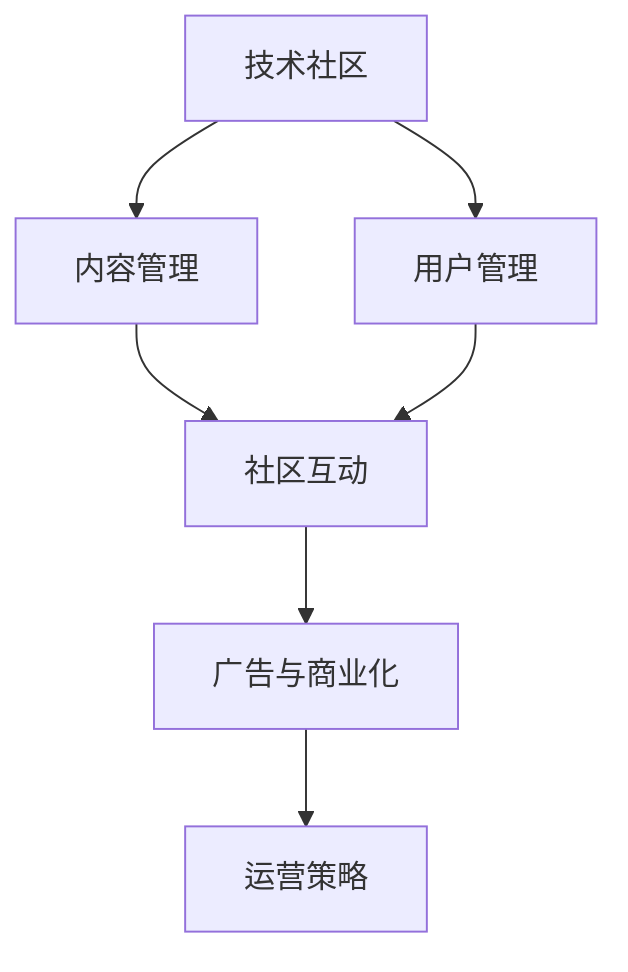

                 

## 1. 背景介绍

### 1.1 问题由来
随着互联网的发展，技术社区日益成为技术交流、知识共享的重要平台。无论是开源社区，如GitHub、Stack Overflow，还是技术论坛、博客平台，如CSDN、知乎，都汇聚了大量技术人员，形成了庞大的知识网络和活跃的技术氛围。技术社区为技术创新、人才成长提供了良好的土壤，推动了信息技术的不断进步。然而，技术社区的运营管理面临着诸多挑战，如何在竞争激烈的市场环境中生存和发展，逐步实现盈利，成为每个技术社区管理者和运营者必须面对的难题。本文将从技术社区运营的角度出发，探讨如何通过精细化管理，实现社区的长期稳定发展。

### 1.2 问题核心关键点
技术社区运营的核心关键点主要包括：
- 用户管理：如何吸引和留住高质量用户，提升用户体验和满意度。
- 内容管理：如何激励和引导优质内容产出，形成丰富的知识库和讨论氛围。
- 社区互动：如何促进社区成员之间的互动交流，增强社区凝聚力和粘性。
- 广告与商业化：如何在保持社区生态健康的同时，实现社区的盈利。
- 运营策略：如何制定和执行有效的运营策略，适应市场变化和用户需求。

### 1.3 问题研究意义
探讨技术社区运营的策略和盈利模式，对于提升社区的用户体验和品牌影响力，驱动技术创新和人才成长，具有重要意义：
- 用户体验优化：通过精细化管理，提升用户满意度和参与度，增强社区的粘性和活力。
- 内容质量提升：激励和引导优质内容产出，丰富社区的知识库和讨论内容，吸引更多用户加入。
- 商业价值变现：在保障社区生态健康的基础上，通过合理的商业化策略，实现社区的盈利，促进社区的可持续发展。
- 运营策略创新：探索和实施有效的运营策略，提升社区的市场竞争力，应对市场变化和用户需求。

## 2. 核心概念与联系

### 2.1 核心概念概述

技术社区运营涉及多个核心概念，这些概念之间相互关联，共同构成了一个完整的运营体系：

- **技术社区**：指以技术交流、知识分享为目的，由技术爱好者和专业人士组成的在线平台或聚集地。
- **用户管理**：指通过有效的用户管理策略，吸引和留住高质量用户，提升用户体验和满意度。
- **内容管理**：指通过激励和引导机制，促进优质内容产出，丰富社区的知识库和讨论氛围。
- **社区互动**：指通过互动交流，增强社区成员之间的联系和信任，提升社区的凝聚力和粘性。
- **广告与商业化**：指通过广告和商业化策略，实现社区的盈利，同时确保社区生态的健康。
- **运营策略**：指制定和执行有效的运营策略，适应市场变化和用户需求，保障社区的长期稳定发展。

这些核心概念之间的逻辑关系可以通过以下Mermaid流程图来展示：



这个流程图展示了一个技术社区从用户管理到内容管理、社区互动、广告商业化，再到运营策略的完整运营体系：

1. 技术社区通过用户管理策略吸引和留住高质量用户。
2. 内容管理促进优质内容产出，丰富社区的知识库和讨论氛围。
3. 社区互动增强成员之间的联系和信任，提升社区的凝聚力和粘性。
4. 广告商业化实现社区盈利，同时确保社区生态的健康。
5. 运营策略保障社区的长期稳定发展，应对市场变化和用户需求。

## 3. 核心算法原理 & 具体操作步骤

### 3.1 算法原理概述

技术社区运营的本质是通过精细化管理，提升用户体验和满意度，促进优质内容产出，增强社区的粘性和活力，最终实现社区的盈利。核心算法原理包括：

1. **用户管理算法**：基于推荐系统、用户行为分析等技术，精准匹配用户需求，提供个性化服务，提升用户满意度和留存率。
2. **内容管理算法**：通过激励机制、内容审核等技术，引导优质内容产出，丰富社区的知识库和讨论氛围。
3. **社区互动算法**：利用社交网络、社区活动等手段，促进社区成员之间的互动交流，增强社区的凝聚力和粘性。
4. **广告与商业化算法**：基于广告推荐、定向投放等技术，实现社区的盈利，同时确保社区生态的健康。
5. **运营策略算法**：通过数据分析、市场预测等技术，制定和执行有效的运营策略，保障社区的长期稳定发展。

### 3.2 算法步骤详解

技术社区运营的算法步骤包括：

**Step 1: 数据采集与处理**
- 收集用户行为数据、内容发布数据、社区互动数据等。
- 清洗和预处理数据，构建特征向量。

**Step 2: 用户管理**
- 使用推荐算法，根据用户历史行为和偏好，推荐相关内容，提升用户体验。
- 使用用户行为分析算法，识别流失用户，采取留存策略。
- 设计激励机制，如积分、徽章、等级等，激励用户积极参与。

**Step 3: 内容管理**
- 使用内容审核算法，筛选和删除低质量内容，维护社区内容质量。
- 使用激励算法，奖励优质内容产出者，提升内容生产效率。
- 使用标签和分类算法，帮助用户快速找到感兴趣的内容。

**Step 4: 社区互动**
- 使用社交网络算法，构建社区关系图，促进成员之间的互动交流。
- 组织社区活动，如技术分享、线下聚会等，增强社区凝聚力。
- 使用反馈机制，收集用户意见和建议，不断优化社区环境。

**Step 5: 广告与商业化**
- 使用定向投放算法，将广告精准投放给目标用户。
- 设计合理的广告策略，平衡广告收入和用户体验。
- 通过数据分析，实时调整广告投放策略，提升广告效果。

**Step 6: 运营策略**
- 使用市场分析算法，预测市场趋势和用户需求。
- 制定相应的运营策略，如内容推广、用户增长、生态建设等。
- 定期评估运营策略的效果，不断优化和调整。

### 3.3 算法优缺点

技术社区运营的算法具有以下优点：
1. 提高用户满意度和留存率：通过个性化推荐和激励机制，满足用户需求，提升用户体验和满意度。
2. 促进优质内容产出：通过内容审核和激励算法，引导优质内容产出，丰富社区的知识库和讨论氛围。
3. 增强社区粘性：通过社交网络和技术活动，促进社区互动，增强社区凝聚力和粘性。
4. 实现盈利：通过精准广告投放和商业化策略，实现社区盈利，支持社区的可持续发展。
5. 应对市场变化：通过市场分析算法，制定灵活的运营策略，适应市场变化和用户需求。

同时，这些算法也存在一定的局限性：
1. 算法依赖数据：算法效果依赖于高质量数据，数据获取和处理成本较高。
2. 用户隐私问题：算法涉及大量用户行为和内容数据，用户隐私保护是重要挑战。
3. 算法复杂度高：多算法结合使用，算法复杂度高，对技术要求较高。
4. 广告效果不确定性：广告投放效果受多种因素影响，难以完全预测和控制。
5. 运营策略执行难度大：制定和执行有效的运营策略，需要持续监控和调整，难度较大。

### 3.4 算法应用领域

技术社区运营的算法应用广泛，包括：
- 开源社区：如GitHub、Apache等，通过用户管理、内容管理和社区互动，提升社区活跃度和用户满意度。
- 技术论坛：如CSDN、知乎等，通过广告商业化和运营策略，实现社区盈利。
- 博客平台：如Medium、博客园等，通过个性化推荐和优质内容产出，提升用户粘性和平台影响力。
- 技术培训平台：如Coursera、Udemy等，通过内容管理和用户互动，提供高质量的在线课程。

## 4. 数学模型和公式 & 详细讲解 & 举例说明

### 4.1 数学模型构建

技术社区运营的数学模型包括用户管理、内容管理、社区互动、广告与商业化、运营策略等多个方面。以下以推荐系统为例，介绍推荐算法的数学模型。

设用户集为 $U=\{u_1,u_2,...,u_n\}$，物品集为 $I=\{i_1,i_2,...,i_m\}$。假设用户 $u_i$ 对物品 $i_j$ 的评分 $r_{i_j}$ 服从概率分布 $P(r_{i_j}|u_i)$。推荐算法的目标是通过已知用户行为数据 $D=\{(u_k,i_l,r_{i_l}|u_k)\}_{k=1}^N$，预测用户 $u_i$ 对物品 $i_j$ 的评分 $r_{i_j}(u_i)$，并选择推荐列表 $\hat{I}$，使得推荐列表中的物品评分为所有物品中的最高值。

推荐算法使用协同过滤、基于内容的推荐、矩阵分解等方法，将用户和物品映射到低维向量空间中，计算相似度，进行推荐。

### 4.2 公式推导过程

推荐算法的核心公式为协同过滤中的用户-物品矩阵分解：

设用户-物品评分矩阵为 $R\in \mathbb{R}^{n\times m}$，用户向量为 $U\in \mathbb{R}^{n\times d}$，物品向量为 $V\in \mathbb{R}^{m\times d}$，其中 $d$ 为向量的维度。推荐算法通过优化以下目标函数，计算用户和物品的向量表示：

$$
\min_{U,V} \frac{1}{2}\sum_{i,j}(r_{i,j}-U_iV_j)^2
$$

其中 $U_i$ 和 $V_j$ 分别表示用户 $i$ 和物品 $j$ 的向量表示。

具体算法步骤如下：
1. 对用户-物品评分矩阵 $R$ 进行矩阵分解：$R=UV$。
2. 对用户和物品向量 $U$ 和 $V$ 进行优化：
$$
\min_{U,V} \frac{1}{2}\|R-UV\|_F^2
$$
3. 将优化后的用户和物品向量用于推荐。

### 4.3 案例分析与讲解

以Medium为例，介绍个性化推荐算法在技术社区中的应用。

Medium是一个博客平台，用户可以通过发表和阅读文章，参与技术讨论和知识分享。为了提升用户体验，Medium引入了个性化推荐算法，通过分析用户行为和偏好，推荐相关的文章和作者。

具体实现步骤如下：
1. 收集用户行为数据，如浏览文章、点赞、评论等。
2. 对用户行为数据进行清洗和预处理，构建用户行为向量 $U$。
3. 对文章特征进行提取和编码，构建文章特征向量 $V$。
4. 使用协同过滤算法，对用户行为向量 $U$ 和文章特征向量 $V$ 进行矩阵分解，得到用户对文章的评分预测。
5. 根据评分预测结果，生成推荐列表 $\hat{I}$，推荐给用户。

通过个性化推荐算法，Medium能够有效提升用户的留存率和活跃度，同时增加文章和作者的曝光度，促进社区的知识共享和交流。

## 5. 项目实践：代码实例和详细解释说明

### 5.1 开发环境搭建

在进行技术社区运营的算法实践前，我们需要准备好开发环境。以下是使用Python进行TensorFlow开发的环境配置流程：

1. 安装Anaconda：从官网下载并安装Anaconda，用于创建独立的Python环境。

2. 创建并激活虚拟环境：
```bash
conda create -n tf-env python=3.8 
conda activate tf-env
```

3. 安装TensorFlow：根据CUDA版本，从官网获取对应的安装命令。例如：
```bash
conda install tensorflow tensorflow-gpu==2.8.0 -c pytorch -c conda-forge
```

4. 安装各类工具包：
```bash
pip install numpy pandas scikit-learn matplotlib tqdm jupyter notebook ipython
```

完成上述步骤后，即可在`tf-env`环境中开始算法实践。

### 5.2 源代码详细实现

这里我们以推荐系统为例，给出使用TensorFlow实现个性化推荐算法的PyTorch代码实现。

首先，定义用户-物品评分矩阵：

```python
import tensorflow as tf

# 定义用户-物品评分矩阵
R = tf.constant([[5, 4, 0, 0],
                 [0, 0, 5, 4],
                 [4, 0, 0, 5],
                 [0, 5, 4, 0]], dtype=tf.float32)
```

然后，定义用户向量和物品向量：

```python
# 定义用户向量和物品向量
U = tf.constant([[1, 2, 3, 4], 
                 [4, 3, 2, 1]], dtype=tf.float32)
V = tf.constant([[5, 6, 7, 8], 
                 [8, 7, 6, 5]], dtype=tf.float32)
```

接着，定义优化器并计算损失：

```python
# 定义优化器
optimizer = tf.keras.optimizers.Adam(learning_rate=0.01)

# 定义损失函数
loss = tf.reduce_mean(tf.square(R - tf.matmul(U, V)))

# 反向传播优化
optimizer.minimize(loss)
```

最后，生成推荐列表：

```python
# 计算预测评分
predicted_r = tf.matmul(U, V)

# 生成推荐列表
top_2_recommendations = tf.argsort(predicted_r, axis=1)[:,:2].numpy()
```

完整代码如下：

```python
import tensorflow as tf

# 定义用户-物品评分矩阵
R = tf.constant([[5, 4, 0, 0],
                 [0, 0, 5, 4],
                 [4, 0, 0, 5],
                 [0, 5, 4, 0]], dtype=tf.float32)

# 定义用户向量和物品向量
U = tf.constant([[1, 2, 3, 4], 
                 [4, 3, 2, 1]], dtype=tf.float32)
V = tf.constant([[5, 6, 7, 8], 
                 [8, 7, 6, 5]], dtype=tf.float32)

# 定义优化器
optimizer = tf.keras.optimizers.Adam(learning_rate=0.01)

# 定义损失函数
loss = tf.reduce_mean(tf.square(R - tf.matmul(U, V)))

# 反向传播优化
optimizer.minimize(loss)

# 计算预测评分
predicted_r = tf.matmul(U, V)

# 生成推荐列表
top_2_recommendations = tf.argsort(predicted_r, axis=1)[:,:2].numpy()

print("推荐列表：")
print(top_2_recommendations)
```

### 5.3 代码解读与分析

让我们再详细解读一下关键代码的实现细节：

**推荐系统算法**：
- `R`：用户-物品评分矩阵。
- `U` 和 `V`：用户向量和物品向量。
- `optimizer`：优化器，用于最小化损失函数。
- `loss`：损失函数，计算预测评分与实际评分之间的差距。
- `predicted_r`：预测评分。
- `top_2_recommendations`：推荐列表，取预测评分最高的两个物品。

通过上述代码，我们实现了基于协同过滤的推荐算法，生成推荐列表。推荐算法简单易懂，易于实现和扩展。

## 6. 实际应用场景

### 6.1 智能推荐系统

智能推荐系统是技术社区运营的核心应用之一。通过推荐算法，平台能够精准匹配用户需求，提升用户体验和满意度，增加平台的用户粘性。

以电商平台为例，通过推荐算法，平台能够根据用户的历史购买记录、浏览行为、评分数据等，推荐用户感兴趣的商品。推荐算法不仅能提升用户体验，还能增加用户的复购率，提升平台的商业价值。

### 6.2 内容管理系统

内容管理系统是技术社区运营的另一重要应用。通过内容管理算法，平台能够激励优质内容产出，丰富社区的知识库和讨论氛围。

以博客平台为例，通过内容审核算法，平台能够筛选和删除低质量内容，维护社区内容质量。同时，通过激励算法，平台能够奖励优质内容产出者，提升内容生产效率。平台通过内容管理系统，能够为用户提供高质量的阅读体验，吸引更多用户加入社区。

### 6.3 社交网络

社交网络是技术社区运营的重要组成部分，通过社交网络算法，平台能够促进社区成员之间的互动交流，增强社区的凝聚力和粘性。

以社交网络平台为例，通过社交网络算法，平台能够构建社区关系图，推荐用户关注感兴趣的内容和用户，增强社区成员之间的联系和信任。平台通过社交网络，能够营造良好的社区氛围，提升用户的活跃度和参与度。

### 6.4 未来应用展望

随着技术社区的不断发展，技术社区运营的算法将呈现以下几个发展趋势：

1. **个性化推荐更加精细化**：通过更复杂的推荐算法和多模态数据的融合，推荐系统将更加精细化，能够提供更加精准和个性化的推荐结果。
2. **内容管理更加智能化**：通过智能化的内容审核和激励机制，平台能够自动筛选和奖励优质内容，提升内容质量和社区生态。
3. **社交网络更加活跃化**：通过先进的社交网络算法和社区活动，平台能够促进社区成员之间的互动交流，增强社区的凝聚力和粘性。
4. **商业化更加智能化**：通过智能化的广告投放和商业化策略，平台能够实现盈利，同时确保社区生态的健康。
5. **运营策略更加灵活化**：通过数据分析和市场预测，平台能够制定灵活的运营策略，应对市场变化和用户需求。

未来，技术社区运营的算法将更加智能化、精细化和多样化，能够更好地适应市场变化和用户需求，实现社区的长期稳定发展。

## 7. 工具和资源推荐

### 7.1 学习资源推荐

为了帮助开发者系统掌握技术社区运营的理论基础和实践技巧，这里推荐一些优质的学习资源：

1. 《推荐系统实战》：该书详细介绍了推荐算法的原理和实现方法，提供了丰富的案例和代码实践。
2. 《社交网络分析》：该书介绍了社交网络算法的原理和应用，提供了丰富的案例和代码实践。
3. 《机器学习实战》：该书介绍了机器学习算法的原理和实现方法，提供了丰富的案例和代码实践。
4. Coursera《Recommender Systems》课程：由斯坦福大学开设的推荐系统课程，有Lecture视频和配套作业，带你入门推荐系统领域的基本概念和经典模型。
5. Udacity《Advanced Machine Learning》课程：介绍了高级机器学习算法和实际应用，提供了丰富的案例和代码实践。

通过对这些资源的学习实践，相信你一定能够快速掌握技术社区运营的精髓，并用于解决实际的运营问题。

### 7.2 开发工具推荐

高效的开发离不开优秀的工具支持。以下是几款用于技术社区运营开发的常用工具：

1. TensorFlow：基于Python的开源深度学习框架，灵活动态的计算图，适合快速迭代研究。大部分推荐系统都有TensorFlow版本的实现。
2. PyTorch：基于Python的开源深度学习框架，灵活多变，适合复杂算法的实现。推荐系统常用的算法都可以在PyTorch上实现。
3. Keras：基于Python的深度学习框架，简单易用，适合快速搭建模型和算法原型。推荐系统常用的算法都可以在Keras上实现。
4. Weights & Biases：模型训练的实验跟踪工具，可以记录和可视化模型训练过程中的各项指标，方便对比和调优。与主流深度学习框架无缝集成。
5. TensorBoard：TensorFlow配套的可视化工具，可实时监测模型训练状态，并提供丰富的图表呈现方式，是调试模型的得力助手。

合理利用这些工具，可以显著提升技术社区运营的开发效率，加快创新迭代的步伐。

### 7.3 相关论文推荐

技术社区运营的算法研究源于学界的持续研究。以下是几篇奠基性的相关论文，推荐阅读：

1. "Collaborative Filtering for Implicit Feedback Datasets"：介绍了协同过滤算法的原理和实现方法，是推荐系统领域的经典论文。
2. "Recommender Systems Handbook"：详细介绍推荐系统的理论基础和实际应用，是推荐系统领域的经典教材。
3. "Social Network Analysis"：介绍社交网络算法的原理和应用，是社交网络分析领域的经典教材。
4. "The PageRank Algorithm"：介绍了PageRank算法的原理和实现方法，是搜索引擎和社交网络算法的经典论文。
5. "Convolutional Neural Networks for Scalable Recommender Systems"：介绍了卷积神经网络在推荐系统中的应用，是深度学习在推荐系统中的经典论文。

这些论文代表了大规模技术社区运营算法的演进历程，是学习和研究技术社区运营算法的重要参考。

## 8. 总结：未来发展趋势与挑战

### 8.1 总结

本文对技术社区运营的策略和盈利模式进行了全面系统的介绍。首先阐述了技术社区运营的背景和意义，明确了社区运营的核心关键点，包括用户管理、内容管理、社区互动、广告与商业化、运营策略等。其次，从原理到实践，详细讲解了推荐算法的数学原理和具体实现，给出了推荐系统项目的代码实例。同时，本文还广泛探讨了技术社区运营在多个领域的应用前景，展示了运营范式的巨大潜力。最后，本文精选了技术社区运营的学习资源、开发工具和相关论文，力求为读者提供全方位的技术指引。

通过本文的系统梳理，可以看到，技术社区运营涉及多个方面的精细化管理，能够提升用户体验和满意度，促进优质内容产出，增强社区粘性和活力，最终实现社区的盈利。未来，伴随技术社区的不断发展，运营算法的智能化、精细化和多样化，将进一步提升社区的用户体验和品牌影响力，驱动技术创新和人才成长，实现社区的长期稳定发展。

### 8.2 未来发展趋势

展望未来，技术社区运营的算法将呈现以下几个发展趋势：

1. **推荐系统更加个性化**：通过更复杂的推荐算法和多模态数据的融合，推荐系统将更加精细化，能够提供更加精准和个性化的推荐结果。
2. **内容管理更加智能化**：通过智能化的内容审核和激励机制，平台能够自动筛选和奖励优质内容，提升内容质量和社区生态。
3. **社交网络更加活跃化**：通过先进的社交网络算法和社区活动，平台能够促进社区成员之间的互动交流，增强社区的凝聚力和粘性。
4. **商业化更加智能化**：通过智能化的广告投放和商业化策略，平台能够实现盈利，同时确保社区生态的健康。
5. **运营策略更加灵活化**：通过数据分析和市场预测，平台能够制定灵活的运营策略，应对市场变化和用户需求。

这些趋势凸显了技术社区运营算法的广阔前景。这些方向的探索发展，必将进一步提升社区的用户体验和品牌影响力，驱动技术创新和人才成长，为社区的可持续发展提供坚实保障。

### 8.3 面临的挑战

尽管技术社区运营的算法已经取得了瞩目成就，但在迈向更加智能化、普适化应用的过程中，它仍面临着诸多挑战：

1. **算法依赖数据**：算法效果依赖于高质量数据，数据获取和处理成本较高。
2. **用户隐私问题**：算法涉及大量用户行为和内容数据，用户隐私保护是重要挑战。
3. **算法复杂度高**：多算法结合使用，算法复杂度高，对技术要求较高。
4. **广告效果不确定性**：广告投放效果受多种因素影响，难以完全预测和控制。
5. **运营策略执行难度大**：制定和执行有效的运营策略，需要持续监控和调整，难度较大。

正视技术社区运营面临的这些挑战，积极应对并寻求突破，将是大语言模型微调走向成熟的必由之路。相信随着学界和产业界的共同努力，这些挑战终将一一被克服，技术社区运营必将在构建人机协同的智能时代中扮演越来越重要的角色。

### 8.4 研究展望

面对技术社区运营所面临的种种挑战，未来的研究需要在以下几个方面寻求新的突破：

1. **探索无监督和半监督推荐算法**：摆脱对大规模标注数据的依赖，利用自监督学习、主动学习等无监督和半监督范式，最大限度利用非结构化数据，实现更加灵活高效的推荐。
2. **研究参数高效和计算高效的推荐算法**：开发更加参数高效的推荐方法，在固定大部分预训练参数的同时，只更新极少量的任务相关参数。同时优化推荐模型的计算图，减少前向传播和反向传播的资源消耗，实现更加轻量级、实时性的部署。
3. **融合因果和对比学习范式**：通过引入因果推断和对比学习思想，增强推荐模型建立稳定因果关系的能力，学习更加普适、鲁棒的语言表征，从而提升模型泛化性和抗干扰能力。
4. **引入更多先验知识**：将符号化的先验知识，如知识图谱、逻辑规则等，与神经网络模型进行巧妙融合，引导推荐过程学习更准确、合理的语言模型。同时加强不同模态数据的整合，实现视觉、语音等多模态信息与文本信息的协同建模。
5. **结合因果分析和博弈论工具**：将因果分析方法引入推荐模型，识别出模型决策的关键特征，增强输出解释的因果性和逻辑性。借助博弈论工具刻画人机交互过程，主动探索并规避模型的脆弱点，提高系统稳定性。
6. **纳入伦理道德约束**：在模型训练目标中引入伦理导向的评估指标，过滤和惩罚有偏见、有害的输出倾向。同时加强人工干预和审核，建立模型行为的监管机制，确保输出符合人类价值观和伦理道德。

这些研究方向的探索，必将引领技术社区运营算法迈向更高的台阶，为社区的可持续发展提供新的动力。面向未来，技术社区运营的算法还需要与其他人工智能技术进行更深入的融合，如知识表示、因果推理、强化学习等，多路径协同发力，共同推动自然语言理解和智能交互系统的进步。只有勇于创新、敢于突破，才能不断拓展语言模型的边界，让智能技术更好地造福人类社会。

## 9. 附录：常见问题与解答

**Q1：技术社区运营的算法依赖数据，如何获取高质量数据？**

A: 技术社区运营的算法依赖高质量的数据，获取高质量数据的成本较高。以下是一些获取高质量数据的策略：
1. 数据采集：通过爬虫、API接口等方式，从开放数据源采集数据，如网络评论、社交媒体、公共数据集等。
2. 数据清洗：对采集到的数据进行清洗和预处理，去除噪声、缺失值、重复值等。
3. 数据标注：对部分数据进行标注，生成训练数据集。标注数据可以通过众包平台、专业标注公司等方式获取。
4. 数据增强：通过数据增强技术，如回译、近义词替换、数据合成等方式，扩充训练集。
5. 数据共享：与其他社区、平台共享数据，互相补充数据不足。

**Q2：技术社区运营的算法涉及大量用户行为和内容数据，如何保护用户隐私？**

A: 技术社区运营的算法涉及大量用户行为和内容数据，用户隐私保护是重要挑战。以下是一些保护用户隐私的策略：
1. 数据匿名化：对用户数据进行匿名化处理，去除或模糊化敏感信息。
2. 数据加密：对用户数据进行加密处理，防止数据泄露和篡改。
3. 数据访问控制：限制对用户数据的访问权限，确保数据只能被授权人员访问。
4. 数据匿名化处理：对用户数据进行匿名化处理，保护用户隐私。
5. 数据隐私保护法律法规：遵循相关法律法规，如GDPR、CCPA等，保护用户隐私。

**Q3：技术社区运营的算法复杂度高，如何优化算法性能？**

A: 技术社区运营的算法复杂度高，对技术要求较高。以下是一些优化算法性能的策略：
1. 算法优化：对算法进行优化，减少算法复杂度，提升算法效率。
2. 分布式计算：使用分布式计算框架，如Spark、Flink等，加速算法计算。
3. 模型压缩：对模型进行压缩，减少模型大小和计算量。
4. 模型并行化：将模型并行化，提升模型训练和推理速度。
5. 数据增量更新：通过增量更新算法，减少数据处理和模型更新的时间和资源消耗。

**Q4：技术社区运营的算法面临市场变化和用户需求的变化，如何应对？**

A: 技术社区运营的算法面临市场变化和用户需求的变化，以下是一些应对策略：
1. 数据分析：通过数据分析，预测市场变化和用户需求，及时调整运营策略。
2. 用户反馈：通过用户反馈机制，收集用户意见和建议，不断优化社区环境。
3. 运营策略调整：根据市场变化和用户需求，及时调整运营策略，如内容推广、用户增长、生态建设等。
4. 技术创新：通过技术创新，引入新技术和新方法，提升社区运营效率和效果。
5. 市场调研：通过市场调研，了解市场趋势和用户需求，制定合理的运营策略。

**Q5：技术社区运营的算法面临多重挑战，如何实现盈利？**

A: 技术社区运营的算法面临多重挑战，实现盈利需要综合考虑多个方面：
1. 广告商业化：通过精准广告投放和商业化策略，实现社区盈利。
2. 会员制度：通过会员制度，收取会员费用，提升社区盈利能力。
3. 知识付费：通过知识付费模式，向用户提供高质量的付费内容，提升社区盈利能力。
4. 社区活动：通过社区活动和线下聚会，增加社区变现渠道。
5. 企业合作：通过与企业合作，增加社区盈利来源。

这些策略需要综合考虑，才能实现社区的盈利，同时确保社区生态的健康。

---

作者：禅与计算机程序设计艺术 / Zen and the Art of Computer Programming

