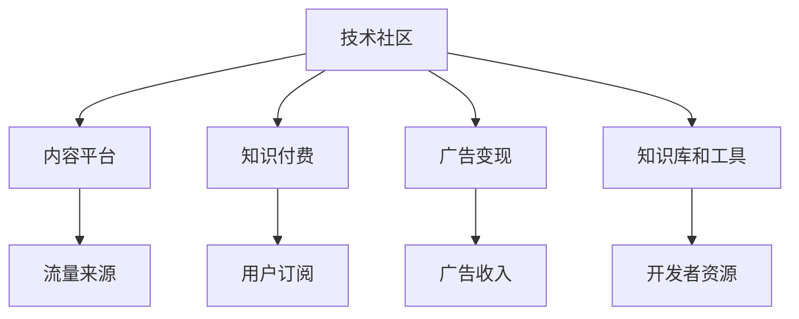

                 

# 技术社区运营：影响力变现

## 1. 背景介绍

### 1.1 问题由来

随着技术的发展，技术社区如雨后春笋般涌现，为技术从业者提供了一个展示才华、交流经验、分享心得的平台。然而，社区的成功不仅仅取决于技术内容的丰富性和深度，还取决于其影响力的大小。技术社区运营者希望通过社区的影响力来提升品牌价值，实现商业变现，但如何有效地将影响力转化为实际价值，成为一大难题。

### 1.2 问题核心关键点

本文聚焦于技术社区的影响力变现问题。通过深入分析技术社区的影响力来源、变现途径和成功案例，提出了一套系统化、可操作化的运营策略，帮助技术社区运营者实现影响力的最大化，从而创造商业价值。

### 1.3 问题研究意义

研究技术社区的影响力变现问题，对于推动技术社区的可持续发展、促进技术传播、激发技术创新具有重要意义：

1. 提升社区价值。通过对社区影响力的深入挖掘，可以吸引更多高质量用户和内容创作者，提升社区的整体价值。
2. 促进知识传播。社区成为技术知识传播的重要渠道，帮助更多从业者获取前沿技术和经验。
3. 创造商业价值。社区运营者可以充分利用社区的影响力，实现广告、赞助、知识付费等多种变现方式，实现可持续运营。
4. 激发技术创新。社区成为技术创新的策源地，汇聚全球顶尖技术人才，促进技术交流和合作。

## 2. 核心概念与联系

### 2.1 核心概念概述

为更好地理解技术社区的影响力变现问题，本节将介绍几个密切相关的核心概念：

- 技术社区：由技术从业者、爱好者组成的在线平台，以交流技术经验、分享技术见解、解决技术问题为主要目的。
- 内容平台：以用户生成内容为核心的平台，如知乎、Stack Overflow等。
- 知识付费：通过收取用户订阅费、付费问答等方式，提供高质量技术知识的平台，如CSDN、极客时间等。
- 广告变现：通过展示广告、推荐商品等方式，获得广告收入的平台，如博客园、知乎等。
- 知识库和工具：提供技术文档、API接口、开发工具等，帮助开发者快速解决技术问题的平台，如GitHub、Maven等。

这些核心概念之间的逻辑关系可以通过以下Mermaid流程图来展示：



这个流程图展示了一些技术社区的核心概念及其之间的联系：

1. 技术社区通过内容平台、知识付费、广告变现、知识库和工具等方式，提供丰富的技术服务。
2. 内容平台和知识付费平台是技术社区获取流量和用户订阅的主要来源。
3. 广告变现和知识库和工具为技术社区提供了广告收入和开发者资源，支持社区的可持续发展。
4. 社区的影响力能够吸引更多高质量用户和内容创作者，提升社区的整体价值。

## 3. 核心算法原理 & 具体操作步骤

### 3.1 算法原理概述

技术社区的影响力变现，本质上是一个流量和内容变现的过程。其核心思想是：通过高质量的内容吸引用户，利用用户流量进行商业变现，同时利用广告收入和开发者资源，提升社区的整体价值和服务水平。

形式化地，假设社区的用户规模为 $U$，内容质量为 $Q$，流量获取策略为 $F$，广告变现策略为 $A$，知识库和工具质量为 $T$。变现过程的目标是最大化商业收益 $R$，即：

$$
R = F(U, Q) + A(U, T)
$$

其中 $F(U, Q)$ 表示通过内容平台和知识付费平台获取用户流量，并实现商业变现，$A(U, T)$ 表示通过广告变现和知识库和工具提供服务，提升社区价值。

### 3.2 算法步骤详解

技术社区的影响力变现一般包括以下几个关键步骤：

**Step 1: 确定社区定位和目标用户**

- 明确社区的主要目标用户群体，如开发者、工程师、学生等。
- 确定社区的核心主题和定位，如云计算、人工智能、大数据等。

**Step 2: 制定内容策略**

- 制定高质量的内容策略，吸引和保留用户。
- 引入知名技术专家、大V，提高社区的权威性和影响力。
- 提供多样化的内容形式，如图文、视频、直播等，满足不同用户的需求。

**Step 3: 实施流量获取策略**

- 通过SEO优化、社交媒体推广、合作伙伴等方式，提高社区的曝光度。
- 在各大平台（如微博、知乎、YouTube等）进行内容营销，吸引更多用户访问。
- 引入社区大使、意见领袖等，扩大社区的影响力。

**Step 4: 制定商业变现策略**

- 开设广告位、推荐商品、进行流量分成等，实现广告变现。
- 提供高质量的知识付费课程、技术文档、API接口等，进行知识变现。
- 利用广告收入和开发者资源，提升社区的服务质量和用户体验。

**Step 5: 持续优化和迭代**

- 定期收集用户反馈，优化社区内容和功能。
- 引入新的流量来源和变现方式，保持社区的创新力和活力。
- 持续监控和分析数据，调整社区运营策略。

以上是技术社区的影响力变现的一般流程。在实际应用中，还需要针对具体社区的特点，对各个环节进行优化设计，如改进内容质量、引入更多流量来源、探索新的变现方式等，以进一步提升社区的变现能力。

### 3.3 算法优缺点

技术社区的影响力变现方法具有以下优点：

1. 简单高效。通过内容吸引用户，利用用户流量进行变现，具有较低的初始成本。
2. 资源丰富。广告收入和开发者资源丰富，社区能够提供多样化的服务，提升用户满意度。
3. 灵活可控。社区运营者可以根据需求调整内容策略、流量获取和商业变现策略，灵活应对市场变化。

同时，该方法也存在一定的局限性：

1. 用户粘性不足。用户留存率受到内容质量和流量策略的直接影响，难以稳定提高。
2. 变现模式单一。目前主要依赖广告和知识付费，缺乏更多元化的收入来源。
3. 广告投放风险。广告变现依赖广告投放策略，广告点击率和转化率难以保证。
4. 内容同质化问题。不同社区之间的内容存在一定程度的重复和同质化，缺乏特色和差异性。

尽管存在这些局限性，但就目前而言，基于内容和技术社区的变现方法仍然是大社区运营的主流范式。未来相关研究的重点在于如何进一步提高用户粘性，丰富变现模式，同时兼顾内容的独特性和差异性，提升社区的整体价值。

### 3.4 算法应用领域

技术社区的影响力变现方法已经在多个技术领域得到广泛应用，如编程、数据科学、人工智能等，成为了推动技术传播和知识分享的重要手段。

- 编程社区：如Stack Overflow、GitHub、CSDN等，提供代码托管、开发工具、技术文档等，帮助开发者解决问题，提升编程技能。
- 数据科学社区：如Kaggle、DataCamp等，提供数据集、竞赛、课程等，促进数据科学的普及和发展。
- 人工智能社区：如AI Chatbot、DeepLearning.AI等，提供AI模型、算法、案例等，推动人工智能技术的创新和应用。

除了这些典型应用外，技术社区的影响力变现方法也被创新性地应用于更多场景中，如在线教育、科技媒体、技术支持等，为技术社区的发展提供了新的可能性。随着社区运营模式的不断演进，相信技术社区的影响力变现将带来更多创新和变革。

## 4. 数学模型和公式 & 详细讲解 & 举例说明

### 4.1 数学模型构建

本节将使用数学语言对技术社区的影响力变现过程进行更加严格的刻画。

记社区用户规模为 $U$，内容质量为 $Q$，流量获取策略为 $F$，广告变现策略为 $A$，知识库和工具质量为 $T$。则变现过程的目标是最大化商业收益 $R$，即：

$$
R = F(U, Q) + A(U, T)
$$

在实践中，社区运营者需要综合考虑内容质量、流量策略、变现模式和社区资源，通过优化各个变量，最大化商业收益。

### 4.2 公式推导过程

以下我们以编程社区为例，推导流量获取和广告变现的数学公式。

假设社区广告点击率（CTR）为 $CTR$，广告转化率为 $CVR$，广告展示次数为 $AD_{show}$，广告费用为 $AD_{cost}$，广告点击次数为 $AD_{click}$，每次点击收入为 $AD_{earn}$，广告展示成本为 $AD_{cpc}$。则广告变现的数学模型为：

$$
A = AD_{earn} \times AD_{click} \times (1 - AD_{cpc})
$$

对于流量获取策略，假设内容质量 $Q$ 与用户访问次数 $U_{view}$ 成正比关系，则流量获取的数学模型为：

$$
F = Q \times U_{view}
$$

在实际计算中，广告变现和流量获取的具体数值需要根据社区的实际情况进行调整。以下是流量获取和广告变现的代码实现示例：

```python
# 广告变现
def calculate_ad_revenue(AD_click, AD_cpc):
    return AD_click * (1 - AD_cpc) * AD_earn

# 流量获取
def calculate_flow_volume(Q, U_view):
    return Q * U_view
```

### 4.3 案例分析与讲解

以下是几个技术社区影响变现的实际案例分析：

**案例1：Stack Overflow**

Stack Overflow 是全球最大的编程问答社区，通过高质量的技术问答和开发者互动，吸引了大量程序员用户。其变现模式主要通过广告和知识付费实现：

1. 广告变现：Stack Overflow 提供了大量的广告位，通过展示广告、推荐产品等方式，实现广告收入。
2. 知识付费：Stack Overflow 开设了Stack Overflow for Teams等付费服务，提供企业级的技术支持和解决方案。

Stack Overflow 的成功关键在于其高质量的内容和活跃的开发者社区，吸引了大量技术从业者的关注和参与。通过丰富的变现模式，Stack Overflow 实现了持续的商业运营和用户增长。

**案例2：GitHub**

GitHub 是全球最大的代码托管平台，通过提供代码托管、开源项目、技术文档等服务，吸引了大量开发者用户。其变现模式主要通过广告和开发者资源实现：

1. 广告变现：GitHub 提供了广告展示位，通过展示广告、推荐商品等方式，实现广告收入。
2. 开发者资源：GitHub 提供了大量的开发者资源，如代码托管、API接口、开源项目等，支持开发者社区的可持续发展。

GitHub 的成功关键在于其丰富的开发者资源和强大的社区影响力。通过广告和开发者资源的双重变现策略，GitHub 实现了稳定的商业运营和用户增长。

**案例3：Kaggle**

Kaggle 是全球最大的数据科学竞赛平台，通过举办数据科学竞赛、提供数据集和课程等服务，吸引了大量数据科学爱好者。其变现模式主要通过知识付费和广告实现：

1. 知识付费：Kaggle 提供了Kaggle kernels、Kaggle Datasets等付费服务，提供高质量的数据科学教育和资源。
2. 广告变现：Kaggle 提供了广告展示位，通过展示广告、推荐产品等方式，实现广告收入。

Kaggle 的成功关键在于其高质量的数据科学竞赛和丰富的课程资源，吸引了大量数据科学爱好者。通过知识付费和广告的双重变现策略，Kaggle 实现了持续的商业运营和用户增长。

以上案例展示了技术社区影响变现的多种成功策略，通过综合考虑社区定位、内容策略、流量获取和商业变现，实现了社区的可持续发展。

## 5. 项目实践：代码实例和详细解释说明

### 5.1 开发环境搭建

在进行技术社区影响力变现的实践前，我们需要准备好开发环境。以下是使用Python进行Flask开发的环境配置流程：

1. 安装Anaconda：从官网下载并安装Anaconda，用于创建独立的Python环境。

2. 创建并激活虚拟环境：
```bash
conda create -n community-env python=3.8 
conda activate community-env
```

3. 安装Flask：
```bash
pip install Flask
```

4. 安装Flask-RESTful：
```bash
pip install Flask-RESTful
```

5. 安装Flask-Cors：
```bash
pip install Flask-Cors
```

完成上述步骤后，即可在`community-env`环境中开始代码实践。

### 5.2 源代码详细实现

下面我们以技术社区的流量获取策略为例，给出使用Flask和Flask-RESTful实现的代码示例。

首先，定义Flask应用程序和路由：

```python
from flask import Flask, jsonify
from flask_restful import Api
from flask_cors import CORS

app = Flask(__name__)
api = Api(app)
CORS(app)

# 定义路由
@app.route('/get_flow_volume', methods=['GET'])
def get_flow_volume():
    # 获取流量数据
    Q = 0.9 # 内容质量
    U_view = 100000 # 用户访问次数
    flow_volume = calculate_flow_volume(Q, U_view)
    return jsonify(flow_volume)
```

然后，定义流量获取策略的函数：

```python
from flask import jsonify

def calculate_flow_volume(Q, U_view):
    return Q * U_view
```

最后，启动Flask应用程序：

```python
if __name__ == '__main__':
    app.run(debug=True)
```

以上就是使用Flask实现技术社区流量获取策略的完整代码实现。可以看到，Flask和Flask-RESTful使得实现简单的RESTful API变得非常容易，开发者可以将更多精力放在流量获取策略的优化上。

### 5.3 代码解读与分析

让我们再详细解读一下关键代码的实现细节：

**Flask应用程序**：
- 通过`Flask`和`Flask-RESTful`库创建Flask应用程序和API路由。
- 通过`Flask-Cors`库开启CORS，允许跨域请求。
- 定义`/get_flow_volume`路由，用于获取流量数据。

**流量获取策略的函数**：
- 定义`calculate_flow_volume`函数，根据内容质量和用户访问次数计算流量数据。

**启动Flask应用程序**：
- 使用`app.run(debug=True)`启动Flask应用程序，在调试模式下运行。

可以看到，Flask和Flask-RESTful使得技术社区流量获取策略的代码实现变得简洁高效。开发者可以将更多精力放在流量获取策略的优化上，而不必过多关注底层的实现细节。

当然，工业级的系统实现还需考虑更多因素，如API接口的稳定性、安全防护、负载均衡等。但核心的流量获取策略基本与此类似。

## 6. 实际应用场景

### 6.1 智能客服系统

技术社区的影响力变现方法可以广泛应用于智能客服系统的构建。传统客服往往需要配备大量人力，高峰期响应缓慢，且一致性和专业性难以保证。而使用技术社区的影响力变现，可以7x24小时不间断服务，快速响应客户咨询，用高质量的内容吸引和保留客户，提升客户咨询体验和问题解决效率。

在技术实现上，可以创建技术社区，汇集开发者和技术专家，提供高质量的技术问答和解决方案。通过知识付费、广告变现等方式，获取收入，支持社区的可持续发展。使用微调技术优化智能客服模型，结合技术社区的内容，提升智能客服的性能和智能水平。

### 6.2 在线教育平台

在线教育平台可以借助技术社区的影响力变现，提供高质量的教育资源和课程。通过邀请技术专家、大V入驻社区，提供专业的技术课程和经验分享，吸引学生用户。通过知识付费、广告变现等方式，获取收入，支持社区的可持续发展。同时，平台可以通过技术社区的内容，优化教学内容和资源配置，提升教学质量和效果。

在技术实现上，可以创建技术社区，汇聚开发者和技术专家，提供高质量的教育资源和课程。通过知识付费、广告变现等方式，获取收入，支持社区的可持续发展。使用微调技术优化智能教学模型，结合技术社区的内容，提升智能教学的性能和智能水平。

### 6.3 科技媒体

科技媒体可以借助技术社区的影响力变现，提供高质量的技术新闻和分析文章。通过邀请技术专家、大V入驻社区，提供专业的技术文章和分析报告，吸引读者用户。通过知识付费、广告变现等方式，获取收入，支持社区的可持续发展。同时，平台可以通过技术社区的内容，优化新闻和文章内容，提升阅读体验和传播效果。

在技术实现上，可以创建技术社区，汇聚开发者和技术专家，提供高质量的技术新闻和分析文章。通过知识付费、广告变现等方式，获取收入，支持社区的可持续发展。使用微调技术优化智能新闻推荐模型，结合技术社区的内容，提升智能推荐的效果和智能水平。

### 6.4 未来应用展望

随着技术社区的不断发展，基于技术社区的影响力变现方法将在更多领域得到应用，为技术传播和知识分享带来新的机遇。

在智慧医疗领域，基于技术社区的医疗问答、病历分析、药物研发等应用将提升医疗服务的智能化水平，辅助医生诊疗，加速新药开发进程。

在智能教育领域，基于技术社区的作业批改、学情分析、知识推荐等方面，因材施教，促进教育公平，提高教学质量。

在智慧城市治理中，基于技术社区的城市事件监测、舆情分析、应急指挥等环节，提高城市管理的自动化和智能化水平，构建更安全、高效的未来城市。

此外，在企业生产、社会治理、文娱传媒等众多领域，基于技术社区的影响力变现方法也将不断涌现，为技术传播和知识分享带来新的可能性。相信随着技术社区的发展，其影响力变现将带来更多的创新和变革。

## 7. 工具和资源推荐

### 7.1 学习资源推荐

为了帮助开发者系统掌握技术社区的影响力变现的理论基础和实践技巧，这里推荐一些优质的学习资源：

1. 《技术社区运营：从0到1》系列博文：由技术社区运营专家撰写，深入浅出地介绍了技术社区的运营策略、用户增长、内容变现等主题。

2. 《社区运营的艺术》书籍：详细讲解了社区运营的理论和方法，涵盖用户增长、内容变现、广告策略等多个方面。

3. 《社区管理与运营》课程：通过实际案例，介绍了社区管理的最佳实践，涵盖用户管理、内容管理、广告变现等多个方面。

4. 社区运营社区：一个专业的社区运营交流平台，汇聚了大量社区运营的专家和从业者，分享经验和技术。

5. Hacker News：作为全球知名的技术社区，Hacker News 提供了丰富的技术讨论和资源分享，值得学习和借鉴。

通过对这些资源的学习实践，相信你一定能够快速掌握技术社区的影响力变现的精髓，并用于解决实际的社区运营问题。

### 7.2 开发工具推荐

高效的开发离不开优秀的工具支持。以下是几款用于技术社区影响力变现开发的常用工具：

1. Flask：基于Python的开源Web框架，简单易用，适合快速开发API服务。
2. Flask-RESTful：在Flask基础上，提供了RESTful风格的API开发支持。
3. Flask-Cors：用于解决跨域请求的问题，支持CORS协议。
4. Swagger：用于API文档的自动生成和文档展示，帮助开发者快速创建API接口。
5. Postman：用于API接口的测试和调试，支持多种请求方式和数据格式。

合理利用这些工具，可以显著提升技术社区影响力变现的开发效率，加快创新迭代的步伐。

### 7.3 相关论文推荐

技术社区的影响力变现技术源于学界的持续研究。以下是几篇奠基性的相关论文，推荐阅读：

1. 《技术社区的运营策略与效果分析》：介绍技术社区的运营策略和效果评估方法。
2. 《社区广告变现的优化策略》：研究社区广告变现的优化策略和数学模型。
3. 《知识付费平台的用户行为分析》：分析知识付费平台的用户行为和变现效果。
4. 《技术社区的流量获取和内容优化》：研究技术社区的流量获取和内容优化方法。
5. 《技术社区的商业变现模式》：探讨技术社区的多种商业变现模式和策略。

这些论文代表了大社区运营技术的发展脉络。通过学习这些前沿成果，可以帮助研究者把握学科前进方向，激发更多的创新灵感。

## 8. 总结：未来发展趋势与挑战

### 8.1 总结

本文对技术社区的影响力变现问题进行了全面系统的介绍。首先阐述了技术社区的影响力变现的背景和意义，明确了变现过程的目标和关键变量。其次，从原理到实践，详细讲解了社区运营的各个环节，给出了详细的代码实现示例。同时，本文还广泛探讨了技术社区的影响力变现方法在多个行业领域的应用前景，展示了其巨大的潜力和商业价值。

通过本文的系统梳理，可以看到，技术社区的影响力变现方法正在成为社区运营的重要范式，极大地拓展了技术社区的应用边界，催生了更多的落地场景。得益于高质量的内容和技术社区的商业变现模式，技术社区成为了技术传播和知识分享的重要渠道，为各行各业带来了新的发展机遇。未来，伴随技术社区的不断发展，其影响力变现必将带来更多的创新和变革。

### 8.2 未来发展趋势

展望未来，技术社区的影响力变现技术将呈现以下几个发展趋势：

1. 内容质量不断提升。高质量的内容和技术社区是社区影响力的重要保障，未来社区将更加注重内容质量和原创性，吸引更多高水平创作者。
2. 流量获取方式多样化。社区将利用社交媒体、搜索引擎优化、大数据分析等多种方式，获取更多高质量用户和内容创作者。
3. 变现模式更加多元化。社区将探索更多元化的变现模式，如内容付费、技术咨询、数据分析等，提升社区的收入来源。
4. 智能化水平不断提升。社区将利用人工智能技术，优化推荐算法、智能客服、智能广告等，提升用户体验和服务水平。
5. 社区管理更加精细化。社区将利用大数据和AI技术，进行用户行为分析、内容质量评估、流量优化等，实现精细化管理。

以上趋势凸显了技术社区影响力变现技术的广阔前景。这些方向的探索发展，必将进一步提升技术社区的变现能力，为技术传播和知识分享带来更多新的可能性。

### 8.3 面临的挑战

尽管技术社区的影响力变现技术已经取得了显著成果，但在迈向更加智能化、普适化应用的过程中，它仍面临着诸多挑战：

1. 用户粘性不足。技术社区需要不断提供高质量内容和技术服务，才能吸引和保留用户，但用户粘性难以稳定提升。
2. 内容同质化问题。社区之间的内容存在一定程度的重复和同质化，缺乏特色和差异性。
3. 广告投放风险。广告变现依赖广告投放策略，广告点击率和转化率难以保证。
4. 技术实现复杂。社区运营需要综合考虑内容策略、流量获取和商业变现，技术实现相对复杂。
5. 数据分析难度大。社区运营需要大量数据分析和用户行为分析，数据处理和分析难度较大。

尽管存在这些挑战，但通过不断优化和创新，技术社区的影响力变现技术必将不断进步，实现更加可持续和高效的发展。

### 8.4 研究展望

面对技术社区的影响力变现所面临的种种挑战，未来的研究需要在以下几个方面寻求新的突破：

1. 探索更多元化的变现模式。开发更多元化的变现模式，如内容付费、技术咨询、数据分析等，提升社区的收入来源。
2. 引入更多智能化技术。利用人工智能技术，优化推荐算法、智能客服、智能广告等，提升用户体验和服务水平。
3. 加强社区管理。利用大数据和AI技术，进行用户行为分析、内容质量评估、流量优化等，实现精细化管理。
4. 引入更多特色内容。引入更多特色内容和原创性内容，提升社区的吸引力和影响力。
5. 引入更多社区大使。引入更多技术专家、大V等社区大使，提升社区的权威性和影响力。

这些研究方向的探索，必将引领技术社区的影响力变现技术迈向更高的台阶，为技术传播和知识分享带来更多创新和变革。面向未来，技术社区的影响力变现技术还需要与其他人工智能技术进行更深入的融合，如知识表示、因果推理、强化学习等，多路径协同发力，共同推动技术社区的发展和进步。只有勇于创新、敢于突破，才能不断拓展技术社区的边界，让技术社区的影响力变现技术更好地造福社会。

## 9. 附录：常见问题与解答

**Q1：如何提高技术社区的用户粘性？**

A: 提高技术社区的用户粘性，可以从以下几个方面入手：

1. 提供高质量内容。持续提供高质量、原创性强的技术内容，吸引用户关注和参与。
2. 引入知名专家和创作者。邀请知名专家和创作者入驻社区，提升社区的权威性和影响力。
3. 互动和反馈机制。建立社区互动和反馈机制，鼓励用户积极参与讨论和反馈。
4. 用户激励机制。设立用户激励机制，如积分、徽章、奖励等，鼓励用户积极参与社区活动。

通过以上措施，可以显著提高技术社区的用户粘性，吸引更多高质量用户和内容创作者，提升社区的整体价值和服务水平。

**Q2：如何选择适合社区的广告变现策略？**

A: 选择适合社区的广告变现策略，可以从以下几个方面考虑：

1. 广告质量。选择质量高、点击率高的广告，避免低质量广告影响用户体验。
2. 广告位置。将广告展示在合适的位置，如文章开头、文章结尾、侧边栏等，提升广告效果。
3. 广告形式。选择多种广告形式，如文字广告、图片广告、视频广告等，满足不同用户的需求。
4. 广告成本。根据社区的流量和广告效果，选择合理的广告投放策略，避免过高广告成本。

通过以上措施，可以合理选择适合社区的广告变现策略，最大化广告收入，同时提升用户体验。

**Q3：如何进行技术社区的内容优化？**

A: 进行技术社区的内容优化，可以从以下几个方面入手：

1. 内容质量。提升内容质量，避免低质量内容对社区声誉的损害。
2. 内容多样性。引入多种内容形式，如图文、视频、直播等，满足不同用户的需求。
3. 内容更新。保持内容更新频率，及时发布高质量内容，提升用户粘性。
4. 内容互动。建立内容互动机制，鼓励用户评论、点赞、分享等，提升内容传播效果。

通过以上措施，可以显著优化技术社区的内容，提升社区的用户体验和影响力，吸引更多高质量用户和内容创作者。

**Q4：如何衡量技术社区的影响力变现效果？**

A: 衡量技术社区的影响力变现效果，可以从以下几个方面考虑：

1. 用户增长。衡量社区的用户增长速度和用户规模。
2. 内容质量。衡量社区内容的点击率、阅读量、评论数等指标，评估内容质量。
3. 广告收入。衡量广告点击率、转化率、收入等指标，评估广告效果。
4. 知识付费。衡量知识付费的订阅量、收入等指标，评估知识付费效果。
5. 社区活跃度。衡量社区的活跃度指标，如日均访问量、日均互动量等，评估社区活跃度。

通过以上措施，可以全面衡量技术社区的影响力变现效果，及时调整运营策略，提升社区的变现能力和用户粘性。

---

作者：禅与计算机程序设计艺术 / Zen and the Art of Computer Programming

