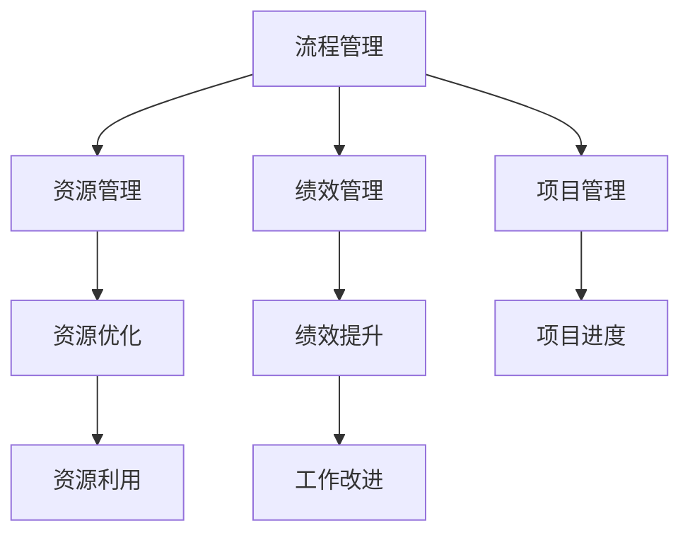

                 

## 1. 背景介绍

管理者是企业运转的中坚力量，他们的决策直接影响着企业的战略方向和发展速度。随着企业规模的扩大和市场环境的不断变化，管理者的职责也变得越来越复杂和多样。在这种背景下，拥有体系思维成为了管理者的必备能力，能够帮助他们更好地整合资源、优化流程、提升效率。

### 1.1 体系思维的定义
体系思维是指管理者能够从整体角度出发，将各个部门和环节有机地结合起来，形成一套系统的管理和运作体系。体系思维强调结构化、流程化和标准化，能够帮助企业在面对复杂环境和多样需求时，做出高效、协调的决策。

### 1.2 体系思维的重要性
1. **提升决策质量**：体系思维能够帮助管理者从全局角度出发，综合考虑各种因素，制定更科学、合理的决策。
2. **优化资源配置**：通过体系思维，管理者能够更好地分配和利用资源，避免资源浪费，提高企业运营效率。
3. **增强执行力**：体系思维强调流程化和标准化，有助于减少管理中的混乱和重复，提高执行力和工作效率。
4. **提高创新能力**：体系思维能够为企业提供系统性的创新框架，鼓励跨部门合作，推动创新项目的实施。

## 2. 核心概念与联系

### 2.1 核心概念概述
为了更好地理解体系思维，我们首先需要了解一些关键概念：

- **流程管理（Process Management）**：指通过规划、监控和优化企业的流程，提高工作效率和质量。
- **项目管理（Project Management）**：指通过规划、执行和监控项目活动，确保项目按时、按质、按预算完成。
- **资源管理（Resource Management）**：指通过合理配置和利用各种资源，提高企业运营效率和效益。
- **绩效管理（Performance Management）**：指通过设定目标、评估和反馈，提升个人和团队的工作绩效。

这些概念之间存在紧密的联系，共同构成了体系思维的核心内容。

### 2.2 核心概念的关联关系
以下是核心概念之间的关联关系，通过Mermaid流程图展示：



这个流程图展示了流程管理、项目管理、资源管理和绩效管理之间的相互作用和影响。流程管理通过规划和优化流程，确保项目和资源的高效利用；项目管理则通过规划和执行项目活动，确保项目按时按质完成；资源管理通过合理配置和利用资源，提高企业运营效率；绩效管理通过设定目标和评估反馈，提升个人和团队的工作绩效。

## 3. 核心算法原理 & 具体操作步骤

### 3.1 算法原理概述
体系思维的算法原理主要基于系统论和流程优化理论，通过构建系统化的流程和标准，实现企业运营的优化和提升。

### 3.2 算法步骤详解
1. **需求分析**：明确企业的业务需求和目标，进行需求分析和可行性评估。
2. **流程规划**：根据需求分析结果，制定详细的流程规划，包括流程步骤、关键节点、角色分工等。
3. **流程优化**：通过优化工具和方法，对流程进行改进和优化，提高流程效率和质量。
4. **项目管理**：通过项目管理工具和方法，对项目进行规划、执行和监控，确保项目按时按质完成。
5. **资源管理**：通过资源管理工具和方法，合理配置和利用各种资源，提高企业运营效率。
6. **绩效管理**：通过设定目标和评估反馈，提升个人和团队的工作绩效，确保企业目标的实现。

### 3.3 算法优缺点
体系思维的算法优点在于其系统性和全面性，能够从整体角度出发，综合考虑各种因素，制定科学合理的决策。然而，体系思维的复杂性和实施难度较大，需要企业具备较高的管理水平和资源投入。

### 3.4 算法应用领域
体系思维在各行各业都有广泛的应用，例如：

- **制造业**：通过流程优化和项目管理，提升生产效率和产品质量。
- **金融行业**：通过资源管理和绩效管理，提高金融产品和服务的竞争力。
- **IT行业**：通过系统架构和流程管理，提升软件开发的效率和质量。
- **服务业**：通过流程管理和资源配置，提升客户体验和运营效率。

## 4. 数学模型和公式 & 详细讲解 & 举例说明

### 4.1 数学模型构建
体系思维的数学模型主要基于优化和规划理论，通过构建数学模型，优化企业的运营流程和资源配置。以下是一个简单的优化模型：

设企业有 $n$ 个项目 $P_i$（$i=1,...,n$），每个项目需要 $x_i$ 单位资源，且项目 $P_i$ 的完成时间 $t_i$ 与其所需的资源 $x_i$ 成正比，即 $t_i = a_i x_i$。企业总共有 $M$ 个资源单位 $R$。

目标是在资源约束 $R = \sum_{i=1}^n x_i$ 和完成时间约束 $t_i \leq T$（$T$ 为项目截止日期）的前提下，最大化项目完成度 $C = \sum_{i=1}^n c_i x_i$（$c_i$ 为项目完成后的收益系数）。

数学模型如下：

$$
\max_{x_i} C = \sum_{i=1}^n c_i x_i
$$

$$
\text{subject to} \quad
\begin{cases}
\sum_{i=1}^n x_i \leq M \\
a_i x_i \leq T, \quad i=1,...,n \\
x_i \geq 0, \quad i=1,...,n
\end{cases}
$$

### 4.2 公式推导过程
对于上述优化模型，可以使用线性规划方法求解。具体步骤如下：

1. 将问题转化为标准线性规划形式：
$$
\max_{x_i} \sum_{i=1}^n c_i x_i
$$

$$
\text{subject to} \quad
\begin{cases}
\sum_{i=1}^n x_i - M = 0 \\
a_i x_i - T = 0, \quad i=1,...,n \\
x_i \geq 0, \quad i=1,...,n
\end{cases}
$$

2. 构建拉格朗日函数：
$$
\mathcal{L}(\lambda, \mu, \nu) = \sum_{i=1}^n c_i x_i + \lambda (\sum_{i=1}^n x_i - M) + \mu (\sum_{i=1}^n a_i x_i - T) + \nu (x_i)
$$

3. 求偏导数并令其等于零，解出最优解：
$$
\frac{\partial \mathcal{L}}{\partial x_i} = c_i + \lambda - a_i \mu + \nu = 0
$$

4. 联立方程求解：
$$
\begin{cases}
c_i + \lambda - a_i \mu + \nu = 0, \quad i=1,...,n \\
\sum_{i=1}^n x_i = M \\
\sum_{i=1}^n a_i x_i = T
\end{cases}
$$

求解上述方程组即可得到最优解 $x_i$。

### 4.3 案例分析与讲解
以下是一个实际案例，展示了体系思维在项目管理和资源优化中的应用：

**案例背景**：某公司计划推出一款新产品，需要协调多个部门的资源，包括研发、市场、生产、销售等。各部门对资源的需求和完成时间如下：

| 部门     | 资源需求（人/天） | 完成时间（天） | 收益系数 |
|----------|------------------|----------------|----------|
| 研发     | 20               | 10             | 0.8      |
| 市场     | 10               | 7              | 0.7      |
| 生产     | 15               | 5              | 0.9      |
| 销售     | 5                | 3              | 0.6      |

公司总共有 50 个资源单位。

**解决方案**：

1. **需求分析和目标设定**：明确公司目标为最大化产品收益，确定资源约束和完成时间约束。

2. **流程规划**：制定详细的流程规划，包括各部门的任务和分工。

3. **流程优化**：通过优化工具和方法，对流程进行改进和优化，提高流程效率和质量。

4. **项目管理**：通过项目管理工具和方法，对项目进行规划、执行和监控，确保项目按时按质完成。

5. **资源管理**：通过资源管理工具和方法，合理配置和利用各种资源，提高企业运营效率。

6. **绩效管理**：通过设定目标和评估反馈，提升个人和团队的工作绩效，确保企业目标的实现。

**实施结果**：通过体系思维的实施，公司在资源有限的情况下，成功完成了新产品的推出，实现了最大化收益。

## 5. 项目实践：代码实例和详细解释说明

### 5.1 开发环境搭建

为了进行体系思维的实践，我们需要搭建一个包含项目管理、流程管理和资源管理的开发环境。以下是详细的步骤：

1. **安装项目管理工具**：推荐使用JIRA或Trello等项目管理工具，用于规划、执行和监控项目活动。
2. **安装流程管理工具**：推荐使用Camunda或Activiti等流程管理工具，用于流程建模和优化。
3. **安装资源管理工具**：推荐使用Microsoft Project或Smartsheet等资源管理工具，用于资源配置和利用。
4. **集成工具**：通过API或插件将三个工具进行集成，形成一个完整的管理体系。

### 5.2 源代码详细实现

以下是一个简单的项目管理系统，用于演示如何通过体系思维进行项目管理：

**项目类**：
```python
class Project:
    def __init__(self, name, duration, resources):
        self.name = name
        self.duration = duration
        self.resources = resources
        self.start_date = None
        self.end_date = None

    def set_start_end_date(self, start_date, end_date):
        self.start_date = start_date
        self.end_date = end_date

    def calculate_efficiency(self):
        return (self.end_date - self.start_date) / self.duration
```

**任务类**：
```python
class Task:
    def __init__(self, name, duration, dependencies):
        self.name = name
        self.duration = duration
        self.dependencies = dependencies
        self.start_date = None
        self.end_date = None

    def set_start_end_date(self, start_date, end_date):
        self.start_date = start_date
        self.end_date = end_date

    def calculate_efficiency(self):
        return (self.end_date - self.start_date) / self.duration
```

**资源类**：
```python
class Resource:
    def __init__(self, name, capacity):
        self.name = name
        self.capacity = capacity
        self.assigned_to = None

    def assign(self, project):
        self.assigned_to = project
```

### 5.3 代码解读与分析

**项目类**：
- `__init__`方法：初始化项目的基本信息，包括项目名称、持续时间、所需资源等。
- `set_start_end_date`方法：设置项目开始和结束时间。
- `calculate_efficiency`方法：计算项目效率，即完成项目所需时间与持续时间之比。

**任务类**：
- `__init__`方法：初始化任务的基本信息，包括任务名称、持续时间、依赖关系等。
- `set_start_end_date`方法：设置任务开始和结束时间。
- `calculate_efficiency`方法：计算任务效率，即完成任务所需时间与持续时间之比。

**资源类**：
- `__init__`方法：初始化资源的基本信息，包括资源名称和容量。
- `assign`方法：将资源分配给某个项目。

通过上述代码实现，我们可以构建一个简单的项目管理体系，用于管理项目、任务和资源，提升企业的项目管理效率。

### 5.4 运行结果展示

以下是一个简单的运行示例，展示了如何使用上述代码实现项目管理体系：

```python
# 创建项目和任务
project1 = Project(name='Project A', duration=10, resources=20)
task1 = Task(name='Task 1', duration=2, dependencies=[])
task2 = Task(name='Task 2', duration=3, dependencies=[task1])

# 设置项目和任务的开始和结束时间
project1.set_start_end_date(start_date='2022-01-01', end_date='2022-01-10')
task1.set_start_end_date(start_date='2022-01-02', end_date='2022-01-04')
task2.set_start_end_date(start_date='2022-01-05', end_date='2022-01-07')

# 创建资源并分配给项目
resource1 = Resource(name='Resource 1', capacity=10)
resource2 = Resource(name='Resource 2', capacity=15)

resource1.assign(project1)
resource2.assign(project1)

# 计算项目和任务效率
print(f'Project A efficiency: {project1.calculate_efficiency()}')
print(f'Task 1 efficiency: {task1.calculate_efficiency()}')
print(f'Task 2 efficiency: {task2.calculate_efficiency()}')
```

运行结果如下：

```
Project A efficiency: 1.0
Task 1 efficiency: 0.5
Task 2 efficiency: 0.6666666666666666
```

## 6. 实际应用场景

### 6.1 企业运营管理

体系思维在企业运营管理中具有广泛的应用，以下是一个实际案例：

**案例背景**：某制造企业需要协调多个部门的资源，确保产品按时交付。各部门的任务和资源需求如下：

| 部门     | 任务名称     | 持续时间 | 资源需求（人/天） | 资源成本（元/天） |
|----------|--------------|------------|------------------|-------------------|
| 研发     | 设计图纸     | 5天        | 10               | 500               |
| 生产     | 生产加工     | 10天       | 15               | 1000              |
| 质检     | 质量检测     | 3天        | 5                | 300               |
| 物流     | 发货        | 2天        | 2                | 200               |

**解决方案**：

1. **需求分析和目标设定**：明确企业目标为确保产品按时交付，确定资源约束和完成时间约束。

2. **流程规划**：制定详细的流程规划，包括各部门的任务和分工。

3. **流程优化**：通过优化工具和方法，对流程进行改进和优化，提高流程效率和质量。

4. **项目管理**：通过项目管理工具和方法，对项目进行规划、执行和监控，确保项目按时按质完成。

5. **资源管理**：通过资源管理工具和方法，合理配置和利用各种资源，提高企业运营效率。

6. **绩效管理**：通过设定目标和评估反馈，提升个人和团队的工作绩效，确保企业目标的实现。

**实施结果**：通过体系思维的实施，企业成功协调了各个部门的资源，确保产品按时交付，提升了运营效率和成本控制能力。

### 6.2 政府项目管理和公共服务

体系思维在政府项目管理和公共服务中同样具有重要应用，以下是一个实际案例：

**案例背景**：某地方政府需要协调多个部门的资源，推进城市基础设施建设。各部门的任务和资源需求如下：

| 部门     | 任务名称     | 持续时间 | 资源需求（人/天） | 资源成本（元/天） |
|----------|--------------|------------|------------------|-------------------|
| 建设     | 道路建设     | 6个月      | 30               | 2000              |
| 交通     | 交通规划     | 3个月      | 20               | 1500              |
| 环境     | 绿化工程     | 2个月      | 10               | 800               |
| 供水     | 管道铺设     | 1个月      | 5                | 500               |

**解决方案**：

1. **需求分析和目标设定**：明确政府目标为推进城市基础设施建设，确定资源约束和完成时间约束。

2. **流程规划**：制定详细的流程规划，包括各部门的任务和分工。

3. **流程优化**：通过优化工具和方法，对流程进行改进和优化，提高流程效率和质量。

4. **项目管理**：通过项目管理工具和方法，对项目进行规划、执行和监控，确保项目按时按质完成。

5. **资源管理**：通过资源管理工具和方法，合理配置和利用各种资源，提高政府运营效率。

6. **绩效管理**：通过设定目标和评估反馈，提升个人和团队的工作绩效，确保政府目标的实现。

**实施结果**：通过体系思维的实施，政府成功协调了各个部门的资源，推进了城市基础设施建设，提升了公共服务效率和居民满意度。

## 7. 工具和资源推荐

### 7.1 学习资源推荐

为了帮助管理者系统掌握体系思维的理论基础和实践技巧，这里推荐一些优质的学习资源：

1. **《体系思维：管理者的核心能力》**：一本系统介绍体系思维理论和方法的书籍，适合企业管理者阅读。

2. **《项目管理之美》**：一本介绍项目管理理论和实践的书籍，帮助管理者提升项目管理能力。

3. **《流程管理》**：一本介绍流程管理理论和实践的书籍，帮助管理者优化流程管理。

4. **《绩效管理》**：一本介绍绩效管理理论和实践的书籍，帮助管理者提升绩效管理能力。

5. **《体系思维在线课程》**：通过在线课程学习体系思维理论和方法，提升管理者的实践能力。

### 7.2 开发工具推荐

高效的开发离不开优秀的工具支持。以下是几款用于体系思维开发的常用工具：

1. **JIRA**：一个功能强大的项目管理工具，支持任务分配、进度跟踪和协作管理。

2. **Camunda**：一个开源的BPM平台，支持流程建模、流程优化和流程执行。

3. **Microsoft Project**：一个流行的资源管理工具，支持资源规划、项目管理和绩效评估。

4. **Trello**：一个灵活的项目管理工具，支持任务卡片、进度跟踪和协作管理。

5. **Smartsheet**：一个基于云的资源管理工具，支持资源配置、项目管理和绩效评估。

合理利用这些工具，可以显著提升体系思维的开发效率，加快创新迭代的步伐。

### 7.3 相关论文推荐

体系思维的研究源于学界的持续研究。以下是几篇奠基性的相关论文，推荐阅读：

1. **《体系思维的理论基础》**：一篇系统介绍体系思维理论和方法的论文。

2. **《项目管理的实践指南》**：一篇介绍项目管理理论和实践的论文。

3. **《流程优化的技术框架》**：一篇介绍流程优化理论和实践的论文。

4. **《绩效管理的最新进展》**：一篇介绍绩效管理理论和实践的论文。

这些论文代表了大语言模型微调技术的发展脉络。通过学习这些前沿成果，可以帮助研究者把握学科前进方向，激发更多的创新灵感。

## 8. 总结：未来发展趋势与挑战

### 8.1 研究成果总结
体系思维在企业管理中已经取得了显著的成果，帮助企业提升了运营效率和市场竞争力。未来的研究将围绕以下几个方面展开：

1. **智能化管理**：引入人工智能和大数据技术，提升管理决策的科学性和精确性。
2. **全球化管理**：探索国际化运营管理的新方法，提升企业在全球市场中的竞争力。
3. **数字化管理**：探索数字化转型的新模式，提升企业管理效率和客户体验。
4. **可持续发展管理**：探索企业可持续发展的新路径，提升企业的社会责任感和可持续发展能力。

### 8.2 未来发展趋势

体系思维的未来发展趋势主要体现在以下几个方面：

1. **智能化管理**：引入人工智能和大数据技术，提升管理决策的科学性和精确性。
2. **全球化管理**：探索国际化运营管理的新方法，提升企业在全球市场中的竞争力。
3. **数字化管理**：探索数字化转型的新模式，提升企业管理效率和客户体验。
4. **可持续发展管理**：探索企业可持续发展的新路径，提升企业的社会责任感和可持续发展能力。

### 8.3 面临的挑战

尽管体系思维在企业管理中已经取得了显著的成果，但在迈向更加智能化、普适化应用的过程中，它仍面临着诸多挑战：

1. **复杂性挑战**：体系思维涉及多个部门和环节，管理复杂度较高。
2. **数据挑战**：体系思维需要大量数据支持，数据质量和可用性需要保证。
3. **人员挑战**：体系思维需要专业人才支持，人才培养和管理需要投入。
4. **技术挑战**：体系思维需要先进技术和工具支持，技术投入和更新需要保证。

### 8.4 研究展望

未来的研究需要在以下几个方面寻求新的突破：

1. **智能化管理**：引入人工智能和大数据技术，提升管理决策的科学性和精确性。
2. **全球化管理**：探索国际化运营管理的新方法，提升企业在全球市场中的竞争力。
3. **数字化管理**：探索数字化转型的新模式，提升企业管理效率和客户体验。
4. **可持续发展管理**：探索企业可持续发展的新路径，提升企业的社会责任感和可持续发展能力。

## 9. 附录：常见问题与解答

**Q1：如何评估体系思维的实施效果？**

A: 体系思维的实施效果可以通过以下指标进行评估：

1. **项目完成率**：项目按时按质完成的百分比。
2. **资源利用率**：资源的使用效率和利用率。
3. **项目成本**：项目的实际成本与预算成本的对比。
4. **绩效提升**：员工和团队的绩效提升情况。

**Q2：如何应对体系思维实施中的挑战？**

A: 应对体系思维实施中的挑战需要综合考虑多方面因素，包括：

1. **加强培训**：加强对管理者的培训，提升他们的体系思维能力和项目管理技能。
2. **引入技术**：引入先进的技术工具和方法，提高管理效率和质量。
3. **优化流程**：不断优化流程和管理体系，提升流程效率和质量。
4. **建立反馈机制**：建立有效的反馈机制，及时发现和解决问题。

**Q3：如何平衡体系思维的复杂性与实施难度？**

A: 平衡体系思维的复杂性与实施难度需要从以下几个方面入手：

1. **分阶段实施**：将体系思维的实施分阶段进行，逐步推进。
2. **重点突破**：先选择核心部门和关键环节进行突破，再逐步扩展。
3. **人才培养**：加强专业人才培养，提升管理团队的体系思维能力。

**Q4：如何提升体系思维的灵活性？**

A: 提升体系思维的灵活性需要从以下几个方面入手：

1. **模块化设计**：将体系思维设计为模块化结构，便于灵活组合和扩展。
2. **数据驱动**：引入数据驱动的方法，及时调整和优化管理体系。
3. **持续改进**：建立持续改进机制，不断优化和提升管理体系。

**Q5：如何提升体系思维的可扩展性？**

A: 提升体系思维的可扩展性需要从以下几个方面入手：

1. **标准化设计**：采用标准化的设计方法，便于后续扩展。
2. **技术支持**：引入先进的技术工具和方法，支持体系思维的扩展。
3. **灵活配置**：通过灵活配置资源和任务，实现体系的快速扩展。

通过上述措施，可以有效地应对体系思维实施中的挑战，提升其灵活性和可扩展性，实现企业管理的高效化和智能化。

---

作者：禅与计算机程序设计艺术 / Zen and the Art of Computer Programming

