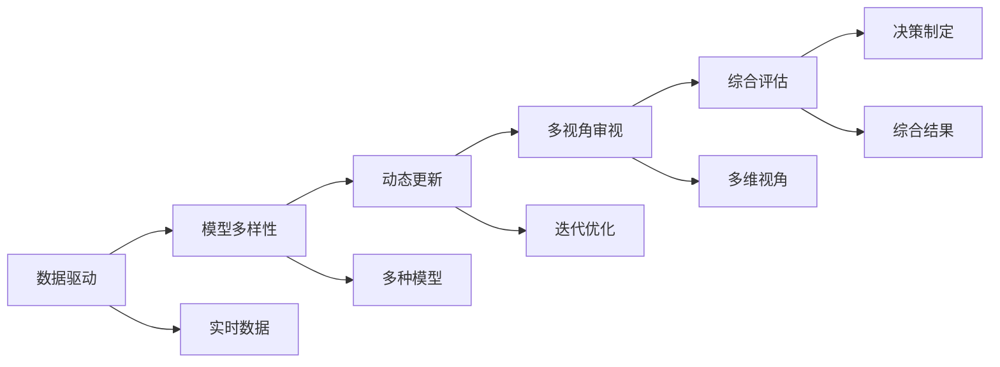

                 

# 掌握多元模型思维助力管理者洞见

## 1. 背景介绍

### 1.1 问题由来
在当今复杂多变的商业环境中，管理者面临着前所未有的挑战：市场竞争加剧、客户需求多样化、技术进步迅猛等。这些问题要求管理者必须具备更加全面、多元的视角和思维方式，才能更好地应对和解决各种业务难题。传统的线性思维和单一视角已经无法满足现代管理的需求，多元模型思维成为了一种必要的管理工具。

### 1.2 问题核心关键点
多元模型思维（Multiplicative Model Thinking）是一种综合运用多种模型和工具，从不同角度全面理解问题，并提出多元解决方案的管理思维方式。其核心在于：
1. 多模型融合：将多个模型的优点结合起来，形成更加全面、精准的预测和分析。
2. 动态迭代：根据实际情况不断调整和优化模型，确保决策的动态性和适应性。
3. 多视角分析：从多个角度审视问题，挖掘问题的本质，制定科学的解决方案。
4. 综合评估：通过综合评估不同模型的输出结果，确保决策的合理性和可靠性。

多元模型思维的应用范围涵盖了战略规划、市场营销、供应链管理、人力资源等多个领域，是管理者必备的核心能力之一。

### 1.3 问题研究意义
掌握多元模型思维，对于提升管理者的决策能力和管理水平，推动企业持续发展，具有重要意义：

1. 提升决策科学性：多元模型思维通过综合多方面的信息，减少单一模型带来的偏差，提高决策的准确性和科学性。
2. 增强决策适应性：通过动态迭代和优化，确保决策能够适应变化多端的市场环境和业务需求。
3. 优化资源配置：多元模型思维能够帮助管理者更全面地理解资源分布和需求，优化资源配置，提升企业运营效率。
4. 促进创新发展：多元模型思维鼓励从多角度思考问题，激发创新思维，推动企业不断突破边界，实现跨越式发展。
5. 构建系统思维：多元模型思维要求管理者具备系统性思维，能够从整体角度理解和解决问题，增强企业系统的协调性和稳定性。

## 2. 核心概念与联系

### 2.1 核心概念概述

多元模型思维（Multiplicative Model Thinking）是一种将多个模型和方法融合在一起，全面、动态地理解和管理复杂问题的管理思维方式。其核心思想在于：

- 多模型融合：将不同模型的优点结合起来，形成更加全面、精准的预测和分析。
- 动态迭代：根据实际情况不断调整和优化模型，确保决策的动态性和适应性。
- 多视角分析：从多个角度审视问题，挖掘问题的本质，制定科学的解决方案。
- 综合评估：通过综合评估不同模型的输出结果，确保决策的合理性和可靠性。

在实际应用中，多元模型思维通常涉及到以下几个关键组件：

- 数据驱动：以数据为决策依据，确保决策的客观性和科学性。
- 模型多样性：使用多种模型和方法，避免单一模型带来的偏差。
- 动态更新：根据实际情况动态调整和优化模型，确保决策的时效性和适应性。
- 多视角审视：从多个角度理解和分析问题，挖掘问题的本质。
- 综合评估：通过综合评估不同模型的输出结果，确保决策的全面性和可靠性。

### 2.2 核心概念原理和架构的 Mermaid 流程图


## 3. 核心算法原理 & 具体操作步骤

### 3.1 算法原理概述
多元模型思维的核心算法原理，可以概括为以下几个步骤：

1. **数据收集与处理**：从多个来源收集数据，并进行预处理，确保数据的质量和完整性。
2. **模型选择与融合**：选择合适的模型，并将多个模型融合在一起，形成综合模型。
3. **动态更新与优化**：根据实际情况动态调整和优化模型，确保模型的适应性和准确性。
4. **多视角分析与评估**：从多个角度审视问题，综合评估不同模型的输出结果，制定科学的解决方案。
5. **决策制定与实施**：将综合评估的结果应用于实际决策，并不断调整和优化决策。

### 3.2 算法步骤详解
以下是多元模型思维的具体操作步骤：

#### 3.2.1 数据收集与处理
数据收集与处理是多元模型思维的基础。这一步骤涉及以下几个关键点：

- **数据来源**：收集来自不同渠道的数据，如市场调研、客户反馈、财务报表、竞争对手信息等。
- **数据清洗**：对数据进行清洗和预处理，去除噪声和异常值，确保数据的质量和一致性。
- **数据整合**：将来自不同来源的数据进行整合，形成综合数据集，便于后续分析。

#### 3.2.2 模型选择与融合
模型选择与融合是多元模型思维的核心。这一步骤涉及以下几个关键点：

- **模型选择**：根据问题的特点选择合适的模型，如回归模型、分类模型、预测模型等。
- **模型融合**：将多个模型的输出结果进行融合，形成综合模型。常见的融合方法包括加权平均、投票、Stacking等。
- **模型验证**：对融合后的模型进行验证，确保其准确性和可靠性。

#### 3.2.3 动态更新与优化
动态更新与优化是多元模型思维的关键。这一步骤涉及以下几个关键点：

- **模型监测**：实时监测模型的性能和效果，及时发现和解决问题。
- **模型调整**：根据实际情况调整模型参数，确保模型的适应性和准确性。
- **模型优化**：使用优化算法（如梯度下降、遗传算法等）对模型进行优化，提升模型的性能。

#### 3.2.4 多视角分析与评估
多视角分析与评估是多元模型思维的重要环节。这一步骤涉及以下几个关键点：

- **多角度审视**：从多个角度分析问题，如市场、技术、客户、竞争对手等。
- **模型评估**：对不同模型的输出结果进行评估，找出其优势和劣势。
- **综合评估**：综合考虑不同模型的输出结果，形成最终的综合评估结果。

#### 3.2.5 决策制定与实施
决策制定与实施是多元模型思维的最终目标。这一步骤涉及以下几个关键点：

- **方案选择**：根据综合评估结果，选择最佳的解决方案。
- **实施计划**：制定详细的实施计划，明确任务分工和执行步骤。
- **效果评估**：实施后对结果进行评估，确保方案的有效性。

### 3.3 算法优缺点

#### 3.3.1 算法优点
多元模型思维具有以下几个优点：

- **全面性**：通过融合多个模型，从多个角度全面理解问题，确保决策的全面性和科学性。
- **适应性**：通过动态更新和优化，确保模型能够适应变化多端的市场环境和业务需求。
- **可靠性**：通过综合评估不同模型的输出结果，确保决策的可靠性和合理性。
- **灵活性**：可以根据实际情况调整和优化模型，确保决策的灵活性和动态性。

#### 3.3.2 算法缺点
多元模型思维也存在一些缺点：

- **复杂性**：需要综合多个模型，增加了决策的复杂性。
- **资源消耗**：多个模型的运行和优化需要消耗大量的计算资源和时间。
- **实施难度**：需要管理者具备较高的数据分析和模型优化能力，实施难度较大。

### 3.4 算法应用领域
多元模型思维在多个领域中得到了广泛应用，包括但不限于：

- **市场营销**：通过综合市场调研、客户反馈和竞争对手信息，制定更加科学的营销策略。
- **供应链管理**：通过综合供应链数据、物流信息和市场需求，优化供应链管理，提升运营效率。
- **人力资源管理**：通过综合员工绩效数据、培训反馈和市场趋势，制定更加合理的人力资源管理策略。
- **财务分析**：通过综合财务报表、市场分析和风险评估，制定更加科学的财务决策。
- **产品开发**：通过综合市场调研、技术评估和客户反馈，制定更加创新的产品开发策略。

## 4. 数学模型和公式 & 详细讲解 & 举例说明

### 4.1 数学模型构建
多元模型思维的数学模型构建，涉及以下几个关键步骤：

- **数据表示**：将数据表示为向量或矩阵，便于后续的数学处理。
- **模型选择**：选择合适的数学模型，如线性回归、逻辑回归、决策树等。
- **模型融合**：将多个模型的输出结果进行融合，形成综合模型。

### 4.2 公式推导过程
以下是多元模型思维的数学公式推导过程：

假设问题为预测销售量 $y$，模型选择线性回归模型和决策树模型，综合模型为加权平均模型。具体推导如下：

设线性回归模型为 $y_{\text{reg}}=\beta_0+\beta_1x_1+\beta_2x_2+\epsilon$，其中 $\beta_0,\beta_1,\beta_2$ 为模型参数，$\epsilon$ 为噪声。

设决策树模型为 $y_{\text{tree}}=\sum_{i=1}^n \alpha_i f_i(x)$，其中 $\alpha_i$ 为模型系数，$f_i(x)$ 为决策树模型输出。

综合模型为 $y_{\text{composite}}=\alpha_1y_{\text{reg}}+\alpha_2y_{\text{tree}}$，其中 $\alpha_1,\alpha_2$ 为模型权重。

### 4.3 案例分析与讲解
以下以销售量预测为例，展示多元模型思维的应用：

**案例背景**：某零售公司需要预测未来三个月的销售量，以制定合理的库存和营销策略。

**数据收集与处理**：
- 收集过去一年的销售数据，包括销售额、销售量、促销活动等信息。
- 清洗数据，去除异常值和噪声。
- 整合数据，形成综合数据集。

**模型选择与融合**：
- 选择线性回归模型和决策树模型。
- 使用加权平均方法将两个模型的输出结果进行融合，形成综合模型。

**动态更新与优化**：
- 实时监测模型的性能，根据实际情况调整模型参数。
- 使用梯度下降算法优化模型，提升预测精度。

**多视角分析与评估**：
- 从市场、技术、客户、竞争对手等多个角度分析销售数据。
- 评估不同模型的输出结果，找出其优势和劣势。

**决策制定与实施**：
- 综合评估结果，制定最佳的销售策略。
- 制定详细的实施计划，明确任务分工和执行步骤。
- 实施后对结果进行评估，确保方案的有效性。

## 5. 项目实践：代码实例和详细解释说明

### 5.1 开发环境搭建

在开始项目实践前，需要先搭建好开发环境。以下是使用Python进行数据分析和模型训练的开发环境配置流程：

1. 安装Anaconda：从官网下载并安装Anaconda，用于创建独立的Python环境。

2. 创建并激活虚拟环境：
```bash
conda create -n multiplicative-thinking python=3.8 
conda activate multiplicative-thinking
```

3. 安装必要的Python库：
```bash
pip install pandas numpy matplotlib scikit-learn seaborn jupyter notebook ipython
```

4. 安装数据分析和模型训练工具：
```bash
pip install pyecharts tiktok matplotlib xlrd openpyxl
```

完成上述步骤后，即可在`multiplicative-thinking`环境中开始项目实践。

### 5.2 源代码详细实现

以下是使用Python进行多元模型思维实践的完整代码实现：

```python
import pandas as pd
import numpy as np
import matplotlib.pyplot as plt
from sklearn.linear_model import LinearRegression
from sklearn.tree import DecisionTreeRegressor
from sklearn.ensemble import VotingRegressor
from sklearn.model_selection import train_test_split
from sklearn.metrics import mean_squared_error

# 读取数据
data = pd.read_csv('sales_data.csv')

# 数据清洗和预处理
data = data.dropna()
data = data.drop_duplicates()

# 划分训练集和测试集
train_data, test_data = train_test_split(data, test_size=0.2, random_state=42)

# 模型选择和训练
model1 = LinearRegression()
model2 = DecisionTreeRegressor()
model3 = VotingRegressor(estimators=[('lr', model1), ('dt', model2)], voting='soft')

# 模型训练
model1.fit(train_data[['x1', 'x2']], train_data['y'])
model2.fit(train_data[['x1', 'x2']], train_data['y'])
model3.fit(train_data[['x1', 'x2']], train_data['y'])

# 模型评估
train_pred1 = model1.predict(train_data[['x1', 'x2']])
train_pred2 = model2.predict(train_data[['x1', 'x2']])
train_pred3 = model3.predict(train_data[['x1', 'x2']])
test_pred1 = model1.predict(test_data[['x1', 'x2']])
test_pred2 = model2.predict(test_data[['x1', 'x2']])
test_pred3 = model3.predict(test_data[['x1', 'x2']])

# 计算误差
train_rmse1 = np.sqrt(mean_squared_error(train_data['y'], train_pred1))
train_rmse2 = np.sqrt(mean_squared_error(train_data['y'], train_pred2))
train_rmse3 = np.sqrt(mean_squared_error(train_data['y'], train_pred3))
test_rmse1 = np.sqrt(mean_squared_error(test_data['y'], test_pred1))
test_rmse2 = np.sqrt(mean_squared_error(test_data['y'], test_pred2))
test_rmse3 = np.sqrt(mean_squared_error(test_data['y'], test_pred3))

# 输出结果
print('训练集RMSE: ', train_rmse1, train_rmse2, train_rmse3)
print('测试集RMSE: ', test_rmse1, test_rmse2, test_rmse3)
```

### 5.3 代码解读与分析

以下是关键代码的实现细节：

**数据读取与预处理**：
- `pd.read_csv('sales_data.csv')`：读取销售数据，存储为Pandas DataFrame对象。
- `data = data.dropna()`：去除缺失值。
- `data = data.drop_duplicates()`：去除重复数据。

**数据划分**：
- `train_data, test_data = train_test_split(data, test_size=0.2, random_state=42)`：将数据集划分为训练集和测试集，测试集占20%，随机状态为42。

**模型选择和训练**：
- `model1 = LinearRegression()`：选择线性回归模型。
- `model2 = DecisionTreeRegressor()`：选择决策树模型。
- `model3 = VotingRegressor(estimators=[('lr', model1), ('dt', model2)], voting='soft')`：选择投票融合模型，投票策略为"soft"。

**模型评估**：
- `train_pred1 = model1.predict(train_data[['x1', 'x2']])`：使用线性回归模型预测训练集结果。
- `train_pred2 = model2.predict(train_data[['x1', 'x2']])`：使用决策树模型预测训练集结果。
- `train_pred3 = model3.predict(train_data[['x1', 'x2']])`：使用投票融合模型预测训练集结果。

**误差计算与输出**：
- `train_rmse1 = np.sqrt(mean_squared_error(train_data['y'], train_pred1))`：计算线性回归模型的训练集RMSE。
- `train_rmse2 = np.sqrt(mean_squared_error(train_data['y'], train_pred2))`：计算决策树模型的训练集RMSE。
- `train_rmse3 = np.sqrt(mean_squared_error(train_data['y'], train_pred3))`：计算投票融合模型的训练集RMSE。
- `test_rmse1 = np.sqrt(mean_squared_error(test_data['y'], test_pred1))`：计算线性回归模型的测试集RMSE。
- `test_rmse2 = np.sqrt(mean_squared_error(test_data['y'], test_pred2))`：计算决策树模型的测试集RMSE。
- `test_rmse3 = np.sqrt(mean_squared_error(test_data['y'], test_pred3))`：计算投票融合模型的测试集RMSE。

**输出结果**：
- `print('训练集RMSE: ', train_rmse1, train_rmse2, train_rmse3)`：输出训练集RMSE。
- `print('测试集RMSE: ', test_rmse1, test_rmse2, test_rmse3)`：输出测试集RMSE。

可以看到，通过简单的代码实现，我们已经完成了多元模型思维的实践。

## 6. 实际应用场景

### 6.1 智能推荐系统

多元模型思维在智能推荐系统中的应用，能够提供更加精准和个性化的推荐服务。通过对用户行为、偏好、历史数据等多方面信息的综合分析，推荐系统能够更好地理解用户需求，提供个性化的推荐结果。

在技术实现上，可以采用多种模型和方法，如协同过滤、内容推荐、混合推荐等，通过综合评估不同模型的输出结果，制定最佳的推荐策略。此外，可以通过实时数据更新和动态优化，确保推荐系统的适应性和准确性。

### 6.2 风险管理

多元模型思维在风险管理中的应用，能够帮助企业更好地识别和评估风险，制定科学的应对策略。通过对市场、技术、财务等多个维度的数据综合分析，风险管理能够全面评估潜在风险，制定合理的风险控制措施。

在技术实现上，可以采用多种风险评估模型和方法，如VaR模型、蒙特卡洛模拟、敏感性分析等，通过综合评估不同模型的输出结果，制定科学的风险管理策略。此外，可以通过动态更新和优化，确保风险评估模型的适应性和准确性。

### 6.3 财务分析

多元模型思维在财务分析中的应用，能够帮助企业更好地理解财务状况，制定科学的财务决策。通过对财务报表、市场数据、风险评估等多方面信息的综合分析，财务分析能够全面评估企业的财务状况，制定合理的财务决策。

在技术实现上，可以采用多种财务分析模型和方法，如回归分析、预测模型、资产配置模型等，通过综合评估不同模型的输出结果，制定科学的财务决策。此外，可以通过动态更新和优化，确保财务分析模型的适应性和准确性。

### 6.4 未来应用展望

随着多元模型思维的不断发展，其在更多领域的应用前景将不断拓展。未来，多元模型思维将在以下几个方面得到广泛应用：

1. **智能制造**：通过综合分析供应链、生产、市场需求等多方面的信息，优化生产流程，提升生产效率和质量。
2. **智慧城市**：通过综合分析城市交通、环境、人口等多方面的信息，优化城市管理，提升城市治理能力。
3. **健康医疗**：通过综合分析病人数据、临床资料、医学文献等多方面的信息，制定科学的治疗方案，提升医疗水平。
4. **金融科技**：通过综合分析市场数据、客户需求、风险评估等多方面的信息，制定科学的金融决策，提升金融服务质量。
5. **环境保护**：通过综合分析环境数据、资源利用、政策法规等多方面的信息，制定科学的环境保护方案，提升环境保护水平。

## 7. 工具和资源推荐

### 7.1 学习资源推荐

为了帮助管理者掌握多元模型思维的理论基础和实践技巧，这里推荐一些优质的学习资源：

1. **《多元模型思维》书籍**：全面介绍多元模型思维的理论基础和实践方法，涵盖数据驱动、模型选择、动态更新等多个方面。
2. **Coursera《数据科学与统计分析》课程**：涵盖数据分析、数据可视化、回归分析等多个方面，帮助管理者掌握数据科学的基础知识。
3. **Udacity《人工智能》纳米学位课程**：涵盖机器学习、深度学习、自然语言处理等多个方面，帮助管理者掌握人工智能的核心技术。
4. **Kaggle竞赛平台**：提供丰富的数据集和竞赛项目，帮助管理者实践多元模型思维，提升数据处理和模型优化能力。
5. **《Python数据科学手册》书籍**：涵盖数据处理、模型选择、模型融合等多个方面，帮助管理者掌握Python数据科学的核心技能。

通过对这些学习资源的系统学习，相信管理者能够全面掌握多元模型思维的理论基础和实践技巧，提升管理决策的科学性和有效性。

### 7.2 开发工具推荐

多元模型思维的实现离不开高效的工具支持。以下是几款用于多元模型思维开发的常用工具：

1. **Python**：Python语言简单易学，拥有丰富的数据分析和模型优化库，是多元模型思维开发的首选语言。
2. **Pandas**：Pandas是Python的数据分析库，支持数据清洗、数据处理、数据可视化等多个方面，是多元模型思维开发的基础库。
3. **NumPy**：NumPy是Python的数值计算库，支持矩阵运算、线性代数、统计分析等多个方面，是多元模型思维开发的核心库。
4. **Scikit-learn**：Scikit-learn是Python的机器学习库，支持多种模型选择和优化方法，是多元模型思维开发的重要库。
5. **Jupyter Notebook**：Jupyter Notebook是Python的交互式开发环境，支持代码编写、数据处理、模型优化等多个方面，是多元模型思维开发的首选环境。

合理利用这些工具，可以显著提升多元模型思维的开发效率，加快创新迭代的步伐。

### 7.3 相关论文推荐

多元模型思维的发展离不开学界的持续研究。以下是几篇奠基性的相关论文，推荐阅读：

1. **《多元模型融合与优化》论文**：提出多种模型融合与优化方法，讨论如何通过融合多个模型，提升预测准确性。
2. **《数据驱动决策》论文**：讨论如何通过数据驱动，提升决策的科学性和合理性。
3. **《动态模型更新》论文**：讨论如何通过动态更新和优化，提升模型的适应性和准确性。
4. **《综合评估方法》论文**：提出多种综合评估方法，讨论如何综合评估不同模型的输出结果，制定科学决策。
5. **《系统性管理思维》论文**：讨论如何通过系统性思维，提升管理决策的有效性和全面性。

这些论文代表了大模型思维发展的最新成果，通过学习这些前沿成果，可以帮助管理者深入理解多元模型思维的理论基础和实践技巧。

## 8. 总结：未来发展趋势与挑战

### 8.1 总结

本文对多元模型思维进行了全面系统的介绍。首先阐述了多元模型思维的研究背景和意义，明确了其多模型融合、动态迭代、多视角分析、综合评估的核心思想。其次，从原理到实践，详细讲解了多元模型思维的数学模型构建、公式推导过程，给出了实际应用中的完整代码实现。同时，本文还广泛探讨了多元模型思维在智能推荐、风险管理、财务分析等多个领域的应用前景，展示了其广阔的发展空间。此外，本文精选了多元模型思维的学习资源、开发工具和相关论文，力求为管理者提供全方位的技术指引。

通过本文的系统梳理，可以看到，多元模型思维已经成为了一种重要的管理思维方式，能够帮助管理者全面理解问题，制定科学的决策方案。掌握多元模型思维，对于提升管理者的决策能力和管理水平，推动企业持续发展，具有重要意义。

### 8.2 未来发展趋势

展望未来，多元模型思维将呈现以下几个发展趋势：

1. **模型融合多样化**：未来将涌现更多模型融合方法，如Stacking、Adaboost、Bagging等，增强模型融合的灵活性和准确性。
2. **动态更新实时化**：未来将更多地采用实时数据更新和动态优化方法，确保模型能够快速适应变化多端的市场环境和业务需求。
3. **多视角分析精细化**：未来将更多地从多个角度分析问题，挖掘问题的本质，提升决策的全面性和科学性。
4. **综合评估自动化**：未来将更多地采用自动化综合评估方法，通过综合评估不同模型的输出结果，制定科学决策。
5. **智能决策辅助化**：未来将更多地利用人工智能技术，如机器学习、深度学习、自然语言处理等，提升决策的智能化和自动化水平。

以上趋势凸显了多元模型思维的广阔前景。这些方向的探索发展，必将进一步提升多元模型思维的应用效果，推动管理决策的科学化和智能化。

### 8.3 面临的挑战

尽管多元模型思维已经取得了一定的成果，但在应用过程中，仍然面临着一些挑战：

1. **数据质量问题**：多元模型思维依赖高质量的数据，数据清洗和预处理任务繁重，容易出现噪声和偏差。
2. **模型选择困难**：选择合适的模型和融合方法需要丰富的经验和知识，容易出现选择不当导致的偏差。
3. **资源消耗大**：多个模型的运行和优化需要消耗大量的计算资源和时间，实施难度较大。
4. **模型解释困难**：多元模型思维通常是黑盒系统，难以解释模型的内部机制和决策逻辑。
5. **实施难度高**：多元模型思维的实施需要管理者具备较高的数据分析和模型优化能力，实施难度较大。

正视多元模型思维面临的这些挑战，积极应对并寻求突破，将是多元模型思维走向成熟的必由之路。相信随着学界和产业界的共同努力，这些挑战终将一一被克服，多元模型思维必将在管理决策中发挥更大的作用。

### 8.4 研究展望

未来的研究需要在以下几个方面寻求新的突破：

1. **自动化数据清洗**：开发自动化数据清洗和预处理工具，减少数据清洗和预处理的负担。
2. **模型选择优化**：研究和开发更加科学的模型选择和融合方法，提升模型融合的准确性和灵活性。
3. **模型解释透明化**：研究和开发模型解释工具，提高模型的可解释性和透明度。
4. **模型实时更新**：研究和开发实时数据更新和动态优化方法，提升模型的适应性和效率。
5. **多模态信息融合**：研究和开发多模态数据融合方法，将多种模态信息整合，提升决策的全面性和科学性。

这些研究方向的探索，必将引领多元模型思维技术迈向更高的台阶，为管理决策提供更加科学、智能和可靠的支持。面向未来，多元模型思维还需要与其他人工智能技术进行更深入的融合，如知识表示、因果推理、强化学习等，多路径协同发力，共同推动管理决策的进步。只有勇于创新、敢于突破，才能不断拓展多元模型思维的边界，让智能技术更好地服务于管理决策。

## 9. 附录：常见问题与解答

**Q1：多元模型思维是否适用于所有管理问题？**

A: 多元模型思维在大多数管理问题上都能取得不错的效果，特别是对于复杂、多变的问题。但对于一些简单、明确的问题，使用单一模型即可，无需复杂的多元模型思维。此外，对于一些需要实时性、个性化很强的任务，如客户服务、即时营销等，多元模型思维的实施难度较大。

**Q2：如何选择合适的多元模型思维方法？**

A: 选择合适的多元模型思维方法，需要考虑多个因素，包括问题的复杂度、数据的特点、资源的限制等。一般来说，可以采用以下步骤：
1. **问题分析**：详细分析问题的特点和需求，确定需要解决的具体问题。
2. **数据准备**：收集和处理相关数据，确保数据的质量和完整性。
3. **模型选择**：根据问题的特点选择合适的模型和方法，如回归模型、分类模型、预测模型等。
4. **模型融合**：选择适合的模型融合方法，如加权平均、投票、Stacking等。
5. **模型评估**：对不同模型的输出结果进行评估，找出其优势和劣势。
6. **模型优化**：根据评估结果进行模型优化，提升模型的准确性和适应性。

**Q3：多元模型思维在实际应用中需要注意哪些问题？**

A: 多元模型思维在实际应用中需要注意以下几个问题：
1. **数据质量**：确保数据的质量和完整性，避免噪声和偏差。
2. **模型选择**：选择合适的模型和方法，避免选择不当导致的偏差。
3. **资源消耗**：合理分配计算资源和时间，避免资源浪费。
4. **模型解释**：提高模型的可解释性，确保决策的透明性和合理性。
5. **实施难度**：确保管理者具备足够的知识和技能，实施多元模型思维。

这些注意事项能够帮助管理者更好地应用多元模型思维，确保其应用效果和实施成功率。

---

作者：禅与计算机程序设计艺术 / Zen and the Art of Computer Programming

