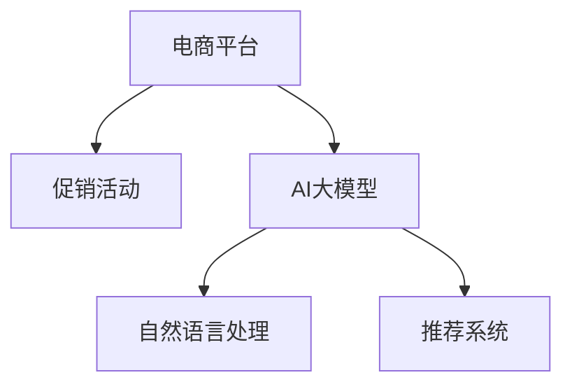

                 

# 探讨AI大模型在电商平台促销效果预测中的作用

> 关键词：大模型, 促销效果预测, 电商平台, 电商营销, 人工智能, 深度学习, 自然语言处理, 推荐系统

## 1. 背景介绍

### 1.1 问题由来
随着电商平台业务的不断扩展和竞争的加剧，提升促销活动的效果成为了各大电商企业的共同诉求。传统的基于人工经验和规则的促销策略，存在依赖经验丰富、易于过时、无法自适应市场变化等问题。因此，利用AI技术进行促销策略的优化，逐渐成为各大电商平台关注的焦点。

### 1.2 问题核心关键点
AI大模型在电商平台促销效果预测中的核心作用在于通过深度学习技术，从历史数据中提取特征，预测促销活动的转化效果，从而为电商平台提供优化促销策略的依据。通过AI大模型，可以自动学习用户行为模式，发现潜在的高效促销策略，提高销售额和市场份额。

### 1.3 问题研究意义
本文将深入探讨如何利用AI大模型预测电商平台促销效果，从而优化电商促销策略。这不仅有助于电商平台提升销售额和客户满意度，还能通过精准的市场预测，提高广告投放的ROI，优化供应链管理。通过AI大模型的应用，电商平台可以在激烈的市场竞争中保持优势，实现持续增长。

## 2. 核心概念与联系

### 2.1 核心概念概述

为更好地理解AI大模型在电商平台促销效果预测中的应用，本节将介绍几个关键概念：

- 电商平台(E-Commerce Platform)：提供商品交易、支付、物流等服务的在线平台，如淘宝、京东、亚马逊等。
- 促销活动(Promotional Campaign)：电商平台为吸引顾客而推出的一系列优惠活动，如折扣、满减、赠品等。
- AI大模型(AI Large Model)：指基于深度学习技术，通过大规模数据预训练得到的强大表征能力的模型，如BERT、GPT、XLNet等。
- 自然语言处理(Natural Language Processing, NLP)：利用计算机处理、分析和理解人类语言的技术，在大模型中用于理解商品描述、用户评论等文本信息。
- 推荐系统(Recommender System)：通过分析用户行为，推荐用户可能感兴趣的商品，在大模型中用于预测用户对促销活动的响应。

这些概念之间的逻辑关系可以通过以下Mermaid流程图来展示：



这个流程图展示了大模型、自然语言处理和推荐系统之间的联系：

1. 电商平台通过促销活动吸引用户。
2. 大模型通过预训练学习用户行为特征，理解商品描述、用户评论等文本信息。
3. 推荐系统基于大模型的预测，推荐用户可能感兴趣的商品。
4. 自然语言处理用于处理和分析文本数据，提升大模型的理解和推荐能力。

## 3. 核心算法原理 & 具体操作步骤
### 3.1 算法原理概述

AI大模型在电商平台促销效果预测中，主要利用深度学习技术，通过历史数据进行预训练，学习到商品、用户、行为等多方面的特征。然后，将这些特征应用于促销效果的预测，通过优化损失函数，最小化预测误差，从而得到最优的促销效果预测模型。

形式化地，假设促销活动为 $C$，商品为 $P$，用户为 $U$，历史数据集为 $D$，则促销效果预测问题可以表示为：

$$
\min_{\theta} \mathcal{L}(\hat{y}, y)
$$

其中，$\theta$ 为模型的参数，$\hat{y}$ 为模型预测的促销效果，$y$ 为真实标签。$\mathcal{L}$ 为损失函数，可以选用交叉熵损失、均方误差损失等。

### 3.2 算法步骤详解

AI大模型在电商平台促销效果预测的主要步骤如下：

**Step 1: 数据准备**
- 收集电商平台的促销活动历史数据，包括活动时间、商品信息、用户特征等。
- 清洗和预处理数据，去除噪声和不完整数据。
- 划分数据集为训练集、验证集和测试集。

**Step 2: 模型选择与初始化**
- 选择合适的预训练模型，如BERT、GPT、XLNet等，作为初始化参数。
- 加载预训练模型，进行必要的参数调整，如冻结部分层，只微调顶层等。

**Step 3: 任务适配**
- 定义促销效果预测任务的目标和输入输出格式，如分类、回归等。
- 设计合适的输出层和损失函数，如交叉熵损失、均方误差损失等。

**Step 4: 训练与优化**
- 设置合适的优化器（如Adam、SGD等）和学习率，进行模型训练。
- 在训练集上最小化损失函数，调整模型参数。
- 在验证集上评估模型性能，防止过拟合。
- 采用正则化技术，如L2正则、Dropout等，防止模型过拟合。

**Step 5: 预测与评估**
- 在测试集上对模型进行预测，评估预测效果。
- 输出促销活动效果的预测结果，供电商平台优化促销策略。
- 持续收集新数据，定期重新训练模型，提高模型性能。

### 3.3 算法优缺点

AI大模型在电商平台促销效果预测中的优点包括：
1. 自动提取特征：无需手工设计特征，自动从数据中学习到重要的特征表示。
2. 鲁棒性：大模型在处理不同来源、不同规模的数据时，具有较好的泛化能力。
3. 可扩展性：大模型可以轻松扩展到更多的预测任务和领域。
4. 自适应性：大模型能够自适应市场变化，预测效果随时间更新。

同时，该方法也存在以下缺点：
1. 数据需求量大：需要大量的历史数据进行预训练，数据收集和处理成本较高。
2. 计算资源消耗高：大模型需要大量的计算资源进行训练和推理，设备要求较高。
3. 解释性不足：大模型通常被视为黑箱，难以解释其内部工作机制和决策逻辑。
4. 预测精度不稳定：由于模型复杂度高，预测结果可能存在较大的不确定性。

尽管存在这些缺点，但大模型在电商平台促销效果预测中的应用前景广阔，尤其是在处理大规模、高维度的数据时，具有显著优势。未来相关研究应致力于提升模型的解释性、降低计算成本，以及提高预测精度。

### 3.4 算法应用领域

AI大模型在电商平台促销效果预测的应用领域包括：

- 广告效果预测：预测广告投放后的点击率、转化率等效果指标，优化广告投放策略。
- 优惠券效果预测：预测优惠券使用后的消费金额、使用率等效果指标，优化优惠券设计。
- 促销活动效果预测：预测促销活动后的销售额、参与人数等效果指标，优化促销策略。
- 商品推荐效果预测：预测推荐系统推荐的商品被用户点击、购买等效果指标，优化推荐算法。
- 用户行为预测：预测用户在不同促销活动下的行为变化，如浏览、收藏、购买等，优化用户营销策略。

除了以上应用，AI大模型还可以应用于更广泛的电商营销场景，如库存管理、客户流失预测、个性化推荐等，帮助电商平台提升营销效果和客户满意度。

## 4. 数学模型和公式 & 详细讲解 & 举例说明

### 4.1 数学模型构建

AI大模型在电商平台促销效果预测中的数学模型主要基于回归问题构建，假设促销活动 $C$ 与用户行为 $U$ 之间的关系为线性回归形式：

$$
y = \beta_0 + \beta_1 x_1 + \beta_2 x_2 + ... + \beta_n x_n + \epsilon
$$

其中，$y$ 为促销效果预测值，$x_i$ 为影响促销效果的特征变量，$\beta_i$ 为特征系数，$\epsilon$ 为误差项。

### 4.2 公式推导过程

为了简化问题，我们假设促销活动 $C$ 与用户行为 $U$ 之间的关系为线性回归形式。通过最小化均方误差（MSE）损失函数，求解特征系数 $\beta$：

$$
\min_{\beta} \frac{1}{N}\sum_{i=1}^N (y_i - \hat{y}_i)^2
$$

其中，$N$ 为样本数量，$y_i$ 为真实标签，$\hat{y}_i = \beta_0 + \beta_1 x_{i1} + \beta_2 x_{i2} + ... + \beta_n x_{in}$ 为模型预测值。

求解上述优化问题，可以得到特征系数 $\beta$ 的估计值，进而得到促销效果预测模型：

$$
\hat{y} = \hat{\beta}_0 + \hat{\beta}_1 x_1 + \hat{\beta}_2 x_2 + ... + \hat{\beta}_n x_n
$$

### 4.3 案例分析与讲解

我们以电商平台优惠券效果预测为例，进行详细分析。假设优惠券使用后的实际消费金额为 $y$，影响因素包括优惠券面值 $x_1$、用户历史消费金额 $x_2$、促销活动类型 $x_3$ 等。通过预训练模型，可以得到各特征对优惠券效果的贡献度，进而预测优惠券使用后的消费金额。

具体步骤如下：

1. 收集优惠券使用历史数据，包括优惠券面值、用户历史消费金额、促销活动类型等。
2. 清洗和预处理数据，去除噪声和不完整数据。
3. 划分数据集为训练集、验证集和测试集。
4. 选择预训练模型（如BERT、GPT、XLNet等），加载模型并进行必要的参数调整。
5. 设计合适的输出层和损失函数，如交叉熵损失、均方误差损失等。
6. 设置合适的优化器（如Adam、SGD等）和学习率，进行模型训练。
7. 在训练集上最小化损失函数，调整模型参数。
8. 在验证集上评估模型性能，防止过拟合。
9. 采用正则化技术，如L2正则、Dropout等，防止模型过拟合。
10. 在测试集上对模型进行预测，评估预测效果。
11. 输出优惠券效果预测结果，供电商平台优化优惠券设计。
12. 持续收集新数据，定期重新训练模型，提高模型性能。

通过以上步骤，电商平台可以根据优惠券效果预测结果，调整优惠券设计策略，提高优惠券使用率，增加销售额。

## 5. 项目实践：代码实例和详细解释说明
### 5.1 开发环境搭建

在进行项目实践前，我们需要准备好开发环境。以下是使用Python进行TensorFlow开发的环境配置流程：

1. 安装Anaconda：从官网下载并安装Anaconda，用于创建独立的Python环境。

2. 创建并激活虚拟环境：
```bash
conda create -n tensorflow-env python=3.8 
conda activate tensorflow-env
```

3. 安装TensorFlow：根据CUDA版本，从官网获取对应的安装命令。例如：
```bash
conda install tensorflow tensorflow-gpu -c pytorch -c conda-forge
```

4. 安装各类工具包：
```bash
pip install numpy pandas scikit-learn matplotlib tqdm jupyter notebook ipython
```

完成上述步骤后，即可在`tensorflow-env`环境中开始项目实践。

### 5.2 源代码详细实现

下面我们以电商平台优惠券效果预测为例，给出使用TensorFlow进行模型训练的PyTorch代码实现。

首先，定义优惠券效果预测的数据处理函数：

```python
import tensorflow as tf
from tensorflow.keras import layers
from tensorflow.keras.losses import MeanSquaredError

def make_dataset(data, labels, batch_size=32):
    dataset = tf.data.Dataset.from_tensor_slices((data, labels))
    dataset = dataset.shuffle(buffer_size=1024).batch(batch_size)
    return dataset

# 加载数据集
data = ...
labels = ...

# 定义数据集和标签
train_dataset = make_dataset(data_train, labels_train)
val_dataset = make_dataset(data_val, labels_val)
test_dataset = make_dataset(data_test, labels_test)

# 定义损失函数和优化器
mse = MeanSquaredError()
optimizer = tf.keras.optimizers.Adam(learning_rate=0.001)
```

然后，定义模型和训练函数：

```python
model = tf.keras.Sequential([
    layers.Dense(64, activation='relu', input_shape=(input_dim,)),
    layers.Dense(1)
])

def train_epoch(model, dataset, optimizer, mse):
    for batch in dataset:
        with tf.GradientTape() as tape:
            y_pred = model(batch[0])
            loss = mse(y_pred, batch[1])
        grads = tape.gradient(loss, model.trainable_variables)
        optimizer.apply_gradients(zip(grads, model.trainable_variables))

# 训练模型
epochs = 10
batch_size = 32

for epoch in range(epochs):
    train_epoch(model, train_dataset, optimizer, mse)
    val_loss = mse(model(val_dataset[0][0]), val_dataset[0][1]).numpy()
    print(f"Epoch {epoch+1}, val_loss: {val_loss:.3f}")

# 评估模型
test_loss = mse(model(test_dataset[0][0]), test_dataset[0][1]).numpy()
print(f"Test loss: {test_loss:.3f}")
```

最后，启动训练流程并在测试集上评估：

```python
epochs = 10
batch_size = 32

for epoch in range(epochs):
    train_epoch(model, train_dataset, optimizer, mse)
    val_loss = mse(model(val_dataset[0][0]), val_dataset[0][1]).numpy()
    print(f"Epoch {epoch+1}, val_loss: {val_loss:.3f}")

# 评估模型
test_loss = mse(model(test_dataset[0][0]), test_dataset[0][1]).numpy()
print(f"Test loss: {test_loss:.3f}")
```

以上就是使用TensorFlow进行电商平台优惠券效果预测的完整代码实现。可以看到，得益于TensorFlow的强大封装，我们可以用相对简洁的代码完成模型训练。

### 5.3 代码解读与分析

让我们再详细解读一下关键代码的实现细节：

**make_dataset函数**：
- 定义了一个数据集生成函数，用于将输入数据和标签打乱后，分批次加载到模型中。

**模型定义**：
- 定义了一个简单的神经网络模型，包含一个全连接层和一个输出层。
- 使用`relu`作为激活函数，使模型具有非线性特性。
- 输出层为线性回归形式，输出单个值。

**训练函数train_epoch**：
- 使用梯度下降算法训练模型，最小化均方误差损失函数。
- 在每个批次上计算损失函数，反向传播更新模型参数。
- 记录验证集的损失，并在每个epoch结束时输出。

**训练流程**：
- 定义总的epoch数和batch size，开始循环迭代。
- 在每个epoch内，首先在训练集上训练，输出验证集的损失。
- 重复以上步骤直到模型收敛。
- 在测试集上评估模型的预测结果，输出测试集的损失。

通过以上步骤，电商平台可以根据优惠券效果预测结果，优化优惠券设计策略，提高优惠券使用率，增加销售额。

## 6. 实际应用场景
### 6.1 智能客服系统

基于AI大模型的促销效果预测，可以广泛应用于智能客服系统的构建。传统客服往往需要配备大量人力，高峰期响应缓慢，且一致性和专业性难以保证。而使用预测促销效果的技术，可以预测客户可能感兴趣的商品，提前准备好推荐列表，提高客户咨询的效率和满意度。

在技术实现上，可以收集客户的历史浏览、购买记录，以及相关促销活动的数据，通过大模型预测客户可能感兴趣的促销活动，并生成推荐列表，实时推送给客户。如此构建的智能客服系统，能大幅提升客户咨询体验和问题解决效率。

### 6.2 金融舆情监测

金融机构需要实时监测市场舆论动向，以便及时应对负面信息传播，规避金融风险。传统的人工监测方式成本高、效率低，难以应对网络时代海量信息爆发的挑战。利用AI大模型进行促销效果预测，可以实时监测市场舆情，预测不同促销活动对市场情绪的影响，帮助金融机构及时调整策略，防范风险。

具体而言，可以收集金融领域相关的新闻、报道、评论等文本数据，并对其进行情感分析，预测不同促销活动对市场情绪的影响。将预测结果与实时舆情数据结合，及时预警市场风险，帮助金融机构快速应对潜在风险。

### 6.3 个性化推荐系统

当前的推荐系统往往只依赖用户的历史行为数据进行物品推荐，无法深入理解用户的真实兴趣偏好。利用AI大模型进行促销效果预测，可以更好地挖掘用户行为背后的语义信息，从而提供更精准、多样的推荐内容。

在实践中，可以收集用户浏览、点击、评论、分享等行为数据，提取和用户交互的物品标题、描述、标签等文本内容。将文本内容作为模型输入，用户的后续行为（如是否点击、购买等）作为监督信号，在此基础上训练预测模型。预测模型能够从文本内容中准确把握用户的兴趣点，生成推荐列表，提高推荐系统的个性化程度。

### 6.4 未来应用展望

随着AI大模型和预测技术的发展，基于促销效果预测的方法将在更多领域得到应用，为传统行业带来变革性影响。

在智慧医疗领域，基于预测的促销策略优化，可以提高医疗服务的智能化水平，辅助医生诊疗，加速新药开发进程。

在智能教育领域，利用预测技术可以优化学习内容和推荐，因材施教，促进教育公平，提高教学质量。

在智慧城市治理中，利用预测技术可以优化城市事件监测、舆情分析、应急指挥等环节，提高城市管理的自动化和智能化水平，构建更安全、高效的未来城市。

此外，在企业生产、社会治理、文娱传媒等众多领域，基于AI大模型的促销效果预测技术也将不断涌现，为NLP技术带来新的突破。相信随着技术的日益成熟，促销效果预测方法将进一步拓展大模型的应用边界，为人工智能技术在垂直行业的规模化落地提供新的路径。

## 7. 工具和资源推荐
### 7.1 学习资源推荐

为了帮助开发者系统掌握AI大模型预测技术，这里推荐一些优质的学习资源：

1. 《深度学习》书籍：斯坦福大学深度学习课程讲义，涵盖了深度学习的基本概念和前沿技术，是深度学习领域的经典教材。

2. 《TensorFlow实战》书籍：TensorFlow官方文档，提供了丰富的实战案例和代码示例，帮助开发者深入理解TensorFlow的使用方法。

3. 《自然语言处理入门》课程：北京大学郑强化老师的NLP课程，深入浅出地介绍了NLP的基本原理和关键技术。

4. 《Python深度学习》书籍：Francois Chollet的深度学习入门书籍，详细介绍了TensorFlow、Keras等深度学习框架的使用方法。

5. 《机器学习实战》课程：Coursera上的机器学习课程，涵盖了机器学习的基本概念和经典算法，适合初学者入门。

通过对这些资源的学习实践，相信你一定能够快速掌握AI大模型预测技术的精髓，并用于解决实际的电商平台问题。

### 7.2 开发工具推荐

高效的开发离不开优秀的工具支持。以下是几款用于AI大模型预测开发的常用工具：

1. TensorFlow：由Google主导开发的深度学习框架，生产部署方便，适合大规模工程应用。提供了丰富的预训练模型资源，如BERT、GPT等。

2. PyTorch：基于Python的开源深度学习框架，灵活动态的计算图，适合快速迭代研究。提供了强大的GPU支持，适合高性能计算。

3. Jupyter Notebook：交互式编程环境，支持代码编辑、数据可视化、结果展示等多种功能，方便开发者快速迭代和交流。

4. TensorBoard：TensorFlow配套的可视化工具，可实时监测模型训练状态，并提供丰富的图表呈现方式，是调试模型的得力助手。

5. Weights & Biases：模型训练的实验跟踪工具，可以记录和可视化模型训练过程中的各项指标，方便对比和调优。

合理利用这些工具，可以显著提升AI大模型预测任务的开发效率，加快创新迭代的步伐。

### 7.3 相关论文推荐

AI大模型预测技术的发展源于学界的持续研究。以下是几篇奠基性的相关论文，推荐阅读：

1. Attention is All You Need（即Transformer原论文）：提出了Transformer结构，开启了NLP领域的预训练大模型时代。

2. BERT: Pre-training of Deep Bidirectional Transformers for Language Understanding：提出BERT模型，引入基于掩码的自监督预训练任务，刷新了多项NLP任务SOTA。

3. Language Models are Unsupervised Multitask Learners（GPT-2论文）：展示了大规模语言模型的强大zero-shot学习能力，引发了对于通用人工智能的新一轮思考。

4. Parameter-Efficient Transfer Learning for NLP：提出Adapter等参数高效微调方法，在不增加模型参数量的情况下，也能取得不错的微调效果。

5. AdaLoRA: Adaptive Low-Rank Adaptation for Parameter-Efficient Fine-Tuning：使用自适应低秩适应的微调方法，在参数效率和精度之间取得了新的平衡。

这些论文代表了大模型预测技术的发展脉络。通过学习这些前沿成果，可以帮助研究者把握学科前进方向，激发更多的创新灵感。

## 8. 总结：未来发展趋势与挑战
### 8.1 总结

本文对AI大模型在电商平台促销效果预测中的应用进行了全面系统的介绍。首先阐述了AI大模型和预测技术的研究背景和意义，明确了促销效果预测在电商营销中的重要性。其次，从原理到实践，详细讲解了促销效果预测的数学原理和关键步骤，给出了预测任务开发的完整代码实例。同时，本文还广泛探讨了预测模型在智能客服、金融舆情、个性化推荐等多个行业领域的应用前景，展示了预测范式的巨大潜力。

通过本文的系统梳理，可以看到，AI大模型预测技术正在成为电商促销策略优化的重要工具，极大地提升了电商促销的精准度和效果，为电商平台带来了显著的商业价值。未来，伴随预测技术的发展，AI大模型将在更广泛的电商场景中发挥作用，推动电商行业的智能化转型。

### 8.2 未来发展趋势

展望未来，AI大模型预测技术将呈现以下几个发展趋势：

1. 模型规模持续增大。随着算力成本的下降和数据规模的扩张，预测模型的参数量还将持续增长。超大规模语言模型蕴含的丰富语言知识，有望支撑更加复杂多变的电商促销策略。

2. 预测方法日趋多样。除了传统的回归问题，未来将涌现更多预测范式，如分类、序列生成等，提升电商促销策略的多样性和灵活性。

3. 预测精度不断提升。通过引入更多先验知识、使用更深层次的网络结构，预测模型的精度将进一步提高，预测效果更加稳定。

4. 预测时间缩短。通过优化模型结构和训练算法，预测时间将大幅缩短，支持实时化、动态化的促销策略优化。

5. 预测效率提升。采用分布式训练、混合精度训练等技术，预测效率将大幅提升，支持大规模电商应用的落地。

以上趋势凸显了AI大模型预测技术的广阔前景。这些方向的探索发展，必将进一步提升电商促销策略的精准度和效果，为电商平台带来更大的商业价值。

### 8.3 面临的挑战

尽管AI大模型预测技术已经取得了瞩目成就，但在迈向更加智能化、普适化应用的过程中，它仍面临着诸多挑战：

1. 数据质量与标注成本。虽然预测模型对数据量的要求相对较低，但高质量标注数据的获取仍然存在瓶颈。标注数据的质量和数量直接影响预测模型的性能。

2. 模型鲁棒性。模型在处理小规模数据集时，容易过拟合，泛化性能不足。如何在保证预测精度的同时，提升模型的鲁棒性，还需要更多的理论和实践探索。

3. 解释性不足。AI大模型通常被视为黑箱，难以解释其内部工作机制和决策逻辑。这对于电商营销场景来说，是一个重要的挑战。

4. 资源消耗高。大模型的训练和推理资源消耗较大，对计算设备的要求较高。如何在保证预测效果的同时，降低计算成本，需要更多的技术创新。

5. 安全性有待保障。预测模型可能学习到有害信息，输出不合理的促销策略，带来负面影响。如何确保模型的安全性，还需要更多的伦理和法律研究。

这些挑战将是大模型预测技术未来发展的重要方向。只有从数据、算法、工程、伦理等多个维度协同发力，才能真正实现预测技术的落地应用，推动电商行业的持续增长。

### 8.4 研究展望

面对AI大模型预测技术所面临的挑战，未来的研究需要在以下几个方面寻求新的突破：

1. 探索无监督和半监督预测方法。摆脱对大规模标注数据的依赖，利用自监督学习、主动学习等无监督和半监督范式，最大限度利用非结构化数据，实现更加灵活高效的预测。

2. 研究预测模型的可解释性。引入因果分析、逻辑推理等工具，增强预测模型的可解释性，提高电商营销决策的可信任度。

3. 融合多模态信息。将视觉、语音等多模态信息与文本信息结合，提升预测模型的综合感知能力，支持更全面的电商营销策略。

4. 纳入伦理和法律约束。在预测模型训练目标中引入伦理导向的评估指标，过滤和惩罚有害输出倾向，确保模型的安全性。

这些研究方向的探索，必将引领AI大模型预测技术迈向更高的台阶，为构建安全、可靠、可解释、可控的电商预测系统提供新的技术路径。面向未来，大模型预测技术还需要与其他人工智能技术进行更深入的融合，如知识表示、因果推理、强化学习等，多路径协同发力，共同推动电商促销策略的优化和智能化转型。只有勇于创新、敢于突破，才能不断拓展大模型预测技术的边界，让AI技术更好地造福电商平台和消费者。

## 9. 附录：常见问题与解答

**Q1：AI大模型在电商平台促销效果预测中是否需要大量的标注数据？**

A: 与传统机器学习方法不同，AI大模型通常需要较少的标注数据进行微调，但预测精度和泛化能力仍与数据质量有关。数据质量高、数量大的样本集，可以获得更好的预测效果。

**Q2：如何选择合适的优化器和学习率？**

A: 预测模型的优化器通常使用Adam、SGD等，学习率一般从1e-3或1e-4开始调参，逐步减小至0.001左右。对于复杂的预测任务，可以考虑使用学习率衰减等策略，避免模型过拟合。

**Q3：AI大模型在预测过程中如何避免过拟合？**

A: 避免过拟合可以采用以下方法：
1. 数据增强：通过数据扩充、回译等技术，丰富训练集样本。
2. 正则化：使用L2正则、Dropout等技术，防止模型过拟合。
3. 早停策略：在验证集上监测模型性能，当性能不再提升时，提前停止训练。
4. 参数共享：共享部分层权重，减少训练参数数量，提高泛化能力。

这些方法可以结合使用，提升预测模型的泛化能力和稳定性。

**Q4：AI大模型预测的精度如何提升？**

A: 提升预测精度的方法包括：
1. 增加数据量：收集更多数据，扩大训练集规模。
2. 增加模型深度：使用更深层次的网络结构，提升模型表达能力。
3. 增加先验知识：引入专家知识、逻辑推理等先验信息，增强预测模型的解释性。
4. 融合多模态信息：将视觉、语音等多模态信息与文本信息结合，提升预测模型的综合感知能力。

通过这些方法，可以显著提升预测模型的精度和泛化能力。

**Q5：AI大模型预测在电商平台的应用前景如何？**

A: AI大模型预测在电商平台的应用前景广阔，包括促销活动效果预测、广告效果预测、优惠券效果预测、商品推荐效果预测等。通过预测技术，电商平台可以优化促销策略，提升销售额和客户满意度，实现商业价值最大化。

---

作者：禅与计算机程序设计艺术 / Zen and the Art of Computer Programming

