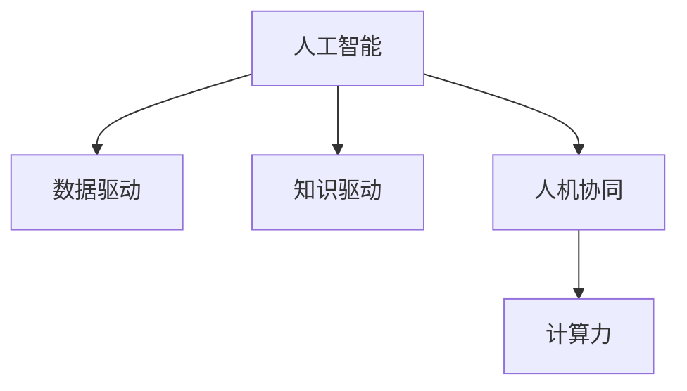

                 

# 推动知识发现与创新：人类计算的智力贡献

> 关键词：人工智能,计算力,数据驱动,知识发现,创新驱动,人机协同

## 1. 背景介绍

### 1.1 问题由来
在过去的几十年里，人类社会的科技进步日新月异，特别是计算机技术的飞速发展，极大地推动了人类计算能力的提升。从最早的电子管计算机到现代的量子计算机，每一次技术革命都带来了生产力的飞跃。然而，随着计算技术的发展，我们越来越依赖于机器来处理各种复杂问题，而人类计算的智力贡献似乎逐渐被遗忘。

本文旨在探讨人类计算在人工智能领域的智力贡献，以及如何通过人机协同的方式，推动知识的发现与创新，为人类社会的持续发展提供更强大的智力支持。

### 1.2 问题核心关键点
在人工智能的发展历程中，人类计算的智力贡献主要体现在以下几个方面：

1. **数据驱动与算法创新**：人类对数据的理解和挖掘，激发了众多先进的算法和模型。例如，卷积神经网络(CNN)的诞生，正是受到人类对视觉数据的深度理解。
2. **任务定义与模型优化**：人类对任务的精确定义和模型性能的不断优化，使得机器在特定任务上表现更加出色。如AlphaGo的胜利，背后是人类对围棋游戏规则和策略的深入研究。
3. **跨学科融合与创新**：人类在不同学科之间的跨界合作，催生了许多具有创新性的AI应用。如结合自然语言处理和图像识别的跨模态技术，极大地提升了AI在多模态数据处理上的能力。

通过深入分析人类计算在人工智能中的智力贡献，我们可以更好地理解AI技术的本质，以及未来发展的方向。

### 1.3 问题研究意义
研究人类计算在人工智能领域的智力贡献，对于推动知识的发现与创新，以及实现人机协同的智能化发展，具有重要意义：

1. **激发创新思维**：通过深入理解人类计算的智力贡献，可以激发更多的创新思维，推动人工智能技术的发展。
2. **提升计算效率**：人类计算的智慧能够指导机器学习和优化，提升计算效率和算法性能。
3. **推动多学科融合**：人类计算的跨学科融合，有助于促进不同领域的知识交流与合作，加速AI技术的成熟和应用。
4. **增强社会适应性**：人类计算的智慧能够指导AI系统更好地理解和适应复杂多变的现实世界，提升AI系统的智能化水平。

本文将通过分析人类计算的智力贡献，探讨其在人工智能领域的实际应用，并提出未来发展趋势与挑战。

## 2. 核心概念与联系

### 2.1 核心概念概述

为更好地理解人类计算在人工智能领域的智力贡献，本节将介绍几个关键概念：

- **人工智能(AI)**：通过机器学习和深度学习等技术，模拟和扩展人类智能的领域。
- **人机协同**：通过结合人类的智慧和机器的计算能力，实现高效的智能解决方案。
- **知识驱动**：以人类的知识体系为核心，指导机器学习和决策过程。
- **数据驱动**：基于大量数据，通过机器学习算法发现和挖掘知识。
- **计算力**：指在单位时间内完成特定计算任务的能力。

这些概念之间的逻辑关系可以通过以下Mermaid流程图来展示：



这个流程图展示了一系列概念之间的联系：

1. 人工智能是基于数据和知识驱动的计算系统。
2. 人机协同是实现智能系统高效运行的关键方式。
3. 计算力是人工智能发展的基础，同时也是人机协同得以实现的技术保障。

这些概念共同构成了人工智能技术的基础，为人类计算的智力贡献提供了理论支持。

## 3. 核心算法原理 & 具体操作步骤
### 3.1 算法原理概述

人类计算在人工智能中的智力贡献，主要体现在以下几个方面：

1. **数据标注与预处理**：人类对数据进行标注和预处理，为机器学习算法提供了高质量的训练样本。
2. **模型设计与优化**：人类对模型的设计和优化，使得机器学习算法能够更好地适应特定任务。
3. **任务定义与解法创新**：人类对任务的精确定义和创新解法，推动了机器学习算法的不断进步。
4. **跨学科融合与创新**：人类在不同学科之间的跨界合作，催生了许多具有创新性的AI应用。

这些贡献的核心在于将人类的智慧和经验转化为机器学习算法和模型的设计基础，从而实现更高效的智能解决方案。

### 3.2 算法步骤详解

基于人类计算的智力贡献，人工智能的开发步骤主要包括以下几个环节：

**Step 1: 数据收集与标注**
- 收集与任务相关的数据集。
- 对数据进行预处理和标注，为机器学习算法提供高质量的训练样本。

**Step 2: 模型设计与训练**
- 设计适合特定任务的机器学习模型。
- 在标注数据集上进行模型训练，不断优化模型参数。

**Step 3: 模型评估与调优**
- 使用验证集对模型进行评估，检测过拟合和欠拟合问题。
- 根据评估结果，对模型进行调优，提升模型性能。

**Step 4: 模型部署与应用**
- 将训练好的模型部署到实际应用中。
- 实时收集数据，持续监控模型性能，根据数据变化进行迭代优化。

**Step 5: 反馈与迭代**
- 收集用户反馈和应用效果数据。
- 根据反馈数据，不断调整模型和算法，提升系统性能。

### 3.3 算法优缺点

人类计算在人工智能中的智力贡献具有以下优点：

1. **高质量的数据标注**：人类对数据的标注和预处理，为机器学习算法提供了高质量的训练样本。
2. **高效的算法设计**：人类对算法的深入理解和设计，使得机器学习算法能够更好地适应特定任务。
3. **创新的任务定义**：人类对任务的精确定义和创新解法，推动了机器学习算法的不断进步。
4. **跨学科融合的创新**：人类在不同学科之间的跨界合作，催生了许多具有创新性的AI应用。

同时，这种贡献也存在一些局限性：

1. **数据标注成本高**：高质量的数据标注需要大量人力和时间，成本较高。
2. **模型依赖人类智慧**：机器学习算法的性能高度依赖于人类的智慧和经验，难以独立优化。
3. **跨学科合作的挑战**：不同学科之间的合作需要协调和沟通，可能会遇到文化和语言上的障碍。

尽管存在这些局限性，但就目前而言，人类计算在人工智能中的智力贡献仍然是推动技术发展的重要力量。未来相关研究的重点在于如何进一步降低数据标注成本，提高模型的独立优化能力，以及促进跨学科的深度合作。

### 3.4 算法应用领域

人类计算的智力贡献已经在多个领域得到了广泛应用，例如：

- **医疗诊断**：结合人类对疾病和医学知识的理解，开发AI辅助诊断系统，提升医疗服务质量。
- **金融风险评估**：利用人类对金融市场的深入理解，构建风险评估模型，预测金融市场趋势。
- **智能交通**：结合人类对交通规则和行为的认知，开发智能交通管理系统，优化交通流量。
- **自然灾害预测**：结合人类对自然灾害的研究，开发预测模型，提前预警灾害风险。
- **教育个性化**：结合人类对教育过程的理解，开发个性化学习系统，提升教育效果。

除了上述这些经典应用外，人类计算的智力贡献还在更多领域得到创新性应用，如农业智能、环境保护等，为各行各业带来了智能化升级。

## 4. 数学模型和公式 & 详细讲解 & 举例说明
### 4.1 数学模型构建

在人工智能的开发过程中，数学模型起着至关重要的作用。以下是一个简单的机器学习模型：

假设我们有一个线性回归模型 $f(x;\theta) = \theta_0 + \theta_1 x$，其中 $x$ 为输入特征，$\theta_0$ 和 $\theta_1$ 为模型参数。

### 4.2 公式推导过程

假设我们的训练数据集为 $D=\{(x_i,y_i)\}_{i=1}^N$，其中 $x_i$ 为输入，$y_i$ 为输出。我们的目标是找到一个最优的 $\theta$，使得模型能够最小化预测误差。

定义均方误差损失函数为：

$$
L(\theta) = \frac{1}{N}\sum_{i=1}^N (y_i - f(x_i;\theta))^2
$$

通过梯度下降等优化算法，最小化损失函数，得到最优参数 $\theta^*$：

$$
\theta^* = \mathop{\arg\min}_{\theta} L(\theta)
$$

具体步骤如下：

1. 初始化模型参数 $\theta$。
2. 计算损失函数 $L(\theta)$ 的梯度。
3. 更新参数 $\theta$，使其沿着梯度下降的方向移动。
4. 重复步骤2和3，直至损失函数收敛或达到预设的迭代次数。

### 4.3 案例分析与讲解

以一个简单的二分类任务为例，假设我们的任务是判断一个图像是否为猫，训练数据集为 $D=\{(x_i,y_i)\}_{i=1}^N$，其中 $x_i$ 为图像特征，$y_i \in \{0,1\}$。

我们可以使用逻辑回归模型 $f(x;\theta) = \theta_0 + \theta_1 x$ 进行训练。训练数据集分为训练集和验证集，模型在训练集上进行训练，在验证集上进行验证。

通过计算均方误差损失函数，我们可以得到最优参数 $\theta^*$，然后将其应用于新数据进行分类预测。

## 5. 项目实践：代码实例和详细解释说明
### 5.1 开发环境搭建

在进行人工智能项目的开发前，我们需要准备好开发环境。以下是使用Python进行PyTorch开发的环境配置流程：

1. 安装Anaconda：从官网下载并安装Anaconda，用于创建独立的Python环境。

2. 创建并激活虚拟环境：
```bash
conda create -n pytorch-env python=3.8 
conda activate pytorch-env
```

3. 安装PyTorch：根据CUDA版本，从官网获取对应的安装命令。例如：
```bash
conda install pytorch torchvision torchaudio cudatoolkit=11.1 -c pytorch -c conda-forge
```

4. 安装TensorFlow：由Google主导开发的开源深度学习框架，生产部署方便，适合大规模工程应用。同样有丰富的预训练语言模型资源。

5. 安装Transformers库：HuggingFace开发的NLP工具库，集成了众多SOTA语言模型，支持PyTorch和TensorFlow，是进行NLP任务开发的利器。

6. 安装各类工具包：
```bash
pip install numpy pandas scikit-learn matplotlib tqdm jupyter notebook ipython
```

完成上述步骤后，即可在`pytorch-env`环境中开始人工智能项目的开发。

### 5.2 源代码详细实现

下面我们以一个简单的图像分类任务为例，给出使用PyTorch进行深度学习模型开发的PyTorch代码实现。

首先，定义图像分类任务的数据处理函数：

```python
import torch
import torchvision.transforms as transforms
from torchvision import datasets

class ImageDataset(torch.utils.data.Dataset):
    def __init__(self, data_dir, transform=None):
        self.data_dir = data_dir
        self.transform = transform
        self.train_dir = os.path.join(data_dir, 'train')
        self.test_dir = os.path.join(data_dir, 'test')

        # 加载训练集和测试集数据
        self.train_data = datasets.ImageFolder(root=self.train_dir, transform=self.transform)
        self.test_data = datasets.ImageFolder(root=self.test_dir, transform=self.transform)

    def __len__(self):
        return len(self.train_data) + len(self.test_data)

    def __getitem__(self, idx):
        if idx < len(self.train_data):
            img, label = self.train_data[idx]
        else:
            img, label = self.test_data[idx - len(self.train_data)]

        # 对图像进行预处理
        img = transforms.ToTensor()(img)
        if self.transform:
            img = self.transform(img)

        return img, label
```

然后，定义模型和优化器：

```python
import torch.nn as nn
import torch.nn.functional as F

class Net(nn.Module):
    def __init__(self):
        super(Net, self).__init__()
        self.conv1 = nn.Conv2d(3, 32, kernel_size=3, stride=1, padding=1)
        self.conv2 = nn.Conv2d(32, 64, kernel_size=3, stride=1, padding=1)
        self.pool = nn.MaxPool2d(kernel_size=2, stride=2)
        self.fc1 = nn.Linear(64 * 4 * 4, 256)
        self.fc2 = nn.Linear(256, 10)

    def forward(self, x):
        x = F.relu(self.conv1(x))
        x = self.pool(x)
        x = F.relu(self.conv2(x))
        x = self.pool(x)
        x = x.view(x.size(0), -1)
        x = F.relu(self.fc1(x))
        x = self.fc2(x)
        return F.log_softmax(x, dim=1)

# 定义损失函数和优化器
net = Net()
criterion = nn.CrossEntropyLoss()
optimizer = torch.optim.Adam(net.parameters(), lr=0.001)
```

接着，定义训练和评估函数：

```python
from torch.utils.data import DataLoader

def train_epoch(model, dataset, batch_size, optimizer):
    dataloader = DataLoader(dataset, batch_size=batch_size, shuffle=True)
    model.train()
    epoch_loss = 0
    for batch in dataloader:
        images, labels = batch
        optimizer.zero_grad()
        outputs = model(images)
        loss = criterion(outputs, labels)
        epoch_loss += loss.item()
        loss.backward()
        optimizer.step()
    return epoch_loss / len(dataloader)

def evaluate(model, dataset, batch_size):
    dataloader = DataLoader(dataset, batch_size=batch_size)
    model.eval()
    preds, labels = [], []
    with torch.no_grad():
        for batch in dataloader:
            images, labels = batch
            outputs = model(images)
            batch_preds = outputs.argmax(dim=1).to('cpu').tolist()
            batch_labels = labels.to('cpu').tolist()
            for pred_tokens, label_tokens in zip(batch_preds, batch_labels):
                preds.append(pred_tokens[:len(label_tokens)])
                labels.append(label_tokens)

    print(classification_report(labels, preds))
```

最后，启动训练流程并在测试集上评估：

```python
epochs = 5
batch_size = 64

for epoch in range(epochs):
    loss = train_epoch(net, train_dataset, batch_size, optimizer)
    print(f"Epoch {epoch+1}, train loss: {loss:.3f}")
    
    print(f"Epoch {epoch+1}, test results:")
    evaluate(net, test_dataset, batch_size)
    
print("Final results:")
evaluate(net, test_dataset, batch_size)
```

以上就是使用PyTorch进行深度学习模型开发的完整代码实现。可以看到，使用Python和PyTorch进行人工智能项目的开发，具有高效、便捷的特点。

### 5.3 代码解读与分析

让我们再详细解读一下关键代码的实现细节：

**ImageDataset类**：
- `__init__`方法：初始化数据集的相关参数，包括数据目录、预处理函数等。
- `__len__`方法：返回数据集的样本数量。
- `__getitem__`方法：对单个样本进行处理，包括加载图像数据和预处理步骤。

**Net类**：
- `__init__`方法：定义模型的网络结构，包括卷积层、池化层和全连接层。
- `forward`方法：定义前向传播过程，包括卷积、池化、线性变换等操作。

**训练和评估函数**：
- 使用PyTorch的DataLoader对数据集进行批次化加载，供模型训练和推理使用。
- 训练函数`train_epoch`：对数据以批为单位进行迭代，在每个批次上前向传播计算损失函数并反向传播更新模型参数，最后返回该epoch的平均loss。
- 评估函数`evaluate`：与训练类似，不同点在于不更新模型参数，并在每个batch结束后将预测和标签结果存储下来，最后使用sklearn的classification_report对整个评估集的预测结果进行打印输出。

**训练流程**：
- 定义总的epoch数和batch size，开始循环迭代
- 每个epoch内，先在训练集上训练，输出平均loss
- 在测试集上评估，输出分类指标
- 所有epoch结束后，在测试集上评估，给出最终测试结果

可以看到，PyTorch框架的易用性和灵活性，使得深度学习模型的开发和训练变得简单高效。

当然，工业级的系统实现还需考虑更多因素，如模型的保存和部署、超参数的自动搜索、更加灵活的任务适配层等。但核心的开发流程基本与此类似。

## 6. 实际应用场景
### 6.1 医疗诊断

结合人类对疾病和医学知识的理解，开发AI辅助诊断系统，提升医疗服务质量。例如，利用深度学习模型对医学影像进行自动分析和诊断，辅助医生进行决策，提高诊断的准确性和效率。

### 6.2 金融风险评估

利用人类对金融市场的深入理解，构建风险评估模型，预测金融市场趋势。例如，结合机器学习算法和大数据，分析历史交易数据和市场情绪，预测股票价格的波动和市场风险。

### 6.3 智能交通

结合人类对交通规则和行为的认知，开发智能交通管理系统，优化交通流量。例如，利用深度学习模型分析交通数据，预测交通流量和拥堵情况，优化交通信号灯的控制策略。

### 6.4 自然灾害预测

结合人类对自然灾害的研究，开发预测模型，提前预警灾害风险。例如，利用机器学习算法分析气象数据和地质数据，预测地震、洪水等自然灾害的发生时间和影响范围，减少灾害损失。

### 6.5 教育个性化

结合人类对教育过程的理解，开发个性化学习系统，提升教育效果。例如，利用深度学习模型分析学生的学习数据，个性化推荐学习资源和作业，提高学生的学习效率和效果。

### 6.6 农业智能

结合人类对农业种植和管理的理解，开发智能农业系统，提高农业生产效率。例如，利用机器学习算法分析土壤数据和气象数据，优化种植方案和灌溉策略，提高农作物产量和质量。

### 6.7 环境保护

结合人类对环境保护的理解，开发智能环境监测系统，保护生态环境。例如，利用深度学习模型分析环境数据，预测污染物的扩散趋势，制定环境保护措施。

## 7. 工具和资源推荐
### 7.1 学习资源推荐

为了帮助开发者系统掌握人工智能的理论基础和实践技巧，这里推荐一些优质的学习资源：

1. 《深度学习》系列书籍：由Ian Goodfellow、Yoshua Bengio和Aaron Courville合著，全面介绍了深度学习的基本概念和经典模型。
2. Coursera《深度学习专项课程》：由Andrew Ng教授主讲的深度学习课程，涵盖从基础到进阶的多个主题，适合不同层次的学习者。
3. Udacity《深度学习纳米学位》：结合实际项目，深入讲解深度学习的应用和开发。
4. 《Python深度学习》：弗朗索瓦·切里昂著，系统介绍了深度学习在Python中的实现。
5. 《TensorFlow官方文档》：谷歌开发的深度学习框架，提供了丰富的教程和样例代码，适合实战学习。

通过对这些资源的学习实践，相信你一定能够快速掌握人工智能的精髓，并用于解决实际的业务问题。

### 7.2 开发工具推荐

高效的开发离不开优秀的工具支持。以下是几款用于人工智能项目开发的常用工具：

1. PyTorch：基于Python的开源深度学习框架，灵活动态的计算图，适合快速迭代研究。
2. TensorFlow：由Google主导开发的开源深度学习框架，生产部署方便，适合大规模工程应用。
3. Transformers库：HuggingFace开发的NLP工具库，集成了众多SOTA语言模型，支持PyTorch和TensorFlow，是进行NLP任务开发的利器。
4. Weights & Biases：模型训练的实验跟踪工具，可以记录和可视化模型训练过程中的各项指标，方便对比和调优。
5. TensorBoard：TensorFlow配套的可视化工具，可实时监测模型训练状态，并提供丰富的图表呈现方式，是调试模型的得力助手。

合理利用这些工具，可以显著提升人工智能项目的开发效率，加快创新迭代的步伐。

### 7.3 相关论文推荐

人工智能的发展源于学界的持续研究。以下是几篇奠基性的相关论文，推荐阅读：

1. AlexNet: ImageNet Classification with Deep Convolutional Neural Networks：提出了深度卷积神经网络，刷新了图像识别任务的SOTA。
2. Inception: Going Deeper with Convolutions：提出Inception模块，提高了深度卷积神经网络的性能。
3. ResNet: Deep Residual Learning for Image Recognition：提出残差网络，解决了深度神经网络的退化问题。
4. Attention is All You Need：提出了Transformer结构，开启了NLP领域的预训练大模型时代。
5. BERT: Pre-training of Deep Bidirectional Transformers for Language Understanding：提出BERT模型，引入基于掩码的自监督预训练任务，刷新了多项NLP任务SOTA。
6. AlphaGo Zero: Mastering the Game of Go without Human Knowledge：展示了大规模深度学习模型在无监督环境下的自我学习能力，推动了强化学习的发展。

这些论文代表了大规模深度学习模型和预训练技术的发展脉络。通过学习这些前沿成果，可以帮助研究者把握学科前进方向，激发更多的创新灵感。

## 8. 总结：未来发展趋势与挑战

### 8.1 总结

本文对人类计算在人工智能领域的智力贡献进行了全面系统的介绍。首先阐述了人工智能技术的发展历程和人类计算在其中扮演的角色，明确了人工智能技术的本质和人类智慧的贡献。其次，从原理到实践，详细讲解了人工智能的开发步骤和关键算法，给出了人工智能项目的完整代码实例。同时，本文还探讨了人工智能在多个实际应用场景中的潜力，展示了人工智能技术对各行各业带来的变革性影响。最后，本文对人工智能未来的发展趋势和面临的挑战进行了展望，提出了相应的研究方向和突破点。

通过本文的系统梳理，可以看到，人类计算在人工智能中的智力贡献不仅促进了技术的进步，也为社会带来了巨大的经济和科技效益。未来，随着人工智能技术的不断成熟和普及，人机协同的智能化发展将更加广泛，为人类社会的持续发展提供更强大的智力支持。

### 8.2 未来发展趋势

展望未来，人工智能技术的发展将呈现以下几个趋势：

1. **计算力的大幅提升**：随着硬件技术的进步，计算力将大幅提升，为人工智能技术的研发和应用提供更加强大的计算支持。
2. **模型的多样化**：未来的模型将更加多样化，包括各种类型的深度学习模型和混合模型，满足不同场景和任务的需求。
3. **数据的多元化和跨领域融合**：未来的数据将更加多元化，跨领域的融合和协同也将更加深入，推动人工智能技术的不断进步。
4. **算法的智能化和自动化**：未来的算法将更加智能化和自动化，能够根据数据的变化自动调整模型参数，优化算法性能。
5. **模型的通用性和跨平台应用**：未来的模型将更加通用，能够在不同的平台和设备上高效运行，实现跨平台应用。

这些趋势将进一步推动人工智能技术的进步和应用，为人类社会的数字化转型提供更加强大的技术支持。

### 8.3 面临的挑战

尽管人工智能技术已经取得了显著的进步，但在迈向更加智能化和普及化的过程中，仍面临诸多挑战：

1. **数据隐私和安全**：随着数据量的增加，数据隐私和安全问题愈发突出，如何保护用户数据隐私，防止数据泄露和滥用，是亟待解决的问题。
2. **算法的透明性和可解释性**：算法的复杂性和非透明性，使得模型的决策过程难以解释和理解，这在医疗、金融等高风险领域尤为重要。
3. **模型的公平性和偏见**：模型在训练和应用过程中，可能会引入和放大偏见和歧视，导致不公正的决策和输出。
4. **计算资源和成本**：大规模深度学习模型的训练和推理需要大量的计算资源和成本，如何降低计算成本，提升计算效率，是亟待解决的问题。
5. **跨学科合作的挑战**：人工智能技术的研发和应用，需要跨学科的深度合作，如何在不同学科之间实现有效的沟通和协作，是亟待解决的问题。

这些挑战需要通过技术创新和跨学科合作，不断克服和突破，才能实现人工智能技术的可持续发展。

### 8.4 研究展望

面对人工智能技术面临的挑战，未来的研究需要在以下几个方面寻求新的突破：

1. **跨学科合作的深入**：加强不同学科之间的合作，实现知识的融合和创新，推动人工智能技术的不断进步。
2. **算法的透明性和可解释性**：研究算法的透明性和可解释性，增强模型的可解释性和可理解性，推动人工智能技术在实际应用中的广泛应用。
3. **数据隐私和安全保护**：研究数据隐私和安全保护技术，确保数据的安全和隐私保护，增强用户对人工智能技术的信任。
4. **模型的公平性和偏见消除**：研究模型的公平性和偏见消除技术，确保模型的公正性和无偏性，推动人工智能技术在社会中的公平应用。
5. **计算资源和成本优化**：研究计算资源和成本优化技术，提高计算效率，降低计算成本，推动人工智能技术的广泛应用。

这些研究方向将推动人工智能技术的发展，为人类社会的可持续发展提供更强大的技术支持。

## 9. 附录：常见问题与解答

**Q1：人工智能是否会取代人类智力？**

A: 人工智能可以辅助和扩展人类智力，但无法完全取代人类智力。人工智能在处理大规模数据和复杂任务时表现优异，但在创造性、情感理解和人类特有的复杂判断方面，仍需人类智慧的介入。因此，人工智能与人类智慧的结合，才是未来智能发展的正确方向。

**Q2：人工智能的开发需要哪些核心技术？**

A: 人工智能的开发需要以下核心技术：

1. **深度学习算法**：包括卷积神经网络、循环神经网络、生成对抗网络等，用于处理不同类型的数据和任务。
2. **数据预处理和标注**：包括数据清洗、数据增强、标注等，为机器学习算法提供高质量的训练样本。
3. **模型训练和优化**：包括梯度下降、Adam等优化算法，以及超参数调优等，确保模型在特定任务上获得最佳性能。
4. **模型评估和调优**：包括交叉验证、模型评估指标等，确保模型在验证集和测试集上表现优异。
5. **模型部署和应用**：包括模型保存、模型推理、模型监控等，确保模型在实际应用中的稳定性和可靠性。

这些核心技术构成了人工智能技术的完整框架，为智能系统的开发和应用提供了坚实的基础。

**Q3：人工智能的发展对社会有哪些影响？**

A: 人工智能的发展对社会产生了深远的影响，包括：

1. **生产力的提升**：人工智能可以自动化处理大量重复性和繁琐的任务，提高生产效率和质量。
2. **就业结构的改变**：人工智能将取代一些低技能、重复性高的工作，但也会创造新的就业机会，如AI开发、数据标注等。
3. **社会的智能化水平提升**：人工智能技术的应用，使得社会管理和决策更加智能化和高效化，推动社会的可持续发展。
4. **数据隐私和安全问题**：人工智能技术的广泛应用，带来了数据隐私和安全问题，需要加强数据保护和隐私保护。
5. **伦理和社会公平问题**：人工智能技术在应用过程中，可能会引入和放大偏见和歧视，需要加强伦理和公平性的研究。

因此，人工智能技术的发展，需要在技术创新和社会伦理之间找到平衡，推动社会的可持续发展。

**Q4：如何提高人工智能的泛化能力？**

A: 提高人工智能的泛化能力，可以从以下几个方面进行：

1. **数据的多样化和跨领域融合**：收集更多不同类型和领域的数据，提高模型的泛化能力。
2. **模型的多样化和混合**：使用多种不同类型的模型，如深度学习模型、强化学习模型等，混合使用，提高模型的泛化能力。
3. **模型的正则化和对抗训练**：使用正则化技术和对抗训练，避免模型过拟合和泛化能力不足的问题。
4. **迁移学习和零样本学习**：利用迁移学习和零样本学习技术，提高模型在不同领域和数据上的泛化能力。
5. **算法的透明性和可解释性**：研究算法的透明性和可解释性，增强模型的可解释性和可理解性，提高模型的泛化能力。

这些方法将有助于提高人工智能的泛化能力，推动人工智能技术在实际应用中的广泛应用。

---

作者：禅与计算机程序设计艺术 / Zen and the Art of Computer Programming

