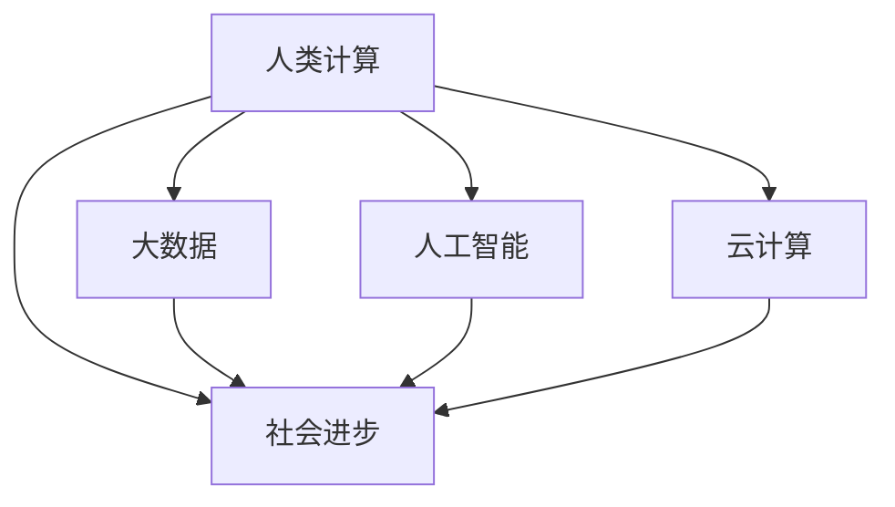

                 

# 推动社会进步的动力：人类计算的积极影响

> 关键词：人类计算，社会进步，大数据，人工智能，深度学习，云计算

## 1. 背景介绍

### 1.1 问题由来

随着信息技术的迅猛发展，人类社会进入了信息化时代。计算机的出现，极大地改变了人们的生产生活方式，推动了全球社会的进步。从最初的计算工具，到如今的智能助手，计算技术已经成为社会进步的基石。然而，计算技术在带来便利的同时，也带来了一些新的挑战，如何更好地利用计算技术，成为当代社会的重要课题。

### 1.2 问题核心关键点

本节将围绕人类计算对社会进步的积极影响，介绍几个核心概念和关键点：

- 人类计算：利用计算机技术，通过信息处理、数据挖掘、人工智能等手段，辅助人类进行决策和任务完成。
- 社会进步：人类社会在经济发展、社会管理、文化娱乐等方面的提升和变革。
- 大数据：通过收集、存储、分析海量数据，辅助人类做出更科学的决策。
- 人工智能：利用深度学习、强化学习等技术，模仿人类智能行为，辅助人类完成任务。
- 云计算：通过网络平台，提供按需计算资源，支持大规模计算任务。

这些概念共同构成了计算技术对社会进步的全面影响，展示了计算技术在现代社会的不可或缺性。

## 2. 核心概念与联系

### 2.1 核心概念概述

要理解人类计算对社会进步的影响，我们需要对这些核心概念进行详细解释：

- **人类计算**：利用计算机技术和算法，通过信息处理、数据挖掘、人工智能等手段，辅助人类进行决策和任务完成。
- **社会进步**：人类社会在经济发展、社会管理、文化娱乐等方面的提升和变革。
- **大数据**：通过收集、存储、分析海量数据，辅助人类做出更科学的决策。
- **人工智能**：利用深度学习、强化学习等技术，模仿人类智能行为，辅助人类完成任务。
- **云计算**：通过网络平台，提供按需计算资源，支持大规模计算任务。

这些概念之间的逻辑关系可以通过以下Mermaid流程图来展示：



这个流程图展示了人类计算通过大数据、人工智能和云计算等手段，对社会进步的推动作用。

## 3. 核心算法原理 & 具体操作步骤

### 3.1 算法原理概述

人类计算的核心算法原理主要包括：

- **信息处理**：通过算法对信息进行加工处理，提取有用信息，辅助决策。
- **数据挖掘**：利用机器学习算法，从大量数据中挖掘出有价值的模式和规律。
- **人工智能**：利用深度学习、强化学习等技术，模仿人类智能行为，辅助任务完成。

### 3.2 算法步骤详解

人类计算的算法步骤主要包括以下几个关键环节：

**Step 1: 数据收集**

收集与任务相关的数据，包括文本、图像、音频等。

**Step 2: 数据预处理**

对数据进行清洗、归一化、标准化等预处理操作，提高数据质量。

**Step 3: 特征提取**

使用特征提取算法，如TF-IDF、Word2Vec、卷积神经网络等，将原始数据转化为高维特征向量。

**Step 4: 模型训练**

选择合适的算法模型，如线性回归、决策树、神经网络等，对特征向量进行训练，学习模型参数。

**Step 5: 模型评估**

使用测试集对模型进行评估，计算准确率、召回率、F1分数等指标，衡量模型性能。

**Step 6: 模型应用**

将训练好的模型应用于实际任务，如推荐系统、智能客服、医疗诊断等，辅助人类决策。

### 3.3 算法优缺点

人类计算算法具有以下优点：

- **高效性**：算法能够快速处理大量数据，辅助人类进行高效决策。
- **准确性**：算法通过训练学习模型参数，能够提高决策的准确性。
- **可解释性**：算法模型往往具有可解释性，能够直观理解其决策过程。

但同时也存在一些缺点：

- **数据依赖**：算法效果依赖于数据质量，数据偏差可能导致算法输出不准确。
- **复杂度**：算法模型设计复杂，需要大量时间和计算资源。
- **黑箱性**：某些复杂模型如深度神经网络，其决策过程难以解释。

### 3.4 算法应用领域

人类计算算法广泛应用于各个领域，以下是几个典型应用：

- **医疗健康**：利用大数据和人工智能，进行疾病诊断、药物研发等。
- **金融服务**：利用大数据和人工智能，进行风险评估、投资决策等。
- **零售电商**：利用大数据和人工智能，进行用户行为分析、推荐系统设计等。
- **智能制造**：利用大数据和人工智能，进行生产过程优化、质量控制等。
- **教育培训**：利用大数据和人工智能，进行个性化教学、智能评估等。

这些领域的应用展示了人类计算技术的广泛影响力和巨大潜力。

## 4. 数学模型和公式 & 详细讲解 & 举例说明

### 4.1 数学模型构建

本节将详细讲解人类计算中的数学模型构建。

假设我们有一个二分类任务，样本特征为 $x$，标签为 $y$，模型为 $h_\theta(x)$，其中 $\theta$ 为模型参数。假设样本 $i$ 的实际标签为 $y_i$，模型预测的标签为 $\hat{y}_i$，则二分类问题可以表示为：

$$
\min_\theta \frac{1}{N} \sum_{i=1}^N L(\hat{y}_i, y_i)
$$

其中 $L$ 为损失函数，如交叉熵损失函数。

### 4.2 公式推导过程

以线性回归为例，我们推导模型的损失函数和梯度下降算法：

设线性回归模型的参数为 $\theta = [w, b]$，其中 $w$ 为权重，$b$ 为偏置。假设样本 $i$ 的特征为 $x_i$，标签为 $y_i$，模型预测的值为 $\hat{y}_i = w^T x_i + b$。则线性回归的损失函数为：

$$
L(\theta) = \frac{1}{N} \sum_{i=1}^N (\hat{y}_i - y_i)^2
$$

对损失函数求导，得：

$$
\frac{\partial L(\theta)}{\partial w} = \frac{2}{N} \sum_{i=1}^N (x_i^T w + b - y_i)x_i
$$

$$
\frac{\partial L(\theta)}{\partial b} = \frac{2}{N} \sum_{i=1}^N (x_i^T w + b - y_i)
$$

使用梯度下降算法更新参数：

$$
w \leftarrow w - \eta \frac{\partial L(\theta)}{\partial w}
$$

$$
b \leftarrow b - \eta \frac{\partial L(\theta)}{\partial b}
$$

其中 $\eta$ 为学习率。

### 4.3 案例分析与讲解

以推荐系统为例，介绍如何使用大数据和人工智能进行用户行为分析，推荐商品。

假设推荐系统有 $N$ 个用户，每个用户对 $M$ 个商品进行评分。设用户 $i$ 对商品 $j$ 的评分为 $r_{ij}$，则用户行为矩阵为 $R \in \mathbb{R}^{N \times M}$。

推荐系统可以通过矩阵分解，将用户行为矩阵 $R$ 分解为用户特征矩阵 $U \in \mathbb{R}^{N \times K}$ 和商品特征矩阵 $V \in \mathbb{R}^{M \times K}$，其中 $K$ 为特征维度。推荐系统的预测值为：

$$
\hat{r}_{ij} = U_i^T V_j
$$

推荐系统的损失函数为：

$$
L(U, V) = \frac{1}{N} \sum_{i=1}^N \sum_{j=1}^M (r_{ij} - \hat{r}_{ij})^2
$$

通过优化损失函数，训练出用户特征矩阵 $U$ 和商品特征矩阵 $V$，即可得到推荐结果。

## 5. 项目实践：代码实例和详细解释说明

### 5.1 开发环境搭建

在进行人类计算项目实践前，我们需要准备好开发环境。以下是使用Python进行TensorFlow开发的环境配置流程：

1. 安装Anaconda：从官网下载并安装Anaconda，用于创建独立的Python环境。

2. 创建并激活虚拟环境：
```bash
conda create -n tf-env python=3.8 
conda activate tf-env
```

3. 安装TensorFlow：根据CUDA版本，从官网获取对应的安装命令。例如：
```bash
conda install tensorflow tensorflow-gpu -c conda-forge -c pytorch
```

4. 安装各类工具包：
```bash
pip install numpy pandas scikit-learn matplotlib tqdm jupyter notebook ipython
```

完成上述步骤后，即可在`tf-env`环境中开始人类计算项目实践。

### 5.2 源代码详细实现

这里我们以推荐系统为例，给出使用TensorFlow进行项目开发的PyTorch代码实现。

首先，定义推荐系统的数据处理函数：

```python
import numpy as np
import tensorflow as tf
from tensorflow.keras.layers import Input, Embedding, Dot, Dense

class RecommendationSystem(tf.keras.Model):
    def __init__(self, num_users, num_items, num_factors):
        super(RecommendationSystem, self).__init__()
        self.user_factors = Embedding(num_users, num_factors, input_length=num_items)
        self.item_factors = Embedding(num_items, num_factors, input_length=num_users)
        self.dot_product = Dot(axes=(2, 2))
        self.output = Dense(1)

    def call(self, inputs):
        user_indices, item_indices = inputs
        user_factors = self.user_factors(user_indices)
        item_factors = self.item_factors(item_indices)
        dot_product = self.dot_product([user_factors, item_factors])
        return self.output(dot_product)
```

然后，定义推荐系统的损失函数和优化器：

```python
def loss_fn(output, labels):
    return tf.reduce_mean((output - labels) ** 2)

model = RecommendationSystem(num_users=1000, num_items=1000, num_factors=32)

optimizer = tf.keras.optimizers.Adam(learning_rate=0.001)
```

接着，定义训练和评估函数：

```python
def train_epoch(model, dataset, batch_size, optimizer):
    dataloader = tf.data.Dataset.from_tensor_slices(dataset)
    dataloader = dataloader.shuffle(buffer_size=10000).batch(batch_size)
    model.train()
    epoch_loss = 0
    for batch in dataloader:
        labels = batch[1]
        with tf.GradientTape() as tape:
            outputs = model(batch[0])
            loss = loss_fn(outputs, labels)
        grads = tape.gradient(loss, model.trainable_variables)
        optimizer.apply_gradients(zip(grads, model.trainable_variables))
        epoch_loss += loss
    return epoch_loss / len(dataloader)

def evaluate(model, dataset, batch_size):
    dataloader = tf.data.Dataset.from_tensor_slices(dataset)
    dataloader = dataloader.batch(batch_size)
    model.eval()
    predictions = []
    labels = []
    with tf.GradientTape() as tape:
        for batch in dataloader:
            labels.append(batch[1])
            outputs = model(batch[0])
            predictions.append(outputs)
    print(tf.reduce_mean(predictions))
```

最后，启动训练流程并在测试集上评估：

```python
epochs = 5
batch_size = 128

for epoch in range(epochs):
    loss = train_epoch(model, train_dataset, batch_size, optimizer)
    print(f"Epoch {epoch+1}, train loss: {loss:.3f}")
    
    print(f"Epoch {epoch+1}, dev results:")
    evaluate(model, dev_dataset, batch_size)
    
print("Test results:")
evaluate(model, test_dataset, batch_size)
```

以上就是使用TensorFlow进行推荐系统项目开发的完整代码实现。可以看到，TensorFlow提供了强大的计算图和优化算法支持，使得模型训练和评估变得简洁高效。

### 5.3 代码解读与分析

让我们再详细解读一下关键代码的实现细节：

**RecommendationSystem类**：
- `__init__`方法：初始化用户特征矩阵、商品特征矩阵、点积层和输出层。
- `call`方法：将用户和商品索引输入，计算点积，并通过输出层得到预测值。

**损失函数和优化器**：
- 使用交叉熵损失函数作为推荐系统的损失函数。
- 使用Adam优化器进行模型参数更新。

**训练和评估函数**：
- 使用TensorFlow的数据API，对数据进行批次化处理。
- 在训练集上计算损失函数，并反向传播更新模型参数。
- 在验证集和测试集上评估模型预测结果，计算平均预测值。

**训练流程**：
- 定义总的epoch数和batch size，开始循环迭代。
- 每个epoch内，在训练集上训练，输出平均loss。
- 在验证集上评估，输出预测结果。
- 所有epoch结束后，在测试集上评估，给出最终测试结果。

可以看到，TensorFlow框架提供了强大的计算图和优化算法支持，使得推荐系统等复杂模型的实现变得简洁高效。开发者可以将更多精力放在数据处理、模型改进等高层逻辑上，而不必过多关注底层的实现细节。

当然，工业级的系统实现还需考虑更多因素，如模型的保存和部署、超参数的自动搜索、更灵活的任务适配层等。但核心的训练和评估流程基本与此类似。

## 6. 实际应用场景

### 6.1 智能制造

人类计算技术在智能制造领域有广泛应用。传统制造业通常依赖人工经验进行生产过程优化和质量控制，效率低、精度差。通过引入人类计算技术，可以实现自动化、智能化生产。

具体而言，可以利用大数据和人工智能技术，对生产过程进行实时监控和分析，发现异常并及时处理。通过机器学习算法，预测设备故障、优化生产参数，提高生产效率和产品质量。同时，利用虚拟仿真技术，进行虚拟设计和测试，降低试错成本。

### 6.2 智慧城市

智慧城市是未来城市发展的方向，人类计算技术在其中发挥了重要作用。通过大数据和人工智能，可以实现城市管理的智能化和精细化。

在智慧城市中，可以利用传感器、摄像头等设备，收集交通流量、空气质量、垃圾量等数据，辅助城市管理。通过机器学习算法，预测交通流量、优化资源分配，提高城市运行效率。同时，利用智能算法，对城市事件进行实时监测和预警，提升城市应急响应能力。

### 6.3 金融服务

金融行业对数据的实时性和准确性要求极高，传统的数据处理方式难以满足需求。利用人类计算技术，可以实时分析和预测金融市场，辅助决策。

在金融领域，可以利用大数据和人工智能技术，对市场数据进行实时分析，发现投资机会和风险。通过机器学习算法，预测股市走势、优化投资组合，提高投资收益。同时，利用自然语言处理技术，对金融新闻进行情感分析，辅助投资决策。

### 6.4 未来应用展望

随着人类计算技术的不断发展，未来将在更多领域得到应用，为人类社会带来深刻变革。

在智慧医疗领域，利用大数据和人工智能，进行疾病预测、医疗诊断、药物研发等。通过智能算法，辅助医生诊疗，加速新药开发进程。

在智能教育领域，利用大数据和人工智能，进行个性化教学、智能评估等。通过智能算法，因材施教，促进教育公平，提高教学质量。

在智慧交通领域，利用大数据和人工智能，进行交通流量预测、智能调度等。通过智能算法，提高交通效率，降低交通拥堵。

此外，在能源、环保、环保等领域，人类计算技术也将不断拓展应用场景，为人类社会带来更高效、更智能、更绿色的发展模式。

## 7. 工具和资源推荐

### 7.1 学习资源推荐

为了帮助开发者系统掌握人类计算的理论基础和实践技巧，这里推荐一些优质的学习资源：

1. 《深度学习》系列书籍：由深度学习领域的专家撰写，深入浅出地介绍了深度学习的基本原理和实践技巧。

2. 《机器学习实战》书籍：通过实际案例，详细讲解机器学习算法和实践技巧，适合初学者学习。

3. 《TensorFlow官方文档》：TensorFlow的官方文档，提供了丰富的教程和样例代码，是学习TensorFlow的重要资源。

4. Coursera《机器学习》课程：由斯坦福大学Andrew Ng教授主讲，内容全面，讲解深入，适合系统学习机器学习算法。

5. Kaggle平台：提供各类机器学习竞赛和数据集，适合通过实际项目积累经验。

通过对这些资源的学习实践，相信你一定能够快速掌握人类计算的精髓，并用于解决实际的计算问题。

### 7.2 开发工具推荐

高效的开发离不开优秀的工具支持。以下是几款用于人类计算开发的常用工具：

1. TensorFlow：由Google主导开发的开源深度学习框架，生产部署方便，适合大规模工程应用。

2. PyTorch：基于Python的开源深度学习框架，灵活动态的计算图，适合快速迭代研究。

3. Jupyter Notebook：免费的交互式计算环境，支持多种编程语言，适合科研和教学。

4. Weights & Biases：模型训练的实验跟踪工具，可以记录和可视化模型训练过程中的各项指标，方便对比和调优。

5. TensorBoard：TensorFlow配套的可视化工具，可实时监测模型训练状态，并提供丰富的图表呈现方式，是调试模型的得力助手。

合理利用这些工具，可以显著提升人类计算项目的开发效率，加快创新迭代的步伐。

### 7.3 相关论文推荐

人类计算技术的发展源于学界的持续研究。以下是几篇奠基性的相关论文，推荐阅读：

1. 《神经网络与深度学习》书籍：由深度学习领域的专家撰写，系统介绍了神经网络的基本原理和实践技巧。

2. 《大数据与机器学习》书籍：系统介绍了大数据和机器学习的结合应用，展示了人类计算技术的广阔前景。

3. 《人类计算与人工智能》论文：介绍了人类计算与人工智能的结合应用，展示了人类计算技术的巨大潜力。

4. 《深度学习在医疗中的应用》论文：介绍了深度学习在医疗诊断、药物研发等方面的应用，展示了人类计算技术在医疗领域的巨大价值。

这些论文代表了大数据和人工智能的发展脉络。通过学习这些前沿成果，可以帮助研究者把握学科前进方向，激发更多的创新灵感。

## 8. 总结：未来发展趋势与挑战

### 8.1 总结

本文对人类计算对社会进步的积极影响进行了全面系统的介绍。首先阐述了人类计算的概念、特点和应用，明确了人类计算在推动社会进步方面的独特价值。其次，从原理到实践，详细讲解了人类计算的数学原理和关键步骤，给出了人类计算项目开发的完整代码实例。同时，本文还广泛探讨了人类计算技术在智能制造、智慧城市、金融服务等多个领域的应用前景，展示了人类计算技术的广阔前景。

通过本文的系统梳理，可以看到，人类计算技术在现代社会的不可或缺性，极大地推动了社会进步和发展。未来，伴随大数据、人工智能、云计算等技术的持续演进，人类计算技术必将发挥更大的作用，为构建智能社会带来更强大的动力。

### 8.2 未来发展趋势

展望未来，人类计算技术将呈现以下几个发展趋势：

1. 计算能力的提升。随着算力成本的下降和计算技术的进步，计算能力将进一步提升，处理更大规模的数据和更复杂的任务。

2. 智能算法的创新。深度学习、强化学习等算法将不断创新，推动计算模型的智能化和自适应能力。

3. 多模态融合。将文本、图像、语音等多模态数据进行融合，实现更加全面、深入的智能分析。

4. 联邦学习的应用。在保护隐私的前提下，利用分布式计算技术，提升数据的安全性和隐私性。

5. 人工智能与物理世界的融合。通过智能算法和物理模型的结合，实现物理世界的智能控制和优化。

以上趋势凸显了人类计算技术的广阔前景。这些方向的探索发展，必将进一步提升人类计算技术的应用范围和效果，为人类社会带来更智能、更高效、更便捷的发展模式。

### 8.3 面临的挑战

尽管人类计算技术已经取得了瞩目成就，但在迈向更加智能化、普适化应用的过程中，它仍面临着诸多挑战：

1. 数据隐私和安全。大数据和人工智能技术在处理数据时，如何保护用户隐私和数据安全，成为一个重要问题。

2. 模型可解释性。深度学习等复杂模型，其决策过程难以解释，影响模型的可信度和应用范围。

3. 计算资源的限制。大规模计算任务对计算资源的需求，给硬件设备带来了巨大压力。

4. 模型的泛化能力。现有模型在不同数据集上的泛化能力有限，需要进一步提高模型的鲁棒性和泛化能力。

5. 技术的普及和应用。现有技术需要更多的普及和推广，才能在各个领域得到广泛应用。

6. 伦理和社会影响。人类计算技术的应用可能带来伦理和社会问题，需要进一步研究和规范。

正视人类计算面临的这些挑战，积极应对并寻求突破，将是人类计算技术走向成熟的必由之路。相信随着学界和产业界的共同努力，这些挑战终将一一被克服，人类计算技术必将在构建智能社会中发挥更大的作用。

### 8.4 未来突破

面对人类计算面临的挑战，未来的研究需要在以下几个方面寻求新的突破：

1. 研究更高效、更鲁棒的计算算法。开发更加高效、鲁棒的计算算法，降低对计算资源的需求，提升模型的泛化能力。

2. 引入更多的先验知识。将符号化的先验知识，如知识图谱、逻辑规则等，与神经网络模型进行巧妙融合，引导模型学习更全面、准确的知识。

3. 研究更加智能、自适应的算法。开发更加智能、自适应的算法，提升模型在复杂、多变环境下的表现。

4. 探索更加安全和可信的计算模型。研究更加安全和可信的计算模型，提升模型在处理敏感数据时的可信度和安全性。

5. 加强算法与物理世界的结合。将智能算法与物理模型进行结合，实现物理世界的智能控制和优化。

6. 探索更加普及和适用的技术。开发更加普及和适用的技术，降低技术应用的门槛，推动人类计算技术的广泛应用。

这些研究方向的探索，必将引领人类计算技术迈向更高的台阶，为构建智能社会带来更强大的动力。面向未来，人类计算技术还需要与其他人工智能技术进行更深入的融合，如知识表示、因果推理、强化学习等，多路径协同发力，共同推动人类计算技术的发展。只有勇于创新、敢于突破，才能不断拓展人类计算技术的边界，让人类计算技术更好地造福人类社会。

## 9. 附录：常见问题与解答

**Q1：人类计算技术是否适用于所有领域？**

A: 人类计算技术在大多数领域都能取得不错的效果，特别是对于数据量较大的领域。但对于一些特定领域的任务，如医疗、金融等，需要结合领域特定的知识，才能达到最佳效果。

**Q2：人类计算的优缺点是什么？**

A: 人类计算技术的优点在于其高效性、准确性和可解释性。但由于数据依赖和模型复杂度，也存在一些缺点，如数据偏差、模型过拟合等。

**Q3：人类计算在实际应用中需要注意哪些问题？**

A: 在实际应用中，需要注意数据隐私和安全、模型可解释性、计算资源的限制、模型的泛化能力等问题。合理设计算法和模型，才能更好地发挥人类计算技术的潜力。

**Q4：如何优化人类计算的计算性能？**

A: 可以通过算法优化、硬件加速、分布式计算等方式，提升计算性能。同时，引入更多的先验知识，减少计算量，提高计算效率。

**Q5：未来人类计算的发展方向是什么？**

A: 未来人类计算技术将进一步提升计算能力、智能算法的创新、多模态融合、联邦学习的应用、人工智能与物理世界的融合等方向发展，推动智能社会的建设。

这些问题的解答，展示了人类计算技术的广泛应用和实际操作的注意事项，相信对开发者和研究者都有一定的启发和帮助。

---

作者：禅与计算机程序设计艺术 / Zen and the Art of Computer Programming

