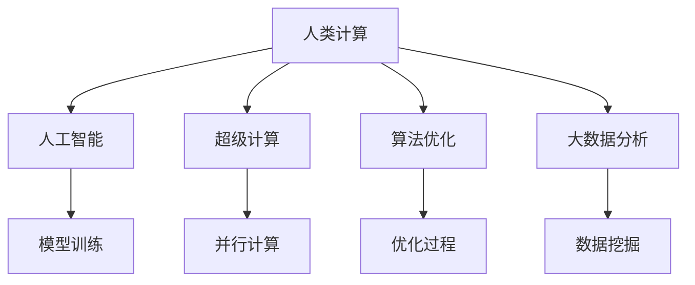

                 

# 推动科技创新：人类计算助力解决复杂问题

> 关键词：复杂问题,人工智能,超级计算,人类计算,算法优化,大数据分析

## 1. 背景介绍

随着科技的快速发展，世界正处于百年未有之大变局，人类社会面临诸多复杂问题，如气候变化、全球疫情、社会不平等、能源短缺等。这些问题涉及跨学科、多领域的复杂性，传统的经验方法和单一学科难以应对，亟需新的技术手段进行解决。

人类计算(Human Computation)作为一种全新的问题求解方式，利用众包、众筹等手段，动员广大用户参与问题解决，结合先进的人工智能和超级计算技术，为人类社会提供了一种全新的问题求解范式。本文将深入探讨人类计算的原理、算法、应用和挑战，助力科技创新，推动复杂问题的解决。

## 2. 核心概念与联系

### 2.1 核心概念概述

为了更好地理解人类计算的原理和应用，本节将介绍几个关键概念及其联系：

- **人类计算(Human Computation)**：利用人类大脑和体力进行复杂问题的求解。其特点在于大规模数据处理、高并发计算和众包众筹等技术手段，结合人工智能和超级计算，实现高效、低成本、广泛参与的求解过程。

- **人工智能(AI)**：通过算法和模型模拟人类智能，实现对数据和知识的高效分析和处理。常见的AI技术包括机器学习、深度学习、自然语言处理等。

- **超级计算(Supercomputing)**：利用高性能计算机和分布式计算集群，实现大规模、高并发的计算任务。如量子计算、神经网络训练、数据分析等。

- **算法优化(Optimization Algorithm)**：针对特定问题设计的求解策略，如贪心算法、遗传算法、强化学习等，用于指导和优化求解过程。

- **大数据分析(Big Data Analytics)**：对海量数据进行清洗、整理、分析和挖掘，以发现数据背后的规律和模式，支持人类计算中的数据驱动决策。

这些概念之间的逻辑关系可以通过以下Mermaid流程图来展示：



这个流程图展示了人类计算的核心组成及其相互关系：

1. 人类计算融合了人工智能、超级计算、算法优化和大数据分析，构建高效问题求解系统。
2. 人工智能和超级计算提供了高效的数据处理和计算能力，算法优化指导了求解策略，大数据分析提供了数据驱动的决策依据。
3. 模型训练和优化是人工智能的关键环节，而并行计算和大数据挖掘则是超级计算的重要组成部分。

这些核心概念共同构成了人类计算的框架，为其高效、广泛应用提供了坚实基础。通过理解这些核心概念，我们可以更好地把握人类计算的工作原理和优化方向。

## 3. 核心算法原理 & 具体操作步骤
### 3.1 算法原理概述

人类计算的算法原理，主要基于大规模并行计算和数据驱动的决策制定。其核心思想是：将复杂问题分解为多个子问题，通过众包平台动员大众参与，结合人工智能技术进行自动化求解，最后通过超级计算技术进行聚合分析，得出综合解决方案。

形式化地，假设一个复杂问题 $P$ 可以分解为 $N$ 个子问题 $P_1, P_2, \dots, P_N$，每个子问题通过众包平台动员 $M$ 名用户进行求解，得到 $N$ 个解集 $\{S_1, S_2, \dots, S_N\}$。则整体解决方案 $S$ 可以表示为：

$$
S = \bigcup_{i=1}^N S_i
$$

其中，$S_i$ 为第 $i$ 个子问题的解集。

通过对每个子问题进行求解和聚合，人类计算实现了大规模、高并发、低成本的问题求解，有效应对复杂问题的求解挑战。

### 3.2 算法步骤详解

人类计算的求解过程一般包括以下几个关键步骤：

**Step 1: 问题分解与任务设计**

- 将复杂问题 $P$ 分解为 $N$ 个子问题 $P_1, P_2, \dots, P_N$，每个子问题必须具有可求解性。
- 设计合适的任务，并编写脚本或算法，指导用户进行求解。任务设计需要考虑用户易用性、数据隐私、结果质量等因素。

**Step 2: 众包平台动员与任务分配**

- 使用众包平台（如Amazon Mechanical Turk、CrowdFlower等），动员 $M$ 名用户参与求解。
- 根据任务的复杂度和难度，合理分配任务给用户，避免任务过于简单或过于复杂。

**Step 3: 数据收集与自动化处理**

- 收集用户提交的求解结果 $S_i$，并进行数据清洗和预处理。
- 引入人工智能技术，如机器学习、深度学习等，对用户提交的数据进行自动化处理，提高数据质量和一致性。

**Step 4: 数据聚合与结果分析**

- 对每个子问题的解集 $S_i$ 进行合并，得到整体解集 $S$。
- 结合大数据分析技术，对解集 $S$ 进行统计分析，发现规律和模式，得出综合解决方案。

**Step 5: 结果反馈与优化**

- 将最终解决方案 $S$ 反馈给用户，并收集用户反馈。
- 根据用户反馈，不断优化求解过程和任务设计，提升问题求解效率和结果质量。

以上是人类计算的一般流程。在实际应用中，还需要针对具体问题进行优化设计，如设计更高效的任务分发机制、引入更先进的算法优化技术、利用超级计算加速数据处理等，以进一步提升问题求解的效率和精度。

### 3.3 算法优缺点

人类计算具有以下优点：
1. 高效性：通过大规模并行计算和数据驱动的决策，实现高效的问题求解。
2. 低成本：利用众包平台动员大众参与，大大降低了求解成本。
3. 广泛参与：广泛的民众参与，汇聚了多样的智慧和视角，提升了问题求解的全面性和可靠性。
4. 灵活性：可以根据问题的特点，灵活设计任务和算法，适应复杂多变的求解需求。

同时，该方法也存在一定的局限性：
1. 数据质量问题：用户提交的数据质量参差不齐，可能影响结果的准确性和一致性。
2. 任务设计复杂：需要设计合适的任务，引导用户正确理解和参与求解，任务设计复杂。
3. 隐私保护问题：用户数据涉及隐私问题，需要在数据收集和处理过程中加以保护。
4. 平台依赖性：依赖众包平台的稳定性，平台故障可能导致任务中断。
5. 计算资源限制：超级计算资源限制，可能影响大规模问题的求解。

尽管存在这些局限性，但人类计算仍是一种极具潜力的问题求解范式。未来相关研究的重点在于如何进一步提升数据质量、优化任务设计、加强隐私保护、改进计算资源利用等，以克服当前面临的挑战。

### 3.4 算法应用领域

人类计算在多个领域得到了广泛应用，包括但不限于：

- 生物学和医学：通过众包平台进行蛋白质结构预测、基因编辑设计等，大大加速了生命科学的研究进程。
- 社会科学：进行大规模的社会调查和数据分析，如民意调查、社会舆情分析等，提升社会决策的科学性和合理性。
- 环境科学：进行气候变化模拟、生态系统评估等，支持环境政策的制定和优化。
- 艺术和设计：进行图像识别、音乐创作等，催生了许多新的艺术形式和设计思路。
- 商业和金融：进行市场分析、金融预测等，提升企业决策的准确性和前瞻性。

除了上述这些领域，人类计算还被创新性地应用到更多场景中，如游戏开发、供应链管理、城市规划等，为各行各业带来了新的创新契机。

## 4. 数学模型和公式 & 详细讲解 & 举例说明

### 4.1 数学模型构建

在人类计算中，数学模型通常涉及大量的优化问题和大数据分析任务。以下以机器学习中的回归问题为例，介绍人类计算中常用的数学模型构建方法。

假设我们有一个回归问题 $y = f(x)$，其中 $x$ 为输入特征，$y$ 为输出目标，目标是构建一个回归模型 $f$，使得 $f(x)$ 能够准确预测 $y$。人类计算中的数学模型构建一般包括以下步骤：

1. 数据收集与预处理：收集 $N$ 个样本数据 $(x_i, y_i)$，并进行数据清洗和预处理。
2. 特征提取与编码：对输入特征 $x$ 进行提取和编码，得到特征向量 $\mathbf{x}_i$。
3. 模型选择与训练：选择合适的模型（如线性回归、决策树、神经网络等），并使用机器学习算法进行模型训练。
4. 模型评估与优化：使用交叉验证等技术评估模型性能，不断优化模型参数。

### 4.2 公式推导过程

以线性回归模型为例，其目标函数为：

$$
\mathcal{L}(\theta) = \frac{1}{N} \sum_{i=1}^N (y_i - f(x_i))^2
$$

其中 $\theta$ 为模型参数，$f(x_i) = \theta^T \mathbf{x}_i$。

最小化损失函数 $\mathcal{L}(\theta)$，得到参数 $\theta$ 的优化公式：

$$
\theta = (X^TX)^{-1}X^Ty
$$

其中 $X$ 为特征矩阵，$y$ 为标签向量。

在实际应用中，往往采用随机梯度下降（SGD）等优化算法，对模型参数 $\theta$ 进行迭代更新：

$$
\theta_{t+1} = \theta_t - \eta \nabla_{\theta}\mathcal{L}(\theta_t)
$$

其中 $\eta$ 为学习率，$\nabla_{\theta}\mathcal{L}(\theta_t)$ 为损失函数对参数 $\theta$ 的梯度。

### 4.3 案例分析与讲解

假设我们需要预测某个城市的房价 $y$，已知该城市的历史房价数据 $x$，包括面积、房间数量、位置等特征。

**Step 1: 数据收集与预处理**
- 收集该城市的历史房价数据，并进行清洗和预处理，去除异常值和噪声。

**Step 2: 特征提取与编码**
- 对特征 $x$ 进行提取和编码，如将面积转换为平方米、将房间数量转换为二值编码等。
- 构建特征矩阵 $X$ 和标签向量 $y$。

**Step 3: 模型选择与训练**
- 选择线性回归模型 $f(x_i) = \theta^T \mathbf{x}_i$，使用最小二乘法进行参数优化。
- 使用随机梯度下降算法进行模型训练，不断更新参数 $\theta$。

**Step 4: 模型评估与优化**
- 使用交叉验证等技术评估模型性能，计算均方误差等指标。
- 根据评估结果，调整模型参数，如增加或减少特征维度、优化学习率等，提高模型精度。

通过上述步骤，我们可以构建一个简单的房价预测模型，并通过大规模众包平台进行数据收集和模型训练。在数据收集过程中，可以动员大众进行数据标注，并利用人工智能技术对标注结果进行自动化处理。在模型训练过程中，可以引入并行计算技术，加速求解过程。最终，通过超级计算技术进行结果聚合和分析，得到综合的房价预测模型。

## 5. 项目实践：代码实例和详细解释说明

### 5.1 开发环境搭建

在进行人类计算的实践前，我们需要准备好开发环境。以下是使用Python进行TensorFlow开发的计算环境配置流程：

1. 安装Anaconda：从官网下载并安装Anaconda，用于创建独立的Python环境。

2. 创建并激活虚拟环境：
```bash
conda create -n tf-env python=3.8 
conda activate tf-env
```

3. 安装TensorFlow：根据CUDA版本，从官网获取对应的安装命令。例如：
```bash
conda install tensorflow -c conda-forge
```

4. 安装TensorBoard：
```bash
pip install tensorboard
```

5. 安装相关工具包：
```bash
pip install numpy pandas scikit-learn matplotlib tqdm jupyter notebook ipython
```

完成上述步骤后，即可在`tf-env`环境中开始人类计算的实践。

### 5.2 源代码详细实现

这里我们以房价预测任务为例，给出使用TensorFlow进行线性回归的人类计算的PyTorch代码实现。

首先，定义数据处理函数：

```python
import numpy as np
import pandas as pd
import tensorflow as tf

def load_data(file_path):
    df = pd.read_csv(file_path)
    x = df[['area', 'rooms', 'location']]
    y = df['price']
    return x, y
```

然后，定义模型和优化器：

```python
def create_model():
    inputs = tf.keras.Input(shape=(3,), name='inputs')
    outputs = tf.keras.layers.Dense(1, name='outputs')(inputs)
    model = tf.keras.Model(inputs=inputs, outputs=outputs)
    optimizer = tf.keras.optimizers.SGD(learning_rate=0.01)
    return model, optimizer

def compile_model(model, optimizer):
    model.compile(optimizer=optimizer, loss='mse')
```

接着，定义训练和评估函数：

```python
def train_epoch(model, x_train, y_train, batch_size):
    dataloader = tf.data.Dataset.from_tensor_slices((x_train, y_train)).shuffle(1000).batch(batch_size)
    model.fit(dataloader, epochs=10, verbose=0)

def evaluate_model(model, x_test, y_test, batch_size):
    dataloader = tf.data.Dataset.from_tensor_slices((x_test, y_test)).batch(batch_size)
    mse = model.evaluate(dataloader)
    print(f'Test MSE: {mse:.3f}')
```

最后，启动训练流程并在测试集上评估：

```python
train_x, train_y = load_data('train.csv')
test_x, test_y = load_data('test.csv')

model, optimizer = create_model()
compile_model(model, optimizer)

train_epoch(model, train_x, train_y, batch_size=32)
evaluate_model(model, test_x, test_y, batch_size=32)
```

以上就是使用TensorFlow进行房价预测任务的人类计算的完整代码实现。可以看到，TensorFlow提供了方便的API，可以快速实现模型的定义、训练和评估。在实际应用中，还需要考虑更多的细节，如数据清洗、特征处理、模型调参等。

### 5.3 代码解读与分析

让我们再详细解读一下关键代码的实现细节：

**load_data函数**：
- 读取数据文件，将数据按特征和标签拆分为x和y。
- 使用Pandas库进行数据预处理，如数据清洗、特征编码等。

**create_model函数**：
- 定义模型结构，包括输入层、隐藏层和输出层。
- 定义优化器和损失函数。

**compile_model函数**：
- 编译模型，指定优化器和损失函数。

**train_epoch函数**：
- 定义数据生成器，按批次加载训练数据。
- 使用模型的fit方法进行模型训练，并指定训练轮数。

**evaluate_model函数**：
- 定义数据生成器，按批次加载测试数据。
- 使用模型的evaluate方法评估模型性能，计算均方误差。

**训练流程**：
- 定义训练集和测试集的数据路径。
- 创建模型和优化器，并编译模型。
- 在训练集上训练模型，指定批次大小为32。
- 在测试集上评估模型性能，计算均方误差。

可以看出，TensorFlow的API设计非常简洁，通过简单的函数调用即可完成模型的定义、训练和评估。当然，实际应用中还需要更多的优化和调试，但核心的训练流程与上述类似。

## 6. 实际应用场景

### 6.1 社会调查

大规模社会调查是了解社会民意、评估政策效果的重要手段。传统调查方法成本高、周期长，难以覆盖广泛的受众群体。通过人类计算，可以动员大众参与调查，利用分布式计算和人工智能技术，快速、高效地完成大规模社会调查。

例如，某国家需要评估一项新政策的民意支持度，可以通过众包平台动员大量用户参与问卷调查。将调查结果汇总后，利用机器学习模型进行数据分析，得出民意支持度的综合评估。该方法不仅成本低，而且能够覆盖更多的受众群体，得到更全面、准确的结果。

### 6.2 环境保护

环境保护是大规模、复杂的问题，需要跨学科、多领域的协同合作。通过人类计算，可以动员科学家、环保工作者、公众等参与环境保护项目，共同解决环境问题。

例如，某环保组织需要评估某地区的水质状况，可以通过众包平台动员大量用户进行水质监测。将监测结果汇总后，利用人工智能技术进行数据分析，得出水质状况的综合评估。该方法能够快速、准确地评估水质状况，为环境保护政策提供科学依据。

### 6.3 医学研究

医学研究需要大量的实验数据和跨学科的合作。通过人类计算，可以动员医疗工作者、研究人员、志愿者等参与医学研究项目，共同推动医学进步。

例如，某制药公司需要评估一种新药物的疗效，可以通过众包平台动员大量用户参与药物测试。将测试结果汇总后，利用机器学习模型进行数据分析，得出药物疗效的综合评估。该方法能够快速、全面地评估药物疗效，为药物研发提供重要依据。

### 6.4 未来应用展望

随着人类计算技术的发展，其在更多领域的应用前景将更加广阔。

在智慧城市治理中，人类计算可以用于城市事件监测、社会舆情分析等，提高城市管理的自动化和智能化水平。在金融科技中，人类计算可以用于市场分析、金融预测等，提升金融决策的科学性和前瞻性。在教育领域，人类计算可以用于在线教育、智能辅导等，提高教育质量和个性化水平。

未来，人类计算将在更多行业得到应用，为各行各业带来新的创新和变革。随着技术进步，人类计算的应用场景将更加丰富，其价值将进一步凸显。

## 7. 工具和资源推荐

### 7.1 学习资源推荐

为了帮助开发者系统掌握人类计算的理论基础和实践技巧，这里推荐一些优质的学习资源：

1. 《Human Computation: Mobilizing Crowd Wisdom for Science and Engineering》书籍：详细介绍了人类计算的理论基础和实践方法，涵盖众包、众筹、人工智能和大数据等关键技术。

2. 《Human Computation and Crowdsourcing: Techniques for Distributed Problem Solving》课程：由Georgia Tech提供，深入讲解了人类计算的原理、算法和应用，适合计算机科学、工程管理等领域的学生。

3. 《Human Computation and Data Science》论文集：总结了人类计算领域的多项研究成果，涵盖了众包平台设计、数据处理、算法优化等方面。

4. CrowdFlower官方文档：提供了人类计算平台CrowdFlower的使用指南和技术支持，帮助用户快速上手并优化求解过程。

5. Kaggle竞赛平台：举办了多项人类计算相关的竞赛，如社交媒体分析、图像识别等，提供丰富的实战机会和数据集。

通过对这些资源的学习实践，相信你一定能够快速掌握人类计算的核心思想和技术要点，并应用于实际问题求解中。

### 7.2 开发工具推荐

高效的开发离不开优秀的工具支持。以下是几款用于人类计算开发的常用工具：

1. TensorFlow：由Google主导开发的开源深度学习框架，支持分布式计算和模型训练，适合大规模人类计算任务。

2. Amazon Mechanical Turk：众包平台，提供大量的任务分发和数据收集功能，适合人类计算中的任务动员。

3. CrowdFlower：众包平台，提供更高级的任务管理和数据分析功能，适合复杂的人类计算任务。

4. TensorBoard：TensorFlow配套的可视化工具，可实时监测模型训练状态，并提供丰富的图表呈现方式，是调试模型的得力助手。

5. Jupyter Notebook：交互式编程环境，适合快速迭代和实验验证。

合理利用这些工具，可以显著提升人类计算任务的开发效率，加快创新迭代的步伐。

### 7.3 相关论文推荐

人类计算领域的研究源于学界的持续探索。以下是几篇奠基性的相关论文，推荐阅读：

1. Human Computation: Mobilizing Crowd Wisdom for Science and Engineering（书籍）：详细介绍了人类计算的理论基础和实践方法，涵盖众包、众筹、人工智能和大数据等关键技术。

2. Crowdsourcing Science: A Survey（论文）：总结了人类计算领域的多项研究成果，探讨了众包平台在科学研究中的应用。

3. Human Computation and Data Science（论文集）：总结了人类计算领域的多项研究成果，涵盖了众包平台设计、数据处理、算法优化等方面。

4. Human Computation and Data Science（论文集）：总结了人类计算领域的多项研究成果，涵盖了众包平台设计、数据处理、算法优化等方面。

这些论文代表了大计算领域的发展脉络。通过学习这些前沿成果，可以帮助研究者把握学科前进方向，激发更多的创新灵感。

## 8. 总结：未来发展趋势与挑战

### 8.1 总结

本文对人类计算的原理、算法、应用和挑战进行了全面系统的介绍。首先阐述了人类计算的背景和意义，明确了其在高并发、大规模问题求解中的独特优势。其次，从原理到实践，详细讲解了人类计算的数学模型、关键算法和操作步骤，给出了人类计算任务开发的完整代码实例。同时，本文还广泛探讨了人类计算在社会调查、环境保护、医学研究等多个领域的应用前景，展示了其广阔的应用空间。此外，本文精选了人类计算的相关学习资源、开发工具和研究论文，力求为读者提供全方位的技术指引。

通过本文的系统梳理，可以看到，人类计算作为一种全新的问题求解方式，融合了众包、众筹、人工智能和大数据分析，构建高效、低成本、广泛参与的求解系统。其在多个领域的应用前景广阔，未来将不断拓展问题求解的边界，为复杂问题的解决提供新的思路和方法。

### 8.2 未来发展趋势

展望未来，人类计算的发展趋势如下：

1. 数据质量提升：随着数据收集和处理技术的不断进步，数据质量将得到显著提升，结果精度和可靠性将进一步提高。

2. 任务设计优化：未来任务设计将更加灵活、高效，更好地引导用户参与和协同求解。

3. 多领域融合：人类计算将与其他人工智能技术进一步融合，如自然语言处理、计算机视觉、增强现实等，拓展应用场景，提升问题求解的全面性和智能性。

4. 计算资源优化：通过更高效的算法设计和分布式计算技术，优化计算资源利用，提高问题求解的效率和效果。

5. 跨学科协作：未来人类计算将更多地融合跨学科知识，如社会科学、环境科学、医学等，提升问题求解的科学性和合理性。

以上趋势凸显了人类计算的广阔前景。这些方向的探索发展，必将进一步提升问题求解的效率和质量，为复杂问题的解决提供新的思路和方法。

### 8.3 面临的挑战

尽管人类计算具有诸多优势，但在实际应用中也面临不少挑战：

1. 数据质量问题：用户提交的数据质量参差不齐，可能影响结果的准确性和一致性。

2. 任务设计复杂：需要设计合适的任务，引导用户正确理解和参与求解，任务设计复杂。

3. 隐私保护问题：用户数据涉及隐私问题，需要在数据收集和处理过程中加以保护。

4. 平台依赖性：依赖众包平台的稳定性，平台故障可能导致任务中断。

5. 计算资源限制：超级计算资源限制，可能影响大规模问题的求解。

尽管存在这些挑战，但人类计算仍是一种极具潜力的问题求解范式。未来相关研究的重点在于如何进一步提升数据质量、优化任务设计、加强隐私保护、改进计算资源利用等，以克服当前面临的挑战。

### 8.4 研究展望

面对人类计算面临的挑战，未来的研究需要在以下几个方面寻求新的突破：

1. 探索无监督和半监督人类计算方法。摆脱对大规模标注数据的依赖，利用自监督学习、主动学习等无监督和半监督范式，最大限度利用非结构化数据，实现更加灵活高效的问题求解。

2. 研究数据驱动和人工智能结合的求解方法。将人工智能技术引入求解过程，结合数据驱动的决策制定，提高求解过程的自动化和智能化水平。

3. 引入因果推断和博弈论思想。通过引入因果推断和博弈论思想，增强求解过程的稳定性和鲁棒性，学习更加普适、鲁棒的语言表征，从而提升问题求解的泛化性和抗干扰能力。

4. 优化任务设计和数据处理流程。设计更加灵活、高效的任务，引入先进的数据处理和分析技术，提高数据质量和一致性，优化求解过程。

5. 结合多模态信息处理。将符号化的先验知识，如知识图谱、逻辑规则等，与神经网络模型进行巧妙融合，引导求解过程学习更准确、合理的语言模型。

这些研究方向的探索，必将引领人类计算技术迈向更高的台阶，为复杂问题的解决提供新的思路和方法。面向未来，人类计算需要与其他人工智能技术进行更深入的融合，共同推动自然语言理解和智能交互系统的进步。只有勇于创新、敢于突破，才能不断拓展问题求解的边界，让计算技术更好地造福人类社会。

## 9. 附录：常见问题与解答

**Q1：人类计算是否适用于所有问题求解？**

A: 人类计算在大多数问题求解上都能取得不错的效果，特别是对于数据量较小、计算复杂的问题。但对于一些特定领域的问题，如极端环境下的物理模拟、高精度计算等，还需要结合其他技术手段进行求解。

**Q2：如何设计合适的人类计算任务？**

A: 设计合适的人类计算任务需要考虑以下因素：
1. 任务的复杂度：任务的复杂度要适中，既不能过于简单，也不能过于复杂。
2. 任务的可解性：任务要具有可解性，即可以通过人类计算得出明确答案。
3. 任务的动机性：任务要具有吸引力，能够调动用户的参与积极性。
4. 任务的数据隐私：任务要考虑到用户数据的隐私保护，避免隐私泄露。

**Q3：人类计算在实际应用中需要注意哪些问题？**

A: 在实际应用中，人类计算需要注意以下问题：
1. 数据质量问题：数据质量可能影响求解结果，需要进行严格的数据清洗和预处理。
2. 任务设计问题：任务设计要合理，避免任务过于简单或过于复杂，影响用户参与度。
3. 隐私保护问题：数据收集和处理过程中要保护用户隐私，避免隐私泄露。
4. 平台稳定性问题：众包平台要稳定可靠，避免任务中断。
5. 计算资源问题：大规模问题需要足够的计算资源支持，避免计算资源不足。

**Q4：如何优化人类计算任务的数据处理流程？**

A: 优化人类计算任务的数据处理流程，可以从以下几个方面入手：
1. 数据清洗：对数据进行清洗和预处理，去除异常值和噪声。
2. 特征提取：对特征进行提取和编码，提高数据质量和一致性。
3. 数据标准化：对数据进行标准化处理，提升数据处理效率。
4. 数据压缩：对数据进行压缩处理，减少数据存储和传输的资源消耗。

**Q5：如何优化人类计算任务的求解过程？**

A: 优化人类计算任务的求解过程，可以从以下几个方面入手：
1. 任务设计优化：设计更加灵活、高效的任务，引导用户正确理解和参与求解。
2. 算法优化：引入先进的算法优化技术，提高求解过程的自动化和智能化水平。
3. 数据驱动优化：结合数据驱动的决策制定，优化求解过程。
4. 多模态融合：结合多模态信息处理，提升求解过程的全面性和智能性。

通过优化求解过程，可以提高人类计算任务的效率和效果，提升问题求解的科学性和合理性。

---

作者：禅与计算机程序设计艺术 / Zen and the Art of Computer Programming

