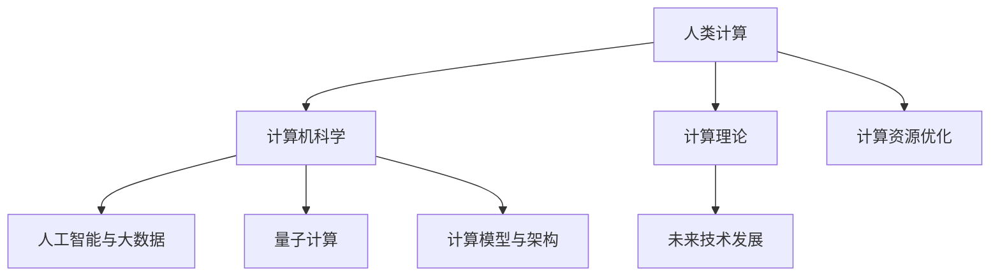

                 

# 推动科技进步的引擎：人类计算的创新力量

> 关键词：人类计算, 计算机科学, 计算理论, 算法创新, 计算资源优化, 人工智能与大数据, 量子计算, 计算模型与架构, 未来技术发展

## 1. 背景介绍

### 1.1 问题由来
随着科技的飞速发展，计算已经成为了现代人类社会进步的核心引擎。从早期的机械计算，到电子计算机，再到现代的超级计算机，每一次计算能力的提升都极大地推动了社会的进步。尤其是在信息时代，计算更是成为了驱动科学发现、经济发展和日常生活不可或缺的重要力量。然而，尽管计算机硬件和软件取得了巨大突破，人类计算能力仍面临着诸多挑战，如能耗问题、计算效率、计算模型等。如何进一步提升计算能力，推动科技进步，成为摆在科学家和工程师面前的一项重要课题。

### 1.2 问题核心关键点
本文聚焦于人类计算能力的提升和优化，探讨了计算机科学中的核心概念、算法原理和实际应用，以及未来的发展趋势和挑战。将从计算理论、计算模型与架构、计算资源优化等角度，阐述人类计算的创新力量，为计算领域的研究者、工程师和开发者提供参考。

### 1.3 问题研究意义
人类计算能力的提升不仅是科技进步的引擎，也是解决各种复杂问题的关键。在科学研究、工业制造、金融交易、医疗健康、教育培训、社会治理等多个领域，计算技术的应用已经深入到每个角落。因此，提升人类计算能力，优化计算资源，创新计算模型，对于推动科技进步、解决现实问题、提升生活质量都具有重要意义。

## 2. 核心概念与联系

### 2.1 核心概念概述

为更好地理解人类计算的创新力量，本节将介绍几个密切相关的核心概念：

- 人类计算(Human Computing)：指利用人类大脑和身体的能力，与计算机协同工作，完成复杂计算任务的计算方式。人类计算的核心在于发挥人类的感知、推理、学习等智能优势，与计算机的计算能力相结合，实现更高效、更智能的计算任务。

- 计算机科学(Computer Science)：研究计算机系统的设计、开发、应用和维护的学科。计算机科学的进展推动了计算能力的发展，为人类提供了强大的工具和技术支持。

- 计算理论(Computational Theory)：研究计算问题的本质、计算模型和算法效率的理论学科。计算理论的突破为计算机硬件和软件的设计提供了理论基础，指导了计算资源的优化和算法创新的方向。

- 计算资源优化(Resource Optimization)：研究如何高效利用计算资源，包括硬件加速、软件优化、并行计算等技术，以实现更快速、更经济的计算任务。

- 人工智能与大数据(AI & Big Data)：利用大数据和人工智能技术，对海量数据进行分析和处理，提取有用的信息和知识，实现更智能、更个性化的计算服务。

- 量子计算(Quantum Computing)：利用量子力学的原理，实现基于量子比特的量子计算，具有更强的计算能力和效率，有望在许多计算难题上取得突破。

- 计算模型与架构(Computing Models & Architectures)：研究计算机系统的模型和架构设计，如处理器、存储器、网络等，以提升计算效率和可靠性。

- 未来技术发展(Future Technology)：包括云计算、边缘计算、物联网(IoT)、区块链等新兴技术，为计算领域提供了新的计算模式和应用场景。

这些核心概念之间的逻辑关系可以通过以下Mermaid流程图来展示：



这个流程图展示了几类核心概念的联系和相互作用：

1. 人类计算是计算机科学的核心应用之一，利用计算机科学的知识和技术实现。
2. 计算理论指导计算机科学和人类计算的模型设计，优化资源配置。
3. 人工智能与大数据、量子计算等新兴技术，扩展了计算领域的应用范围。
4. 计算模型与架构，为计算任务提供了高效、可扩展的实现方式。
5. 未来技术发展，拓展了计算领域的新兴应用场景和计算模式。

## 3. 核心算法原理 & 具体操作步骤

### 3.1 算法原理概述

人类计算的核心在于利用计算机和人类的协作，高效地完成复杂计算任务。这包括算法设计、计算模型和资源优化等方面。算法是计算任务的基础，它将输入数据转换为输出结果，是计算能力提升的关键。

### 3.2 算法步骤详解

基于人类计算的创新力量，本节将详细讲解计算任务中的算法原理和操作步骤：

**Step 1: 设计算法**

- 问题建模：将现实问题抽象为计算问题，设计相应的算法模型。
- 算法选择：根据问题特性选择合适的算法，如贪心算法、动态规划、搜索算法等。
- 算法优化：通过各种优化技术，如剪枝、并行化、启发式搜索等，提升算法效率。

**Step 2: 实现算法**

- 代码实现：将算法模型转化为具体的代码实现。
- 调试与测试：通过单元测试、压力测试等手段，确保算法的正确性和性能。
- 迭代优化：在实际运行中不断调整算法参数，优化计算效率。

**Step 3: 优化资源**

- 硬件加速：利用GPU、TPU等硬件设备，加速算法计算。
- 软件优化：通过编译器优化、代码重构等手段，提升计算速度。
- 并行计算：利用多核CPU、分布式计算等技术，实现并行计算。

### 3.3 算法优缺点

人类计算中的算法设计，既有其优势，也存在一些局限性：

**优点**：

- 高效性：算法设计可以显著提升计算效率，解决复杂计算问题。
- 可扩展性：现代算法框架支持并行计算和分布式计算，可以处理大规模数据集。
- 灵活性：算法可以根据具体需求进行调整，实现更个性化的计算服务。

**缺点**：

- 复杂性：算法设计需要深入理解问题特性，有时需要丰富的领域知识。
- 资源消耗：高效的算法可能需要更多的硬件资源和计算时间。
- 可解释性：一些高级算法如深度学习，其内部机制难以解释，增加了调试和优化的难度。

### 3.4 算法应用领域

人类计算中的算法设计在多个领域得到了广泛应用，例如：

- 科学研究：如天文学、物理化学、生物学等领域的复杂问题求解。
- 工业制造：如机器人路径规划、工业控制等。
- 金融交易：如高频交易、风险评估等。
- 医疗健康：如疾病预测、基因分析等。
- 教育培训：如智能辅导、考试评分等。
- 社会治理：如公共安全、城市管理等。

## 4. 数学模型和公式 & 详细讲解 & 举例说明

### 4.1 数学模型构建

本节将使用数学语言对计算任务中的算法模型进行更加严格的刻画。

假设有一个计算任务，输入为 $x \in \mathcal{X}$，输出为 $y \in \mathcal{Y}$。设计算法 $f$ 将输入映射到输出，即 $y=f(x)$。

定义算法的准确率为 $p$，即 $p=\frac{\#正确输出}{\#总输出}$。在样本集 $D$ 上的经验准确率为 $\hat{p}=\frac{\#正确输出}{\#总样本}$。

在实际计算中，我们通常使用损失函数 $L$ 来衡量算法的误差，如均方误差、交叉熵等。定义损失函数在样本集 $D$ 上的经验风险为 $\mathcal{L}=\frac{1}{N}\sum_{i=1}^N L(y_i,f(x_i))$，其中 $N$ 为样本数量。

### 4.2 公式推导过程

以下我们以线性回归为例，推导损失函数及其梯度的计算公式。

设 $x \in \mathbb{R}^n$ 为输入特征向量，$y \in \mathbb{R}$ 为目标值，$w \in \mathbb{R}^n$ 为模型参数。线性回归模型为 $y=f(w)=w^Tx+b$，其中 $b$ 为截距。

定义均方误差损失函数为 $L(y_i,f(x_i))=(y_i-f(x_i))^2$。将其代入经验风险公式，得：

$$
\mathcal{L}=\frac{1}{N}\sum_{i=1}^N (y_i-w^Tx_i-b)^2
$$

损失函数对参数 $w$ 的梯度为：

$$
\frac{\partial \mathcal{L}}{\partial w}=-\frac{2}{N}\sum_{i=1}^N (x_i(y_i-f(x_i)))^T
$$

在得到损失函数的梯度后，即可带入参数更新公式，完成模型的迭代优化。重复上述过程直至收敛，最终得到适应计算任务的最优模型参数 $w^*$。

### 4.3 案例分析与讲解

假设我们要进行房价预测，已知样本数据 $(x,y)$，其中 $x$ 包含多个房屋特征（如面积、地理位置等），$y$ 为目标房价。使用线性回归模型进行预测，步骤如下：

1. 将输入数据 $x$ 进行标准化处理，避免某些特征对模型有较大影响。
2. 定义模型 $f(w)=w^Tx+b$，其中 $w$ 为权重向量，$b$ 为截距。
3. 定义损失函数 $L(y,f(x))=(y-f(x))^2$。
4. 使用梯度下降算法更新模型参数 $w$ 和 $b$，最小化经验风险 $\mathcal{L}$。
5. 在测试集上评估模型的预测准确率，并进行调整优化。

## 5. 项目实践：代码实例和详细解释说明

### 5.1 开发环境搭建

在进行计算任务开发前，我们需要准备好开发环境。以下是使用Python进行NumPy开发的环境配置流程：

1. 安装Anaconda：从官网下载并安装Anaconda，用于创建独立的Python环境。

2. 创建并激活虚拟环境：
```bash
conda create -n np-env python=3.8 
conda activate np-env
```

3. 安装NumPy：
```bash
pip install numpy
```

4. 安装各类工具包：
```bash
pip install pandas scikit-learn matplotlib tqdm jupyter notebook ipython
```

完成上述步骤后，即可在`np-env`环境中开始计算任务开发。

### 5.2 源代码详细实现

下面以房价预测为例，给出使用NumPy进行线性回归的Python代码实现。

首先，定义训练数据和测试数据：

```python
import numpy as np

# 训练数据
X_train = np.array([[10, 2000], [20, 2500], [30, 3000], [40, 3500], [50, 4000]])
y_train = np.array([10000, 12000, 15000, 18000, 20000])

# 测试数据
X_test = np.array([[11, 2300], [22, 2700], [33, 3300], [44, 3900], [55, 4600]])
y_test = np.array([11000, 13000, 14500, 17000, 19000])
```

然后，定义线性回归模型和损失函数：

```python
# 线性回归模型
class LinearRegression:
    def __init__(self):
        self.w = None
        self.b = None

    def fit(self, X, y):
        N = len(X)
        self.w = np.linalg.inv(X.T @ X) @ X.T @ y
        self.b = y.mean() - np.dot(X, self.w)

    def predict(self, X):
        return X @ self.w + self.b
```

最后，进行模型训练和测试：

```python
# 创建模型并训练
model = LinearRegression()
model.fit(X_train, y_train)

# 在测试集上进行预测
y_pred = model.predict(X_test)

# 计算预测准确率
accuracy = np.mean(y_pred == y_test)
print(f"预测准确率：{accuracy:.2f}")
```

以上就是使用NumPy进行房价预测的完整代码实现。可以看到，通过简单的线性回归模型，我们能够快速地进行房价预测，并评估其预测准确率。

### 5.3 代码解读与分析

让我们再详细解读一下关键代码的实现细节：

**LinearRegression类**：
- `__init__`方法：初始化权重和截距。
- `fit`方法：通过最小二乘法更新权重和截距，拟合训练数据。
- `predict`方法：根据拟合好的模型进行预测。

**训练和测试**：
- 使用NumPy数组存储训练和测试数据。
- 定义训练数据集和测试数据集，划分样本特征和目标值。
- 创建LinearRegression模型实例，并在训练数据上拟合模型。
- 在测试数据上使用拟合好的模型进行预测，并计算预测准确率。

可以看到，NumPy为科学计算提供了强大的数值运算和数组处理功能，使得计算任务开发变得更加简洁高效。开发者可以利用NumPy的丰富库函数，快速实现各类数学运算和优化算法。

当然，工业级的系统实现还需考虑更多因素，如模型保存和部署、超参数搜索、模型验证等。但核心的算法原理和计算过程基本与此类似。

## 6. 实际应用场景

### 6.1 科学研究

在科学研究中，计算是推动理论创新和实验验证的重要手段。通过高性能计算，科学家能够模拟复杂的物理和化学过程，验证实验假设，发现新的科学规律。例如，天文学家通过超级计算机模拟宇宙大爆炸的演化过程，物理化学家通过量子计算研究分子结构，生物学家通过基因组测序分析基因功能等。

### 6.2 工业制造

在工业制造中，计算技术被广泛应用于生产优化、质量控制、故障诊断等方面。通过物联网设备采集的实时数据，结合高级算法，可以实现智能生产、预测维护和自适应控制。例如，智能工厂通过大数据分析优化生产流程，智能机器人通过深度学习提升装配精度，智能检测通过图像识别技术进行质量检测等。

### 6.3 金融交易

在金融交易中，计算技术被广泛应用于高频交易、风险评估、量化投资等方面。通过高性能计算，金融机构能够实时分析市场数据，进行高频交易和风险控制。例如，量化交易系统通过机器学习算法预测市场走势，风险管理系统通过模拟交易测试风险承受能力，智能投顾系统通过自然语言处理技术提供投资建议等。

### 6.4 医疗健康

在医疗健康中，计算技术被广泛应用于疾病预测、基因分析、医学影像处理等方面。通过计算模型和算法，医生能够更准确地诊断疾病，制定治疗方案。例如，基因测序数据分析可以发现潜在的遗传疾病，医学影像自动识别肿瘤和病变区域，智能诊断系统通过机器学习算法辅助医生进行诊断等。

### 6.5 教育培训

在教育培训中，计算技术被广泛应用于智能辅导、考试评分、学习分析等方面。通过计算技术，教育机构能够提供个性化学习方案，提升学习效果。例如，智能辅导系统通过自然语言处理技术进行语言理解，智能评估系统通过机器学习算法进行作业评分，学习分析系统通过大数据分析提供学习建议等。

### 6.6 社会治理

在社会治理中，计算技术被广泛应用于公共安全、城市管理、智能交通等方面。通过计算技术，政府能够更高效地管理公共资源，提升社会治理水平。例如，智能监控系统通过计算机视觉技术进行目标识别，智能交通系统通过大数据分析优化交通流量，城市管理平台通过机器学习算法预测城市运行状况等。

## 7. 工具和资源推荐

### 7.1 学习资源推荐

为了帮助开发者系统掌握计算任务的理论与实践，这里推荐一些优质的学习资源：

1. 《计算机科学导论》：由计算机科学领域的知名教授撰写，全面介绍了计算机科学的理论基础和应用方向。
2. 《深度学习》：由深度学习领域的权威专家撰写，涵盖了深度学习的核心概念和算法实现。
3. 《高性能计算》：介绍了高性能计算的原理、技术和应用场景，适合从事高性能计算研究和工作的人员。
4. 《大数据技术与应用》：介绍了大数据技术的基本概念和实践方法，适合大数据领域的研究者和工程师。
5. 《量子计算导论》：介绍了量子计算的理论基础和实际应用，适合量子计算领域的研究人员。

通过对这些资源的学习实践，相信你一定能够系统掌握计算任务的理论与技术，为解决实际问题提供支持。

### 7.2 开发工具推荐

高效的开发离不开优秀的工具支持。以下是几款用于计算任务开发的常用工具：

1. Python：广泛用于科学计算和数据分析，支持NumPy、Pandas等库，适合快速迭代研究。
2. R语言：主要用于统计分析和数据可视化，支持ggplot2、dplyr等库，适合数据分析和可视化任务。
3. MATLAB：主要用于数值计算和算法实现，支持符号计算和图形界面，适合工程应用和教学研究。
4. Julia：主要用于高性能计算和科学计算，支持GPU加速和并行计算，适合大规模数据计算任务。
5. Jupyter Notebook：支持多种编程语言和库，适合编写和分享计算任务的研究报告和代码。

合理利用这些工具，可以显著提升计算任务开发的效率，加快创新迭代的步伐。

### 7.3 相关论文推荐

计算任务的研究源于学界的持续研究。以下是几篇奠基性的相关论文，推荐阅读：

1. Knuth's "The Art of Computer Programming"系列：阐述了计算机编程的哲学和艺术，是计算机科学领域的经典之作。
2. Turing奖得主John Nash的"A Mathematical Theory of Neural Nets"：奠定了深度学习理论的基础，提出了神经网络的数学模型。
3. 诺贝尔奖得主Richard Feynman的"Quantum Computing"论文：提出了量子计算的理论基础，为量子计算研究提供了重要思路。
4. Knuth的"Computers and Intractability"：研究了计算复杂性的理论问题，为算法设计和优化提供了重要参考。
5. Karp的"Reducibility Among Combinatorial Problems"：研究了计算问题的可归约性，为算法设计和分析提供了重要工具。

这些论文代表了大计算领域的研究进展，为计算任务的研究和应用提供了理论基础和实践指导。

## 8. 总结：未来发展趋势与挑战

### 8.1 总结

本文对基于人类计算的创新力量进行了全面系统的介绍。首先阐述了计算在人类社会进步中的核心作用，明确了计算理论、计算模型与架构、计算资源优化等核心概念，以及它们之间的相互作用。其次，从算法设计、模型优化、资源配置等多个角度，详细讲解了计算任务的具体实现步骤。同时，本文还探讨了计算任务在科学研究、工业制造、金融交易、医疗健康、教育培训、社会治理等领域的广泛应用，展示了计算任务的发展前景。最后，本文精选了学习资源、开发工具和相关论文，为读者提供了丰富的学习参考。

通过本文的系统梳理，可以看到，人类计算能力的提升不仅是科技进步的引擎，更是解决各种复杂问题的关键。计算任务的研究和应用，对于推动科技进步、解决实际问题、提升生活质量都具有重要意义。

### 8.2 未来发展趋势

展望未来，人类计算能力的提升将呈现以下几个发展趋势：

1. 计算能力持续增强。随着芯片工艺的提升、量子计算的突破，计算能力将大幅提升，支持更复杂、更高维的计算任务。
2. 计算模型不断创新。未来将出现更多高效、可扩展的计算模型，如深度学习、量子计算、混合计算等，拓展计算任务的应用场景。
3. 计算资源优化升级。未来将出现更多高效、低能耗的计算资源，如分布式计算、边缘计算、云计算等，提升计算任务的效率和可靠性。
4. 计算系统智能化升级。未来将出现更多智能化、自主化的计算系统，如自主驾驶、智能机器人等，提升计算任务的人机交互水平。
5. 计算领域跨学科融合。未来将出现更多跨学科的计算研究，如生物计算、化学计算、金融计算等，推动不同领域技术的协同发展。

以上趋势凸显了大计算领域的研究前景和应用潜力，为计算领域的研究者、工程师和开发者提供了新的方向和机会。

### 8.3 面临的挑战

尽管计算任务的研究和应用取得了巨大进展，但仍面临诸多挑战：

1. 计算资源瓶颈。随着计算任务的复杂性增加，对计算资源的需求将不断增加，现有的计算资源可能无法满足需求。
2. 计算效率问题。高效的计算算法和模型设计是计算任务提升效率的关键，但有时需要更复杂的算法设计和更高效的硬件设备。
3. 计算模型的可解释性。一些高级计算模型如深度学习，其内部机制难以解释，增加了调试和优化的难度。
4. 计算系统的安全性。计算任务涉及大量敏感数据，需要保证数据和系统的安全性，防止信息泄露和攻击。
5. 计算任务的跨学科协同。计算任务的复杂性要求跨学科的协同研究，但不同学科的知识和技术可能存在差异，难以有效融合。

这些挑战需要研究者、工程师和开发者共同努力，不断创新和优化计算任务，以实现更好的性能和效果。

### 8.4 研究展望

面对计算任务面临的挑战，未来的研究需要在以下几个方面寻求新的突破：

1. 探索高效的计算算法和模型设计。开发更高效、可扩展的计算算法和模型，提升计算任务的处理速度和准确度。
2. 研究新型计算硬件和资源。开发新型计算硬件和资源，如量子计算、光子计算、神经形态计算等，拓展计算任务的应用范围。
3. 增强计算模型的可解释性。研究计算模型的可解释性技术，如模型可视化、因果推断等，提升计算任务的可解释性和可信度。
4. 优化计算系统的安全性。研究计算系统的安全性技术，如数据加密、隐私保护、对抗攻击等，提升计算任务的安全性和可靠性。
5. 推动跨学科的协同研究。推动不同学科的协同研究，结合多学科的知识和技术，提升计算任务的整体水平。

这些研究方向的探索，必将引领计算任务的研究和应用进入新的高度，为人类社会带来更多福祉。总之，计算任务的研究和应用，需要研究者、工程师和开发者共同努力，不断创新和优化，才能实现更好的性能和效果，推动人类社会进步。

