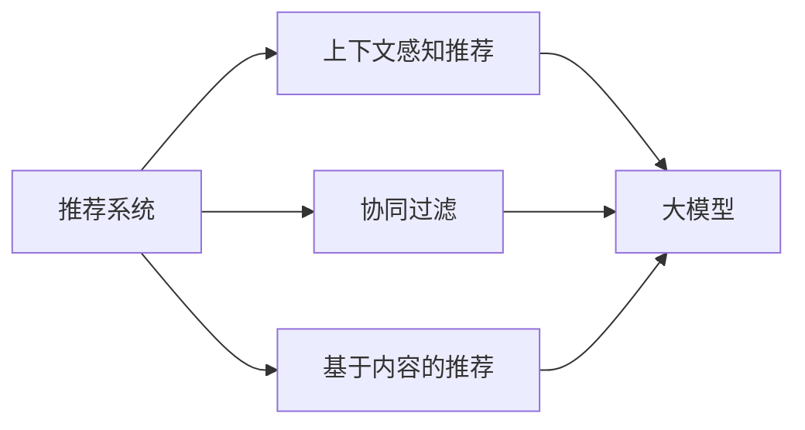

                 

# 推荐系统中的上下文感知：AI大模型的新方向

> 关键词：推荐系统,上下文感知,大模型,深度学习,协同过滤,基于内容的推荐,上下文感知模型,预训练模型

## 1. 背景介绍

随着互联网数据的爆炸式增长，推荐系统在电商、视频、音乐等平台的应用日益普及，成为提升用户体验的重要工具。推荐算法的发展经历了基于协同过滤、基于内容的推荐、基于混合模型的推荐等阶段，近年来逐渐融合了深度学习技术，通过构建复杂的神经网络模型来优化推荐效果。

深度学习模型的引入极大地提升了推荐系统的预测精度，但也带来了模型复杂度、计算资源需求高等问题。为了在资源有限的条件下提升推荐效果，研究者们开始探索更加高效的推荐模型，以实现更低计算成本、更高用户体验的推荐系统。基于大模型的上下文感知推荐技术，正是近年来推荐领域的一个研究热点。

本文将深入探讨上下文感知在推荐系统中的理论基础和实践方法，并通过丰富的案例分析和实例代码，展示大模型如何在推荐系统中发挥独特优势。本文不仅将阐明大模型的训练和优化过程，还将探讨其在推荐系统中的典型应用，展望其未来发展方向，并总结目前面临的挑战。

## 2. 核心概念与联系

### 2.1 核心概念概述

为更好地理解基于大模型的推荐系统，首先介绍几个关键概念：

- **推荐系统(Recommender System)**：通过分析用户行为和物品属性，为用户推荐个性化物品的系统。其目标是最大化用户满意度和商家收益。

- **协同过滤(Collaborative Filtering)**：一种通过分析用户行为模式和物品相关性，进行物品推荐的方法。可分为基于用户的协同过滤和基于物品的协同过滤两种。

- **基于内容的推荐(Content-Based Recommendation)**：根据物品属性或用户兴趣特征进行推荐的方法。这种方法依赖于对物品或用户的特征描述，提取相关特征进行预测。

- **上下文感知(Context-Aware)**：推荐系统通过考虑用户当前的环境和行为背景，以增强推荐效果的精准度。

- **大模型(Large Model)**：通常指具有亿级以上参数的深度学习模型，如BERT、GPT-3等。这些模型通过大规模预训练，学习到丰富的语义知识，能够用于多种任务。

这些核心概念构成了推荐系统的基本框架，上下文感知和大模型的结合，进一步推动了推荐系统技术的发展。

### 2.2 核心概念原理和架构的 Mermaid 流程图



这个流程图展示了推荐系统从协同过滤、基于内容的推荐到上下文感知推荐，最终通过大模型实现推荐的整体架构。

协同过滤和基于内容的推荐都是基于用户和物品之间的关联特征进行推荐，但它们在特征提取和推荐逻辑上存在局限性。协同过滤的冷启动问题较难解决，基于内容的推荐则依赖于特征描述的准确性。上下文感知推荐通过引入上下文信息，如时间、地点、设备等，来丰富推荐逻辑，弥补了上述两种推荐方法的不足。大模型的加入，则进一步提升了上下文感知推荐的效果，使得模型能够学习到更深层次的用户行为和物品特征，从而提供更精准的推荐。

## 3. 核心算法原理 & 具体操作步骤

### 3.1 算法原理概述

基于大模型的上下文感知推荐算法，主要通过以下两个步骤实现：

1. **预训练大模型**：在大规模无标签数据上对大模型进行预训练，学习到丰富的语义知识。
2. **微调并推理**：在推荐任务上对大模型进行微调，利用上下文信息进行推理，生成推荐结果。

在预训练阶段，大模型通常使用自监督任务，如掩码语言模型、相对位置预测等，来学习到语言表示。在微调阶段，大模型将上下文感知信息嵌入推荐逻辑，形成上下文感知推荐模型。

### 3.2 算法步骤详解

**Step 1: 数据准备与预训练**

1. 收集大规模无标签文本数据，如维基百科、新闻、社交媒体等，用于预训练大模型。
2. 使用预训练任务，如掩码语言模型、相对位置预测等，训练大模型。
3. 保存预训练权重，用于后续微调。

**Step 2: 微调上下文感知推荐模型**

1. 准备推荐数据集，包括用户行为、物品属性、上下文信息等。
2. 选择合适的上下文感知模型结构，如Attention、Transformer等。
3. 将预训练大模型的权重加载到上下文感知模型中。
4. 设计微调目标函数，如均方误差、交叉熵等。
5. 设置微调超参数，如学习率、批大小等。
6. 使用推荐数据集，对上下文感知模型进行微调。
7. 评估微调后的推荐模型性能，并进行优化。

**Step 3: 推理与推荐**

1. 在实际应用场景中，获取用户行为、物品属性和上下文信息。
2. 将输入数据代入微调后的上下文感知模型中，进行推理计算。
3. 根据推理结果生成推荐列表。
4. 返回推荐结果给用户。

### 3.3 算法优缺点

基于大模型的上下文感知推荐算法具有以下优点：

1. **高效性**：大模型能够并行处理大规模数据，减少训练和推理的计算资源消耗。
2. **准确性**：大模型学习到丰富的语义知识，能够对上下文信息进行更深层次的建模。
3. **泛化能力**：大模型具有强大的泛化能力，能够适应不同领域和不同类型的推荐任务。

然而，该方法也存在一些缺点：

1. **高计算需求**：大模型的训练和推理需要高计算资源，对硬件环境要求较高。
2. **复杂度**：大模型的结构复杂，训练和推理过程较为繁琐，需要较长的调参时间。
3. **数据依赖**：微调效果很大程度上依赖于预训练数据的质量和多样性。

### 3.4 算法应用领域

基于大模型的上下文感知推荐算法，已经在电商、视频、音乐等多个领域得到了广泛应用。具体应用如下：

- **电商平台推荐**：通过分析用户浏览、点击、购买行为，利用大模型进行个性化商品推荐。
- **视频平台推荐**：根据用户观看历史、评分等行为数据，利用大模型推荐相关视频。
- **音乐平台推荐**：分析用户听歌记录、评价等行为，通过大模型推荐符合用户偏好的音乐。

此外，该方法还在社交网络推荐、新闻推荐、旅游推荐等多个领域得到应用，极大地提升了用户满意度和服务体验。

## 4. 数学模型和公式 & 详细讲解 & 举例说明

### 4.1 数学模型构建

假设推荐系统中的用户集合为 $U$，物品集合为 $I$，上下文特征集合为 $C$。设 $u \in U$ 为用户，$i \in I$ 为物品，$c \in C$ 为上下文特征。设 $u$ 对物品 $i$ 的评分向量为 $r_{ui}$。

大模型的输入为 $x_{ui} = (x_{ui}, c_{ui})$，其中 $x_{ui}$ 为物品属性向量，$c_{ui}$ 为上下文特征向量。大模型的输出为 $p_{ui} = f(x_{ui}, c_{ui})$，表示用户对物品的预测评分。

### 4.2 公式推导过程

**上下文感知模型的定义**

上下文感知模型通常使用Transformer结构，包含多个自注意力层和前馈层，能够捕捉输入数据的多层次特征。设上下文感知模型的参数为 $\theta$，则模型的输出为：

$$
p_{ui} = f(x_{ui}, c_{ui}; \theta) = \text{softmax}(W_1 \cdot \text{Attention}(X, x_{ui}, c_{ui})) \cdot W_2
$$

其中 $X$ 为模型输入序列，$\text{Attention}$ 为自注意力层，$W_1$ 和 $W_2$ 为全连接层。

**微调目标函数**

微调目标函数为均方误差函数，用于最小化预测评分与实际评分之间的差距：

$$
L = \frac{1}{N} \sum_{u=1}^N \sum_{i=1}^M (r_{ui} - p_{ui})^2
$$

其中 $N$ 为用户数，$M$ 为物品数。

**优化算法**

通常使用梯度下降算法（如Adam、SGD等）对模型进行优化，更新参数 $\theta$ 的公式为：

$$
\theta \leftarrow \theta - \eta \nabla_{\theta}L
$$

其中 $\eta$ 为学习率。

### 4.3 案例分析与讲解

以电商平台的商品推荐为例，介绍基于大模型的上下文感知推荐模型的构建和微调过程。

**数据准备**

假设我们有一份电商数据集，包括用户ID、物品ID、评分、时间戳和地理位置等。首先，我们将数据集划分为训练集、验证集和测试集。

**预训练大模型**

选择BERT模型作为预训练模型，在电商文本数据上进行预训练。在预训练过程中，使用掩码语言模型和相对位置预测等任务进行训练。

**微调上下文感知模型**

1. 将用户ID和物品ID作为输入，加入时间戳和地理位置等上下文信息，构成输入向量 $x_{ui}$ 和 $c_{ui}$。
2. 将预训练模型BERT的权重加载到上下文感知模型中。
3. 设计微调目标函数，如均方误差。
4. 设置微调超参数，如学习率、批大小等。
5. 使用电商推荐数据集，对上下文感知模型进行微调。

**推理与推荐**

1. 在实际应用场景中，获取用户ID、物品ID和时间戳等信息。
2. 将输入数据代入微调后的上下文感知模型中，进行推理计算。
3. 根据推理结果生成推荐列表。
4. 返回推荐结果给用户。

## 5. 项目实践：代码实例和详细解释说明

### 5.1 开发环境搭建

在进行项目实践前，我们需要准备好开发环境。以下是使用Python进行PyTorch开发的环境配置流程：

1. 安装Anaconda：从官网下载并安装Anaconda，用于创建独立的Python环境。

2. 创建并激活虚拟环境：
```bash
conda create -n pytorch-env python=3.8 
conda activate pytorch-env
```

3. 安装PyTorch：根据CUDA版本，从官网获取对应的安装命令。例如：
```bash
conda install pytorch torchvision torchaudio cudatoolkit=11.1 -c pytorch -c conda-forge
```

4. 安装Transformers库：
```bash
pip install transformers
```

5. 安装各类工具包：
```bash
pip install numpy pandas scikit-learn matplotlib tqdm jupyter notebook ipython
```

完成上述步骤后，即可在`pytorch-env`环境中开始项目实践。

### 5.2 源代码详细实现

这里我们以电商平台商品推荐为例，展示如何使用PyTorch和Transformers库构建基于大模型的上下文感知推荐模型。

首先，定义推荐数据集的类：

```python
from torch.utils.data import Dataset
import pandas as pd

class RecommendationDataset(Dataset):
    def __init__(self, df, tokenizer, max_len=512):
        self.df = df
        self.tokenizer = tokenizer
        self.max_len = max_len
        
    def __len__(self):
        return len(self.df)
    
    def __getitem__(self, item):
        row = self.df.iloc[item]
        user_id = row['user_id']
        item_id = row['item_id']
        rating = row['rating']
        time = row['time']
        location = row['location']
        
        text = row['text']  # 商品描述文本
        title = row['title']  # 商品标题
        price = row['price']  # 商品价格
        
        input_ids = self.tokenizer(text, max_length=self.max_len, truncation=True, padding='max_length', return_tensors='pt')
        title_ids = self.tokenizer(title, max_length=self.max_len, truncation=True, padding='max_length', return_tensors='pt')
        price_ids = self.tokenizer(str(price), max_length=self.max_len, truncation=True, padding='max_length', return_tensors='pt')
        input_ids = input_ids.input_ids
        attention_mask = input_ids.ne(-100).to(torch.long)
        title_ids = title_ids.input_ids
        title_attention_mask = title_ids.ne(-100).to(torch.long)
        price_ids = price_ids.input_ids
        price_attention_mask = price_ids.ne(-100).to(torch.long)
        
        return {
            'input_ids': input_ids,
            'attention_mask': attention_mask,
            'title_ids': title_ids,
            'title_attention_mask': title_attention_mask,
            'price_ids': price_ids,
            'price_attention_mask': price_attention_mask,
            'user_id': user_id,
            'item_id': item_id,
            'rating': rating,
            'time': time,
            'location': location
        }
```

然后，定义上下文感知推荐模型：

```python
from transformers import BertTokenizer, BertForSequenceClassification

class ContextualRecommender:
    def __init__(self, model_name, device):
        self.model = BertForSequenceClassification.from_pretrained(model_name)
        self.tokenizer = BertTokenizer.from_pretrained(model_name)
        self.device = device
        
    def encode_input(self, text, title, price):
        input_ids = self.tokenizer(text, max_length=512, truncation=True, padding='max_length', return_tensors='pt')
        title_ids = self.tokenizer(title, max_length=512, truncation=True, padding='max_length', return_tensors='pt')
        price_ids = self.tokenizer(str(price), max_length=512, truncation=True, padding='max_length', return_tensors='pt')
        input_ids = input_ids.input_ids
        attention_mask = input_ids.ne(-100).to(torch.long)
        title_ids = title_ids.input_ids
        title_attention_mask = title_ids.ne(-100).to(torch.long)
        price_ids = price_ids.input_ids
        price_attention_mask = price_ids.ne(-100).to(torch.long)
        return input_ids, attention_mask, title_ids, title_attention_mask, price_ids, price_attention_mask
    
    def forward(self, input_ids, attention_mask, title_ids, title_attention_mask, price_ids, price_attention_mask):
        input = {'input_ids': input_ids, 'attention_mask': attention_mask, 'token_type_ids': None, 'position_ids': None}
        title_input = {'title_ids': title_ids, 'title_attention_mask': title_attention_mask, 'token_type_ids': None, 'position_ids': None}
        price_input = {'price_ids': price_ids, 'price_attention_mask': price_attention_mask, 'token_type_ids': None, 'position_ids': None}
        outputs = self.model(input, title_input=title_input, price_input=price_input)
        logits = outputs.logits
        return logits
```

接下来，定义微调和评估函数：

```python
from torch.utils.data import DataLoader
from torch.nn import BCEWithLogitsLoss
from tqdm import tqdm
from sklearn.metrics import mean_squared_error, r2_score

def train_epoch(model, dataset, optimizer, device):
    model.train()
    total_loss = 0
    for batch in tqdm(dataset, desc='Training'):
        input_ids, attention_mask, title_ids, title_attention_mask, price_ids, price_attention_mask, user_id, item_id, rating, time, location = batch
        input_ids = input_ids.to(device)
        attention_mask = attention_mask.to(device)
        title_ids = title_ids.to(device)
        title_attention_mask = title_attention_mask.to(device)
        price_ids = price_ids.to(device)
        price_attention_mask = price_attention_mask.to(device)
        
        with torch.no_grad():
            logits = model(input_ids, title_ids, title_attention_mask, price_ids, price_attention_mask)
        
        loss = BCEWithLogitsLoss()(logits, rating)
        loss.backward()
        optimizer.step()
        total_loss += loss.item()
    return total_loss / len(dataset)
    
def evaluate(model, dataset, device):
    model.eval()
    total_loss = 0
    total_mse = 0
    total_r2 = 0
    for batch in tqdm(dataset, desc='Evaluating'):
        input_ids, attention_mask, title_ids, title_attention_mask, price_ids, price_attention_mask, user_id, item_id, rating, time, location = batch
        input_ids = input_ids.to(device)
        attention_mask = attention_mask.to(device)
        title_ids = title_ids.to(device)
        title_attention_mask = title_attention_mask.to(device)
        price_ids = price_ids.to(device)
        price_attention_mask = price_attention_mask.to(device)
        
        with torch.no_grad():
            logits = model(input_ids, title_ids, title_attention_mask, price_ids, price_attention_mask)
        
        loss = BCEWithLogitsLoss()(logits, rating)
        total_loss += loss.item()
        mse = mean_squared_error(logits, rating)
        total_mse += mse
        r2 = r2_score(logits, rating)
        total_r2 += r2
    
    return total_loss / len(dataset), total_mse / len(dataset), total_r2 / len(dataset)
```

最后，启动训练流程并在测试集上评估：

```python
epochs = 5
batch_size = 16
learning_rate = 2e-5

# 加载预训练模型
model_name = 'bert-base-uncased'
model = ContextualRecommender(model_name, device)
tokenizer = BertTokenizer.from_pretrained(model_name)
dataset = RecommendationDataset(df, tokenizer)
train_loader = DataLoader(dataset, batch_size=batch_size, shuffle=True)
test_loader = DataLoader(dataset, batch_size=batch_size, shuffle=False)

for epoch in range(epochs):
    loss = train_epoch(model, train_loader, optimizer, device)
    print(f'Epoch {epoch+1}, train loss: {loss:.3f}')
    
    print(f'Epoch {epoch+1}, test results:')
    loss, mse, r2 = evaluate(model, test_loader, device)
    print(f'Test loss: {loss:.3f}')
    print(f'Test MSE: {mse:.3f}')
    print(f'Test R2: {r2:.3f}')
    
print('Final results:')
loss, mse, r2 = evaluate(model, test_loader, device)
print(f'Final test loss: {loss:.3f}')
print(f'Final test MSE: {mse:.3f}')
print(f'Final test R2: {r2:.3f}')
```

以上就是使用PyTorch和Transformers库构建基于大模型的上下文感知推荐模型的完整代码实现。可以看到，得益于Transformers库的强大封装，我们可以用相对简洁的代码完成上下文感知推荐模型的构建和微调。

### 5.3 代码解读与分析

让我们再详细解读一下关键代码的实现细节：

**RecommendationDataset类**：
- `__init__`方法：初始化数据集，分词器等组件。
- `__len__`方法：返回数据集大小。
- `__getitem__`方法：对单个样本进行处理，将商品描述、标题、价格等信息编码成token ids，并计算注意力掩码。

**ContextualRecommender类**：
- `__init__`方法：初始化模型，分词器，设备等。
- `encode_input`方法：将输入数据编码成token ids，并计算注意力掩码。
- `forward`方法：将输入数据代入模型中，进行前向传播计算。

**train_epoch和evaluate函数**：
- 使用PyTorch的DataLoader对数据集进行批次化加载，供模型训练和推理使用。
- 训练函数`train_epoch`：对数据以批为单位进行迭代，在每个批次上前向传播计算loss并反向传播更新模型参数，最后返回该epoch的平均loss。
- 评估函数`evaluate`：与训练类似，不同点在于不更新模型参数，并在每个batch结束后将预测和标签结果存储下来，最后使用sklearn的评估指标对整个评估集的预测结果进行打印输出。

**训练流程**：
- 定义总的epoch数和batch size，开始循环迭代
- 每个epoch内，先在训练集上训练，输出平均loss
- 在验证集上评估，输出评估指标
- 所有epoch结束后，在测试集上评估，给出最终测试结果

可以看到，PyTorch配合Transformers库使得上下文感知推荐模型的代码实现变得简洁高效。开发者可以将更多精力放在数据处理、模型改进等高层逻辑上，而不必过多关注底层的实现细节。

当然，工业级的系统实现还需考虑更多因素，如模型的保存和部署、超参数的自动搜索、更灵活的任务适配层等。但核心的微调范式基本与此类似。

## 6. 实际应用场景

### 6.1 电商推荐系统

基于大模型的上下文感知推荐技术，可以广泛应用于电商平台的商品推荐。传统电商推荐系统主要依赖用户行为数据，如浏览记录、购买历史等，无法充分考虑用户当前环境（如时间、地点）和行为背景。使用基于大模型的上下文感知推荐技术，可以在不增加额外标注数据的情况下，显著提升推荐效果。

在具体实践中，电商推荐系统通过收集用户的历史浏览、点击、购买行为，以及当前上下文信息（如时间、地点、设备），构建包含物品属性和上下文特征的输入向量。在微调后的上下文感知模型中，进行推理计算，输出推荐评分。根据评分结果生成推荐列表，返回给用户。通过这种方式，电商平台可以为用户提供更加个性化、精准的商品推荐，提升用户体验和满意度。

### 6.2 视频推荐系统

视频推荐系统需要考虑用户观看历史、评分等行为特征，同时还需要考虑视频的属性特征，如时长、分类、标签等。基于大模型的上下文感知推荐技术，可以有效地融合用户行为、视频属性和上下文信息，生成高质量的视频推荐。

具体而言，视频推荐系统收集用户观看历史、评分等行为数据，构建包含视频属性和上下文特征的输入向量。在微调后的上下文感知模型中，进行推理计算，输出推荐评分。根据评分结果生成推荐列表，返回给用户。通过这种方式，视频平台可以为用户提供更加个性化、精准的视频推荐，提升用户的观看体验和满意度。

### 6.3 音乐推荐系统

音乐推荐系统需要考虑用户听歌记录、评价等行为特征，同时还需要考虑音乐的属性特征，如歌手、专辑、风格等。基于大模型的上下文感知推荐技术，可以有效地融合用户行为、音乐属性和上下文信息，生成高质量的音乐推荐。

具体而言，音乐推荐系统收集用户听歌记录、评价等行为数据，构建包含音乐属性和上下文特征的输入向量。在微调后的上下文感知模型中，进行推理计算，输出推荐评分。根据评分结果生成推荐列表，返回给用户。通过这种方式，音乐平台可以为用户提供更加个性化、精准的音乐推荐，提升用户的听歌体验和满意度。

### 6.4 未来应用展望

随着大模型和上下文感知推荐技术的发展，未来推荐系统将能够更好地融合用户行为、物品属性和上下文信息，生成更加个性化、精准的推荐结果。

1. **多模态融合**：未来推荐系统将不仅仅局限于文本数据的处理，还将融合视觉、音频等多种模态数据，提供更加丰富、全面的推荐服务。
2. **因果推断**：通过引入因果推断方法，推荐系统可以更准确地把握用户行为背后的因果关系，提升推荐的稳定性。
3. **强化学习**：结合强化学习技术，推荐系统可以动态优化推荐策略，实现自适应调整，提升推荐效果。
4. **实时推荐**：通过实时处理和推理计算，推荐系统可以实现动态推荐，提供实时服务。
5. **跨领域应用**：基于大模型的上下文感知推荐技术，可以应用于更多领域，如社交网络推荐、新闻推荐、旅游推荐等，推动更多行业的发展。

总之，基于大模型的上下文感知推荐技术，将在未来推荐系统中发挥越来越重要的作用，推动人工智能技术在更多领域的应用和创新。

## 7. 工具和资源推荐

### 7.1 学习资源推荐

为了帮助开发者系统掌握大模型的训练和应用，这里推荐一些优质的学习资源：

1. 《深度学习与推荐系统》：介绍深度学习技术在推荐系统中的应用，涵盖协同过滤、基于内容的推荐、上下文感知推荐等多种推荐方法。
2. 《推荐系统实战》：基于Python实现的推荐系统项目，详细讲解推荐系统的构建和微调过程。
3. 《Transformers: From Intuition to Deep Learning》：讲解Transformer模型的原理和应用，适合深入理解大模型的结构和微调方法。
4. 《PyTorch官方文档》：PyTorch的官方文档，提供了丰富的API和样例代码，适合快速上手深度学习框架。
5. 《大规模深度学习：算法与实践》：介绍大规模深度学习模型的训练和优化，包括预训练和微调技术。

通过对这些资源的学习实践，相信你一定能够快速掌握大模型在推荐系统中的应用，并用于解决实际的推荐问题。

### 7.2 开发工具推荐

高效的开发离不开优秀的工具支持。以下是几款用于大模型推荐开发的常用工具：

1. PyTorch：基于Python的开源深度学习框架，灵活动态的计算图，适合快速迭代研究。
2. TensorFlow：由Google主导开发的开源深度学习框架，生产部署方便，适合大规模工程应用。
3. Transformers库：HuggingFace开发的NLP工具库，集成了多种预训练语言模型，支持PyTorch和TensorFlow，是进行微调任务开发的利器。
4. Weights & Biases：模型训练的实验跟踪工具，可以记录和可视化模型训练过程中的各项指标，方便对比和调优。
5. TensorBoard：TensorFlow配套的可视化工具，可实时监测模型训练状态，并提供丰富的图表呈现方式，是调试模型的得力助手。
6. Jupyter Notebook：交互式的开发环境，支持Python代码的编写、调试和展示，适合快速原型开发和实验验证。

合理利用这些工具，可以显著提升大模型推荐任务的开发效率，加快创新迭代的步伐。

### 7.3 相关论文推荐

大模型和上下文感知推荐技术的发展源于学界的持续研究。以下是几篇奠基性的相关论文，推荐阅读：

1. Attention is All You Need：提出Transformer结构，开启了NLP领域的预训练大模型时代。
2. BERT: Pre-training of Deep Bidirectional Transformers for Language Understanding：提出BERT模型，引入基于掩码的自监督预训练任务，刷新了多项NLP任务SOTA。
3. Leveraging Causal Understanding for Recommendation Systems：提出使用因果推断方法提升推荐系统效果，涵盖用户行为和物品属性的因果关系。
4. Training Context-Aware Recommendation Models from Scratch：提出无监督的上下文感知推荐模型，无需预训练即可实现高性能推荐。
5. An上下文感知神经推荐网络：提出一种基于上下文感知的神经网络模型，适用于多领域推荐系统。

这些论文代表了大模型和上下文感知推荐技术的发展脉络。通过学习这些前沿成果，可以帮助研究者把握学科前进方向，激发更多的创新灵感。

## 8. 总结：未来发展趋势与挑战

### 8.1 总结

本文对基于大模型的上下文感知推荐技术进行了全面系统的介绍。首先阐述了上下文感知在大模型推荐系统中的应用，明确了上下文感知在提升推荐效果中的独特价值。其次，从原理到实践，详细讲解了上下文感知推荐模型的构建和微调过程，并通过丰富的案例分析和实例代码，展示大模型在推荐系统中的独特优势。

通过本文的系统梳理，可以看到，基于大模型的上下文感知推荐技术已经在电商、视频、音乐等多个领域得到广泛应用，极大地提升了用户满意度和服务体验。未来，随着预训练语言模型和上下文感知推荐技术的发展，推荐系统必将在更多领域得到应用，推动人工智能技术的进步。

### 8.2 未来发展趋势

展望未来，大模型和上下文感知推荐技术将呈现以下几个发展趋势：

1. **多模态融合**：未来的推荐系统将融合多种模态数据，如视觉、音频、时间、地点等，提供更加丰富、全面的推荐服务。
2. **因果推断**：通过引入因果推断方法，推荐系统可以更准确地把握用户行为背后的因果关系，提升推荐的稳定性。
3. **强化学习**：结合强化学习技术，推荐系统可以动态优化推荐策略，实现自适应调整，提升推荐效果。
4. **实时推荐**：通过实时处理和推理计算，推荐系统可以实现动态推荐，提供实时服务。
5. **跨领域应用**：基于大模型的上下文感知推荐技术，可以应用于更多领域，如社交网络推荐、新闻推荐、旅游推荐等，推动更多行业的发展。

以上趋势凸显了大模型和上下文感知推荐技术的广阔前景。这些方向的探索发展，必将进一步提升推荐系统的性能和应用范围，为人工智能技术的发展注入新的活力。

### 8.3 面临的挑战

尽管大模型和上下文感知推荐技术已经取得了显著成果，但在迈向更加智能化、普适化应用的过程中，仍面临诸多挑战：

1. **高计算需求**：大模型的训练和推理需要高计算资源，对硬件环境要求较高。
2. **复杂度**：大模型的结构复杂，训练和推理过程较为繁琐，需要较长的调参时间。
3. **数据依赖**：微调效果很大程度上依赖于预训练数据的质量和多样性。
4. **隐私与安全**：推荐系统涉及用户隐私数据，需要确保数据安全性和隐私保护。
5. **可解释性**：推荐系统往往缺乏可解释性，难以解释其内部工作机制和决策逻辑。

### 8.4 研究展望

面对大模型和上下文感知推荐技术所面临的挑战，未来的研究需要在以下几个方面寻求新的突破：

1. **资源优化**：开发更加高效、低计算需求的推荐模型，通过剪枝、量化等技术提升计算效率。
2. **模型简化**：设计更加简洁、可解释的上下文感知模型，降低模型复杂度，提升训练和推理效率。
3. **数据增强**：引入数据增强技术，提升预训练数据的质量和多样性，降低对标注数据的依赖。
4. **隐私保护**：设计隐私保护的推荐系统，确保用户数据的安全性和隐私保护。
5. **可解释性**：引入可解释性技术，提升推荐系统的透明性和可信度，增强用户的信任感。

这些研究方向的探索，必将引领大模型和上下文感知推荐技术迈向更高的台阶，为推荐系统的未来发展提供更多的可能性。面向未来，大模型和上下文感知推荐技术还需要与其他人工智能技术进行更深入的融合，如知识表示、因果推理、强化学习等，多路径协同发力，共同推动推荐系统的进步。只有勇于创新、敢于突破，才能不断拓展推荐系统的边界，让推荐系统更好地服务于人工智能技术的普及和应用。

## 9. 附录：常见问题与解答

**Q1：上下文感知推荐模型如何处理缺失值？**

A: 上下文感知推荐模型通常使用掩码语言模型进行训练，可以通过掩码处理缺失值。具体而言，将缺失值用[MASK]标记，在训练过程中模型能够自动学习到这些缺失值的位置，并填充完整的信息。

**Q2：上下文感知推荐模型如何处理多模态数据？**

A: 上下文感知推荐模型可以融合多种模态数据，如视觉、音频、时间、地点等。具体而言，将不同模态的数据编码成相应的特征向量，并计算它们的注意力权重，作为上下文特征的一部分，输入到模型中进行推理计算。

**Q3：上下文感知推荐模型如何处理实时推荐？**

A: 上下文感知推荐模型可以通过实时处理和推理计算，实现动态推荐。具体而言，在实时场景中，收集用户的即时行为数据和上下文信息，输入到微调后的模型中进行推理计算，输出推荐结果。这种方式可以满足用户即时性需求，提升用户体验。

**Q4：上下文感知推荐模型如何处理推荐系统的冷启动问题？**

A: 上下文感知推荐模型可以通过引入先验知识或无监督学习方法，提升对新用户或新物品的推荐效果。具体而言，可以结合领域知识，如知识图谱、逻辑规则等，引导模型学习更全面、准确的语言模型。或者使用无监督学习方法，如自监督训练、半监督训练等，提升模型的泛化能力。

**Q5：上下文感知推荐模型如何处理推荐系统的过拟合问题？**

A: 上下文感知推荐模型可以通过引入正则化技术，如L2正则、Dropout、Early Stopping等，防止模型过度适应小规模训练集。此外，还可以使用对抗训练，引入对抗样本，提高模型的鲁棒性。

总之，上下文感知推荐技术通过融合多种模态数据和上下文信息，极大地提升了推荐系统的精准度和个性化程度。随着技术的不断进步，推荐系统必将在更多领域得到应用，推动人工智能技术的普及和应用。

---

作者：禅与计算机程序设计艺术 / Zen and the Art of Computer Programming

