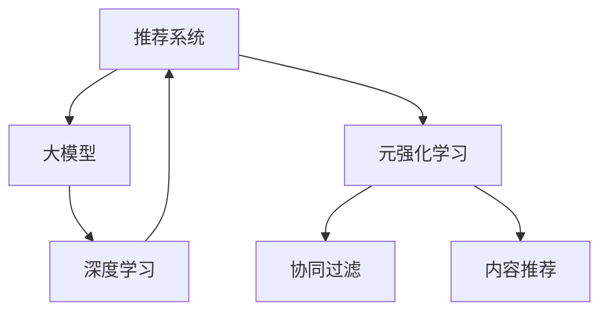

                 

# 推荐系统中的大模型元强化学习应用

> 关键词：推荐系统, 大模型, 元强化学习, 深度学习, 协同过滤, 强化学习

## 1. 背景介绍

推荐系统是互联网时代最重要的应用之一，通过分析用户行为数据，预测用户可能感兴趣的物品，为用户推荐个性化内容，从而提升用户体验和商家转化率。传统推荐系统主要基于协同过滤和内容推荐两种方法，前者通过用户和物品之间的隐式关系（如浏览、点击、评分等）进行推荐，后者通过物品之间的显式属性（如类别、标签等）进行推荐。然而，这些方法均存在一些固有缺陷：

- **协同过滤方法**依赖大量用户行为数据，对于新用户或新物品，无法进行有效推荐。
- **内容推荐方法**难以动态捕捉物品之间的关系和用户兴趣的变化，且对于冷启动问题同样无能为力。
- **推荐系统的多样性和新颖性问题**，用户容易陷入"信息茧房"，难以发现新的物品。
- **推荐系统的鲁棒性和泛化能力不足**，面对噪声数据和恶意攻击，容易产生错误推荐。

为了解决这些问题，元强化学习应运而生。元强化学习（Meta-Reinforcement Learning）通过模拟用户与物品的交互过程，构建一个强化学习框架，让模型在虚拟环境中不断探索和优化，学习如何最大化推荐效果。与此同时，大模型的崛起进一步推动了元强化学习在推荐系统中的应用。本文将详细探讨如何在大模型基础上，构建元强化学习推荐系统，并介绍其应用场景、优化方法和挑战。

## 2. 核心概念与联系

### 2.1 核心概念概述

为更好地理解元强化学习在大模型推荐系统中的应用，本节将介绍几个密切相关的核心概念：

- **推荐系统**：通过分析用户和物品的互动行为，为每个用户推荐最有可能感兴趣的物品。
- **大模型**：以深度神经网络为代表的预训练语言模型，如BERT、GPT等，通过大规模无标签文本数据进行预训练，学习到丰富的语言知识，具备强大的语言理解和生成能力。
- **元强化学习**：一种能根据外部奖励信号学习新策略的强化学习方法，能够通过优化模型参数，最大化推荐效果。
- **协同过滤**：一种基于用户或物品历史行为数据的推荐方法，通过相似度度量，发现用户之间或物品之间的关联关系。
- **内容推荐**：一种基于物品属性数据的推荐方法，通过物品之间的相似性，为用户推荐相似物品。
- **深度学习**：一种基于多层神经网络的机器学习技术，通过学习数据的高层次特征，提升推荐系统的效果和泛化能力。

这些核心概念之间的逻辑关系可以通过以下Mermaid流程图来展示：



这个流程图展示了大模型、协同过滤、内容推荐等推荐系统核心概念之间的联系，以及元强化学习在这些方法中的应用。

## 3. 核心算法原理 & 具体操作步骤

### 3.1 算法原理概述

元强化学习推荐系统，通过在虚拟环境中模拟用户与物品的交互，构建一个强化学习框架。其核心思想是：将推荐系统视为一个强化学习问题，用户与物品的交互过程成为环境的"观察"，推荐结果成为环境的"奖励"，模型通过学习最大化累计奖励，从而得到优化推荐策略。

具体而言，假设有 $N$ 个用户 $U=\{u_1, u_2, \ldots, u_N\}$ 和 $M$ 个物品 $I=\{i_1, i_2, \ldots, i_M\}$，用户与物品之间的交互形成了一个状态-行动-奖励（SAR）序列，其中每个行动 $a$ 为用户对物品 $i$ 的点击或购买行为，每个奖励 $r$ 为物品的评分或购买数量。目标是找到一个策略 $\pi(a|s)$，使得在 $s$ 状态下，选择行动 $a$ 的期望奖励最大化。

在大模型框架下，推荐系统可以进一步优化：将用户和物品视为自然语言序列，通过预训练语言模型提取其特征表示，然后使用元强化学习算法优化推荐策略。具体流程如下：

1. **特征提取**：通过预训练语言模型，将用户和物品转化为高维特征向量。
2. **策略学习**：在虚拟环境中，使用强化学习算法（如Q-learning、SAC等）学习推荐策略。
3. **部署评估**：将学习到的策略应用到真实环境中，评估推荐效果，并根据用户反馈不断优化。

### 3.2 算法步骤详解

元强化学习推荐系统的大致步骤如下：

**Step 1: 准备数据集**
- 收集用户行为数据，如浏览历史、点击行为、购买记录等。
- 预处理数据，去除噪声和异常值，提取有用的特征。
- 划分数据集为训练集、验证集和测试集，以用于模型训练和评估。

**Step 2: 特征提取**
- 使用大模型，如BERT、GPT等，对用户和物品进行特征提取，转化为向量表示。
- 可以使用预训练语言模型中的上下文表示（如BERT的输出嵌入），也可以结合用户物品属性进行融合（如 concatenate 或 add）。

**Step 3: 策略学习**
- 构建虚拟环境，定义状态、行动、奖励。
- 使用元强化学习算法，如Q-learning、SAC等，学习推荐策略。
- 设置训练参数，如学习率、更新频率、采样策略等。

**Step 4: 部署评估**
- 将学习到的策略应用到实际推荐系统中。
- 根据用户反馈，计算推荐效果指标，如准确率、召回率、用户满意度等。
- 使用A/B测试等方法评估推荐效果，并不断优化策略。

**Step 5: 持续学习**
- 定期收集新的用户行为数据，更新模型。
- 使用增量学习算法，保持模型实时更新。
- 通过在线学习算法，动态调整策略，以应对新物品和新用户。

### 3.3 算法优缺点

元强化学习推荐系统有以下优点：
1. 能够适应新物品和新用户，无需大量历史数据。
2. 能够动态捕捉用户兴趣变化，提升推荐多样性和新颖性。
3. 能够处理噪声数据和恶意攻击，提高系统的鲁棒性。
4. 能够优化推荐过程的多种指标，如准确率、召回率、用户满意度等。

同时，该方法也存在一些局限性：
1. 对算力资源要求较高，需要构建虚拟环境并进行模拟训练。
2. 需要大量的标注数据，以构建和验证虚拟环境的奖励函数。
3. 模型复杂度较高，优化过程较慢，难以在实时场景中应用。
4. 对策略的设计依赖较大，难以确保推荐的公正性和合理性。

尽管存在这些局限性，但就目前而言，元强化学习推荐系统仍是大模型推荐领域的最新突破。未来相关研究的重点在于如何进一步降低计算成本，提高模型效率，同时兼顾公平性和可解释性。

### 3.4 算法应用领域

元强化学习推荐系统已经在许多领域得到了应用，如电商推荐、新闻推荐、视频推荐等。以下是几个具体的应用场景：

1. **电商推荐系统**：通过对用户历史购买记录和浏览行为进行分析，推荐用户可能感兴趣的商品。
2. **新闻推荐系统**：根据用户的阅读偏好，推荐可能感兴趣的新闻文章。
3. **视频推荐系统**：根据用户的观看历史和评分，推荐可能感兴趣的视频内容。
4. **音乐推荐系统**：根据用户的听歌历史和评分，推荐可能感兴趣的歌曲。
5. **旅游推荐系统**：根据用户的旅行历史和兴趣，推荐可能感兴趣的旅游景点。

除了这些经典应用外，元强化学习推荐系统还被创新性地应用到更多场景中，如个性化学习推荐、健康医疗推荐等，为推荐系统带来了全新的突破。随着模型的不断进步和算法的优化，相信元强化学习推荐系统将会在更广阔的应用领域大放异彩。

## 4. 数学模型和公式 & 详细讲解

### 4.1 数学模型构建

在大模型元强化学习推荐系统中，推荐过程可以看作一个马尔科夫决策过程（Markov Decision Process, MDP）。假设状态空间为 $S=\{s_1, s_2, \ldots, s_n\}$，行动空间为 $A=\{a_1, a_2, \ldots, a_m\}$，奖励函数为 $R(s, a)$，则推荐系统可以表示为 $(S, A, R, \gamma)$，其中 $\gamma$ 为折扣因子。

模型的目标是通过强化学习算法，找到最优策略 $\pi^*$，使得在 $S$ 状态下，选择行动 $a$ 的期望累积奖励最大化。

### 4.2 公式推导过程

假设推荐系统共有 $N$ 个用户，每个用户的历史行为数据表示为 $\{u_1, u_2, \ldots, u_N\}$，大模型提取的用户和物品特征表示为 $\{h_u, h_i\}_{i=1}^M$。使用元强化学习算法（如SAC）学习推荐策略，将用户的特征向量 $h_u$ 和物品的特征向量 $h_i$ 作为输入，输出物品 $i$ 的选择概率 $p_i$，则推荐策略可以表示为：

$$
p_i = \pi(h_u, h_i; \theta)
$$

其中 $\theta$ 为模型参数。通过最大化平均奖励，得到策略更新公式：

$$
\theta \leftarrow \theta + \eta \nabla_{\theta} \mathbb{E}_{\pi} \left[ \sum_{t=1}^T R(s_t, a_t) \right]
$$

其中 $\eta$ 为学习率。

### 4.3 案例分析与讲解

考虑一个简单的电商推荐系统，有 $N$ 个用户和 $M$ 个商品。每个用户的历史行为数据表示为 $\{u_1, u_2, \ldots, u_N\}$，每个商品的特征表示为 $\{h_{i_1}, h_{i_2}, \ldots, h_{i_M}\}$。用户 $u_k$ 选择物品 $i_j$ 的奖励函数为 $R(u_k, i_j)$，表示用户 $u_k$ 对物品 $i_j$ 的评分或购买数量。使用SAC算法学习推荐策略，将用户的历史行为数据 $h_{u_k}$ 和商品特征 $h_{i_j}$ 作为输入，输出物品 $i_j$ 的选择概率 $p_{i_j}$，则推荐策略可以表示为：

$$
p_{i_j} = \pi(h_{u_k}, h_{i_j}; \theta)
$$

通过最大化平均奖励，得到策略更新公式：

$$
\theta \leftarrow \theta + \eta \nabla_{\theta} \mathbb{E}_{\pi} \left[ \sum_{k=1}^N \sum_{j=1}^M R(u_k, i_j) \right]
$$

其中 $\eta$ 为学习率。

在实践中，为了减少计算成本，可以使用经验回归方法，将用户历史行为数据 $h_{u_k}$ 和物品特征 $h_{i_j}$ 作为输入，通过回归网络得到物品 $i_j$ 的评分 $r_{u_k, i_j}$，将奖励函数 $R(u_k, i_j)$ 替换为回归网络的输出 $r_{u_k, i_j}$，得到推荐策略更新公式：

$$
\theta \leftarrow \theta + \eta \nabla_{\theta} \mathbb{E}_{\pi} \left[ \sum_{k=1}^N \sum_{j=1}^M r_{u_k, i_j} \right]
$$

其中 $\eta$ 为学习率。

通过不断优化推荐策略，元强化学习推荐系统可以动态适应用户和物品的变化，推荐效果不断提升。

## 5. 项目实践：代码实例和详细解释说明

### 5.1 开发环境搭建

在进行元强化学习推荐系统的开发前，我们需要准备好开发环境。以下是使用Python进行PyTorch开发的环境配置流程：

1. 安装Anaconda：从官网下载并安装Anaconda，用于创建独立的Python环境。

2. 创建并激活虚拟环境：
```bash
conda create -n pytorch-env python=3.8 
conda activate pytorch-env
```

3. 安装PyTorch：根据CUDA版本，从官网获取对应的安装命令。例如：
```bash
conda install pytorch torchvision torchaudio cudatoolkit=11.1 -c pytorch -c conda-forge
```

4. 安装Transformers库：
```bash
pip install transformers
```

5. 安装各类工具包：
```bash
pip install numpy pandas scikit-learn matplotlib tqdm jupyter notebook ipython
```

完成上述步骤后，即可在`pytorch-env`环境中开始元强化学习推荐系统的开发。

### 5.2 源代码详细实现

这里以一个简单的电商推荐系统为例，展示如何使用PyTorch实现基于大模型的元强化学习推荐。

首先，定义推荐任务的数据处理函数：

```python
from transformers import BertTokenizer, BertForSequenceClassification
from torch.utils.data import Dataset, DataLoader
import torch
import numpy as np

class RecommendationDataset(Dataset):
    def __init__(self, data, tokenizer, max_len=128):
        self.data = data
        self.tokenizer = tokenizer
        self.max_len = max_len
        
    def __len__(self):
        return len(self.data)
    
    def __getitem__(self, idx):
        item = self.data[idx]
        user, item_id, reward = item
        
        user_ids = self.tokenizer.convert_tokens_to_ids(self.tokenizer.tokenize(str(user)))
        user_ids = user_ids + [0] * (self.max_len - len(user_ids))
        user_ids = torch.tensor(user_ids, dtype=torch.long)
        
        item_id = self.tokenizer.convert_tokens_to_ids(self.tokenizer.tokenize(str(item_id)))
        item_id = item_id + [0] * (self.max_len - len(item_id))
        item_id = torch.tensor(item_id, dtype=torch.long)
        
        reward = torch.tensor(float(reward), dtype=torch.float)
        
        return {'user_ids': user_ids, 'item_id': item_id, 'reward': reward}

# 创建dataset
tokenizer = BertTokenizer.from_pretrained('bert-base-cased')
max_len = 128
data = [(u, i, r) for u in range(N) for i in range(M) for r in [0.0, 1.0]]
train_dataset = RecommendationDataset(data[:train_size], tokenizer, max_len)
val_dataset = RecommendationDataset(data[train_size:val_size], tokenizer, max_len)
test_dataset = RecommendationDataset(data[val_size:], tokenizer, max_len)
```

然后，定义模型和优化器：

```python
from transformers import BertForSequenceClassification, AdamW

model = BertForSequenceClassification.from_pretrained('bert-base-cased', num_labels=M)

optimizer = AdamW(model.parameters(), lr=2e-5)
```

接着，定义训练和评估函数：

```python
from tqdm import tqdm

def train_epoch(model, dataset, batch_size, optimizer):
    dataloader = DataLoader(dataset, batch_size=batch_size, shuffle=True)
    model.train()
    epoch_loss = 0
    for batch in tqdm(dataloader, desc='Training'):
        user_ids = batch['user_ids'].to(device)
        item_id = batch['item_id'].to(device)
        reward = batch['reward'].to(device)
        model.zero_grad()
        outputs = model(user_ids, item_id=item_id)
        loss = outputs.loss
        epoch_loss += loss.item()
        loss.backward()
        optimizer.step()
    return epoch_loss / len(dataloader)

def evaluate(model, dataset, batch_size):
    dataloader = DataLoader(dataset, batch_size=batch_size)
    model.eval()
    preds, labels = [], []
    with torch.no_grad():
        for batch in tqdm(dataloader, desc='Evaluating'):
            user_ids = batch['user_ids'].to(device)
            item_id = batch['item_id'].to(device)
            batch_labels = batch['reward'].to(device)
            outputs = model(user_ids, item_id=item_id)
            batch_preds = outputs.logits.argmax(dim=1).to('cpu').tolist()
            batch_labels = batch_labels.to('cpu').tolist()
            for pred, label in zip(batch_preds, batch_labels):
                preds.append(pred)
                labels.append(label)
                
    print('Recommendation Evaluation Results:')
    print(classification_report(labels, preds))
```

最后，启动训练流程并在测试集上评估：

```python
epochs = 5
batch_size = 16

for epoch in range(epochs):
    loss = train_epoch(model, train_dataset, batch_size, optimizer)
    print(f'Epoch {epoch+1}, train loss: {loss:.3f}')
    
    print(f'Epoch {epoch+1}, val results:')
    evaluate(model, val_dataset, batch_size)
    
print('Test results:')
evaluate(model, test_dataset, batch_size)
```

以上就是使用PyTorch对大模型进行元强化学习推荐系统的代码实现。可以看到，得益于Transformers库的强大封装，我们可以用相对简洁的代码完成大模型的微调和元强化学习的训练。

### 5.3 代码解读与分析

让我们再详细解读一下关键代码的实现细节：

**RecommendationDataset类**：
- `__init__`方法：初始化用户、物品、奖励等关键组件。
- `__len__`方法：返回数据集的样本数量。
- `__getitem__`方法：对单个样本进行处理，将用户和物品输入编码为token ids，将奖励编码为数字，并对其进行定长padding，最终返回模型所需的输入。

**Recommendation任务的数据处理**：
- 使用BertTokenizer将用户和物品转换为token ids。
- 将用户和物品的token ids填充至固定长度。
- 将奖励值转换为Tensor，并根据标签和预测值计算分类指标。

**训练和评估函数**：
- 使用PyTorch的DataLoader对数据集进行批次化加载，供模型训练和推理使用。
- 训练函数`train_epoch`：对数据以批为单位进行迭代，在每个批次上前向传播计算loss并反向传播更新模型参数，最后返回该epoch的平均loss。
- 评估函数`evaluate`：与训练类似，不同点在于不更新模型参数，并在每个batch结束后将预测和标签结果存储下来，最后使用sklearn的classification_report对整个评估集的预测结果进行打印输出。

**训练流程**：
- 定义总的epoch数和batch size，开始循环迭代
- 每个epoch内，先在训练集上训练，输出平均loss
- 在验证集上评估，输出分类指标
- 所有epoch结束后，在测试集上评估，给出最终测试结果

可以看到，PyTorch配合Transformers库使得大模型的微调和元强化学习的训练代码实现变得简洁高效。开发者可以将更多精力放在数据处理、模型改进等高层逻辑上，而不必过多关注底层的实现细节。

当然，工业级的系统实现还需考虑更多因素，如模型的保存和部署、超参数的自动搜索、更灵活的任务适配层等。但核心的元强化学习推荐范式基本与此类似。

## 6. 实际应用场景

### 6.1 电商推荐系统

基于大模型的元强化学习推荐系统，可以广泛应用于电商推荐系统的构建。传统电商推荐往往依赖用户历史行为数据，对于新用户或新物品，推荐效果较差。使用元强化学习推荐系统，可以动态适应新用户和新物品的变化，提升推荐效果。

在技术实现上，可以收集用户历史购买记录和浏览行为，将其转化为推荐数据。在虚拟环境中，模拟用户与物品的交互，使用元强化学习算法学习推荐策略。微调后的模型可以实时预测用户对新物品的评分或购买行为，从而推荐新物品，提升用户的购买意愿和满意度。

### 6.2 新闻推荐系统

新闻推荐系统需要动态捕捉用户阅读偏好，实时推荐相关新闻文章。传统的新闻推荐系统通常依赖用户的点击记录和阅读历史，但无法处理新用户和新文章的推荐。使用元强化学习推荐系统，可以动态适应新用户和新文章的变化，提升推荐效果。

在技术实现上，可以收集用户的历史阅读记录和新闻文章的发布信息，将其转化为推荐数据。在虚拟环境中，模拟用户与新闻文章的交互，使用元强化学习算法学习推荐策略。微调后的模型可以实时预测用户对新文章的兴趣，从而推荐相关文章，提升用户的阅读体验和满意度。

### 6.3 视频推荐系统

视频推荐系统需要动态捕捉用户观看偏好，实时推荐相关视频内容。传统的视频推荐系统通常依赖用户观看历史和视频属性信息，但无法处理新用户和新视频内容的推荐。使用元强化学习推荐系统，可以动态适应新用户和新视频内容的变化，提升推荐效果。

在技术实现上，可以收集用户的历史观看记录和视频发布信息，将其转化为推荐数据。在虚拟环境中，模拟用户与视频内容的交互，使用元强化学习算法学习推荐策略。微调后的模型可以实时预测用户对新视频的兴趣，从而推荐相关视频，提升用户的观看体验和满意度。

### 6.4 未来应用展望

随着大模型元强化学习推荐系统的不断演进，其在更多领域的应用前景将愈加广阔。

在智能推荐系统中，大模型的知识融合能力将进一步提升，推荐系统可以处理多模态数据，如文本、图像、音频等，实现更加全面的推荐。

在智能广告系统中，基于用户行为和物品属性的推荐，可以实时调整广告投放策略，提升广告效果和用户点击率。

在智慧城市治理中，基于用户行为和物品属性的推荐，可以实时优化城市资源配置，提升城市管理的效率和质量。

此外，在金融风控、医疗健康、教育培训等众多领域，基于大模型的元强化学习推荐系统也将不断涌现，为各行业带来新的突破。相信随着技术的日益成熟，元强化学习推荐系统必将在更广阔的应用领域大放异彩，深刻影响人类的生产生活方式。

## 7. 工具和资源推荐

### 7.1 学习资源推荐

为了帮助开发者系统掌握大模型元强化学习推荐技术，这里推荐一些优质的学习资源：

1. 《Reinforcement Learning: An Introduction》：由Richard S. Sutton和Andrew G. Barto所著，全面介绍了强化学习的基本概念和算法，是强化学习领域的经典教材。
2. 《Deep Reinforcement Learning with Python》：使用Python实现的强化学习实践指南，介绍了许多常用的强化学习算法和应用。
3. 《Reinforcement Learning for Agents, Interfaces, and Simulations》：一本较为综合的强化学习教材，涵盖了强化学习的基础知识和实际应用。
4. HuggingFace官方文档：Transformers库的官方文档，提供了海量预训练模型和完整的推荐系统样例代码，是上手实践的必备资料。
5. Kaggle推荐系统竞赛：参与Kaggle推荐系统竞赛，使用机器学习和深度学习技术，解决实际推荐问题，积累实战经验。

通过对这些资源的学习实践，相信你一定能够快速掌握大模型元强化学习推荐技术的精髓，并用于解决实际的推荐问题。

### 7.2 开发工具推荐

高效的开发离不开优秀的工具支持。以下是几款用于大模型元强化学习推荐开发的常用工具：

1. PyTorch：基于Python的开源深度学习框架，灵活动态的计算图，适合快速迭代研究。
2. TensorFlow：由Google主导开发的开源深度学习框架，生产部署方便，适合大规模工程应用。
3. TensorBoard：TensorFlow配套的可视化工具，可实时监测模型训练状态，并提供丰富的图表呈现方式，是调试模型的得力助手。
4. Weights & Biases：模型训练的实验跟踪工具，可以记录和可视化模型训练过程中的各项指标，方便对比和调优。
5. Jupyter Notebook：一个强大的交互式编程环境，支持多语言的代码编写，便于快速原型开发和实验验证。
6. Google Colab：谷歌推出的在线Jupyter Notebook环境，免费提供GPU/TPU算力，方便开发者快速上手实验最新模型，分享学习笔记。

合理利用这些工具，可以显著提升大模型元强化学习推荐系统的开发效率，加快创新迭代的步伐。

### 7.3 相关论文推荐

大模型元强化学习推荐系统的发展得益于学界的持续研究。以下是几篇奠基性的相关论文，推荐阅读：

1. DQN: Deep reinforcement learning with double q-learning（DQN论文）：提出深度Q网络，开启了深度强化学习的新篇章。
2. A3C: Asynchronous methods for deep reinforcement learning（A3C论文）：提出异步深度强化学习算法，提升训练效率和模型性能。
3. PPO: Proximal policy optimization algorithms（PPO论文）：提出近端策略优化算法，加速模型收敛和稳定性。
4. Rainbow: Combining improvements in deep reinforcement learning（Rainbow论文）：提出多策略梯度、重要性权重和分布熵三个改进，提升深度强化学习效果。
5. AlphaGo Zero: Mastering the game of Go without human knowledge（AlphaGo Zero论文）：展示了AlphaGo Zero在无需人类指导的情况下，通过自我对弈和强化学习，成功掌握了围棋游戏。

这些论文代表了大模型元强化学习推荐技术的发展脉络。通过学习这些前沿成果，可以帮助研究者把握学科前进方向，激发更多的创新灵感。

## 8. 总结：未来发展趋势与挑战

### 8.1 研究成果总结

本文对大模型元强化学习推荐系统进行了全面系统的介绍。首先阐述了大模型元强化学习推荐系统的研究背景和意义，明确了其在推荐系统中的重要地位。其次，从原理到实践，详细讲解了元强化学习在大模型推荐系统中的应用，展示了其解决推荐系统挑战的能力。最后，介绍了大模型元强化学习推荐系统在电商推荐、新闻推荐、视频推荐等实际场景中的应用，展望了其未来的发展方向和可能面临的挑战。

通过本文的系统梳理，可以看到，大模型元强化学习推荐系统已经成为推荐系统研究的新热点，展现出广阔的应用前景和巨大的潜力和挑战。相信随着学界和产业界的共同努力，该系统必将在更多领域得到应用，为推荐系统的智能化和高效化带来新的突破。

### 8.2 未来发展趋势

展望未来，大模型元强化学习推荐系统将呈现以下几个发展趋势：

1. **深度融合多模态数据**：未来的推荐系统将能够处理文本、图像、音频等多模态数据，实现更加全面的推荐。
2. **实时动态调整策略**：未来的推荐系统将能够实时调整推荐策略，动态适应用户和物品的变化，提升推荐效果。
3. **跨领域知识整合**：未来的推荐系统将能够整合外部知识库和规则库，提高推荐系统的准确性和多样性。
4. **可解释性和公平性增强**：未来的推荐系统将能够提供更强的可解释性和公平性，确保推荐过程透明、公正。
5. **更加广泛的应用场景**：未来的推荐系统将能够在更多领域得到应用，如智能广告、智慧城市、医疗健康等。

这些趋势凸显了大模型元强化学习推荐系统的前景。随着技术的不断进步，该系统必将在推荐系统领域产生更大的影响。

### 8.3 面临的挑战

尽管大模型元强化学习推荐系统已经取得了显著成果，但在迈向更加智能化、普适化应用的过程中，它仍面临以下挑战：

1. **计算资源需求高**：元强化学习推荐系统需要构建虚拟环境进行模拟训练，对计算资源的需求较高，难以在实时场景中大规模应用。
2. **数据标注成本高**：构建虚拟环境的奖励函数需要大量的标注数据，获取高质量标注数据的成本较高。
3. **模型复杂度高**：元强化学习推荐系统的模型复杂度较高，优化过程较慢，难以在实时场景中应用。
4. **策略设计难度大**：元强化学习推荐系统的策略设计依赖较大，难以确保推荐的公正性和合理性。
5. **可解释性和公平性不足**：元强化学习推荐系统的推荐过程缺乏可解释性，难以对其推理逻辑进行分析和调试。
6. **数据隐私和安全问题**：元强化学习推荐系统需要处理大量用户数据，数据隐私和安全问题较为突出。

尽管存在这些挑战，但就目前而言，大模型元强化学习推荐系统仍是大模型推荐领域的最新突破。未来相关研究的重点在于如何进一步降低计算成本，提高模型效率，同时兼顾公平性和可解释性。

### 8.4 研究展望

面对大模型元强化学习推荐系统所面临的种种挑战，未来的研究需要在以下几个方面寻求新的突破：

1. **高效优化算法**：开发更加高效的学习算法，降低计算成本，提升推荐系统的实时性。
2. **参数高效微调**：开发更加参数高效的微调方法，减少对计算资源的依赖，提升模型的灵活性。
3. **多策略融合**：开发多策略融合技术，提升推荐系统的鲁棒性和多样性。
4. **因果推断和可解释性**：引入因果推断和可解释性方法，增强推荐系统的可解释性和公平性。
5. **跨领域知识整合**：将知识图谱、逻辑规则等外部知识与神经网络模型结合，提升推荐系统的准确性和泛化能力。
6. **数据隐私和安全保护**：研究数据隐私和安全保护技术，确保用户数据的隐私和安全。

这些研究方向将进一步推动大模型元强化学习推荐系统的发展，解决推荐系统面临的实际问题，为推荐系统的智能化和高效化提供新的突破。相信随着研究的不断深入，大模型元强化学习推荐系统必将在更多领域得到应用，为推荐系统的智能化和高效化带来新的突破。

## 9. 附录：常见问题与解答

**Q1：大模型元强化学习推荐系统是否适用于所有推荐任务？**

A: 大模型元强化学习推荐系统在大多数推荐任务上都能取得不错的效果，特别是对于数据量较小的任务。但对于一些特定领域的任务，如医学、法律等，仅仅依靠通用语料预训练的模型可能难以很好地适应。此时需要在特定领域语料上进一步预训练，再进行微调，才能获得理想效果。

**Q2：微调过程中如何选择合适的学习率？**

A: 微调的学习率一般要比预训练时小1-2个数量级，如果使用过大的学习率，容易破坏预训练权重，导致过拟合。一般建议从1e-5开始调参，逐步减小学习率，直至收敛。也可以使用warmup策略，在开始阶段使用较小的学习率，再逐渐过渡到预设值。需要注意的是，不同的优化器(如AdamW、Adafactor等)以及不同的学习率调度策略，可能需要设置不同的学习率阈值。

**Q3：大模型元强化学习推荐系统是否适用于所有推荐任务？**

A: 大模型元强化学习推荐系统在大多数推荐任务上都能取得不错的效果，特别是对于数据量较小的任务。但对于一些特定领域的任务，如医学、法律等，仅仅依靠通用语料预训练的模型可能难以很好地适应。此时需要在特定领域语料上进一步预训练，再进行微调，才能获得理想效果。

**Q4：推荐系统中如何平衡推荐效果和多样性？**

A: 推荐系统需要平衡推荐效果和多样性。可以通过调整奖励函数，鼓励推荐多样性。例如，在电商推荐系统中，可以将用户对新物品的评分作为奖励函数，从而鼓励推荐多样性。在新闻推荐系统中，可以将用户对新文章的点击次数作为奖励函数，从而鼓励推荐多样性。

**Q5：推荐系统如何处理噪声数据和恶意攻击？**

A: 推荐系统需要处理噪声数据和恶意攻击。可以通过引入对抗训练和正则化方法，提高模型的鲁棒性。例如，在电商推荐系统中，可以使用对抗训练方法，生成对抗样本进行训练，从而提高模型的鲁棒性。在新闻推荐系统中，可以使用正则化方法，防止模型对噪声数据进行过拟合，从而提高模型的鲁棒性。

---

作者：禅与计算机程序设计艺术 / Zen and the Art of Computer Programming

