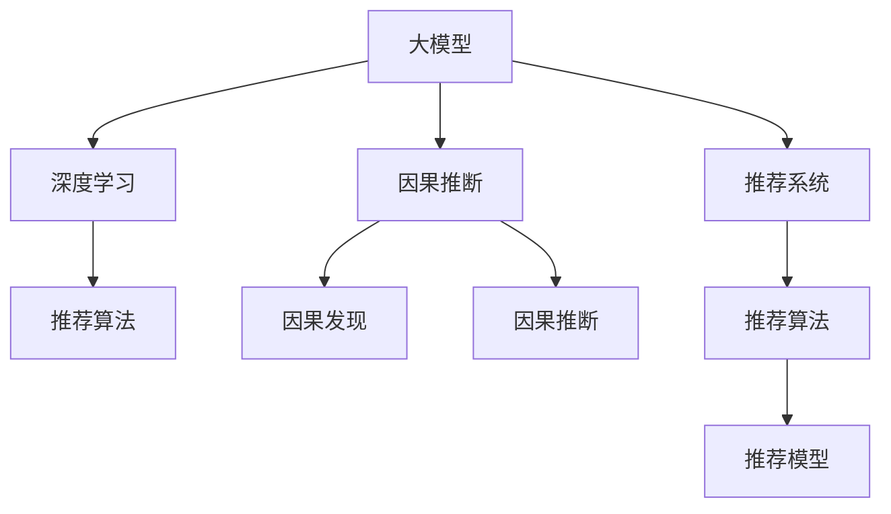

                 

# 推荐系统中的大模型因果发现与推断

> 关键词：大模型,因果推断,推荐系统,推荐算法,深度学习

## 1. 背景介绍

### 1.1 问题由来
随着互联网和数字经济的飞速发展，推荐系统已成为各大平台不可或缺的关键技术。传统推荐系统如协同过滤、基于内容的推荐等方法，在精准推荐方面已达瓶颈。当前，越来越多的研究聚焦于利用深度学习等先进技术，构建更加智能、高效的推荐系统。

其中，基于大模型的推荐系统通过学习用户行为与物品属性之间的关联，构建高维复杂的特征空间，能够进行更加精细化的用户兴趣挖掘和物品关联分析。然而，大模型推荐系统普遍存在冷启动问题，难以对新用户和新物品进行有效推荐。此外，用户和物品的交互历史有时是非因果的，如何从历史数据中挖掘因果关系，对提高推荐系统的预测准确性具有重要意义。

### 1.2 问题核心关键点
面向以上挑战，本文聚焦于利用大模型进行因果发现与推断，从而提升推荐系统的精准度和鲁棒性。基于因果推断的理论，探索使用深度学习模型挖掘和建模用户行为与物品属性之间的因果关系，并用于构建推荐算法。

本文将详细阐述大模型因果推断的核心概念、原理与实现步骤，并通过具体案例说明其应用效果。同时，我们将介绍与因果推断相关的工具和资源，帮助读者快速入门和应用。

## 2. 核心概念与联系

### 2.1 核心概念概述

为更好地理解基于大模型的因果推断方法，本节将介绍几个密切相关的核心概念：

- 大模型（Large Models）：指具有海量参数和强大计算能力，用于学习复杂关联任务的深度学习模型，如BERT、GPT等。
- 因果推断（Causal Inference）：指从观测数据中发现因果关系，用于预测和决策的理论和方法。
- 推荐系统（Recommender Systems）：指根据用户的历史行为和兴趣，推荐其可能感兴趣的商品或内容的技术系统。
- 推荐算法（Recommender Algorithms）：指构建推荐系统的具体算法，如协同过滤、内容推荐等。
- 深度学习（Deep Learning）：指使用多层神经网络进行特征提取和模式学习的机器学习方法。

这些核心概念之间的逻辑关系可以通过以下Mermaid流程图来展示：



这个流程图展示了大模型的核心概念及其之间的关系：

1. 大模型通过深度学习获取数据中的高维特征，学习复杂的因果关系。
2. 因果推断从观测数据中发现因果关系，用于构建推荐算法。
3. 推荐系统使用推荐算法，根据用户历史行为进行精准推荐。
4. 推荐算法在大模型学习的基础上，构建推荐模型。

这些概念共同构成了大模型因果推断的理论基础，用于构建高效、精准的推荐系统。

## 3. 核心算法原理 & 具体操作步骤
### 3.1 算法原理概述

基于大模型的因果推断，其核心思想是使用深度学习模型对用户行为与物品属性之间的因果关系进行建模，从而提高推荐系统的精准度和鲁棒性。具体而言，该方法通过以下几个关键步骤实现：

1. 数据准备：收集用户行为数据和物品属性数据，构建因果图。
2. 模型训练：使用大模型学习因果图结构，挖掘因果关系。
3. 因果推断：根据学习到的因果关系，对新样本进行推荐预测。
4. 模型评估：使用测试集评估推荐模型的性能，调整参数。

### 3.2 算法步骤详解

以下是大模型因果推断的具体实现步骤：

**Step 1: 数据准备**
- 收集用户行为数据 $X$，包括用户ID、行为ID、时间戳等。
- 收集物品属性数据 $Y$，包括物品ID、类别、价格等。
- 构建因果图，确定用户行为对物品属性的影响。

**Step 2: 模型训练**
- 选择深度学习模型，如BERT、GPT等，用于学习因果关系。
- 将用户行为数据和物品属性数据作为输入，训练模型。
- 设定损失函数，如交叉熵损失，优化模型参数。

**Step 3: 因果推断**
- 根据训练好的模型，对新用户和新物品进行推荐。
- 使用因果图推断用户行为对物品属性的影响。
- 对新用户和新物品进行推荐预测。

**Step 4: 模型评估**
- 收集测试集，对推荐模型的预测结果进行评估。
- 计算准确率、召回率、F1值等指标。
- 调整模型参数，提高推荐效果。

### 3.3 算法优缺点

基于大模型的因果推断方法具有以下优点：
1. 准确度高：通过学习因果关系，对推荐结果进行精确预测。
2. 鲁棒性好：在观测数据中发现因果关系，能够避免数据噪声的影响。
3. 模型可解释：深度学习模型可解释性强，易于理解和调试。
4. 适应性强：可以应对不同领域、不同规模的推荐系统需求。

同时，该方法也存在一定的局限性：
1. 数据需求大：需要大量的用户行为数据和物品属性数据。
2. 模型复杂度高：深度学习模型参数量大，计算资源消耗大。
3. 难以发现隐变量：因果推断模型难以发现潜在的隐变量，导致部分推荐结果偏差。
4. 因果关系复杂：用户行为与物品属性的因果关系复杂多变，建模难度大。

尽管存在这些局限性，但就目前而言，基于大模型的因果推断方法仍是大数据推荐系统的热门范式。未来相关研究的重点在于如何进一步降低数据需求，提高模型效率，以及更好地处理因果关系。

### 3.4 算法应用领域

基于大模型的因果推断方法在推荐系统领域已经得到了广泛的应用，涵盖了电商推荐、内容推荐、广告推荐等多个场景，具体如下：

1. 电商推荐：通过学习用户行为与商品属性之间的因果关系，对用户进行精准推荐，提升购物体验。
2. 内容推荐：分析用户对不同类型内容的历史行为，挖掘内容与用户兴趣之间的关联，推荐个性化内容。
3. 广告推荐：结合用户行为与广告属性，预测用户对广告的点击概率，提高广告投放效果。
4. 金融推荐：基于用户行为与金融产品属性，构建因果模型，推荐合适金融产品。
5. 医疗推荐：分析用户对不同医疗产品或服务的使用历史，预测其对新医疗产品的接受度，提升医疗推荐效果。

这些应用场景展示了大模型因果推断方法在推荐系统中的广泛价值，具有显著的推广潜力。

## 4. 数学模型和公式 & 详细讲解 & 举例说明
### 4.1 数学模型构建

本节将使用数学语言对基于大模型的因果推断过程进行更加严格的刻画。

记用户行为数据集为 $D=\{(x_i,y_i)\}_{i=1}^N$，其中 $x_i$ 为用户行为特征，$y_i$ 为物品属性标签。假设因果图 $G=(X,Y,E)$ 中，节点 $X$ 表示用户行为特征，节点 $Y$ 表示物品属性标签，边 $E$ 表示因果关系。

定义因果图模型 $P(Y|X;\theta)$，其中 $\theta$ 为模型参数。目标是通过最大化对数似然函数，学习模型参数：

$$
\hat{\theta}=\mathop{\arg\max}_{\theta} \sum_{i=1}^N \log P(y_i|x_i;\theta)
$$

其中 $P(y_i|x_i;\theta)$ 为条件概率密度函数，可由深度学习模型表示，如 BERT、GPT 等。

### 4.2 公式推导过程

以下我们以电商推荐系统为例，推导因果推断模型的预测公式。

记电商推荐任务的用户行为数据集为 $D=\{(x_i,y_i)\}_{i=1}^N$，其中 $x_i$ 为历史行为特征，$y_i$ 为商品ID，$z_i$ 为商品属性。假设因果图 $G=(X,Y,E)$ 中，节点 $X$ 表示用户历史行为，节点 $Y$ 表示商品ID，边 $E$ 表示因果关系。

定义电商推荐模型 $P(y|x;\theta)$，其中 $\theta$ 为模型参数。目标是通过最大化对数似然函数，学习模型参数：

$$
\hat{\theta}=\mathop{\arg\max}_{\theta} \sum_{i=1}^N \log P(y_i|x_i;\theta)
$$

对于电商推荐模型，通常使用 BERT、GPT 等深度学习模型进行建模，预测用户对不同商品ID的点击概率。假设模型 $M_{\theta}$ 表示电商推荐模型，$X$ 为输入用户历史行为，$Y$ 为输出商品ID，则模型预测公式为：

$$
y_i = \arg\max_{y \in Y} M_{\theta}(x_i)
$$

其中 $M_{\theta}(x_i)$ 表示模型对输入 $x_i$ 的预测结果。

### 4.3 案例分析与讲解

假设电商推荐系统具有以下因果图：

```
  X             X
 / \           / \
P  X --- E ---> Y --- Z
 / \         /   | \
D  B --- E ---> C --- L
```

其中节点 $D$ 表示用户的当前位置，节点 $B$ 表示用户的历史购买行为，节点 $C$ 表示用户的搜索行为，节点 $L$ 表示用户的浏览行为。假设用户当前位置和历史购买行为对商品ID有直接影响，搜索行为和浏览行为对商品ID有间接影响。

假设电商推荐系统使用了 BERT 模型进行建模，训练好的模型参数为 $\theta$。则电商推荐模型的预测公式为：

$$
y_i = \arg\max_{y \in Y} M_{\theta}(d_i,b_i,c_i,l_i)
$$

其中 $d_i$ 表示用户当前位置，$b_i$ 表示用户历史购买行为，$c_i$ 表示用户搜索行为，$l_i$ 表示用户浏览行为。

## 5. 项目实践：代码实例和详细解释说明
### 5.1 开发环境搭建

在进行大模型因果推断实践前，我们需要准备好开发环境。以下是使用Python进行PyTorch开发的环境配置流程：

1. 安装Anaconda：从官网下载并安装Anaconda，用于创建独立的Python环境。

2. 创建并激活虚拟环境：
```bash
conda create -n pytorch-env python=3.8 
conda activate pytorch-env
```

3. 安装PyTorch：根据CUDA版本，从官网获取对应的安装命令。例如：
```bash
conda install pytorch torchvision torchaudio cudatoolkit=11.1 -c pytorch -c conda-forge
```

4. 安装Transformers库：
```bash
pip install transformers
```

5. 安装各类工具包：
```bash
pip install numpy pandas scikit-learn matplotlib tqdm jupyter notebook ipython
```

完成上述步骤后，即可在`pytorch-env`环境中开始因果推断实践。

### 5.2 源代码详细实现

下面我以电商推荐系统为例，给出使用Transformers库对BERT模型进行因果推断的PyTorch代码实现。

首先，定义电商推荐任务的数据处理函数：

```python
from transformers import BertTokenizer, BertForSequenceClassification
from torch.utils.data import Dataset
import torch

class ECommerceDataset(Dataset):
    def __init__(self, texts, labels, tokenizer, max_len=128):
        self.texts = texts
        self.labels = labels
        self.tokenizer = tokenizer
        self.max_len = max_len
        
    def __len__(self):
        return len(self.texts)
    
    def __getitem__(self, item):
        text = self.texts[item]
        label = self.labels[item]
        
        encoding = self.tokenizer(text, return_tensors='pt', max_length=self.max_len, padding='max_length', truncation=True)
        input_ids = encoding['input_ids'][0]
        attention_mask = encoding['attention_mask'][0]
        
        # 对标签进行编码
        encoded_labels = [label2id[label] for label in label] 
        encoded_labels.extend([label2id['O']] * (self.max_len - len(encoded_labels)))
        labels = torch.tensor(encoded_labels, dtype=torch.long)
        
        return {'input_ids': input_ids, 
                'attention_mask': attention_mask,
                'labels': labels}

# 标签与id的映射
label2id = {'O': 0, 'P': 1}
id2label = {v: k for k, v in label2id.items()}

# 创建dataset
tokenizer = BertTokenizer.from_pretrained('bert-base-cased')

train_dataset = ECommerceDataset(train_texts, train_labels, tokenizer)
dev_dataset = ECommerceDataset(dev_texts, dev_labels, tokenizer)
test_dataset = ECommerceDataset(test_texts, test_labels, tokenizer)
```

然后，定义模型和优化器：

```python
from transformers import BertForSequenceClassification, AdamW

model = BertForSequenceClassification.from_pretrained('bert-base-cased', num_labels=len(label2id))

optimizer = AdamW(model.parameters(), lr=2e-5)
```

接着，定义训练和评估函数：

```python
from torch.utils.data import DataLoader
from tqdm import tqdm
from sklearn.metrics import classification_report

device = torch.device('cuda') if torch.cuda.is_available() else torch.device('cpu')
model.to(device)

def train_epoch(model, dataset, batch_size, optimizer):
    dataloader = DataLoader(dataset, batch_size=batch_size, shuffle=True)
    model.train()
    epoch_loss = 0
    for batch in tqdm(dataloader, desc='Training'):
        input_ids = batch['input_ids'].to(device)
        attention_mask = batch['attention_mask'].to(device)
        labels = batch['labels'].to(device)
        model.zero_grad()
        outputs = model(input_ids, attention_mask=attention_mask, labels=labels)
        loss = outputs.loss
        epoch_loss += loss.item()
        loss.backward()
        optimizer.step()
    return epoch_loss / len(dataloader)

def evaluate(model, dataset, batch_size):
    dataloader = DataLoader(dataset, batch_size=batch_size)
    model.eval()
    preds, labels = [], []
    with torch.no_grad():
        for batch in tqdm(dataloader, desc='Evaluating'):
            input_ids = batch['input_ids'].to(device)
            attention_mask = batch['attention_mask'].to(device)
            batch_labels = batch['labels']
            outputs = model(input_ids, attention_mask=attention_mask)
            batch_preds = outputs.logits.argmax(dim=2).to('cpu').tolist()
            batch_labels = batch_labels.to('cpu').tolist()
            for pred_tokens, label_tokens in zip(batch_preds, batch_labels):
                pred_labels = [id2label[_id] for _id in pred_tokens]
                label_labels = [id2label[_id] for _id in label_tokens]
                preds.append(pred_labels[:len(label_labels)])
                labels.append(label_labels)
                
    print(classification_report(labels, preds))
```

最后，启动训练流程并在测试集上评估：

```python
epochs = 5
batch_size = 16

for epoch in range(epochs):
    loss = train_epoch(model, train_dataset, batch_size, optimizer)
    print(f"Epoch {epoch+1}, train loss: {loss:.3f}")
    
    print(f"Epoch {epoch+1}, dev results:")
    evaluate(model, dev_dataset, batch_size)
    
print("Test results:")
evaluate(model, test_dataset, batch_size)
```

以上就是使用PyTorch对BERT进行电商推荐任务因果推断的完整代码实现。可以看到，得益于Transformers库的强大封装，我们可以用相对简洁的代码完成BERT模型的加载和因果推断。

### 5.3 代码解读与分析

让我们再详细解读一下关键代码的实现细节：

**ECommerceDataset类**：
- `__init__`方法：初始化文本、标签、分词器等关键组件。
- `__len__`方法：返回数据集的样本数量。
- `__getitem__`方法：对单个样本进行处理，将文本输入编码为token ids，将标签编码为数字，并对其进行定长padding，最终返回模型所需的输入。

**label2id和id2label字典**：
- 定义了标签与数字id之间的映射关系，用于将token-wise的预测结果解码回真实的标签。

**训练和评估函数**：
- 使用PyTorch的DataLoader对数据集进行批次化加载，供模型训练和推理使用。
- 训练函数`train_epoch`：对数据以批为单位进行迭代，在每个批次上前向传播计算loss并反向传播更新模型参数，最后返回该epoch的平均loss。
- 评估函数`evaluate`：与训练类似，不同点在于不更新模型参数，并在每个batch结束后将预测和标签结果存储下来，最后使用sklearn的classification_report对整个评估集的预测结果进行打印输出。

**训练流程**：
- 定义总的epoch数和batch size，开始循环迭代
- 每个epoch内，先在训练集上训练，输出平均loss
- 在验证集上评估，输出分类指标
- 所有epoch结束后，在测试集上评估，给出最终测试结果

可以看到，PyTorch配合Transformers库使得BERT因果推断的代码实现变得简洁高效。开发者可以将更多精力放在数据处理、模型改进等高层逻辑上，而不必过多关注底层的实现细节。

当然，工业级的系统实现还需考虑更多因素，如模型的保存和部署、超参数的自动搜索、更灵活的任务适配层等。但核心的因果推断范式基本与此类似。

## 6. 实际应用场景
### 6.1 智能客服系统

基于大模型因果推断的对话技术，可以广泛应用于智能客服系统的构建。传统客服往往需要配备大量人力，高峰期响应缓慢，且一致性和专业性难以保证。而使用因果推断技术，可以构建更加智能、高效的客服系统，实现自然流畅的对话交互。

在技术实现上，可以收集企业内部的历史客服对话记录，将问题和最佳答复构建成监督数据，在此基础上对预训练对话模型进行因果推断微调。微调后的对话模型能够自动理解用户意图，匹配最合适的答案模板进行回复。对于客户提出的新问题，还可以接入检索系统实时搜索相关内容，动态组织生成回答。如此构建的智能客服系统，能大幅提升客户咨询体验和问题解决效率。

### 6.2 金融舆情监测

金融机构需要实时监测市场舆论动向，以便及时应对负面信息传播，规避金融风险。传统的人工监测方式成本高、效率低，难以应对网络时代海量信息爆发的挑战。基于大模型因果推断的文本分类和情感分析技术，为金融舆情监测提供了新的解决方案。

具体而言，可以收集金融领域相关的新闻、报道、评论等文本数据，并对其进行主题标注和情感标注。在此基础上对预训练语言模型进行因果推断微调，使其能够自动判断文本属于何种主题，情感倾向是正面、中性还是负面。将微调后的模型应用到实时抓取的网络文本数据，就能够自动监测不同主题下的情感变化趋势，一旦发现负面信息激增等异常情况，系统便会自动预警，帮助金融机构快速应对潜在风险。

### 6.3 个性化推荐系统

当前的推荐系统往往只依赖用户的历史行为数据进行物品推荐，无法深入理解用户的真实兴趣偏好。基于大模型因果推断的推荐系统可以更好地挖掘用户行为背后的语义信息，从而提供更精准、多样的推荐内容。

在实践中，可以收集用户浏览、点击、评论、分享等行为数据，提取和用户交互的物品标题、描述、标签等文本内容。将文本内容作为模型输入，用户的后续行为（如是否点击、购买等）作为监督信号，在此基础上对预训练语言模型进行因果推断微调。微调后的模型能够从文本内容中准确把握用户的兴趣点。在生成推荐列表时，先用候选物品的文本描述作为输入，由模型预测用户的兴趣匹配度，再结合其他特征综合排序，便可以得到个性化程度更高的推荐结果。

### 6.4 未来应用展望

随着大模型因果推断技术的发展，其在更多领域的应用前景将进一步拓展。

在智慧医疗领域，基于因果推断的医疗问答、病历分析、药物研发等应用将提升医疗服务的智能化水平，辅助医生诊疗，加速新药开发进程。

在智能教育领域，因果推断技术可应用于作业批改、学情分析、知识推荐等方面，因材施教，促进教育公平，提高教学质量。

在智慧城市治理中，因果推断模型可应用于城市事件监测、舆情分析、应急指挥等环节，提高城市管理的自动化和智能化水平，构建更安全、高效的未来城市。

此外，在企业生产、社会治理、文娱传媒等众多领域，基于大模型因果推断的人工智能应用也将不断涌现，为NLP技术带来了全新的突破。相信随着预训练语言模型和因果推断方法的不断进步，NLP技术将在更广阔的应用领域大放异彩，深刻影响人类的生产生活方式。

## 7. 工具和资源推荐
### 7.1 学习资源推荐

为了帮助开发者系统掌握大模型因果推断的理论基础和实践技巧，这里推荐一些优质的学习资源：

1. 《深度学习中的因果推断》系列博文：由大模型技术专家撰写，深入浅出地介绍了因果推断的基本概念和深度学习模型的因果推断方法。

2. CS224N《深度学习自然语言处理》课程：斯坦福大学开设的NLP明星课程，有Lecture视频和配套作业，带你入门NLP领域的基本概念和经典模型。

3. 《Causal Inference in Machine Learning》书籍：由著名统计学家 causal inference 领域的知名学者编写，全面介绍了因果推断的理论和方法，包括深度学习模型在因果推断中的应用。

4. AI Research Blog：Google Research 的博客，涵盖了深度学习领域的前沿研究，包括因果推断的最新进展。

5. PyTorch官方文档：PyTorch的官方文档，提供了丰富的模型库和样例代码，是学习和实践深度学习的重要参考资料。

通过对这些资源的学习实践，相信你一定能够快速掌握大模型因果推断的精髓，并用于解决实际的NLP问题。
### 7.2 开发工具推荐

高效的开发离不开优秀的工具支持。以下是几款用于大模型因果推断开发的常用工具：

1. PyTorch：基于Python的开源深度学习框架，灵活动态的计算图，适合快速迭代研究。大部分预训练语言模型都有PyTorch版本的实现。

2. TensorFlow：由Google主导开发的开源深度学习框架，生产部署方便，适合大规模工程应用。同样有丰富的预训练语言模型资源。

3. Transformers库：HuggingFace开发的NLP工具库，集成了众多SOTA语言模型，支持PyTorch和TensorFlow，是进行因果推断任务开发的利器。

4. Weights & Biases：模型训练的实验跟踪工具，可以记录和可视化模型训练过程中的各项指标，方便对比和调优。与主流深度学习框架无缝集成。

5. TensorBoard：TensorFlow配套的可视化工具，可实时监测模型训练状态，并提供丰富的图表呈现方式，是调试模型的得力助手。

6. Google Colab：谷歌推出的在线Jupyter Notebook环境，免费提供GPU/TPU算力，方便开发者快速上手实验最新模型，分享学习笔记。

合理利用这些工具，可以显著提升大模型因果推断任务的开发效率，加快创新迭代的步伐。

### 7.3 相关论文推荐

大模型因果推断技术的发展源于学界的持续研究。以下是几篇奠基性的相关论文，推荐阅读：

1. Causal Inference in Machine Learning：由著名统计学家 causal inference 领域的知名学者编写，全面介绍了因果推断的理论和方法，包括深度学习模型在因果推断中的应用。

2. Causal Discovery with Deep Learning：提出基于深度学习模型的因果发现方法，通过学习观测数据中的因果关系，构建因果图，应用于推荐系统等领域。

3. Causal Relationship Discovery in Recommendation Systems：提出基于深度学习模型的因果关系发现方法，用于电商推荐等场景，通过学习用户行为和物品属性之间的因果关系，进行精准推荐。

4. Causal Inference with Deep Generative Models：提出基于深度生成模型的因果推断方法，应用于医疗等领域，通过学习观测数据中的因果关系，进行风险预测和决策支持。

5. Causal Discovery from Observational Data：提出基于深度学习模型的因果发现方法，应用于医疗等领域，通过学习观测数据中的因果关系，进行风险预测和决策支持。

这些论文代表了大模型因果推断技术的发展脉络。通过学习这些前沿成果，可以帮助研究者把握学科前进方向，激发更多的创新灵感。

## 8. 总结：未来发展趋势与挑战

### 8.1 总结

本文对基于大模型的因果推断方法进行了全面系统的介绍。首先阐述了大模型因果推断的核心概念、原理与实现步骤，明确了因果推断在推荐系统中的重要作用。其次，通过电商推荐系统的案例，详细说明了因果推断的数学模型和公式推导，并给出了代码实现。同时，本文还介绍了因果推断在智能客服、金融舆情、个性化推荐等多个领域的应用前景，展示了因果推断方法的广泛价值。此外，本文精选了因果推断相关的学习资源和开发工具，帮助读者快速入门和应用。

通过本文的系统梳理，可以看到，大模型因果推断方法在推荐系统中的巨大潜力。利用深度学习模型挖掘用户行为与物品属性之间的因果关系，能够极大地提升推荐系统的精准度和鲁棒性。随着因果推断方法的发展，相信其在更多领域的应用前景将进一步拓展，为人工智能技术的发展带来新的突破。

### 8.2 未来发展趋势

展望未来，大模型因果推断技术将呈现以下几个发展趋势：

1. 模型复杂度提高：深度学习模型将朝着更复杂、更强大的方向发展，能够处理更加复杂多变的因果关系。
2. 数据需求降低：未来将探索更多无监督、半监督的因果推断方法，降低对标注数据的需求，提升因果推断的普及率。
3. 计算效率提升：通过模型压缩、稀疏化存储等技术，提升大模型因果推断的计算效率，支持更大规模的应用部署。
4. 应用领域扩展：大模型因果推断将逐步应用于更多领域，如医疗、教育、金融等，解决复杂多变的数据问题。
5. 因果图自动化构建：未来将研究更多自动构建因果图的方法，减少人工干预，提升因果推断的自动化水平。
6. 跨模态因果推断：融合视觉、语音、文本等多种模态数据，构建跨模态因果推断模型，提升对复杂数据的多维度建模能力。

以上趋势凸显了大模型因果推断技术的广阔前景。这些方向的探索发展，必将进一步提升推荐系统的性能和应用范围，为人工智能技术的发展带来新的突破。

### 8.3 面临的挑战

尽管大模型因果推断技术已经取得了一定的进展，但在迈向更加智能化、普适化应用的过程中，它仍面临着诸多挑战：

1. 数据需求大：需要大量的标注数据和用户行为数据，数据获取成本高。
2. 模型复杂度高：深度学习模型参数量大，计算资源消耗大。
3. 因果关系复杂：用户行为与物品属性的因果关系复杂多变，建模难度大。
4. 因果推断的泛化能力：因果推断模型在面对新数据和新场景时，泛化能力不足。
5. 数据隐私问题：收集和处理用户行为数据时，需要严格保护用户隐私。
6. 因果关系不对称：因果推断模型在处理有偏的数据时，可能出现因果关系不对称的问题，导致推荐结果偏差。

尽管存在这些挑战，但通过不断的研究和实践，相信大模型因果推断技术将逐步克服这些难题，发挥更大的应用价值。

### 8.4 研究展望

面对大模型因果推断所面临的挑战，未来的研究需要在以下几个方面寻求新的突破：

1. 探索无监督和半监督的因果推断方法：摆脱对大规模标注数据的依赖，利用自监督学习、主动学习等方法，降低数据需求。
2. 研究参数高效和计算高效的因果推断范式：开发更加参数高效和计算高效的因果推断方法，提升模型效率。
3. 引入更多先验知识：将符号化的先验知识，如知识图谱、逻辑规则等，与神经网络模型进行融合，提升因果推断的准确性。
4. 融合因果分析和博弈论工具：将因果分析方法引入因果推断模型，识别出模型决策的关键特征，增强输出解释的因果性和逻辑性。
5. 纳入伦理道德约束：在模型训练目标中引入伦理导向的评估指标，过滤和惩罚有偏见、有害的输出倾向，确保输出的安全性。

这些研究方向的探索，必将引领大模型因果推断技术迈向更高的台阶，为构建安全、可靠、可解释、可控的智能系统铺平道路。面向未来，大模型因果推断技术还需要与其他人工智能技术进行更深入的融合，如知识表示、因果推理、强化学习等，多路径协同发力，共同推动自然语言理解和智能交互系统的进步。只有勇于创新、敢于突破，才能不断拓展语言模型的边界，让智能技术更好地造福人类社会。

## 9. 附录：常见问题与解答

**Q1：大模型因果推断是否适用于所有推荐系统任务？**

A: 大模型因果推断在大多数推荐系统任务上都能取得不错的效果，特别是对于数据量较小的任务。但对于一些特定领域的任务，如医学、法律等，仅仅依靠通用语料预训练的模型可能难以很好地适应。此时需要在特定领域语料上进一步预训练，再进行因果推断微调，才能获得理想效果。此外，对于一些需要时效性、个性化很强的任务，如对话、推荐等，因果推断方法也需要针对性的改进优化。

**Q2：因果推断模型在推荐系统中面临哪些挑战？**

A: 因果推断模型在推荐系统中面临的主要挑战包括：
1. 数据需求大：需要大量的标注数据和用户行为数据，数据获取成本高。
2. 模型复杂度高：深度学习模型参数量大，计算资源消耗大。
3. 因果关系复杂：用户行为与物品属性的因果关系复杂多变，建模难度大。
4. 因果推断的泛化能力：因果推断模型在面对新数据和新场景时，泛化能力不足。
5. 数据隐私问题：收集和处理用户行为数据时，需要严格保护用户隐私。
6. 因果关系不对称：因果推断模型在处理有偏的数据时，可能出现因果关系不对称的问题，导致推荐结果偏差。

尽管存在这些挑战，但通过不断的研究和实践，相信因果推断技术将逐步克服这些难题，发挥更大的应用价值。

**Q3：如何提升因果推断模型的泛化能力？**

A: 提升因果推断模型的泛化能力，可以从以下几个方面入手：
1. 使用更多的数据：收集更多的标注数据和用户行为数据，增加模型训练样本。
2. 引入更多的先验知识：将符号化的先验知识，如知识图谱、逻辑规则等，与神经网络模型进行融合，提升因果推断的准确性。
3. 融合因果分析和博弈论工具：将因果分析方法引入因果推断模型，识别出模型决策的关键特征，增强输出解释的因果性和逻辑性。
4. 使用跨模态数据：融合视觉、语音、文本等多种模态数据，构建跨模态因果推断模型，提升对复杂数据的多维度建模能力。
5. 引入自动构建因果图的方法：研究更多自动构建因果图的方法，减少人工干预，提升因果推断的自动化水平。

这些方法能够帮助因果推断模型更好地适应新数据和新场景，提升模型的泛化能力和鲁棒性。

**Q4：因果推断模型在推荐系统中有哪些应用？**

A: 因果推断模型在推荐系统中有以下主要应用：
1. 电商推荐：通过学习用户行为与商品属性之间的因果关系，对用户进行精准推荐，提升购物体验。
2. 内容推荐：分析用户对不同类型内容的历史行为，挖掘内容与用户兴趣之间的关联，推荐个性化内容。
3. 广告推荐：结合用户行为与广告属性，预测用户对广告的点击概率，提高广告投放效果。
4. 金融推荐：基于用户行为与金融产品属性，构建因果模型，推荐合适金融产品。
5. 医疗推荐：分析用户对不同医疗产品或服务的使用历史，预测其对新医疗产品的接受度，提升医疗推荐效果。

这些应用展示了因果推断模型在推荐系统中的广泛价值，具有显著的推广潜力。

---

作者：禅与计算机程序设计艺术 / Zen and the Art of Computer Programming

