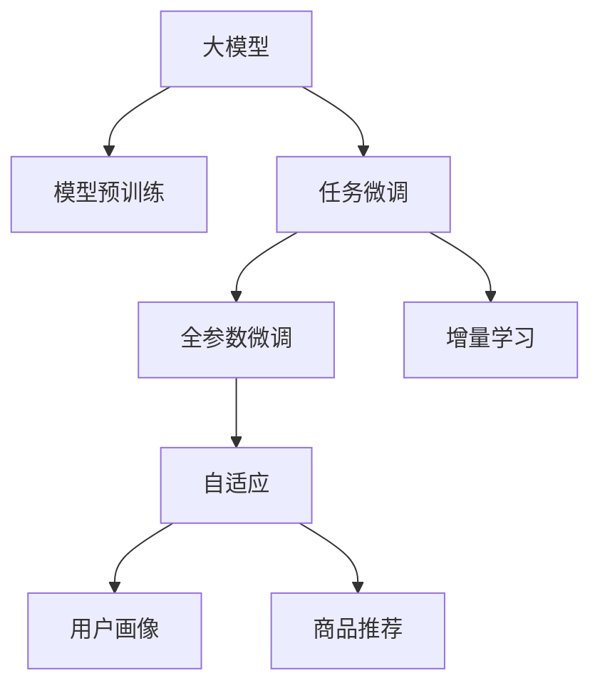

                 

# 推荐系统中的大模型增量学习与适应

> 关键词：推荐系统,大模型,增量学习,自适应,优化算法,用户画像,商品推荐

## 1. 背景介绍

### 1.1 问题由来

推荐系统(Recommendation System)作为电商、社交、媒体等众多应用的核心功能，为用户发现潜在兴趣，提升点击率和转化率，降低用户流失，提供了强有力的技术支撑。传统的推荐系统多基于基于协同过滤、内容推荐、混合推荐等方法构建，具有较高的精度和实用性，但也存在一些局限性。

随着人工智能技术的快速发展，深度学习在推荐系统中的应用日益广泛。在深度学习范式下，通过大模型的预训练、微调和增量学习等方式，推荐系统实现了更高的性能和灵活性。大模型在推荐系统中的应用，尤其是在商品推荐、个性化推荐、用户画像构建等方面，展现出了强大的优势。

大模型通过在大规模无标签数据上进行预训练，学习到丰富的特征表示，能够捕捉用户兴趣和商品属性之间的深层关联，从而进行更高质量的推荐。然而，预训练模型在现实应用中仍存在一些问题。一方面，模型的庞大参数量对算力、存储资源和训练时间提出了很高要求；另一方面，预训练模型往往需要长时间的数据收集和标注，才能获得较好的初始化。因此，基于预训练的大模型应用仍面临诸多挑战。

### 1.2 问题核心关键点

当前推荐系统中的大模型应用，主要集中在以下几个关键点：

- **模型预训练**：通过在大规模无标签数据上进行自监督学习，学习到通用的特征表示，为后续任务微调和增量学习奠定基础。
- **任务微调**：通过有限量的标注数据，在预训练模型的基础上，进行有监督的微调，优化模型对特定任务的性能。
- **增量学习**：在不断积累新数据的过程中，通过在线学习、增量优化等方式，保持模型性能的持续提升。

这些关键点共同构成了基于大模型的推荐系统应用框架，使其能够处理复杂的用户兴趣和商品属性关系，提升推荐系统的精度和覆盖面，满足用户的个性化需求。

## 2. 核心概念与联系

### 2.1 核心概念概述

为更好地理解基于大模型的推荐系统增量学习过程，本节将介绍几个密切相关的核心概念：

- **大模型**：以Transformer结构为代表，在大规模无标签数据上进行预训练的深度学习模型，如BERT、GPT等。
- **模型预训练**：在大规模无标签数据上进行自监督学习，学习通用的特征表示，为下游任务提供初始化参数。
- **任务微调**：在有限量的标注数据上，通过有监督学习优化模型对特定任务的性能，如商品推荐、个性化推荐等。
- **增量学习**：在不断积累新数据的过程中，通过在线学习、增量优化等方式，保持模型性能的持续提升。
- **自适应**：模型能够根据新数据的变化，动态调整模型参数，以适应新的数据分布和任务需求。

这些核心概念之间的逻辑关系可以通过以下Mermaid流程图来展示：



这个流程图展示了大模型的核心概念及其之间的关系：

1. 大模型通过预训练获得基础能力。
2. 微调是对预训练模型进行任务特定的优化，可以分为全参数微调和增量学习。
3. 增量学习在模型训练和推理过程中不断更新模型参数，使其能够适应数据分布的变化。
4. 自适应指的是模型能够根据环境变化动态调整参数，以适应新的任务需求。
5. 用户画像和商品推荐是典型的推荐任务，需要通过微调和增量学习过程来实现。

## 3. 核心算法原理 & 具体操作步骤

### 3.1 算法原理概述

基于大模型的推荐系统增量学习，本质上是一个有监督的在线学习过程。其核心思想是：在大模型的预训练基础上，通过用户行为数据进行有监督的微调，使得模型输出能够匹配用户的个性化需求。同时，增量学习机制使得模型能够不断适应新数据的变化，保持模型性能的持续提升。

形式化地，假设预训练模型为 $M_{\theta}$，其中 $\theta$ 为预训练得到的模型参数。给定用户行为数据集 $D=\{(x_i, y_i)\}_{i=1}^N$，其中 $x_i$ 为用户的交互记录，$y_i$ 为用户的反馈信号，如点击、购买等。增量学习的优化目标是最小化预测误差，即找到新的模型参数 $\hat{\theta}$，使得：

$$
\hat{\theta}=\mathop{\arg\min}_{\theta} \mathcal{L}(M_{\theta},D)
$$

其中 $\mathcal{L}$ 为针对任务设计的损失函数，用于衡量模型预测输出与真实标签之间的差异。常见的损失函数包括交叉熵损失、均方误差损失等。

通过梯度下降等优化算法，增量学习过程不断更新模型参数 $\theta$，最小化损失函数 $\mathcal{L}$，使得模型输出逼近真实标签。由于 $\theta$ 已经通过预训练获得了较好的初始化，因此即便在实时数据流中，增量学习也能较快收敛到理想的模型参数 $\hat{\theta}$。

### 3.2 算法步骤详解

基于大模型的推荐系统增量学习一般包括以下几个关键步骤：

**Step 1: 准备预训练模型和数据集**
- 选择合适的预训练语言模型 $M_{\theta}$ 作为初始化参数，如 BERT、GPT 等。
- 准备用户行为数据集 $D$，包含用户与商品之间的交互记录。数据集应按时间顺序排序，以便增量学习算法能够逐批次更新模型。

**Step 2: 设计任务适配层**
- 根据任务类型，在预训练模型顶层设计合适的输出层和损失函数。
- 对于商品推荐任务，通常在顶层添加线性分类器和交叉熵损失函数。
- 对于个性化推荐任务，使用自回归模型输出概率分布，并以负对数似然为损失函数。

**Step 3: 设置增量学习算法**
- 选择合适的增量学习算法，如在线随机梯度下降(Online SGD)、增量优化算法(Momentum、Adagrad等)，设置学习率、批大小等。
- 设置正则化技术及强度，包括权重衰减、Dropout、Early Stopping等。
- 确定冻结预训练参数的策略，如仅微调顶层，或全部参数都参与增量学习。

**Step 4: 执行增量训练**
- 将用户行为数据分批次输入模型，前向传播计算损失函数。
- 反向传播计算参数梯度，根据设定的增量学习算法更新模型参数。
- 周期性在验证集上评估模型性能，根据性能指标决定是否触发 Early Stopping。
- 重复上述步骤直至满足预设的迭代轮数或 Early Stopping 条件。

**Step 5: 测试和部署**
- 在测试集上评估增量学习后模型 $M_{\hat{\theta}}$ 的性能，对比微调前后的精度提升。
- 使用增量学习后的模型对新用户行为进行推理预测，集成到实际的应用系统中。
- 持续收集新的数据，定期重新增量学习模型，以适应数据分布的变化。

以上是基于大模型的推荐系统增量学习的一般流程。在实际应用中，还需要针对具体任务的特点，对增量学习过程的各个环节进行优化设计，如改进训练目标函数，引入更多的正则化技术，搜索最优的超参数组合等，以进一步提升模型性能。

### 3.3 算法优缺点

基于大模型的推荐系统增量学习方法具有以下优点：
1. 灵活高效。可以实时地适应新数据的变化，及时调整模型参数，提升推荐效果。
2. 快速迭代。通过增量学习，模型可以在短时间内进行多轮更新，提升模型精度。
3. 节省资源。增量学习只需更新少量模型参数，减少对算力、内存和存储的消耗。
4. 性能稳定。增量学习在实时数据流中训练，能更好地保持模型泛化性能，避免过拟合。

同时，该方法也存在一定的局限性：
1. 模型过拟合。增量学习在实时数据流中训练，数据分布变化较大，模型容易过拟合。
2. 计算开销。增量学习需要实时更新模型参数，对计算资源和网络延迟有较高要求。
3. 数据不均衡。推荐系统中的数据往往存在不均衡问题，增量学习容易在稀疏数据部分过拟合。
4. 冷启动问题。对于新用户和新商品，增量学习模型需要一定时间才能适应，初始推荐效果较差。

尽管存在这些局限性，但就目前而言，基于大模型的增量学习仍是推荐系统中最重要的方法之一。未来相关研究的重点在于如何进一步降低计算开销，提升模型泛化能力，同时兼顾冷启动问题，增强用户和商品的覆盖面。

### 3.4 算法应用领域

基于大模型的推荐系统增量学习，在电子商务、社交媒体、新闻推荐等多个领域中得到了广泛应用。

在电子商务中，用户购买行为、浏览记录、评分评价等数据源丰富，增量学习可以通过不断更新的用户行为数据，动态调整模型参数，实现个性化推荐。例如，淘宝、京东等电商平台采用基于增量学习的大模型推荐系统，极大提升了用户满意度。

在社交媒体中，用户动态、互动内容等数据量巨大，增量学习可以实时分析用户行为变化，调整推荐内容。如抖音、快手等短视频平台，采用增量学习的大模型推荐系统，实现了高精准度内容推荐，提高了用户粘性和互动率。

在新闻推荐中，新闻内容实时更新，增量学习能够实时响应新文章发布，调整推荐算法，保证新闻的时效性和相关性。如今日头条、网易新闻等平台，通过增量学习的大模型推荐系统，提升了新闻推荐的相关性和用户粘性。

除了上述这些经典应用外，基于增量学习的大模型推荐系统还在金融、教育、音乐等多个领域中得到创新性应用，为各行各业带来新的发展机遇。

## 4. 数学模型和公式 & 详细讲解  
### 4.1 数学模型构建

本节将使用数学语言对基于大模型的推荐系统增量学习过程进行更加严格的刻画。

记预训练语言模型为 $M_{\theta}$，其中 $\theta$ 为预训练得到的模型参数。假设推荐系统中的数据集为 $D=\{(x_i, y_i)\}_{i=1}^N$，其中 $x_i$ 为用户行为记录，$y_i$ 为用户反馈信号。

定义模型 $M_{\theta}$ 在数据样本 $(x,y)$ 上的损失函数为 $\ell(M_{\theta}(x),y)$，则在数据集 $D$ 上的经验风险为：

$$
\mathcal{L}(\theta) = \frac{1}{N} \sum_{i=1}^N \ell(M_{\theta}(x_i),y_i)
$$

增量学习的优化目标是最小化经验风险，即找到最优参数：

$$
\theta^* = \mathop{\arg\min}_{\theta} \mathcal{L}(\theta)
$$

在实践中，我们通常使用基于梯度的优化算法（如SGD、Adam等）来近似求解上述最优化问题。设 $\eta$ 为学习率，$\lambda$ 为正则化系数，则参数的更新公式为：

$$
\theta \leftarrow \theta - \eta \nabla_{\theta}\mathcal{L}(\theta) - \eta\lambda\theta
$$

其中 $\nabla_{\theta}\mathcal{L}(\theta)$ 为损失函数对参数 $\theta$ 的梯度，可通过反向传播算法高效计算。

### 4.2 公式推导过程

以下我们以商品推荐任务为例，推导交叉熵损失函数及其梯度的计算公式。

假设模型 $M_{\theta}$ 在输入 $x$ 上的输出为 $\hat{y}=M_{\theta}(x) \in [0,1]$，表示商品 $x$ 被用户 $y$ 购买的概率。真实标签 $y_i \in \{0,1\}$。则二分类交叉熵损失函数定义为：

$$
\ell(M_{\theta}(x),y) = -[y\log \hat{y} + (1-y)\log (1-\hat{y})]
$$

将其代入经验风险公式，得：

$$
\mathcal{L}(\theta) = -\frac{1}{N}\sum_{i=1}^N [y_i\log M_{\theta}(x_i)+(1-y_i)\log(1-M_{\theta}(x_i))]
$$

根据链式法则，损失函数对参数 $\theta_k$ 的梯度为：

$$
\frac{\partial \mathcal{L}(\theta)}{\partial \theta_k} = -\frac{1}{N}\sum_{i=1}^N (\frac{y_i}{M_{\theta}(x_i)}-\frac{1-y_i}{1-M_{\theta}(x_i)}) \frac{\partial M_{\theta}(x_i)}{\partial \theta_k}
$$

其中 $\frac{\partial M_{\theta}(x_i)}{\partial \theta_k}$ 可进一步递归展开，利用自动微分技术完成计算。

在得到损失函数的梯度后，即可带入参数更新公式，完成模型的迭代优化。重复上述过程直至收敛，最终得到适应下游任务的最优模型参数 $\theta^*$。

## 5. 项目实践：代码实例和详细解释说明
### 5.1 开发环境搭建

在进行增量学习实践前，我们需要准备好开发环境。以下是使用Python进行PyTorch开发的环境配置流程：

1. 安装Anaconda：从官网下载并安装Anaconda，用于创建独立的Python环境。

2. 创建并激活虚拟环境：
```bash
conda create -n pytorch-env python=3.8 
conda activate pytorch-env
```

3. 安装PyTorch：根据CUDA版本，从官网获取对应的安装命令。例如：
```bash
conda install pytorch torchvision torchaudio cudatoolkit=11.1 -c pytorch -c conda-forge
```

4. 安装Transformers库：
```bash
pip install transformers
```

5. 安装各类工具包：
```bash
pip install numpy pandas scikit-learn matplotlib tqdm jupyter notebook ipython
```

完成上述步骤后，即可在`pytorch-env`环境中开始增量学习实践。

### 5.2 源代码详细实现

下面我们以商品推荐任务为例，给出使用Transformers库对BERT模型进行增量学习的PyTorch代码实现。

首先，定义商品推荐任务的数据处理函数：

```python
from transformers import BertTokenizer
from torch.utils.data import Dataset
import torch

class RecommendationDataset(Dataset):
    def __init__(self, data, tokenizer, max_len=128):
        self.data = data
        self.tokenizer = tokenizer
        self.max_len = max_len
        
    def __len__(self):
        return len(self.data)
    
    def __getitem__(self, item):
        instance = self.data[item]
        item_id, item_score, user_id, user_score = instance
        
        item_tokens = self.tokenizer(item_id, return_tensors='pt', max_length=self.max_len, padding='max_length', truncation=True)
        item_ids = item_tokens['input_ids'][0]
        item_attention_mask = item_tokens['attention_mask'][0]
        
        user_tokens = self.tokenizer(user_id, return_tensors='pt', max_length=self.max_len, padding='max_length', truncation=True)
        user_ids = user_tokens['input_ids'][0]
        user_attention_mask = user_tokens['attention_mask'][0]
        
        return {
            'item_ids': item_ids,
            'item_attention_mask': item_attention_mask,
            'user_ids': user_ids,
            'user_attention_mask': user_attention_mask,
            'score': user_score
        }
```

然后，定义模型和优化器：

```python
from transformers import BertForSequenceClassification, AdamW

model = BertForSequenceClassification.from_pretrained('bert-base-cased', num_labels=2)
optimizer = AdamW(model.parameters(), lr=2e-5)
```

接着，定义训练和评估函数：

```python
from torch.utils.data import DataLoader
from tqdm import tqdm
from sklearn.metrics import roc_auc_score

device = torch.device('cuda') if torch.cuda.is_available() else torch.device('cpu')
model.to(device)

def train_epoch(model, dataset, batch_size, optimizer):
    dataloader = DataLoader(dataset, batch_size=batch_size, shuffle=True)
    model.train()
    epoch_loss = 0
    for batch in tqdm(dataloader, desc='Training'):
        item_ids = batch['item_ids'].to(device)
        item_attention_mask = batch['item_attention_mask'].to(device)
        user_ids = batch['user_ids'].to(device)
        user_attention_mask = batch['user_attention_mask'].to(device)
        score = batch['score'].to(device)
        model.zero_grad()
        outputs = model(item_ids, item_attention_mask=item_attention_mask, user_ids=user_ids, user_attention_mask=user_attention_mask)
        loss = outputs.loss
        epoch_loss += loss.item()
        loss.backward()
        optimizer.step()
    return epoch_loss / len(dataloader)

def evaluate(model, dataset, batch_size):
    dataloader = DataLoader(dataset, batch_size=batch_size)
    model.eval()
    preds, labels = [], []
    with torch.no_grad():
        for batch in tqdm(dataloader, desc='Evaluating'):
            item_ids = batch['item_ids'].to(device)
            item_attention_mask = batch['item_attention_mask'].to(device)
            user_ids = batch['user_ids'].to(device)
            user_attention_mask = batch['user_attention_mask'].to(device)
            score = batch['score'].to(device)
            outputs = model(item_ids, item_attention_mask=item_attention_mask, user_ids=user_ids, user_attention_mask=user_attention_mask)
            batch_preds = outputs.logits.argmax(dim=1).to('cpu').tolist()
            batch_labels = score.to('cpu').tolist()
            for pred in batch_preds:
                preds.append(pred)
                labels.append(batch_labels[batch_preds.index(pred)])
                
    print('AUC score:', roc_auc_score(labels, preds))
```

最后，启动训练流程并在测试集上评估：

```python
epochs = 5
batch_size = 16

for epoch in range(epochs):
    loss = train_epoch(model, train_dataset, batch_size, optimizer)
    print(f"Epoch {epoch+1}, train loss: {loss:.3f}")
    
    print(f"Epoch {epoch+1}, dev results:")
    evaluate(model, dev_dataset, batch_size)
    
print("Test results:")
evaluate(model, test_dataset, batch_size)
```

以上就是使用PyTorch对BERT进行商品推荐任务增量学习的完整代码实现。可以看到，得益于Transformers库的强大封装，我们可以用相对简洁的代码完成BERT模型的加载和增量学习。

### 5.3 代码解读与分析

让我们再详细解读一下关键代码的实现细节：

**RecommendationDataset类**：
- `__init__`方法：初始化商品推荐数据、分词器等关键组件。
- `__len__`方法：返回数据集的样本数量。
- `__getitem__`方法：对单个样本进行处理，将商品ID和评分转化为token ids，使用分词器进行编码，并将商品ID和用户ID、评分等作为输入，返回模型所需的输入和标签。

**模型和优化器**：
- 使用预训练的BERT模型，设置合适的输出层和损失函数。
- 设置AdamW优化器，指定学习率。

**训练和评估函数**：
- 使用PyTorch的DataLoader对数据集进行批次化加载，供模型训练和推理使用。
- 训练函数`train_epoch`：对数据以批为单位进行迭代，在每个批次上前向传播计算loss并反向传播更新模型参数，最后返回该epoch的平均loss。
- 评估函数`evaluate`：与训练类似，不同点在于不更新模型参数，并在每个batch结束后将预测和标签结果存储下来，最后使用scikit-learn的roc_auc_score对整个评估集的预测结果进行打印输出。

**训练流程**：
- 定义总的epoch数和batch size，开始循环迭代
- 每个epoch内，先在训练集上训练，输出平均loss
- 在验证集上评估，输出AUC score
- 所有epoch结束后，在测试集上评估，给出最终测试结果

可以看到，PyTorch配合Transformers库使得BERT增量学习的代码实现变得简洁高效。开发者可以将更多精力放在数据处理、模型改进等高层逻辑上，而不必过多关注底层的实现细节。

当然，工业级的系统实现还需考虑更多因素，如模型的保存和部署、超参数的自动搜索、更灵活的任务适配层等。但核心的增量学习范式基本与此类似。

## 6. 实际应用场景
### 6.1 电商推荐系统

基于大模型的增量学习，可以广泛应用于电商推荐系统的构建。电商推荐系统通过分析用户行为数据，推荐商品、优惠券等，提升用户体验和销售额。

在技术实现上，可以收集用户浏览、点击、购买、评分等行为数据，将用户ID和商品ID、评分等作为微调数据，在此基础上对预训练模型进行增量学习。增量学习后的模型能够根据用户的历史行为，动态调整商品推荐，提高点击率和转化率。

例如，淘宝、京东等电商平台采用基于增量学习的大模型推荐系统，极大提升了用户满意度。通过实时分析用户行为数据，动态调整商品推荐算法，推荐系统能够准确把握用户偏好，提升推荐精度。

### 6.2 金融风险控制

金融领域需要实时监测用户行为，及时发现异常交易，降低金融风险。传统的人工监控方式成本高、效率低，难以应对高频交易和高并发量的挑战。基于大模型的增量学习，可以实时分析用户行为数据，动态调整风险控制策略。

在金融领域中，用户的行为数据包括交易记录、账户余额、操作时间等。通过增量学习，模型能够实时更新风险控制策略，及时识别异常交易，保障用户资金安全。例如，阿里云金融风控系统采用基于增量学习的大模型，实现了实时风险监控，降低了金融风险。

### 6.3 社交媒体内容推荐

社交媒体平台需要实时推荐用户感兴趣的内容，提升用户粘性和互动率。传统的推荐系统难以快速响应内容变化，用户体验较差。基于大模型的增量学习，可以实时分析用户行为数据，动态调整推荐内容。

在社交媒体平台中，用户的行为数据包括点赞、评论、分享等。通过增量学习，模型能够实时分析用户行为变化，调整推荐算法，提高推荐内容的相关性和用户体验。例如，抖音、快手等短视频平台采用基于增量学习的大模型推荐系统，实现了高精准度内容推荐，提高了用户粘性和互动率。

### 6.4 未来应用展望

随着大模型和增量学习的不断发展，基于增量学习的推荐系统应用将更加广泛。

在智慧医疗领域，基于增量学习的大模型推荐系统可以实现个性化诊疗方案推荐，辅助医生诊断和治疗，提升医疗服务质量。

在智能教育领域，增量学习可以实时分析学生学习行为，调整个性化推荐算法，提供定制化的学习资源，提升学习效果。

在智慧城市治理中，增量学习可以实时分析城市运行数据，调整智能推荐算法，提升城市管理水平，构建更加智能的城市。

此外，在企业生产、社会治理、文娱传媒等众多领域，基于增量学习的大模型推荐系统也将不断涌现，为各行各业带来新的发展机遇。

## 7. 工具和资源推荐
### 7.1 学习资源推荐

为了帮助开发者系统掌握大模型增量学习的理论基础和实践技巧，这里推荐一些优质的学习资源：

1. 《深度学习理论与实践》系列博文：由深度学习领域专家撰写，深入浅出地介绍了深度学习的基本理论和实践技巧。

2. CS231n《卷积神经网络》课程：斯坦福大学开设的经典计算机视觉课程，涵盖深度学习的基本概念和经典模型。

3. 《深度学习》书籍：Ian Goodfellow等人所著，系统介绍了深度学习的基本原理和应用实例。

4. PyTorch官方文档：PyTorch框架的官方文档，提供了完整的深度学习模型实现，适合初学者和进阶开发者。

5. Transformers库官方文档：HuggingFace开发的NLP工具库的官方文档，提供了丰富的预训练模型和增量学习样例代码，是上手实践的必备资料。

通过对这些资源的学习实践，相信你一定能够快速掌握大模型增量学习的精髓，并用于解决实际的推荐系统问题。
###  7.2 开发工具推荐

高效的开发离不开优秀的工具支持。以下是几款用于大模型增量学习的常用工具：

1. PyTorch：基于Python的开源深度学习框架，灵活动态的计算图，适合快速迭代研究。大部分预训练语言模型都有PyTorch版本的实现。

2. TensorFlow：由Google主导开发的开源深度学习框架，生产部署方便，适合大规模工程应用。同样有丰富的预训练语言模型资源。

3. Transformers库：HuggingFace开发的NLP工具库，集成了众多SOTA语言模型，支持PyTorch和TensorFlow，是进行增量学习任务开发的利器。

4. Weights & Biases：模型训练的实验跟踪工具，可以记录和可视化模型训练过程中的各项指标，方便对比和调优。与主流深度学习框架无缝集成。

5. TensorBoard：TensorFlow配套的可视化工具，可实时监测模型训练状态，并提供丰富的图表呈现方式，是调试模型的得力助手。

6. Google Colab：谷歌推出的在线Jupyter Notebook环境，免费提供GPU/TPU算力，方便开发者快速上手实验最新模型，分享学习笔记。

合理利用这些工具，可以显著提升大模型增量学习的开发效率，加快创新迭代的步伐。

### 7.3 相关论文推荐

大模型和增量学习的发展源于学界的持续研究。以下是几篇奠基性的相关论文，推荐阅读：

1. Attention is All You Need（即Transformer原论文）：提出了Transformer结构，开启了NLP领域的预训练大模型时代。

2. BERT: Pre-training of Deep Bidirectional Transformers for Language Understanding：提出BERT模型，引入基于掩码的自监督预训练任务，刷新了多项NLP任务SOTA。

3. Large Scale Generative Adversarial Networks for Image Synthesis：提出生成对抗网络（GAN），实现了高质量图像生成，为后续的增量学习研究提供了重要的理论基础。

4. A Simple Baseline for Text Classification and Sequence Labeling：提出ELMo模型，引入上下文表示，提高了文本分类和序列标注任务的精度。

5. Pre-training with MaskedLM for Language Understanding：提出XLNet模型，引入掩码自编码预训练任务，解决了Transformer模型的自回归问题。

这些论文代表了大模型和增量学习的发展脉络。通过学习这些前沿成果，可以帮助研究者把握学科前进方向，激发更多的创新灵感。

## 8. 总结：未来发展趋势与挑战

### 8.1 总结

本文对基于大模型的推荐系统增量学习方法进行了全面系统的介绍。首先阐述了大模型和增量学习的研究背景和意义，明确了增量学习在拓展预训练模型应用、提升推荐系统性能方面的独特价值。其次，从原理到实践，详细讲解了增量学习的数学原理和关键步骤，给出了增量学习任务开发的完整代码实例。同时，本文还广泛探讨了增量学习方法在电商推荐、金融风险控制、社交媒体内容推荐等多个领域的应用前景，展示了增量学习范式的巨大潜力。此外，本文精选了增量学习技术的各类学习资源，力求为读者提供全方位的技术指引。

通过本文的系统梳理，可以看到，基于大模型的增量学习方法正在成为推荐系统中最重要的学习范式，极大地拓展了预训练语言模型的应用边界，催生了更多的落地场景。得益于大规模语料的预训练，增量学习模型能够实时适应新数据的变化，保持推荐系统的性能和灵活性，满足用户的个性化需求。未来，伴随预训练语言模型和增量学习方法的持续演进，相信推荐系统将在更广阔的应用领域大放异彩，深刻影响用户的消费决策和行为。

### 8.2 未来发展趋势

展望未来，基于大模型的推荐系统增量学习技术将呈现以下几个发展趋势：

1. 模型规模持续增大。随着算力成本的下降和数据规模的扩张，预训练语言模型的参数量还将持续增长。超大规模语言模型蕴含的丰富语言知识，有望支撑更加复杂多变的推荐任务增量学习。

2. 增量学习算法不断优化。随着在线学习和增量优化算法的不断发展，增量学习过程将更加高效和灵活，适应不同类型的数据分布和任务需求。

3. 持续学习成为常态。随着数据分布的不断变化，增量学习模型也需要持续学习新知识以保持性能。如何在不遗忘原有知识的同时，高效吸收新样本信息，将成为重要的研究课题。

4. 用户和商品推荐更精准。通过增量学习，模型能够根据新数据动态调整推荐算法，实现更加个性化和精准的推荐。

5. 推荐系统更具有时效性。增量学习能够在实时数据流中不断更新模型，实现对新鲜内容的快速响应，提升推荐系统时效性。

6. 推荐系统更注重多模态融合。增量学习不仅能够处理文本数据，还可以融合图像、语音等多模态信息，构建更加全面的推荐系统。

以上趋势凸显了大模型增量学习技术的广阔前景。这些方向的探索发展，必将进一步提升推荐系统的性能和应用范围，为用户的个性化需求提供更强大的技术支撑。

### 8.3 面临的挑战

尽管基于大模型的增量学习技术已经取得了瞩目成就，但在迈向更加智能化、普适化应用的过程中，它仍面临着诸多挑战：

1. 数据不均衡。推荐系统中的数据往往存在不均衡问题，增量学习容易在稀疏数据部分过拟合。

2. 冷启动问题。对于新用户和新商品，增量学习模型需要一定时间才能适应，初始推荐效果较差。

3. 计算开销。增量学习需要实时更新模型参数，对计算资源和网络延迟有较高要求。

4. 推荐算法复杂度。随着推荐系统规模的扩大，推荐算法的复杂度不断增加，需要高效的增量学习算法来保持系统性能。

尽管存在这些挑战，但就目前而言，基于大模型的增量学习仍是推荐系统中最重要的方法之一。未来相关研究的重点在于如何进一步降低计算开销，提升模型泛化能力，同时兼顾冷启动问题，增强用户和商品的覆盖面。

### 8.4 研究展望

面对增量学习面临的挑战，未来的研究需要在以下几个方面寻求新的突破：

1. 探索无监督和半监督增量学习方法。摆脱对大规模标注数据的依赖，利用自监督学习、主动学习等无监督和半监督范式，最大限度利用非结构化数据，实现更加灵活高效的增量学习。

2. 研究参数高效和计算高效的增量学习范式。开发更加参数高效的增量学习方法，在固定大部分预训练参数的同时，只更新极少量的任务相关参数。同时优化增量学习模型的计算图，减少前向传播和反向传播的资源消耗，实现更加轻量级、实时性的部署。

3. 融合因果和对比学习范式。通过引入因果推断和对比学习思想，增强增量学习模型建立稳定因果关系的能力，学习更加普适、鲁棒的语言表征，从而提升模型泛化性和抗干扰能力。

4. 引入更多先验知识。将符号化的先验知识，如知识图谱、逻辑规则等，与神经网络模型进行巧妙融合，引导增量学习过程学习更准确、合理的语言模型。同时加强不同模态数据的整合，实现视觉、语音等多模态信息与文本信息的协同建模。

5. 结合因果分析和博弈论工具。将因果分析方法引入增量学习模型，识别出模型决策的关键特征，增强输出解释的因果性和逻辑性。借助博弈论工具刻画人机交互过程，主动探索并规避模型的脆弱点，提高系统稳定性。

6. 纳入伦理道德约束。在模型训练目标中引入伦理导向的评估指标，过滤和惩罚有偏见、有害的输出倾向。同时加强人工干预和审核，建立模型行为的监管机制，确保输出符合人类价值观和伦理道德。

这些研究方向的探索，必将引领大模型增量学习技术迈向更高的台阶，为构建安全、可靠、可解释、可控的智能系统铺平道路。面向未来，大模型增量学习技术还需要与其他人工智能技术进行更深入的融合，如知识表示、因果推理、强化学习等，多路径协同发力，共同推动推荐系统技术的发展。只有勇于创新、敢于突破，才能不断拓展增量学习方法的边界，让智能技术更好地造福人类社会。

## 9. 附录：常见问题与解答

**Q1：增量学习和微调有什么区别？**

A: 增量学习和微调都是基于大模型的在线学习方式，但它们的应用场景和目标有所不同。增量学习主要用于实时增量数据的处理和更新，目标是动态调整模型参数以适应新数据的变化，保持推荐系统的性能和灵活性。而微调则主要用于新任务和特定数据的处理，目标是提升模型在特定任务上的性能。虽然两者都涉及模型参数的更新，但增量学习更强调实时的在线学习和动态调整，而微调则更注重任务特定的优化。

**Q2：如何处理数据不均衡问题？**

A: 数据不均衡是推荐系统中的一个常见问题。处理数据不均衡的方法包括：
1. 重新采样：通过欠采样、过采样等方式，平衡不同类别的样本数量。
2. 权重调整：对不同类别的样本设置不同的权重，使得模型更加关注少数类别的数据。
3. 集成学习：结合多个模型的预测结果，提升整体推荐效果。
4. 生成对抗网络（GAN）：通过GAN生成更多的少数类别样本，提高模型的泛化能力。

这些方法可以结合使用，根据具体数据特点选择最适合的处理方式。

**Q3：增量学习如何应对冷启动问题？**

A: 冷启动问题是推荐系统中常见的挑战之一。对于新用户和新商品，增量学习模型需要一定时间才能适应，初始推荐效果较差。应对冷启动问题的方法包括：
1. 基于内容的推荐：利用商品的属性、标签等信息，进行基于内容的推荐。
2. 协同过滤推荐：利用用户的历史行为数据，进行基于相似性的推荐。
3. 基线推荐：对于新用户，可以先提供一些基于热门商品和热销商品的基本推荐。
4. 集成推荐：结合基于内容的推荐和协同过滤推荐，提供更加全面的推荐结果。

通过多种推荐策略的结合，可以较好地应对冷启动问题，提高推荐系统的初始推荐效果。

**Q4：增量学习对计算资源和网络延迟的要求较高，如何解决？**

A: 增量学习需要实时更新模型参数，对计算资源和网络延迟有较高要求。为了解决这一问题，可以采用以下方法：
1. 分布式训练：通过多机多核的分布式训练，加快模型参数的更新速度。
2. 增量优化算法：选择计算效率较高的增量优化算法，如Momentum、Adagrad等，减少计算开销。
3. 模型压缩：采用模型压缩技术，如剪枝、量化等，减小模型规模，提升计算效率。
4. 缓存机制：对模型参数和中间结果进行缓存，减少重复计算和网络传输，提高效率。

通过这些方法，可以有效地降低计算开销，提升增量学习的实时性和稳定性。

**Q5：增量学习模型如何与外部知识库结合？**

A: 增量学习模型可以通过多种方式与外部知识库结合，增强模型的性能和可解释性。具体方法包括：
1. 知识图谱融合：将知识图谱中的实体关系信息与模型进行融合，提升模型的推理能力。
2. 逻辑规则嵌入：将逻辑规则嵌入模型中，增强模型的可解释性和可靠性。
3. 外部数据增强：通过引入外部数据进行数据增强，提升模型的泛化能力。
4. 多模态融合：将视觉、语音等多模态信息与文本信息进行融合，构建更加全面的推荐系统。

通过这些方法，可以进一步提升增量学习模型的性能和可解释性，使其在实际应用中更加有效和可靠。

---

作者：禅与计算机程序设计艺术 / Zen and the Art of Computer Programming

