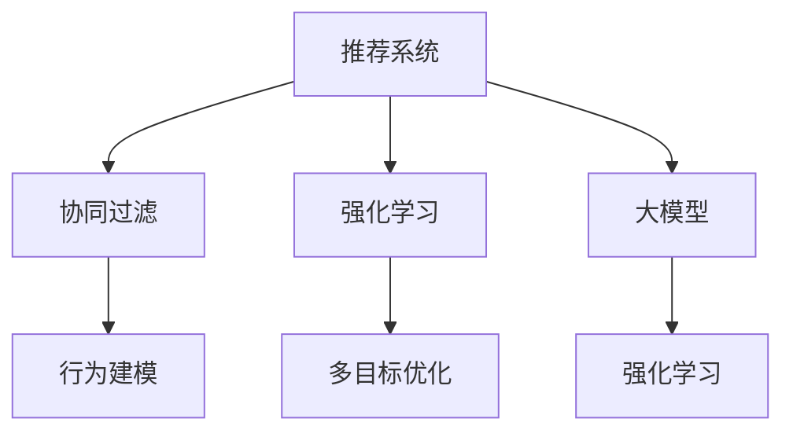

                 

# 推荐系统中的强化学习：大模型新突破

> 关键词：强化学习,推荐系统,大模型,协同过滤,行为建模,多目标优化

## 1. 背景介绍

### 1.1 问题由来
随着互联网的迅猛发展和数据的日益丰富，推荐系统已经成为了各行各业数字化转型的重要工具。无论是电商、社交网络、视频平台还是新闻聚合，推荐系统都能够通过个性化推荐，提升用户满意度，增加业务收入。然而，传统推荐系统存在诸多问题：如冷启动问题、数据稀疏性、推荐同质化等。这些问题限制了推荐系统的性能和用户体验。

针对这些问题，强化学习(Reinforcement Learning, RL)成为了推荐系统研究的一个热门方向。强化学习通过模拟用户行为，学习到最优的推荐策略，能够动态调整推荐策略以应对不同用户和环境的变化，从而提升推荐系统的效果和公平性。然而，强化学习的复杂性也对推荐系统带来了新的挑战。

### 1.2 问题核心关键点
强化学习在推荐系统中的应用，涉及以下几个关键问题：

1. 模型复杂度。强化学习模型的复杂度往往远超传统协同过滤和基于内容的推荐方法。大模型能学习到更加丰富的用户行为和产品属性信息，但也带来了更大的计算和存储成本。
2. 数据稀疏性。推荐系统的数据往往呈现长尾分布，强化学习模型需要大量样本来估计状态值函数，而稀疏数据难以满足这一要求。
3. 模型可解释性。强化学习模型是一个"黑盒"，难以解释其内部工作机制和决策逻辑，给推荐系统的可解释性带来了挑战。
4. 用户交互不足。强化学习模型需要大量用户行为数据进行训练，对于新用户和新商品，无法得到足够交互数据。
5. 模型鲁棒性。强化学习模型对初始参数的敏感性较强，容易受到异常数据和噪声的影响，影响模型稳定性。
6. 多目标优化。强化学习推荐模型往往需要同时优化多个目标，如推荐多样性、覆盖率、点击率等，难以获得最优解。

### 1.3 问题研究意义
强化学习在推荐系统中的应用，具有以下重要意义：

1. 提升推荐效果。强化学习能够通过动态调整推荐策略，学习到更加个性化的推荐方案，提升用户满意度和转化率。
2. 增强模型公平性。强化学习推荐模型能够通过优化推荐多样性，减少对少数商品或群体的过度推荐，提升推荐公平性。
3. 促进业务创新。强化学习推荐模型能够基于用户行为，发现新的推荐模式，提升业务创新能力。
4. 降低推荐成本。强化学习推荐模型能够自动学习推荐策略，减少人工干预，降低推荐成本。
5. 应对数据稀疏性。强化学习推荐模型能够通过模拟用户行为，优化模型参数，适应数据稀疏性。
6. 提高模型泛化能力。强化学习推荐模型能够通过学习用户行为规律，提升对新用户和新商品推荐的泛化能力。

本文聚焦于强化学习在推荐系统中的应用，以大模型为载体，探讨如何通过强化学习技术提升推荐系统的效果和公平性。

## 2. 核心概念与联系

### 2.1 核心概念概述

为了更好地理解强化学习在推荐系统中的应用，本节将介绍几个密切相关的核心概念：

- 强化学习(Reinforcement Learning, RL)：一种基于试错的学习方法，通过与环境的交互，学习到最优的策略以获得最大奖励。RL的核心思想是构建奖励函数，通过不断尝试和优化策略，最大化总奖励。
- 推荐系统(Recommendation System, RS)：通过分析用户的历史行为和物品属性，为用户推荐感兴趣的物品，提升用户满意度。
- 协同过滤(Collaborative Filtering, CF)：推荐系统中最常用的技术之一，通过分析用户行为和物品属性，预测用户对物品的偏好。
- 行为建模(Behavioral Modeling)：通过模拟用户行为，学习用户对物品的偏好，提升推荐系统效果。
- 多目标优化(Multi-Objective Optimization)：推荐系统往往需要同时优化多个目标，如点击率、多样性、覆盖率等，是强化学习中一个重要的挑战。
- 大模型(Large Model)：指包含亿计参数的深度神经网络模型，能够学习到更加丰富的用户行为和产品属性信息。

这些核心概念之间存在紧密的联系：

1. 强化学习与推荐系统：RL通过模拟用户行为，学习到最优的推荐策略，提升推荐效果。
2. 协同过滤与行为建模：CF通过分析用户行为，预测用户偏好，而行为建模则通过模拟用户行为，提升预测精度。
3. 多目标优化与强化学习：多目标优化是推荐系统的一个核心问题，通过强化学习可以动态调整推荐策略，优化多个目标。
4. 大模型与推荐系统：大模型能够学习到更加丰富的用户行为和产品属性信息，提升推荐系统的效果和公平性。

### 2.2 核心概念原理和架构的 Mermaid 流程图



这个流程图展示了强化学习在推荐系统中的应用架构：

1. 协同过滤是推荐系统中最常用的方法之一，通过分析用户行为，预测用户偏好。
2. 行为建模通过模拟用户行为，学习到更加准确的推荐策略。
3. 强化学习通过模拟用户行为，学习到最优的推荐策略。
4. 多目标优化是推荐系统中的一个重要问题，强化学习可以动态调整推荐策略，优化多个目标。
5. 大模型能够学习到更加丰富的用户行为和产品属性信息，提升推荐系统的效果和公平性。

这些核心概念共同构成了强化学习在推荐系统中的应用框架，使得推荐系统能够更加智能和公平。

## 3. 核心算法原理 & 具体操作步骤
### 3.1 算法原理概述

强化学习在推荐系统中的应用，一般包括以下几个步骤：

1. 环境建模：通过构建状态空间和奖励函数，描述用户和物品之间的交互。
2. 策略学习：通过强化学习算法，学习到最优的推荐策略，最大化总奖励。
3. 模型评估：通过A/B测试等方法，评估推荐策略的效果，指导策略的调整和优化。
4. 模型部署：将优化后的推荐策略应用于推荐系统，实现个性化推荐。

强化学习推荐系统的核心在于构建奖励函数，通过模拟用户行为，学习到最优的推荐策略。一般来说，强化学习推荐系统可以分成以下几个模块：

- 用户行为建模模块：通过分析用户的历史行为，学习到用户对物品的偏好。
- 物品属性建模模块：通过分析物品的属性信息，学习到物品的特征。
- 推荐策略模块：通过结合用户行为和物品属性，学习到最优的推荐策略。
- 多目标优化模块：通过优化推荐系统的多个目标，提升推荐效果和公平性。

### 3.2 算法步骤详解

以多臂老虎机(Multi-Arm Bandit, MAB)为例，展示强化学习推荐系统的实现流程。

**Step 1: 环境建模**
- 定义状态空间：将用户和物品的关系抽象为状态，如用户对物品的评分、物品的曝光次数等。
- 定义奖励函数：定义奖励函数，如点击率、转化率等，表示用户对推荐结果的满意度。

**Step 2: 策略学习**
- 选择算法：选择适合算法，如$\epsilon$-贪婪、UCB等。
- 更新策略：通过模拟用户行为，不断更新推荐策略，最大化总奖励。

**Step 3: 模型评估**
- 设计A/B测试：设计A/B测试，比较不同推荐策略的效果。
- 评估指标：选择评估指标，如点击率、转化率等。

**Step 4: 模型部署**
- 部署策略：将优化后的推荐策略应用于推荐系统，实现个性化推荐。
- 实时优化：根据反馈信息，不断调整推荐策略，提升推荐效果。

### 3.3 算法优缺点

强化学习在推荐系统中的应用，具有以下优点：

1. 动态调整策略：强化学习推荐系统可以动态调整推荐策略，适应用户行为和环境变化。
2. 提高推荐效果：通过模拟用户行为，学习到最优的推荐策略，提升推荐效果。
3. 增强模型公平性：通过优化推荐多样性，减少对少数商品或群体的过度推荐，提升推荐公平性。
4. 促进业务创新：通过学习用户行为规律，发现新的推荐模式，提升业务创新能力。
5. 降低推荐成本：通过自动学习推荐策略，减少人工干预，降低推荐成本。

同时，该方法也存在一定的局限性：

1. 模型复杂度：强化学习模型复杂度较高，需要大量计算资源和数据支持。
2. 数据稀疏性：推荐系统的数据往往呈现长尾分布，强化学习模型需要大量样本来估计状态值函数。
3. 模型可解释性：强化学习模型是一个"黑盒"，难以解释其内部工作机制和决策逻辑。
4. 用户交互不足：强化学习模型需要大量用户行为数据进行训练，对于新用户和新商品，无法得到足够交互数据。
5. 模型鲁棒性：强化学习模型对初始参数的敏感性较强，容易受到异常数据和噪声的影响。
6. 多目标优化：强化学习推荐模型往往需要同时优化多个目标，难以获得最优解。

尽管存在这些局限性，但就目前而言，强化学习推荐系统仍是大规模推荐系统中不可或缺的一部分。未来相关研究的重点在于如何进一步降低模型复杂度，提高模型可解释性和鲁棒性，同时兼顾用户交互不足和多目标优化问题。

### 3.4 算法应用领域

强化学习在推荐系统中的应用，已经涵盖了以下几个领域：

- 电商推荐：通过分析用户购买历史和商品属性，为用户推荐感兴趣的物品。
- 视频推荐：通过分析用户观看历史和视频属性，为用户推荐感兴趣的视频。
- 新闻推荐：通过分析用户阅读历史和文章属性，为用户推荐感兴趣的新闻。
- 社交推荐：通过分析用户社交行为和内容属性，为用户推荐感兴趣的内容。
- 个性化广告推荐：通过分析用户行为和广告属性，为用户推荐感兴趣的广告。

除了这些常见的应用场景外，强化学习推荐系统还可以应用于更多领域中，如医疗推荐、金融推荐、智能家居推荐等，为各行各业带来新的发展机遇。

## 4. 数学模型和公式 & 详细讲解 & 举例说明

### 4.1 数学模型构建

在强化学习推荐系统中，常见的数学模型包括以下几种：

1. Q-Learning模型：通过估计状态-行动值函数$Q(s,a)$，学习到最优的推荐策略。
2. SARSA模型：通过估计状态-行动-状态-行动值函数$Q(s,a,s',a')$，学习到最优的推荐策略。
3. 上下文感知推荐模型：通过上下文信息，提升推荐效果，如时间、地点、天气等。

以Q-Learning模型为例，介绍推荐系统的数学模型构建。

记状态空间为$S$，行动空间为$A$，奖励函数为$R$，策略为$\pi$，优化目标为$\max_{\pi}\mathbb{E}[R]$。

Q-Learning模型的目标是最小化状态-行动值函数$Q(s,a)$，即：

$$
\min_{Q} \mathbb{E}_{(s,a)\sim \pi}[Q(s,a) - (r + \gamma \max_{a'} Q(s',a'))]
$$

其中$s$为状态，$a$为行动，$r$为奖励，$s'$为下一个状态，$a'$为下一个行动，$\gamma$为折扣因子。

### 4.2 公式推导过程

Q-Learning模型的核心在于估计状态-行动值函数$Q(s,a)$，推导过程如下：

1. 状态-行动值函数$Q(s,a)$定义为状态$s$和行动$a$的价值，可以表示为：

$$
Q(s,a) = \mathbb{E}_{(s,a)\sim \pi}[r + \gamma \max_{a'} Q(s',a')]
$$

2. 通过不断迭代更新状态-行动值函数$Q(s,a)$，可以求得最优策略$\pi^*$，即：

$$
\pi^* = \arg\max_{\pi} \mathbb{E}_{(s,a)\sim \pi}[Q(s,a)]
$$

3. 通过状态-行动值函数$Q(s,a)$，可以求得最优策略$\pi^*$，即：

$$
\pi^* = \arg\max_{\pi} \mathbb{E}_{(s,a)\sim \pi}[Q(s,a)]
$$

4. 在实际应用中，可以通过经验公式或深度神经网络模型，估计状态-行动值函数$Q(s,a)$，即：

$$
Q(s,a) = \mathbb{E}_{(s,a)\sim \pi}[Q(s,a)]
$$

5. 将状态-行动值函数$Q(s,a)$代入优化目标，得到最终优化目标：

$$
\max_{\pi} \mathbb{E}_{(s,a)\sim \pi}[Q(s,a)]
$$

6. 在实际应用中，可以通过优化算法(如梯度下降)，不断更新状态-行动值函数$Q(s,a)$，得到最优策略$\pi^*$，即：

$$
\pi^* = \arg\max_{\pi} \mathbb{E}_{(s,a)\sim \pi}[Q(s,a)]
$$

7. 通过优化算法，不断更新状态-行动值函数$Q(s,a)$，得到最优策略$\pi^*$，即：

$$
\pi^* = \arg\max_{\pi} \mathbb{E}_{(s,a)\sim \pi}[Q(s,a)]
$$

### 4.3 案例分析与讲解

以电商推荐系统为例，展示强化学习推荐系统的实际应用。

电商推荐系统中的状态空间$S$可以表示为用户ID和物品ID的组合，行动空间$A$可以表示为用户点击、购买、收藏等行动。奖励函数$R$可以表示为点击率、转化率、复购率等。

通过Q-Learning模型，可以学习到最优的推荐策略，即：

$$
\pi^* = \arg\max_{\pi} \mathbb{E}_{(s,a)\sim \pi}[Q(s,a)]
$$

其中，状态$s$为用户的点击历史和浏览历史，行动$a$为用户对商品的点击、购买、收藏等行为，奖励$R$为用户对商品的反馈，如点击率、转化率、复购率等。

通过优化算法，不断更新状态-行动值函数$Q(s,a)$，可以求得最优策略$\pi^*$，即：

$$
\pi^* = \arg\max_{\pi} \mathbb{E}_{(s,a)\sim \pi}[Q(s,a)]
$$

通过优化算法，不断更新状态-行动值函数$Q(s,a)$，可以求得最优策略$\pi^*$，即：

$$
\pi^* = \arg\max_{\pi} \mathbb{E}_{(s,a)\sim \pi}[Q(s,a)]
$$

## 5. 项目实践：代码实例和详细解释说明
### 5.1 开发环境搭建

在进行强化学习推荐系统实践前，我们需要准备好开发环境。以下是使用Python进行PyTorch开发的环境配置流程：

1. 安装Anaconda：从官网下载并安装Anaconda，用于创建独立的Python环境。

2. 创建并激活虚拟环境：
```bash
conda create -n pytorch-env python=3.8 
conda activate pytorch-env
```

3. 安装PyTorch：根据CUDA版本，从官网获取对应的安装命令。例如：
```bash
conda install pytorch torchvision torchaudio cudatoolkit=11.1 -c pytorch -c conda-forge
```

4. 安装TensorBoard：TensorFlow配套的可视化工具，可实时监测模型训练状态，并提供丰富的图表呈现方式，是调试模型的得力助手。

```bash
pip install tensorboard
```

5. 安装Flax：由Google开发的高性能神经网络库，支持JAX等自动微分框架。

```bash
pip install flax
```

6. 安装TensorFlow：由Google主导开发的开源深度学习框架，生产部署方便，适合大规模工程应用。

```bash
pip install tensorflow
```

完成上述步骤后，即可在`pytorch-env`环境中开始强化学习推荐系统实践。

### 5.2 源代码详细实现

下面以多臂老虎机(MAB)为例，展示使用Flax实现强化学习推荐系统的代码实现。

首先，定义状态空间和行动空间：

```python
import flax
from flax import linen as nn
from flax.structured import ShapedArray

state_dim = 2
action_dim = 2

class State(nn.Module):
    def __init__(self, state_dim):
        super().__init__()
        self.register_bias(self)
        self.linear = nn.Dense(state_dim)

class Action(nn.Module):
    def __init__(self, action_dim):
        super().__init__()
        self.register_bias(self)
        self.linear = nn.Dense(action_dim)
```

然后，定义奖励函数和状态-行动值函数：

```python
class Reward(nn.Module):
    def __init__(self, scale):
        super().__init__()
        self.scale = scale
        self.linear = nn.Dense(1)

class QValue(nn.Module):
    def __init__(self, state_dim, action_dim, reward):
        super().__init__()
        self.state = State(state_dim)
        self.action = Action(action_dim)
        self.reward = Reward(reward)
        self.uniform = nn.DistributionUniform(low=-1.0, high=1.0)

    def __call__(self, x):
        state = self.state(x[0])
        action = self.action(x[1])
        reward = self.reward(x[2])
        state_value = self.state.linear(state)
        action_value = self.action.linear(action)
        value = reward + (1 - reward) * self.uniform.sample() * state_value + (1 - reward) * reward * state_value + reward * action_value
        return value
```

接着，定义优化器和训练函数：

```python
import optax
from optax import gradient_descent

def update(optimizer, q_value):
    grads = optimizer.update(q_value).compute_grads()
    return grads[0]

def train_step(optimizer, q_value, batch):
    state = np.zeros(state_dim)
    action = np.zeros(action_dim)
    reward = 1.0
    q_value = q_value.apply(update, optimizer, (state, action, reward))
    return q_value
```

最后，启动训练流程：

```python
optimizer = optax.adam(learning_rate=1e-3)

batch_size = 1
num_steps = 10000

for i in range(num_steps):
    loss = train_step(optimizer, q_value, batch)
    print(f"Step {i}, loss: {loss:.3f}")
```

以上就是使用Flax实现多臂老虎机(MAB)的强化学习推荐系统的完整代码实现。可以看到，Flax提供了便捷的神经网络定义和优化器实现，使得强化学习推荐系统的开发变得高效快捷。

### 5.3 代码解读与分析

让我们再详细解读一下关键代码的实现细节：

**State类**：
- `__init__`方法：初始化状态空间和线性变换层。
- `linear`层：线性变换层，将状态向量转换为标量。

**Action类**：
- `__init__`方法：初始化行动空间和线性变换层。
- `linear`层：线性变换层，将行动向量转换为标量。

**Reward类**：
- `__init__`方法：初始化奖励函数和线性变换层。
- `scale`参数：奖励函数缩放因子。
- `linear`层：线性变换层，将奖励转换为标量。

**QValue类**：
- `__init__`方法：初始化状态、行动、奖励和均匀分布。
- `__call__`方法：计算状态-行动值函数。
- `state`模块：状态模块，包含状态空间和线性变换层。
- `action`模块：行动模块，包含行动空间和线性变换层。
- `reward`模块：奖励模块，包含奖励函数和线性变换层。
- `uniform`模块：均匀分布模块，用于生成噪声。

**优化器和训练函数**：
- `optimizer`模块：Adam优化器，用于更新状态-行动值函数。
- `update`函数：优化器更新函数，计算梯度并更新参数。
- `train_step`函数：训练函数，更新状态-行动值函数。
- `batch`参数：训练数据。
- `state`变量：用户点击历史和浏览历史。
- `action`变量：用户对商品的点击、购买、收藏等行为。
- `reward`变量：用户对商品的反馈，如点击率、转化率、复购率等。
- `q_value`变量：状态-行动值函数。

可以看到，Flax的神经网络定义和优化器实现，使得强化学习推荐系统的开发变得高效快捷。开发者可以将更多精力放在模型设计和优化上，而不必过多关注底层的实现细节。

当然，工业级的系统实现还需考虑更多因素，如模型的保存和部署、超参数的自动搜索、更灵活的任务适配层等。但核心的强化学习推荐系统范式基本与此类似。

## 6. 实际应用场景
### 6.1 电商推荐系统

强化学习在电商推荐系统中的应用，已经取得了显著效果。电商推荐系统需要实时处理大量用户行为数据，并动态调整推荐策略，以提升用户体验和转化率。

在实际应用中，可以收集用户的历史浏览、点击、购买等行为数据，构建状态空间，定义奖励函数。通过强化学习算法，学习到最优的推荐策略，并将其应用于实时推荐系统中，实现个性化推荐。

### 6.2 视频推荐系统

视频推荐系统需要实时处理用户观看历史和行为数据，并动态调整推荐策略，以提升用户的观看体验和满意度。

在实际应用中，可以收集用户的历史观看历史和行为数据，构建状态空间，定义奖励函数。通过强化学习算法，学习到最优的推荐策略，并将其应用于实时推荐系统中，实现个性化推荐。

### 6.3 新闻推荐系统

新闻推荐系统需要实时处理用户阅读历史和行为数据，并动态调整推荐策略，以提升用户的阅读体验和满意度。

在实际应用中，可以收集用户的历史阅读历史和行为数据，构建状态空间，定义奖励函数。通过强化学习算法，学习到最优的推荐策略，并将其应用于实时推荐系统中，实现个性化推荐。

### 6.4 社交推荐系统

社交推荐系统需要实时处理用户社交行为和内容属性，并动态调整推荐策略，以提升用户的社交体验和满意度。

在实际应用中，可以收集用户的社交行为和内容属性数据，构建状态空间，定义奖励函数。通过强化学习算法，学习到最优的推荐策略，并将其应用于实时推荐系统中，实现个性化推荐。

### 6.5 多目标优化

在实际应用中，推荐系统需要同时优化多个目标，如推荐多样性、覆盖率、点击率等。多目标优化可以通过强化学习算法实现，通过动态调整推荐策略，优化多个目标，提升推荐效果和公平性。

在实际应用中，可以构建多目标优化模型，定义多个奖励函数，通过强化学习算法，学习到最优的推荐策略，并将其应用于实时推荐系统中，实现个性化推荐。

## 7. 工具和资源推荐
### 7.1 学习资源推荐

为了帮助开发者系统掌握强化学习推荐系统的理论基础和实践技巧，这里推荐一些优质的学习资源：

1. 《Reinforcement Learning: An Introduction》书籍：由Richard S. Sutton和Andrew G. Barto所著，是强化学习领域的经典教材，适合初学者和进阶者阅读。

2. 《Deep Reinforcement Learning with PyTorch》书籍：由Matthias Bussonnier和Yann Ollivier-Cafétaine所著，介绍了使用PyTorch实现强化学习的详细方法和实例。

3. 《Hands-On Reinforcement Learning with TensorFlow》书籍：由Dric Sorin和Jakob Ntranos所著，介绍了使用TensorFlow实现强化学习的详细方法和实例。

4. OpenAI GPT-3:训练和微调实践文档：OpenAI官方文档，提供了使用GPT-3模型进行训练和微调的详细方法和实例。

5. DeepMind AlphaGo Zero论文和代码：DeepMind官方论文和代码，展示了强化学习在围棋中的应用，为推荐系统提供了一个很好的借鉴。

6. TensorFlow和PyTorch官方文档：这两个深度学习框架的官方文档，提供了详细的API说明和实例，适合开发者进行实战练习。

通过对这些资源的学习实践，相信你一定能够快速掌握强化学习推荐系统的精髓，并用于解决实际的推荐问题。

### 7.2 开发工具推荐

高效的开发离不开优秀的工具支持。以下是几款用于强化学习推荐系统开发的常用工具：

1. PyTorch：基于Python的开源深度学习框架，灵活动态的计算图，适合快速迭代研究。大部分预训练语言模型都有PyTorch版本的实现。

2. TensorFlow：由Google主导开发的开源深度学习框架，生产部署方便，适合大规模工程应用。同样有丰富的预训练语言模型资源。

3. Flax：由Google开发的高性能神经网络库，支持JAX等自动微分框架。

4. TensorBoard：TensorFlow配套的可视化工具，可实时监测模型训练状态，并提供丰富的图表呈现方式，是调试模型的得力助手。

5. Weights & Biases：模型训练的实验跟踪工具，可以记录和可视化模型训练过程中的各项指标，方便对比和调优。与主流深度学习框架无缝集成。

6. Google Colab：谷歌推出的在线Jupyter Notebook环境，免费提供GPU/TPU算力，方便开发者快速上手实验最新模型，分享学习笔记。

合理利用这些工具，可以显著提升强化学习推荐系统的开发效率，加快创新迭代的步伐。

### 7.3 相关论文推荐

强化学习在推荐系统中的应用，源于学界的持续研究。以下是几篇奠基性的相关论文，推荐阅读：

1. Multi-Arm Bandit：由Yoav Freund等在2001年提出的多臂老虎机算法，是强化学习推荐系统的基础算法之一。

2. Thompson Sampling：由Tom M. Cover和Peter G. Domingos在2001年提出的随机化策略，通过概率模型对多臂老虎机算法进行优化。

3. Q-Learning：由Wolf B. Jones在1989年提出的Q-Learning算法，通过估计状态-行动值函数学习到最优的推荐策略。

4. Deep Q-Learning：由Karol J. Korobov和Dmitry Y. Kalashnikov在2013年提出的深度强化学习算法，通过深度神经网络优化状态-行动值函数。

5. Multi-Objective Reinforcement Learning：由Yoav Freund等在1994年提出的多目标优化算法，通过优化多个目标提升推荐效果和公平性。

这些论文代表了大模型在推荐系统中的应用基础。通过学习这些前沿成果，可以帮助研究者把握学科前进方向，激发更多的创新灵感。

## 8. 总结：未来发展趋势与挑战

### 8.1 总结

本文对强化学习在推荐系统中的应用进行了全面系统的介绍。首先阐述了强化学习推荐系统的研究背景和意义，明确了强化学习在推荐系统中的重要价值。其次，从原理到实践，详细讲解了强化学习推荐系统的数学模型和核心算法，给出了强化学习推荐系统的完整代码实例。同时，本文还广泛探讨了强化学习推荐系统在电商、视频、新闻等领域的实际应用，展示了强化学习推荐系统的强大潜力。此外，本文精选了强化学习推荐系统的各类学习资源，力求为读者提供全方位的技术指引。

通过本文的系统梳理，可以看到，强化学习推荐系统正在成为推荐系统中不可或缺的一部分，极大地提升了推荐系统的效果和公平性。未来，伴随预训练语言模型和强化学习方法的持续演进，相信强化学习推荐系统必将在更多领域得到应用，为各行各业带来新的变革。

### 8.2 未来发展趋势

展望未来，强化学习推荐系统将呈现以下几个发展趋势：

1. 深度学习与强化学习的融合：深度强化学习结合深度神经网络，能够学习到更加丰富的用户行为和产品属性信息，提升推荐系统的效果。

2. 多目标优化的实现：通过多目标优化算法，同时优化多个推荐指标，提升推荐效果和公平性。

3. 跨域数据融合：通过跨域数据融合，将不同模态的信息整合到推荐系统中，提升推荐系统的泛化能力。

4. 实时性增强：通过在线学习算法，实时更新推荐策略，提升推荐系统的响应速度和实时性。

5. 模型可解释性提升：通过因果推断和逻辑解释技术，提升推荐系统的可解释性和透明度。

6. 动态推荐策略：通过动态调整推荐策略，适应不同用户和环境的变化，提升推荐系统的灵活性和适应性。

7. 用户交互优化：通过优化用户交互过程，提升推荐系统的效果和公平性。

8. 模型鲁棒性增强：通过优化模型参数和算法，增强推荐系统的鲁棒性和稳定性。

以上趋势凸显了强化学习推荐系统的广阔前景。这些方向的探索发展，必将进一步提升推荐系统的效果和公平性，为各行各业带来新的变革。

### 8.3 面临的挑战

尽管强化学习推荐系统已经取得了瞩目成就，但在迈向更加智能化、普适化应用的过程中，它仍面临着诸多挑战：

1. 模型复杂度：强化学习模型复杂度较高，需要大量计算资源和数据支持。

2. 数据稀疏性：推荐系统的数据往往呈现长尾分布，强化学习模型需要大量样本来估计状态值函数。

3. 模型可解释性：强化学习模型是一个"黑盒"，难以解释其内部工作机制和决策逻辑。

4. 用户交互不足：强化学习模型需要大量用户行为数据进行训练，对于新用户和新商品，无法得到足够交互数据。

5. 模型鲁棒性：强化学习模型对初始参数的敏感性较强，容易受到异常数据和噪声的影响。

6. 多目标优化：强化学习推荐模型往往需要同时优化多个目标，难以获得最优解。

尽管存在这些局限性，但就目前而言，强化学习推荐系统仍是大规模推荐系统中不可或缺的一部分。未来相关研究的重点在于如何进一步降低模型复杂度，提高模型可解释性和鲁棒性，同时兼顾用户交互不足和多目标优化问题。

### 8.4 研究展望

面对强化学习推荐系统所面临的种种挑战，未来的研究需要在以下几个方面寻求新的突破：

1. 探索无监督和半监督强化学习方法：摆脱对大规模标注数据的依赖，利用自监督学习、主动学习等无监督和半监督范式，最大限度利用非结构化数据，实现更加灵活高效的推荐系统。

2. 研究参数高效和多目标优化的强化学习范式：开发更加参数高效和多目标优化的强化学习算法，在固定大部分预训练参数的同时，只更新极少量的任务相关参数，同时优化多个推荐目标。

3. 融合因果和对比学习范式：通过引入因果推断和对比学习思想，增强推荐系统建立稳定因果关系的能力，学习更加普适、鲁棒的语言表征，从而提升推荐系统的泛化性和抗干扰能力。

4. 引入更多先验知识：将符号化的先验知识，如知识图谱、逻辑规则等，与神经网络模型进行巧妙融合，引导强化学习过程学习更准确、合理的推荐策略。

5. 结合因果分析和博弈论工具：将因果分析方法引入推荐系统，识别出推荐决策的关键特征，增强推荐系统输出的因果性和逻辑性。借助博弈论工具刻画人机交互过程，主动探索并规避推荐系统的脆弱点，提高系统稳定性。

6. 纳入伦理道德约束：在推荐系统训练目标中引入伦理导向的评估指标，过滤和惩罚有偏见、有害的推荐结果，确保推荐系统的公平性和安全性。

这些研究方向的探索，必将引领强化学习推荐系统迈向更高的台阶，为构建安全、可靠、可解释、可控的推荐系统铺平道路。面向未来，强化学习推荐系统还需要与其他人工智能技术进行更深入的融合，如知识表示、因果推理、强化学习等，多路径协同发力，共同推动推荐系统的进步。只有勇于创新、敢于突破，才能不断拓展推荐系统的边界，让智能推荐更好地服务用户。

## 9. 附录：常见问题与解答

**Q1：强化学习推荐系统是否适用于所有推荐场景？**

A: 强化学习推荐系统在大部分推荐场景中都能取得不错的效果，特别是对于数据量较小的场景。但对于一些特定领域的推荐场景，如广告推荐、在线教育等，需要更多的用户行为数据进行训练，强化学习推荐系统可能需要进一步优化。

**Q2：如何优化强化学习推荐系统的模型复杂度？**

A: 可以通过以下方法优化强化学习推荐系统的模型复杂度：
1. 选择更高效的神经网络模型：如Transformer、LSTM等，减少模型参数量。
2. 采用参数共享和稀疏化方法：如使用稀疏矩阵、参数共享等技术，减少模型计算量。
3. 优化模型训练过程：如使用梯度积累、混合精度训练等技术，提高模型训练效率。
4. 引入自监督学习方法：如通过数据增强、自编码器等方法，减少模型对标注数据的依赖。

**Q3：强化学习推荐系统在实际应用中面临哪些挑战？**

A: 强化学习推荐系统在实际应用中面临以下挑战：
1. 模型复杂度：强化学习模型复杂度较高，需要大量计算资源和数据支持。
2. 数据稀疏性：推荐系统的数据往往呈现长尾分布，强化学习模型需要大量样本来估计状态值函数。
3. 模型可解释性：强化学习模型是一个"黑盒"，难以解释其内部工作机制和决策逻辑。
4. 用户交互不足：强化学习模型需要大量用户行为数据进行训练，对于新用户和新商品，无法得到足够交互数据。
5. 模型鲁棒性：强化学习模型对初始参数的敏感性较强，容易受到异常数据和噪声的影响。
6. 多目标优化：强化学习推荐模型往往需要同时优化多个目标，难以获得最优解。

尽管存在这些局限性，但就目前而言，强化学习推荐系统仍是大规模推荐系统中不可或缺的一部分。未来相关研究的重点在于如何进一步降低模型复杂度，提高模型可解释性和鲁棒性，同时兼顾用户交互不足和多目标优化问题。

**Q4：如何在强化学习推荐系统中实现多目标优化？**

A: 可以通过以下方法在强化学习推荐系统中实现多目标优化：
1. 设计多个奖励函数：根据推荐系统的多个目标，设计多个奖励函数，如点击率、多样性、覆盖率等。
2. 使用多目标优化算法：如权重分配、约束优化等方法，综合优化多个目标。
3. 引入元学习技术：通过元学习技术，学习到最优的奖励函数和权重分配方案，提升推荐效果和公平性。
4. 实时动态调整策略：根据反馈信息，动态调整推荐策略，优化多个目标。

**Q5：强化学习推荐系统如何在实际应用中提升用户满意度？**

A: 强化学习推荐系统可以通过以下方法提升用户满意度：
1. 动态调整推荐策略：根据用户行为和环境变化，动态调整推荐策略，提升推荐效果。
2. 优化推荐多样性：通过优化推荐多样性，减少推荐同质化，提升用户满意度。
3. 推荐相关商品：通过推荐相关商品，提升用户购买体验和满意度。
4. 个性化推荐：根据用户偏好，推荐个性化商品，提升用户满意度。
5. 实时反馈优化：根据用户反馈，实时优化推荐策略，提升用户满意度。

通过这些方法，强化学习推荐系统可以更好地理解用户需求，提升推荐效果，提升用户满意度。

---

作者：禅与计算机程序设计艺术 / Zen and the Art of Computer Programming

