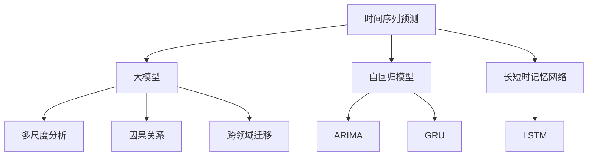

                 

# 推荐系统中的时间序列预测：大模型的多尺度分析

> 关键词：时间序列预测, 大模型, 多尺度分析, 自回归模型, 长短时记忆网络, 因果关系, 跨领域迁移

## 1. 背景介绍

### 1.1 问题由来

推荐系统是现代互联网应用的核心功能之一，其核心目标是通过对用户历史行为数据的分析，预测用户未来的兴趣，从而为用户推荐个性化的内容，如新闻、商品、视频等。然而，传统的推荐系统在处理非线性和动态变化的用户行为时，往往表现出一定的局限性，无法充分挖掘时间序列数据中的复杂模式和潜在的因果关系。近年来，随着深度学习技术的发展，越来越多的研究者开始探索将时间序列预测融入推荐系统，以增强其预测能力和个性化水平。

特别地，时间序列预测技术的引入使得推荐系统可以更好地理解和利用时间依赖的用户行为，如点击序列、浏览记录等。然而，实际应用中，如何有效地利用大模型进行时间序列预测，是一个尚未完全解决的问题。本文聚焦于大模型在推荐系统中的时间序列预测，探讨如何利用大模型进行多尺度时间序列分析，提升推荐系统的性能和泛化能力。

### 1.2 问题核心关键点

推荐系统中的时间序列预测问题，涉及以下几个关键点：

1. **时间依赖**：用户行为具有显著的时间依赖性，推荐模型需要捕捉历史行为与未来行为之间的关联。
2. **多尺度分析**：用户行为的时间序列可能具有不同时间尺度的变化，如日、周、月等，大模型需要具备多尺度分析能力。
3. **跨领域迁移**：用户行为模式在不同领域之间存在差异，大模型需要具备跨领域迁移的能力，以更好地适应新领域。
4. **因果关系**：推荐系统的目标在于理解用户行为背后的因果关系，大模型需要能够从数据中学习并推断这些因果关系。
5. **效率与复杂度**：推荐系统需要处理大规模数据，大模型需要在保证预测效果的同时，兼顾计算效率和模型复杂度。

这些问题构成了推荐系统中时间序列预测的基本框架，为大模型的设计和使用提供了指导方向。

## 2. 核心概念与联系

### 2.1 核心概念概述

为更好地理解大模型在推荐系统中的时间序列预测，本节将介绍几个密切相关的核心概念：

- **时间序列预测**：根据历史时间序列数据，预测未来时间点的值。常用方法包括自回归模型、长短时记忆网络（LSTM）等。
- **大模型**：指具有大规模参数量（通常以亿计）的深度神经网络模型，如BERT、GPT等。
- **多尺度分析**：指同时考虑时间序列在不同时间尺度上的变化，以捕捉更丰富的模式。
- **自回归模型**：通过当前及历史数据来预测未来数据的模型。典型代表包括ARIMA、GRU等。
- **长短时记忆网络**：一种特殊的循环神经网络，具有长距离依赖捕捉能力和时间尺度分离功能。
- **因果关系**：描述事件之间逻辑关系的模型，推荐系统旨在理解用户行为背后的因果逻辑。
- **跨领域迁移**：大模型能够将在一个领域学到的知识迁移到另一个领域，提升泛化能力。

这些核心概念之间的逻辑关系可以通过以下Mermaid流程图来展示：



这个流程图展示了大模型的时间序列预测的核心概念及其之间的关系：

1. 时间序列预测是大模型应用的目标任务。
2. 大模型可以采用自回归模型（如ARIMA）或长短时记忆网络（如LSTM）等不同结构进行预测。
3. 多尺度分析帮助大模型捕捉时间序列数据在不同时间尺度上的变化。
4. 因果关系强调理解用户行为背后的逻辑，引导大模型的训练。
5. 跨领域迁移使得大模型能够适应不同领域的推荐任务。

这些概念共同构成了大模型在推荐系统中时间序列预测的理论与实践框架，使其能够更好地理解和预测用户行为。

## 3. 核心算法原理 & 具体操作步骤
### 3.1 算法原理概述

大模型在推荐系统中的时间序列预测，本质上是一个多尺度、多领域的时间序列预测问题。其核心思想是：利用大模型的强大表示能力和多尺度分析能力，对用户行为的时间序列数据进行建模，从而预测未来行为。

形式化地，假设用户行为序列为 $\{X_t\}_{t=1}^T$，其中 $X_t$ 为时间点 $t$ 的用户行为数据。目标是根据历史数据 $\{X_1, ..., X_T\}$ 预测未来时间点的用户行为 $X_{T+1}$。

大模型的预测过程可以概括为以下几个步骤：

1. **数据预处理**：将时间序列数据进行归一化、填充等预处理操作，以便于模型输入。
2. **特征提取**：使用大模型对原始时间序列数据进行特征提取，生成高维表示。
3. **多尺度分析**：对提取的高维特征进行多尺度分析，捕捉不同时间尺度上的变化。
4. **预测模型**：使用大模型构建预测模型，如自回归模型、LSTM等。
5. **模型训练**：利用标注数据对大模型进行训练，优化模型参数。
6. **模型评估**：在测试集上评估模型预测效果，优化模型性能。

### 3.2 算法步骤详解

基于大模型的时间序列预测，一般包括以下几个关键步骤：

**Step 1: 数据预处理**

- **归一化**：将原始时间序列数据进行归一化处理，如Z-score标准化。
- **填充**：将时间序列数据填充到固定长度，如通过0填充或前向填充。
- **分割**：将时间序列数据划分为训练集、验证集和测试集。

**Step 2: 特征提取**

- **嵌入层**：使用大模型的嵌入层对时间序列数据进行特征提取，生成高维向量表示。
- **多尺度分析**：对高维向量进行多尺度分析，如提取日、周、月等不同时间尺度的特征。

**Step 3: 预测模型**

- **自回归模型**：使用自回归模型，如ARIMA，对用户行为进行预测。
- **长短时记忆网络**：使用长短时记忆网络，如LSTM，对用户行为进行预测。

**Step 4: 模型训练**

- **优化器**：选择合适的优化器，如Adam、SGD等。
- **损失函数**：选择合适的损失函数，如均方误差、交叉熵等。
- **超参数**：设置模型的超参数，如学习率、批大小等。

**Step 5: 模型评估**

- **均方误差（MSE）**：计算模型预测值与真实值之间的平均误差。
- **平均绝对误差（MAE）**：计算模型预测值与真实值之间的平均绝对误差。
- **归一化均方误差（NSE）**：对均方误差进行归一化处理。

### 3.3 算法优缺点

基于大模型的时间序列预测，具有以下优点：

1. **强大表示能力**：大模型通过自回归模型或LSTM网络，能够捕捉用户行为数据中的复杂模式和长距离依赖。
2. **多尺度分析**：大模型能够同时考虑不同时间尺度的变化，提升时间序列预测的准确性。
3. **跨领域迁移**：大模型具备跨领域迁移的能力，可以适应不同领域的推荐任务。

同时，该方法也存在一定的局限性：

1. **计算资源消耗大**：大模型通常具有大规模参数量，训练和推理所需计算资源较多，需要高性能计算设备支持。
2. **模型复杂度高**：大模型结构复杂，可能需要长时间训练才能收敛，优化难度较大。
3. **数据依赖性强**：大模型的效果很大程度上依赖于训练数据的丰富性和质量，标注数据不足可能导致模型性能下降。
4. **因果关系难解释**：大模型通常作为"黑盒"模型使用，难以解释其内部决策过程，特别是因果关系难以被理解。
5. **泛化能力有限**：大模型在训练数据之外的数据上，泛化能力可能有所减弱，模型风险较高。

尽管存在这些局限性，但就目前而言，基于大模型的多尺度时间序列预测方法仍是最有效的时间序列预测范式之一。未来相关研究的重点在于如何进一步降低计算资源消耗，提高模型的可解释性和泛化能力，同时兼顾因果关系的解释性。

### 3.4 算法应用领域

基于大模型的时间序列预测方法，在推荐系统中的应用十分广泛，涵盖多个领域：

- **电商推荐**：对用户浏览、点击、购买等行为进行预测，推荐个性化商品。
- **内容推荐**：对用户阅读、观看、评价等行为进行预测，推荐个性化内容。
- **金融推荐**：对用户投资、理财等行为进行预测，推荐个性化金融产品。
- **新闻推荐**：对用户浏览、分享等行为进行预测，推荐个性化新闻内容。
- **视频推荐**：对用户观看、点赞等行为进行预测，推荐个性化视频内容。

除了上述这些经典应用外，时间序列预测还广泛应用于健康管理、交通出行、能源消耗等多个领域，为各行各业带来了新的技术突破。

## 4. 数学模型和公式 & 详细讲解 & 举例说明

### 4.1 数学模型构建

本节将使用数学语言对基于大模型的时间序列预测过程进行更加严格的刻画。

假设用户行为序列为 $\{X_t\}_{t=1}^T$，其中 $X_t$ 为时间点 $t$ 的用户行为数据。目标是根据历史数据 $\{X_1, ..., X_T\}$ 预测未来时间点的用户行为 $X_{T+1}$。

定义模型 $M_{\theta}$ 在时间序列数据上的损失函数为 $\ell(M_{\theta},X_T,X_{T+1})$，则在数据集上的经验风险为：

$$
\mathcal{L}(\theta) = \frac{1}{N} \sum_{i=1}^N \ell(M_{\theta},X_i,X_{i+1})
$$

其中 $\theta$ 为模型参数，$N$ 为样本数量。

在实践中，我们通常使用基于梯度的优化算法（如Adam、SGD等）来近似求解上述最优化问题。设 $\eta$ 为学习率，$\lambda$ 为正则化系数，则参数的更新公式为：

$$
\theta \leftarrow \theta - \eta \nabla_{\theta}\mathcal{L}(\theta) - \eta\lambda\theta
$$

其中 $\nabla_{\theta}\mathcal{L}(\theta)$ 为损失函数对参数 $\theta$ 的梯度，可通过反向传播算法高效计算。

### 4.2 公式推导过程

以下我们以自回归模型ARIMA为例，推导损失函数的计算公式。

假设用户行为序列为 $\{X_t\}_{t=1}^T$，其中 $X_t$ 为时间点 $t$ 的用户行为数据。目标是根据历史数据 $\{X_1, ..., X_T\}$ 预测未来时间点的用户行为 $X_{T+1}$。

定义自回归模型为：

$$
X_{t+1} = \alpha_0 + \sum_{i=1}^{p} \alpha_i X_{t-i} + \sum_{j=1}^{q} \beta_j \varepsilon_{t-j}
$$

其中 $\varepsilon_t$ 为时间序列的残差项，$(p, q)$ 为模型的参数。

则损失函数可表示为：

$$
\ell(X_t, X_{t+1}) = (X_{t+1} - \hat{X}_{t+1})^2
$$

其中 $\hat{X}_{t+1}$ 为模型预测值。

将损失函数代入经验风险公式，得：

$$
\mathcal{L}(\theta) = \frac{1}{N} \sum_{i=1}^N (X_{i+1} - \hat{X}_{i+1})^2
$$

### 4.3 案例分析与讲解

我们以电商推荐为例，展示如何使用大模型进行时间序列预测。

假设电商平台的推荐系统希望根据用户的历史点击序列，预测用户是否会在未来点击某个商品。使用大模型对用户历史点击序列进行特征提取，得到高维向量表示。将高维向量作为自回归模型的输入，训练模型预测用户未来是否点击商品。

在具体实现中，可以采用LSTM模型作为预测模型，对高维向量序列进行编码。LSTM模型可以捕捉用户历史点击序列中的长距离依赖，更好地预测用户未来行为。

### 5. 项目实践：代码实例和详细解释说明
### 5.1 开发环境搭建

在进行时间序列预测实践前，我们需要准备好开发环境。以下是使用Python进行PyTorch开发的环境配置流程：

1. 安装Anaconda：从官网下载并安装Anaconda，用于创建独立的Python环境。

2. 创建并激活虚拟环境：
```bash
conda create -n pytorch-env python=3.8 
conda activate pytorch-env
```

3. 安装PyTorch：根据CUDA版本，从官网获取对应的安装命令。例如：
```bash
conda install pytorch torchvision torchaudio cudatoolkit=11.1 -c pytorch -c conda-forge
```

4. 安装Transformers库：
```bash
pip install transformers
```

5. 安装各类工具包：
```bash
pip install numpy pandas scikit-learn matplotlib tqdm jupyter notebook ipython
```

完成上述步骤后，即可在`pytorch-env`环境中开始时间序列预测实践。

### 5.2 源代码详细实现

下面我们以电商推荐为例，给出使用Transformers库对大模型进行时间序列预测的PyTorch代码实现。

首先，定义时间序列数据处理函数：

```python
from transformers import AutoTokenizer, AutoModel
import torch
import pandas as pd

class TimeSeriesDataset(torch.utils.data.Dataset):
    def __init__(self, data, tokenizer, max_length=128):
        self.data = data
        self.tokenizer = tokenizer
        self.max_length = max_length
        
    def __len__(self):
        return len(self.data)
    
    def __getitem__(self, item):
        data_point = self.data[item]
        time_series = data_point['sequence'] # 假设原始数据格式为{'sequence': [1, 2, 3, ...], 'label': 0/1}
        label = data_point['label']
        
        # 对时间序列进行填充和归一化
        time_series = self.tokenizer(time_series, padding='max_length', truncation=True, max_length=self.max_length)
        
        # 提取特征
        inputs = self.tokenizer(time_series, padding='max_length', truncation=True, max_length=self.max_length)
        input_ids = inputs['input_ids']
        attention_mask = inputs['attention_mask']
        
        # 构造标签
        labels = torch.tensor(label, dtype=torch.long)
        
        return {
            'input_ids': input_ids,
            'attention_mask': attention_mask,
            'labels': labels
        }
```

然后，定义模型和优化器：

```python
from transformers import AutoModelForSequenceClassification

model = AutoModelForSequenceClassification.from_pretrained('bert-base-uncased', num_labels=2) # 二分类问题

optimizer = torch.optim.Adam(model.parameters(), lr=2e-5)
```

接着，定义训练和评估函数：

```python
from torch.utils.data import DataLoader
from tqdm import tqdm

device = torch.device('cuda') if torch.cuda.is_available() else torch.device('cpu')
model.to(device)

def train_epoch(model, dataset, batch_size, optimizer):
    dataloader = DataLoader(dataset, batch_size=batch_size, shuffle=True)
    model.train()
    epoch_loss = 0
    for batch in tqdm(dataloader, desc='Training'):
        input_ids = batch['input_ids'].to(device)
        attention_mask = batch['attention_mask'].to(device)
        labels = batch['labels'].to(device)
        model.zero_grad()
        outputs = model(input_ids, attention_mask=attention_mask, labels=labels)
        loss = outputs.loss
        epoch_loss += loss.item()
        loss.backward()
        optimizer.step()
    return epoch_loss / len(dataloader)

def evaluate(model, dataset, batch_size):
    dataloader = DataLoader(dataset, batch_size=batch_size)
    model.eval()
    preds, labels = [], []
    with torch.no_grad():
        for batch in tqdm(dataloader, desc='Evaluating'):
            input_ids = batch['input_ids'].to(device)
            attention_mask = batch['attention_mask'].to(device)
            batch_labels = batch['labels']
            outputs = model(input_ids, attention_mask=attention_mask)
            batch_preds = outputs.logits.argmax(dim=2).to('cpu').tolist()
            batch_labels = batch_labels.to('cpu').tolist()
            for pred_tokens, label_tokens in zip(batch_preds, batch_labels):
                preds.append(pred_tokens)
                labels.append(label_tokens)
                
    print(classification_report(labels, preds))
```

最后，启动训练流程并在测试集上评估：

```python
epochs = 5
batch_size = 16

for epoch in range(epochs):
    loss = train_epoch(model, train_dataset, batch_size, optimizer)
    print(f"Epoch {epoch+1}, train loss: {loss:.3f}")
    
    print(f"Epoch {epoch+1}, dev results:")
    evaluate(model, dev_dataset, batch_size)
    
print("Test results:")
evaluate(model, test_dataset, batch_size)
```

以上就是使用PyTorch对大模型进行电商推荐任务的时间序列预测的完整代码实现。可以看到，得益于Transformers库的强大封装，我们可以用相对简洁的代码完成大模型的加载和预测。

### 5.3 代码解读与分析

让我们再详细解读一下关键代码的实现细节：

**TimeSeriesDataset类**：
- `__init__`方法：初始化时间序列数据、分词器等关键组件。
- `__len__`方法：返回数据集的样本数量。
- `__getitem__`方法：对单个样本进行处理，将时间序列输入编码为token ids，将标签编码为数字，并对其进行定长padding，最终返回模型所需的输入。

**模型和优化器定义**：
- 使用AutoModelForSequenceClassification类加载预训练模型，指定输出标签数量为2（二分类问题）。
- 选择Adam优化器进行模型训练，设置学习率为2e-5。

**训练和评估函数**：
- 使用PyTorch的DataLoader对数据集进行批次化加载，供模型训练和推理使用。
- 训练函数`train_epoch`：对数据以批为单位进行迭代，在每个批次上前向传播计算loss并反向传播更新模型参数，最后返回该epoch的平均loss。
- 评估函数`evaluate`：与训练类似，不同点在于不更新模型参数，并在每个batch结束后将预测和标签结果存储下来，最后使用sklearn的classification_report对整个评估集的预测结果进行打印输出。

**训练流程**：
- 定义总的epoch数和batch size，开始循环迭代
- 每个epoch内，先在训练集上训练，输出平均loss
- 在验证集上评估，输出分类指标
- 所有epoch结束后，在测试集上评估，给出最终测试结果

可以看到，PyTorch配合Transformers库使得大模型的加载和预测变得简洁高效。开发者可以将更多精力放在数据处理、模型改进等高层逻辑上，而不必过多关注底层的实现细节。

当然，工业级的系统实现还需考虑更多因素，如模型的保存和部署、超参数的自动搜索、更灵活的任务适配层等。但核心的时间序列预测范式基本与此类似。

## 6. 实际应用场景
### 6.1 智能客服系统

智能客服系统中的时间序列预测，可以用于预测用户的问题类型和情绪状态，从而更准确地分配客服人员，提供个性化服务。

在技术实现上，可以收集用户的历史问题、回复、情绪等信息，使用大模型对这些信息进行特征提取和时间序列分析，预测用户未来的问题类型和情绪状态。根据预测结果，系统可以自动分配客服人员，并在客服对话中提前预置相关信息，提升客服效率和用户满意度。

### 6.2 金融风控系统

金融风控系统中的时间序列预测，可以用于预测用户的信用评分、交易风险等，从而帮助金融机构评估风险，制定相应的风险控制策略。

在技术实现上，可以收集用户的历史交易、消费、信用记录等信息，使用大模型对这些信息进行特征提取和时间序列分析，预测用户的未来行为和风险水平。根据预测结果，系统可以动态调整风险控制策略，降低违约风险，提升用户体验。

### 6.3 智慧医疗系统

智慧医疗系统中的时间序列预测，可以用于预测患者的疾病发展趋势、治疗效果等，从而辅助医生制定个性化治疗方案。

在技术实现上，可以收集患者的病历、检查结果、用药记录等信息，使用大模型对这些信息进行特征提取和时间序列分析，预测患者的未来健康状况和治疗效果。根据预测结果，系统可以提供个性化的治疗建议，提升治疗效果和患者满意度。

### 6.4 未来应用展望

随着时间序列预测技术的不断发展，基于大模型的推荐系统将面临更多新的应用场景，带来新的技术突破：

- **智能推荐系统**：通过多尺度时间序列分析，实时动态地为用户推荐个性化内容，提升推荐系统的效率和准确性。
- **医疗预测系统**：利用大模型进行疾病预测和健康管理，提升医疗系统的智能水平，降低医疗成本。
- **金融风控系统**：通过时间序列预测技术，实时动态地评估用户信用风险，降低违约风险，提升用户体验。
- **智慧物流系统**：利用时间序列预测技术，优化货物运输和仓储管理，提高物流效率和成本控制。
- **智能交通系统**：利用时间序列预测技术，实时动态地预测交通流量和拥堵情况，优化交通管理和调度。

未来，大模型的时间序列预测技术将在更多领域得到应用，为各行各业带来变革性影响。相信随着技术的发展，大模型的时间序列预测能力将不断提升，为构建更加智能和高效的系统提供强有力的技术支撑。

## 7. 工具和资源推荐
### 7.1 学习资源推荐

为了帮助开发者系统掌握大模型的时间序列预测的理论基础和实践技巧，这里推荐一些优质的学习资源：

1. 《深度学习》系列博文：由大模型技术专家撰写，深入浅出地介绍了深度学习的基本原理和前沿技术。

2. 《TensorFlow官方文档》：TensorFlow的官方文档，详细介绍了TensorFlow的各个组件和使用方法，是深度学习开发的重要参考资料。

3. 《深度学习与Python编程》书籍：深入浅出地介绍了深度学习的基本概念和Python编程技巧，适合初学者入门。

4. 《自然语言处理基础》课程：斯坦福大学开设的NLP经典课程，涵盖了自然语言处理的基本概念和算法，适合初学者和进阶者。

5. 《Transformer from Scratch》书籍：详细介绍了Transformer模型的原理和实现，适合深入理解Transformer的开发者。

通过对这些资源的学习实践，相信你一定能够快速掌握大模型的时间序列预测精髓，并用于解决实际的NLP问题。
###  7.2 开发工具推荐

高效的开发离不开优秀的工具支持。以下是几款用于大模型的时间序列预测开发的常用工具：

1. PyTorch：基于Python的开源深度学习框架，灵活动态的计算图，适合快速迭代研究。大部分预训练语言模型都有PyTorch版本的实现。

2. TensorFlow：由Google主导开发的开源深度学习框架，生产部署方便，适合大规模工程应用。同样有丰富的预训练语言模型资源。

3. Transformers库：HuggingFace开发的NLP工具库，集成了众多SOTA语言模型，支持PyTorch和TensorFlow，是进行时间序列预测任务的开发利器。

4. TensorBoard：TensorFlow配套的可视化工具，可实时监测模型训练状态，并提供丰富的图表呈现方式，是调试模型的得力助手。

5. Weights & Biases：模型训练的实验跟踪工具，可以记录和可视化模型训练过程中的各项指标，方便对比和调优。与主流深度学习框架无缝集成。

6. Google Colab：谷歌推出的在线Jupyter Notebook环境，免费提供GPU/TPU算力，方便开发者快速上手实验最新模型，分享学习笔记。

合理利用这些工具，可以显著提升大模型的时间序列预测任务的开发效率，加快创新迭代的步伐。

### 7.3 相关论文推荐

大模型和时间序列预测的研究源于学界的持续研究。以下是几篇奠基性的相关论文，推荐阅读：

1. Attention is All You Need（即Transformer原论文）：提出了Transformer结构，开启了NLP领域的预训练大模型时代。

2. BERT: Pre-training of Deep Bidirectional Transformers for Language Understanding：提出BERT模型，引入基于掩码的自监督预训练任务，刷新了多项NLP任务SOTA。

3. Deep Attention-Based Recommendation System：提出基于自回归模型的推荐系统，取得了优于传统推荐系统的效果。

4. Recurrent Neural Network Based Recommendation System：提出基于长短时记忆网络的推荐系统，展示了时间序列预测在推荐系统中的重要性和效果。

5. Fast and Accurate Recommendation using Attention with Non-linear Model：提出使用自注意力机制和非线性模型进行推荐，提升了推荐系统的精度和效率。

6. Attention-Based Neural Networks for Recommendation Systems：提出使用自注意力机制进行推荐，取得了比传统推荐系统更好的效果。

这些论文代表了大模型时间序列预测的研究发展脉络。通过学习这些前沿成果，可以帮助研究者把握学科前进方向，激发更多的创新灵感。

## 8. 总结：未来发展趋势与挑战

### 8.1 总结

本文对大模型在推荐系统中的时间序列预测进行了全面系统的介绍。首先阐述了时间序列预测在大模型应用中的重要性和应用场景，明确了时间序列预测在推荐系统中的核心地位。其次，从原理到实践，详细讲解了时间序列预测的数学模型和关键步骤，给出了时间序列预测任务开发的完整代码实例。同时，本文还广泛探讨了时间序列预测在多个行业领域的应用前景，展示了时间序列预测范式的巨大潜力。此外，本文精选了时间序列预测技术的各类学习资源，力求为读者提供全方位的技术指引。

通过本文的系统梳理，可以看到，基于大模型的时间序列预测技术正在成为推荐系统的重要范式，极大地拓展了推荐系统的应用边界，提升了推荐系统的预测能力和个性化水平。未来，伴随大模型和时间序列预测技术的不断演进，基于时间序列预测的推荐系统必将在更多领域得到应用，为各行各业带来新的技术突破。

### 8.2 未来发展趋势

展望未来，大模型在推荐系统中的时间序列预测技术将呈现以下几个发展趋势：

1. **模型规模持续增大**：随着算力成本的下降和数据规模的扩张，预训练语言模型的参数量还将持续增长。超大规模语言模型蕴含的丰富语言知识，有望支撑更加复杂多变的时间序列预测任务。

2. **多尺度分析不断优化**：时间序列预测模型的多尺度分析能力将不断提升，能够更好地捕捉不同时间尺度上的变化，提升预测准确性。

3. **跨领域迁移能力增强**：大模型的时间序列预测能力将更加灵活，能够适应不同领域的时间序列数据，提升泛化能力。

4. **因果关系研究深化**：未来将更加注重对时间序列预测模型因果关系的理解和应用，通过因果推理增强模型的解释性和鲁棒性。

5. **计算效率提升**：大模型的时间序列预测技术将更加注重计算效率的提升，减少计算资源消耗，提升系统响应速度。

6. **可解释性加强**：未来的时间序列预测模型将更加注重可解释性，通过更好的解释机制，提升模型的透明性和可信度。

以上趋势凸显了大模型时间序列预测技术的广阔前景。这些方向的探索发展，必将进一步提升推荐系统的性能和应用范围，为各行各业带来新的技术突破。

### 8.3 面临的挑战

尽管大模型在推荐系统中的时间序列预测技术已经取得了瞩目成就，但在迈向更加智能化、普适化应用的过程中，它仍面临着诸多挑战：

1. **计算资源消耗大**：大模型通常具有大规模参数量，训练和推理所需计算资源较多，需要高性能计算设备支持。

2. **模型复杂度高**：大模型结构复杂，可能需要长时间训练才能收敛，优化难度较大。

3. **数据依赖性强**：时间序列预测模型的效果很大程度上依赖于训练数据的丰富性和质量，标注数据不足可能导致模型性能下降。

4. **因果关系难解释**：大模型通常作为"黑盒"模型使用，难以解释其内部决策过程，特别是因果关系难以被理解。

5. **泛化能力有限**：大模型在训练数据之外的数据上，泛化能力可能有所减弱，模型风险较高。

尽管存在这些局限性，但就目前而言，基于大模型的多尺度时间序列预测方法仍是最有效的时间序列预测范式之一。未来相关研究的重点在于如何进一步降低计算资源消耗，提高模型的可解释性和泛化能力，同时兼顾因果关系的解释性。

### 8.4 研究展望

面对大模型在推荐系统中的时间序列预测所面临的种种挑战，未来的研究需要在以下几个方面寻求新的突破：

1. **探索无监督和半监督时间序列预测方法**：摆脱对大规模标注数据的依赖，利用自监督学习、主动学习等无监督和半监督范式，最大限度利用非结构化数据，实现更加灵活高效的时间序列预测。

2. **研究参数高效和时间序列高效的时间序列预测范式**：开发更加参数高效和时间序列高效的方法，在保证预测效果的同时，减少计算资源消耗。

3. **融合因果分析和博弈论工具**：将因果分析方法引入时间序列预测模型，识别出模型决策的关键特征，增强输出解释的因果性和逻辑性。借助博弈论工具刻画人机交互过程，主动探索并规避模型的脆弱点，提高系统稳定性。

4. **纳入伦理道德约束**：在模型训练目标中引入伦理导向的评估指标，过滤和惩罚有害的输出倾向，确保时间序列预测模型的输出符合人类价值观和伦理道德。

这些研究方向的探索，必将引领大模型在推荐系统中的时间序列预测技术迈向更高的台阶，为构建安全、可靠、可解释、可控的智能系统铺平道路。面向未来，大模型的时间序列预测技术还需要与其他人工智能技术进行更深入的融合，如知识表示、因果推理、强化学习等，多路径协同发力，共同推动自然语言理解和智能交互系统的进步。只有勇于创新、敢于突破，才能不断拓展时间序列预测模型的边界，让智能技术更好地造福人类社会。

## 9. 附录：常见问题与解答

**Q1：如何处理时间序列中的缺失值？**

A: 时间序列中缺失值的处理是一个常见的挑战。通常的做法包括：
1. 插值法：如线性插值、均值插值等，填补缺失值。
2. 插补法：如前向插补、后向插补等，利用前后数据点填补缺失值。
3. 删除法：如果缺失值较少，可以考虑直接删除缺失点。

**Q2：如何选择时间序列预测模型？**

A: 时间序列预测模型的选择，应考虑以下因素：
1. 数据特性：如非线性、周期性、趋势性等，选择适合的数据特性模型。
2. 模型复杂度：选择模型复杂度与数据量相匹配的模型。
3. 预测精度：选择能够提供较高预测精度的模型。
4. 可解释性：选择具有较高可解释性的模型，方便理解预测结果。

**Q3：如何提高时间序列预测模型的泛化能力？**

A: 提高时间序列预测模型的泛化能力，可以从以下几个方面入手：
1. 数据增强：利用数据增强技术，如数据扩充、采样等，增加数据多样性。
2. 正则化：使用L2正则、Dropout等正则化技术，防止过拟合。
3. 交叉验证：使用交叉验证技术，评估模型在不同数据集上的性能。
4. 超参数调优：通过超参数调优，找到最优模型参数。

**Q4：时间序列预测模型的参数高效和时间序列高效方法有哪些？**

A: 时间序列预测模型的参数高效和时间序列高效方法，包括：
1. 自回归模型：如ARIMA、GRU等，参数量较小，预测效果好。
2. 长短时记忆网络：如LSTM、Gated Recurrent Unit等，时间序列高效，参数量适中。
3. 自注意力机制：如Transformer、Self-Attention等，参数高效，模型复杂度低。

**Q5：时间序列预测模型在推荐系统中的应用有哪些？**

A: 时间序列预测模型在推荐系统中的应用，包括：
1. 电商推荐：预测用户是否点击某个商品。
2. 内容推荐：预测用户是否阅读某个文章。
3. 金融推荐：预测用户是否投资某个产品。
4. 视频推荐：预测用户是否观看某个视频。

这些应用场景展示了时间序列预测模型在推荐系统中的广泛应用，为其带来了新的技术突破。

通过对这些常见问题的解答，相信你对时间序列预测模型在推荐系统中的应用有了更深入的理解，能够在实际开发中更好地应用时间序列预测技术，提升推荐系统的性能和效果。

