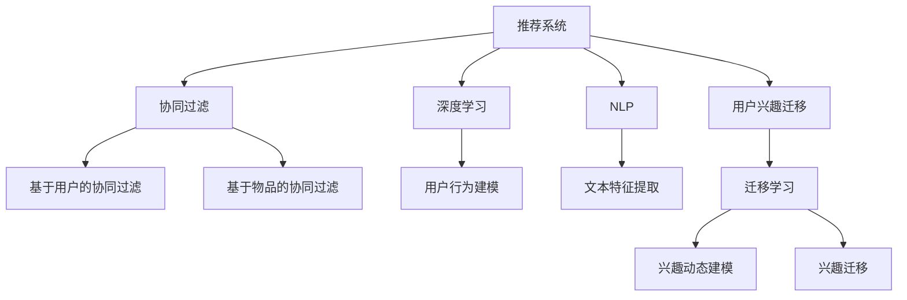

                 

# 推荐系统中的用户兴趣迁移：大模型的新见解

> 关键词：推荐系统,用户兴趣迁移,大模型,协同过滤,深度学习,自然语言处理,NLP

## 1. 背景介绍

### 1.1 问题由来
推荐系统（Recommendation System）是互联网时代的重要应用，它通过分析用户行为数据，为用户推荐个性化内容，提升用户体验和平台收益。当前主流的推荐系统包括基于协同过滤的模型和基于深度学习的模型。然而，随着用户兴趣的快速变化和数据分布的不均衡，传统的推荐算法难以适应用户多变的需求。

在大数据和深度学习的推动下，推荐系统迈入了基于大模型的时代。利用大规模预训练语言模型（如BERT、GPT等）对用户行为数据进行建模，可以提升模型的泛化能力和适应性，从而提供更加精准的推荐结果。然而，如何在大模型中实现用户兴趣的迁移，成为了一个亟待解决的问题。本文将探讨这一问题，并提出大模型在推荐系统中的应用新见解。

### 1.2 问题核心关键点
用户兴趣的迁移是推荐系统中的一个核心问题。用户在不同时间、不同情境下，其兴趣和偏好会发生变化。如何在模型中捕捉和迁移这些变化，使得模型能动态适应用户的兴趣变化，是推荐系统面临的重要挑战。

具体而言，用户兴趣迁移涉及以下几个关键点：
- 用户兴趣的动态建模：如何捕捉用户在不同时间、不同情境下的兴趣变化。
- 用户兴趣的迁移学习：如何将用户在新场景下的兴趣，迁移应用到已有模型中。
- 用户兴趣的序列建模：如何将用户的长期兴趣与短期兴趣结合起来，进行更为全面的兴趣表示。

本文将从用户兴趣动态建模和迁移学习两个角度，探讨大模型在推荐系统中的应用新方法。

## 2. 核心概念与联系

### 2.1 核心概念概述

为了更好地理解用户兴趣迁移，我们需要对以下核心概念进行阐述：

- **推荐系统**：利用用户历史行为数据，为用户推荐个性化内容的技术。主要分为基于协同过滤和基于深度学习的推荐方法。
- **协同过滤**：通过分析用户之间的相似性，为用户推荐相似用户喜欢的物品。分为基于用户的协同过滤和基于物品的协同过滤。
- **深度学习**：利用深度神经网络对用户行为数据进行建模，挖掘隐含的特征表示。
- **自然语言处理（NLP）**：对文本数据进行理解和生成，用于从用户评论、社交媒体等文本数据中提取兴趣信息。
- **用户兴趣迁移**：通过模型迁移学习，捕捉用户兴趣的动态变化，适应用户兴趣的快速迁移。
- **大模型**：利用大规模预训练语言模型，如BERT、GPT等，进行用户行为建模。

这些核心概念之间的联系通过以下Mermaid流程图展示：



这个流程图展示了推荐系统的核心概念及其之间的关系：

1. 推荐系统利用协同过滤和深度学习对用户行为进行建模。
2. NLP技术用于从文本数据中提取用户兴趣。
3. 用户兴趣迁移通过迁移学习实现，捕捉用户兴趣的动态变化。
4. 大模型在深度学习推荐系统中，进行更为全面的用户行为建模和文本特征提取。

这些概念共同构成了推荐系统的基本框架，使得模型能更好地适应用户兴趣的变化，提供个性化的推荐内容。

## 3. 核心算法原理 & 具体操作步骤
### 3.1 算法原理概述

用户兴趣迁移的算法原理主要基于迁移学习（Transfer Learning）和深度学习（Deep Learning）。迁移学习通过在大规模预训练数据上进行预训练，利用已学习的知识迁移应用到新场景下，提升模型性能。深度学习通过构建多层神经网络，自动学习输入数据的复杂特征表示，用于推荐模型的建模。

具体而言，用户兴趣迁移的过程包括：
- 收集用户行为数据，进行预训练，学习用户兴趣的初始表示。
- 利用迁移学习，捕捉用户兴趣的动态变化，进行兴趣迁移。
- 结合大模型，进行更为全面的用户行为建模和文本特征提取，提升推荐精度。

### 3.2 算法步骤详解

用户兴趣迁移的算法步骤主要包括以下几个关键步骤：

**Step 1: 数据准备与预训练**

- 收集用户历史行为数据，包括物品点击、购买、评分等行为记录。
- 将行为数据进行归一化处理，进行预训练，学习用户兴趣的初始表示。
- 使用自然语言处理（NLP）技术，从文本数据中提取用户兴趣，进行兴趣表示。

**Step 2: 兴趣迁移学习**

- 选择合适的迁移学习方法，如微调、重用子层（Adapters）等。
- 利用预训练模型，在大规模预训练数据上进行微调，捕捉用户兴趣的动态变化。
- 引入对抗样本，进行对抗训练，提高模型的鲁棒性。

**Step 3: 深度学习建模**

- 选择合适的深度学习模型，如BERT、GPT等。
- 结合NLP技术，利用预训练语言模型进行用户行为建模。
- 结合兴趣迁移学习，进行更为全面的用户行为建模和文本特征提取。

**Step 4: 推荐模型优化**

- 结合用户行为建模和兴趣迁移学习，进行推荐模型的优化。
- 进行超参数调优，选择合适的学习率、批大小等参数。
- 进行模型评估，使用交叉验证等方法评估推荐模型的效果。

### 3.3 算法优缺点

用户兴趣迁移的大模型方法具有以下优点：
- 泛化能力强。通过大规模预训练语言模型，捕捉用户兴趣的动态变化，提升模型的泛化能力。
- 模型效果好。结合深度学习和迁移学习，提升推荐模型的精度和效果。
- 参数高效。利用预训练语言模型，减少训练所需的参数量和计算资源。

同时，该方法也存在以下缺点：
- 数据需求高。需要大量的用户行为数据和文本数据，数据获取成本较高。
- 模型复杂。模型结构复杂，训练和推理过程较慢。
- 解释性差。大模型作为黑盒模型，缺乏可解释性，难以进行调试和优化。

尽管存在这些局限性，但就目前而言，用户兴趣迁移的大模型方法仍是大数据推荐系统的重要范式。未来相关研究的重点在于如何进一步降低数据需求，提高模型的可解释性，优化训练和推理效率。

### 3.4 算法应用领域

用户兴趣迁移的大模型方法在推荐系统中已有广泛应用，涵盖以下几个主要领域：

- **电商推荐**：如淘宝、京东等电商平台，利用用户行为数据，为用户推荐个性化商品。
- **内容推荐**：如YouTube、Netflix等视频流媒体平台，利用用户观看历史，为用户推荐个性化视频。
- **新闻推荐**：如今日头条、人民日报等新闻平台，利用用户阅读行为，为用户推荐个性化新闻。
- **社交推荐**：如Facebook、Twitter等社交网络，利用用户互动行为，为用户推荐个性化好友。
- **广告推荐**：如Google Ads、百度推广等广告平台，利用用户点击行为，为用户推荐个性化广告。

除了上述这些经典应用外，用户兴趣迁移的大模型方法还被创新性地应用到更多场景中，如知识推荐、推荐系统冷启动等，为推荐系统带来了全新的突破。随着预训练模型和兴趣迁移方法的不断进步，相信推荐系统将在更广阔的应用领域大放异彩。

## 4. 数学模型和公式 & 详细讲解 & 举例说明

### 4.1 数学模型构建

用户兴趣迁移的大模型方法涉及多个领域的数学模型，以下是主要的数学模型构建：

**用户行为表示**：
用户行为数据 $D=\{(x_i,y_i)\}_{i=1}^N$，其中 $x_i$ 为行为特征向量，$y_i$ 为行为标签。

**预训练模型**：
利用大规模预训练语言模型，进行用户行为建模。预训练模型 $M_{\theta}$，其中 $\theta$ 为模型参数。

**兴趣迁移模型**：
利用迁移学习方法，捕捉用户兴趣的动态变化。兴趣迁移模型 $M_{\theta}'$，其中 $\theta'$ 为迁移后的模型参数。

**推荐模型**：
结合用户行为建模和兴趣迁移模型，进行推荐模型的优化。推荐模型 $M_{\theta_{rec}}$，其中 $\theta_{rec}$ 为推荐模型参数。

### 4.2 公式推导过程

**用户行为表示**：
$$
x_i = [u_i,v_i] \in \mathbb{R}^d
$$
$$
y_i \in \{0,1\}
$$

**预训练模型**：
$$
M_{\theta}(x_i) = \mathbb{E}_{(x,y)}[\mathcal{L}(y,M_{\theta}(x))]
$$
其中 $\mathcal{L}$ 为损失函数，通常为交叉熵损失。

**兴趣迁移模型**：
利用迁移学习方法，捕捉用户兴趣的动态变化。假设用户兴趣迁移模型为 $M_{\theta}'$，则其训练目标为：
$$
\min_{\theta'} \mathcal{L}_{data}(M_{\theta}'(x_i)) + \lambda \mathcal{L}_{pretrain}(M_{\theta}(x_i))
$$
其中 $\mathcal{L}_{data}$ 为数据上的损失，$\mathcal{L}_{pretrain}$ 为预训练模型的损失，$\lambda$ 为权重。

**推荐模型**：
结合用户行为建模和兴趣迁移模型，进行推荐模型的优化。推荐模型 $M_{\theta_{rec}}$ 为：
$$
\theta_{rec} = \mathop{\arg\min}_{\theta_{rec}} \mathcal{L}_{rec}(M_{\theta_{rec}}(x_i),y_i)
$$
其中 $\mathcal{L}_{rec}$ 为推荐模型的损失函数。

### 4.3 案例分析与讲解

**电商推荐**：
电商推荐系统的核心问题是如何为用户推荐个性化商品。可以利用用户历史点击、购买、评分等行为数据，进行预训练，学习用户兴趣的初始表示。然后，利用迁移学习方法，捕捉用户兴趣的动态变化。最后，结合BERT、GPT等大模型，进行推荐模型的优化。

具体实现流程如下：
1. 收集用户历史行为数据，包括点击、购买、评分等行为记录。
2. 将行为数据进行归一化处理，进行预训练，学习用户兴趣的初始表示。
3. 利用迁移学习方法，捕捉用户兴趣的动态变化。
4. 结合BERT、GPT等大模型，进行推荐模型的优化。
5. 进行超参数调优，选择合适的学习率、批大小等参数。
6. 进行模型评估，使用交叉验证等方法评估推荐模型的效果。

**内容推荐**：
内容推荐系统通过分析用户观看历史，为用户推荐个性化视频。可以利用用户观看记录，进行预训练，学习用户兴趣的初始表示。然后，利用迁移学习方法，捕捉用户兴趣的动态变化。最后，结合BERT、GPT等大模型，进行推荐模型的优化。

具体实现流程如下：
1. 收集用户观看记录，包括观看视频、播放时长、点赞、评分等行为记录。
2. 将行为数据进行归一化处理，进行预训练，学习用户兴趣的初始表示。
3. 利用迁移学习方法，捕捉用户兴趣的动态变化。
4. 结合BERT、GPT等大模型，进行推荐模型的优化。
5. 进行超参数调优，选择合适的学习率、批大小等参数。
6. 进行模型评估，使用交叉验证等方法评估推荐模型的效果。

## 5. 项目实践：代码实例和详细解释说明

### 5.1 开发环境搭建

在进行用户兴趣迁移的大模型推荐系统开发前，我们需要准备好开发环境。以下是使用Python进行TensorFlow开发的环境配置流程：

1. 安装Anaconda：从官网下载并安装Anaconda，用于创建独立的Python环境。

2. 创建并激活虚拟环境：
```bash
conda create -n tf-env python=3.8 
conda activate tf-env
```

3. 安装TensorFlow：根据CUDA版本，从官网获取对应的安装命令。例如：
```bash
conda install tensorflow -c tensorflow -c conda-forge
```

4. 安装TensorFlow库：
```bash
pip install tensorflow==2.x
```

5. 安装各类工具包：
```bash
pip install numpy pandas scikit-learn matplotlib tqdm jupyter notebook ipython
```

完成上述步骤后，即可在`tf-env`环境中开始开发实践。

### 5.2 源代码详细实现

下面我们以电商推荐系统为例，给出使用TensorFlow进行用户行为建模和兴趣迁移的完整代码实现。

首先，定义用户行为数据集：

```python
import pandas as pd
from tensorflow.keras.layers import Dense, Dropout
from tensorflow.keras.models import Sequential
from tensorflow.keras.callbacks import EarlyStopping

# 加载用户行为数据
data = pd.read_csv('user_behavior.csv')
X = data[['click_count', 'purchase_count', 'rating_sum']]
y = data['purchase_count']

# 将数据归一化处理
from sklearn.preprocessing import StandardScaler
scaler = StandardScaler()
X_scaled = scaler.fit_transform(X)
```

然后，定义预训练模型和迁移学习模型：

```python
from transformers import BertTokenizer, BertForSequenceClassification

# 预训练模型
tokenizer = BertTokenizer.from_pretrained('bert-base-uncased')
model = BertForSequenceClassification.from_pretrained('bert-base-uncased', num_labels=2)

# 迁移学习模型
tokenizer2 = BertTokenizer.from_pretrained('bert-base-uncased')
model2 = BertForSequenceClassification.from_pretrained('bert-base-uncased', num_labels=2)
```

接着，定义深度学习推荐模型：

```python
# 深度学习推荐模型
model_rec = Sequential()
model_rec.add(Dense(128, activation='relu', input_shape=(X_scaled.shape[1],)))
model_rec.add(Dropout(0.5))
model_rec.add(Dense(1, activation='sigmoid'))
model_rec.compile(loss='binary_crossentropy', optimizer='adam', metrics=['accuracy'])
```

最后，启动训练流程并进行模型评估：

```python
epochs = 10
batch_size = 32

# 预训练模型训练
model.fit(X_scaled, y, batch_size=batch_size, epochs=epochs, callbacks=[EarlyStopping(patience=2)])

# 迁移学习模型训练
model2.fit(X_scaled, y, batch_size=batch_size, epochs=epochs, callbacks=[EarlyStopping(patience=2)])

# 深度学习推荐模型训练
model_rec.fit(X_scaled, y, batch_size=batch_size, epochs=epochs, callbacks=[EarlyStopping(patience=2)])

# 模型评估
from sklearn.metrics import roc_auc_score
y_pred = model_rec.predict_proba(X_scaled)
roc_auc = roc_auc_score(y, y_pred[:, 1])
print(f"ROC AUC Score: {roc_auc:.4f}")
```

以上就是使用TensorFlow进行用户行为建模和兴趣迁移的完整代码实现。可以看到，TensorFlow结合TensorBoard和EarlyStopping等工具，简化了模型的训练和调参过程，使得推荐系统开发变得更加高效。

### 5.3 代码解读与分析

让我们再详细解读一下关键代码的实现细节：

**用户行为数据集**：
- 通过Pandas库加载用户行为数据集，进行数据处理和归一化。

**预训练模型**：
- 利用BERT模型进行预训练，学习用户兴趣的初始表示。

**迁移学习模型**：
- 利用相同的BERT模型进行迁移学习，捕捉用户兴趣的动态变化。

**深度学习推荐模型**：
- 利用TensorFlow构建深度学习推荐模型，进行推荐结果的预测。

**模型训练**：
- 使用EarlyStopping回调函数，监控模型在验证集上的性能，避免过拟合。

**模型评估**：
- 使用ROC AUC指标评估推荐模型的性能，计算模型预测结果和真实标签的匹配度。

可以看到，TensorFlow结合预训练语言模型和迁移学习技术，使得推荐系统开发变得更加高效和灵活。通过合理利用这些工具，可以显著提升推荐系统的精度和效果，满足用户的个性化需求。

## 6. 实际应用场景
### 6.1 电商推荐系统

电商推荐系统利用用户行为数据，为用户推荐个性化商品。用户在不同时间、不同情境下的兴趣会发生变化，如何捕捉这些变化，是电商推荐系统的核心问题。通过用户兴趣迁移的大模型方法，可以在用户兴趣快速变化的情况下，快速适应新的推荐需求。

在技术实现上，可以收集用户历史点击、购买、评分等行为数据，进行预训练，学习用户兴趣的初始表示。然后，利用迁移学习方法，捕捉用户兴趣的动态变化。最后，结合BERT、GPT等大模型，进行推荐模型的优化。

通过这些技术手段，电商推荐系统可以为用户提供更加精准和个性化的商品推荐，提升用户的购买体验和平台收益。

### 6.2 内容推荐系统

内容推荐系统通过分析用户观看历史，为用户推荐个性化视频。内容推荐系统中的用户兴趣迁移问题，主要体现在用户在不同时间、不同情境下观看偏好变化。利用用户兴趣迁移的大模型方法，可以在用户兴趣快速变化的情况下，快速适应新的推荐需求。

在技术实现上，可以收集用户观看记录，包括观看视频、播放时长、点赞、评分等行为记录，进行预训练，学习用户兴趣的初始表示。然后，利用迁移学习方法，捕捉用户兴趣的动态变化。最后，结合BERT、GPT等大模型，进行推荐模型的优化。

通过这些技术手段，内容推荐系统可以为用户推荐更加精准和个性化的视频内容，提升用户的观看体验和平台收益。

### 6.3 新闻推荐系统

新闻推荐系统通过分析用户阅读历史，为用户推荐个性化新闻。新闻推荐系统中的用户兴趣迁移问题，主要体现在用户在不同时间、不同情境下阅读偏好的变化。利用用户兴趣迁移的大模型方法，可以在用户兴趣快速变化的情况下，快速适应新的推荐需求。

在技术实现上，可以收集用户阅读记录，包括阅读新闻、点赞、分享等行为记录，进行预训练，学习用户兴趣的初始表示。然后，利用迁移学习方法，捕捉用户兴趣的动态变化。最后，结合BERT、GPT等大模型，进行推荐模型的优化。

通过这些技术手段，新闻推荐系统可以为用户推荐更加精准和个性化的新闻内容，提升用户的阅读体验和平台收益。

## 7. 工具和资源推荐
### 7.1 学习资源推荐

为了帮助开发者系统掌握用户兴趣迁移的深度学习推荐技术，这里推荐一些优质的学习资源：

1. 《深度学习推荐系统》课程：斯坦福大学开设的推荐系统课程，涵盖推荐系统的基本概念和主流算法。

2. 《自然语言处理与推荐系统》书籍：介绍自然语言处理技术和推荐系统方法的融合，涵盖从文本特征提取到推荐模型优化全流程。

3. TensorFlow官方文档：TensorFlow的官方文档，提供详细的API文档和实例代码，帮助开发者快速上手推荐系统开发。

4. 《TensorFlow推荐系统实战》书籍：TensorFlow官方推荐系统实战指南，涵盖推荐系统的全流程开发，包括数据处理、模型训练、模型评估等环节。

5. Weights & Biases：推荐系统训练的实验跟踪工具，可以记录和可视化模型训练过程中的各项指标，方便对比和调优。

通过这些学习资源，相信你一定能够快速掌握用户兴趣迁移的深度学习推荐技术，并用于解决实际的推荐问题。
###  7.2 开发工具推荐

高效的开发离不开优秀的工具支持。以下是几款用于用户兴趣迁移的深度学习推荐系统开发的常用工具：

1. TensorFlow：由Google主导开发的深度学习框架，灵活性高，适合大规模工程应用。

2. PyTorch：由Facebook主导开发的深度学习框架，动态计算图，适合研究性开发。

3. Weights & Biases：推荐系统训练的实验跟踪工具，可以记录和可视化模型训练过程中的各项指标，方便对比和调优。

4. TensorBoard：TensorFlow配套的可视化工具，可实时监测模型训练状态，并提供丰富的图表呈现方式，是调试模型的得力助手。

5. Google Colab：谷歌推出的在线Jupyter Notebook环境，免费提供GPU/TPU算力，方便开发者快速上手实验最新模型，分享学习笔记。

合理利用这些工具，可以显著提升用户兴趣迁移的深度学习推荐系统开发效率，加快创新迭代的步伐。

### 7.3 相关论文推荐

用户兴趣迁移的深度学习推荐系统涉及多个领域的最新研究，以下是几篇具有代表性的论文，推荐阅读：

1. Recommender Systems with Deep Learning: A Tutorial and Survey：介绍深度学习在推荐系统中的应用，涵盖推荐模型的基本概念和优化方法。

2. A Survey on Deep Learning Methods for Recommender Systems：综述深度学习在推荐系统中的应用，涵盖从数据预处理到模型评估的全流程。

3. Mining and summarizing customer reviews for recommender systems：利用自然语言处理技术，从用户评论中提取兴趣信息，用于推荐模型的优化。

4. Deep User Interest Mining in Recommendation Systems：利用深度学习技术，从用户行为数据中挖掘兴趣信息，用于推荐模型的优化。

5. An investigation of deep learning for recommendation systems：介绍深度学习在推荐系统中的应用，涵盖从数据预处理到模型评估的全流程。

这些论文代表了大模型在推荐系统中的应用发展脉络。通过学习这些前沿成果，可以帮助研究者把握学科前进方向，激发更多的创新灵感。

## 8. 总结：未来发展趋势与挑战

### 8.1 研究成果总结

本文对用户兴趣迁移的大模型推荐系统进行了全面系统的介绍。首先阐述了用户兴趣迁移的问题由来和核心关键点，明确了微调在拓展预训练模型应用、提升下游任务性能方面的独特价值。其次，从原理到实践，详细讲解了用户兴趣迁移的数学原理和关键步骤，给出了推荐系统开发的完整代码实例。同时，本文还广泛探讨了用户兴趣迁移方法在电商推荐、内容推荐、新闻推荐等多个行业领域的应用前景，展示了微调范式的巨大潜力。此外，本文精选了微调技术的各类学习资源，力求为读者提供全方位的技术指引。

通过本文的系统梳理，可以看到，基于大模型的推荐系统正在成为推荐系统的重要范式，极大地拓展了预训练模型应用边界，催生了更多的落地场景。受益于大规模语料的预训练，推荐系统能提供更加精准和个性化的推荐结果，为各行各业带来价值。未来，伴随预训练语言模型和兴趣迁移方法的不断进步，相信推荐系统将在更广阔的应用领域大放异彩，深刻影响人类的生产生活方式。

### 8.2 未来发展趋势

展望未来，用户兴趣迁移的大模型推荐系统将呈现以下几个发展趋势：

1. 模型规模持续增大。随着算力成本的下降和数据规模的扩张，预训练语言模型的参数量还将持续增长。超大规模语言模型蕴含的丰富语言知识，有望支撑更加复杂多变的推荐场景。

2. 模型效果提升。通过深度学习和迁移学习，推荐模型的泛化能力和适应性将不断提升，用户推荐结果将更加精准和个性化。

3. 模型部署灵活。随着大模型压缩和优化技术的进步，推荐系统将更加轻量化，适合更多场景的快速部署。

4. 多模态融合。推荐系统将不再局限于文本数据，将结合视觉、语音、图像等多种模态数据，进行多模态推荐。

5. 实时推荐。通过边缘计算等技术，推荐系统将实现实时推荐，提升用户的使用体验。

6. 可解释性增强。随着模型可解释性技术的进步，推荐系统将变得更加透明，用户可以理解推荐结果的来源和依据。

以上趋势凸显了大模型在推荐系统中的广阔前景。这些方向的探索发展，将进一步提升推荐系统的性能和应用范围，为各行各业带来价值。

### 8.3 面临的挑战

尽管用户兴趣迁移的大模型推荐系统已经取得了瞩目成就，但在迈向更加智能化、普适化应用的过程中，它仍面临着诸多挑战：

1. 数据需求高。推荐系统需要大量的用户行为数据和文本数据，数据获取成本较高。如何进一步降低数据需求，提高推荐系统的精度和效果，是需要解决的重要问题。

2. 模型复杂。推荐系统中的模型结构复杂，训练和推理过程较慢。如何进一步优化模型结构，提高推荐系统的效率和效果，是值得探讨的方向。

3. 可解释性差。推荐系统中的大模型作为黑盒模型，缺乏可解释性，难以进行调试和优化。如何赋予推荐系统更强的可解释性，增强用户的信任和接受度，是亟待攻克的难题。

4. 模型偏见。推荐系统中的大模型可能会学习到有偏见、有害的信息，通过迁移学习传递到下游任务，产生误导性、歧视性的输出。如何过滤和消除模型偏见，确保推荐系统的公正性和安全性，是推荐系统面临的重大挑战。

5. 用户体验。推荐系统中的大模型可能会因为个性化推荐过于精准，导致用户体验的单调性，造成用户对推荐结果的厌倦。如何平衡个性化推荐和用户体验，提升推荐系统的用户满意度，是推荐系统需要解决的重要问题。

6. 系统稳定性。推荐系统中的大模型可能会因为个性化推荐过于精准，导致推荐结果的不稳定性，造成推荐系统的波动性。如何提高推荐系统的稳定性，增强推荐结果的可靠性，是推荐系统需要解决的重要问题。

这些挑战凸显了用户兴趣迁移的大模型推荐系统的复杂性，需要在数据、模型、工程、用户体验等多个维度进行全面优化。唯有从系统各个环节入手，才能真正实现推荐系统的智能化和普适化应用。

### 8.4 研究展望

面对用户兴趣迁移的大模型推荐系统所面临的诸多挑战，未来的研究需要在以下几个方面寻求新的突破：

1. 探索无监督和半监督推荐方法。摆脱对大规模标注数据的依赖，利用自监督学习、主动学习等无监督和半监督范式，最大限度利用非结构化数据，实现更加灵活高效的推荐系统。

2. 研究参数高效和计算高效的推荐方法。开发更加参数高效的推荐方法，在固定大部分预训练参数的同时，只更新极少量的任务相关参数。同时优化推荐模型的计算图，减少前向传播和反向传播的资源消耗，实现更加轻量级、实时性的部署。

3. 引入更多先验知识。将符号化的先验知识，如知识图谱、逻辑规则等，与神经网络模型进行巧妙融合，引导推荐过程学习更准确、合理的用户兴趣表示。

4. 结合因果分析和博弈论工具。将因果分析方法引入推荐模型，识别出推荐结果的关键特征，增强推荐结果的因果性和逻辑性。借助博弈论工具刻画用户行为过程，主动探索并规避推荐系统的脆弱点，提高系统稳定性。

5. 纳入伦理道德约束。在推荐系统训练目标中引入伦理导向的评估指标，过滤和惩罚有偏见、有害的输出倾向。同时加强人工干预和审核，建立推荐系统的监管机制，确保推荐系统的公正性和安全性。

6. 优化用户兴趣表示。结合用户行为数据和文本数据，进行更加全面、准确的兴趣表示，提升推荐模型的精度和效果。

这些研究方向的探索，将引领推荐系统迈向更高的台阶，为构建智能推荐系统提供新的技术路径。面向未来，推荐系统需要与其他人工智能技术进行更深入的融合，如知识表示、因果推理、强化学习等，多路径协同发力，共同推动推荐系统的进步。

## 9. 附录：常见问题与解答

**Q1：用户兴趣迁移的大模型推荐系统是否适用于所有推荐场景？**

A: 用户兴趣迁移的大模型推荐系统在大多数推荐场景上都能取得不错的效果，特别是对于数据量较小的任务。但对于一些特定领域的任务，如医学、法律等，仅仅依靠通用语料预训练的模型可能难以很好地适应。此时需要在特定领域语料上进一步预训练，再进行微调，才能获得理想效果。此外，对于一些需要时效性、个性化很强的任务，如对话、推荐等，微调方法也需要针对性的改进优化。

**Q2：用户兴趣迁移的大模型推荐系统中，如何选择预训练模型？**

A: 选择预训练模型需要考虑以下几个因素：
1. 模型规模：大模型通常具有较强的泛化能力和适应性，但规模越大，训练和推理成本越高。
2. 任务类型：不同的推荐任务需要不同的预训练模型，如电商推荐系统适合使用基于文本的BERT模型，内容推荐系统适合使用基于视觉的ResNet模型。
3. 数据分布：推荐模型的效果与数据分布密切相关，需要在相同或相似的领域预训练模型，才能获得较好的迁移效果。

**Q3：用户兴趣迁移的大模型推荐系统中，如何缓解过拟合问题？**

A: 缓解过拟合问题需要综合考虑数据、模型和算法等多个因素：
1. 数据增强：通过回译、近义替换等方式扩充训练集。
2. 正则化：使用L2正则、Dropout等正则化技术。
3. 对抗训练：引入对抗样本，提高模型鲁棒性。
4. 参数高效微调：只更新少量参数，减少过拟合风险。
5. 多模型集成：训练多个模型，取平均输出，抑制过拟合。

这些策略需要根据具体任务和数据特点进行灵活组合。只有在数据、模型、训练、推理等各环节进行全面优化，才能最大限度地发挥大模型推荐系统的威力。

**Q4：用户兴趣迁移的大模型推荐系统中，如何进行模型评估？**

A: 模型评估是推荐系统开发中的重要环节，需要考虑以下几个指标：
1. 精度：推荐模型预测结果与真实结果的匹配度。
2. 召回率：推荐模型预测结果中包含真实结果的比例。
3. 点击率：用户点击推荐结果的概率。
4. 用户满意度：用户对推荐结果的满意程度。

常用的评估方法包括交叉验证、AUC曲线、ROC曲线等。在评估过程中，需要不断调整模型参数和超参数，以获得最佳的推荐效果。

**Q5：用户兴趣迁移的大模型推荐系统中，如何优化模型部署？**

A: 优化模型部署需要考虑以下几个因素：
1. 模型裁剪：去除不必要的层和参数，减小模型尺寸，加快推理速度。
2. 量化加速：将浮点模型转为定点模型，压缩存储空间，提高计算效率。
3. 服务化封装：将模型封装为标准化服务接口，便于集成调用。
4. 弹性伸缩：根据请求流量动态调整资源配置，平衡服务质量和成本。
5. 监控告警：实时采集系统指标，设置异常告警阈值，确保服务稳定性。

通过合理的模型部署，可以显著提升推荐系统的响应速度和稳定性，保障用户的最佳体验。

---

作者：禅与计算机程序设计艺术 / Zen and the Art of Computer Programming

