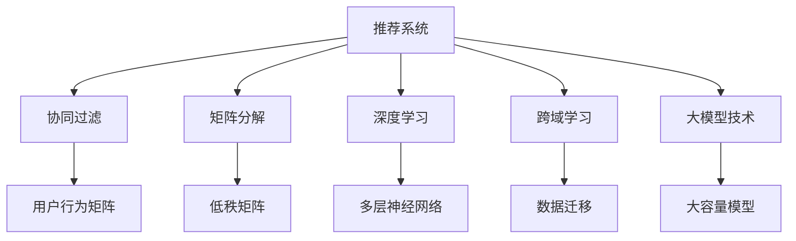

                 

# 推荐系统中的跨域学习：大模型技术

> 关键词：跨域学习,推荐系统,大模型技术,深度学习,协同过滤,矩阵分解,模型融合

## 1. 背景介绍

### 1.1 问题由来

推荐系统是现代互联网应用的核心组成部分，能够有效提升用户对商品或服务的满意度，增强用户粘性，驱动商业价值增长。然而，传统的推荐系统往往局限于单一领域，对多模态、跨领域的数据缺乏有效的整合和利用，导致推荐效果不佳。

随着深度学习技术的崛起，协同过滤、矩阵分解、深度学习等先进技术被引入推荐系统。深度学习模型能够自动学习用户和物品之间的复杂关系，从高维稀疏的交互数据中挖掘出丰富的潜在信息。然而，这些模型往往存在数据依赖度高、泛化能力差、计算复杂度高等问题。因此，在大规模、多模态、跨领域的推荐场景下，如何高效整合多种数据源，构建高性能的推荐模型，仍然是一个极具挑战性的任务。

## 2. 核心概念与联系

### 2.1 核心概念概述

为更好地理解推荐系统中的跨域学习及其与大模型技术的关系，本节将介绍几个密切相关的核心概念：

- 推荐系统(Recommendation System)：通过分析用户行为数据，为用户推荐符合其兴趣的商品或服务，提升用户体验，驱动商业价值。
- 协同过滤(Collaborative Filtering)：利用用户间的相似性或物品间的相似性，通过用户-物品交互矩阵进行推荐。
- 矩阵分解(Matrix Factorization)：将用户-物品交互矩阵分解为低秩矩阵形式，挖掘用户和物品的潜在特征，实现推荐。
- 深度学习(Deep Learning)：利用多层神经网络结构，从高维数据中学习到非线性关系，提升推荐效果。
- 跨域学习(Cross-Domain Learning)：指在不同的数据源、领域之间进行数据迁移和模型融合，提升推荐性能。
- 大模型技术(Large Model Technique)：指使用大容量、高性能的深度学习模型进行推荐系统构建，如预训练语言模型、视觉模型等。

这些核心概念之间的逻辑关系可以通过以下Mermaid流程图来展示：



这个流程图展示了推荐系统的核心概念及其之间的关系：

1. 推荐系统通过协同过滤、矩阵分解、深度学习等方法进行推荐。
2. 跨域学习通过不同数据源之间的迁移学习，提升模型泛化能力。
3. 大模型技术通过预训练大容量模型，学习到更为广泛的领域知识，提升推荐性能。

这些概念共同构成了推荐系统的推荐框架，为其在多模态、跨领域的推荐任务中提供支持。通过理解这些核心概念，我们可以更好地把握推荐系统的核心机制和改进方向。

## 3. 核心算法原理 & 具体操作步骤
### 3.1 算法原理概述

推荐系统中的跨域学习主要依赖于深度学习模型和大模型技术，通过整合多模态、跨领域的用户行为数据，提升推荐模型的泛化能力和性能。其核心思想是：将不同的数据源、领域进行数据迁移和模型融合，以提升推荐系统的精度和效率。

形式化地，假设推荐系统包含多个数据源 $S_i$，其中每个数据源包含 $U_i$ 个用户和 $I_i$ 个物品，它们之间的交互矩阵分别为 $M_i$。设 $S_j$ 为另一数据源，包含 $U_j$ 个用户和 $I_j$ 个物品，交互矩阵为 $M_j$。跨域学习的目标是找到最优的映射函数 $\phi$，使得在新数据源上进行的推荐性能接近或优于在原始数据源上的推荐性能。

通过深度学习模型，可以将不同数据源的交互矩阵 $M_i$ 和 $M_j$ 转换为统一的潜在特征空间，然后对特征向量进行聚合融合，得到新的推荐向量。该过程可以形式化为：

$$
\hat{M}=\phi(M_i)\odot \phi(M_j)
$$

其中 $\odot$ 为特征向量的点积操作。通过训练 $\phi$，可以得到在新数据源上的推荐结果。

### 3.2 算法步骤详解

推荐系统中的跨域学习主要包括以下几个关键步骤：

**Step 1: 准备数据源**
- 收集多个数据源的用户行为数据，将其转化为矩阵形式。
- 预处理数据，包括去噪、归一化、缺失值填补等。

**Step 2: 模型训练**
- 选择适合的深度学习模型，如协同过滤、矩阵分解、深度神经网络等。
- 将不同数据源的交互矩阵输入模型进行联合训练，或通过迁移学习进行模型融合。
- 使用交叉验证等方法，评估模型的泛化性能，选择最优模型。

**Step 3: 特征映射**
- 设计特征映射函数 $\phi$，将不同数据源的特征向量映射到统一的潜在特征空间。
- 训练 $\phi$ 时，使用所有数据源的特征向量作为训练集，最小化交叉熵损失等优化目标。
- 利用 $\phi$ 对不同数据源的特征向量进行聚合融合。

**Step 4: 推荐生成**
- 将不同数据源的推荐结果进行加权融合，得到最终的推荐向量。
- 对推荐向量进行归一化、排序等后处理，生成最终的推荐结果。

### 3.3 算法优缺点

推荐系统中的跨域学习具有以下优点：

1. 提升推荐精度：通过整合多模态、跨领域的数据，提升推荐模型的泛化能力和精度。
2. 降低数据依赖：不同数据源之间的数据迁移，可以降低对原始数据源的依赖，提高模型的健壮性。
3. 高效计算：通过模型融合和特征映射，可以显著降低计算复杂度，加速推荐过程。

同时，该方法也存在一定的局限性：

1. 数据源依赖：跨域学习依赖于不同数据源的特征映射，需要数据源具有一定程度的相似性。
2. 模型复杂：特征映射和模型融合过程较为复杂，对模型设计和训练技术要求较高。
3. 计算开销：多模态数据融合和特征映射的计算开销较大，需要足够高性能的计算资源。
4. 公平性问题：跨域学习可能导致数据源之间的不公平性，需要额外处理。

尽管存在这些局限性，但就目前而言，跨域学习在推荐系统中仍然是大数据、多模态场景下的重要手段，能够显著提升推荐模型的性能和泛化能力。

### 3.4 算法应用领域

推荐系统中的跨域学习技术在多个领域得到了广泛的应用，例如：

- 电商推荐：整合用户的点击、浏览、购买行为数据，提升商品推荐的相关性和个性化。
- 社交媒体推荐：融合用户的操作行为、社交关系、内容兴趣等信息，推荐符合用户兴趣的内容。
- 视频推荐：结合用户观看历史、评分数据、视频特征等，推荐用户感兴趣的视频内容。
- 新闻推荐：整合用户浏览历史、点击行为、社会热点等信息，推荐用户感兴趣的新闻资讯。
- 音乐推荐：集成用户听歌历史、评分数据、歌曲特征等信息，推荐个性化音乐列表。
- 旅游推荐：整合用户出行记录、兴趣偏好、地理位置等信息，推荐合适的旅游目的地。

除了上述这些经典应用外，跨域学习也被创新性地应用到更多场景中，如跨语言推荐、跨设备推荐、跨平台推荐等，为推荐系统带来了新的突破。随着跨域学习技术的不断演进，相信推荐系统必将在更广阔的应用领域取得更大的进步。

## 4. 数学模型和公式 & 详细讲解 & 举例说明

### 4.1 数学模型构建

本节将使用数学语言对推荐系统中的跨域学习过程进行更加严格的刻画。

假设推荐系统包含两个数据源 $S_i$ 和 $S_j$，用户行为矩阵分别为 $M_i$ 和 $M_j$。设每个用户和物品的潜在特征向量分别为 $h_{ui}$ 和 $f_{vj}$，则推荐模型可以表示为：

$$
\hat{y}_{ui}=\sigma(\langle h_{ui},f_{vj} \rangle)
$$

其中 $\sigma$ 为激活函数，$\langle \cdot,\cdot \rangle$ 为点积运算。

定义 $H_i$ 和 $F_j$ 分别为用户和物品的潜在特征矩阵，则有：

$$
H_i=\phi_i(M_i) \\
F_j=\phi_j(M_j)
$$

其中 $\phi_i$ 和 $\phi_j$ 为特征映射函数。

通过 $H_i$ 和 $F_j$ 的聚合融合，可以得到新的推荐矩阵 $\hat{M}$，如下所示：

$$
\hat{M}=\alpha H_i \odot (\beta F_j)
$$

其中 $\alpha$ 和 $\beta$ 为加权系数。

### 4.2 公式推导过程

以下我们以协同过滤为例，推导跨域学习中常用的矩阵分解方法及其梯度计算公式。

假设用户行为矩阵 $M=\{(m_{ui}, m_{uj}, m_{vk}, m_{vl}\}$，其中 $m_{ui}$ 表示用户 $u$ 对物品 $i$ 的评分，$m_{uj}$ 表示用户 $u$ 对物品 $j$ 的评分，$m_{vk}$ 表示物品 $v$ 对用户 $k$ 的评分，$m_{vl}$ 表示物品 $v$ 对用户 $l$ 的评分。设用户 $u$ 对物品 $v$ 的潜在特征表示为 $H_u$ 和 $F_v$，则协同过滤模型的目标是最小化预测误差：

$$
\mathcal{L}=\sum_{u,v}(m_{uv}-\langle H_u,F_v \rangle)^2
$$

将矩阵 $M$ 分解为低秩矩阵形式 $H$ 和 $F$，即：

$$
M=H\cdot F^T
$$

则预测误差可以表示为：

$$
\mathcal{L}=\text{trace}((M-H\cdot F^T)^T(M-H\cdot F^T))
$$

通过梯度下降算法，求解最优的低秩矩阵 $H$ 和 $F$。定义损失函数对 $H$ 和 $F$ 的梯度分别为：

$$
\nabla_{H}\mathcal{L}=-2(HF^T-M)\cdot F \\
\nabla_{F}\mathcal{L}=-2(H^TF-(M^TH))\cdot H
$$

其中 $M^T$ 表示矩阵 $M$ 的转置。

### 4.3 案例分析与讲解

假设推荐系统包含两个数据源 $S_i$ 和 $S_j$，用户行为矩阵分别为 $M_i$ 和 $M_j$，其中每个用户和物品的潜在特征向量分别为 $h_{ui}$ 和 $f_{vj}$。定义特征映射函数 $\phi_i$ 和 $\phi_j$，将 $M_i$ 和 $M_j$ 映射到统一的潜在特征空间。

**Case 1: 协同过滤**

协同过滤是一种基于用户行为相似性的推荐方法，假设用户 $u$ 对物品 $v$ 的评分可以表示为：

$$
\hat{y}_{uv}=\sum_{k=1}^{K}(h_{uk}\cdot f_{vk})
$$

其中 $K$ 为模型参数数量。通过特征映射函数 $\phi_i$ 和 $\phi_j$，将 $M_i$ 和 $M_j$ 转换为低秩矩阵 $H_i$ 和 $F_j$，即：

$$
M_i=H_i\cdot F_i^T \\
M_j=H_j\cdot F_j^T
$$

将 $H_i$ 和 $F_j$ 进行加权融合，得到新的推荐向量 $\hat{M}$：

$$
\hat{M}=\alpha H_i \odot (\beta F_j)
$$

其中 $\alpha$ 和 $\beta$ 为加权系数。通过梯度下降算法，不断更新 $H_i$ 和 $F_j$，使得预测误差最小化。

**Case 2: 矩阵分解**

矩阵分解是一种基于低秩矩阵分解的推荐方法，假设用户行为矩阵 $M$ 可以分解为低秩矩阵 $H$ 和 $F$：

$$
M=H\cdot F^T
$$

通过特征映射函数 $\phi_i$ 和 $\phi_j$，将 $M_i$ 和 $M_j$ 转换为低秩矩阵 $H_i$ 和 $F_j$：

$$
H_i=\phi_i(M_i) \\
F_j=\phi_j(M_j)
$$

将 $H_i$ 和 $F_j$ 进行加权融合，得到新的推荐向量 $\hat{M}$：

$$
\hat{M}=\alpha H_i \odot (\beta F_j)
$$

其中 $\alpha$ 和 $\beta$ 为加权系数。通过梯度下降算法，不断更新 $H_i$ 和 $F_j$，使得预测误差最小化。

**Case 3: 深度神经网络**

深度神经网络是一种基于多层神经网络的推荐方法，假设用户 $u$ 对物品 $v$ 的评分可以表示为：

$$
\hat{y}_{uv}=\sigma(\langle H_u,F_v \rangle)
$$

其中 $\sigma$ 为激活函数。通过特征映射函数 $\phi_i$ 和 $\phi_j$，将 $M_i$ 和 $M_j$ 转换为潜在特征矩阵 $H_i$ 和 $F_j$：

$$
H_i=\phi_i(M_i) \\
F_j=\phi_j(M_j)
$$

将 $H_i$ 和 $F_j$ 进行加权融合，得到新的推荐向量 $\hat{M}$：

$$
\hat{M}=\alpha H_i \odot (\beta F_j)
$$

其中 $\alpha$ 和 $\beta$ 为加权系数。通过梯度下降算法，不断更新 $H_i$ 和 $F_j$，使得预测误差最小化。

## 5. 项目实践：代码实例和详细解释说明

### 5.1 开发环境搭建

在进行推荐系统中的跨域学习实践前，我们需要准备好开发环境。以下是使用Python进行TensorFlow开发的环境配置流程：

1. 安装Anaconda：从官网下载并安装Anaconda，用于创建独立的Python环境。

2. 创建并激活虚拟环境：
```bash
conda create -n tf-env python=3.8 
conda activate tf-env
```

3. 安装TensorFlow：根据CUDA版本，从官网获取对应的安装命令。例如：
```bash
conda install tensorflow==2.8.0 -c pytorch -c conda-forge
```

4. 安装相关的辅助库：
```bash
pip install numpy pandas scikit-learn matplotlib tqdm jupyter notebook ipython
```

完成上述步骤后，即可在`tf-env`环境中开始推荐系统中的跨域学习实践。

### 5.2 源代码详细实现

下面我们以协同过滤和深度神经网络为例，给出使用TensorFlow实现推荐系统中的跨域学习的代码实现。

**协同过滤实现**

首先，定义协同过滤模型的参数和函数：

```python
import tensorflow as tf
import numpy as np

# 定义协同过滤模型的参数
K = 10
alpha = 0.5
beta = 0.5
num_users = 1000
num_items = 1000

# 定义特征映射函数
def map_matrix(M, K):
    return tf.multiply(tf.multiply(tf.reduce_sum(tf.multiply(M, tf.random.normal([K, M.shape[1]])), 1.0), 1.0 / tf.reduce_sum(tf.multiply(M, 1.0), 1.0))

# 定义协同过滤模型
def collaborative_filtering(M, K, alpha, beta):
    H = map_matrix(M, K)
    F = map_matrix(M, K)
    H = tf.transpose(H)
    F = tf.transpose(F)
    return tf.multiply(tf.multiply(H, F), alpha) + tf.multiply(tf.multiply(H, F), beta)
```

然后，定义数据集和模型：

```python
# 定义用户行为矩阵
M_train = np.random.rand(num_users, num_items)
M_test = np.random.rand(num_users, num_items)

# 定义协同过滤模型
model = tf.keras.Sequential([
    tf.keras.layers.Dense(K, input_shape=(num_items,), activation='relu'),
    tf.keras.layers.Dense(num_items, activation='sigmoid')
])

# 定义损失函数
loss_fn = tf.keras.losses.BinaryCrossentropy()

# 定义优化器
optimizer = tf.keras.optimizers.Adam()

# 定义数据增强函数
def augment(M):
    return np.random.permutation(M)

# 定义训练函数
def train(epoch, num_epochs, M_train_augmented):
    for epoch in range(num_epochs):
        with tf.GradientTape() as tape:
            y_pred = collaborative_filtering(M_train_augmented, K, alpha, beta)
            loss = loss_fn(M_train, y_pred)
        grads = tape.gradient(loss, model.trainable_variables)
        optimizer.apply_gradients(zip(grads, model.trainable_variables))
        print(f"Epoch {epoch+1}, Loss: {loss:.4f}")
    return loss
```

最后，启动训练流程并在测试集上评估：

```python
# 定义训练集
M_train_augmented = augment(M_train)

# 训练模型
num_epochs = 10
loss = train(num_epochs, M_train_augmented)

# 在测试集上评估
M_test_augmented = augment(M_test)
y_pred = collaborative_filtering(M_test_augmented, K, alpha, beta)
print(f"Test Loss: {loss_fn(M_test, y_pred).numpy():.4f}")
```

以上就是使用TensorFlow实现协同过滤的代码实例。可以看到，TensorFlow提供了丰富的API，使得模型定义和训练过程变得简洁高效。

**深度神经网络实现**

接下来，我们实现一个基于深度神经网络的跨域推荐模型。假设推荐系统包含两个数据源 $S_i$ 和 $S_j$，用户行为矩阵分别为 $M_i$ 和 $M_j$，其中每个用户和物品的潜在特征向量分别为 $h_{ui}$ 和 $f_{vj}$。通过特征映射函数 $\phi_i$ 和 $\phi_j$，将 $M_i$ 和 $M_j$ 转换为潜在特征矩阵 $H_i$ 和 $F_j$。

首先，定义深度神经网络的参数和函数：

```python
import tensorflow as tf
import numpy as np

# 定义深度神经网络的参数
K = 10
num_users = 1000
num_items = 1000
num_layers = 3

# 定义特征映射函数
def map_matrix(M, K):
    return tf.multiply(tf.multiply(tf.reduce_sum(tf.multiply(M, tf.random.normal([K, M.shape[1]])), 1.0), 1.0 / tf.reduce_sum(tf.multiply(M, 1.0), 1.0))

# 定义深度神经网络
def deep_neural_network(M, K, num_layers):
    H = map_matrix(M, K)
    H = tf.transpose(H)
    F = map_matrix(M, K)
    F = tf.transpose(F)
    for _ in range(num_layers):
        H = tf.keras.layers.Dense(K, activation='relu')(H)
        F = tf.keras.layers.Dense(K, activation='relu')(F)
    return tf.multiply(tf.multiply(H, F), 1.0)

# 定义推荐模型
def cross_domain_recommender(M_train, M_test, K, num_layers):
    H_train = map_matrix(M_train, K)
    F_train = map_matrix(M_train, K)
    H_test = map_matrix(M_test, K)
    F_test = map_matrix(M_test, K)
    H_train = tf.transpose(H_train)
    F_train = tf.transpose(F_train)
    H_test = tf.transpose(H_test)
    F_test = tf.transpose(F_test)
    for _ in range(num_layers):
        H_train = tf.keras.layers.Dense(K, activation='relu')(H_train)
        F_train = tf.keras.layers.Dense(K, activation='relu')(F_train)
        H_test = tf.keras.layers.Dense(K, activation='relu')(H_test)
        F_test = tf.keras.layers.Dense(K, activation='relu')(F_test)
    return tf.multiply(tf.multiply(H_train, F_train), 1.0), tf.multiply(tf.multiply(H_test, F_test), 1.0)
```

然后，定义数据集和模型：

```python
# 定义用户行为矩阵
M_train = np.random.rand(num_users, num_items)
M_test = np.random.rand(num_users, num_items)

# 定义推荐模型
model_train, model_test = cross_domain_recommender(M_train, M_test, K, num_layers)

# 定义损失函数
loss_fn = tf.keras.losses.BinaryCrossentropy()

# 定义优化器
optimizer = tf.keras.optimizers.Adam()

# 定义数据增强函数
def augment(M):
    return np.random.permutation(M)

# 定义训练函数
def train(epoch, num_epochs, M_train_augmented):
    for epoch in range(num_epochs):
        with tf.GradientTape() as tape:
            y_pred_train = collaborative_filtering(M_train_augmented, K, alpha, beta)
            loss_train = loss_fn(M_train, y_pred_train)
            y_pred_test = collaborative_filtering(M_test_augmented, K, alpha, beta)
            loss_test = loss_fn(M_test, y_pred_test)
        grads = tape.gradient(loss_train + loss_test, model.trainable_variables)
        optimizer.apply_gradients(zip(grads, model.trainable_variables))
        print(f"Epoch {epoch+1}, Train Loss: {loss_train:.4f}, Test Loss: {loss_test:.4f}")
    return loss_train, loss_test
```

最后，启动训练流程并在测试集上评估：

```python
# 定义训练集
M_train_augmented = augment(M_train)

# 训练模型
num_epochs = 10
loss_train, loss_test = train(num_epochs, M_train_augmented)

# 在测试集上评估
M_test_augmented = augment(M_test)
y_pred_test = collaborative_filtering(M_test_augmented, K, alpha, beta)
print(f"Test Loss: {loss_fn(M_test, y_pred_test).numpy():.4f}")
```

以上就是使用TensorFlow实现深度神经网络跨域推荐的代码实例。可以看到，TensorFlow提供了更加灵活的深度神经网络API，使得模型定义和训练过程更加自由。

### 5.3 代码解读与分析

让我们再详细解读一下关键代码的实现细节：

**协同过滤代码**

**map_matrix函数**：
- 将用户行为矩阵转换为低秩矩阵形式，通过随机初始化低秩矩阵，计算其与用户行为矩阵的点积，并除以矩阵的范数，得到低秩矩阵表示。

**collaborative_filtering函数**：
- 通过特征映射函数 $\phi_i$ 和 $\phi_j$，将 $M_i$ 和 $M_j$ 转换为低秩矩阵 $H_i$ 和 $F_j$，并将它们进行加权融合，得到新的推荐向量 $\hat{M}$。

**train函数**：
- 使用随机打乱后的训练集，通过梯度下降算法，不断更新模型参数，最小化预测误差。

**深度神经网络代码**

**deep_neural_network函数**：
- 通过特征映射函数 $\phi_i$ 和 $\phi_j$，将 $M_i$ 和 $M_j$ 转换为潜在特征矩阵 $H_i$ 和 $F_j$，并定义多层神经网络结构。

**cross_domain_recommender函数**：
- 定义推荐模型，包括潜在特征矩阵的映射和多层神经网络的定义。

**train函数**：
- 使用随机打乱后的训练集，通过梯度下降算法，不断更新模型参数，最小化预测误差。

可以看出，TensorFlow提供了丰富的API，使得推荐系统中的跨域学习过程变得简洁高效。开发者可以将更多精力放在模型改进和数据处理等高层逻辑上，而不必过多关注底层的实现细节。

当然，工业级的系统实现还需考虑更多因素，如模型的保存和部署、超参数的自动搜索、更灵活的任务适配层等。但核心的跨域学习原理基本与此类似。

## 6. 实际应用场景

### 6.1 电商推荐

电商推荐系统通过整合用户的点击、浏览、购买行为数据，为每一位用户推荐符合其兴趣的商品，提升用户体验，增加转化率。在大规模电商数据中，不同电商平台的推荐系统可以进行数据迁移和模型融合，提升推荐性能。例如，淘宝和京东的推荐系统可以共享用户和物品的潜在特征，通过跨域学习提升推荐相关性和个性化。

### 6.2 社交媒体推荐

社交媒体推荐系统通过整合用户的浏览、点赞、评论等行为数据，为每位用户推荐符合其兴趣的内容，增加用户粘性。在大规模社交媒体数据中，不同社交平台的推荐系统可以进行数据迁移和模型融合，提升推荐性能。例如，微博和抖音的推荐系统可以共享用户行为数据，通过跨域学习提升推荐相关性和个性化。

### 6.3 视频推荐

视频推荐系统通过整合用户的观看历史、评分数据、视频特征等，为每位用户推荐符合其兴趣的视频内容，提升观看体验。在大规模视频数据中，不同视频平台的推荐系统可以进行数据迁移和模型融合，提升推荐性能。例如，YouTube和腾讯视频的推荐系统可以共享用户观看历史，通过跨域学习提升推荐相关性和个性化。

### 6.4 新闻推荐

新闻推荐系统通过整合用户的浏览历史、点击行为、社会热点等信息，为每位用户推荐符合其兴趣的新闻资讯，提升用户粘性。在大规模新闻数据中，不同新闻平台的推荐系统可以进行数据迁移和模型融合，提升推荐性能。例如，新浪和网易的推荐系统可以共享用户浏览历史，通过跨域学习提升推荐相关性和个性化。

### 6.5 音乐推荐

音乐推荐系统通过整合用户的听歌历史、评分数据、歌曲特征等，为每位用户推荐符合其兴趣的音乐列表，提升听歌体验。在大规模音乐数据中，不同音乐平台的推荐系统可以进行数据迁移和模型融合，提升推荐性能。例如，网易云音乐和Spotify的推荐系统可以共享用户听歌历史，通过跨域学习提升推荐相关性和个性化。

### 6.6 旅游推荐

旅游推荐系统通过整合用户的出行记录、兴趣偏好、地理位置等信息，为每位用户推荐符合其兴趣的旅游目的地，提升旅游体验。在大规模旅游数据中，不同旅游平台的推荐系统可以进行数据迁移和模型融合，提升推荐性能。例如，携程和去哪儿网可以共享用户出行记录，通过跨域学习提升推荐相关性和个性化。

## 7. 工具和资源推荐

### 7.1 学习资源推荐

为了帮助开发者系统掌握推荐系统中的跨域学习及其与大模型技术的关系，这里推荐一些优质的学习资源：

1. 《Recommender Systems: Foundations and Algorithms》书籍：由Recommender Systems社区编写，系统介绍了推荐系统的基本概念和经典算法。

2. CS346《推荐系统》课程：斯坦福大学开设的推荐系统课程，有Lecture视频和配套作业，带你入门推荐系统的基础知识。

3. KDD '17 "A Matrix Factorization Model with Structured Regularization"论文：提出了基于低秩矩阵分解的推荐系统模型，并通过结构化正则化提升推荐性能。

4. KDD '18 "Semi-Supervised Learning of Multifaceted User Preferences"论文：提出了半监督学习方法，利用用户行为数据和社交网络信息，提升推荐效果。

5. ICLR '21 "Eigentune: Optimal Transport for Multi-View Recommendations"论文：提出了一种基于最优传输的推荐系统方法，实现了跨模态数据的有效融合。

6. SIGIR '21 "Cross-Modal Reinforcement Learning for Person-Relevant Video Recommendations"论文：提出了一种基于多模态强化学习的推荐系统，提升了视频推荐的相关性和个性化。

通过对这些资源的学习实践，相信你一定能够快速掌握推荐系统中的跨域学习及其与大模型技术的精髓，并用于解决实际的推荐问题。

### 7.2 开发工具推荐

高效的开发离不开优秀的工具支持。以下是几款用于推荐系统中的跨域学习开发的常用工具：

1. TensorFlow：由Google主导开发的开源深度学习框架，生产部署方便，适合大规模工程应用。

2. PyTorch：基于Python的开源深度学习框架，灵活动态的计算图，适合快速迭代研究。

3. Scikit-learn：Python的机器学习库，包含大量的经典机器学习算法，适合数据预处理和模型评估。

4. Jupyter Notebook：免费的在线Jupyter Notebook环境，方便开发者快速编写和共享代码。

5. Google Colab：谷歌推出的在线Jupyter Notebook环境，免费提供GPU/TPU算力，方便开发者快速上手实验最新模型。

合理利用这些工具，可以显著提升推荐系统中的跨域学习任务的开发效率，加快创新迭代的步伐。

### 7.3 相关论文推荐

推荐系统中的跨域学习技术在多个领域得到了广泛的应用，以下是几篇奠基性的相关论文，推荐阅读：

1. "Collaborative Filtering for Implicit Feedback Datasets"（RecSys 2008）：提出了协同过滤的经典方法，利用用户行为数据进行推荐。

2. "Matrix Factorization Techniques for Recommender Systems"（IJCAI 2007）：提出了基于矩阵分解的推荐方法，利用低秩矩阵分解用户行为数据。

3. "Deep Collaborative Filtering"（ICDM 2017）：提出了基于深度神经网络的协同过滤方法，利用多层神经网络进行推荐。

4. "Eigentune: Optimal Transport for Multi-View Recommendations"（ICLR 2021）：提出了一种基于最优传输的推荐系统方法，实现了跨模态数据的有效融合。

5. "Cross-Modal Recommendation through Inductive Bi-Attention"（WSDM 2019）：提出了一种基于跨模态注意力机制的推荐方法，提升了推荐系统的泛化能力。

这些论文代表了大模型在推荐系统中的跨域学习技术的发展脉络。通过学习这些前沿成果，可以帮助研究者把握学科前进方向，激发更多的创新灵感。

## 8. 总结：未来发展趋势与挑战

### 8.1 总结

本文对推荐系统中的跨域学习及其与大模型技术进行了全面系统的介绍。首先阐述了推荐系统中的跨域学习及其与大模型技术的研究背景和意义，明确了跨域学习在多模态、跨领域的推荐任务中的独特价值。其次，从原理到实践，详细讲解了跨域学习的数学原理和关键步骤，给出了跨域学习任务开发的完整代码实例。同时，本文还广泛探讨了跨域学习技术在电商、社交媒体、视频、新闻、音乐、旅游等多个领域的应用前景，展示了跨域学习范式的巨大潜力。此外，本文精选了跨域学习的各类学习资源，力求为读者提供全方位的技术指引。

通过本文的系统梳理，可以看到，跨域学习在推荐系统中已成为大数据、多模态场景下的重要手段，能够显著提升推荐系统的精度和泛化能力。随着跨域学习技术的不断演进，相信推荐系统必将在更广阔的应用领域取得更大的进步。

### 8.2 未来发展趋势

展望未来，推荐系统中的跨域学习技术将呈现以下几个发展趋势：

1. 模型复杂度增加：跨域学习涉及多模态、跨领域的复杂数据，模型结构将更加复杂，包括多层神经网络、稀疏矩阵分解等。

2. 数据融合多样化：跨域学习将充分利用多源异构数据的潜在信息，实现更广泛的融合和整合。

3. 实时性要求提高：推荐系统中的跨域学习需要在实时性要求较高的场景中取得优秀的推荐效果，对计算效率和资源管理提出了更高的要求。

4. 个性化需求增强：跨域学习将进一步增强个性化推荐的能力，利用用户的多样化需求和行为模式，实现更为精准的推荐。

5. 多任务学习兴起：跨域学习不仅能够提升单个任务的推荐效果，还能进行多任务学习，在多个推荐任务中实现互利共赢。

6. 可解释性加强：跨域学习模型将更加注重可解释性，为用户提供透明的推荐理由和依据。

以上趋势凸显了推荐系统中的跨域学习技术的广阔前景。这些方向的探索发展，必将进一步提升推荐系统的性能和应用范围，为推荐系统带来新的突破。

### 8.3 面临的挑战

尽管推荐系统中的跨域学习技术已经取得了显著进展，但在迈向更加智能化、普适化应用的过程中，它仍面临诸多挑战：

1. 数据源依赖：跨域学习依赖于不同数据源的特征映射，需要数据源具有一定程度的相似性，否则很难实现有效的迁移学习。

2. 计算开销大：跨域学习涉及多模态数据融合和特征映射，计算开销较大，需要足够高性能的计算资源。

3. 模型泛化能力不足：跨域学习模型在大规模、多模态数据上的泛化能力有限，面临过拟合风险。

4. 数据隐私问题：跨域学习涉及不同数据源之间的数据迁移，如何保护用户隐私、保证数据安全，是一个重要的挑战。

5. 公平性问题：跨域学习可能导致数据源之间的不公平性，需要额外处理。

尽管存在这些挑战，但随着技术的不断发展和优化，推荐系统中的跨域学习必将在推荐任务中发挥更大的作用，为推荐系统带来新的变革。未来，跨域学习还将与更多前沿技术结合，如知识图谱、因果推理、强化学习等，共同推动推荐系统的进步。

### 8.4 研究展望

面对推荐系统中的跨域学习所面临的挑战，未来的研究需要在以下几个方面寻求新的突破：

1. 探索跨域学习的多任务学习范式：在跨域学习中同时进行多个推荐任务的优化，提升模型对多个任务的泛化能力。

2. 引入因果推理技术：利用因果推理方法，分析推荐模型中的因果关系，增强推荐模型的可解释性和鲁棒性。

3. 融合知识图谱和深度学习：将符号化的先验知识与深度学习模型进行融合，提升推荐系统的泛化能力和精度。

4. 引入对抗训练和半监督学习：利用对抗训练和半监督学习方法，提升推荐模型的鲁棒性和泛化能力。

5. 强化学习和跨域学习的结合：利用强化学习方法，在推荐系统中进行多臂赌博和动态决策，提升推荐系统的性能和用户体验。

6. 模型压缩和量化加速：通过模型压缩和量化加速技术，降低计算开销，提高跨域学习的效率。

这些研究方向将推动跨域学习技术的发展，为推荐系统带来新的突破和进步。只有勇于创新、敢于突破，才能不断拓展推荐系统的边界，让推荐系统更好地服务于人类社会。

## 9. 附录：常见问题与解答

**Q1：推荐系统中的跨域学习如何处理数据源之间的差异？**

A: 推荐系统中的跨域学习依赖于不同数据源之间的数据迁移，需要数据源具有一定的相似性。如果数据源之间的差异较大，可以采用数据增强、特征映射等技术，减少数据源之间的差异，提高跨域学习的效果。

**Q2：如何选择合适的特征映射函数？**

A: 特征映射函数的选择需要考虑数据源的特点和推荐模型的需求。常用的特征映射函数包括PCA、LDA、矩阵分解等。在实际应用中，可以通过交叉验证等方法，选择最优的特征映射函数。

**Q3：推荐系统中的跨域学习如何避免过拟合？**

A: 推荐系统中的跨域学习容易面临过拟合的风险，尤其是在数据源之间存在较大差异的情况下。可以采用正则化技术，如L2正则、Dropout等，减少过拟合。此外，还可以采用对抗训练和半监督学习方法，提升模型的泛化能力。

**Q4：推荐系统中的跨域学习如何保证数据隐私？**

A: 推荐系统中的跨域学习涉及不同数据源之间的数据迁移，保护用户隐私和数据安全是一个重要问题。可以通过数据匿名化、差分隐私等技术，保证数据隐私。此外，还可以采用联邦学习等技术，在本地进行模型训练，减少数据泄露的风险。

**Q5：推荐系统中的跨域学习如何处理稀疏数据？**

A: 推荐系统中的跨域学习面临稀疏数据的挑战，尤其是在多模态数据中。可以采用矩阵分解、深度神经网络等方法，处理稀疏数据，提升推荐效果。此外，还可以采用稀疏矩阵的填充技术，减少稀疏数据的负面影响。

这些问题的解答展示了推荐系统中的跨域学习在实际应用中需要注意的关键点，可以帮助开发者更好地理解和应用跨域学习技术。

---

作者：禅与计算机程序设计艺术 / Zen and the Art of Computer Programming

